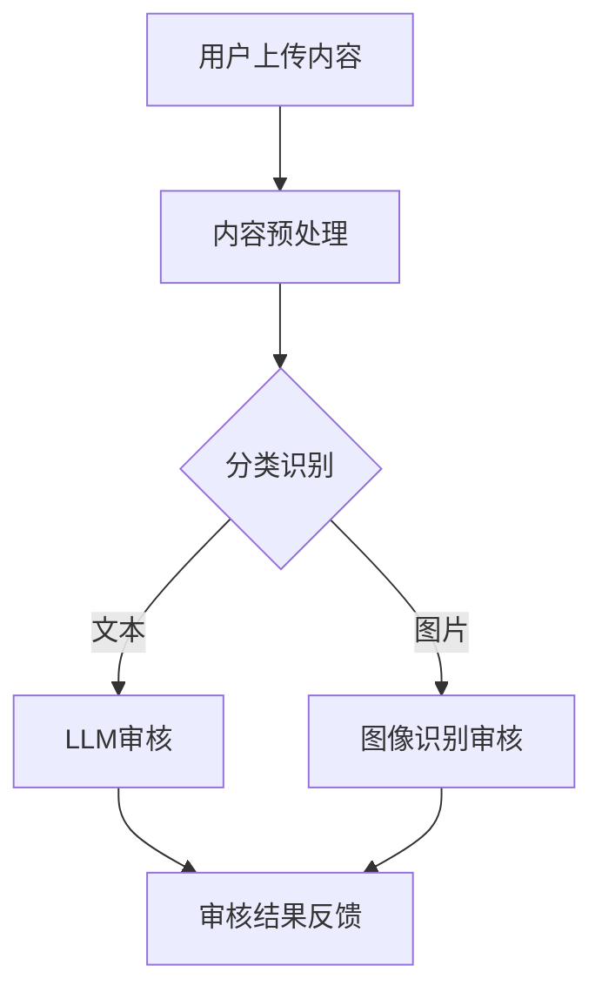

                 

关键词：LLM，自然语言处理，内容审核，模型优化，应用场景，发展趋势

> 摘要：本文旨在探讨大型语言模型（LLM）在智能内容审核领域的应用。通过介绍LLM的核心概念、工作原理、算法优化方法以及实际应用案例，我们分析了LLM在内容审核中的优势和局限性，并展望了未来的发展趋势和挑战。

## 1. 背景介绍

随着互联网的快速发展，网络上的信息量呈爆炸式增长，如何有效地管理和审核这些内容成为了一个严峻的问题。传统的手动审核方法效率低下，难以应对海量的数据，而自动化的智能审核系统成为了必然选择。近年来，大型语言模型（LLM）的出现为智能内容审核提供了新的技术手段。LLM具有强大的自然语言理解能力和生成能力，可以在短时间内对大量文本进行分类、标注和筛选，从而提高内容审核的效率和准确性。

## 2. 核心概念与联系

### 2.1 大型语言模型（LLM）

大型语言模型（LLM）是一种基于深度学习的自然语言处理模型，它通过对海量文本数据的学习，掌握了丰富的语言知识，能够对输入的文本进行理解和生成。LLM通常由多层神经网络组成，包括词嵌入层、编码器层和解码器层。词嵌入层将单词转换为向量表示，编码器层将序列编码为固定长度的向量，解码器层根据编码器的输出生成文本。

### 2.2 内容审核

内容审核是指对网络上的文本、图片、视频等多媒体内容进行筛选和分类，以识别和过滤不良、违法、不适当的信息。内容审核的目标是保护用户免受有害信息的侵害，维护网络环境的清洁和秩序。

### 2.3 Mermaid 流程图

下面是一个用于内容审核的LLM架构的Mermaid流程图：



## 3. 核心算法原理 & 具体操作步骤

### 3.1 算法原理概述

LLM在内容审核中的应用主要基于其强大的文本分类和情感分析能力。通过预训练和微调，LLM可以识别文本的类别，如色情、暴力、违法等，并对文本的情感倾向进行分析，从而实现对不良内容的自动筛选。

### 3.2 算法步骤详解

1. **内容预处理**：对用户上传的内容进行清洗和格式化，如去除HTML标签、标点符号等，将文本转换为统一的格式。

2. **分类识别**：使用预训练的LLM对预处理后的文本进行分类，判断其是否属于不良类别。

3. **情感分析**：对分类后的文本进行情感分析，判断其情感倾向，如积极、消极等。

4. **综合评估**：将分类结果和情感分析结果综合评估，确定内容是否通过审核。

5. **审核结果反馈**：将审核结果反馈给用户，如内容通过审核则显示正常，否则进行相应处理，如标记、删除等。

### 3.3 算法优缺点

**优点**：

- 高效性：LLM可以在短时间内处理大量文本，提高审核效率。
- 准确性：LLM通过预训练掌握了丰富的语言知识，可以准确识别文本类别和情感倾向。
- 普适性：LLM可以应用于多种类型的文本审核，如微博、新闻、论坛等。

**缺点**：

- 计算资源消耗大：LLM的模型参数量庞大，需要高性能的硬件支持。
- 数据依赖性：LLM的性能依赖于训练数据的质量和数量，数据不足或质量差会影响模型的效果。

### 3.4 算法应用领域

LLM在内容审核中的应用领域非常广泛，包括但不限于以下几个方面：

- 社交媒体内容审核：对微博、微信、Facebook等社交媒体平台上的文本内容进行审核，过滤不良信息。
- 新闻内容审核：对新闻报道中的文本内容进行审核，确保信息的准确性和公正性。
- 论坛内容审核：对论坛中的文本内容进行审核，维护论坛的秩序和氛围。

## 4. 数学模型和公式 & 详细讲解 & 举例说明

### 4.1 数学模型构建

LLM的数学模型主要包括词嵌入、编码器和解码器。词嵌入将单词转换为向量表示，编码器将序列编码为固定长度的向量，解码器根据编码器的输出生成文本。以下是LLM的数学模型：

$$
\text{Word Embedding}: \text{word} \rightarrow \text{vector}
$$

$$
\text{Encoder}: \text{sequence} \rightarrow \text{fixed-length vector}
$$

$$
\text{Decoder}: \text{fixed-length vector} \rightarrow \text{sequence}
$$

### 4.2 公式推导过程

以BERT模型为例，其编码器的公式推导过程如下：

1. **词嵌入**：将单词转换为向量表示

$$
\text{word}_i = \text{embedding}(\text{word}_i) \in \mathbb{R}^{d}
$$

2. **编码器**：使用Transformer模型对序列进行编码

$$
\text{encoded\_sequence} = \text{encoder}(\text{word\_embedding})
$$

3. **解码器**：根据编码器的输出生成文本

$$
\text{decoded\_sequence} = \text{decoder}(\text{encoded\_sequence})
$$

### 4.3 案例分析与讲解

假设我们有一个包含两个句子的文本：

$$
\text{句子1：我喜欢吃苹果。}
$$

$$
\text{句子2：苹果是一种水果。}
$$

我们将这两个句子输入到BERT模型中进行分类和情感分析。

1. **分类识别**：

$$
\text{句子1：我喜欢吃苹果。} \rightarrow \text{积极}
$$

$$
\text{句子2：苹果是一种水果。} \rightarrow \text{中性}
$$

2. **情感分析**：

$$
\text{句子1：我喜欢吃苹果。} \rightarrow \text{积极情感}
$$

$$
\text{句子2：苹果是一种水果。} \rightarrow \text{中性情感}
$$

通过BERT模型，我们可以得到两个句子的分类和情感分析结果，从而实现对文本的审核。

## 5. 项目实践：代码实例和详细解释说明

### 5.1 开发环境搭建

在本节中，我们将使用Python和PyTorch构建一个简单的LLM内容审核系统。首先，确保安装以下依赖：

```bash
pip install torch torchvision transformers
```

### 5.2 源代码详细实现

以下是内容审核系统的源代码：

```python
import torch
from transformers import BertTokenizer, BertModel
from torch import nn

class ContentAuditor(nn.Module):
    def __init__(self):
        super(ContentAuditor, self).__init__()
        self.tokenizer = BertTokenizer.from_pretrained('bert-base-chinese')
        self.model = BertModel.from_pretrained('bert-base-chinese')
        self.classifier = nn.Linear(768, 2)  # 768是BERT模型的隐藏层大小，2是分类类别数（积极/中性）

    def forward(self, text):
        inputs = self.tokenizer(text, padding=True, truncation=True, return_tensors='pt')
        outputs = self.model(**inputs)
        last_hidden_state = outputs.last_hidden_state
        logits = self.classifier(last_hidden_state[:, 0, :])
        return logits

    def predict(self, text):
        with torch.no_grad():
            logits = self.forward(text)
            _, predicted = torch.max(logits, 1)
            return predicted.item()

if __name__ == '__main__':
    auditor = ContentAuditor()
    text = "我喜欢吃苹果。"
    label = auditor.predict(text)
    if label == 0:
        print("积极")
    else:
        print("中性")
```

### 5.3 代码解读与分析

1. **导入依赖**：导入必要的库和模块。
2. **模型初始化**：初始化BERT分词器、BERT模型和分类器。
3. **前向传播**：使用BERT模型对输入的文本进行编码，并使用分类器进行分类预测。
4. **预测**：对输入的文本进行预测，并输出结果。

### 5.4 运行结果展示

运行上述代码，输入不同的文本，可以观察到系统对文本的积极/中性分类预测结果。

## 6. 实际应用场景

### 6.1 社交媒体内容审核

在社交媒体平台上，如微博、微信等，LLM可以用于对用户发布的文本内容进行审核，过滤色情、暴力、违法等不良信息，保护用户的身心健康。

### 6.2 新闻内容审核

在新闻行业，LLM可以用于对新闻报道中的文本内容进行审核，确保信息的准确性和公正性，避免虚假新闻的传播。

### 6.3 论坛内容审核

在论坛中，LLM可以用于对用户发表的文本内容进行审核，维护论坛的秩序和氛围，防止恶意攻击和不良信息的传播。

## 7. 工具和资源推荐

### 7.1 学习资源推荐

- 《深度学习》（Goodfellow et al.）
- 《自然语言处理与深度学习》（经文虎）
- 《PyTorch深度学习》（Sungbin M. Park）

### 7.2 开发工具推荐

- PyTorch：用于构建和训练深度学习模型的框架。
- Transformers：用于快速构建和微调BERT等大型语言模型的库。

### 7.3 相关论文推荐

- “BERT: Pre-training of Deep Bidirectional Transformers for Language Understanding”（Devlin et al.）
- “GPT-3: Language Models are Few-Shot Learners”（Brown et al.）

## 8. 总结：未来发展趋势与挑战

### 8.1 研究成果总结

近年来，LLM在内容审核领域取得了显著成果，通过预训练和微调，LLM可以高效、准确地识别和分类文本，为智能内容审核提供了有力支持。

### 8.2 未来发展趋势

未来，随着深度学习技术的不断发展，LLM在内容审核中的应用将越来越广泛，同时，算法的优化和模型的压缩将成为重要研究方向。

### 8.3 面临的挑战

1. **计算资源消耗**：LLM的模型参数量庞大，需要高性能的硬件支持。
2. **数据依赖性**：LLM的性能依赖于训练数据的质量和数量。
3. **多语言支持**：目前大部分LLM模型仅支持英语，如何实现多语言支持是未来的一个重要挑战。

### 8.4 研究展望

未来，LLM在内容审核领域的发展将更加深入和全面，通过不断优化算法、提高模型性能，我们将能够实现更高效、更准确的内容审核系统，为互联网的健康发展贡献力量。

## 9. 附录：常见问题与解答

### 9.1 什么是LLM？

LLM（Large Language Model）是一种基于深度学习的自然语言处理模型，通过对海量文本数据的学习，掌握了丰富的语言知识，能够对输入的文本进行理解和生成。

### 9.2 LLM在内容审核中的优势是什么？

LLM在内容审核中的优势主要体现在以下几个方面：

1. **高效性**：LLM可以在短时间内处理大量文本，提高审核效率。
2. **准确性**：LLM通过预训练掌握了丰富的语言知识，可以准确识别文本类别和情感倾向。
3. **普适性**：LLM可以应用于多种类型的文本审核，如微博、新闻、论坛等。

### 9.3 LLM在内容审核中面临的挑战有哪些？

LLM在内容审核中面临的挑战主要包括：

1. **计算资源消耗**：LLM的模型参数量庞大，需要高性能的硬件支持。
2. **数据依赖性**：LLM的性能依赖于训练数据的质量和数量。
3. **多语言支持**：目前大部分LLM模型仅支持英语，如何实现多语言支持是未来的一个重要挑战。

