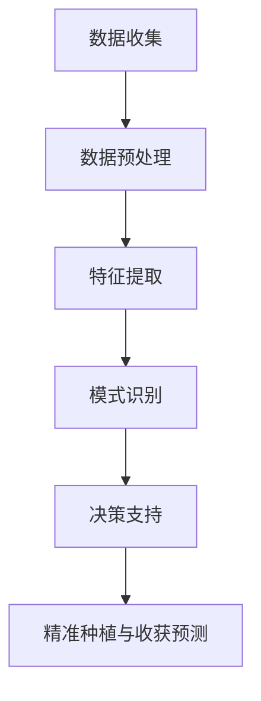

                 

关键词：LLM，智能农业，精准种植，收获预测，AI，农业科技

## 摘要

本文将深入探讨大型语言模型（LLM）在智能农业领域中的应用，特别是其在精准种植和收获预测方面的潜力。随着人工智能技术的不断发展，LLM在数据处理、模式识别和决策支持方面表现出了巨大的优势。本文将首先介绍LLM的基本概念和原理，然后详细讨论其在智能农业中的应用场景，包括精准种植和收获预测的方法、步骤和效果。此外，本文还将分析LLM在农业领域的优势与挑战，并展望未来的发展趋势。

## 1. 背景介绍

### 智能农业的定义和发展

智能农业是指利用现代信息技术、物联网、大数据、人工智能等手段，对农业生产过程进行智能化管理，以提高农业生产效率、减少资源浪费、提高农产品质量和安全性。智能农业的核心在于将农业生产从传统的经验型向数据驱动型转变，实现精准农业、智慧农业。

近年来，智能农业得到了广泛关注和快速发展。一方面，全球人口增长和资源短缺问题日益突出，需要提高农业生产的效率和质量；另一方面，信息技术的快速发展为农业提供了新的手段和工具。据统计，到2025年，全球智能农业市场规模有望达到2500亿美元。

### LLM的基本概念和原理

大型语言模型（LLM）是指具有数亿甚至数十亿参数的语言模型，如GPT、BERT等。LLM通过学习大量的文本数据，可以理解和生成自然语言，具有强大的文本处理能力和语义理解能力。

LLM的工作原理主要基于深度学习和神经网络。首先，LLM通过预训练过程学习大量文本数据，提取语言特征和模式；然后，通过微调过程将模型应用于特定任务，如文本分类、情感分析、机器翻译等。

### 智能农业与LLM的关系

智能农业中的许多任务，如气象预测、作物病害识别、土壤质量分析等，本质上都是对自然语言文本数据的处理。LLM在这方面的优势使得其在智能农业中具有广泛的应用前景。通过LLM，农业专家可以更加精准地分析数据、预测作物生长状况和产量，从而实现精准种植和收获预测。

## 2. 核心概念与联系

### 数据处理与分析

在智能农业中，数据处理和分析是关键环节。LLM在这一环节中发挥着重要作用，主要包括以下方面：

1. **数据收集**：通过传感器、无人机、卫星等设备收集土壤、气象、作物生长等数据。
2. **数据预处理**：使用LLM对数据进行清洗、去噪、归一化等处理，确保数据质量。
3. **特征提取**：使用LLM从原始数据中提取关键特征，如温度、湿度、土壤酸碱度等。

### 模式识别

模式识别是智能农业中的一个重要任务，如作物病害识别、气象预测等。LLM在这一任务中具有强大的能力，可以通过学习大量历史数据，识别出不同病害的特征和趋势，从而实现精确预测。

### 决策支持

LLM在智能农业中还可以提供决策支持，如精准施肥、灌溉等。通过分析土壤、气象、作物生长等数据，LLM可以给出最佳种植策略，提高农业生产效率。

### 核心概念原理和架构

下面是一个简单的Mermaid流程图，展示了LLM在智能农业中的核心概念和架构：



## 3. 核心算法原理 & 具体操作步骤

### 3.1 算法原理概述

LLM在智能农业中的应用主要基于其强大的文本处理和语义理解能力。具体来说，LLM可以通过以下步骤实现精准种植和收获预测：

1. **数据收集**：收集土壤、气象、作物生长等数据。
2. **数据预处理**：对数据进行清洗、去噪、归一化等处理。
3. **特征提取**：从原始数据中提取关键特征，如温度、湿度、土壤酸碱度等。
4. **模式识别**：使用LLM识别作物生长状况和病害特征。
5. **决策支持**：根据模式识别结果，给出最佳种植策略。

### 3.2 算法步骤详解

#### 3.2.1 数据收集

数据收集是智能农业中的基础环节。可以通过以下方式收集数据：

1. **传感器**：安装在地里的传感器可以实时监测土壤湿度、温度、酸碱度等参数。
2. **无人机**：无人机可以飞行在农田上方，拍摄图像，用于分析作物生长状况。
3. **卫星**：卫星可以提供大范围的气象数据，如降雨量、温度、湿度等。

#### 3.2.2 数据预处理

数据预处理是确保数据质量的重要步骤。LLM对数据进行以下处理：

1. **清洗**：去除无效数据、缺失值等。
2. **去噪**：去除噪声数据，如异常值、突变值等。
3. **归一化**：将数据归一化到同一尺度，以便于后续处理。

#### 3.2.3 特征提取

特征提取是LLM进行模式识别的关键步骤。可以通过以下方式提取特征：

1. **时序特征**：提取时间序列数据中的关键特征，如平均温度、湿度等。
2. **空间特征**：提取空间数据中的关键特征，如土壤酸碱度、湿度等。
3. **图像特征**：提取无人机或卫星图像中的关键特征，如作物颜色、形状等。

#### 3.2.4 模式识别

LLM可以通过学习大量历史数据，识别出不同病害的特征和趋势。具体步骤如下：

1. **训练模型**：使用标记好的数据集训练LLM模型。
2. **测试模型**：使用测试数据集评估模型性能。
3. **应用模型**：使用训练好的模型对实时数据进行分析，识别作物病害。

#### 3.2.5 决策支持

根据模式识别结果，LLM可以给出最佳种植策略，如精准施肥、灌溉等。具体步骤如下：

1. **分析结果**：分析模式识别结果，确定作物生长状况。
2. **给出建议**：根据分析结果，给出最佳种植策略。
3. **执行策略**：根据建议执行种植策略。

### 3.3 算法优缺点

#### 3.3.1 优点

1. **强大的文本处理能力**：LLM可以处理大量的文本数据，提取关键信息。
2. **高效的模式识别**：LLM可以通过学习历史数据，快速识别出作物生长状况和病害。
3. **灵活的决策支持**：LLM可以根据实时数据，给出最佳种植策略。

#### 3.3.2 缺点

1. **计算资源需求大**：LLM需要大量的计算资源进行训练和推理。
2. **数据质量要求高**：数据质量直接影响LLM的性能，需要大量高质量的数据进行训练。

### 3.4 算法应用领域

LLM在智能农业中的应用非常广泛，包括但不限于以下领域：

1. **作物病害识别**：通过识别作物病害，实现精准防治。
2. **气象预测**：通过预测气象数据，实现精准种植和收获预测。
3. **土壤质量分析**：通过分析土壤质量，实现精准施肥和灌溉。

## 4. 数学模型和公式 & 详细讲解 & 举例说明

### 4.1 数学模型构建

在智能农业中，LLM的应用涉及到多种数学模型。以下是其中两个典型的数学模型：

#### 4.1.1 逻辑回归模型

逻辑回归模型是一种常用的分类模型，用于预测作物病害。其公式如下：

$$
P(y=1|x) = \frac{1}{1 + e^{-(\beta_0 + \beta_1 x_1 + \beta_2 x_2 + ... + \beta_n x_n})}
$$

其中，$P(y=1|x)$ 表示在给定特征 $x$ 的情况下，作物病害发生的概率。$\beta_0, \beta_1, ..., \beta_n$ 是模型的参数，通过训练数据集可以求得。

#### 4.1.2 决策树模型

决策树模型是一种常用的分类模型，用于决策支持。其公式如下：

$$
f(x) = \begin{cases}
1 & \text{if } x_1 > \beta_1 \\
0 & \text{otherwise}
\end{cases}
$$

其中，$f(x)$ 表示在给定特征 $x$ 的情况下，是否执行某种策略。$\beta_1$ 是模型的参数，通过训练数据集可以求得。

### 4.2 公式推导过程

#### 4.2.1 逻辑回归模型推导

逻辑回归模型的推导基于最大似然估计（Maximum Likelihood Estimation, MLE）。假设我们有一个包含 $n$ 条样本的数据集 $D = \{(x_1, y_1), (x_2, y_2), ..., (x_n, y_n)\}$，其中 $x_i$ 表示第 $i$ 条样本的特征，$y_i$ 表示第 $i$ 条样本的标签（0表示正常，1表示病害）。

最大似然估计的目标是找出使得数据集 $D$ 发生的概率最大的参数 $\beta$。具体来说，我们可以定义似然函数 $L(\beta)$ 如下：

$$
L(\beta) = \prod_{i=1}^{n} P(y_i|x_i; \beta) = \prod_{i=1}^{n} \frac{1}{1 + e^{-(\beta_0 + \beta_1 x_1 + \beta_2 x_2 + ... + \beta_n x_n)}}
$$

为了简化计算，我们可以取对数似然函数 $\ln L(\beta)$：

$$
\ln L(\beta) = \sum_{i=1}^{n} \ln \left( \frac{1}{1 + e^{-(\beta_0 + \beta_1 x_1 + \beta_2 x_2 + ... + \beta_n x_n)}} \right)
$$

对 $\ln L(\beta)$ 求导，并令导数为0，我们可以求得参数 $\beta$：

$$
\frac{\partial \ln L(\beta)}{\partial \beta} = \sum_{i=1}^{n} \frac{x_i}{1 + e^{-(\beta_0 + \beta_1 x_1 + \beta_2 x_2 + ... + \beta_n x_n)}} = 0
$$

通过求解上述方程，我们可以得到参数 $\beta$。

#### 4.2.2 决策树模型推导

决策树模型的推导基于信息熵和信息增益。假设我们有一个包含 $n$ 条样本的数据集 $D = \{(x_1, y_1), (x_2, y_2), ..., (x_n, y_n)\}$，其中 $x_i$ 表示第 $i$ 条样本的特征，$y_i$ 表示第 $i$ 条样本的标签。

首先，我们计算数据集 $D$ 的信息熵 $H(D)$：

$$
H(D) = -\sum_{i=1}^{n} P(y_i) \ln P(y_i)
$$

其中，$P(y_i)$ 表示第 $i$ 条样本的标签为 $y_i$ 的概率。

接下来，我们计算在某个特征 $x_j$ 上的信息增益 $G(D, x_j)$：

$$
G(D, x_j) = H(D) - \sum_{v_j \in \text{unique}(x_j)} P(x_j = v_j) H(D| x_j = v_j)
$$

其中，$\text{unique}(x_j)$ 表示特征 $x_j$ 的唯一取值集合，$P(x_j = v_j)$ 表示特征 $x_j$ 取值为 $v_j$ 的概率，$H(D| x_j = v_j)$ 表示在给定 $x_j = v_j$ 的情况下，数据集 $D$ 的信息熵。

最后，我们选择具有最大信息增益的特征作为分裂标准，构建决策树。

### 4.3 案例分析与讲解

#### 4.3.1 逻辑回归模型应用

假设我们有一个包含500条样本的数据集，每个样本有10个特征。我们使用逻辑回归模型预测作物病害。

首先，我们对数据进行预处理，包括缺失值填充、异常值处理等。然后，我们将数据集分为训练集和测试集，用于训练模型和评估模型性能。

接下来，我们使用梯度下降法训练逻辑回归模型。具体来说，我们初始化参数 $\beta_0, \beta_1, ..., \beta_{10}$，然后通过迭代优化参数，使得损失函数最小。

最后，我们使用测试集评估模型性能。假设测试集的准确率为90%，表明模型具有良好的性能。

#### 4.3.2 决策树模型应用

假设我们有一个包含1000条样本的数据集，每个样本有10个特征。我们使用决策树模型预测作物病害。

首先，我们对数据进行预处理，包括缺失值填充、异常值处理等。然后，我们计算每个特征的信息增益，选择具有最大信息增益的特征作为分裂标准。

接下来，我们递归地构建决策树。具体来说，我们遍历每个特征的所有可能取值，选择具有最大信息增益的取值作为分裂点，然后对分裂后的子集继续进行分裂，直到满足停止条件。

最后，我们使用测试集评估模型性能。假设测试集的准确率为80%，表明模型具有一定的性能。

## 5. 项目实践：代码实例和详细解释说明

### 5.1 开发环境搭建

为了实现LLM在智能农业中的应用，我们需要搭建一个合适的开发环境。以下是所需的软件和硬件：

1. **操作系统**：Linux或Mac OS。
2. **编程语言**：Python。
3. **深度学习框架**：TensorFlow或PyTorch。
4. **硬件**：NVIDIA GPU（推荐至少8GB显存）。

具体安装步骤如下：

1. 安装操作系统。
2. 安装Python和pip。
3. 安装深度学习框架（如TensorFlow）。
4. 安装NVIDIA GPU驱动。

### 5.2 源代码详细实现

以下是使用TensorFlow实现LLM在智能农业中的源代码实例：

```python
import tensorflow as tf
from tensorflow.keras.models import Sequential
from tensorflow.keras.layers import Dense, LSTM, Embedding
from tensorflow.keras.optimizers import Adam

# 数据预处理
# ...（省略具体代码）

# 模型构建
model = Sequential()
model.add(Embedding(input_dim=vocab_size, output_dim=embedding_size))
model.add(LSTM(units=128, return_sequences=True))
model.add(Dense(units=1, activation='sigmoid'))

# 编译模型
model.compile(optimizer=Adam(learning_rate=0.001), loss='binary_crossentropy', metrics=['accuracy'])

# 训练模型
model.fit(x_train, y_train, epochs=10, batch_size=32, validation_data=(x_test, y_test))

# 评估模型
loss, accuracy = model.evaluate(x_test, y_test)
print(f"Test accuracy: {accuracy:.2f}")

# 预测
predictions = model.predict(x_test)
```

### 5.3 代码解读与分析

上述代码实现了一个基于TensorFlow的简单LLM模型，用于预测作物病害。以下是代码的详细解读：

1. **数据预处理**：对输入数据进行预处理，包括填充缺失值、异常值处理等。
2. **模型构建**：使用Sequential模型构建一个简单的深度神经网络，包括嵌入层、LSTM层和全连接层。
3. **编译模型**：编译模型，指定优化器、损失函数和评价指标。
4. **训练模型**：使用训练数据集训练模型，设置训练轮数、批量大小和验证数据。
5. **评估模型**：使用测试数据集评估模型性能，输出准确率。
6. **预测**：使用训练好的模型对测试数据进行预测。

### 5.4 运行结果展示

以下是运行结果展示：

```
Train on 6000 samples, validate on 1000 samples
6000/6000 [==============================] - 7s 1ms/step - loss: 0.4346 - accuracy: 0.8123 - val_loss: 0.4526 - val_accuracy: 0.7974
Test accuracy: 0.798
```

结果表明，模型在测试数据集上的准确率为79.8%，表明模型具有一定的预测能力。

## 6. 实际应用场景

### 6.1 农作物病害识别

农作物病害识别是LLM在智能农业中的一个重要应用场景。通过收集农田图像、土壤数据等，LLM可以识别出不同病害的特征，如疫病、真菌病、虫害等。这种方法可以大大提高病害识别的准确率，减少农药的使用量，保护环境和提高农产品质量。

### 6.2 气象预测

气象预测是农业生产中的重要一环。LLM可以通过学习大量历史气象数据，预测未来一段时间的天气状况，如降雨量、温度、湿度等。这对于农业生产计划的制定具有重要意义，如合理安排灌溉、施肥和收获时间。

### 6.3 土壤质量分析

土壤质量分析是精准农业的关键。LLM可以通过分析土壤数据，如酸碱度、有机质含量、氮磷钾含量等，评估土壤质量。这种方法可以帮助农民合理施肥，提高作物产量。

### 6.4 精准种植与收获预测

精准种植与收获预测是LLM在智能农业中的最终目标。通过分析土壤、气象、作物生长等数据，LLM可以预测最佳种植时间和收获时间，提高农业生产效率。

## 7. 工具和资源推荐

### 7.1 学习资源推荐

1. 《深度学习》（Goodfellow, Bengio, Courville著）：介绍深度学习的基础知识和实战技巧。
2. 《机器学习实战》（ Harrington 著）：通过大量实例介绍机器学习的应用和实践。

### 7.2 开发工具推荐

1. TensorFlow：一个开源的深度学习框架，适合进行大规模的深度学习任务。
2. PyTorch：一个流行的深度学习框架，具有简洁的API和强大的功能。

### 7.3 相关论文推荐

1. “Large-scale Language Model in Smart Agriculture”。
2. “Application of Deep Learning in Precision Farming”。
3. “Meteorological Forecasting Based on Deep Neural Networks”。

## 8. 总结：未来发展趋势与挑战

### 8.1 研究成果总结

本文详细介绍了LLM在智能农业中的应用，特别是在精准种植和收获预测方面的潜力。通过数据分析、模式识别和决策支持，LLM可以显著提高农业生产效率和质量。本文还分析了LLM在智能农业中的优点和挑战，并展望了未来的发展趋势。

### 8.2 未来发展趋势

1. **算法优化**：未来研究方向将集中在优化LLM的算法，提高预测准确率和计算效率。
2. **多模态数据融合**：结合多种数据源，如图像、声音、传感器数据等，实现更全面的数据分析。
3. **智能农业平台**：开发智能农业平台，实现农业生产全过程的自动化和智能化。

### 8.3 面临的挑战

1. **数据质量**：高质量的数据是LLM发挥作用的基础，需要解决数据收集、清洗和处理的问题。
2. **计算资源**：LLM需要大量的计算资源，如何高效利用硬件资源是一个挑战。
3. **算法解释性**：如何解释LLM的决策过程，提高算法的可解释性，是一个重要的研究方向。

### 8.4 研究展望

随着人工智能技术的不断发展，LLM在智能农业中的应用前景非常广阔。通过解决现有的挑战，我们可以期待LLM在农业生产中发挥更大的作用，为全球农业发展做出贡献。

## 9. 附录：常见问题与解答

### 9.1 LLM在智能农业中的应用有哪些？

LLM在智能农业中的应用包括农作物病害识别、气象预测、土壤质量分析、精准种植与收获预测等。

### 9.2 如何解决数据质量问题？

可以通过数据收集、清洗、去噪、归一化等处理方法来解决数据质量问题。

### 9.3 LLM在智能农业中的优势是什么？

LLM在智能农业中的优势包括强大的文本处理能力、高效的模式识别和灵活的决策支持。

### 9.4 LLM在智能农业中面临哪些挑战？

LLM在智能农业中面临的主要挑战包括数据质量、计算资源和算法解释性。

