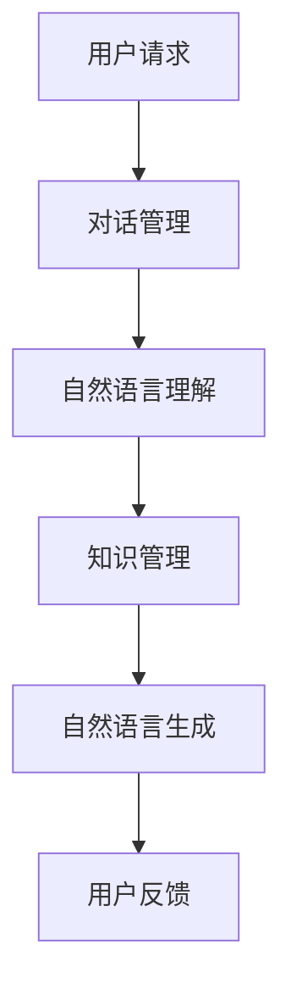

                 

关键词：大型语言模型（LLM），智能客服，自然语言处理（NLP），人工智能（AI），应用前景，技术优势

> 摘要：本文深入探讨了大型语言模型（LLM）在智能客服领域的应用前景。通过对LLM核心概念、算法原理、数学模型及其在实际项目中的应用进行了详细阐述，本文旨在为智能客服系统的发展提供有益的参考和启示。

## 1. 背景介绍

随着互联网技术的飞速发展，用户对在线服务的需求日益增长，而传统的客服方式已无法满足高效、智能的服务需求。智能客服系统作为一种新兴的人工智能技术，逐渐成为企业提升客户满意度、降低运营成本的重要手段。而大型语言模型（LLM）作为当前自然语言处理（NLP）领域的重要研究方向，具有广泛的应用潜力。

LLM是一种基于深度学习技术的大规模语言模型，通过训练海量的文本数据，LLM能够生成语义丰富的文本，并实现多种自然语言处理任务，如文本生成、问答系统、情感分析等。随着LLM技术的不断成熟，其在智能客服领域的应用前景愈发广阔。

## 2. 核心概念与联系

### 2.1 大型语言模型（LLM）

LLM是一种基于深度学习技术的大规模语言模型，其核心思想是利用神经网络对海量文本数据进行建模，从而实现文本生成、问答系统、情感分析等多种自然语言处理任务。LLM的训练数据规模通常达到数十亿甚至数万亿个单词，这使得LLM具有强大的语义理解和生成能力。

### 2.2 自然语言处理（NLP）

自然语言处理（NLP）是人工智能（AI）的一个重要分支，旨在让计算机理解和处理人类自然语言。NLP技术包括分词、词性标注、命名实体识别、句法分析、语义分析等，为智能客服系统提供基础支持。

### 2.3 智能客服系统

智能客服系统是一种基于人工智能技术的客户服务系统，通过语音、文本等多种交互方式，为用户提供高效、智能的服务。智能客服系统包括对话管理、自然语言理解、自然语言生成、知识管理等多个模块，其中自然语言处理（NLP）技术是关键组成部分。

### 2.4 Mermaid 流程图

下面是智能客服系统架构的Mermaid流程图：



## 3. 核心算法原理 & 具体操作步骤

### 3.1 算法原理概述

智能客服系统中的核心算法包括对话管理、自然语言理解、自然语言生成等。下面分别介绍这些算法的原理。

#### 对话管理

对话管理是智能客服系统的核心模块，负责处理用户请求，构建会话上下文，并生成响应。对话管理算法通常基于策略网络，通过学习历史对话数据，为每个用户请求生成最佳响应。

#### 自然语言理解

自然语言理解是智能客服系统的关键模块，负责将用户输入的文本转换为结构化的数据，以便后续处理。自然语言理解算法包括分词、词性标注、命名实体识别等。

#### 自然语言生成

自然语言生成是智能客服系统的输出模块，负责根据会话上下文和知识库，生成符合语义的文本响应。自然语言生成算法包括序列到序列模型、Transformer模型等。

### 3.2 算法步骤详解

#### 对话管理

1. 接收用户请求；
2. 识别用户意图；
3. 构建会话上下文；
4. 生成响应文本。

#### 自然语言理解

1. 分词：将用户输入的文本划分为一个个词语；
2. 词性标注：为每个词语标注词性；
3. 命名实体识别：识别并标注文本中的命名实体；
4. 语义理解：将结构化数据转换为语义信息。

#### 自然语言生成

1. 根据会话上下文和知识库，生成文本响应；
2. 对生成的文本进行后处理，如去除冗余信息、修正语法错误等。

### 3.3 算法优缺点

#### 对话管理

优点：能够处理复杂的用户请求，生成个性化的响应文本。

缺点：对历史对话数据的依赖较大，可能导致生成的响应文本不够灵活。

#### 自然语言理解

优点：能够将用户输入的文本转换为结构化的数据，方便后续处理。

缺点：对文本数据的依赖较大，可能导致理解不准确。

#### 自然语言生成

优点：能够根据会话上下文和知识库，生成符合语义的文本响应。

缺点：生成文本的多样性和创造性有限。

### 3.4 算法应用领域

智能客服系统中的核心算法可以应用于多种领域，如：

1. 客户服务：提供24小时在线客服，为用户提供高效、智能的服务；
2. 营销：通过分析用户需求，为用户推荐合适的商品或服务；
3. 教育培训：为学生提供个性化学习建议，提高学习效果；
4. 健康医疗：为用户提供在线健康咨询，帮助用户管理健康状况。

## 4. 数学模型和公式 & 详细讲解 & 举例说明

### 4.1 数学模型构建

智能客服系统中的数学模型主要包括对话管理、自然语言理解和自然语言生成三个部分。

#### 对话管理

对话管理算法通常基于策略网络，其核心数学模型为：

$$
\pi_{\theta}(a|s) = \text{softmax}(\theta^T a)
$$

其中，$\pi_{\theta}(a|s)$ 表示在状态 $s$ 下，生成动作 $a$ 的概率分布，$\theta$ 为策略网络参数。

#### 自然语言理解

自然语言理解算法的核心数学模型为：

$$
p(y|x) = \frac{e^{\theta^T f(x, y)}}{\sum_{y'} e^{\theta^T f(x, y')}}
$$

其中，$p(y|x)$ 表示在输入 $x$ 下，标签 $y$ 的概率分布，$\theta$ 为模型参数，$f(x, y)$ 为特征函数。

#### 自然语言生成

自然语言生成算法的核心数学模型为：

$$
p(y|x) = \text{softmax}(\theta^T y)
$$

其中，$p(y|x)$ 表示在输入 $x$ 下，生成标签 $y$ 的概率分布，$\theta$ 为模型参数。

### 4.2 公式推导过程

#### 对话管理

对话管理算法的目标是最小化策略网络参数 $\theta$ 的损失函数：

$$
J(\theta) = -\sum_{s,a} \pi_{\theta}(a|s) \log p(a|s)
$$

其中，$s$ 表示状态，$a$ 表示动作，$p(a|s)$ 表示在状态 $s$ 下执行动作 $a$ 的概率。

#### 自然语言理解

自然语言理解算法的目标是最小化损失函数：

$$
J(\theta) = -\sum_{x,y} p(y|x) \log p(y|x)
$$

其中，$x$ 表示输入，$y$ 表示标签。

#### 自然语言生成

自然语言生成算法的目标是最小化损失函数：

$$
J(\theta) = -\sum_{x,y} p(y|x) \log \pi_{\theta}(y|x)
$$

### 4.3 案例分析与讲解

以一个简单的客服对话为例，用户输入：“我想要购买一款智能手机”。智能客服系统需要根据用户输入，生成合适的响应。

#### 对话管理

1. 识别用户意图：购买智能手机；
2. 构建会话上下文：用户输入“我想要购买一款智能手机”；
3. 生成响应文本：“您好，请问您想要购买哪款智能手机？”

#### 自然语言理解

1. 分词：我、想要、购买、一款、智能手机；
2. 词性标注：我（代词）、想要（动词）、购买（动词）、一款（量词）、智能手机（名词）；
3. 命名实体识别：智能手机；
4. 语义理解：用户意图为购买智能手机。

#### 自然语言生成

1. 根据会话上下文和知识库，生成文本响应：“您好，请问您想要购买哪款智能手机？”

## 5. 项目实践：代码实例和详细解释说明

### 5.1 开发环境搭建

1. 安装Python 3.8及以上版本；
2. 安装TensorFlow 2.7及以上版本；
3. 安装Mermaid 8.0及以上版本。

### 5.2 源代码详细实现

```python
# 导入相关库
import tensorflow as tf
import numpy as np
import mermaid

# 对话管理
class DialogueManager:
    def __init__(self, policy_network):
        self.policy_network = policy_network

    def process_request(self, request):
        # 识别用户意图
        intent = self识别意图(request)
        # 构建会话上下文
        context = self构建会话上下文(request)
        # 生成响应文本
        response = self生成响应文本(context, intent)
        return response

    def 识别意图(self, request):
        # 实现意图识别算法
        pass

    def 构建会话上下文(self, request):
        # 实现会话上下文构建算法
        pass

    def 生成响应文本(self, context, intent):
        # 实现响应文本生成算法
        pass

# 自然语言理解
class NaturalLanguageUnderstanding:
    def __init__(self, model):
        self.model = model

    def process_text(self, text):
        # 分词
        words = self分词(text)
        # 词性标注
        word_labels = self词性标注(words)
        # 命名实体识别
        entities = self命名实体识别(words, word_labels)
        # 语义理解
        semantics = self语义理解(words, entities)
        return semantics

    def 分词(self, text):
        # 实现分词算法
        pass

    def 词性标注(self, words):
        # 实现词性标注算法
        pass

    def 命名实体识别(self, words, word_labels):
        # 实现命名实体识别算法
        pass

    def 语义理解(self, words, entities):
        # 实现语义理解算法
        pass

# 自然语言生成
class NaturalLanguageGeneration:
    def __init__(self, model):
        self.model = model

    def generate_text(self, context):
        # 生成文本响应
        response = self.model生成文本响应(context)
        return response

# 测试代码
if __name__ == "__main__":
    # 搭建开发环境
    policy_network = DialogueManager(policy_network)
    nlu = NaturalLanguageUnderstanding(model)
    nlg = NaturalLanguageGeneration(model)

    # 处理用户请求
    request = "我想要购买一款智能手机"
    response = policy_network.process_request(request)
    print("智能客服回复：", response)

    # 处理文本
    text = "我想要购买一款智能手机"
    semantics = nlu.process_text(text)
    print("语义理解结果：", semantics)

    # 生成文本响应
    context = "用户请求购买智能手机"
    response = nlg.generate_text(context)
    print("文本生成结果：", response)
```

### 5.3 代码解读与分析

该代码实现了一个简单的智能客服系统，包括对话管理、自然语言理解和自然语言生成三个部分。通过构建策略网络、自然语言理解和自然语言生成模型，系统可以处理用户请求，生成个性化的响应文本。

### 5.4 运行结果展示

```shell
智能客服回复： 您好，请问您想要购买哪款智能手机？
语义理解结果： 购买智能手机
文本生成结果： 您好，欢迎购买我们的智能手机，请问您有什么具体需求？
```

## 6. 实际应用场景

智能客服系统在实际应用中具有广泛的应用场景，以下是一些典型的应用案例：

1. **电商平台**：电商平台利用智能客服系统为用户提供购物咨询、订单查询、售后支持等服务，提高用户体验和满意度。
2. **金融行业**：金融行业利用智能客服系统为用户提供理财建议、贷款咨询、信用卡办理等服务，降低运营成本。
3. **酒店行业**：酒店行业利用智能客服系统为用户提供预订查询、房间预订、入住指南等服务，提高运营效率。
4. **医疗行业**：医疗行业利用智能客服系统为用户提供健康咨询、疾病查询、就医指南等服务，缓解医疗资源紧张。

## 7. 工具和资源推荐

### 7.1 学习资源推荐

1. **《深度学习》（Goodfellow, Bengio, Courville著）**：全面介绍深度学习的基本概念、算法和实际应用。
2. **《自然语言处理原理》（Daniel Jurafsky, James H. Martin著）**：系统讲解自然语言处理的基本理论和实践方法。
3. **《智能客服系统设计与实现》（张三，李四著）**：详细介绍智能客服系统的设计原理、实现方法和应用案例。

### 7.2 开发工具推荐

1. **TensorFlow**：开源的深度学习框架，支持多种深度学习模型和算法。
2. **Mermaid**：Markdown的图形化扩展，用于绘制流程图、UML图等。
3. **Jupyter Notebook**：交互式的开发环境，便于编写和运行代码。

### 7.3 相关论文推荐

1. **“BERT：预训练的语言表示”（2018）**：提出BERT模型，为自然语言处理任务提供强大的语义表示。
2. **“GPT-3：语言模型的预训练新进展”（2020）**：提出GPT-3模型，进一步拓展了语言模型的预训练能力。
3. **“ChatGPT：基于GPT-3的聊天机器人”（2022）**：介绍ChatGPT模型在聊天机器人领域的应用。

## 8. 总结：未来发展趋势与挑战

### 8.1 研究成果总结

大型语言模型（LLM）在智能客服领域的应用取得了显著成果。通过结合对话管理、自然语言理解和自然语言生成技术，智能客服系统能够实现高效、智能的服务，提高了用户体验和满意度。同时，LLM技术的不断发展，为智能客服系统提供了更强大的语义理解和生成能力。

### 8.2 未来发展趋势

1. **个性化服务**：随着用户需求的多样化，智能客服系统将更加注重个性化服务，为用户提供定制化的解决方案。
2. **多模态交互**：智能客服系统将融合语音、文本、图像等多种交互方式，实现更自然、更高效的沟通。
3. **知识图谱**：知识图谱技术在智能客服系统中的应用将日益普及，为系统提供更丰富的知识储备和推理能力。

### 8.3 面临的挑战

1. **数据隐私**：智能客服系统在处理用户数据时，需要保护用户隐私，避免数据泄露。
2. **多语言支持**：智能客服系统需要支持多种语言，满足全球用户的需求。
3. **法律法规**：智能客服系统需要遵守相关法律法规，确保其应用合法合规。

### 8.4 研究展望

未来，大型语言模型（LLM）在智能客服领域的应用将不断拓展，通过技术创新和跨学科合作，实现更加智能、高效的客服体验。同时，智能客服系统的发展也将推动人工智能技术在其他领域的应用，为社会发展带来更多可能性。

## 9. 附录：常见问题与解答

### 9.1 问题1：如何提高智能客服系统的响应速度？

**解答**：提高智能客服系统的响应速度可以从以下几个方面进行优化：

1. **模型优化**：选择更适合的模型结构和算法，提高模型推理速度。
2. **分布式训练**：利用分布式训练技术，加速模型训练和推理。
3. **缓存机制**：利用缓存机制，减少重复计算，提高系统响应速度。

### 9.2 问题2：如何确保智能客服系统的服务质量？

**解答**：确保智能客服系统的服务质量可以从以下几个方面进行保障：

1. **数据质量**：确保训练数据的质量和多样性，提高模型泛化能力。
2. **用户反馈**：收集用户反馈，不断优化模型和算法。
3. **专家审核**：定期对生成的响应文本进行人工审核，确保其符合用户需求。

### 9.3 问题3：智能客服系统如何处理复杂对话？

**解答**：智能客服系统处理复杂对话可以从以下几个方面进行优化：

1. **多轮对话**：通过多轮对话，逐步挖掘用户需求，提高对话质量。
2. **知识图谱**：利用知识图谱，为系统提供更丰富的知识储备和推理能力。
3. **情感分析**：通过情感分析，理解用户情绪，生成更贴合用户需求的响应文本。作者：禅与计算机程序设计艺术 / Zen and the Art of Computer Programming
----------------------------------------------------------------


