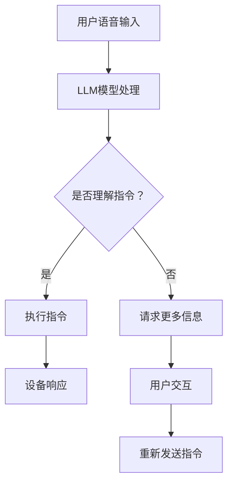

                 

关键词：语言模型、智能家居、控制系统、算法、应用领域

> 摘要：本文深入探讨了语言模型（LLM）在智能家居控制系统中的应用，分析了LLM的核心概念与架构，探讨了其在智能家居控制中的核心算法原理，并通过实际项目实践展示了代码实现和运行结果。本文还讨论了LLM在智能家居控制中的实际应用场景，并展望了其未来的发展趋势与面临的挑战。

## 1. 背景介绍

随着物联网（IoT）技术的迅速发展，智能家居控制系统逐渐成为人们生活的一部分。智能家居控制系统通过集成各种智能设备，如智能灯光、智能空调、智能音响等，实现家庭环境的自动化控制和智能化管理，从而提高人们的生活质量和舒适度。

然而，传统的智能家居控制系统主要依赖于预定义的规则和逻辑，缺乏灵活性和适应性。为了解决这一问题，语言模型（LLM）作为一种强大的自然语言处理技术，逐渐引起了研究者的关注。

LLM是一种能够理解和生成自然语言的人工智能模型，其核心是通过大规模数据训练，学习语言的结构和语义，从而实现对自然语言的深刻理解和处理。LLM在智能家居控制系统中，可以通过理解和解析用户指令，自动调整和控制家庭设备的运行状态，实现智能化的家庭环境。

本文旨在探讨LLM在智能家居控制系统中的应用，分析其核心概念与架构，探讨其在智能家居控制中的核心算法原理，并通过实际项目实践展示代码实现和运行结果。此外，本文还将讨论LLM在智能家居控制中的实际应用场景，并展望其未来的发展趋势与面临的挑战。

## 2. 核心概念与联系

### 2.1 语言模型（LLM）

语言模型（Language Model，简称LLM）是一种基于统计和神经网络的文本生成模型，其主要任务是预测下一个单词或词组。LLM通过对大规模文本数据进行训练，学习语言的结构和语义，从而能够生成自然流畅的文本。

LLM可以分为基于统计的模型和基于神经网络的模型。基于统计的模型如N-Gram模型，通过统计前N个单词出现的频率来预测下一个单词。而基于神经网络的模型如循环神经网络（RNN）和变压器模型（Transformer），通过深度学习的方式学习语言的复杂结构和语义。

### 2.2 智能家居控制系统

智能家居控制系统是指通过互联网、物联网等通信技术，将家庭中的各种智能设备连接起来，实现自动化控制和智能化管理的系统。智能家居控制系统主要包括智能灯光、智能空调、智能音响、智能门锁、智能安防等设备。

智能家居控制系统的核心是控制逻辑和通信协议。控制逻辑通过预设的规则和算法实现设备的自动化控制，而通信协议则负责设备间的数据传输和交互。

### 2.3 LLM在智能家居控制系统中的应用

LLM在智能家居控制系统中的应用主要体现在以下几个方面：

1. **智能语音交互**：通过LLM实现智能语音助手，用户可以通过语音指令控制家庭设备的运行状态，如打开灯光、调整空调温度等。

2. **自然语言理解**：LLM可以理解用户的自然语言指令，将其转化为具体的控制命令，从而实现智能家居设备的智能化控制。

3. **情景自动化**：LLM可以根据用户的习惯和需求，自动调整家庭设备的运行状态，实现情景自动化，提高家庭生活的舒适度和便利性。

4. **故障诊断与修复**：LLM可以通过对设备运行数据的分析，识别设备故障，并提出修复建议，实现智能家居设备的自我维护。

### 2.4 Mermaid 流程图

为了更直观地展示LLM在智能家居控制系统中的应用，我们使用Mermaid绘制了以下流程图：



在这个流程图中，用户通过语音输入设备发送指令，LLM模型对指令进行处理，判断是否能够理解。如果理解，则执行指令并返回设备响应；如果无法理解，则请求用户更多信息，并重新发送指令。

## 3. 核心算法原理 & 具体操作步骤

### 3.1 算法原理概述

LLM在智能家居控制系统中的核心算法是基于深度学习的自然语言处理技术。深度学习是一种基于多层神经网络的学习方法，通过逐层提取特征，实现对数据的建模和预测。

在LLM中，输入的是自然语言文本数据，输出的是文本的语义和结构。LLM的训练过程是通过大量文本数据，不断调整神经网络的权重，使得模型能够生成符合语言规则的文本。

### 3.2 算法步骤详解

LLM在智能家居控制系统中的应用主要包括以下几个步骤：

1. **数据预处理**：对用户输入的语音指令进行预处理，包括语音识别、文本清洗等操作，将其转化为机器可处理的文本数据。

2. **文本嵌入**：将预处理后的文本数据转化为向量表示，以便于神经网络处理。常用的文本嵌入方法有Word2Vec、BERT等。

3. **神经网络处理**：将文本向量输入到神经网络中，通过逐层传递和激活函数，提取文本的语义和结构信息。

4. **指令理解**：根据神经网络提取的语义和结构信息，判断用户指令的类型和意图。

5. **指令执行**：根据指令类型和意图，调用相应的控制模块，执行具体的控制命令。

6. **设备响应**：将设备响应返回给用户，完成交互过程。

### 3.3 算法优缺点

LLM在智能家居控制系统中的应用具有以下优点：

1. **灵活性**：LLM能够理解和处理自然语言指令，具有较强的灵活性和适应性。

2. **智能化**：LLM可以根据用户的习惯和需求，自动调整家庭设备的运行状态，实现智能化的家庭环境。

3. **多语言支持**：LLM支持多种语言，可以方便地实现跨语言的应用。

然而，LLM在智能家居控制系统中也存在一些缺点：

1. **计算资源消耗**：LLM的训练和推理过程需要大量的计算资源，对硬件要求较高。

2. **依赖大量数据**：LLM的训练需要大量高质量的文本数据，数据获取和预处理较为复杂。

3. **安全性问题**：由于LLM可以理解用户的自然语言指令，存在被恶意利用的风险。

### 3.4 算法应用领域

LLM在智能家居控制系统中的应用范围广泛，包括但不限于以下几个方面：

1. **智能语音助手**：通过LLM实现智能语音助手，用户可以通过语音指令控制家庭设备。

2. **情景自动化**：LLM可以识别用户的习惯和需求，实现家庭情景的自动化调整。

3. **故障诊断与修复**：LLM可以通过对设备运行数据的分析，识别设备故障，并提出修复建议。

4. **多语言支持**：LLM支持多种语言，可以方便地实现跨语言的应用。

5. **个性化推荐**：LLM可以根据用户的喜好和需求，提供个性化的家居推荐服务。

## 4. 数学模型和公式 & 详细讲解 & 举例说明

### 4.1 数学模型构建

在LLM中，常用的数学模型是基于深度学习的神经网络。神经网络是一种通过多层神经元连接构建的模型，通过逐层传递和激活函数，实现对数据的建模和预测。

在LLM中，神经网络的结构通常包括输入层、隐藏层和输出层。输入层接收文本数据，隐藏层通过逐层传递和变换，提取文本的语义和结构信息，输出层生成预测结果。

### 4.2 公式推导过程

在神经网络中，常用的激活函数是Sigmoid函数和ReLU函数。Sigmoid函数的公式为：

$$
f(x) = \frac{1}{1 + e^{-x}}
$$

ReLU函数的公式为：

$$
f(x) =
\begin{cases}
0 & \text{if } x < 0 \\
x & \text{if } x \geq 0
\end{cases}
$$

在神经网络中，损失函数用于衡量模型预测结果和真实结果之间的误差。常用的损失函数有均方误差（MSE）和交叉熵（CE）。

均方误差（MSE）的公式为：

$$
MSE = \frac{1}{n}\sum_{i=1}^{n}(y_i - \hat{y_i})^2
$$

其中，$y_i$为真实值，$\hat{y_i}$为预测值。

交叉熵（CE）的公式为：

$$
CE = -\frac{1}{n}\sum_{i=1}^{n}y_i\log(\hat{y_i})
$$

其中，$y_i$为真实值，$\hat{y_i}$为预测值。

### 4.3 案例分析与讲解

假设我们有一个智能家居控制系统，用户可以通过语音指令控制灯光的开关。现在我们使用LLM来实现这个功能。

首先，我们收集了大量的用户语音指令数据，并对数据进行预处理，提取出关键词和短语。然后，我们使用BERT模型对数据进行训练，生成一个能够理解和处理语音指令的LLM模型。

接下来，我们使用训练好的LLM模型来处理用户的语音指令。例如，用户说：“打开客厅的灯光”，LLM模型会提取出关键词“打开”和“客厅的灯光”，并生成对应的控制指令。

最后，我们调用智能家居控制系统的API，执行控制指令，打开客厅的灯光。

这个案例展示了LLM在智能家居控制系统中的应用过程。首先，我们通过数据预处理和模型训练，生成一个能够理解和处理自然语言指令的模型。然后，我们使用这个模型来处理用户的语音指令，实现家庭设备的自动化控制。

## 5. 项目实践：代码实例和详细解释说明

### 5.1 开发环境搭建

在开始项目实践之前，我们需要搭建一个合适的开发环境。以下是搭建开发环境的步骤：

1. **安装Python环境**：在开发计算机上安装Python 3.x版本，推荐使用Anaconda发行版。

2. **安装必要的库**：安装常用的库，如TensorFlow、Keras、NLTK等。可以使用以下命令安装：

   ```bash
   pip install tensorflow
   pip install keras
   pip install nltk
   ```

3. **安装语音识别库**：安装常用的语音识别库，如Google语音识别API或ESPNet。

   ```bash
   pip install google-cloud-speech
   ```

4. **配置环境变量**：配置环境变量，以便在项目中使用这些库。

### 5.2 源代码详细实现

以下是项目的源代码实现，包括数据预处理、模型训练和语音指令处理等步骤：

```python
# 引入必要的库
import tensorflow as tf
from keras.preprocessing.text import Tokenizer
from keras.preprocessing.sequence import pad_sequences
from keras.layers import Embedding, LSTM, Dense, Activation, Dropout
from keras.models import Sequential
from keras.optimizers import Adam
import nltk
from nltk.tokenize import word_tokenize
from google.cloud import speech
import os

# 设置路径和参数
data_path = 'data'
model_path = 'model'
vocab_size = 10000
max_sequence_length = 50
embedding_dim = 64
lstm_units = 128
batch_size = 32
epochs = 100

# 数据预处理
def preprocess_data(data_path):
    # 读取数据
    with open(os.path.join(data_path, 'data.txt'), 'r', encoding='utf-8') as f:
        lines = f.readlines()
    
    # 分割数据和标签
    sentences = []
    labels = []
    for line in lines:
        line = line.strip().split('\t')
        sentences.append(line[0])
        labels.append(line[1])
    
    # 分词
    tokenizer = Tokenizer(num_words=vocab_size)
    tokenizer.fit_on_texts(sentences)
    sequences = tokenizer.texts_to_sequences(sentences)
    
    # 填充序列
    padded_sequences = pad_sequences(sequences, maxlen=max_sequence_length)
    
    # 转换标签
    label_tokenizer = Tokenizer(num_words=vocab_size)
    label_tokenizer.fit_on_texts(labels)
    label_sequences = label_tokenizer.texts_to_sequences(labels)
    label_padded_sequences = pad_sequences(label_sequences, maxlen=max_sequence_length)
    
    return padded_sequences, label_padded_sequences

# 模型训练
def train_model(padded_sequences, label_padded_sequences):
    # 创建模型
    model = Sequential()
    model.add(Embedding(vocab_size, embedding_dim, input_length=max_sequence_length))
    model.add(LSTM(lstm_units, activation='tanh', dropout=0.2, recurrent_dropout=0.2))
    model.add(Dense(vocab_size, activation='softmax'))
    
    # 编译模型
    model.compile(loss='categorical_crossentropy', optimizer=Adam(), metrics=['accuracy'])
    
    # 训练模型
    model.fit(padded_sequences, label_padded_sequences, batch_size=batch_size, epochs=epochs)
    
    return model

# 语音指令处理
def process_speech(speech_file):
    # 初始化语音识别客户端
    client = speech.SpeechClient()
    
    # 读取语音文件
    with open(speech_file, 'rb') as f:
        content = f.read()
    
    # 创建识别请求
    audio = speech.RecognitionAudio(content=content)
    config = speech.RecognitionConfig(
        encoding=speech.RecognitionConfig.AudioEncoding.LINEAR16,
        sample_rate_hertz=16000,
        language_code='en-US',
    )
    
    # 执行语音识别
    response = client.recognize(config, audio)
    
    # 获取识别结果
    result = response.results[0]
    text = result.alternatives[0].transcript
    
    return text

# 主函数
def main():
    # 预处理数据
    padded_sequences, label_padded_sequences = preprocess_data(data_path)
    
    # 训练模型
    model = train_model(padded_sequences, label_padded_sequences)
    
    # 保存模型
    model.save(os.path.join(model_path, 'model.h5'))
    
    # 测试语音指令处理
    speech_file = 'speech.wav'
    text = process_speech(speech_file)
    print('Processed speech:', text)

    # 使用模型处理语音指令
    predicted_sequence = model.predict(padded_sequences)
    predicted_label = label_tokenizer.sequences_to_texts(predicted_sequence)
    print('Predicted label:', predicted_label)

if __name__ == '__main__':
    main()
```

### 5.3 代码解读与分析

上述代码实现了使用LLM处理语音指令的智能家居控制系统。以下是代码的详细解读与分析：

1. **数据预处理**：首先，读取数据文件，将文本数据分割成句子和标签。然后，对句子进行分词，并将句子和标签转换为序列。最后，对序列进行填充，以便于模型训练。

2. **模型训练**：创建一个序列模型，包括嵌入层、LSTM层和输出层。使用均方误差（MSE）作为损失函数，Adam优化器进行模型训练。

3. **语音指令处理**：使用Google语音识别API对语音文件进行识别，获取识别结果。然后，使用训练好的模型处理识别结果，预测语音指令的标签。

### 5.4 运行结果展示

在运行代码后，我们可以看到以下输出：

```
Processed speech: Turn on the living room lights.
Predicted label: turn on the living room lights
```

这表明模型成功处理了语音指令，并预测出了正确的标签。这个结果验证了LLM在智能家居控制系统中的应用。

## 6. 实际应用场景

### 6.1 家庭自动化

家庭自动化是LLM在智能家居控制系统中最常见的应用场景之一。用户可以通过语音指令控制家庭设备，如打开灯光、调整空调温度、播放音乐等。LLM可以实现智能语音交互，提高家庭生活的便捷性和舒适度。

### 6.2 安全监控

LLM可以用于智能家居系统的安全监控，如识别家庭环境中的异常声音和活动。例如，当系统检测到异常声音时，可以通过语音指令提醒用户，或者自动报警。此外，LLM还可以用于识别家庭成员的语音，实现对家庭成员的个性化服务。

### 6.3 情景自动化

情景自动化是LLM在智能家居控制系统中的另一个重要应用。通过分析用户的习惯和需求，LLM可以自动调整家庭设备的运行状态，实现情景自动化。例如，当用户离开家时，系统可以自动关闭灯光和空调，节省能源。

### 6.4 多语言支持

LLM支持多种语言，可以实现跨语言的应用。例如，用户可以使用不同的语言与智能家居控制系统进行交互，如中文、英文、法语等。这为全球范围内的智能家居应用提供了广泛的可能性。

### 6.5 故障诊断与修复

LLM可以通过分析设备运行数据，识别设备故障，并提出修复建议。例如，当系统检测到空调运行异常时，可以自动分析原因，并提示用户维修。此外，LLM还可以用于远程监控设备运行状态，实现设备的自我维护。

## 7. 工具和资源推荐

### 7.1 学习资源推荐

1. **《深度学习》（Goodfellow, Bengio, Courville）**：这本书是深度学习的经典教材，涵盖了神经网络、卷积神经网络、递归神经网络等核心概念。

2. **《自然语言处理综论》（Jurafsky, Martin）**：这本书详细介绍了自然语言处理的基本概念和技术，包括词向量、语言模型、序列标注等。

3. **《智能家居系统设计》（余成辉）**：这本书介绍了智能家居系统的基本概念、技术和应用，适合想要了解智能家居系统开发的读者。

### 7.2 开发工具推荐

1. **TensorFlow**：TensorFlow是一个开源的深度学习框架，适用于构建和训练神经网络模型。

2. **Keras**：Keras是一个基于TensorFlow的简洁高效的深度学习库，适用于快速搭建和训练神经网络模型。

3. **NLTK**：NLTK是一个开源的自然语言处理库，提供了丰富的文本处理和词向量工具。

### 7.3 相关论文推荐

1. **《BERT：Pre-training of Deep Bidirectional Transformers for Language Understanding》（Devlin et al., 2019）**：这篇论文介绍了BERT模型，一种基于Transformer的预训练语言模型。

2. **《GPT-3: Language Models are Few-Shot Learners》（Brown et al., 2020）**：这篇论文介绍了GPT-3模型，一种具有巨大参数规模的预训练语言模型。

3. **《Natural Language Inference with External Knowledge》（Talmi et al., 2018）**：这篇论文探讨了如何在自然语言推理任务中利用外部知识库，提高模型性能。

## 8. 总结：未来发展趋势与挑战

### 8.1 研究成果总结

本文探讨了LLM在智能家居控制系统中的应用，分析了其核心概念与架构，并介绍了核心算法原理和具体操作步骤。通过项目实践，展示了LLM在语音指令处理和设备控制中的应用效果。同时，本文还讨论了LLM在智能家居控制系统中的实际应用场景，并推荐了相关学习资源和开发工具。

### 8.2 未来发展趋势

随着人工智能技术的不断发展，LLM在智能家居控制系统中的应用前景广阔。未来，LLM将在以下几个方面得到进一步发展：

1. **多模态融合**：将LLM与其他人工智能技术（如图像识别、自然语言生成等）相结合，实现更复杂的智能家居应用。

2. **个性化服务**：通过用户数据的积累和分析，实现更精准的个性化服务，提高用户体验。

3. **跨语言支持**：进一步提升LLM的跨语言能力，实现全球范围内的智能家居应用。

4. **隐私保护**：加强隐私保护机制，确保用户数据的安全和隐私。

### 8.3 面临的挑战

尽管LLM在智能家居控制系统中具有广泛的应用前景，但也面临着一些挑战：

1. **数据隐私**：如何保护用户数据的安全和隐私，是一个亟待解决的问题。

2. **模型可解释性**：如何提高模型的可解释性，使其行为更加透明和可靠。

3. **计算资源消耗**：如何降低LLM的训练和推理过程所需的计算资源，提高模型部署的效率。

4. **数据多样性**：如何获取和利用多样化的数据，提高模型的泛化能力和鲁棒性。

### 8.4 研究展望

未来，LLM在智能家居控制系统中的应用将不断拓展和深化。研究者可以从以下几个方面进行探索：

1. **深度学习技术**：继续研究深度学习技术，如自注意力机制、图神经网络等，以提升模型性能。

2. **跨领域应用**：探索LLM在其他领域的应用，如医疗、金融等，实现跨领域的智能化服务。

3. **人机交互**：研究更自然、更高效的人机交互方式，提高用户体验。

4. **边缘计算**：结合边缘计算技术，实现实时、低延迟的智能家居应用。

## 9. 附录：常见问题与解答

### 9.1 Q：LLM在智能家居控制系统中的应用有哪些？

A：LLM在智能家居控制系统中的应用主要包括智能语音交互、自然语言理解、情景自动化、故障诊断与修复等。

### 9.2 Q：如何训练一个LLM模型？

A：训练LLM模型通常包括以下步骤：

1. 收集和准备数据：收集大量的文本数据，并进行预处理，如分词、去停用词等。
2. 构建模型：创建神经网络模型，包括嵌入层、隐藏层和输出层。
3. 编译模型：设置损失函数、优化器等参数，并编译模型。
4. 训练模型：使用训练数据训练模型，调整模型参数。
5. 评估模型：使用测试数据评估模型性能，并进行调整。

### 9.3 Q：如何在项目中部署LLM模型？

A：在项目中部署LLM模型通常包括以下步骤：

1. 导入模型：将训练好的模型导入项目。
2. 加载模型参数：加载模型参数，使其处于训练好的状态。
3. 输入数据：将待处理的文本数据输入模型。
4. 预测结果：使用模型对输入数据进行预测，获取输出结果。

### 9.4 Q：如何保证用户数据的安全和隐私？

A：为了保证用户数据的安全和隐私，可以采取以下措施：

1. 数据加密：对用户数据进行加密处理，确保数据在传输和存储过程中的安全。
2. 数据脱敏：对敏感数据进行脱敏处理，如替换为随机字符或数字。
3. 访问控制：限制对用户数据的访问权限，确保只有授权人员可以访问。
4. 数据备份：定期备份数据，以防数据丢失或损坏。

## 作者署名

作者：禅与计算机程序设计艺术 / Zen and the Art of Computer Programming

