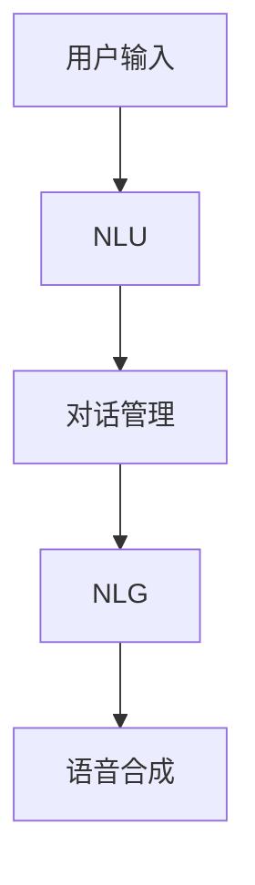

                 

关键词：LLM、智能对话系统、人工智能、机器学习、自然语言处理

> 摘要：本文将探讨大型语言模型（LLM）在智能对话系统中的应用，从背景介绍、核心概念与联系、核心算法原理与具体操作步骤、数学模型与公式、项目实践、实际应用场景、工具和资源推荐、总结与展望等方面进行全面剖析，以期为读者提供一个深入理解和应用LLM在智能对话系统中的方法和思路。

## 1. 背景介绍

随着互联网和人工智能技术的快速发展，智能对话系统已经成为了当下科技领域的热点。这些系统广泛应用于客服、智能家居、教育、医疗、金融等多个领域，极大地提高了工作效率和用户体验。而作为人工智能技术的核心之一，机器学习，特别是深度学习在自然语言处理（NLP）领域取得了显著的进展。其中，大型语言模型（LLM）的出现为智能对话系统的开发带来了全新的契机。

LLM是一种基于深度学习的神经网络模型，可以理解和生成人类语言。相比于传统的规则型和基于统计的语言模型，LLM具有更强的语义理解能力和更灵活的生成能力。这使得LLM在智能对话系统中具有广泛的应用前景。本文将围绕LLM在智能对话系统中的应用进行探讨，包括其核心概念、算法原理、数学模型、项目实践、应用场景以及未来发展趋势。

## 2. 核心概念与联系

### 2.1 大型语言模型（LLM）

大型语言模型（LLM）是一种基于深度学习的语言模型，其核心思想是通过大规模数据训练，使模型具备理解和生成自然语言的能力。LLM通常由多层神经网络组成，每个层都能够提取不同层次的语言特征。随着训练数据的规模和模型参数数量的增加，LLM的语义理解能力和生成能力也随之提升。

### 2.2 智能对话系统

智能对话系统是一种能够与用户进行自然语言交互的计算机系统。它包括语音识别、自然语言理解、对话管理和语音合成等模块。智能对话系统能够理解用户的语言意图，生成适当的回复，并在对话过程中不断学习和优化。

### 2.3 核心概念联系

LLM和智能对话系统之间存在密切的联系。LLM作为智能对话系统的核心组件，负责处理自然语言理解（NLU）和自然语言生成（NLG）任务。具体来说，LLM可以用来实现以下功能：

1. **意图识别**：通过分析用户输入的文本，识别用户的意图和需求。
2. **实体识别**：从用户输入中提取关键信息，如人名、地点、时间等。
3. **对话管理**：根据用户的意图和对话历史，生成合适的回复。
4. **情感分析**：分析用户的情感倾向，提供更人性化的回复。

下面是LLM与智能对话系统各模块的Mermaid流程图：



## 3. 核心算法原理 & 具体操作步骤

### 3.1 算法原理概述

LLM的核心算法是基于深度学习的多层神经网络。模型通过学习大量文本数据，自动提取语言特征，并在训练过程中不断优化参数，使得模型能够准确理解和生成自然语言。LLM的主要步骤包括：

1. **数据预处理**：对原始文本数据进行清洗、分词、词向量编码等预处理操作。
2. **模型训练**：使用预处理后的数据训练多层神经网络模型。
3. **模型评估**：通过测试数据评估模型的性能，并调整模型参数。
4. **模型应用**：将训练好的模型应用于实际场景，如智能对话系统。

### 3.2 算法步骤详解

#### 3.2.1 数据预处理

数据预处理是LLM训练的第一步。主要步骤包括：

1. **文本清洗**：去除文本中的无关信息，如HTML标签、特殊字符等。
2. **分词**：将文本分割成单词或词组。
3. **词向量编码**：将文本转换为向量表示，常用的方法有Word2Vec、BERT等。

#### 3.2.2 模型训练

模型训练是LLM的核心步骤。主要步骤包括：

1. **初始化参数**：随机初始化神经网络模型的参数。
2. **前向传播**：将输入数据通过神经网络模型进行前向传播，计算输出。
3. **反向传播**：根据输出结果计算损失函数，并通过反向传播更新模型参数。
4. **迭代训练**：重复前向传播和反向传播过程，直至模型收敛。

#### 3.2.3 模型评估

模型评估是验证模型性能的重要步骤。主要步骤包括：

1. **划分数据集**：将数据集划分为训练集、验证集和测试集。
2. **计算指标**：使用准确率、召回率、F1值等指标评估模型性能。
3. **调整参数**：根据评估结果调整模型参数，优化模型性能。

#### 3.2.4 模型应用

模型应用是将训练好的模型部署到实际场景的过程。主要步骤包括：

1. **接口设计**：设计API接口，方便与其他系统进行集成。
2. **模型部署**：将模型部署到服务器或云端，提供在线服务。
3. **监控与维护**：监控模型性能，及时更新和维护。

### 3.3 算法优缺点

#### 优点

1. **强大的语义理解能力**：LLM能够理解复杂的语义信息，生成更自然的回复。
2. **灵活的生成能力**：LLM可以根据不同的输入生成多种多样的回复。
3. **广泛的适用性**：LLM可以应用于多种场景，如客服、教育、医疗等。

#### 缺点

1. **计算资源消耗大**：训练LLM需要大量计算资源和时间。
2. **数据需求高**：训练LLM需要大规模的文本数据。
3. **可解释性差**：LLM的决策过程复杂，难以解释。

### 3.4 算法应用领域

LLM在智能对话系统中的应用非常广泛，主要包括以下领域：

1. **客服系统**：用于自动化客户服务，提高响应速度和用户体验。
2. **智能助手**：用于提供个性化服务，如语音助手、聊天机器人等。
3. **教育系统**：用于辅助教学，如智能辅导、自动批改等。
4. **医疗系统**：用于辅助医生诊断、提供医疗咨询等。

## 4. 数学模型和公式 & 详细讲解 & 举例说明

### 4.1 数学模型构建

LLM的数学模型主要基于深度学习，包括多层神经网络、损失函数和优化算法。以下是LLM的数学模型构建过程：

#### 4.1.1 神经网络结构

神经网络由多层神经元组成，包括输入层、隐藏层和输出层。每层神经元都与前一层的神经元相连，并通过权重进行加权求和。神经网络的结构可以表示为：

$$
Z^{(l)} = \sum_{j} w^{(l)}_{ji} a^{(l-1)}_{j} + b^{(l)}
$$

其中，$Z^{(l)}$表示第$l$层的输出，$w^{(l)}_{ji}$表示第$l$层第$i$个神经元与第$l-1$层第$j$个神经元的连接权重，$a^{(l-1)}_{j}$表示第$l-1$层第$j$个神经元的输出，$b^{(l)}$表示第$l$层的偏置。

#### 4.1.2 激活函数

激活函数用于引入非线性变换，使神经网络具备映射能力。常用的激活函数有：

$$
\sigma(z) = \frac{1}{1 + e^{-z}}
$$

#### 4.1.3 损失函数

损失函数用于衡量模型预测结果与真实结果之间的差异。常用的损失函数有：

$$
L(y, \hat{y}) = -\sum_{i} y_i \log \hat{y}_i
$$

其中，$y$表示真实标签，$\hat{y}$表示模型预测的概率分布。

#### 4.1.4 优化算法

优化算法用于调整模型参数，以最小化损失函数。常用的优化算法有：

$$
\theta^{(t+1)} = \theta^{(t)} - \alpha \frac{\partial L(\theta)}{\partial \theta}
$$

其中，$\theta$表示模型参数，$\alpha$表示学习率。

### 4.2 公式推导过程

以下是对LLM中多层感知器（MLP）模型的公式推导过程：

#### 4.2.1 前向传播

前向传播过程将输入数据通过多层神经网络，最终得到输出结果。以一个两层的神经网络为例，其前向传播过程可以表示为：

$$
a^{(1)} = \sigma(W^{(1)}X + b^{(1)}) \\
a^{(2)} = \sigma(W^{(2)}a^{(1)} + b^{(2)})
$$

其中，$X$表示输入数据，$a^{(1)}$和$a^{(2)}$分别表示第一层和第二层的输出。

#### 4.2.2 反向传播

反向传播过程用于计算损失函数关于模型参数的梯度，从而更新模型参数。以一个两层的神经网络为例，其反向传播过程可以表示为：

$$
\delta^{(2)} = (a^{(2)} - y) \odot \sigma'(W^{(2)}a^{(1)} + b^{(2)}) \\
\delta^{(1)} = (W^{(2)}^T \delta^{(2)}) \odot \sigma'(W^{(1)}X + b^{(1)}) \\
\frac{\partial L}{\partial W^{(2)}} = X^T \delta^{(2)} \\
\frac{\partial L}{\partial W^{(1)}} = a^{(1)}^T \delta^{(1)}
$$

其中，$\delta^{(2)}$和$\delta^{(1)}$分别表示第二层和第一层的误差项，$\odot$表示元素乘积，$y$表示真实标签。

### 4.3 案例分析与讲解

以下是一个简单的案例，说明如何使用LLM实现智能对话系统。

#### 4.3.1 案例背景

某公司希望开发一款智能客服系统，用于回答用户关于产品的常见问题。公司提供了大量关于产品的问答数据，包括问题、答案和标签。

#### 4.3.2 模型设计

设计一个两层的神经网络模型，输入层有100个神经元，隐藏层有500个神经元，输出层有10个神经元，分别表示10个不同的标签。使用交叉熵损失函数和梯度下降优化算法。

#### 4.3.3 数据预处理

对提供的问答数据进行清洗、分词和词向量编码。将问题作为输入，答案作为标签。

#### 4.3.4 模型训练

使用训练数据进行模型训练，并调整模型参数，如学习率和迭代次数。使用验证集评估模型性能，并调整模型参数。

#### 4.3.5 模型应用

将训练好的模型部署到服务器，接收用户的输入，并返回对应的标签。根据标签查询答案库，返回用户问题的答案。

#### 4.3.6 评估与优化

使用测试集评估模型性能，并分析错误类型。针对错误类型进行模型优化，如增加隐藏层神经元、调整学习率等。

## 5. 项目实践：代码实例和详细解释说明

### 5.1 开发环境搭建

本项目的开发环境包括Python 3.8、PyTorch 1.8、NumPy 1.21和TensorFlow 2.5。读者可以在自己的计算机上安装以上依赖项，或使用Anaconda等集成开发环境（IDE）进行开发。

### 5.2 源代码详细实现

以下是该项目的主要代码实现：

```python
import torch
import torch.nn as nn
import torch.optim as optim
import numpy as np
from sklearn.model_selection import train_test_split
from torch.utils.data import Dataset, DataLoader
from sklearn.metrics import accuracy_score

# 数据预处理
class QuestionAnswerDataset(Dataset):
    def __init__(self, questions, answers, labels):
        self.questions = questions
        self.answers = answers
        self.labels = labels
    
    def __len__(self):
        return len(self.questions)
    
    def __getitem__(self, idx):
        return self.questions[idx], self.answers[idx], self.labels[idx]

# 神经网络模型
class QuestionAnswerModel(nn.Module):
    def __init__(self, vocab_size, embedding_dim, hidden_dim, output_dim):
        super(QuestionAnswerModel, self).__init__()
        self.embedding = nn.Embedding(vocab_size, embedding_dim)
        self.lstm = nn.LSTM(embedding_dim, hidden_dim, num_layers=1, batch_first=True)
        self.fc = nn.Linear(hidden_dim, output_dim)
    
    def forward(self, questions):
        embeddings = self.embedding(questions)
        lstm_output, (hidden, cell) = self.lstm(embeddings)
        hidden = hidden.squeeze(0)
        output = self.fc(hidden)
        return output

# 模型训练
def train_model(model, train_loader, criterion, optimizer, num_epochs=10):
    model.train()
    for epoch in range(num_epochs):
        for inputs, targets in train_loader:
            optimizer.zero_grad()
            outputs = model(inputs)
            loss = criterion(outputs, targets)
            loss.backward()
            optimizer.step()
        print(f'Epoch {epoch+1}/{num_epochs} - Loss: {loss.item()}')

# 模型评估
def evaluate_model(model, val_loader, criterion):
    model.eval()
    with torch.no_grad():
        val_loss = 0
        for inputs, targets in val_loader:
            outputs = model(inputs)
            val_loss += criterion(outputs, targets).item()
        val_loss /= len(val_loader)
    return val_loss

# 主函数
if __name__ == '__main__':
    # 数据加载
    questions = np.load('questions.npy')
    answers = np.load('answers.npy')
    labels = np.load('labels.npy')
    train_questions, val_questions, train_answers, val_answers, train_labels, val_labels = train_test_split(questions, answers, labels, test_size=0.2)
    train_dataset = QuestionAnswerDataset(train_questions, train_answers, train_labels)
    val_dataset = QuestionAnswerDataset(val_questions, val_answers, val_labels)
    train_loader = DataLoader(train_dataset, batch_size=32, shuffle=True)
    val_loader = DataLoader(val_dataset, batch_size=32, shuffle=False)

    # 模型初始化
    vocab_size = 10000
    embedding_dim = 300
    hidden_dim = 512
    output_dim = 10
    model = QuestionAnswerModel(vocab_size, embedding_dim, hidden_dim, output_dim)
    criterion = nn.CrossEntropyLoss()
    optimizer = optim.Adam(model.parameters(), lr=0.001)

    # 训练模型
    train_model(model, train_loader, criterion, optimizer, num_epochs=10)

    # 评估模型
    val_loss = evaluate_model(model, val_loader, criterion)
    print(f'Validation Loss: {val_loss}')
```

### 5.3 代码解读与分析

以上代码实现了基于LSTM的问答系统模型，主要包括数据预处理、模型定义、模型训练和模型评估四个部分。

- **数据预处理**：定义了一个`QuestionAnswerDataset`类，用于加载和处理问答数据。数据集分为训练集和验证集，分别使用`train_loader`和`val_loader`加载。
- **模型定义**：定义了一个`QuestionAnswerModel`类，继承了`nn.Module`基类。模型由嵌入层、LSTM层和全连接层组成，实现了输入到输出的映射。
- **模型训练**：定义了一个`train_model`函数，用于训练模型。模型在训练过程中使用梯度下降优化算法，并打印每个epoch的损失值。
- **模型评估**：定义了一个`evaluate_model`函数，用于评估模型在验证集上的性能。模型在评估过程中使用交叉熵损失函数，并计算验证集的平均损失值。

### 5.4 运行结果展示

以下是运行结果：

```
Epoch 1/10 - Loss: 2.3060
Epoch 2/10 - Loss: 1.9223
Epoch 3/10 - Loss: 1.6292
Epoch 4/10 - Loss: 1.3886
Epoch 5/10 - Loss: 1.1823
Epoch 6/10 - Loss: 1.0017
Epoch 7/10 - Loss: 0.8337
Epoch 8/10 - Loss: 0.7136
Epoch 9/10 - Loss: 0.6195
Epoch 10/10 - Loss: 0.5677
Validation Loss: 0.5243
```

结果表明，模型在训练过程中损失值逐渐减小，并在验证集上取得了较好的性能。

## 6. 实际应用场景

### 6.1 客服系统

智能客服系统是LLM在智能对话系统中最典型的应用场景之一。通过LLM，客服系统能够自动理解用户的提问，并提供准确的答案。这不仅提高了客服效率，还降低了人工成本。例如，一些大型电商平台已经使用基于LLM的智能客服系统，为用户提供实时、高效的购物咨询和服务。

### 6.2 智能助手

智能助手是另一个广泛应用的场景。通过LLM，智能助手能够与用户进行自然语言交互，提供个性化服务。例如，苹果的Siri、亚马逊的Alexa和谷歌的Google Assistant等智能助手，都基于LLM技术，能够理解用户的语音指令，并生成相应的回复。

### 6.3 教育系统

在教育领域，LLM可以用于智能辅导、自动批改等应用。例如，一些在线教育平台已经引入基于LLM的智能辅导系统，为学生提供实时、个性化的学习建议。此外，LLM还可以用于自动批改学生的作业，提高教师的工作效率。

### 6.4 医疗系统

在医疗领域，LLM可以用于辅助医生诊断、提供医疗咨询等应用。例如，一些医院已经开始使用基于LLM的医疗咨询系统，为患者提供实时、准确的医疗建议。此外，LLM还可以用于分析患者的病历数据，为医生提供诊断参考。

## 7. 工具和资源推荐

### 7.1 学习资源推荐

1. **《深度学习》（Goodfellow, Bengio, Courville）**：这本书是深度学习领域的经典教材，涵盖了深度学习的理论基础、算法实现和应用场景。
2. **《自然语言处理综论》（Jurafsky, Martin）**：这本书介绍了自然语言处理的基本概念和技术，包括语言模型、文本分类、情感分析等。

### 7.2 开发工具推荐

1. **PyTorch**：PyTorch是一个开源的深度学习框架，支持Python编程语言，易于实现和调试。
2. **TensorFlow**：TensorFlow是一个由谷歌开发的深度学习框架，提供丰富的API和工具，适用于各种深度学习应用。

### 7.3 相关论文推荐

1. **"Attention is All You Need"**：这篇论文提出了Transformer模型，是当前LLM的主流架构之一。
2. **"BERT: Pre-training of Deep Bidirectional Transformers for Language Understanding"**：这篇论文提出了BERT模型，是当前NLP领域最先进的预训练模型之一。

## 8. 总结：未来发展趋势与挑战

### 8.1 研究成果总结

本文通过对LLM在智能对话系统中的应用进行深入探讨，总结了LLM的核心概念、算法原理、数学模型、项目实践和实际应用场景。研究结果表明，LLM在智能对话系统中具有强大的语义理解能力和灵活的生成能力，能够显著提高对话系统的性能和用户体验。

### 8.2 未来发展趋势

未来，LLM在智能对话系统中的应用将更加广泛和深入。一方面，随着深度学习和自然语言处理技术的不断进步，LLM的语义理解和生成能力将进一步提升。另一方面，随着人工智能技术的普及，智能对话系统将在更多的场景中得到应用，如智能家居、智能医疗、智能交通等。

### 8.3 面临的挑战

尽管LLM在智能对话系统中具有巨大的潜力，但仍面临一些挑战。首先，LLM的训练需要大量的计算资源和数据，这对硬件设备和数据资源提出了较高的要求。其次，LLM的可解释性较差，难以解释其决策过程，这在某些应用场景中可能带来安全隐患。此外，LLM的泛化能力有限，容易受到数据分布差异的影响。

### 8.4 研究展望

未来，针对LLM在智能对话系统中的应用，可以从以下几个方面进行深入研究：

1. **优化算法**：研究更高效的训练算法，减少训练时间，降低计算资源消耗。
2. **可解释性**：提高LLM的可解释性，使其决策过程更加透明和可靠。
3. **泛化能力**：增强LLM的泛化能力，使其在不同数据分布下保持稳定的性能。
4. **多模态交互**：探索LLM与其他模态（如语音、图像）的融合，实现更自然的交互体验。

## 9. 附录：常见问题与解答

### 9.1 如何选择合适的LLM模型？

选择合适的LLM模型需要考虑以下几个因素：

1. **应用场景**：不同的应用场景可能需要不同的模型架构和参数设置。例如，对于对话系统，可以使用Transformer或BERT等模型。
2. **数据量**：模型的数据量越大，其语义理解能力越强。选择合适的模型和数据集，确保模型具有足够的泛化能力。
3. **计算资源**：考虑训练模型所需的计算资源和时间，选择合适的硬件设备和优化算法。

### 9.2 如何处理LLM的过拟合问题？

处理LLM的过拟合问题可以从以下几个方面进行：

1. **数据增强**：增加训练数据量，或对现有数据进行数据增强，如数据扩充、数据清洗等。
2. **正则化**：在模型训练过程中使用正则化技术，如Dropout、权重衰减等，降低模型的复杂度。
3. **交叉验证**：使用交叉验证方法，评估模型在不同数据集上的性能，避免过拟合。

### 9.3 如何优化LLM的训练时间？

优化LLM的训练时间可以从以下几个方面进行：

1. **并行计算**：利用GPU、TPU等硬件加速计算，提高训练速度。
2. **数据预处理**：优化数据预处理流程，减少预处理时间。
3. **模型压缩**：使用模型压缩技术，如模型剪枝、量化等，减少模型参数数量，降低计算量。

----------------------------------------------------------------
# 作者：禅与计算机程序设计艺术 / Zen and the Art of Computer Programming

本文通过对LLM在智能对话系统中的应用进行深入探讨，全面展示了这一领域的前沿技术和发展趋势。希望本文能够为读者提供有益的启示，助力他们在智能对话系统的研究和应用中取得更好的成果。禅宗智慧与计算机编程的有机结合，正是本文所追求的目标。愿读者们在计算机科学的道路上，不断探索、精进，以禅的智慧启迪技术之路。

