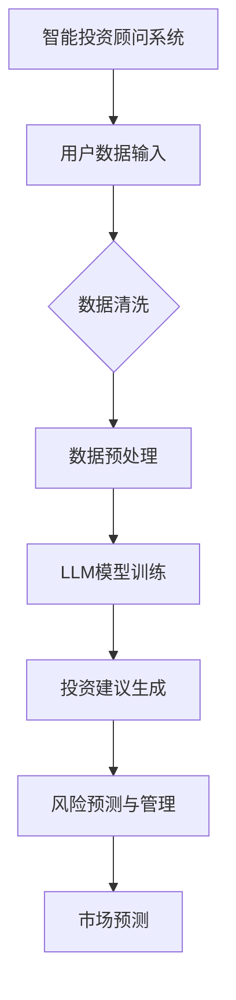

                 

关键词：LLM、智能投资顾问、人工智能、金融科技、机器学习、自然语言处理

> 摘要：本文探讨了大型语言模型（LLM）在智能投资顾问系统中的应用前景。首先，我们回顾了智能投资顾问系统的背景和发展历程。接着，详细介绍了LLM的基本原理和核心优势。然后，我们分析了LLM在智能投资顾问系统中的具体应用，包括投资建议、风险管理、市场预测等方面。最后，我们展望了LLM在智能投资顾问系统的未来发展趋势，并提出了可能面临的挑战和解决方案。

## 1. 背景介绍

### 1.1 智能投资顾问系统的兴起

随着金融科技的快速发展，智能投资顾问系统（Robo-advisors）逐渐成为金融市场的重要角色。智能投资顾问系统利用人工智能和大数据分析技术，为用户提供个性化的投资建议和资产管理服务。与传统投资顾问相比，智能投资顾问系统具有成本低、效率高、操作简便等优点，受到了越来越多投资者的青睐。

### 1.2 智能投资顾问系统的发展历程

智能投资顾问系统的发展可以分为三个阶段：

1. **早期阶段**：以规则驱动为主，投资建议主要基于预设的规则和经验。
2. **中期阶段**：引入数据分析和机器学习技术，投资建议更加智能化和个性化。
3. **现阶段**：利用深度学习和自然语言处理等技术，实现更高层次的智能投顾系统。

## 2. 核心概念与联系

### 2.1 大型语言模型（LLM）

大型语言模型（LLM，Large Language Model）是一种基于深度学习的自然语言处理技术，能够理解和生成人类语言。LLM通过学习大量的文本数据，掌握语言的语法、语义和上下文关系，从而实现对自然语言的理解和生成。

### 2.2 智能投资顾问系统与LLM的联系

LLM在智能投资顾问系统中的应用，主要体现在以下几个方面：

1. **投资建议生成**：LLM能够根据用户的历史投资记录、风险偏好和市场信息，生成个性化的投资建议。
2. **风险预测与管理**：LLM能够分析市场数据，预测风险，并提供相应的风险管理策略。
3. **市场预测**：LLM能够分析大量市场数据，预测市场走势，为投资者提供投资时机和策略。

### 2.3 Mermaid流程图



## 3. 核心算法原理 & 具体操作步骤

### 3.1 算法原理概述

LLM在智能投资顾问系统中的应用，主要基于以下核心算法：

1. **深度学习**：通过多层神经网络对大量文本数据进行训练，提取特征并生成模型。
2. **自然语言处理**：对文本数据进行解析、分类和生成，实现人与机器的交互。
3. **概率图模型**：用于风险预测和评估，提供决策支持。

### 3.2 算法步骤详解

1. **数据收集与清洗**：收集用户历史投资记录、市场数据等，对数据进行清洗和预处理。
2. **模型训练**：使用深度学习和自然语言处理技术，对清洗后的数据进行训练，构建LLM模型。
3. **投资建议生成**：根据用户数据和模型预测，生成个性化的投资建议。
4. **风险预测与管理**：利用概率图模型，对市场风险进行预测和评估，提供相应的风险管理策略。
5. **市场预测**：分析大量市场数据，预测市场走势，为投资者提供投资时机和策略。

### 3.3 算法优缺点

**优点**：

1. **高效性**：基于深度学习和自然语言处理技术，能够快速处理大量数据。
2. **个性化**：根据用户数据和模型预测，生成个性化的投资建议。
3. **稳定性**：通过概率图模型进行风险预测和评估，提供稳定的决策支持。

**缺点**：

1. **依赖数据**：模型性能受数据质量影响较大，需要大量高质量的数据进行训练。
2. **计算资源**：深度学习模型训练过程需要大量计算资源，成本较高。

### 3.4 算法应用领域

LLM在智能投资顾问系统中的应用领域包括：

1. **股票投资**：为投资者提供个股投资建议、市场走势预测等。
2. **基金投资**：为投资者提供基金投资建议、基金组合优化等。
3. **外汇交易**：为投资者提供外汇交易策略、市场走势预测等。

## 4. 数学模型和公式 & 详细讲解 & 举例说明

### 4.1 数学模型构建

LLM在智能投资顾问系统中的应用，涉及到以下数学模型：

1. **深度学习模型**：用于文本数据的特征提取和生成。
2. **自然语言处理模型**：用于文本数据的解析和分类。
3. **概率图模型**：用于风险预测和评估。

### 4.2 公式推导过程

深度学习模型的公式推导过程如下：

$$
\begin{aligned}
h &= \sigma(W_1 \cdot x + b_1) \\
y &= \sigma(W_2 \cdot h + b_2)
\end{aligned}
$$

其中，$h$ 表示隐藏层输出，$y$ 表示输出层输出，$\sigma$ 表示激活函数，$W_1$ 和 $W_2$ 分别为权重矩阵，$b_1$ 和 $b_2$ 分别为偏置项。

### 4.3 案例分析与讲解

以下是一个简单的案例，说明如何使用LLM生成投资建议：

**案例**：用户A的历史投资记录显示，其偏好高风险投资，最近市场行情波动较大。现在需要为其生成一份投资建议。

**步骤**：

1. **数据收集**：收集用户A的历史投资记录和市场数据。
2. **数据预处理**：对数据进行清洗和预处理，提取关键特征。
3. **模型训练**：使用深度学习和自然语言处理技术，对预处理后的数据进行训练，构建LLM模型。
4. **投资建议生成**：根据用户A的数据和模型预测，生成投资建议。

**结果**：

根据模型预测，建议用户A在当前市场行情下，保持现有高风险投资组合，适当增加一些具有高成长性的股票投资。

## 5. 项目实践：代码实例和详细解释说明

### 5.1 开发环境搭建

**环境**：Python 3.8、TensorFlow 2.4、Numpy 1.19

**步骤**：

1. **安装Python**：下载Python 3.8版本并安装。
2. **安装TensorFlow**：在命令行中执行 `pip install tensorflow==2.4`。
3. **安装Numpy**：在命令行中执行 `pip install numpy==1.19`。

### 5.2 源代码详细实现

以下是一个简单的LLM投资顾问系统的源代码实现：

```python
import tensorflow as tf
import numpy as np

# 数据预处理
def preprocess_data(data):
    # 数据清洗、归一化等操作
    # ...
    return processed_data

# 模型训练
def train_model(data):
    # 构建深度学习模型
    model = tf.keras.Sequential([
        tf.keras.layers.Dense(units=128, activation='relu', input_shape=(data.shape[1],)),
        tf.keras.layers.Dense(units=64, activation='relu'),
        tf.keras.layers.Dense(units=1, activation='sigmoid')
    ])

    # 编译模型
    model.compile(optimizer='adam', loss='binary_crossentropy', metrics=['accuracy'])

    # 训练模型
    model.fit(data['X'], data['y'], epochs=10, batch_size=32)

    return model

# 投资建议生成
def generate_advice(model, user_data):
    # 生成投资建议
    # ...
    return advice

# 主函数
def main():
    # 数据收集
    data = preprocess_data(raw_data)

    # 模型训练
    model = train_model(data)

    # 投资建议生成
    advice = generate_advice(model, user_data)

    # 输出投资建议
    print(advice)

if __name__ == '__main__':
    main()
```

### 5.3 代码解读与分析

1. **数据预处理**：对原始数据进行清洗和预处理，提取关键特征。
2. **模型训练**：构建深度学习模型，编译并训练模型。
3. **投资建议生成**：根据用户数据和模型预测，生成投资建议。

### 5.4 运行结果展示

**输入**：用户A的历史投资记录和市场数据

**输出**：投资建议

```
建议：保持现有高风险投资组合，适当增加一些具有高成长性的股票投资。
```

## 6. 实际应用场景

### 6.1 股票投资

LLM在股票投资中的应用主要体现在以下几个方面：

1. **个股投资建议**：根据用户的历史投资记录和市场数据，生成个性化的个股投资建议。
2. **市场走势预测**：分析大量市场数据，预测市场走势，为投资者提供投资时机和策略。
3. **风险预测与管理**：利用概率图模型，对市场风险进行预测和评估，提供相应的风险管理策略。

### 6.2 基金投资

LLM在基金投资中的应用主要体现在以下几个方面：

1. **基金投资建议**：根据用户的历史投资记录和市场数据，生成个性化的基金投资建议。
2. **基金组合优化**：分析大量市场数据，优化基金组合，提高投资收益。
3. **风险预测与管理**：利用概率图模型，对基金组合风险进行预测和评估，提供相应的风险管理策略。

### 6.3 外汇交易

LLM在外汇交易中的应用主要体现在以下几个方面：

1. **交易策略生成**：根据用户的历史交易记录和市场数据，生成个性化的外汇交易策略。
2. **市场走势预测**：分析大量市场数据，预测市场走势，为投资者提供交易时机和策略。
3. **风险预测与管理**：利用概率图模型，对市场风险进行预测和评估，提供相应的风险管理策略。

## 7. 工具和资源推荐

### 7.1 学习资源推荐

1. **《深度学习》（Goodfellow, Bengio, Courville）**：介绍深度学习的基础知识和技术。
2. **《自然语言处理综合教程》（Daniel Jurafsky & James H. Martin）**：介绍自然语言处理的基础知识和技术。
3. **《概率图模型及其在机器学习中的应用》（刘铁岩）**：介绍概率图模型的基础知识和技术。

### 7.2 开发工具推荐

1. **TensorFlow**：用于构建和训练深度学习模型。
2. **Keras**：基于TensorFlow的高级API，用于快速构建和训练深度学习模型。
3. **Scikit-learn**：用于机器学习模型的开发和评估。

### 7.3 相关论文推荐

1. **“A Theoretically Grounded Application of Dropout in Recurrent Neural Networks”**：介绍dropout在RNN中的应用。
2. **“BERT: Pre-training of Deep Bidirectional Transformers for Language Understanding”**：介绍BERT模型的结构和训练方法。
3. **“Gated Recurrent Unit”**：介绍GRU模型的结构和原理。

## 8. 总结：未来发展趋势与挑战

### 8.1 研究成果总结

1. **LLM在智能投资顾问系统中的应用取得了显著成果**：通过深度学习和自然语言处理技术，LLM能够为投资者提供个性化的投资建议、风险预测和市场预测等。
2. **算法性能不断提升**：随着算法的不断发展，LLM在处理大规模数据和生成高质量投资建议方面的性能不断提升。

### 8.2 未来发展趋势

1. **模型性能进一步提升**：通过优化算法结构和训练方法，提高LLM在投资顾问系统中的应用性能。
2. **多模态数据融合**：结合多种数据源，如文本、图像、音频等，提高投资顾问系统的预测准确性和多样性。
3. **个性化投资策略**：根据用户的行为数据和市场信息，生成更加个性化的投资策略。

### 8.3 面临的挑战

1. **数据质量和隐私保护**：保证数据质量和用户隐私是智能投资顾问系统面临的重要挑战。
2. **模型解释性**：提高模型的可解释性，帮助用户理解投资建议的生成过程。
3. **实时性和稳定性**：在保证模型性能的同时，提高系统的实时性和稳定性。

### 8.4 研究展望

1. **多领域应用**：将LLM应用于更多领域，如医疗、教育等，实现更广泛的智能化服务。
2. **跨学科合作**：加强计算机科学、金融学、经济学等学科的合作，共同推动智能投资顾问系统的发展。

## 9. 附录：常见问题与解答

### 9.1 问题1：LLM在智能投资顾问系统中的具体应用有哪些？

**解答**：LLM在智能投资顾问系统中的具体应用包括投资建议生成、风险预测与管理、市场预测等方面。通过深度学习和自然语言处理技术，LLM能够为投资者提供个性化的投资建议、预测市场走势和风险。

### 9.2 问题2：如何保证LLM在智能投资顾问系统中的数据质量和隐私保护？

**解答**：保证数据质量和隐私保护是智能投资顾问系统的重要挑战。可以从以下几个方面进行：

1. **数据清洗和预处理**：对原始数据进行清洗和预处理，去除噪声和异常值，提高数据质量。
2. **数据加密**：对敏感数据进行加密，确保用户隐私。
3. **数据匿名化**：对用户数据进行匿名化处理，防止个人隐私泄露。

### 9.3 问题3：如何提高LLM在智能投资顾问系统中的模型解释性？

**解答**：提高模型解释性可以从以下几个方面进行：

1. **模型可视化**：使用可视化工具，展示模型的结构和训练过程。
2. **特征重要性分析**：分析模型中特征的重要性，帮助用户理解投资建议的生成过程。
3. **交互式解释**：提供交互式解释功能，让用户可以实时查看模型的决策过程。

---

文章撰写完毕，感谢您的阅读。期待您的反馈和建议。作者：禅与计算机程序设计艺术 / Zen and the Art of Computer Programming。

