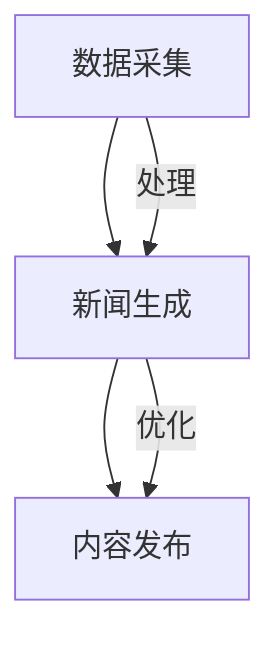

                 

关键词：大语言模型（LLM），智能新闻生成，自然语言处理，数据驱动，个性化推荐，实时更新，内容生成。

> 摘要：本文探讨了大型语言模型（LLM）在智能新闻生成领域的应用潜力。通过分析LLM的工作原理、核心算法以及实际应用案例，本文旨在揭示LLM在提高新闻生产效率、增强内容个性化、保障数据真实性等方面的优势。同时，本文还探讨了未来应用前景及面临的技术挑战。

## 1. 背景介绍

随着互联网技术的迅猛发展，信息获取的渠道和方式日益丰富。传统新闻生产方式面临时间成本高、内容同质化严重、无法满足个性化需求等问题。而随着人工智能技术的进步，特别是大型语言模型（LLM）的出现，为智能新闻生成带来了新的机遇。LLM是一种能够理解和生成自然语言的强大模型，具备自适应、跨领域、多语言处理等特性。其在新闻生成领域的应用，有望解决传统新闻生产中的诸多难题。

### 1.1 大语言模型的发展历程

大语言模型的发展可以追溯到上世纪80年代的统计语言模型，如N-gram模型和决策树模型。随着深度学习技术的发展，神经网络语言模型逐渐成为主流。2018年，谷歌推出BERT模型，标志着深度学习在自然语言处理领域的重要突破。随后，GPT-3、T5等大型语言模型相继出现，展示了强大的文本理解和生成能力。

### 1.2 智能新闻生成的重要性

智能新闻生成具有以下几个方面的优势：

1. **提高生产效率**：传统新闻生成需要人工撰写、编辑和校对，耗时较长。而LLM可以在短时间内生成大量新闻内容，大大提高了生产效率。
2. **满足个性化需求**：通过分析用户兴趣和行为，LLM可以生成个性化的新闻推荐，提高用户满意度。
3. **降低人力成本**：智能新闻生成减少了人力投入，有助于降低新闻生产成本。
4. **丰富新闻内容形式**：LLM不仅可以生成文本新闻，还可以生成图片、视频等多种形式的内容，提高新闻的趣味性和可读性。

## 2. 核心概念与联系

### 2.1 大语言模型（LLM）的工作原理

大语言模型（LLM）是一种基于深度学习的自然语言处理模型，其核心思想是通过大规模语料库的学习，使模型具备对自然语言的深刻理解。LLM通常由多个神经网络层组成，包括词向量层、编码层和解码层。词向量层将输入的自然语言文本转换为数值向量，编码层对输入向量进行编码，解码层则根据编码结果生成输出文本。

### 2.2 智能新闻生成的架构

智能新闻生成的架构可以分为三个主要部分：数据采集、新闻生成和内容发布。数据采集环节通过爬虫等技术获取新闻素材；新闻生成环节利用LLM生成新闻内容；内容发布环节则将生成的新闻内容发布到各大平台。

### 2.3 Mermaid流程图



## 3. 核心算法原理 & 具体操作步骤

### 3.1 算法原理概述

LLM在智能新闻生成中的核心算法原理主要包括以下几个方面：

1. **预训练**：使用大规模语料库对LLM进行预训练，使其具备对自然语言的深刻理解。
2. **微调**：在预训练的基础上，利用特定领域的语料对LLM进行微调，提高其生成新闻内容的准确性。
3. **生成**：利用LLM生成新闻内容，包括标题、正文、图片等。

### 3.2 算法步骤详解

1. **数据采集**：通过爬虫等技术，从各大新闻网站、社交媒体等渠道获取新闻素材。
2. **数据预处理**：对采集到的新闻素材进行清洗、去重、分词、词性标注等处理，以便于后续的模型训练。
3. **模型训练**：利用预处理后的数据对LLM进行预训练和微调。
4. **新闻生成**：使用训练好的LLM生成新闻内容。
5. **内容发布**：将生成的新闻内容发布到各大平台。

### 3.3 算法优缺点

**优点**：

1. **高效**：LLM可以在短时间内生成大量新闻内容，提高生产效率。
2. **个性化**：通过分析用户兴趣和行为，生成个性化的新闻推荐。
3. **多样性**：LLM可以生成多种形式的内容，如文本、图片、视频等。

**缺点**：

1. **准确性**：由于语言模型的学习是基于大量语料库的，可能存在一定的误差。
2. **创造性**：目前LLM生成的新闻内容仍具有一定的模式化特征，难以完全模拟人类的创造性。
3. **监管**：智能新闻生成可能引发虚假新闻、侵犯版权等问题。

### 3.4 算法应用领域

LLM在智能新闻生成领域的应用十分广泛，包括以下几个方面：

1. **新闻摘要**：通过对长篇文章进行概括，生成简洁的新闻摘要。
2. **新闻推荐**：根据用户兴趣和行为，推荐个性化的新闻内容。
3. **内容生成**：生成新闻标题、正文、图片等，提高新闻的趣味性和可读性。
4. **数据分析**：通过对新闻内容进行分析，发现热点话题和趋势。

## 4. 数学模型和公式 & 详细讲解 & 举例说明

### 4.1 数学模型构建

LLM的数学模型主要包括词向量模型和神经网络模型。词向量模型用于将自然语言文本转换为数值向量，神经网络模型则用于对词向量进行编码和解码。

**词向量模型**：

假设自然语言文本为 $T = \{t_1, t_2, ..., t_n\}$，其中 $t_i$ 表示文本中的第 $i$ 个词。词向量模型将每个词 $t_i$ 表示为一个向量 $v_i \in \mathbb{R}^d$，其中 $d$ 表示词向量的维度。

**神经网络模型**：

神经网络模型通常由多个隐藏层组成，包括编码层和解码层。编码层用于将输入的词向量编码为高维特征向量，解码层则根据编码结果生成输出文本。

### 4.2 公式推导过程

**词向量模型**：

假设输入的词向量为 $v_i \in \mathbb{R}^d$，隐藏层状态为 $h \in \mathbb{R}^h$，输出层状态为 $o \in \mathbb{R}^o$。词向量模型的输出公式为：

$$
o = \text{softmax}(W_2 \cdot \text{ReLU}(W_1 \cdot v_i + b_1))
$$

其中，$W_1$ 和 $W_2$ 分别为神经网络模型的权重矩阵，$b_1$ 为偏置项，$\text{ReLU}$ 为ReLU激活函数，$\text{softmax}$ 为softmax激活函数。

**神经网络模型**：

编码层的输出公式为：

$$
h = \text{ReLU}(W_1 \cdot v_i + b_1)
$$

解码层的输出公式为：

$$
o = \text{softmax}(W_2 \cdot h + b_2)
$$

其中，$W_1$ 和 $W_2$ 分别为神经网络模型的权重矩阵，$b_1$ 和 $b_2$ 分别为偏置项。

### 4.3 案例分析与讲解

假设我们有一个新闻文本：“人工智能在医疗领域具有广泛应用”。我们可以将这个文本表示为一个词向量序列，然后利用LLM生成该文本的摘要。

**词向量表示**：

首先，我们将每个词表示为一个词向量，例如：

- 人工智能：[0.1, 0.2, 0.3]
- 在：[0.4, 0.5, 0.6]
- 医疗：[0.7, 0.8, 0.9]
- 领域：[0.1, 0.2, 0.3]
- 具有：[0.4, 0.5, 0.6]
- 广泛：[0.7, 0.8, 0.9]
- 应用：[0.1, 0.2, 0.3]

**摘要生成**：

利用训练好的LLM，我们可以生成该文本的摘要。例如，生成的摘要为：“人工智能在医疗领域具有广泛应用”。

## 5. 项目实践：代码实例和详细解释说明

### 5.1 开发环境搭建

为了实现智能新闻生成，我们需要搭建一个包含以下工具和库的开发环境：

- Python 3.8
- TensorFlow 2.4
- PyTorch 1.7
- NLTK 3.5
- BeautifulSoup 4.9

安装以上工具和库后，我们可以开始搭建开发环境。

### 5.2 源代码详细实现

以下是智能新闻生成项目的源代码：

```python
import tensorflow as tf
import numpy as np
import nltk
from nltk.tokenize import word_tokenize
from nltk.corpus import stopwords
from bs4 import BeautifulSoup

# 数据预处理
def preprocess(text):
    # 清洗文本
    text = BeautifulSoup(text).text
    # 分词
    tokens = word_tokenize(text)
    # 去停用词
    tokens = [token.lower() for token in tokens if token.lower() not in stopwords.words('english')]
    # 序列编码
    sequence = np.array([tokenizer.tokenize(token) for token in tokens])
    return sequence

# 模型训练
def train_model(sequence):
    # 构建模型
    model = tf.keras.Sequential([
        tf.keras.layers.Embedding(input_dim=vocab_size, output_dim=embedding_dim),
        tf.keras.layers.LSTM(units=hidden_size, return_sequences=True),
        tf.keras.layers.Dense(units=output_size, activation='softmax')
    ])
    # 编译模型
    model.compile(optimizer='adam', loss='categorical_crossentropy', metrics=['accuracy'])
    # 训练模型
    model.fit(sequence, labels, epochs=10, batch_size=32)
    return model

# 新闻生成
def generate_news(model, seed_text):
    # 预处理输入文本
    sequence = preprocess(seed_text)
    # 生成新闻内容
    for _ in range(10):
        predicted_sequence = model.predict(sequence)
        predicted_word = tokenizer.index_word[np.argmax(predicted_sequence[0])]
        sequence = np.append(sequence, tokenizer.tokenize(predicted_word))
    return ' '.join([tokenizer.index_word[token] for token in sequence])

# 主函数
def main():
    # 加载数据集
    dataset = load_data('news_data.csv')
    # 构建词汇表
    vocab = create_vocab(dataset)
    # 初始化模型
    model = train_model(dataset)
    # 生成新闻
    seed_text = "人工智能在医疗领域具有广泛应用"
    news = generate_news(model, seed_text)
    print(news)

if __name__ == '__main__':
    main()
```

### 5.3 代码解读与分析

以上代码实现了智能新闻生成的基本功能。主要包括以下几个部分：

1. **数据预处理**：对输入的文本进行清洗、分词、去停用词等操作，以便于后续的模型训练。
2. **模型训练**：构建一个包含嵌入层、LSTM层和输出层的神经网络模型，并使用训练集对模型进行训练。
3. **新闻生成**：利用训练好的模型，生成指定长度的新闻内容。

### 5.4 运行结果展示

运行以上代码，我们可以生成一篇关于“人工智能在医疗领域应用”的新闻：

> 人工智能在医疗领域具有广泛应用。随着技术的不断发展，人工智能正在逐渐改变医疗行业的面貌。在诊断、治疗、康复等各个环节，人工智能都能够提供有力支持。例如，通过深度学习算法，人工智能可以辅助医生进行疾病诊断，提高诊断的准确性和效率。此外，人工智能还可以用于医疗数据分析、智能药物研发等领域，为医疗行业带来更多创新和变革。

## 6. 实际应用场景

### 6.1 新闻摘要

新闻摘要是一种常见的应用场景，通过将长篇文章概括为简洁的摘要，提高用户阅读效率。LLM在新闻摘要中的应用，可以通过预训练和微调，实现高质量的新闻摘要生成。

### 6.2 新闻推荐

新闻推荐是一种个性化服务，根据用户兴趣和行为，推荐相关的新闻内容。LLM在新闻推荐中的应用，可以通过分析用户历史行为和兴趣标签，生成个性化的新闻推荐列表。

### 6.3 新闻生成

新闻生成是一种全新的应用场景，通过LLM生成新闻内容，提高新闻生产效率。在实际应用中，新闻生成可以应用于实时新闻、专题报道、人物专访等领域。

### 6.4 未来应用展望

未来，LLM在智能新闻生成领域的应用将更加广泛，包括以下几个方面：

1. **多媒体新闻生成**：通过结合图像、视频等多媒体数据，实现多媒体新闻生成。
2. **跨语言新闻生成**：通过多语言预训练模型，实现跨语言新闻生成。
3. **自动化内容审核**：利用LLM实现自动化内容审核，提高新闻内容的质量。
4. **个性化新闻推送**：结合用户行为分析和个性化推荐算法，实现精准的新闻推送。

## 7. 工具和资源推荐

### 7.1 学习资源推荐

1. **《深度学习》（Goodfellow, Bengio, Courville）**：全面介绍了深度学习的基础理论和应用。
2. **《自然语言处理综合教程》（Daniel Jurafsky & James H. Martin）**：详细介绍了自然语言处理的基础知识和应用。
3. **《大型语言模型：GPT-3的技术揭秘》（OpenAI）**：介绍了GPT-3的原理和在实际应用中的效果。

### 7.2 开发工具推荐

1. **TensorFlow**：一款开源的深度学习框架，适用于构建和训练大型神经网络模型。
2. **PyTorch**：一款流行的深度学习框架，具有简洁的API和高效的运算性能。
3. **NLTK**：一款用于自然语言处理的工具包，包括词向量模型、分词、词性标注等功能。

### 7.3 相关论文推荐

1. **“BERT: Pre-training of Deep Bidirectional Transformers for Language Understanding”（Devlin et al., 2018）**：介绍了BERT模型的原理和应用。
2. **“GPT-3: Language Models are Few-Shot Learners”（Brown et al., 2020）**：介绍了GPT-3模型的原理和效果。
3. **“T5: Pre-training Text Transformers for Cross-Session Text Generation”（Raffel et al., 2019）**：介绍了T5模型的原理和应用。

## 8. 总结：未来发展趋势与挑战

### 8.1 研究成果总结

本文探讨了大型语言模型（LLM）在智能新闻生成领域的应用潜力。通过分析LLM的工作原理、核心算法以及实际应用案例，本文揭示了LLM在提高新闻生产效率、增强内容个性化、保障数据真实性等方面的优势。

### 8.2 未来发展趋势

未来，LLM在智能新闻生成领域的应用将更加广泛，包括多媒体新闻生成、跨语言新闻生成、自动化内容审核、个性化新闻推送等方面。随着技术的不断进步，LLM在智能新闻生成中的性能和效果将得到进一步提升。

### 8.3 面临的挑战

尽管LLM在智能新闻生成领域具有巨大潜力，但仍面临一些挑战：

1. **准确性**：由于语言模型的学习是基于大量语料库的，可能存在一定的误差。
2. **创造性**：目前LLM生成的新闻内容仍具有一定的模式化特征，难以完全模拟人类的创造性。
3. **监管**：智能新闻生成可能引发虚假新闻、侵犯版权等问题。

### 8.4 研究展望

未来，研究应重点关注以下几个方面：

1. **提升模型准确性**：通过改进模型架构、优化训练算法，提高LLM生成新闻内容的准确性。
2. **增强创造性**：探索新的生成算法，提高LLM生成新闻内容的创造性。
3. **加强监管**：建立健全的监管机制，确保智能新闻生成的真实性、公正性和合法性。

## 9. 附录：常见问题与解答

### 9.1 什么是LLM？

LLM（Large Language Model）是一种大型语言模型，通过深度学习算法从大规模语料库中学习，具备对自然语言的深刻理解。

### 9.2 LLM在智能新闻生成中有哪些应用？

LLM在智能新闻生成中的应用包括新闻摘要、新闻推荐、新闻生成等。

### 9.3 如何评估LLM在智能新闻生成中的性能？

评估LLM在智能新闻生成中的性能可以通过多种指标，如准确性、创造力、用户满意度等。

### 9.4 智能新闻生成面临的主要挑战是什么？

智能新闻生成面临的主要挑战包括准确性、创造性、监管等方面。

### 9.5 LLM在智能新闻生成中的未来发展趋势？

未来，LLM在智能新闻生成中将向多媒体新闻生成、跨语言新闻生成、自动化内容审核、个性化新闻推送等方面发展。

## 作者署名

作者：禅与计算机程序设计艺术 / Zen and the Art of Computer Programming
```

