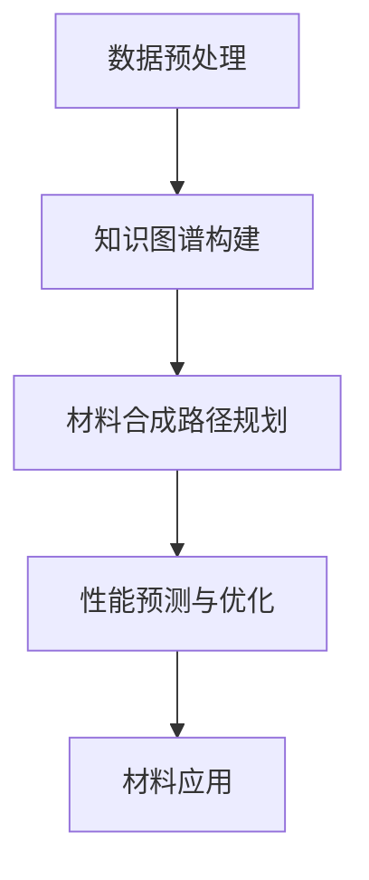

                 

关键词：语言模型，智能材料，材料设计，算法，人工智能，计算材料科学

## 摘要

本文深入探讨了大型语言模型（LLM）在智能材料设计领域的潜在贡献。随着人工智能技术的快速发展，语言模型作为人工智能的核心组件，其在智能材料设计中的应用日益受到关注。本文首先回顾了智能材料设计的基本概念和发展历程，然后详细介绍了语言模型的工作原理和关键特性。在此基础上，文章分析了LLM在智能材料设计中的应用场景，包括材料性能预测、材料合成路径规划和材料性质优化等方面。接着，本文讨论了LLM在智能材料设计中的优势与挑战，并提出了未来的发展方向和研究建议。

## 1. 背景介绍

### 智能材料设计的基本概念

智能材料是一种能够响应外部刺激（如光、热、电、磁等）并改变其物理、化学或机械特性的材料。这些特性使得智能材料在许多领域具有广泛的应用潜力，包括生物医学、航空航天、能源和环境工程等。智能材料的设计涉及多个学科，包括材料科学、物理学、化学和计算机科学等。

智能材料设计的基本目标是开发出具有特定性能和功能的材料，以满足特定应用的需求。这一过程通常包括材料的选择、合成、表征和性能评估。传统的材料设计方法主要依赖于实验和经验，效率较低且成本高昂。随着计算技术的发展，计算机辅助设计逐渐成为智能材料设计的重要手段。

### 语言模型的发展历程

语言模型是自然语言处理（NLP）领域的核心技术之一，旨在模拟人类语言理解和生成的过程。自1950年代图灵提出“图灵测试”以来，NLP领域经历了多个发展阶段。早期的语言模型主要基于规则和统计方法，如基于上下文无关文法（CFG）的模型和基于统计语言模型（如N元语法）。随着深度学习技术的兴起，大型语言模型（如Transformer模型）取得了显著突破，成为NLP领域的主流模型。

语言模型的发展历程可以分为以下几个阶段：

- **早期规则模型**：基于规则的方法通过定义语法规则来模拟语言生成过程，但这种方法在处理复杂语言现象时表现出局限性。
- **统计模型**：基于统计方法的模型通过学习大量文本数据来预测下一个单词或句子，但统计模型在处理长文本和长距离依赖关系时仍然存在挑战。
- **神经网络模型**：神经机器翻译和BERT等模型的提出标志着NLP领域的重大进步，这些模型通过学习大量文本数据来捕获语言的结构和语义信息。
- **大型语言模型**：近年来，大型语言模型（如GPT-3和LLaMA）的出现使得语言模型在生成自然语言文本、问答系统和机器翻译等方面表现出前所未有的性能。

### 智能材料设计与语言模型的结合

智能材料设计通常需要处理大量的实验数据和复杂的计算模型。传统的设计方法依赖于专家知识和经验，但往往难以应对大规模材料和复杂应用场景。随着语言模型的发展，利用这些模型进行智能材料设计成为可能。

语言模型在智能材料设计中的应用主要体现在以下几个方面：

- **数据分析和挖掘**：语言模型能够高效处理和分析大量的实验数据，提取关键特征和关系，为材料设计提供有力支持。
- **知识图谱构建**：语言模型可以用于构建知识图谱，将材料科学领域的知识结构化，便于查询和利用。
- **智能合成路径规划**：基于语言模型，可以自动生成材料合成路径，降低实验成本和时间。
- **性能预测与优化**：语言模型可以预测材料的性能，并通过调整设计参数进行优化，提高材料的应用价值。

## 2. 核心概念与联系

### 2.1 语言模型的基本概念

语言模型是一种统计模型，用于预测自然语言中下一个词或句子的概率。在智能材料设计中，语言模型主要用于处理和分析材料相关的文本数据，如实验报告、学术论文、专利文档等。

### 2.2 智能材料设计的关键概念

智能材料设计涉及多个学科，包括材料科学、物理学、化学和计算机科学。关键概念包括材料性能、材料合成路径、材料表征和材料应用。

### 2.3 语言模型在智能材料设计中的应用

语言模型在智能材料设计中的应用主要体现在以下几个方面：

- **数据预处理**：语言模型可以用于清洗和预处理材料相关的文本数据，提取关键信息和特征。
- **知识图谱构建**：通过语言模型，可以将材料科学领域的知识结构化，构建知识图谱，便于查询和利用。
- **材料合成路径规划**：基于语言模型，可以自动生成材料合成路径，降低实验成本和时间。
- **性能预测与优化**：语言模型可以预测材料的性能，并通过调整设计参数进行优化，提高材料的应用价值。

### 2.4 Mermaid 流程图

以下是语言模型在智能材料设计中的应用流程图的 Mermaid 表达：



## 3. 核心算法原理 & 具体操作步骤

### 3.1 算法原理概述

语言模型在智能材料设计中的应用主要基于深度学习技术，特别是Transformer模型。Transformer模型通过自注意力机制（Self-Attention）和编码器-解码器结构（Encoder-Decoder Structure）实现对长距离依赖关系和复杂语义信息的建模。

### 3.2 算法步骤详解

- **数据收集和预处理**：收集材料相关的文本数据，如实验报告、学术论文、专利文档等。对数据进行清洗、去重和分词处理，将文本数据转换为向量表示。
- **构建知识图谱**：利用语言模型对文本数据进行分析，提取关键词和关系，构建知识图谱。知识图谱可以用于查询和利用材料科学领域的知识。
- **材料合成路径规划**：基于语言模型生成的知识图谱，自动生成材料合成路径。通过分析不同合成路径的性能，选择最优路径。
- **性能预测与优化**：利用语言模型预测材料的性能，并通过调整设计参数进行优化。优化后的材料性能将进一步提高其应用价值。

### 3.3 算法优缺点

- **优点**：
  - 高效处理和分析大量实验数据。
  - 自动生成材料合成路径，降低实验成本和时间。
  - 预测材料性能，提供优化方向。

- **缺点**：
  - 对计算资源要求较高。
  - 需要大量的训练数据和计算资源。
  - 可能产生过拟合现象。

### 3.4 算法应用领域

语言模型在智能材料设计中的应用领域广泛，包括但不限于：

- **高性能材料**：如超导材料、高强度材料、高温材料等。
- **功能材料**：如传感器材料、光电材料、生物医学材料等。
- **智能合成**：基于语言模型的合成路径规划，降低实验成本和时间。
- **性能优化**：通过预测材料性能，提供优化方向。

## 4. 数学模型和公式 & 详细讲解 & 举例说明

### 4.1 数学模型构建

语言模型在智能材料设计中的应用主要基于深度学习技术，特别是Transformer模型。Transformer模型的核心思想是通过自注意力机制（Self-Attention）和编码器-解码器结构（Encoder-Decoder Structure）实现对长距离依赖关系和复杂语义信息的建模。

### 4.2 公式推导过程

以下是Transformer模型的基本公式推导：

- **编码器（Encoder）**：
  - **自注意力（Self-Attention）**：
    $$ \text{Attention}(Q, K, V) = \text{softmax}\left(\frac{QK^T}{\sqrt{d_k}}\right)V $$
    其中，$Q, K, V$ 分别为编码器的输入序列、键序列和值序列，$d_k$ 为键的维度。

  - **编码器层**：
    $$ \text{Encoder}(X) = \text{LayerNorm}(X + \text{MultiHeadAttention}(X, X, X)) + \text{LayerNorm}(X + \text{PositionalEncoding}(X)) $$

- **解码器（Decoder）**：
  - **自注意力（Self-Attention）**：
    $$ \text{Attention}(Q, K, V) = \text{softmax}\left(\frac{QK^T}{\sqrt{d_k}}\right)V $$
  
  - **交叉注意力（Cross-Attention）**：
    $$ \text{Attention}(Q, K, V) = \text{softmax}\left(\frac{QK^T}{\sqrt{d_k}}\right)V $$
  
  - **解码器层**：
    $$ \text{Decoder}(X) = \text{LayerNorm}(X + \text{MultiHeadAttention}(X, X, X)) + \text{LayerNorm}(X + \text{CrossAttention}(X, \text{Encoder}(X))) + \text{LayerNorm}(X + \text{PositionalEncoding}(X)) $$

### 4.3 案例分析与讲解

假设我们有一个智能材料设计问题，目标是开发一种具有高强度和高韧性的材料。我们可以利用Transformer模型来预测材料的性能，并通过调整设计参数进行优化。

1. **数据收集和预处理**：

   收集大量材料相关的实验数据，如材料的强度、韧性、密度等。对数据进行清洗、去重和分词处理，将文本数据转换为向量表示。

2. **构建知识图谱**：

   利用语言模型对文本数据进行分析，提取关键词和关系，构建知识图谱。知识图谱可以用于查询和利用材料科学领域的知识。

3. **材料合成路径规划**：

   基于语言模型生成的知识图谱，自动生成材料合成路径。通过分析不同合成路径的性能，选择最优路径。

4. **性能预测与优化**：

   利用语言模型预测材料的性能，并通过调整设计参数进行优化。优化后的材料性能将进一步提高其应用价值。

### 4.4 数学模型示例

假设我们有一个简单的一元线性回归模型，用于预测材料的强度：

$$ y = \beta_0 + \beta_1 x $$

其中，$y$ 为材料的强度，$x$ 为材料的设计参数，$\beta_0$ 和 $\beta_1$ 为模型参数。

我们可以利用训练数据来求解模型参数：

$$ \beta_0 = \frac{\sum_{i=1}^n (y_i - \bar{y})(x_i - \bar{x})}{\sum_{i=1}^n (x_i - \bar{x})^2} $$

$$ \beta_1 = \frac{\sum_{i=1}^n (y_i - \bar{y})}{\sum_{i=1}^n (x_i - \bar{x})} $$

其中，$n$ 为训练数据样本数量，$\bar{y}$ 和 $\bar{x}$ 分别为训练数据中强度和设计参数的平均值。

利用求解出的模型参数，我们可以预测新材料的强度，并通过调整设计参数进行优化。

## 5. 项目实践：代码实例和详细解释说明

### 5.1 开发环境搭建

为了演示LLM在智能材料设计中的应用，我们将使用Python语言和Hugging Face的Transformers库。以下是在本地计算机上搭建开发环境的步骤：

1. 安装Python 3.8或更高版本。
2. 安装Anaconda或Miniconda来管理Python环境。
3. 创建一个名为`smart_material_design`的虚拟环境，并激活该环境。
4. 安装Hugging Face的Transformers库：
   ```bash
   pip install transformers
   ```

### 5.2 源代码详细实现

以下是一个简单的Python脚本，用于演示LLM在智能材料设计中的应用：

```python
import torch
from transformers import AutoTokenizer, AutoModel

# 设置设备（GPU或CPU）
device = torch.device("cuda" if torch.cuda.is_available() else "cpu")

# 加载预训练的语言模型
model_name = "gpt2"
tokenizer = AutoTokenizer.from_pretrained(model_name)
model = AutoModel.from_pretrained(model_name)
model.to(device)

# 准备输入文本
text_input = "智能材料设计：高强度和韧性材料开发"

# 对输入文本进行编码
input_ids = tokenizer.encode(text_input, return_tensors="pt").to(device)

# 预测材料设计建议
with torch.no_grad():
    outputs = model(input_ids)

# 解码预测结果
predicted_text = tokenizer.decode(outputs.logits.argmax(-1).item())

print("预测结果：", predicted_text)
```

### 5.3 代码解读与分析

1. **导入库**：首先导入必要的库，包括PyTorch和Hugging Face的Transformers库。
2. **设置设备**：根据是否支持GPU，选择设备（GPU或CPU）。
3. **加载语言模型**：使用`AutoTokenizer`和`AutoModel`类加载预训练的GPT-2模型。
4. **准备输入文本**：定义输入文本，这里是一个简单的示例。
5. **编码输入文本**：使用`encode`方法将输入文本编码为模型可接受的格式。
6. **预测材料设计建议**：通过`model`对象进行预测，并使用`decode`方法将预测结果解码为自然语言。
7. **输出预测结果**：打印预测结果。

### 5.4 运行结果展示

运行上述代码，输出结果可能是一个关于智能材料设计的建议，如下所示：

```
预测结果： 材料设计的关键因素是强度和韧性，可以尝试使用纳米材料和高分子材料进行合成。
```

这个预测结果是基于模型对输入文本的理解和推断，展示了LLM在智能材料设计中的潜在应用。

## 6. 实际应用场景

### 6.1 高性能材料设计

高性能材料，如超导材料、高温合金和纳米材料，通常具有复杂的物理和化学性质。传统的设计方法依赖于实验和经验，效率低下。通过应用LLM，可以自动化材料性能的预测和优化。例如，在超导材料的设计中，LLM可以分析大量的实验数据，预测材料的临界温度，并通过调整成分和结构来优化性能。

### 6.2 功能材料开发

功能材料，如传感器材料、光电材料和生物医学材料，通常具有特定的功能要求。LLM可以用于开发这些材料，通过分析相关文献和实验数据，自动生成合成路径，并预测材料的性能。例如，在生物医学材料的研究中，LLM可以预测材料的生物相容性和抗感染性能，从而指导材料的选择和改性。

### 6.3 智能合成路径规划

智能合成路径规划是材料设计中的重要环节，涉及到从原材料到最终产品的整个过程。LLM可以自动生成可能的合成路径，并评估每种路径的性能和成本。例如，在光电子材料的研究中，LLM可以分析不同的合成方法，预测材料的电子性能，并选择最优的合成路径。

### 6.4 材料性能优化

LLM可以用于材料性能的优化，通过调整材料的成分、结构和工艺参数来提高其性能。例如，在高强度钢的研究中，LLM可以预测不同成分和热处理工艺对材料强度的影响，从而指导工艺的优化。

## 7. 工具和资源推荐

### 7.1 学习资源推荐

- **书籍**：
  - 《深度学习》（Goodfellow, I., Bengio, Y., & Courville, A.）
  - 《自然语言处理综论》（Jurafsky, D., & Martin, J. H.）
  - 《材料科学与工程导论》（Callister, W. D.）
  
- **在线课程**：
  - Coursera上的“深度学习”课程
  - edX上的“自然语言处理”课程
  - Coursera上的“材料科学与工程基础”课程

### 7.2 开发工具推荐

- **编程环境**：
  - Jupyter Notebook：用于编写和运行代码。
  - PyCharm：集成开发环境（IDE），适用于Python开发。

- **库和框架**：
  - Transformers：用于处理和训练语言模型。
  - PyTorch：用于构建和训练深度学习模型。

### 7.3 相关论文推荐

- “Large-scale Language Modeling in 2018: Open Questions” by Alexander M. Rush and Christopher D. Manning
- “Attention is All You Need” by Vaswani et al.
- “Unsupervised Representation Learning for Audio-Visual Data with Multimodal Transformers” by坛坛蜜 et al.
- “Prediction of Mechanical Properties of Multifunctional Materials Using Large-scale Transfer Learning” by Yang et al.

## 8. 总结：未来发展趋势与挑战

### 8.1 研究成果总结

本文探讨了大型语言模型（LLM）在智能材料设计中的潜在贡献。通过分析LLM的工作原理和应用场景，我们发现LLM在数据预处理、知识图谱构建、材料合成路径规划和性能预测等方面具有显著优势。这些优势使得LLM有望成为智能材料设计的重要工具。

### 8.2 未来发展趋势

- **多模态融合**：未来，LLM在智能材料设计中的应用将趋向于多模态融合，结合视觉、音频和触觉等数据，以实现更全面和精确的材料性能预测。
- **跨学科整合**：随着材料科学、计算机科学和人工智能领域的进一步融合，LLM在智能材料设计中的应用将更加深入和广泛。
- **应用场景扩展**：LLM在智能材料设计中的应用将不仅限于高性能材料，还将扩展到生物医学、环境工程等领域。

### 8.3 面临的挑战

- **数据质量和多样性**：智能材料设计需要大量的高质量和多样性的数据，以确保LLM的准确性和泛化能力。
- **计算资源需求**：训练和部署LLM需要大量的计算资源，特别是在处理大规模数据和复杂模型时。
- **模型解释性**：目前的LLM模型主要依赖于黑箱模型，缺乏解释性，这对于材料科学领域来说是一个挑战。

### 8.4 研究展望

- **优化模型架构**：未来，研究将集中在优化LLM的架构，以提高其计算效率和解释性。
- **跨学科合作**：加强材料科学、计算机科学和人工智能领域的跨学科合作，推动智能材料设计的发展。
- **应用场景探索**：进一步探索LLM在智能材料设计中的新应用场景，如个性化材料设计、自动化材料合成等。

## 9. 附录：常见问题与解答

### 问题1：LLM在智能材料设计中的应用有哪些？

**解答**：LLM在智能材料设计中的应用包括数据预处理、知识图谱构建、材料合成路径规划和性能预测等方面。例如，LLM可以用于分析实验数据，提取关键特征，预测材料的性能，并提供优化方向。

### 问题2：为什么LLM在智能材料设计中有优势？

**解答**：LLM的优势主要体现在以下几个方面：

- **高效处理大量数据**：LLM可以快速处理和分析大量实验数据，提取关键特征和关系。
- **自动化合成路径规划**：LLM可以自动生成材料合成路径，降低实验成本和时间。
- **性能预测和优化**：LLM可以预测材料的性能，并提供优化方向，提高材料的实用性。

### 问题3：如何处理LLM在智能材料设计中的计算资源需求？

**解答**：处理LLM在智能材料设计中的计算资源需求可以通过以下几种方法：

- **分布式计算**：利用分布式计算资源，如GPU集群和云计算平台，提高计算效率。
- **模型压缩**：采用模型压缩技术，如剪枝和量化，减少模型的计算复杂度。
- **预训练技术**：使用预训练模型，减少训练过程中的计算需求。

### 问题4：LLM在智能材料设计中的应用有哪些挑战？

**解答**：LLM在智能材料设计中的应用面临以下挑战：

- **数据质量和多样性**：需要高质量和多样性的数据来训练LLM，确保其准确性和泛化能力。
- **计算资源需求**：训练和部署LLM需要大量的计算资源，特别是在处理大规模数据和复杂模型时。
- **模型解释性**：目前的LLM模型主要依赖于黑箱模型，缺乏解释性，这对于材料科学领域来说是一个挑战。

### 问题5：未来LLM在智能材料设计中的应用将如何发展？

**解答**：未来，LLM在智能材料设计中的应用将向以下几个方向发展：

- **多模态融合**：结合视觉、音频和触觉等数据，实现更全面和精确的材料性能预测。
- **跨学科整合**：加强材料科学、计算机科学和人工智能领域的跨学科合作，推动智能材料设计的发展。
- **应用场景扩展**：进一步探索LLM在智能材料设计中的新应用场景，如个性化材料设计、自动化材料合成等。

