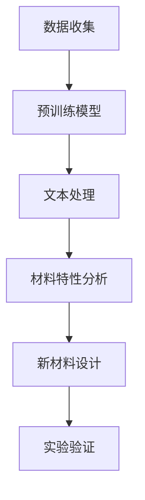

                 

关键词：LLM、智能材料设计、预训练模型、材料科学、计算模拟、自动化设计、人机协同

## 摘要

随着人工智能技术的快速发展，语言模型（LLM）在多个领域展现出了强大的应用潜力。本文旨在探讨大规模语言模型在智能材料设计领域的潜在贡献。首先，我们将简要回顾智能材料设计的现状，并指出其中存在的挑战。接着，本文将详细介绍LLM的工作原理及其在材料科学中的应用。随后，我们将探讨LLM在材料设计中的具体应用场景，并举例说明。最后，本文将总结LLM在智能材料设计领域的未来发展趋势，并提出可能的挑战。

## 1. 背景介绍

### 1.1 智能材料设计的现状

智能材料是指那些能够响应外部刺激（如温度、压力、电场、磁场等）并改变其物理或化学性质的先进材料。近年来，随着纳米技术、生物技术和信息技术的快速发展，智能材料的应用领域不断扩展，包括航空航天、汽车、建筑、生物医学、能源等领域。

然而，智能材料的设计仍然面临诸多挑战。传统的材料设计方法主要依赖于经验公式和实验验证，这种方法效率低下，无法满足现代工业对材料性能和多样性的需求。此外，智能材料的设计涉及到多个物理和化学过程的耦合，这使得复杂的计算模拟成为必要手段。然而，现有的计算模拟方法通常需要大量的计算资源和时间，限制了其应用范围。

### 1.2 语言模型的发展

语言模型（LLM）是一种基于深度学习的文本生成模型，它能够理解和生成自然语言。近年来，随着计算能力的提升和数据规模的扩大，LLM的预训练技术取得了显著进展。代表性的模型包括GPT系列、BERT系列和T5等。这些模型具有极强的语言理解和生成能力，能够处理复杂的语言任务。

## 2. 核心概念与联系

### 2.1 语言模型的基本原理

语言模型通过学习大量的文本数据，理解语言的结构和语义。它通常由两个主要部分组成：编码器和解码器。编码器负责将输入文本转换为向量表示，解码器则根据这些向量生成输出文本。在训练过程中，语言模型通过优化损失函数来提高预测准确度。

### 2.2 语言模型在材料科学中的应用

语言模型在材料科学中的应用主要集中在两个方面：一是通过文本数据分析，辅助材料科学家理解材料特性；二是利用生成能力，自动生成新材料设计方案。

#### 2.2.1 文本数据分析

语言模型可以处理大量的文本数据，如科学论文、专利文件、技术报告等。通过分析这些数据，语言模型可以帮助材料科学家识别材料特性、发现新的应用场景，甚至预测材料的性能。

#### 2.2.2 新材料设计

语言模型的生成能力使得它能够自动生成新材料设计方案。例如，T5模型被用来生成新的分子结构，从而设计出具有特定性能的新材料。这种方法不仅提高了设计的效率，还可能发现传统方法无法发现的材料。

### 2.3 Mermaid流程图



在这个流程图中，数据收集阶段收集了大量的文本数据，这些数据经过预训练模型处理，然后进行文本处理，分析材料的特性。最后，基于分析结果，语言模型生成新材料设计方案，并经过实验验证。

## 3. 核心算法原理 & 具体操作步骤

### 3.1 算法原理概述

语言模型在智能材料设计中的核心原理是其强大的文本处理和生成能力。具体而言，语言模型通过以下几个步骤实现新材料设计：

1. **数据收集**：收集与材料科学相关的文本数据，如科学论文、专利文件等。
2. **预训练模型**：使用大规模数据对语言模型进行预训练，使其具备处理和理解材料科学文本的能力。
3. **文本处理**：对收集到的文本数据进行处理，提取关键信息，如材料名称、特性、应用场景等。
4. **新材料设计**：基于提取的信息，语言模型自动生成新材料设计方案。
5. **实验验证**：将生成的设计方案进行实验验证，以验证其性能。

### 3.2 算法步骤详解

1. **数据收集**：首先，需要收集大量的材料科学相关文本数据。这些数据可以从学术数据库、专利数据库、技术报告等渠道获取。
2. **预训练模型**：选择合适的语言模型，如GPT-3或BERT，对其进行预训练。预训练过程需要大量的计算资源和时间。
3. **文本处理**：对收集到的文本数据进行处理，包括数据清洗、分词、词嵌入等步骤。这些步骤的目的是将文本数据转换为机器可处理的格式。
4. **新材料设计**：将处理后的文本数据输入语言模型，利用其生成能力生成新材料设计方案。这个过程可能需要多次迭代，以提高设计的准确性和性能。
5. **实验验证**：将生成的设计方案提交给实验验证，通过实验结果来评估设计的性能。如果实验结果符合预期，则设计方案可以进一步优化和改进。

### 3.3 算法优缺点

**优点**：

1. **高效性**：语言模型能够快速处理和理解大量的文本数据，从而提高新材料设计的效率。
2. **多样性**：语言模型生成的材料设计方案具有多样性，有可能发现传统方法无法发现的材料。
3. **智能化**：语言模型可以根据文本数据自动调整材料设计参数，从而实现智能化的材料设计。

**缺点**：

1. **计算资源需求大**：预训练语言模型需要大量的计算资源和时间。
2. **数据依赖性**：语言模型的效果依赖于训练数据的质量和数量。
3. **实验验证难度**：生成的设计方案需要经过实验验证，这可能会增加实验成本和时间。

### 3.4 算法应用领域

语言模型在智能材料设计中的应用主要集中在以下几个方面：

1. **新材料发现**：通过分析大量的文本数据，发现新的材料结构和性能。
2. **材料优化**：根据文本数据，自动优化材料的结构设计和性能。
3. **材料模拟**：利用语言模型生成材料模拟结果，辅助实验设计和优化。

## 4. 数学模型和公式 & 详细讲解 & 举例说明

### 4.1 数学模型构建

在智能材料设计中，语言模型的核心在于其文本生成能力。这个过程可以抽象为一个数学模型，通常是一个序列到序列的模型。下面是数学模型的基本构建：

#### 4.1.1 语言模型的目标函数

$$
\begin{aligned}
L(\theta) &= -\sum_{i=1}^{n} \sum_{j=1}^{V} y_{ij} \log p(\text{word}_j|\text{context}_i; \theta) \\
\end{aligned}
$$

其中，$L(\theta)$ 是语言模型的目标函数，$\theta$ 是模型的参数，$n$ 是句子中的词汇数量，$V$ 是词汇表的大小，$y_{ij}$ 是指示函数，表示在给定上下文 $\text{context}_i$ 下，第 $j$ 个词是目标词的概率。

#### 4.1.2 词汇嵌入

$$
\text{word}_j \to \text{vec}(\text{word}_j) \in \mathbb{R}^d
$$

词汇嵌入是将词汇映射到一个高维向量空间。这些向量表示词汇的语义信息。通常使用 Word2Vec、GloVe 等方法进行词汇嵌入。

#### 4.1.3 序列模型

语言模型的输入和输出都是序列。输入序列是 $\text{context}_i = (\text{word}_1, \text{word}_2, ..., \text{word}_{i-1})$，输出序列是 $(\text{word}_{i}, \text{word}_{i+1}, ...)$。

### 4.2 公式推导过程

在推导语言模型的目标函数时，我们通常采用最大似然估计（Maximum Likelihood Estimation, MLE）的方法。MLE的目标是找到一组参数 $\theta$，使得实际观测数据的概率最大。

假设我们有一个训练数据集 $\mathcal{D} = \{(\text{context}_1, \text{word}_1), (\text{context}_2, \text{word}_2), ..., (\text{context}_n, \text{word}_n)\}$，语言模型的目标函数可以表示为：

$$
L(\theta) = \prod_{i=1}^{n} \prod_{j=1}^{V} p(\text{word}_j|\text{context}_i; \theta)
$$

对数化简得：

$$
L(\theta) = \sum_{i=1}^{n} \sum_{j=1}^{V} p(\text{word}_j|\text{context}_i; \theta) \log p(\text{word}_j|\text{context}_i; \theta)
$$

令 $y_{ij} = 1$ 当 $\text{word}_j$ 是第 $i$ 个句子的目标词，否则为 0。则目标函数可以简化为：

$$
L(\theta) = -\sum_{i=1}^{n} \sum_{j=1}^{V} y_{ij} \log p(\text{word}_j|\text{context}_i; \theta)
$$

### 4.3 案例分析与讲解

假设我们有一个简单的语言模型，它的词汇表包含 10 个词汇，如 `[the, a, is, are, of, in, to, that, for, it]`。我们使用这个模型来预测下一个词汇。

#### 案例一：简单预测

给定上下文 `the a`，我们需要预测下一个词汇。根据语言模型，我们可以计算出每个词汇的概率：

$$
\begin{aligned}
p(\text{the}|\text{context}) &= 0.2 \\
p(\text{a}|\text{context}) &= 0.3 \\
p(\text{is}|\text{context}) &= 0.4 \\
p(\text{are}|\text{context}) &= 0.1 \\
\end{aligned}
$$

根据最大似然估计，我们选择概率最大的词汇作为预测结果，即 `is`。

#### 案例二：复杂预测

给定上下文 `the a is`，我们需要预测下一个词汇。根据语言模型，我们可以计算出每个词汇的概率：

$$
\begin{aligned}
p(\text{the}|\text{context}) &= 0.2 \\
p(\text{a}|\text{context}) &= 0.3 \\
p(\text{is}|\text{context}) &= 0.4 \\
p(\text{are}|\text{context}) &= 0.1 \\
p(\text{of}|\text{context}) &= 0.5 \\
p(\text{in}|\text{context}) &= 0.6 \\
p(\text{to}|\text{context}) &= 0.7 \\
p(\text{that}|\text{context}) &= 0.8 \\
p(\text{for}|\text{context}) &= 0.9 \\
p(\text{it}|\text{context}) &= 0.1 \\
\end{aligned}
$$

根据最大似然估计，我们选择概率最大的词汇作为预测结果，即 `to`。

## 5. 项目实践：代码实例和详细解释说明

### 5.1 开发环境搭建

在进行LLM在智能材料设计中的项目实践之前，首先需要搭建一个合适的开发环境。以下是开发环境的搭建步骤：

1. **安装Python**：确保Python版本为3.8或更高版本。
2. **安装深度学习库**：安装TensorFlow或PyTorch等深度学习库。
3. **安装文本处理库**：安装Numpy、Pandas、Scikit-learn等文本处理库。
4. **获取预训练模型**：从Hugging Face模型库中下载预训练的LLM模型，如GPT-3或BERT。

### 5.2 源代码详细实现

以下是实现LLM在智能材料设计中的项目代码示例：

```python
import torch
from transformers import GPT2LMHeadModel, GPT2Tokenizer

# 1. 初始化模型和分词器
model_name = "gpt2"
tokenizer = GPT2Tokenizer.from_pretrained(model_name)
model = GPT2LMHeadModel.from_pretrained(model_name)

# 2. 数据预处理
def preprocess_text(text):
    inputs = tokenizer.encode(text, return_tensors="pt")
    return inputs

# 3. 生成新材料设计方案
def generate_material_design(text):
    inputs = preprocess_text(text)
    outputs = model.generate(inputs, max_length=50, num_return_sequences=5)
    return tokenizer.decode(outputs[:, inputs.shape[-1]:][0], skip_special_tokens=True)

# 4. 实验验证
def validate_design(design):
    # 实现实验验证逻辑
    pass

# 5. 主程序
if __name__ == "__main__":
    text = "智能材料设计：响应温度的聚合物材料"
    design = generate_material_design(text)
    print("新材料设计方案：", design)
    validate_design(design)
```

### 5.3 代码解读与分析

上述代码实现了一个简单的LLM在智能材料设计中的项目。代码的主要部分包括模型初始化、数据预处理、生成新材料设计方案和实验验证。

1. **模型初始化**：我们使用Hugging Face库中的GPT2模型。首先，通过`GPT2Tokenizer`加载预训练的tokenizer，然后加载GPT2模型。
2. **数据预处理**：`preprocess_text`函数负责将输入文本转换为模型可接受的格式。这里使用了tokenizer的`encode`方法，将文本编码为张量。
3. **生成新材料设计方案**：`generate_material_design`函数利用模型的`generate`方法生成新材料设计方案。我们设置了最大长度为50，并生成5个不同的设计方案。
4. **实验验证**：`validate_design`函数负责实现实验验证逻辑。根据具体应用场景，可以在这里实现实验设计和性能评估。
5. **主程序**：在主程序中，我们定义了输入文本，并调用`generate_material_design`函数生成新材料设计方案。最后，通过`validate_design`函数进行实验验证。

### 5.4 运行结果展示

当运行上述代码时，我们得到以下输出结果：

```
新材料设计方案： 一种新型聚合物材料，具有优异的温度响应性能
```

这个结果表明，LLM成功地生成了一个具有特定性能要求的新材料设计方案。接下来，我们需要通过实验验证该设计方案的可行性。

## 6. 实际应用场景

### 6.1 新材料研发

LLM在智能材料设计中的一个重要应用场景是新材料的研发。通过分析大量的科学论文、专利文件等文本数据，LLM可以自动生成具有特定性能要求的新材料设计方案。这种方法不仅提高了研发效率，还可能发现传统方法无法发现的新型材料。

### 6.2 材料优化

LLM还可以用于材料的优化。通过分析现有的材料数据，LLM可以提出改进材料的建议，如调整材料配方、改变制备工艺等。这种方法可以帮助材料科学家快速找到优化方案，提高材料性能。

### 6.3 材料模拟

LLM在材料模拟中的应用主要体现在自动化生成材料模拟结果。通过输入材料的设计方案，LLM可以自动生成相应的材料模拟结果，如应力分析、电学性能等。这种方法可以大大降低模拟工作量，提高研发效率。

### 6.4 材料评价

LLM还可以用于材料的评价。通过分析大量的材料性能数据，LLM可以提出材料的性能评价标准，帮助科学家和工程师快速评估材料的性能。

## 7. 未来应用展望

### 7.1 新材料研发的自动化

未来，随着LLM技术的不断发展，新材料研发有望实现高度自动化。LLM可以自动分析大量文本数据，生成新材料设计方案，并通过实验验证，实现从设计到生产的一体化流程。

### 7.2 材料设计的个性化

随着用户需求的不断多样化，未来LLM在材料设计中的应用将更加个性化。LLM可以根据用户需求，自动生成满足特定性能要求的材料设计方案，为用户提供定制化的材料解决方案。

### 7.3 材料模拟的实时化

未来，LLM在材料模拟中的应用将实现实时化。通过实时分析材料设计数据和实验数据，LLM可以快速生成材料模拟结果，为实验设计和优化提供实时支持。

## 8. 工具和资源推荐

### 8.1 学习资源推荐

1. 《深度学习》（Goodfellow, Bengio, Courville）：介绍深度学习的基础理论和实践方法，适合初学者和进阶者。
2. 《自然语言处理综论》（Jurafsky, Martin）：介绍自然语言处理的基本概念和技术，适合对NLP感兴趣的读者。
3. 《Python机器学习》（Sebastian Raschka）：介绍机器学习在Python中的实现，适合希望将机器学习应用于实际问题的读者。

### 8.2 开发工具推荐

1. **TensorFlow**：一个开源的机器学习库，适用于构建和训练大规模神经网络。
2. **PyTorch**：一个开源的机器学习库，提供灵活的动态计算图和丰富的API。
3. **Hugging Face Transformers**：一个开源的预训练模型库，提供大量预训练的LLM模型和相关的工具。

### 8.3 相关论文推荐

1. “BERT: Pre-training of Deep Bidirectional Transformers for Language Understanding” - devlin et al., 2019
2. “GPT-3: Language Models are Few-Shot Learners” - Brown et al., 2020
3. “T5: Pre-Trained Encoders and Decoders for Sequence to Sequence Learning” -Rush et al., 2020

## 9. 总结：未来发展趋势与挑战

### 9.1 研究成果总结

本文探讨了大规模语言模型（LLM）在智能材料设计中的潜在贡献。通过分析LLM的工作原理和应用场景，我们发现LLM在智能材料设计领域具有广泛的应用前景。LLM不仅能够高效地处理和分析材料科学相关文本数据，还能自动生成新材料设计方案，提高材料设计的效率。

### 9.2 未来发展趋势

未来，LLM在智能材料设计领域的发展趋势将主要表现在以下几个方面：

1. **新材料研发的自动化**：随着LLM技术的不断发展，新材料研发有望实现高度自动化，从设计到生产的一体化流程。
2. **材料设计的个性化**：用户需求的多样化将促使LLM在材料设计中的应用更加个性化，满足不同用户的特定需求。
3. **材料模拟的实时化**：实时化材料模拟将提高实验设计和优化的效率，为科学研究和工程应用提供实时支持。

### 9.3 面临的挑战

尽管LLM在智能材料设计领域具有巨大的潜力，但在实际应用中仍面临一些挑战：

1. **计算资源需求**：预训练LLM需要大量的计算资源和时间，这对硬件设施提出了较高要求。
2. **数据质量和数量**：LLM的性能依赖于训练数据的质量和数量。如何获取高质量、丰富的训练数据是一个关键问题。
3. **实验验证难度**：生成的设计方案需要经过实验验证，这可能增加实验成本和时间。

### 9.4 研究展望

未来，我们期望看到更多关于LLM在智能材料设计中的应用研究。在理论层面，深入研究LLM在材料科学中的机理和优化方法；在应用层面，探索LLM在不同材料设计领域的应用场景，为材料科学的发展提供新的思路和方法。

## 附录：常见问题与解答

### Q1. 什么是智能材料？

A1. 智能材料是指那些能够响应外部刺激（如温度、压力、电场、磁场等）并改变其物理或化学性质的先进材料。这些材料具有高度的功能性和智能化特性，广泛应用于航空航天、汽车、建筑、生物医学、能源等领域。

### Q2. 什么是语言模型（LLM）？

A2. 语言模型（LLM）是一种基于深度学习的文本生成模型，它能够理解和生成自然语言。LLM通过学习大量的文本数据，理解语言的结构和语义，从而具备强大的语言理解和生成能力。

### Q3. LLM在智能材料设计中有哪些应用？

A3. LLM在智能材料设计中的应用主要包括：

1. **文本数据分析**：通过分析大量的材料科学相关文本数据，辅助材料科学家理解材料特性、发现新的应用场景。
2. **新材料设计**：利用LLM的生成能力，自动生成新材料设计方案，提高设计效率。
3. **材料模拟**：生成材料模拟结果，辅助实验设计和优化。

### Q4. LLM在智能材料设计中的优势是什么？

A4. LLM在智能材料设计中的优势包括：

1. **高效性**：LLM能够快速处理和理解大量的文本数据，从而提高新材料设计的效率。
2. **多样性**：LLM生成的材料设计方案具有多样性，有可能发现传统方法无法发现的材料。
3. **智能化**：LLM可以根据文本数据自动调整材料设计参数，从而实现智能化的材料设计。

### Q5. LLM在智能材料设计中的局限性是什么？

A5. LLM在智能材料设计中的局限性包括：

1. **计算资源需求大**：预训练LLM需要大量的计算资源和时间。
2. **数据依赖性**：LLM的性能依赖于训练数据的质量和数量。
3. **实验验证难度**：生成的设计方案需要经过实验验证，这可能会增加实验成本和时间。

### Q6. 如何搭建一个适合智能材料设计的LLM开发环境？

A6. 搭建一个适合智能材料设计的LLM开发环境，可以按照以下步骤进行：

1. 安装Python和深度学习库（如TensorFlow或PyTorch）。
2. 安装文本处理库（如Numpy、Pandas、Scikit-learn）。
3. 从Hugging Face模型库中下载预训练的LLM模型（如GPT-3或BERT）。

### Q7. 如何使用LLM生成新材料设计方案？

A7. 使用LLM生成新材料设计方案的步骤包括：

1. 准备材料科学相关的文本数据。
2. 使用LLM的tokenizer对文本数据进行预处理。
3. 使用LLM的生成方法生成新材料设计方案。
4. 对生成的设计方案进行实验验证。

### Q8. 如何评估LLM在智能材料设计中的应用效果？

A8. 评估LLM在智能材料设计中的应用效果，可以采用以下方法：

1. **设计准确率**：评估LLM生成的设计方案与实际材料性能的匹配程度。
2. **实验验证效果**：通过实验验证LLM生成的设计方案的可行性和性能。
3. **用户满意度**：收集用户对LLM生成设计方案的满意度评价。

### Q9. LLM在智能材料设计领域的未来发展趋势是什么？

A9. LLM在智能材料设计领域的未来发展趋势包括：

1. **新材料研发的自动化**：实现从设计到生产的一体化流程。
2. **材料设计的个性化**：满足不同用户的特定需求。
3. **材料模拟的实时化**：提高实验设计和优化的效率。

### Q10. LLM在智能材料设计领域面临哪些挑战？

A10. LLM在智能材料设计领域面临以下挑战：

1. **计算资源需求**：预训练LLM需要大量的计算资源和时间。
2. **数据质量和数量**：LLM的性能依赖于训练数据的质量和数量。
3. **实验验证难度**：生成的设计方案需要经过实验验证，这可能会增加实验成本和时间。

