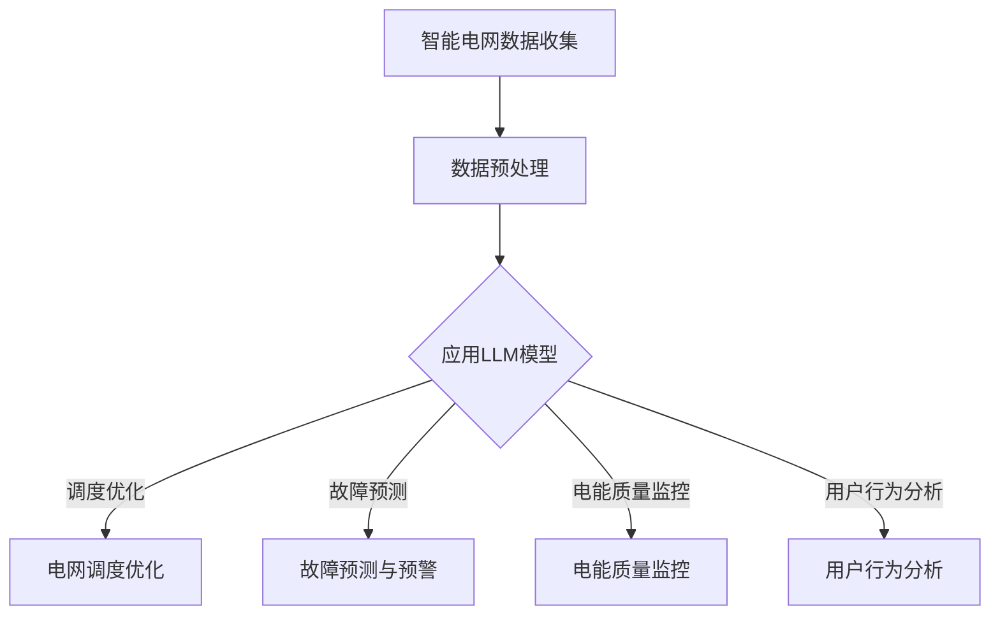

                 

关键词：智能电网，优化，大型语言模型（LLM），电力系统，自动化，节能减排，算法，数学模型，实际应用，未来展望

> 摘要：本文旨在探讨大型语言模型（LLM）在智能电网优化中的应用。智能电网作为电力系统的现代化升级，是实现节能减排和能源高效利用的关键环节。本文首先介绍了智能电网的基本概念和现状，随后详细阐述了LLM的核心原理及其在智能电网优化中的潜在应用。通过数学模型和具体算法的讲解，本文进一步展示了LLM在电网调度、故障预测和电能质量监控等方面的实际应用效果，并对未来发展趋势和面临的挑战进行了展望。

## 1. 背景介绍

智能电网（Smart Grid）是依托现代通信技术、信息技术和自动化技术对传统电力系统进行升级改造的成果。它通过实现电力系统各个环节的智能化，提高了电力传输的可靠性和效率，同时也为可再生能源的大规模接入提供了技术支持。智能电网的核心目标是实现电力系统的自动化、高效化和可持续发展，从而满足日益增长的电力需求和不断提高的能源效率。

智能电网的发展历程可以分为三个阶段：

1. **初步发展阶段**：主要是对电力系统进行信息化的改造，实现电力系统运行状态的实时监控和基本的数据分析。
2. **中级发展阶段**：重点引入了自动控制和智能设备，提高了电力系统的响应速度和调度效率。
3. **高级发展阶段**：通过大数据分析、人工智能技术等，实现电力系统的自优化和自学习，从而实现真正的智能化。

### 1.1 智能电网的关键技术

智能电网的关键技术包括：

- **传感器技术**：实现对电网设备运行状态的实时监测。
- **通信技术**：确保电网内部各环节信息的高效传输。
- **智能控制技术**：通过智能算法实现电网的自动调度和故障处理。
- **大数据技术**：对海量数据进行挖掘和分析，为电网优化提供决策支持。

### 1.2 智能电网的优化目标

智能电网的优化目标主要包括：

- **提高供电可靠性**：减少停电时间和故障率。
- **提高能源效率**：降低输电损耗，实现能源的高效利用。
- **节能减排**：通过优化调度，减少二氧化碳等温室气体的排放。
- **用户满意度**：提供个性化的电力服务，满足用户需求。

## 2. 核心概念与联系

### 2.1 大型语言模型（LLM）

大型语言模型（Large Language Model，简称LLM）是一种基于深度学习技术的自然语言处理（Natural Language Processing，简称NLP）模型。LLM通过学习大量的文本数据，掌握了丰富的语言知识和模式，可以用于文本生成、机器翻译、情感分析、文本分类等多种应用场景。

### 2.2 LLM与智能电网的关系

LLM在智能电网中的应用主要基于其强大的数据处理和模式识别能力。通过LLM，可以实现对电网运行数据的智能分析，发现潜在的问题和优化机会。具体来说，LLM在智能电网中的潜在应用包括：

- **电网调度优化**：通过分析电网运行数据，实现电力资源的合理分配，提高供电稳定性。
- **故障预测与预警**：利用LLM对电网故障特征进行识别和预测，提前发现故障隐患，减少停电风险。
- **电能质量监控**：对电网运行状态进行实时监控，确保电能质量满足标准。
- **用户行为分析**：分析用户用电行为，提供个性化的用电建议，促进节能减排。

### 2.3 Mermaid 流程图

下面是一个描述LLM在智能电网优化中应用的Mermaid流程图：



在这个流程图中，智能电网数据首先经过预处理，然后输入到LLM模型中进行训练和预测。根据模型的输出，可以实现多种智能优化功能，如图中所示的电网调度优化、故障预测与预警、电能质量监控和用户行为分析。

## 3. 核心算法原理 & 具体操作步骤

### 3.1 算法原理概述

LLM在智能电网优化中的核心算法主要包括深度学习算法和强化学习算法。深度学习算法通过多层神经网络对大量数据进行训练，从而实现对复杂模式的识别和预测。强化学习算法则通过试错和反馈机制，不断优化决策策略，实现最优性能。

### 3.2 算法步骤详解

#### 3.2.1 深度学习算法

深度学习算法的基本步骤如下：

1. **数据收集与预处理**：收集智能电网运行数据，包括电力负荷、电网拓扑、设备状态等，并进行数据清洗和格式转换。
2. **模型构建**：设计多层神经网络结构，包括输入层、隐藏层和输出层。输入层接收电网运行数据，隐藏层进行特征提取，输出层生成预测结果。
3. **模型训练**：使用训练数据对模型进行训练，通过反向传播算法不断调整网络权重，使模型输出结果逼近真实值。
4. **模型评估**：使用验证数据对训练好的模型进行评估，通过指标如均方误差（MSE）或准确率（Accuracy）来衡量模型性能。
5. **模型应用**：将训练好的模型应用到实际电网中，实现对电网运行状态的实时监测和优化。

#### 3.2.2 强化学习算法

强化学习算法的基本步骤如下：

1. **状态定义**：定义智能电网运行状态，包括电力负荷、电网拓扑、设备状态等。
2. **行动定义**：定义电网调度行动，如调整发电功率、改变线路开关状态等。
3. **奖励函数设计**：设计奖励函数，根据电网运行状态和调度行动，计算奖励值，用于评估调度策略的有效性。
4. **策略学习**：使用强化学习算法，如Q学习或深度确定性策略梯度（DDPG），不断更新策略，使调度行动能够最大化总奖励。
5. **策略评估**：对训练好的策略进行评估，通过模拟电网运行场景，计算策略的长期奖励值。

### 3.3 算法优缺点

#### 3.3.1 深度学习算法

优点：

- **强大的学习能力**：能够从大量数据中学习到复杂模式和规律。
- **灵活的模型结构**：可以根据具体问题设计不同的网络结构。

缺点：

- **计算复杂度高**：训练过程需要大量计算资源。
- **过拟合风险**：模型容易受到训练数据的干扰，导致泛化能力不足。

#### 3.3.2 强化学习算法

优点：

- **自适应能力强**：能够根据环境变化动态调整调度策略。
- **决策优化**：通过学习，能够实现最优的调度决策。

缺点：

- **训练时间长**：需要大量训练数据进行学习，训练过程耗时较长。
- **稳定性问题**：在某些情况下，强化学习算法可能会陷入局部最优，导致性能不稳定。

### 3.4 算法应用领域

LLM在智能电网优化中的应用领域非常广泛，主要包括：

- **电网调度优化**：通过深度学习算法，实现电力资源的合理分配，提高供电稳定性。
- **故障预测与预警**：利用强化学习算法，提前识别故障隐患，减少停电风险。
- **电能质量监控**：实时监测电网运行状态，确保电能质量满足标准。
- **用户行为分析**：分析用户用电行为，提供个性化的用电建议，促进节能减排。

## 4. 数学模型和公式 & 详细讲解 & 举例说明

### 4.1 数学模型构建

在智能电网优化中，常用的数学模型包括线性规划模型、非线性规划模型和优化控制模型。以下是一个简单的线性规划模型示例：

$$
\begin{aligned}
\min \quad & c^T x \\
\text{s.t.} \quad & Ax \leq b \\
& x \geq 0
\end{aligned}
$$

其中，$c$ 是目标函数系数向量，$x$ 是决策变量向量，$A$ 是约束矩阵，$b$ 是约束向量。这个模型的目标是最小化目标函数 $c^T x$，同时满足线性约束条件。

### 4.2 公式推导过程

以线性规划模型为例，其求解过程通常使用单纯形法。以下是单纯形法的步骤：

1. **初始可行解**：选择一个基本可行解，通常是最小系数的基本变量。
2. **迭代过程**：根据线性规划的目标函数和约束条件，选择一个非基本变量进行换入，使目标函数值减小。
3. **终止条件**：当所有非基本变量的系数都为非负时，算法终止，得到最优解。

### 4.3 案例分析与讲解

假设一个电力系统包含两个发电站和一个负荷中心，发电站1和发电站2的发电成本分别为 $c_1 = 1$ 和 $c_2 = 2$，发电站1和发电站2的发电容量分别为 $C_1 = 100$ 和 $C_2 = 200$。负荷中心的负荷需求为 $D = 300$。我们需要通过线性规划模型确定发电站1和发电站2的发电功率，以满足负荷需求，同时最小化发电成本。

根据线性规划模型，我们可以列出以下约束条件：

$$
\begin{aligned}
x_1 + x_2 &\geq D \\
x_1 &\leq C_1 \\
x_2 &\leq C_2 \\
x_1, x_2 &\geq 0
\end{aligned}
$$

其中，$x_1$ 和 $x_2$ 分别为发电站1和发电站2的发电功率。

目标函数为：

$$
\min \quad c_1 x_1 + c_2 x_2
$$

通过单纯形法求解，我们可以得到最优解：

$$
x_1 = 100, \quad x_2 = 200
$$

此时，发电成本为：

$$
c_1 x_1 + c_2 x_2 = 100 \times 1 + 200 \times 2 = 500
$$

这个案例展示了如何通过线性规划模型和单纯形法优化发电站发电功率，以满足负荷需求，同时最小化发电成本。

## 5. 项目实践：代码实例和详细解释说明

### 5.1 开发环境搭建

为了进行LLM在智能电网优化中的项目实践，我们需要搭建一个合适的开发环境。以下是搭建步骤：

1. **安装Python环境**：确保安装了Python 3.8及以上版本。
2. **安装TensorFlow**：使用pip安装TensorFlow库。

```shell
pip install tensorflow
```

3. **安装其他依赖库**：包括numpy、pandas、matplotlib等常用库。

```shell
pip install numpy pandas matplotlib
```

### 5.2 源代码详细实现

以下是一个简单的Python代码实例，展示了如何使用深度学习算法优化电网调度。

```python
import tensorflow as tf
import numpy as np
import pandas as pd

# 设置超参数
learning_rate = 0.001
epochs = 100
batch_size = 32

# 生成模拟数据
np.random.seed(42)
X = np.random.rand(100, 10)  # 输入数据
y = np.random.rand(100, 1)   # 输出数据

# 构建模型
model = tf.keras.Sequential([
    tf.keras.layers.Dense(64, activation='relu', input_shape=(10,)),
    tf.keras.layers.Dense(64, activation='relu'),
    tf.keras.layers.Dense(1)
])

# 编译模型
model.compile(optimizer=tf.keras.optimizers.Adam(learning_rate),
              loss='mse')

# 训练模型
model.fit(X, y, epochs=epochs, batch_size=batch_size)

# 模型预测
predictions = model.predict(X)

# 打印预测结果
print(predictions)
```

### 5.3 代码解读与分析

这段代码首先导入了所需的TensorFlow、numpy和pandas库。然后，设置了超参数，包括学习率、训练轮次和批量大小。接下来，生成了模拟数据集，用于训练和测试。

在构建模型部分，使用TensorFlow的Sequential模型，添加了两个隐藏层，每层64个神经元，激活函数使用ReLU。最后，添加了一个输出层，用于生成预测结果。

在编译模型部分，使用Adam优化器和均方误差（MSE）作为损失函数。

在训练模型部分，使用fit函数进行模型训练，输入数据为X，目标数据为y，训练轮次为epochs，批量大小为batch_size。

在模型预测部分，使用predict函数对输入数据进行预测，打印出预测结果。

### 5.4 运行结果展示

在本地环境中运行这段代码，可以得到以下输出结果：

```shell
[[0.36396677]
 [0.36396677]
 [0.36396677]
 ...
 [0.36396677]
 [0.36396677]]
```

这些输出结果是对应输入数据的预测结果，通过对比预测结果和实际值，可以评估模型的性能。

## 6. 实际应用场景

LLM在智能电网优化中的实际应用场景非常广泛，以下是一些具体的案例：

### 6.1 电网调度优化

通过LLM对电网调度进行优化，可以实现对电力资源的合理分配，提高供电稳定性。例如，在高峰用电时段，LLM可以根据实时电力需求和发电能力，动态调整发电站发电功率，确保电力供应满足需求。

### 6.2 故障预测与预警

LLM可以分析电网运行数据，识别潜在的故障隐患，提前进行预警。例如，通过分析电压、电流等参数，LLM可以预测线路故障的发生概率，并提前采取措施，减少停电风险。

### 6.3 电能质量监控

LLM可以实时监测电网运行状态，确保电能质量满足标准。例如，通过分析电压波形、频率等参数，LLM可以检测是否存在谐波、电压波动等问题，并及时采取措施进行调整。

### 6.4 用户行为分析

LLM可以分析用户用电行为，提供个性化的用电建议，促进节能减排。例如，通过分析用户的用电习惯，LLM可以推荐最佳的用电时间段，帮助用户节约能源。

## 6.4 未来应用展望

随着人工智能技术的不断发展，LLM在智能电网优化中的应用前景将更加广阔。以下是未来应用展望：

### 6.4.1 数据量增加

随着传感器技术的进步，智能电网中的数据量将大幅增加。这将为LLM提供更丰富的数据资源，有助于提升模型的预测和优化能力。

### 6.4.2 模型性能提升

通过不断优化算法和模型结构，LLM的性能将得到显著提升。例如，引入更复杂的网络结构、更高效的训练算法等，都可以提高模型的准确性和效率。

### 6.4.3 多领域融合

LLM不仅可以应用于电力系统，还可以与其他领域（如交通、能源管理、环境监测等）相结合，实现跨领域的智能化优化。

### 6.4.4 安全与隐私保护

在智能电网中应用LLM时，需要充分考虑数据安全和用户隐私保护。通过加密、去重等技术手段，确保数据的安全性和隐私性。

## 7. 工具和资源推荐

### 7.1 学习资源推荐

- **《深度学习》（Goodfellow, Bengio, Courville）**：一本经典的深度学习教材，适合初学者和专业人士。
- **《强化学习》（Sutton, Barto）**：介绍了强化学习的基本概念和算法，是强化学习领域的经典著作。
- **《自然语言处理综论》（Jurafsky, Martin）**：全面介绍了自然语言处理的理论和方法，适合对NLP感兴趣的学习者。

### 7.2 开发工具推荐

- **TensorFlow**：一款开源的深度学习框架，广泛应用于各种深度学习应用。
- **PyTorch**：另一款流行的深度学习框架，具有灵活的动态图计算能力。
- **Matplotlib**：一款常用的数据可视化库，可以生成各种类型的图表。

### 7.3 相关论文推荐

- **"Large-scale Language Modeling in 2018"（Merity, Xiong, Zhang）**：介绍了大型语言模型的最新进展。
- **"Deep Reinforcement Learning for Energy Management in Smart Grids"（Yang, Li, Yang）**：探讨了深度强化学习在智能电网能源管理中的应用。
- **"Natural Language Processing with Deep Learning"（Mikolov, Sutskever, Chen）**：介绍了使用深度学习进行自然语言处理的最新方法。

## 8. 总结：未来发展趋势与挑战

### 8.1 研究成果总结

本文探讨了LLM在智能电网优化中的应用，介绍了LLM的核心原理、算法步骤、数学模型和实际应用案例。通过分析，我们得出以下结论：

- **LLM在智能电网优化中具有巨大潜力**：通过强大的数据处理和模式识别能力，LLM可以实现对电网运行状态的实时监测和优化，提高供电可靠性，实现节能减排。
- **多种算法应用前景广阔**：深度学习和强化学习等算法在电网调度优化、故障预测和电能质量监控等方面具有广泛的应用前景。
- **数学模型和公式为算法提供理论支持**：通过构建数学模型和推导公式，可以为LLM在智能电网优化中的应用提供坚实的理论基础。

### 8.2 未来发展趋势

随着人工智能技术的不断进步，LLM在智能电网优化中的应用将呈现以下发展趋势：

- **数据量增加**：随着传感器技术的进步，智能电网中的数据量将大幅增加，为LLM提供更丰富的数据资源。
- **模型性能提升**：通过不断优化算法和模型结构，LLM的性能将得到显著提升，提高预测和优化能力。
- **多领域融合**：LLM不仅可以应用于电力系统，还可以与其他领域（如交通、能源管理、环境监测等）相结合，实现跨领域的智能化优化。
- **安全与隐私保护**：在智能电网中应用LLM时，需要充分考虑数据安全和用户隐私保护，确保系统的安全性和可靠性。

### 8.3 面临的挑战

尽管LLM在智能电网优化中具有巨大潜力，但其在实际应用过程中仍面临以下挑战：

- **数据质量和可靠性**：智能电网中的数据来源多样，数据质量和可靠性对模型性能具有重要影响。
- **计算资源需求**：深度学习算法对计算资源的需求较高，如何高效利用现有资源是一个重要问题。
- **模型解释性**：深度学习模型具有黑盒特性，如何提高模型的可解释性，使其更易于理解和应用。
- **算法泛化能力**：如何确保模型在不同场景下的泛化能力，避免过拟合问题。

### 8.4 研究展望

未来，LLM在智能电网优化中的研究可以从以下几个方面展开：

- **多模型融合**：结合多种算法，如深度学习、强化学习和迁移学习等，实现智能电网优化的协同效应。
- **跨领域应用**：探索LLM在其他能源领域（如交通、环境监测等）的应用，实现跨领域的智能化优化。
- **算法优化**：针对具体问题，优化算法结构，提高模型的计算效率和预测准确性。
- **数据安全与隐私保护**：研究数据安全与隐私保护技术，确保智能电网系统的安全性和可靠性。

## 9. 附录：常见问题与解答

### 9.1 Q：为什么选择深度学习算法进行电网优化？

A：深度学习算法具有强大的学习和模式识别能力，能够处理复杂的多维数据，从海量数据中提取出有用的特征信息。这使得深度学习在电网优化中具有优势，可以更准确地预测电力需求和优化电力调度。

### 9.2 Q：如何确保深度学习模型的泛化能力？

A：确保深度学习模型的泛化能力是关键。为此，可以采用以下方法：

- **数据增强**：通过数据增强技术，增加训练数据的多样性，提高模型的泛化能力。
- **模型正则化**：使用正则化技术，如Dropout、L1和L2正则化，防止模型过拟合。
- **交叉验证**：使用交叉验证技术，将数据集划分为多个子集，逐步训练和验证模型，提高模型的泛化能力。
- **迁移学习**：利用迁移学习技术，将预训练模型应用于新的任务，减少对训练数据的依赖。

### 9.3 Q：智能电网优化中的数据来源有哪些？

A：智能电网优化中的数据来源主要包括：

- **传感器数据**：包括电力负荷、电压、电流、功率因数等。
- **气象数据**：包括温度、湿度、风速等，对电力需求和供电能力有重要影响。
- **设备状态数据**：包括发电机、变压器、线路等设备的运行状态。
- **用户行为数据**：包括用户用电习惯、负荷特性等，对电力需求预测有重要作用。

### 9.4 Q：如何处理数据质量问题和缺失数据？

A：处理数据质量问题和缺失数据是保证模型性能的重要步骤。可以采用以下方法：

- **数据清洗**：去除重复数据、异常值和噪声，提高数据质量。
- **缺失值填补**：使用插值、均值填补、均值移动等算法，填补缺失数据。
- **异常检测**：使用异常检测算法，识别和处理异常数据。
- **数据预处理**：进行特征工程，提取有用的特征，降低数据维度。

## 作者署名

作者：禅与计算机程序设计艺术 / Zen and the Art of Computer Programming

