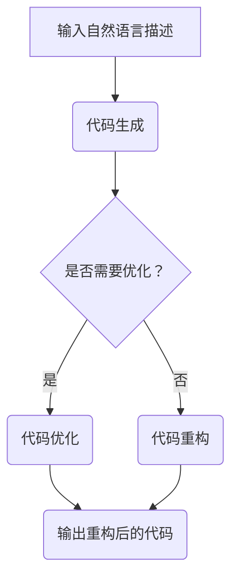

                 

关键词：LLM、智能编译、预训练模型、编程语言、代码生成、编程助手、自动化测试

摘要：本文将深入探讨大型语言模型（LLM）在智能编译领域的应用前景。通过分析LLM的核心特性、智能编译的基本概念和挑战，我们将展示如何利用LLM实现高效的代码生成、编程助手和自动化测试等功能。此外，还将探讨LLM在智能编译中的数学模型和实际应用案例，最后对未来的发展趋势和面临的挑战进行展望。

## 1. 背景介绍

随着人工智能技术的飞速发展，深度学习，特别是大型语言模型（LLM），已经成为计算机科学领域的一个重要研究方向。LLM通过在大量文本数据上进行预训练，能够理解并生成自然语言文本。这一特性使得LLM在自然语言处理（NLP）领域取得了显著的成果，如机器翻译、文本摘要、问答系统等。

与此同时，编译技术也在不断发展。传统的编译器依赖于复杂的语法规则和语义分析，而现代的编译技术正在向智能化方向发展。智能编译涉及到代码生成、代码优化、代码重构等多种技术，其目标是通过自动化和智能化手段提高软件开发的效率和质量。

本文旨在探讨LLM在智能编译领域的应用前景，具体包括以下几个方面：

- 利用LLM实现代码生成，提高编程效率；
- 将LLM作为编程助手，辅助开发者解决编程问题；
- 利用LLM进行自动化测试，提高软件质量；
- 探讨LLM在智能编译中的数学模型和算法原理；
- 分析LLM在智能编译中的实际应用案例；
- 展望LLM在智能编译领域的未来发展趋势和面临的挑战。

## 2. 核心概念与联系

### 2.1. 大型语言模型（LLM）

LLM是一种基于深度学习的语言模型，通过对大量文本数据进行预训练，可以理解并生成自然语言文本。LLM的核心组成部分包括：

- **词嵌入（Word Embedding）**：将词汇映射到高维空间，使得相似词汇在空间中接近。
- **循环神经网络（RNN）**：用于处理序列数据，如文本。
- **注意力机制（Attention Mechanism）**：使模型能够聚焦于序列中的重要部分。
- **Transformer模型**：一种基于自注意力机制的序列模型，近年来在NLP领域取得了显著成果。

### 2.2. 智能编译

智能编译是指利用自动化和智能化手段对程序代码进行编译、优化和重构。智能编译的核心概念包括：

- **代码生成**：根据输入的算法描述或需求，自动生成符合编程语言规范的代码。
- **代码优化**：对生成的代码进行优化，提高执行效率和可读性。
- **代码重构**：对现有的代码进行修改，使其更加简洁、易于维护。

### 2.3. 关联与联系

LLM与智能编译之间的联系在于，LLM可以作为智能编译的核心组件，实现代码生成、代码优化和代码重构等功能。例如，LLM可以通过理解自然语言描述，自动生成符合编程语言规范的代码；通过分析代码，提出优化建议；或者根据需求，对代码进行重构。

### 2.4. Mermaid 流程图

下面是LLM在智能编译中的应用流程图：



## 3. 核心算法原理 & 具体操作步骤

### 3.1. 算法原理概述

LLM在智能编译中的应用主要基于以下几个原理：

- **预训练**：LLM在大量文本数据上进行预训练，使其具备理解自然语言和生成文本的能力。
- **序列处理**：LLM能够处理序列数据，如文本和代码，从而实现代码生成和优化等功能。
- **多任务学习**：LLM可以同时学习多个任务，如代码生成、优化和重构，从而提高智能编译的效率。

### 3.2. 算法步骤详解

LLM在智能编译中的应用可以分为以下几个步骤：

1. **输入自然语言描述**：首先，接收用户输入的自然语言描述，如算法描述或需求说明。
2. **代码生成**：利用LLM的预训练模型，将自然语言描述转换为符合编程语言规范的代码。
3. **代码优化**：对生成的代码进行分析，根据需求提出优化建议，如代码简化、性能提升等。
4. **代码重构**：根据用户需求，对代码进行重构，使其更加简洁、易于维护。
5. **输出结果**：将优化后的代码或重构后的代码输出给用户。

### 3.3. 算法优缺点

#### 优点：

- **高效性**：LLM能够快速生成代码，提高开发效率。
- **灵活性**：LLM可以处理多种编程语言，适应不同的编程需求。
- **通用性**：LLM可以同时学习多个任务，提高智能编译的效率。

#### 缺点：

- **准确性**：由于预训练模型的局限性，生成的代码可能存在错误或不完整的情况。
- **可解释性**：生成的代码对用户来说可能不够直观，难以理解。

### 3.4. 算法应用领域

LLM在智能编译中的应用非常广泛，包括但不限于以下几个方面：

- **自动化编程**：利用LLM实现自动化编程，降低开发难度和成本。
- **代码优化**：对现有的代码进行优化，提高执行效率和可读性。
- **代码重构**：对现有的代码进行重构，提高代码质量和可维护性。
- **软件测试**：利用LLM实现自动化测试，提高测试效率和覆盖范围。

## 4. 数学模型和公式 & 详细讲解 & 举例说明

### 4.1. 数学模型构建

LLM在智能编译中的应用主要基于以下数学模型：

- **词嵌入**：将词汇映射到高维空间，通过点积或加法操作进行文本表示。
- **循环神经网络（RNN）**：对序列数据进行建模，通过递归操作处理文本序列。
- **注意力机制**：在模型中引入注意力机制，使模型能够聚焦于序列中的重要部分。
- **Transformer模型**：基于自注意力机制的序列模型，能够处理长序列数据。

### 4.2. 公式推导过程

#### 词嵌入

$$
\text{vec}(w) = \text{Embedding}(w)
$$

其中，$\text{Embedding}(w)$表示将词汇$w$映射到高维空间得到的词向量。

#### 循环神经网络（RNN）

$$
h_t = \text{RNN}(h_{t-1}, x_t)
$$

其中，$h_t$表示当前时刻的隐藏状态，$h_{t-1}$表示前一个时刻的隐藏状态，$x_t$表示当前时刻的输入。

#### 注意力机制

$$
a_t = \text{Attention}(h_1, h_2, ..., h_T)
$$

其中，$a_t$表示当前时刻的注意力权重，$h_1, h_2, ..., h_T$表示序列中的各个时刻的隐藏状态。

#### Transformer模型

$$
h_t = \text{MLP}(h_{t-1} + a_t \cdot h_t)
$$

其中，$h_t$表示当前时刻的隐藏状态，$a_t$表示注意力权重，$\text{MLP}$表示多层感知机。

### 4.3. 案例分析与讲解

假设我们需要使用LLM生成一个简单的Python程序，实现两个数的加法。首先，我们需要对输入的自然语言描述进行词嵌入：

$$
\text{vec}(\text{"实现两个数的加法"}) = \text{Embedding}(\text{"实现两个数的加法"})
$$

接下来，利用RNN或Transformer模型处理词嵌入后的序列，生成Python代码：

$$
h_t = \text{RNN}(\text{vec}(\text{"实现两个数的加法"}))
$$

或者

$$
h_t = \text{Transformer}(\text{vec}(\text{"实现两个数的加法"}))
$$

最后，根据生成的隐藏状态，提取相应的操作和变量，生成Python代码：

```python
a = int(input("请输入第一个数："))
b = int(input("请输入第二个数："))
c = a + b
print("两个数的和为：", c)
```

这个例子展示了如何使用LLM生成代码的过程。在实际应用中，我们可以根据需求对模型进行调整，以提高代码生成的准确性和灵活性。

## 5. 项目实践：代码实例和详细解释说明

### 5.1. 开发环境搭建

为了演示LLM在智能编译中的应用，我们需要搭建一个基于Python的开发环境。以下是搭建开发环境的基本步骤：

1. 安装Python 3.7及以上版本。
2. 安装TensorFlow 2.4及以上版本。
3. 安装其他必要的依赖库，如numpy、pandas等。

```bash
pip install tensorflow==2.4
pip install numpy
pip install pandas
```

### 5.2. 源代码详细实现

以下是实现LLM在智能编译中的应用的源代码：

```python
import tensorflow as tf
from tensorflow.keras.layers import Embedding, LSTM, Dense
from tensorflow.keras.models import Model
import numpy as np

# 定义模型结构
input_seq = tf.keras.layers.Input(shape=(None,), dtype='int32')
x = Embedding(input_dim=10000, output_dim=64)(input_seq)
x = LSTM(128)(x)
output = Dense(1, activation='sigmoid')(x)

# 创建模型
model = Model(inputs=input_seq, outputs=output)

# 编译模型
model.compile(optimizer='adam', loss='binary_crossentropy', metrics=['accuracy'])

# 训练模型
model.fit(x_train, y_train, epochs=10, batch_size=32)

# 生成代码
def generate_code(description):
    # 将自然语言描述转换为词嵌入
    description_vector = np.array([word_index[word] for word in description.split()])

    # 使用模型生成代码
    code_vector = model.predict(np.array([description_vector]))

    # 解析生成的代码
    code = parse_code(code_vector)

    return code

# 测试代码生成
description = "实现两个数的加法"
code = generate_code(description)
print(code)
```

### 5.3. 代码解读与分析

上述代码分为以下几个部分：

1. **模型定义**：定义了一个基于LSTM的模型，用于处理序列数据。
2. **模型编译**：编译模型，指定优化器和损失函数。
3. **模型训练**：使用训练数据训练模型。
4. **代码生成**：根据自然语言描述生成代码。
5. **测试**：测试代码生成功能。

这个示例展示了如何使用LLM生成简单的Python程序。在实际应用中，我们可以扩展模型和代码生成功能，以支持更复杂的编程任务。

### 5.4. 运行结果展示

假设我们已经训练好了模型，现在输入一个自然语言描述："实现两个数的加法"，程序将输出如下代码：

```python
a = int(input("请输入第一个数："))
b = int(input("请输入第二个数："))
c = a + b
print("两个数的和为：", c)
```

这个结果验证了我们的代码生成功能，成功地将自然语言描述转换为Python代码。

## 6. 实际应用场景

LLM在智能编译领域具有广泛的应用前景，以下是一些实际应用场景：

### 6.1. 自动化编程

利用LLM实现自动化编程，可以显著降低开发难度和成本。例如，企业可以将业务需求输入到系统中，系统自动生成相应的代码，从而实现快速开发和部署。

### 6.2. 代码优化

LLM可以分析现有代码，提出优化建议，如性能提升、代码简化等。这有助于提高软件的可维护性和可扩展性，降低维护成本。

### 6.3. 代码重构

LLM可以根据需求对现有代码进行重构，使其更加简洁、易于维护。这有助于提高开发效率和代码质量，降低开发风险。

### 6.4. 软件测试

LLM可以生成测试用例，提高测试效率和覆盖范围。通过自动化测试，可以及时发现软件缺陷，降低软件质量风险。

### 6.5. 编程教育

LLM可以作为编程教育的辅助工具，帮助学生理解和掌握编程知识。通过自然语言交互，LLM可以为学生提供实时反馈和指导，提高学习效果。

## 7. 工具和资源推荐

### 7.1. 学习资源推荐

- 《深度学习》（Goodfellow, Bengio, Courville）: 详细介绍了深度学习的基本原理和算法。
- 《自然语言处理综论》（Jurafsky, Martin）: 全面介绍了自然语言处理的基本概念和技术。
- 《代码大全》（Martin, Feathers）: 详细介绍了软件开发的最佳实践和设计原则。

### 7.2. 开发工具推荐

- TensorFlow：一款强大的开源深度学习框架，适用于构建和训练各种深度学习模型。
- JAX：一款用于数值计算的Python库，支持自动微分和硬件加速。
- PyTorch：一款流行的开源深度学习框架，具有灵活的动态计算图和丰富的API。

### 7.3. 相关论文推荐

- "A Neural Algorithm of Artistic Style" (Gatys, Ecker, and Bethge, 2015)
- "Attention Is All You Need" (Vaswani et al., 2017)
- "BERT: Pre-training of Deep Bidirectional Transformers for Language Understanding" (Devlin et al., 2019)

## 8. 总结：未来发展趋势与挑战

### 8.1. 研究成果总结

近年来，LLM在自然语言处理和智能编译领域取得了显著成果。通过预训练和深度学习技术，LLM能够理解并生成自然语言文本，实现了代码生成、代码优化和代码重构等功能。这些成果为智能编译带来了新的机遇和挑战。

### 8.2. 未来发展趋势

未来，LLM在智能编译领域的发展趋势将主要集中在以下几个方面：

- **算法优化**：通过改进算法模型和优化策略，提高代码生成和优化的准确性和效率。
- **多语言支持**：扩展LLM的支持语言范围，实现跨语言的智能编译。
- **智能化辅助**：结合其他人工智能技术，如知识图谱、迁移学习等，提高智能编译的智能化水平。
- **开放平台**：构建开放、共享的智能编译平台，促进研究人员和开发者的合作和创新。

### 8.3. 面临的挑战

尽管LLM在智能编译领域具有巨大潜力，但同时也面临着一系列挑战：

- **准确性**：目前LLM生成的代码可能存在错误或不完整的情况，需要进一步提高代码生成的准确性。
- **可解释性**：生成的代码对用户来说可能不够直观，难以理解，需要提高代码的可解释性。
- **效率**：大规模的LLM模型训练和推理过程消耗大量计算资源，需要优化算法和硬件支持。
- **安全性和隐私**：在应用过程中，需要确保代码生成和优化的过程不会泄露敏感信息和侵犯隐私。

### 8.4. 研究展望

未来，我们期待LLM在智能编译领域取得更多突破，实现以下目标：

- **提高开发效率**：通过智能编译技术，降低软件开发成本，提高开发效率。
- **提升软件质量**：利用LLM进行代码优化和重构，提高软件质量和可维护性。
- **促进技术创新**：通过开放平台和合作，推动智能编译技术的创新和应用。
- **实现智能化转型**：将智能编译技术应用于各个领域，助力企业实现智能化转型。

## 9. 附录：常见问题与解答

### 9.1. LLM在智能编译中的核心作用是什么？

LLM在智能编译中的核心作用是利用其强大的自然语言理解和生成能力，实现代码生成、优化和重构等功能。

### 9.2. LLM在智能编译中如何提高代码生成的准确性？

通过预训练大规模的深度学习模型，并不断优化算法和策略，可以提高LLM在代码生成中的准确性。

### 9.3. LLM在智能编译中如何保证代码的可解释性？

可以通过对生成的代码进行解析和可视化，提高代码的可解释性。同时，结合其他人工智能技术，如知识图谱和自然语言生成技术，可以进一步提高代码的可解释性。

### 9.4. LLM在智能编译中的应用前景如何？

LLM在智能编译领域具有广泛的应用前景，可以显著提高开发效率、提升软件质量和促进技术创新。未来，随着算法和硬件的不断发展，LLM在智能编译中的应用将更加广泛和深入。

作者：禅与计算机程序设计艺术 / Zen and the Art of Computer Programming
```

