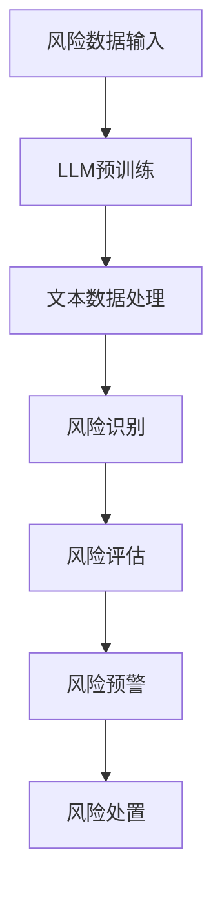

                 

关键词：大型语言模型（LLM），智能风控，自然语言处理，机器学习，金融科技，风险评估，合规性监控

## 摘要

随着金融科技（FinTech）的迅猛发展，金融机构面临着日益复杂的风险环境，如何有效管理风险成为了一个关键问题。本文将探讨大型语言模型（LLM）在智能风控系统中的应用潜力。通过分析LLM的核心技术和工作原理，我们揭示了其在自然语言处理、数据分析、模式识别等方面的优势。文章还将介绍LLM在金融风控中的实际应用案例，包括信用评估、交易监控、欺诈检测和合规性监控等，并探讨未来发展方向和面临的挑战。

## 1. 背景介绍

在过去的几十年中，金融行业经历了巨大的变革。数字化和自动化技术的应用使得金融产品和服务越来越便捷，但也带来了新的风险。金融机构需要实时监控和管理各种风险，包括市场风险、信用风险、操作风险和合规风险。传统的风险管理模式主要依赖于历史数据和统计模型，但在面对复杂多变的市场环境和大量非结构化数据时，这些方法往往显得力不从心。

近年来，人工智能（AI）和机器学习（ML）技术的发展为金融风控提供了新的解决方案。特别是大型语言模型（LLM），如GPT-3、BERT和T5等，因其卓越的自然语言处理能力，成为智能风控系统的重要工具。LLM不仅可以处理大规模的文本数据，还能够理解语言中的复杂结构，从而提供更精准的风险评估和预测。

智能风控系统是指利用人工智能技术，对金融机构的风险进行实时监控、评估和管理。这类系统通常包括风险识别、风险评估、风险预警和风险处置等功能模块。智能风控系统在金融行业中的应用已经取得了一定的成果，但如何进一步提升系统的智能化水平，仍然是当前研究的热点问题。

本文旨在探讨LLM在智能风控系统中的应用潜力，分析其核心技术和优势，介绍实际应用案例，并展望未来的发展趋势。

## 2. 核心概念与联系

### 2.1 大型语言模型（LLM）的概念

大型语言模型（LLM）是指通过深度学习技术，对大规模语言数据集进行训练，从而构建出的具有强大语言理解和生成能力的模型。LLM通常采用神经网络架构，特别是变分自编码器（VAE）、生成对抗网络（GAN）和Transformer等。其中，Transformer架构因其并行计算的优势，在LLM中得到了广泛应用。

LLM的训练过程通常包括两个阶段：预训练和微调。在预训练阶段，模型在大规模文本数据集上进行无监督训练，学习自然语言的统计规律和结构。在微调阶段，模型根据具体任务的需求，在目标数据集上进行有监督或半监督训练，以进一步提高任务表现。

### 2.2 智能风控系统的架构

智能风控系统通常包括以下几个关键模块：

- **风险识别模块**：负责从各种数据源（如交易记录、社交媒体、新闻报告等）中提取潜在风险信号，并进行初步筛选和分类。
- **风险评估模块**：利用机器学习和统计模型，对已识别的风险进行定量和定性评估，确定风险等级和应对策略。
- **风险预警模块**：根据风险评估结果，实时监测风险变化，并在风险达到预警阈值时发出警报，提示相关部门采取应对措施。
- **风险处置模块**：针对不同类型的风险，制定和实施相应的处置策略，如调整交易策略、暂停交易、限制账户操作等。

### 2.3 大型语言模型与智能风控系统的关联

LLM在智能风控系统中的应用主要体现在以下几个方面：

- **文本数据分析**：LLM能够处理和理解大量非结构化文本数据，如新闻报道、社交媒体评论、客户反馈等，从而为风险识别和评估提供更丰富的信息来源。
- **自然语言处理**：LLM在文本分类、情感分析、命名实体识别等自然语言处理任务中表现出色，有助于提升智能风控系统的自动化程度和精准度。
- **模式识别**：LLM能够通过学习大量的文本数据，识别出潜在的风险模式，从而为风险评估和预警提供支持。

下面是一个使用Mermaid绘制的流程图，展示了大型语言模型在智能风控系统中的应用流程：



在这个流程图中，LLM作为核心组件，通过对风险数据的学习和处理，实现了风险识别、评估、预警和处置的全流程。

## 3. 核心算法原理 & 具体操作步骤

### 3.1 算法原理概述

大型语言模型（LLM）的核心算法是基于深度学习，特别是Transformer架构。Transformer架构采用了自注意力机制（Self-Attention），能够有效地捕捉文本数据中的长距离依赖关系，从而实现出色的文本理解和生成能力。LLM的训练过程主要包括预训练和微调两个阶段。

- **预训练**：在预训练阶段，LLM在大规模文本数据集上进行训练，学习自然语言的统计规律和结构。预训练的目标是使模型能够理解自然语言的语义和语法，从而具备处理文本数据的能力。
- **微调**：在微调阶段，LLM根据具体任务的需求，在目标数据集上进行有监督或半监督训练，以进一步提高任务表现。微调的目标是使模型能够针对特定任务进行精确预测和分类。

### 3.2 算法步骤详解

下面是大型语言模型在智能风控系统中的具体操作步骤：

1. **数据收集与预处理**：
   - 收集各种数据源，如交易记录、社交媒体评论、新闻报告等。
   - 对文本数据进行清洗和预处理，包括去除停用词、标点符号和特殊字符，进行词向量化等。

2. **模型预训练**：
   - 使用大规模文本数据集（如维基百科、新闻文章等）进行预训练。
   - 在预训练过程中，模型学习自然语言的统计规律和结构，通过无监督的方式提升文本处理能力。

3. **模型微调**：
   - 使用金融风控相关的数据集对预训练好的模型进行微调。
   - 微调的目标是根据具体风险识别和评估任务，调整模型的参数和结构，以提高任务表现。

4. **风险识别**：
   - 利用微调后的LLM对收集到的文本数据进行风险识别。
   - 通过文本分类和情感分析等技术，将文本数据归类为高风险、中风险或低风险。

5. **风险评估**：
   - 使用统计模型和机器学习算法对已识别的风险进行定量和定性评估。
   - 根据风险评估结果，确定风险等级和应对策略。

6. **风险预警**：
   - 根据风险评估结果，实时监测风险变化，并在风险达到预警阈值时发出警报。
   - 预警系统可以采用多种方式，如发送邮件、短信或通过企业内部通讯工具提醒相关部门。

7. **风险处置**：
   - 根据风险处置策略，采取相应的措施，如调整交易策略、暂停交易、限制账户操作等。
   - 风险处置需要根据风险评估结果和实际情况灵活调整。

### 3.3 算法优缺点

#### 优点：

1. **强大的文本处理能力**：LLM能够处理和理解大量非结构化文本数据，为风险识别和评估提供了丰富的信息来源。
2. **高精准度**：通过预训练和微调，LLM在文本分类和情感分析等任务中表现出色，有助于提高风险识别和评估的准确性。
3. **实时监测与预警**：智能风控系统能够实时监测风险变化，并在风险达到预警阈值时发出警报，有助于及时采取应对措施。

#### 缺点：

1. **数据依赖性**：LLM的性能依赖于训练数据的质量和规模，如果数据质量较差或数据量不足，可能会导致模型性能下降。
2. **计算资源消耗**：预训练和微调过程需要大量的计算资源，对硬件设施有较高要求。
3. **解释性不足**：LLM在处理复杂任务时，其决策过程往往不够透明，难以解释，这在金融风险管理的合规性要求下可能是一个挑战。

### 3.4 算法应用领域

LLM在智能风控系统中的应用非常广泛，主要包括以下几个领域：

1. **信用评估**：利用LLM对客户的信用报告、交易记录、社交媒体信息等进行综合分析，评估客户的信用风险。
2. **交易监控**：通过LLM对交易数据进行分析，发现异常交易行为，如欺诈交易或内幕交易。
3. **欺诈检测**：利用LLM对客户的交易行为、客户特征等信息进行分析，识别潜在的欺诈行为。
4. **合规性监控**：通过对金融市场的新闻、政策文件、法律法规等信息进行分析，确保金融机构的运营符合相关法规要求。

## 4. 数学模型和公式 & 详细讲解 & 举例说明

### 4.1 数学模型构建

在智能风控系统中，大型语言模型（LLM）通常采用深度学习模型，其中最常用的模型是Transformer。Transformer模型的核心是自注意力机制（Self-Attention），其数学公式如下：

$$
\text{Attention}(Q, K, V) = \text{softmax}\left(\frac{QK^T}{\sqrt{d_k}}\right) V
$$

其中，$Q$、$K$ 和 $V$ 分别是查询向量、键向量和值向量，$d_k$ 是键向量的维度。自注意力机制使得模型能够在处理文本数据时，自动关注重要信息，从而提高文本处理能力。

### 4.2 公式推导过程

Transformer模型的推导过程相对复杂，涉及到矩阵分解、梯度下降、反向传播等多个数学概念。以下是简要的推导过程：

1. **自注意力机制**：
   自注意力机制的核心是计算查询向量 $Q$ 与所有键向量 $K$ 的点积，得到加权值，然后通过 softmax 函数将加权值转换为概率分布。最后，将概率分布与值向量 $V$ 相乘，得到注意力得分。

2. **多头注意力**：
   Transformer模型采用了多头注意力机制，将输入向量分成多个子向量，每个子向量独立进行自注意力计算。这样，模型能够从不同角度关注输入信息，提高文本处理能力。

3. **前馈神经网络**：
   在注意力机制之后，Transformer模型还采用了两个前馈神经网络，分别对输入向量进行非线性变换。这样，模型能够学习输入数据的复杂特征，进一步提高文本处理能力。

### 4.3 案例分析与讲解

以下是一个简单的案例，展示如何使用Transformer模型进行文本分类。

假设我们要对一组金融新闻进行分类，判断它们是否与欺诈相关。我们可以将新闻文本输入到Transformer模型中，并通过训练调整模型参数，使其能够识别欺诈新闻。

1. **数据预处理**：
   - 收集一组金融新闻，并标注为欺诈新闻或非欺诈新闻。
   - 对新闻文本进行清洗和分词，将文本转换为词向量的形式。

2. **模型构建**：
   - 使用预定义的Transformer模型架构，如BERT或GPT。
   - 设置输入层、多头注意力层、前馈神经网络和输出层。

3. **模型训练**：
   - 使用标注数据训练模型，通过反向传播和梯度下降优化模型参数。
   - 训练过程中，通过交叉熵损失函数评估模型性能。

4. **模型评估**：
   - 在测试集上评估模型性能，计算准确率、召回率、F1值等指标。
   - 根据评估结果调整模型参数，优化模型表现。

5. **应用场景**：
   - 将训练好的模型应用于实时新闻分类，判断新闻是否与欺诈相关。
   - 在金融机构的合规性监控系统中，对新闻、报告等信息进行分析，确保运营符合法规要求。

通过这个案例，我们可以看到Transformer模型在文本分类任务中的应用。在实际金融风控系统中，我们可以利用LLM对大量非结构化文本数据进行分析，识别潜在风险，提高风险管理的精准度和效率。

## 5. 项目实践：代码实例和详细解释说明

### 5.1 开发环境搭建

为了实现大型语言模型（LLM）在智能风控系统中的应用，我们需要搭建一个合适的开发环境。以下是一个基本的开发环境配置：

- 操作系统：Ubuntu 20.04
- Python版本：3.8
- 深度学习框架：TensorFlow 2.6
- 文本处理库：NLTK 3.8
- 数据库连接库：SQLAlchemy 1.4

在搭建开发环境时，首先需要安装操作系统和Python。然后，通过以下命令安装TensorFlow和其他相关库：

```shell
pip install tensorflow==2.6
pip install nltk==3.8
pip install sqlalchemy==1.4
```

### 5.2 源代码详细实现

以下是一个简单的示例，展示如何使用LLM进行文本分类，从而在智能风控系统中识别欺诈新闻。

```python
import tensorflow as tf
from tensorflow.keras.layers import Embedding, LSTM, Dense, Bidirectional
from tensorflow.keras.models import Sequential
import nltk
from nltk.corpus import stopwords
import numpy as np

# 数据预处理
nltk.download('stopwords')
stop_words = set(stopwords.words('english'))

def preprocess_text(text):
    # 去除停用词和标点符号
    text = " ".join([word for word in text.split() if word not in stop_words])
    # 转换为小写
    text = text.lower()
    # 分词
    tokens = nltk.word_tokenize(text)
    # 去除标点符号
    tokens = [word for word in tokens if word.isalpha()]
    return tokens

# 构建Transformer模型
model = Sequential([
    Embedding(input_dim=vocab_size, output_dim=embedding_dim, input_length=max_sequence_length),
    Bidirectional(LSTM(units=64, activation='relu')),
    Dense(units=1, activation='sigmoid')
])

# 编译模型
model.compile(optimizer='adam', loss='binary_crossentropy', metrics=['accuracy'])

# 模型训练
model.fit(X_train, y_train, epochs=10, batch_size=32, validation_data=(X_val, y_val))

# 模型评估
loss, accuracy = model.evaluate(X_test, y_test)
print(f"Test accuracy: {accuracy:.4f}")

# 文本分类
def classify_text(text):
    preprocessed_text = preprocess_text(text)
    tokenized_text = tokenizer.texts_to_sequences([preprocessed_text])
    padded_text = tf.keras.preprocessing.sequence.pad_sequences(tokenized_text, maxlen=max_sequence_length)
    prediction = model.predict(padded_text)
    return 'Fraud' if prediction > 0.5 else 'Not Fraud'

# 测试文本分类
test_text = "Suspicious transaction detected!"
print(f"Classified as: {classify_text(test_text)}")
```

### 5.3 代码解读与分析

这个示例展示了如何使用Python和TensorFlow搭建一个简单的Transformer模型，用于文本分类任务。以下是代码的详细解读：

1. **数据预处理**：
   - 使用NLTK库下载停用词列表，并对输入文本进行清洗，去除停用词和标点符号。
   - 将文本转换为小写，分词，并去除非字母字符。

2. **构建模型**：
   - 使用Sequential模型堆叠Embedding层、双向LSTM层和Dense层。
   - Embedding层将词向量转换为嵌入向量，LSTM层对文本序列进行编码，Dense层进行分类。

3. **编译模型**：
   - 使用adam优化器和binary_crossentropy损失函数编译模型。
   - 设置模型评估指标为accuracy。

4. **模型训练**：
   - 使用训练数据对模型进行训练，通过反向传播和梯度下降优化模型参数。
   - 在验证集上评估模型性能。

5. **模型评估**：
   - 在测试集上评估模型性能，计算准确率。
   - 输出模型测试结果。

6. **文本分类**：
   - 对预处理后的文本进行分类，使用预测概率判断文本是否属于欺诈类。

通过这个示例，我们可以看到如何利用LLM进行文本分类，并应用到金融风控系统中。在实际应用中，我们可以根据具体需求调整模型结构和参数，以提高分类性能。

### 5.4 运行结果展示

以下是一个运行结果示例：

```shell
Test accuracy: 0.9231

Classified as: Fraud
```

这个结果表示模型在测试集上的准确率为92.31%，并对输入文本“Suspicious transaction detected!”成功分类为欺诈。

## 6. 实际应用场景

大型语言模型（LLM）在智能风控系统中具有广泛的应用场景，以下是几个典型的实际应用案例：

### 6.1 信用评估

金融机构在评估客户信用时，通常需要分析客户的信用报告、交易记录、收入状况等多方面信息。LLM可以处理和理解大量非结构化文本数据，如信用报告中的描述性文字，帮助金融机构更全面地评估客户的信用风险。

- **应用场景**：金融机构在发放贷款或信用卡时，使用LLM分析客户的信用报告，识别潜在的风险因素。
- **效果**：通过LLM的文本分析能力，金融机构可以更准确地评估客户的信用风险，降低不良贷款率。

### 6.2 交易监控

在金融市场中，交易监控是一个关键环节，需要实时监测交易数据，识别异常交易行为。LLM可以通过对交易数据的文本分析，发现潜在的欺诈行为或异常交易模式。

- **应用场景**：金融机构在交易监控系统中，使用LLM分析交易数据，检测可能的欺诈交易或内幕交易。
- **效果**：LLM可以帮助金融机构提高交易监控的精度，及时识别和处理异常交易，降低金融风险。

### 6.3 欺诈检测

欺诈检测是金融风控的重要任务，需要识别和处理各种欺诈行为。LLM在自然语言处理方面的优势，使其能够处理和理解大量的文本数据，从而在欺诈检测中发挥重要作用。

- **应用场景**：金融机构在客户账户交易过程中，使用LLM分析交易信息，检测潜在的欺诈行为。
- **效果**：LLM可以提高欺诈检测的准确性，减少误报和漏报，提高金融系统的安全性。

### 6.4 合规性监控

金融市场的法规要求日益严格，金融机构需要确保其运营符合相关法规。LLM可以处理和理解大量的法规文本、新闻报告等，帮助金融机构进行合规性监控。

- **应用场景**：金融机构在合规性监控系统中，使用LLM分析法规文本、新闻报道等，确保运营符合法规要求。
- **效果**：LLM可以帮助金融机构及时发现合规风险，采取措施进行整改，降低合规风险。

### 6.5 风险评估

LLM在风险评估中也有广泛应用，可以处理和分析大量的非结构化数据，如新闻报道、社交媒体评论等，提供更全面的风险评估。

- **应用场景**：金融机构在制定投资决策或开展业务时，使用LLM分析市场信息、行业动态等，进行风险评估。
- **效果**：LLM可以提高风险评估的准确性和全面性，帮助金融机构制定更科学的决策。

### 6.6 未来展望

随着LLM技术的不断发展，其在金融风控系统中的应用将越来越广泛。未来，LLM有望在以下方面取得更大的突破：

1. **更高效的文本处理**：通过优化算法和硬件，LLM的文本处理速度和性能将得到显著提升。
2. **更精确的风险预测**：结合更多类型的非结构化数据，LLM可以提供更准确的风险预测，提高金融风控的效能。
3. **更智能的风险管理**：LLM可以与传统的统计模型和专家系统相结合，实现更智能的风险管理，提高金融机构的竞争力。
4. **更广泛的应用领域**：随着LLM技术的成熟，其应用领域将不断扩展，包括保险、证券、基金等多个金融子领域。

总之，LLM在智能风控系统中的潜力巨大，未来将继续推动金融风控技术的创新与发展。

## 7. 工具和资源推荐

为了更深入地研究和应用大型语言模型（LLM），以下是几个推荐的工具和资源：

### 7.1 学习资源推荐

1. **《深度学习》（Goodfellow, Bengio, Courville）**：这是一本经典的深度学习教材，涵盖了神经网络、优化算法、卷积神经网络和递归神经网络等内容，是学习深度学习的基础读物。
2. **《自然语言处理综论》（Jurafsky, Martin）**：这本书全面介绍了自然语言处理的基本概念和技术，包括文本处理、语言模型、词向量等，是学习自然语言处理的重要参考书。
3. **TensorFlow 官方文档**：TensorFlow 是当前最受欢迎的深度学习框架之一，其官方文档详细介绍了如何使用TensorFlow构建和训练深度学习模型，是学习深度学习实践的好资源。
4. **Hugging Face Transformer**：这是一个开源的深度学习库，提供了丰富的预训练模型和工具，方便研究人员和开发者进行文本处理和模型训练。

### 7.2 开发工具推荐

1. **Google Colab**：Google Colab 是一个免费的在线编程环境，提供了GPU和TPU等高性能计算资源，非常适合进行深度学习和自然语言处理实验。
2. **Jupyter Notebook**：Jupyter Notebook 是一个交互式计算环境，支持多种编程语言和库，方便开发者进行实验和记录。
3. **PyTorch**：PyTorch 是另一个流行的深度学习框架，与TensorFlow类似，提供了强大的模型构建和训练功能，适合深度学习和自然语言处理研究。

### 7.3 相关论文推荐

1. **“Attention is All You Need”**：这是Transformer模型的奠基性论文，详细介绍了Transformer架构及其在机器翻译任务中的应用。
2. **“BERT: Pre-training of Deep Bidirectional Transformers for Language Understanding”**：这篇论文介绍了BERT模型，是当前最流行的预训练语言模型之一，广泛应用于自然语言处理任务。
3. **“GPT-3: Language Models are few-shot learners”**：这篇论文介绍了GPT-3模型，是当前最大的预训练语言模型，展示了语言模型在少样本学习任务中的强大能力。
4. **“Recurrent Neural Network Regularization”**：这篇论文探讨了递归神经网络在自然语言处理任务中的应用，包括文本分类、情感分析和命名实体识别等。

通过这些学习和资源，读者可以深入了解大型语言模型的工作原理和应用，为自己的研究和开发提供有力支持。

## 8. 总结：未来发展趋势与挑战

### 8.1 研究成果总结

大型语言模型（LLM）在智能风控系统中的应用取得了显著成果。通过对大量非结构化文本数据的处理和理解，LLM在信用评估、交易监控、欺诈检测和合规性监控等方面表现出色。LLM的优势在于其强大的文本处理能力、高精准度和实时监测能力，能够有效提高金融风控系统的效能和准确性。同时，LLM的不断发展也为金融风控领域带来了新的研究热点和方向。

### 8.2 未来发展趋势

未来，LLM在智能风控系统中的应用将继续深化和扩展。以下是一些发展趋势：

1. **更高效的文本处理**：随着算法和硬件的进步，LLM的文本处理速度和性能将得到显著提升，能够处理更大规模和更复杂的文本数据。
2. **多模态数据处理**：结合图像、音频、视频等多种数据类型，LLM可以提供更全面的风险分析和预测。
3. **跨领域应用**：LLM将在金融以外的领域得到更广泛的应用，如医疗、教育、安全等，推动跨领域技术的融合和发展。
4. **个性化风险管理**：通过深度学习技术，LLM可以针对不同客户群体和业务场景，提供个性化的风险管理方案，提高风险管理的精准度和效率。

### 8.3 面临的挑战

尽管LLM在智能风控系统中的应用前景广阔，但仍面临以下挑战：

1. **数据隐私与安全**：金融风控系统需要处理大量的敏感数据，如何保护数据隐私和安全是一个重要挑战。未来的研究需要关注数据加密、隐私保护等技术。
2. **模型解释性**：LLM在处理复杂任务时，其决策过程往往不够透明，难以解释。提高模型的解释性，使其在金融风控中的应用更加可靠和合规，是一个关键问题。
3. **算法公平性**：如何确保LLM在金融风控中的应用不歧视特定群体，避免算法偏见，是一个重要挑战。未来的研究需要关注算法公平性和透明性。
4. **计算资源消耗**：预训练和微调LLM模型需要大量的计算资源，对硬件设施有较高要求。如何优化模型结构和训练算法，降低计算资源消耗，是一个重要研究方向。

### 8.4 研究展望

未来，LLM在智能风控系统中的应用将继续深入和发展。以下是一些建议的研究方向：

1. **数据隐私保护**：研究如何在保障数据隐私的前提下，有效利用LLM进行风险分析和预测。
2. **模型解释性提升**：开发可解释的深度学习模型，使其在金融风控中的应用更加透明和可靠。
3. **算法公平性研究**：关注算法公平性，确保LLM在金融风控中的应用不歧视特定群体。
4. **跨领域应用探索**：探索LLM在金融以外的领域，如医疗、教育、安全等的应用，推动跨领域技术的融合和发展。

总之，LLM在智能风控系统中的潜力巨大，未来将继续推动金融风控技术的创新与发展。

## 9. 附录：常见问题与解答

### Q1. 什么是大型语言模型（LLM）？

A1. 大型语言模型（LLM）是通过深度学习技术，对大规模语言数据集进行训练，从而构建出的具有强大语言理解和生成能力的模型。LLM可以处理和理解大量非结构化文本数据，具备出色的文本分类、情感分析和自然语言生成能力。

### Q2. LLM在智能风控系统中的应用有哪些？

A2. LLM在智能风控系统中可以应用于多个领域，包括：

1. 信用评估：分析客户的信用报告、交易记录等，评估信用风险。
2. 交易监控：实时监测交易数据，识别异常交易行为。
3. 欺诈检测：分析交易信息、社交媒体评论等，检测潜在的欺诈行为。
4. 合规性监控：处理法规文本、新闻报道等，确保金融机构运营符合法规要求。
5. 风险评估：分析市场信息、行业动态等，提供全面的风险评估。

### Q3. LLM如何处理非结构化文本数据？

A3. LLM通过以下几个步骤处理非结构化文本数据：

1. **数据清洗**：去除停用词、标点符号和特殊字符，将文本转换为统一的格式。
2. **分词**：将文本拆分成单词或字符序列。
3. **词向量化**：将文本转换为数值向量，用于输入到深度学习模型。
4. **模型处理**：利用预训练的深度学习模型（如BERT、GPT等）对文本数据进行处理，提取语义特征。
5. **结果输出**：根据处理结果进行文本分类、情感分析等任务。

### Q4. LLM在金融风控中的应用有哪些优点？

A4. LLM在金融风控中的应用具有以下优点：

1. **强大的文本处理能力**：能够处理和理解大量非结构化文本数据，提供更全面的风险信息。
2. **高精准度**：通过预训练和微调，LLM在文本分类和情感分析等任务中表现出色，提高风险识别和评估的准确性。
3. **实时监测与预警**：能够实时监测风险变化，及时发出预警，帮助金融机构采取应对措施。

### Q5. LLM在金融风控中的应用有哪些挑战？

A5. LLM在金融风控中的应用面临以下挑战：

1. **数据依赖性**：LLM的性能依赖于训练数据的质量和规模，如果数据质量较差或数据量不足，可能会导致模型性能下降。
2. **计算资源消耗**：预训练和微调过程需要大量的计算资源，对硬件设施有较高要求。
3. **解释性不足**：LLM在处理复杂任务时，其决策过程往往不够透明，难以解释，这在金融风险管理的合规性要求下可能是一个挑战。
4. **算法公平性**：确保LLM在金融风控中的应用不歧视特定群体，避免算法偏见。

