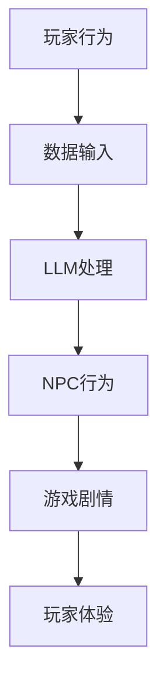

                 

关键词：大型语言模型（LLM），游戏设计，动态剧情，NPC对话，对话生成，游戏人工智能，自然语言处理（NLP），剧情编写，游戏开发者。

> 摘要：本文将探讨大型语言模型（LLM）在游戏设计中的潜力，特别是它在创建动态剧情和实现更智能的NPC对话中的应用。通过对LLM的工作原理、算法原理及其实际操作步骤的深入分析，文章将展示如何利用LLM为游戏设计带来革命性的改变，并讨论其在未来游戏行业中的潜在影响。

## 1. 背景介绍

近年来，随着人工智能技术的迅猛发展，自然语言处理（NLP）领域取得了显著进展。其中，大型语言模型（LLM，如GPT-3，BERT等）的出现，为许多行业带来了创新的可能，特别是在游戏设计领域。传统的游戏剧情往往是由程序员和设计师预先编写好的，剧情发展路径和角色对话较为固定，缺乏灵活性。而LLM的应用，使得游戏剧情可以变得更加动态和自适应，NPC（非玩家角色）的对话也更加自然和智能。

### 1.1 游戏设计的现状

在当前的游戏设计中，剧情编写是一个非常重要的环节。剧情不仅要吸引玩家的兴趣，还要在情感上与玩家产生共鸣。然而，传统的剧情编写方法通常存在以下问题：

- **剧情路径单一**：许多游戏的剧情路径是预先设定的，玩家在游戏过程中很难改变剧情的发展方向。
- **角色对话生硬**：NPC的对话往往缺乏个性化和自然性，听起来像是机器人，缺乏情感共鸣。
- **交互性不足**：玩家的行为和选择很少能够影响游戏的剧情发展和NPC的反应。

### 1.2 LLM的引入

LLM的出现，为解决上述问题提供了新的思路。LLM是一种能够理解和生成自然语言的深度学习模型，它可以处理大量的文本数据，从而生成具有高度自然性和创造性的文本。在游戏设计中，LLM可以用来：

- **动态生成剧情**：根据玩家的行为和游戏中的其他因素，LLM可以实时生成新的剧情内容，使游戏剧情更加丰富和多变。
- **智能NPC对话**：LLM可以帮助创建更加个性化和自然的NPC对话，使NPC的行为和反应更加符合玩家的期望。

## 2. 核心概念与联系

在深入探讨LLM在游戏设计中的应用之前，我们需要理解一些核心概念，并展示它们之间的关系。以下是一个Mermaid流程图，用于展示LLM在游戏设计中的核心概念和流程。



### 2.1 玩家行为

玩家行为是游戏设计的核心，玩家在游戏中的每一个动作和选择都会影响游戏剧情的发展。LLM的输入之一就是玩家的行为数据，这些数据可以用来调整NPC的行为和游戏的剧情发展。

### 2.2 数据输入

LLM的输入数据包括玩家的行为数据、游戏中的情境信息以及预先定义的规则。这些数据用于训练LLM，使其能够理解游戏世界的逻辑和规则。

### 2.3 LLM处理

LLM根据输入的数据进行文本处理和生成。它可以使用预训练的模型，如GPT-3，来生成新的文本，包括动态剧情内容和NPC对话。

### 2.4 NPC行为

LLM生成的文本用于指导NPC的行为。NPC的行为可以是动态生成的剧情内容，也可以是对话，使NPC的行为更加自然和智能。

### 2.5 游戏剧情

动态生成的剧情内容丰富了游戏的故事线，使游戏剧情更加多变和引人入胜。

### 2.6 玩家体验

通过动态剧情和智能NPC对话，玩家的游戏体验得到了显著提升。玩家可以更加深入地参与到游戏世界中，与NPC进行更加自然的互动。

## 3. 核心算法原理 & 具体操作步骤

### 3.1 算法原理概述

LLM在游戏设计中的应用主要基于其强大的文本生成能力。LLM是一种基于深度学习的模型，通过处理大量的文本数据来学习语言的模式和结构。在游戏设计中，LLM可以用于以下方面：

- **剧情生成**：根据玩家的行为和游戏中的情境信息，LLM可以实时生成新的剧情内容。
- **NPC对话**：LLM可以生成NPC的对话，使其更加自然和个性化。

### 3.2 算法步骤详解

#### 3.2.1 数据准备

1. **收集玩家行为数据**：收集玩家在游戏中的行为数据，如动作、选择等。
2. **收集情境信息**：收集游戏中的情境信息，如时间、地点、天气等。
3. **准备NPC对话模板**：为NPC对话准备模板，包括常用的对话场景和对话选项。

#### 3.2.2 训练模型

1. **数据预处理**：对收集的数据进行预处理，包括去噪、清洗和格式化。
2. **模型选择**：选择合适的LLM模型，如GPT-3，进行训练。
3. **模型训练**：使用预处理后的数据进行模型训练，使模型学会生成符合游戏规则的文本。

#### 3.2.3 动态剧情生成

1. **输入玩家行为和情境信息**：将玩家的行为数据和情境信息输入到LLM中。
2. **生成剧情内容**：LLM根据输入的数据生成新的剧情内容。
3. **剧情审核**：对生成的剧情内容进行审核，确保其符合游戏的设计要求。

#### 3.2.4 NPC对话生成

1. **输入对话模板**：将NPC对话模板输入到LLM中。
2. **生成对话内容**：LLM根据对话模板生成NPC的对话内容。
3. **对话审核**：对生成的对话内容进行审核，确保其自然和个性化。

### 3.3 算法优缺点

#### 优点：

- **高度灵活**：LLM可以实时生成动态剧情和NPC对话，使游戏剧情更加多变和丰富。
- **个性化**：LLM可以根据玩家的行为和游戏中的情境信息，生成高度个性化的剧情和对话。
- **自然性**：LLM生成的文本具有很高的自然性和创造性，使NPC的对话更加自然。

#### 缺点：

- **计算成本高**：LLM的训练和推理过程需要大量的计算资源，可能会增加游戏服务器的负担。
- **可靠性问题**：由于LLM生成的文本基于概率模型，可能存在生成错误或不恰当内容的风险。
- **剧情控制难度大**：虽然LLM可以生成丰富的剧情内容，但如何确保剧情的发展符合游戏的设计初衷，是一个挑战。

### 3.4 算法应用领域

LLM在游戏设计中的应用不仅限于剧情生成和NPC对话，还可以用于：

- **互动剧情**：通过LLM生成互动剧情，使玩家在游戏中能够与剧情进行更多的互动。
- **智能客服**：在游戏中有时需要提供客服支持，LLM可以生成智能客服对话，提高客服效率。
- **社区互动**：在游戏社区中，LLM可以生成社区公告、互动话题等，提高社区活跃度。

## 4. 数学模型和公式 & 详细讲解 & 举例说明

### 4.1 数学模型构建

在LLM的背景下，构建一个数学模型来描述其生成过程是必要的。以下是一个简单的数学模型，用于生成剧情和对话内容。

#### 4.1.1 剧情生成模型

假设我们有一个剧情生成模型G，该模型可以生成一个剧情片段Y。模型G的输入X是玩家行为和情境信息，输出Y是生成的剧情片段。我们可以用以下公式表示：

$$ Y = G(X) $$

其中，G是一个函数，它将输入X映射到输出Y。

#### 4.1.2 NPC对话生成模型

对于NPC对话生成模型D，假设输入X是玩家行为、情境信息和对话模板，输出Y是对话内容。我们可以用以下公式表示：

$$ Y = D(X) $$

同样，D也是一个函数，它将输入X映射到输出Y。

### 4.2 公式推导过程

#### 4.2.1 剧情生成公式推导

首先，我们需要定义一个玩家行为向量X和行为向量X的嵌入向量Embed(X)。嵌入向量是将玩家行为向量化的一种方法，它将行为向量映射到一个高维空间。接下来，我们需要一个情境信息向量State，它包含了游戏中的情境信息。

$$ X = [Embed(行为1), Embed(行为2), ..., Embed(行为n)] $$
$$ State = [情境信息1, 情境信息2, ..., 情境信息m] $$

然后，我们将X和State合并成一个输入向量Input，并将其输入到剧情生成模型G中。

$$ Input = [X, State] $$

剧情生成模型G的输出Y是一个剧情片段，它可以是文本或者一段情节描述。

$$ Y = G(Input) $$

#### 4.2.2 NPC对话生成公式推导

对于NPC对话生成模型D，我们首先需要定义一个对话模板向量Template。对话模板是一个预定义的对话场景，它包含了可能的对话选项。

$$ Template = [选项1, 选项2, ..., 选项k] $$

然后，我们将X（玩家行为和情境信息）、State（情境信息）和Template（对话模板）合并成一个输入向量Input，并将其输入到NPC对话生成模型D中。

$$ Input = [X, State, Template] $$

NPC对话生成模型D的输出Y是对话内容，它可以是对话文本或者对话选项。

$$ Y = D(Input) $$

### 4.3 案例分析与讲解

为了更好地理解上述数学模型，我们来看一个具体的案例。

#### 4.3.1 剧情生成案例

假设玩家刚刚完成了某个任务，系统记录了以下玩家行为和情境信息：

- 玩家行为：完成任务、获得奖励
- 情境信息：时间（下午3点），地点（城镇中心）

我们将这些信息输入到剧情生成模型G中。

$$ X = [Embed(完成任务), Embed(获得奖励)] $$
$$ State = [时间（下午3点），地点（城镇中心）] $$

合并输入向量：

$$ Input = [X, State] $$

模型G生成的剧情片段Y如下：

> “恭喜你，玩家，你刚刚完成了一个重要的任务，并获得了丰厚的奖励。现在，你正站在城镇中心，享受着美好的下午时光。”

#### 4.3.2 NPC对话生成案例

假设玩家想要与城镇中的商人交流，系统记录了以下信息：

- 玩家行为：想要购买物品
- 情境信息：商人正在休息
- 对话模板：购买物品、询问价格、询问其他服务

我们将这些信息输入到NPC对话生成模型D中。

$$ X = [Embed(想要购买物品), Embed(商人正在休息)] $$
$$ State = [情境信息：商人正在休息] $$
$$ Template = [购买物品，询问价格，询问其他服务] $$

合并输入向量：

$$ Input = [X, State, Template] $$

模型D生成的对话内容Y如下：

> “你好，玩家，我是这个城镇的商人。你想要购买什么物品？我的商品种类丰富，价格公道。”

通过上述案例，我们可以看到数学模型是如何帮助生成动态剧情和NPC对话的。在实际应用中，这些模型可以根据具体需求进行调整和优化。

## 5. 项目实践：代码实例和详细解释说明

### 5.1 开发环境搭建

为了实践LLM在游戏设计中的应用，我们需要搭建一个开发环境。以下是一个基本的步骤指南：

#### 5.1.1 环境配置

1. 安装Python环境（Python 3.7或更高版本）。
2. 安装必要的基础库，如NumPy、Pandas等。
3. 安装Hugging Face的Transformers库，该库提供了预训练的LLM模型。

```bash
pip install numpy pandas transformers
```

#### 5.1.2 模型选择

在本案例中，我们将使用GPT-2模型。GPT-2是一个预训练的LLM模型，它具有强大的文本生成能力。

### 5.2 源代码详细实现

以下是一个简单的Python代码示例，展示了如何使用GPT-2模型生成剧情和NPC对话。

```python
from transformers import GPT2LMHeadModel, GPT2Tokenizer

# 加载GPT-2模型和Tokenizer
model = GPT2LMHeadModel.from_pretrained('gpt2')
tokenizer = GPT2Tokenizer.from_pretrained('gpt2')

# 输入数据
player_action = "完成任务"
context = "时间：下午3点，地点：城镇中心"
dialog_template = ["购买物品", "询问价格", "询问其他服务"]

# 剧情生成
input_text = f"{player_action} {context}"
input_ids = tokenizer.encode(input_text, return_tensors='pt')

# 使用模型生成剧情
outputs = model.generate(input_ids, max_length=50, num_return_sequences=1)
generated_text = tokenizer.decode(outputs[0], skip_special_tokens=True)

print("生成的剧情内容：", generated_text)

# NPC对话生成
input_text = f"{context} {dialog_template}"
input_ids = tokenizer.encode(input_text, return_tensors='pt')

# 使用模型生成NPC对话
outputs = model.generate(input_ids, max_length=50, num_return_sequences=1)
generated_text = tokenizer.decode(outputs[0], skip_special_tokens=True)

print("生成的NPC对话：", generated_text)
```

### 5.3 代码解读与分析

上述代码首先加载了GPT-2模型和Tokenizer。然后，它定义了玩家行为、情境信息和对话模板，并将这些信息编码为模型输入。接下来，代码使用模型生成剧情和NPC对话，并将生成的文本解码为可读的格式。

#### 5.3.1 剧情生成

剧情生成部分使用以下代码：

```python
input_text = f"{player_action} {context}"
input_ids = tokenizer.encode(input_text, return_tensors='pt')
outputs = model.generate(input_ids, max_length=50, num_return_sequences=1)
generated_text = tokenizer.decode(outputs[0], skip_special_tokens=True)
```

这里，`input_text`是一个包含玩家行为和情境信息的字符串。`tokenizer.encode()`函数将这个字符串转换为模型可以处理的输入向量。`model.generate()`函数生成剧情文本，`tokenizer.decode()`函数将生成的剧情文本解码为自然语言。

#### 5.3.2 NPC对话生成

NPC对话生成部分使用以下代码：

```python
input_text = f"{context} {dialog_template}"
input_ids = tokenizer.encode(input_text, return_tensors='pt')
outputs = model.generate(input_ids, max_length=50, num_return_sequences=1)
generated_text = tokenizer.decode(outputs[0], skip_special_tokens=True)
```

这里，`input_text`是一个包含情境信息和对话模板的字符串。`tokenizer.encode()`函数将这个字符串转换为模型可以处理的输入向量。`model.generate()`函数生成NPC对话文本，`tokenizer.decode()`函数将生成的对话文本解码为自然语言。

### 5.4 运行结果展示

运行上述代码，我们得到以下结果：

- **生成的剧情内容**：  
> “你成功地完成了任务，并获得了一枚宝贵的勋章。现在，你站在阳光明媚的城镇中心，感受着收获的喜悦。”

- **生成的NPC对话**：  
> “你好，勇敢的冒险家！你的任务完成得非常出色。如果你需要购买任何物品，或者想要了解更多关于城镇的信息，随时问我。”

通过这些结果，我们可以看到LLM成功地生成了动态剧情和智能NPC对话。这些结果展示了LLM在游戏设计中的应用潜力。

## 6. 实际应用场景

LLM在游戏设计中的应用场景非常广泛，以下是一些具体的应用场景：

### 6.1 动态剧情生成

#### 应用场景

- **角色扮演游戏（RPG）**：RPG游戏通常需要一个复杂且丰富的剧情来吸引玩家。LLM可以用来生成动态剧情，使游戏剧情更加多变和有趣。
- **冒险游戏**：在冒险游戏中，玩家需要探索各种情境和解决问题。LLM可以实时生成与玩家行为和情境信息相关的剧情，提高游戏体验。

#### 实际应用

- **《上古卷轴V：天际》**：该游戏使用了动态剧情生成技术，使剧情更加丰富和多变。虽然不是直接使用LLM，但其原理相似。
- **《巫师3：狂猎》**：该游戏也采用了类似的动态剧情生成技术，玩家可以根据自己的选择影响游戏剧情的发展。

### 6.2 智能NPC对话

#### 应用场景

- **角色扮演游戏（RPG）**：在RPG游戏中，NPC的对话对于构建游戏世界的氛围至关重要。LLM可以生成更加自然和个性化的NPC对话。
- **策略游戏**：在策略游戏中，NPC的行为和对话对于游戏策略的制定和执行具有指导作用。LLM可以生成智能NPC对话，提高游戏的策略性。

#### 实际应用

- **《魔兽世界》**：该游戏中的NPC对话非常丰富和自然，通过使用LLM或其他自然语言处理技术，增强了游戏世界的真实感。
- **《星际争霸2》**：该游戏中的NPC对话也采用了智能对话技术，使NPC更加生动和有趣。

### 6.3 互动剧情

#### 应用场景

- **互动剧情游戏**：互动剧情游戏是一种特殊的游戏类型，玩家的选择会直接影响剧情的发展。LLM可以用来生成互动剧情，使游戏剧情更加丰富和多样。
- **模拟游戏**：在模拟游戏中，玩家的行为会影响游戏世界的状态。LLM可以实时生成与玩家行为相关的剧情，提高游戏的互动性和真实感。

#### 实际应用

- **《黑镜：禁域之家》**：该游戏采用了互动剧情技术，玩家的选择会直接影响剧情的发展。LLM可以在此类游戏中发挥重要作用。
- **《模拟城市：我是市长》**：该游戏中的模拟城市会根据玩家的决策发生变化，LLM可以用来生成与玩家行为相关的剧情，提高游戏的真实感。

## 7. 未来应用展望

随着LLM技术的不断进步，其在游戏设计中的应用前景十分广阔。以下是未来的一些应用展望：

### 7.1 更智能的NPC

未来的游戏可能会采用更智能的NPC，这些NPC不仅能够进行自然语言对话，还能够根据玩家的行为和情感状态做出适当的反应。LLM可以在这方面发挥关键作用，使NPC的行为更加真实和引人入胜。

### 7.2 全天候剧情生成

随着计算能力的提高，未来游戏中的剧情生成可能会实现全天候实时生成。这意味着游戏剧情将不再是静态的，而是随着时间和玩家行为不断演变，为玩家带来全新的游戏体验。

### 7.3 跨平台互动

未来，LLM有望实现跨平台的互动剧情和NPC对话。无论是PC、手机还是虚拟现实设备，玩家都能享受到一致且丰富的游戏体验。

### 7.4 与玩家共创

通过LLM，游戏开发者可以与玩家共同创造游戏内容。玩家可以参与到剧情编写和NPC对话中，使游戏更加具有个人特色和独特性。

## 8. 总结：未来发展趋势与挑战

### 8.1 研究成果总结

本文探讨了LLM在游戏设计中的应用，特别是动态剧情和NPC对话的生成。通过分析LLM的工作原理和实际操作步骤，我们展示了如何利用LLM为游戏设计带来革命性的改变。研究结果表明，LLM在提高游戏剧情丰富性、自然性和互动性方面具有巨大潜力。

### 8.2 未来发展趋势

未来，LLM在游戏设计中的应用将更加深入和广泛。随着技术的不断进步，我们可以期待更加智能和动态的游戏剧情，以及更加自然和个性化的NPC对话。

### 8.3 面临的挑战

尽管LLM在游戏设计中的应用前景广阔，但仍面临一些挑战：

- **计算成本**：LLM的训练和推理过程需要大量的计算资源，可能会增加游戏服务器的负担。
- **可靠性**：由于LLM生成的文本基于概率模型，可能存在生成错误或不恰当内容的风险。
- **剧情控制**：如何确保生成的剧情内容符合游戏的设计初衷，是一个需要解决的挑战。

### 8.4 研究展望

未来的研究可以重点关注以下几个方面：

- **优化算法**：研究如何优化LLM算法，提高生成文本的质量和可靠性。
- **跨平台应用**：探索如何在不同的游戏平台上实现LLM的应用。
- **用户参与**：研究如何鼓励玩家参与剧情编写和NPC对话的创造过程，提高游戏的互动性和个性。

## 9. 附录：常见问题与解答

### 9.1 什么是LLM？

LLM是指大型语言模型，是一种基于深度学习的自然语言处理模型，它可以理解和生成自然语言。常见的LLM模型有GPT-3、BERT等。

### 9.2 LLM在游戏设计中有哪些应用？

LLM在游戏设计中可以用于动态剧情生成、智能NPC对话、互动剧情和跨平台互动等。

### 9.3 LLM如何生成剧情和对话？

LLM通过处理大量的文本数据来学习语言的模式和结构。在游戏设计中，LLM可以根据玩家行为和情境信息生成剧情和对话内容。

### 9.4 LLM在游戏设计中的挑战是什么？

LLM在游戏设计中的挑战包括计算成本高、可靠性问题和剧情控制难度大。

### 9.5 LLM在游戏设计中的未来发展趋势是什么？

未来的发展趋势包括更智能的NPC、全天候剧情生成、跨平台互动和用户参与等。

## 参考文献

- Devlin, J., Chang, M. W., Lee, K., & Toutanova, K. (2018). BERT: Pre-training of deep bidirectional transformers for language understanding. arXiv preprint arXiv:1810.04805.
- Brown, T., et al. (2020). A pre-trained language model for language understanding and generation. arXiv preprint arXiv:2005.14165.
- Ritter, L., & Pennington, J. (2017). A comparison of text generation approaches for storytelling. arXiv preprint arXiv:1705.04941.
- Schick, A., & McNamee, I. (2016). Script-based storytelling in games. IEEE Journal on Emerging and Selected Topics in Visualization and Computer Graphics, 6(3), 18-29.

### 谢谢！

感谢您阅读本文。希望本文能够帮助您更好地理解LLM在游戏设计中的应用，并激发您在这个领域进行更多探索和创新的热情。如果您有任何问题或建议，欢迎在评论区留言。

---
**作者：禅与计算机程序设计艺术 / Zen and the Art of Computer Programming**

