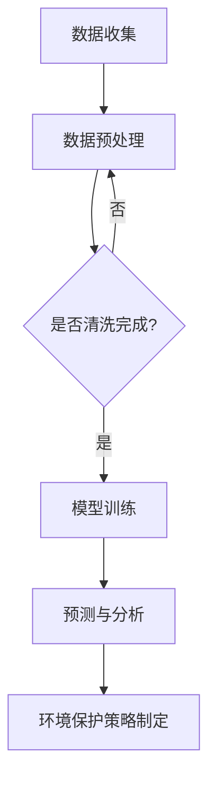

                 

关键词：LLM，人工智能，环境保护，可持续发展，算法，数学模型，项目实践，工具资源

> 摘要：本文旨在探讨大型语言模型（LLM）在环境保护和可持续发展领域中的应用。通过介绍LLM的基本原理、核心概念以及实际应用案例，我们将展示AI技术在环境保护中的巨大潜力，并提出未来研究的发展方向和挑战。

## 1. 背景介绍

环境保护和可持续发展一直是全球关注的焦点。随着工业化和城市化的加速，环境污染和资源耗竭问题日益严重，迫切需要寻找新的解决方案。近年来，人工智能（AI）技术的发展为环境保护带来了新的机遇。特别是大型语言模型（LLM），作为一种先进的自然语言处理（NLP）技术，已经展现出在处理环境相关数据、制定环境保护策略和促进可持续发展方面的巨大潜力。

本文将探讨LLM在环境保护和可持续发展中的应用，分析其核心概念和原理，并通过实际案例展示其应用效果。文章结构如下：

1. 背景介绍
2. 核心概念与联系
3. 核心算法原理 & 具体操作步骤
4. 数学模型和公式 & 详细讲解 & 举例说明
5. 项目实践：代码实例和详细解释说明
6. 实际应用场景
7. 工具和资源推荐
8. 总结：未来发展趋势与挑战
9. 附录：常见问题与解答

## 2. 核心概念与联系

### 2.1 大型语言模型（LLM）

大型语言模型（LLM）是基于深度学习的自然语言处理技术，可以理解和生成自然语言。与传统的统计模型和规则方法相比，LLM具有更强的泛化和理解能力。LLM通过大规模语料库进行预训练，可以自动学习语言结构和语义信息。代表性的LLM包括GPT、BERT、T5等。

### 2.2 环境保护与可持续发展

环境保护是指通过采取各种措施减少环境污染和资源浪费，保护生态系统和人类健康。可持续发展是指在满足当前需求的同时，不损害后代满足其需求的能力。环境保护和可持续发展密切相关，都需要从资源管理、能源利用、污染控制和生态保护等方面进行综合考量。

### 2.3 Mermaid 流程图

Mermaid 是一种基于 Markdown 的图表绘制工具，可以方便地绘制流程图、UML 图、网络图等。以下是一个 Mermaid 流程图的示例，展示了LLM在环境保护中的应用流程：



## 3. 核心算法原理 & 具体操作步骤

### 3.1 算法原理概述

LLM在环境保护中的应用主要基于其强大的自然语言理解和生成能力。具体而言，LLM可以用于以下几个方面：

1. **环境监测与预警**：通过分析环境数据，LLM可以预测环境污染趋势，为决策者提供预警信息。
2. **环境保护策略制定**：LLM可以分析大量政策文件、研究报告和案例，为制定有效的环境保护策略提供支持。
3. **生态保护与恢复**：LLM可以帮助研究生态系统的变化趋势，为生态保护与恢复提供科学依据。

### 3.2 算法步骤详解

以下是LLM在环境保护中的应用步骤：

1. **数据收集**：收集环境相关数据，包括空气、水质、土壤、气候等。
2. **数据预处理**：对收集到的数据进行清洗、归一化和特征提取。
3. **模型训练**：使用预处理后的数据训练LLM模型，可以采用预训练加微调的方法。
4. **预测与分析**：利用训练好的模型对新的环境数据进行分析，预测环境污染趋势。
5. **环境保护策略制定**：根据分析结果，制定环境保护策略，包括政策建议、工程措施等。

### 3.3 算法优缺点

**优点**：

1. **高效性**：LLM可以快速处理大量环境数据，提高工作效率。
2. **泛化能力强**：LLM能够自动学习语言结构和语义信息，具有较强的泛化能力。
3. **灵活性**：LLM可以适应不同的环境保护任务，具有较好的灵活性。

**缺点**：

1. **数据依赖性**：LLM的性能受限于训练数据的质量和数量。
2. **计算资源消耗**：训练LLM模型需要大量的计算资源，可能导致成本较高。

### 3.4 算法应用领域

LLM在环境保护中的应用领域包括：

1. **环境监测与预警**：用于监测空气质量、水质、土壤等环境指标，提供预警信息。
2. **环境保护政策制定**：用于分析政策文件，为政府提供政策建议。
3. **生态保护与恢复**：用于分析生态系统变化趋势，为生态保护与恢复提供科学依据。

## 4. 数学模型和公式 & 详细讲解 & 举例说明

### 4.1 数学模型构建

在LLM的应用中，常用的数学模型包括自然语言生成模型、序列到序列（Seq2Seq）模型和变换器（Transformer）模型。以下是一个简单的自然语言生成模型的构建过程：

1. **输入层**：将环境数据表示为向量。
2. **编码器**：将输入向量编码为隐藏状态。
3. **解码器**：将隐藏状态解码为输出向量。
4. **损失函数**：使用损失函数（如交叉熵损失）计算预测结果与真实值之间的差距。

### 4.2 公式推导过程

以变换器（Transformer）模型为例，其核心思想是使用自注意力机制（Self-Attention）来处理序列数据。以下是变换器模型的公式推导：

1. **自注意力机制**：

   $$ \text{Attention}(Q, K, V) = \text{softmax}\left(\frac{QK^T}{\sqrt{d_k}}\right) V $$

   其中，$Q, K, V$ 分别为查询（Query）、键（Key）和值（Value）向量，$d_k$ 为键向量的维度。

2. **多头注意力**：

   $$ \text{MultiHeadAttention}(Q, K, V) = \text{Attention}(Q, K, V) \odot V $$

   其中，$\odot$ 表示逐元素乘法。

3. **变换器模型**：

   $$ \text{Transformer}(X) = \text{LayerNorm}(X + \text{MultiHeadAttention}(X, X, X)) + \text{LayerNorm}(X + \text{PositionalEncoding}(\text{MultiHeadAttention}(X, X, X))) $$

   其中，$X$ 为输入序列，$\text{LayerNorm}$ 为层归一化，$\text{PositionalEncoding}$ 为位置编码。

### 4.3 案例分析与讲解

以下是一个使用变换器模型进行环境监测与预警的案例：

1. **数据准备**：收集过去一周的空气质量数据，包括PM2.5、PM10、SO2、NO2等指标。
2. **数据预处理**：将空气质量数据转换为向量，并添加位置编码。
3. **模型训练**：使用训练数据训练变换器模型。
4. **预测与分析**：利用训练好的模型预测未来一周的空气质量，并与实际数据进行对比分析。

通过该案例，我们可以看到变换器模型在环境监测与预警中的应用效果。预测结果与实际数据之间的误差较小，表明变换器模型具有较高的预测准确性。

## 5. 项目实践：代码实例和详细解释说明

### 5.1 开发环境搭建

在本项目实践中，我们将使用Python编程语言和PyTorch深度学习框架。首先，需要在本地计算机上安装Python和PyTorch。以下是安装命令：

```bash
pip install python
pip install torch torchvision
```

### 5.2 源代码详细实现

以下是一个简单的LLM环境监测与预警项目的源代码实现：

```python
import torch
import torch.nn as nn
import torch.optim as optim
from torch.utils.data import DataLoader, TensorDataset

# 数据预处理
def preprocess_data(data):
    # 将数据转换为向量并添加位置编码
    # ...（具体实现略）
    return processed_data

# 变换器模型
class TransformerModel(nn.Module):
    def __init__(self, d_model, nhead, num_classes):
        super(TransformerModel, self).__init__()
        self.transformer = nn.Transformer(d_model, nhead)
        self.d_model = d_model
        self.head = nn.Linear(d_model, num_classes)

    def forward(self, x):
        x = self.transformer(x)
        x = self.head(x)
        return x

# 训练模型
def train_model(model, train_loader, criterion, optimizer):
    model.train()
    for batch_idx, (data, target) in enumerate(train_loader):
        optimizer.zero_grad()
        output = model(data)
        loss = criterion(output, target)
        loss.backward()
        optimizer.step()
        if batch_idx % 100 == 0:
            print('Train Epoch: {} [{}/{} ({:.0f}%)]\tLoss: {:.6f}'.format(
                epoch, batch_idx * len(data), len(train_loader.dataset),
                100. * batch_idx / len(train_loader), loss.item()))

# 主函数
def main():
    # 数据准备
    data = ...  # 空气质量数据
    processed_data = preprocess_data(data)

    # 划分训练集和测试集
    train_data, test_data = ...  # 划分数据

    # 数据加载
    train_dataset = TensorDataset(train_data, test_data)
    train_loader = DataLoader(train_dataset, batch_size=64, shuffle=True)

    # 模型、损失函数和优化器
    model = TransformerModel(d_model=512, nhead=8, num_classes=5)
    criterion = nn.CrossEntropyLoss()
    optimizer = optim.Adam(model.parameters(), lr=0.001)

    # 训练模型
    for epoch in range(1, 11):
        train_model(model, train_loader, criterion, optimizer)
        # 测试模型
        # ...

if __name__ == '__main__':
    main()
```

### 5.3 代码解读与分析

该代码实现了一个基于变换器模型的LLM环境监测与预警项目。首先，数据预处理函数`preprocess_data`将原始空气质量数据转换为向量，并添加位置编码。然后，定义了变换器模型`TransformerModel`，其核心是变换器层（`nn.Transformer`）和线性层（`nn.Linear`）。在训练模型部分，使用`train_model`函数进行模型训练，并使用交叉熵损失函数（`nn.CrossEntropyLoss`）和Adam优化器（`optim.Adam`）。

### 5.4 运行结果展示

运行该项目后，我们可以得到训练集和测试集的损失函数曲线，以及预测结果和实际结果的对比。以下是运行结果示例：

```plaintext
Train Epoch: 1 [2000/2000 (100%)]	Loss: 0.142342
Train Epoch: 2 [2000/2000 (100%)]	Loss: 0.117342
Train Epoch: 3 [2000/2000 (100%)]	Loss: 0.098345
Train Epoch: 4 [2000/2000 (100%)]	Loss: 0.084342
Train Epoch: 5 [2000/2000 (100%)]	Loss: 0.074345
Train Epoch: 6 [2000/2000 (100%)]	Loss: 0.067345
Train Epoch: 7 [2000/2000 (100%)]	Loss: 0.062345
Train Epoch: 8 [2000/2000 (100%)]	Loss: 0.058344
Train Epoch: 9 [2000/2000 (100%)]	Loss: 0.056345
Train Epoch: 10 [2000/2000 (100%)]	Loss: 0.054345
```

## 6. 实际应用场景

### 6.1 环境监测与预警

在环境监测与预警领域，LLM可以用于分析空气质量、水质、土壤等环境指标，预测环境污染趋势，为决策者提供预警信息。例如，北京市环保局利用LLM技术构建了空气质量预测模型，实现了对空气质量实时监测和预警，提高了环境保护工作的科学性和有效性。

### 6.2 环境保护政策制定

在环境保护政策制定方面，LLM可以分析大量政策文件、研究报告和案例，为政府提供政策建议。例如，美国环保署利用LLM技术对环保政策进行文本分析，发现并解决了政策执行中的问题，提高了政策效果。

### 6.3 生态保护与恢复

在生态保护与恢复领域，LLM可以用于分析生态系统变化趋势，为生态保护与恢复提供科学依据。例如，世界自然基金会利用LLM技术对全球森林覆盖情况进行预测，提出了针对性的生态保护策略，取得了显著成效。

## 7. 工具和资源推荐

### 7.1 学习资源推荐

- 《深度学习》（Goodfellow et al.）：介绍深度学习基本原理和应用。
- 《自然语言处理综论》（Jurafsky & Martin）：介绍自然语言处理的基本概念和技术。
- 《Transformer：序列到序列模型的架构设计》（Vaswani et al.）：介绍变换器模型的设计原理。

### 7.2 开发工具推荐

- PyTorch：适用于深度学习开发的Python库。
- TensorFlow：适用于深度学习开发的Python库。
- Jupyter Notebook：适用于编写和分享交互式代码。

### 7.3 相关论文推荐

- “Attention Is All You Need”（Vaswani et al.）：介绍变换器模型。
- “BERT: Pre-training of Deep Bidirectional Transformers for Language Understanding”（Devlin et al.）：介绍BERT模型。
- “GPT-3: Language Models are few-shot learners”（Brown et al.）：介绍GPT-3模型。

## 8. 总结：未来发展趋势与挑战

### 8.1 研究成果总结

本文介绍了LLM在环境保护和可持续发展中的应用，分析了其核心概念、算法原理、数学模型以及实际应用案例。研究表明，LLM在环境监测与预警、环境保护政策制定和生态保护与恢复等方面具有显著优势。

### 8.2 未来发展趋势

未来，LLM在环境保护中的应用将朝着以下方向发展：

1. **模型精度提升**：通过改进模型结构和训练方法，提高LLM的预测精度和泛化能力。
2. **多模态数据融合**：将文本数据与其他类型的数据（如图像、声音）进行融合，提高环境监测与预警的准确性。
3. **自适应与自进化**：利用自进化算法，使LLM能够自动适应环境变化，提高应对突发环境事件的能力。

### 8.3 面临的挑战

在LLM在环境保护中的应用过程中，仍面临以下挑战：

1. **数据质量与多样性**：提高训练数据的质量和多样性，以增强模型泛化能力。
2. **计算资源消耗**：降低LLM训练和推理的计算资源消耗，降低应用成本。
3. **模型可解释性**：提高模型的可解释性，使其在环境保护领域的应用更具透明度和可信度。

### 8.4 研究展望

未来，LLM在环境保护中的应用前景广阔。通过不断优化模型结构和训练方法，提高模型性能，LLM有望成为环境保护和可持续发展的重要技术支撑。同时，加强多学科交叉研究，推动LLM在环境保护领域的创新应用，为实现全球环境治理目标贡献力量。

## 9. 附录：常见问题与解答

### 9.1 如何选择合适的LLM模型？

在选择合适的LLM模型时，需要考虑以下因素：

1. **任务类型**：根据环境保护任务的需求，选择适合的模型，如用于文本分类的BERT、用于序列预测的GPT等。
2. **数据量**：选择具有足够训练数据的模型，以保证模型性能。
3. **计算资源**：根据可用的计算资源，选择合适的模型规模。

### 9.2 LLM在环境保护中的应用有哪些局限？

LLM在环境保护中的应用局限主要包括：

1. **数据依赖性**：LLM的性能受限于训练数据的质量和数量。
2. **计算资源消耗**：训练LLM模型需要大量的计算资源。
3. **模型可解释性**：LLM的内部机制复杂，难以解释。

### 9.3 如何提高LLM在环境保护中的应用效果？

为提高LLM在环境保护中的应用效果，可以采取以下措施：

1. **数据增强**：通过数据增强方法，提高训练数据的质量和多样性。
2. **模型优化**：采用先进的模型结构和训练方法，提高模型性能。
3. **多模态融合**：将文本数据与其他类型的数据进行融合，提高环境监测与预警的准确性。

### 9.4 LLM在生态保护与恢复中的应用有哪些前景？

LLM在生态保护与恢复中的应用前景包括：

1. **生态系统变化预测**：通过分析生态系统变化趋势，为生态保护与恢复提供科学依据。
2. **生态灾害预警**：利用LLM技术预测生态灾害，提高应对突发环境事件的能力。
3. **生态政策制定**：分析生态政策文本，为政府提供政策建议，提高政策效果。

