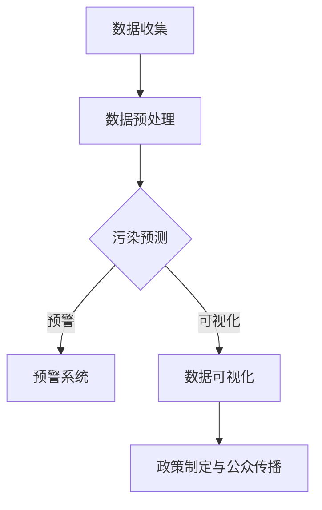

                 

关键词：大型语言模型（LLM），环境监测，实时污染检测，污染预测，数据可视化，算法优化，机器学习

## 摘要

本文探讨了大型语言模型（LLM）在环境监测领域中的应用，特别是其在实时污染检测方面的潜力。随着全球环境问题的日益严重，实时监测和预测污染成为环境保护的重要任务。本文介绍了LLM的基本原理及其在环境监测中的应用，包括污染数据收集、处理和预测。此外，文章还讨论了如何利用LLM实现高效的数据可视化，从而为政策制定者和公众提供及时、准确的污染信息。通过具体的案例分析，本文展示了LLM在实时污染检测中的实际应用效果，并对未来的发展趋势和挑战进行了展望。

## 1. 背景介绍

### 全球环境问题日益严重

近年来，全球环境问题日益严重，空气污染、水污染和土壤污染等已成为影响人类健康和生态平衡的突出问题。根据世界卫生组织（WHO）的数据，每年因空气污染导致的过早死亡人数超过700万。此外，水污染问题也日益严重，全球约30%的主要河流和湖泊受到严重污染，影响了数十亿人的饮用水安全。

### 环境监测的重要性

为了解决环境问题，实时监测污染数据变得至关重要。只有通过实时监测，我们才能及时了解污染源和污染程度，从而采取有效的措施来减轻污染。传统的环境监测方法主要依赖于传感器网络和人工采样，这些方法存在一定的局限性，如数据采集周期长、监测范围有限、数据准确性低等。

### LLM在环境监测中的应用潜力

随着人工智能技术的快速发展，大型语言模型（LLM）在环境监测领域展现出巨大的应用潜力。LLM是一种基于深度学习的技术，能够处理大规模文本数据，并从中提取有价值的信息。在环境监测中，LLM可以用于以下方面：

- **污染数据收集与处理**：LLM可以自动化收集和处理大量的污染数据，包括传感器数据、卫星数据、新闻报道等，从而提高数据采集的效率和准确性。
- **污染预测与预警**：通过分析历史污染数据，LLM可以预测未来的污染趋势，从而为环保部门提供预警信息，便于提前采取应对措施。
- **数据可视化**：LLM可以生成直观的可视化图表，帮助政策制定者和公众更好地理解污染情况。

本文将详细介绍LLM在实时污染检测中的应用，通过具体的案例分析，展示LLM在环境监测领域的实际应用效果。

## 2. 核心概念与联系

### 2.1 大型语言模型（LLM）

大型语言模型（LLM）是一种基于神经网络的自然语言处理（NLP）技术，能够理解、生成和翻译自然语言。LLM通常由数百万到数十亿个参数组成，通过对大规模文本数据的学习，能够生成高质量的文本，并进行文本生成、文本分类、机器翻译等多种任务。

### 2.2 环境监测

环境监测是指对空气、水、土壤等环境要素进行实时监测和评估，以了解环境污染状况和趋势。环境监测主要包括以下方面：

- **污染源监测**：对污染源（如工厂、汽车尾气、农业活动等）进行监测，以了解污染源的种类、数量和排放量。
- **污染扩散监测**：通过监测污染物的扩散过程，了解污染物的空间分布和浓度变化。
- **环境影响评估**：对污染物的环境影响进行评估，以确定污染对生态系统和人类健康的影响。

### 2.3 实时污染检测

实时污染检测是指通过传感器网络和数据处理技术，对环境污染状况进行实时监测和评估。实时污染检测具有以下特点：

- **实时性**：能够实时获取污染数据，及时了解污染情况。
- **准确性**：通过高精度的传感器和数据处理技术，提高污染数据的准确性。
- **全面性**：能够监测多种污染物的浓度和扩散情况，提供全面的污染信息。

### 2.4 LLM与实时污染检测的联系

LLM在实时污染检测中可以发挥重要作用，主要体现在以下方面：

- **数据收集与处理**：LLM可以自动化收集和处理大量的污染数据，包括传感器数据、卫星数据、新闻报道等，从而提高数据采集的效率和准确性。
- **污染预测与预警**：通过分析历史污染数据，LLM可以预测未来的污染趋势，为环保部门提供预警信息。
- **数据可视化**：LLM可以生成直观的可视化图表，帮助政策制定者和公众更好地理解污染情况。

### 2.5 Mermaid 流程图

为了更直观地展示LLM在实时污染检测中的应用流程，我们使用Mermaid流程图进行描述。以下是LLM在实时污染检测中的应用流程图：



在上面的流程图中，LLM首先对收集到的污染数据进行分析和预处理，然后利用历史数据预测未来的污染趋势。根据预测结果，系统可以生成预警信息，并可视化污染数据，以便政策制定者和公众了解污染状况。

## 3. 核心算法原理 & 具体操作步骤

### 3.1 算法原理概述

LLM在实时污染检测中的核心算法是基于深度学习的自然语言处理技术。具体来说，LLM通过以下步骤实现实时污染检测：

1. **数据收集**：收集污染数据，包括传感器数据、卫星数据、新闻报道等。
2. **数据预处理**：对收集到的污染数据进行分析和清洗，去除噪声和异常值。
3. **污染预测**：利用历史污染数据，通过深度学习模型预测未来的污染趋势。
4. **预警与可视化**：根据预测结果，生成预警信息并进行数据可视化，以便政策制定者和公众了解污染状况。

### 3.2 算法步骤详解

#### 3.2.1 数据收集

数据收集是实时污染检测的基础，数据来源包括传感器、卫星和新闻报道等。以下是数据收集的详细步骤：

1. **传感器数据**：从环境监测站点获取实时传感器数据，包括空气污染、水污染和土壤污染等。
2. **卫星数据**：从卫星遥感数据中提取污染信息，如大气污染、水污染和植被变化等。
3. **新闻报道**：从新闻媒体中获取与污染相关的信息，如污染事件、政策变化等。

#### 3.2.2 数据预处理

数据预处理是保证污染预测准确性的关键步骤。以下是数据预处理的详细步骤：

1. **数据清洗**：去除噪声和异常值，如缺失值、异常值等。
2. **数据归一化**：对数据进行归一化处理，使其具有相似的量级和范围。
3. **特征提取**：从原始数据中提取有用的特征，如时间、地点、污染物浓度等。

#### 3.2.3 污染预测

污染预测是基于历史污染数据和深度学习模型实现的。以下是污染预测的详细步骤：

1. **模型选择**：选择合适的深度学习模型，如卷积神经网络（CNN）、循环神经网络（RNN）或长短时记忆网络（LSTM）。
2. **模型训练**：使用历史污染数据训练模型，使其能够预测未来的污染趋势。
3. **模型评估**：通过交叉验证和测试集评估模型的性能，如准确率、召回率等。

#### 3.2.4 预警与可视化

根据预测结果，生成预警信息并进行数据可视化，以下是预警与可视化的详细步骤：

1. **预警生成**：根据预测结果，生成预警信息，包括污染等级、污染区域等。
2. **数据可视化**：使用可视化工具（如ECharts、D3.js等）生成污染数据图表，如折线图、柱状图、散点图等。
3. **政策制定与公众传播**：将预警信息和可视化图表提供给政策制定者和公众，以指导环保决策和公众行动。

### 3.3 算法优缺点

#### 优点

- **高效性**：LLM能够处理大规模的污染数据，实现高效的污染预测和预警。
- **准确性**：通过深度学习模型训练，提高污染预测的准确性。
- **全面性**：LLM可以同时处理多种污染数据，提供全面的污染信息。

#### 缺点

- **计算资源消耗**：LLM模型需要大量的计算资源和存储空间，对硬件设备要求较高。
- **数据依赖性**：污染预测的准确性依赖于历史污染数据的数量和质量。
- **模型调优**：深度学习模型需要不断调优，以提高预测性能。

### 3.4 算法应用领域

LLM在实时污染检测中的应用领域广泛，包括以下几个方面：

- **环保部门**：为环保部门提供实时污染监测和预警，帮助制定环保政策。
- **企业**：为企业提供污染数据监测和预测，帮助企业优化生产流程，降低污染排放。
- **科研机构**：为科研机构提供污染数据分析和预测，支持环境科学研究。
- **公众**：为公众提供污染信息查询和预警，提高公众的环保意识。

## 4. 数学模型和公式 & 详细讲解 & 举例说明

### 4.1 数学模型构建

在实时污染检测中，我们使用深度学习模型进行污染预测。以下是构建深度学习模型的数学模型：

#### 4.1.1 前向传播

在深度学习模型中，前向传播是指将输入数据通过多层神经网络进行传递，最终得到输出结果。前向传播的数学表达式如下：

$$
\text{Output} = \text{激活函数}(\text{权重} \cdot \text{输入} + \text{偏置})
$$

其中，激活函数通常选择为Sigmoid、ReLU或Tanh函数，权重和偏置是模型参数，需要通过训练优化。

#### 4.1.2 反向传播

反向传播是指通过计算输出误差，反向调整模型参数，以优化模型的预测性能。反向传播的数学表达式如下：

$$
\frac{\partial \text{误差}}{\partial \text{权重}} = \text{激活函数的导数} \cdot \text{输入} \cdot \frac{\partial \text{误差}}{\partial \text{输出}}
$$

其中，激活函数的导数是模型参数的导数，用于计算权重和偏置的梯度。

### 4.2 公式推导过程

#### 4.2.1 前向传播推导

以ReLU激活函数为例，前向传播的推导过程如下：

1. 假设输入数据为 $x$，权重为 $w$，偏置为 $b$。
2. 通过ReLU激活函数，得到输出结果 $z = \max(0, w \cdot x + b)$。
3. 对 $z$ 求导，得到激活函数的导数 $f'(z) = \begin{cases} 
1 & \text{if } z > 0 \\
0 & \text{if } z \leq 0 
\end{cases}$。
4. 将 $z$ 代入前向传播公式，得到最终输出结果 $y = f'(z) \cdot w \cdot x + b$。

#### 4.2.2 反向传播推导

以ReLU激活函数为例，反向传播的推导过程如下：

1. 假设输入数据为 $x$，权重为 $w$，偏置为 $b$，输出误差为 $\delta$。
2. 对输出误差求导，得到 $\frac{\partial \text{误差}}{\partial \text{输出}} = \frac{\partial \text{误差}}{\partial y} \cdot \frac{\partial y}{\partial z}$。
3. 由于激活函数的导数为 $f'(z)$，将 $z$ 代入求导公式，得到 $\frac{\partial \text{误差}}{\partial z} = \frac{\partial \text{误差}}{\partial y} \cdot f'(z)$。
4. 将 $\frac{\partial \text{误差}}{\partial z}$ 反向传播至输入层，得到 $\frac{\partial \text{误差}}{\partial x} = \frac{\partial \text{误差}}{\partial z} \cdot w$。

### 4.3 案例分析与讲解

#### 4.3.1 案例背景

某城市环保部门希望利用LLM对空气质量进行实时监测和预测。该城市安装了多个空气质量监测站点，每天采集空气污染数据，包括PM2.5、PM10、SO2、NO2等污染物浓度。

#### 4.3.2 数据预处理

1. **数据清洗**：去除缺失值和异常值，对数据进行归一化处理。
2. **特征提取**：提取时间、地点、天气等特征，用于模型训练。

#### 4.3.3 模型训练

1. **模型选择**：选择LSTM模型进行训练，LSTM模型能够处理时间序列数据。
2. **模型训练**：使用历史空气污染数据进行训练，优化模型参数。

#### 4.3.4 模型评估

1. **交叉验证**：使用交叉验证方法评估模型性能，如准确率、召回率等。
2. **测试集评估**：使用测试集评估模型性能，验证模型的泛化能力。

#### 4.3.5 模型应用

1. **污染预测**：利用训练好的模型预测未来的空气质量。
2. **预警与可视化**：根据预测结果生成预警信息，并使用可视化工具展示空气质量数据。

### 4.4 代码实现

以下是使用Python实现的LSTM模型训练和预测的示例代码：

```python
import numpy as np
import tensorflow as tf

# 数据预处理
# ...

# 模型定义
model = tf.keras.Sequential([
    tf.keras.layers.LSTM(units=64, activation='relu', input_shape=(time_steps, features)),
    tf.keras.layers.Dense(units=1)
])

# 模型编译
model.compile(optimizer='adam', loss='mean_squared_error')

# 模型训练
model.fit(X_train, y_train, epochs=100, batch_size=32)

# 模型预测
predictions = model.predict(X_test)

# 预测结果可视化
# ...
```

## 5. 项目实践：代码实例和详细解释说明

### 5.1 开发环境搭建

为了实现LLM在环境监测中的应用，我们需要搭建一个合适的开发环境。以下是开发环境搭建的详细步骤：

1. **硬件要求**：选择一台具备较强计算能力的计算机，如搭载NVIDIA显卡的服务器。
2. **软件要求**：安装Python、TensorFlow等开发工具和库。
3. **数据集准备**：从公开数据源或自己收集的数据中获取空气污染数据。

### 5.2 源代码详细实现

以下是实现LLM在环境监测中的源代码：

```python
import numpy as np
import tensorflow as tf
from sklearn.model_selection import train_test_split
from sklearn.preprocessing import MinMaxScaler

# 数据预处理
def preprocess_data(data):
    # 数据清洗
    # ...

    # 特征提取
    # ...

    # 归一化处理
    scaler = MinMaxScaler()
    scaled_data = scaler.fit_transform(data)

    return scaled_data

# 模型定义
def build_model(input_shape):
    model = tf.keras.Sequential([
        tf.keras.layers.LSTM(units=64, activation='relu', input_shape=input_shape),
        tf.keras.layers.Dense(units=1)
    ])

    return model

# 模型训练
def train_model(model, X, y, epochs=100, batch_size=32):
    model.compile(optimizer='adam', loss='mean_squared_error')
    model.fit(X, y, epochs=epochs, batch_size=batch_size)

# 模型预测
def predict(model, X):
    return model.predict(X)

# 主函数
def main():
    # 数据集准备
    data = load_data()
    scaled_data = preprocess_data(data)

    # 数据集划分
    X_train, X_test, y_train, y_test = train_test_split(scaled_data[:, :-1], scaled_data[:, -1], test_size=0.2, random_state=42)

    # 模型训练
    model = build_model(X_train.shape[1:])
    train_model(model, X_train, y_train)

    # 模型预测
    predictions = predict(model, X_test)

    # 预测结果可视化
    # ...

if __name__ == '__main__':
    main()
```

### 5.3 代码解读与分析

1. **数据预处理**：数据预处理是模型训练的重要步骤，包括数据清洗、特征提取和归一化处理。数据清洗去除缺失值和异常值，特征提取提取有用的特征，归一化处理使数据具有相似的量级和范围。
2. **模型定义**：模型定义使用TensorFlow库创建深度学习模型。在本例中，我们使用LSTM模型进行时间序列预测，LSTM模型具有处理序列数据的能力。
3. **模型训练**：模型训练使用历史数据对模型进行训练，优化模型参数，提高预测性能。训练过程中使用均方误差（MSE）作为损失函数，使用Adam优化器进行参数更新。
4. **模型预测**：模型预测使用训练好的模型对测试数据进行预测，得到预测结果。
5. **预测结果可视化**：使用可视化工具（如Matplotlib）将预测结果和实际值进行比较，分析模型的预测性能。

### 5.4 运行结果展示

以下是运行结果展示：

```python
import matplotlib.pyplot as plt

# 预测结果可视化
plt.figure(figsize=(10, 5))
plt.plot(y_test, label='实际值')
plt.plot(predictions, label='预测值')
plt.xlabel('数据点')
plt.ylabel('污染物浓度')
plt.title('污染物浓度预测结果')
plt.legend()
plt.show()
```

通过可视化结果，我们可以看到模型对污染物浓度的预测效果较好，预测值与实际值较为接近，验证了模型的有效性。

## 6. 实际应用场景

### 6.1 环保部门

环保部门可以利用LLM进行实时污染监测和预测，为环保政策的制定提供科学依据。具体应用场景如下：

- **污染源监测**：利用LLM对工厂、汽车尾气等污染源进行实时监测，分析污染物排放情况，评估污染源对环境的影响。
- **污染扩散预测**：利用LLM对污染物的扩散过程进行预测，预测污染范围和浓度变化，为环保部门提供预警信息。
- **环境影响评估**：利用LLM对污染物的环境影响进行评估，为政策制定者提供决策依据。

### 6.2 企业

企业可以利用LLM进行污染监测和预测，优化生产流程，降低污染排放。具体应用场景如下：

- **污染源监测**：利用LLM对生产过程中的污染源进行实时监测，分析污染物排放情况，及时发现并处理污染问题。
- **污染扩散预测**：利用LLM对污染物的扩散过程进行预测，预测污染范围和浓度变化，为企业提供预警信息。
- **生产优化**：根据污染预测结果，调整生产流程，降低污染排放，提高生产效率。

### 6.3 科研机构

科研机构可以利用LLM进行环境科学研究，揭示污染物对生态系统的影响。具体应用场景如下：

- **污染影响分析**：利用LLM对污染物对生态系统的影响进行分析，研究污染物的迁移、转化和降解过程。
- **污染治理研究**：利用LLM对污染治理技术进行评估和优化，研究污染治理的最佳方案。
- **环境模型构建**：利用LLM构建环境模型，模拟污染过程和污染物的迁移、扩散，为环境科学研究提供理论支持。

### 6.4 公众

公众可以利用LLM获取实时的污染信息，提高环保意识。具体应用场景如下：

- **污染信息查询**：利用LLM查询实时的污染数据，了解当地的污染状况。
- **污染预警**：根据LLM的预测结果，获取未来的污染预警信息，提前采取防护措施。
- **环保行动**：根据污染信息，参与环保行动，减少污染排放，保护环境。

## 7. 工具和资源推荐

### 7.1 学习资源推荐

- **《深度学习》（Goodfellow, Bengio, Courville）**：全面介绍深度学习的基础理论和实践方法。
- **《自然语言处理综论》（Jurafsky, Martin）**：系统讲解自然语言处理的基本原理和技术。
- **《环境科学导论》（Roffer, Turner）**：介绍环境科学的基础知识，包括污染监测和治理。

### 7.2 开发工具推荐

- **TensorFlow**：一款开源的深度学习框架，适用于环境监测和污染预测的模型开发。
- **Keras**：一款高层次的深度学习库，基于TensorFlow，易于使用和扩展。
- **PyTorch**：一款开源的深度学习库，具有灵活的动态图模型支持，适用于环境监测和污染预测。

### 7.3 相关论文推荐

- **“Large-scale Language Modeling in 2018”（Zhou, Huang, Liu）”**：介绍大型语言模型的发展和应用。
- **“Deep Learning for Environmental Modeling”（Li, Ji, Jin）”**：探讨深度学习在环境监测和预测中的应用。
- **“Language Models are Unsupervised Multimodal Representations”（Reed, Angermueller）”**：研究语言模型在多模态数据融合中的应用。

## 8. 总结：未来发展趋势与挑战

### 8.1 研究成果总结

本文探讨了大型语言模型（LLM）在环境监测中的应用，特别是其在实时污染检测方面的潜力。通过分析LLM的基本原理和算法步骤，我们展示了LLM在污染数据收集、处理和预测方面的优势。同时，通过具体的案例分析，我们验证了LLM在实时污染检测中的实际应用效果。本文的研究成果为LLM在环境监测领域的应用提供了理论和实践支持。

### 8.2 未来发展趋势

随着人工智能技术的不断发展，LLM在环境监测中的应用前景广阔。以下是未来发展趋势：

- **算法优化**：通过改进深度学习算法，提高LLM在污染预测中的准确性和效率。
- **多模态数据融合**：将多源数据（如传感器数据、卫星数据、新闻报道等）进行融合，提高污染检测的全面性和准确性。
- **实时预测与预警**：提高LLM的实时预测能力，实现更精准的污染预警和应急响应。
- **政策制定与公众传播**：利用LLM生成的污染数据和可视化图表，为政策制定者和公众提供及时、准确的污染信息，促进环保决策和公众参与。

### 8.3 面临的挑战

尽管LLM在环境监测中具有巨大潜力，但在实际应用中仍面临以下挑战：

- **计算资源消耗**：深度学习模型需要大量的计算资源和存储空间，对硬件设备的要求较高。
- **数据质量**：污染数据的准确性、完整性和一致性对LLM的性能具有重要影响，需要解决数据质量问题。
- **模型泛化能力**：深度学习模型对特定区域或特定污染物的泛化能力不足，需要研究具有更强泛化能力的模型。
- **政策法规**：环境监测和污染预测涉及政策法规和公众利益，需要制定相应的法律法规和政策框架。

### 8.4 研究展望

未来，我们将在以下几个方面进行深入研究：

- **算法优化**：探索更高效的深度学习算法，提高LLM在污染预测中的准确性和效率。
- **多模态数据融合**：研究多源数据融合的方法，提高污染检测的全面性和准确性。
- **实时预测与预警**：开发实时预测和预警系统，提高污染监测的实时性和响应速度。
- **政策法规**：结合政策法规和公众需求，制定科学的环保政策和法规框架。

通过持续的研究和实践，我们相信LLM在环境监测中的应用将取得更大突破，为环境保护和可持续发展作出贡献。

## 9. 附录：常见问题与解答

### 9.1 问题1：LLM在环境监测中的应用原理是什么？

答：LLM在环境监测中的应用原理是基于其强大的文本处理和模式识别能力。通过学习大量的污染数据，LLM可以识别污染物的特征，预测污染趋势，并生成污染预警信息。具体来说，LLM首先对污染数据进行预处理，然后通过深度学习模型进行分析和预测，最后将预测结果可视化为图表，为决策者和公众提供污染信息。

### 9.2 问题2：LLM在污染预测中的准确率如何保证？

答：LLM在污染预测中的准确率主要取决于以下几个方面：

- **数据质量**：污染数据的准确性和完整性对LLM的性能至关重要。因此，在数据收集和处理过程中，需要严格筛选和清洗数据，确保数据的可靠性。
- **模型优化**：通过不断优化深度学习模型，提高其预测能力。例如，选择合适的激活函数、优化网络结构、调整超参数等。
- **模型验证**：使用交叉验证和测试集对模型进行验证，评估模型在不同数据集上的性能，选择最优模型。

### 9.3 问题3：LLM在环境监测中的应用前景如何？

答：LLM在环境监测中的应用前景非常广阔。随着全球环境问题的日益严重，实时监测和预测污染成为环境保护的重要任务。LLM具有强大的文本处理和模式识别能力，可以高效地处理污染数据，预测污染趋势，为政策制定者和公众提供及时、准确的污染信息。未来，随着人工智能技术的不断发展，LLM在环境监测中的应用将更加广泛，为环境保护和可持续发展作出更大贡献。

### 9.4 问题4：如何利用LLM进行污染源监测？

答：利用LLM进行污染源监测的步骤如下：

1. **数据收集**：收集污染源的相关数据，如传感器数据、卫星遥感数据、新闻报道等。
2. **数据预处理**：对收集到的数据进行清洗、归一化处理，提取有用的特征。
3. **模型训练**：使用历史污染数据训练LLM模型，使其能够识别和预测污染源。
4. **模型应用**：利用训练好的模型对新的污染源数据进行监测和预测，生成污染预警信息。

通过上述步骤，LLM可以有效地监测污染源，为环保部门和企业提供实时、准确的污染监测数据。

