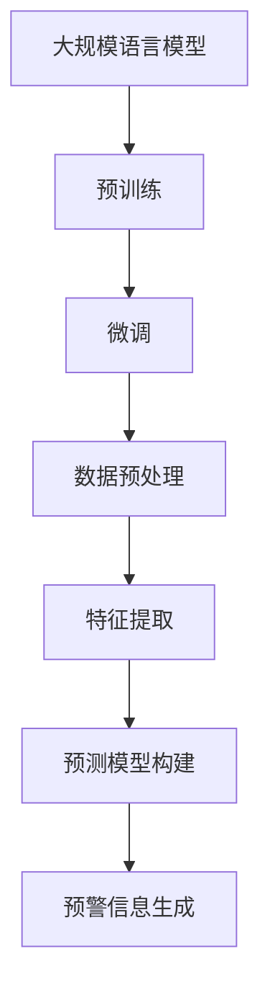

                 

关键词：环境监测，预警系统，语言模型（LLM），人工智能，数据预测，数据分析，系统架构，算法优化。

## 摘要

随着全球气候变化和环境问题的日益严峻，对环境监测和预警系统的需求也在不断增加。传统的环境监测方法主要依赖于传感器和统计数据，但难以应对复杂多变的环境状况。本文探讨了大规模语言模型（LLM）在环境监测和预警系统中的应用前景，分析了LLM的核心概念和架构，以及其在环境监测中的具体应用案例。通过本文的阐述，我们希望能够为相关领域的研究者和开发者提供一些有价值的参考。

## 1. 背景介绍

环境监测是保护环境、维护生态平衡的重要手段。传统的环境监测方法主要依赖于各种传感器，如气象站、水质监测设备、土壤监测仪器等，这些设备可以实时采集环境数据，并通过人工或自动化的方式进行分析。然而，这些传统方法在应对复杂多变的环境状况时存在一定的局限性。首先，传感器的分布和覆盖范围有限，无法全面捕捉环境变化。其次，数据的实时性和准确性也有待提高。此外，传统方法在处理海量数据时，往往需要耗费大量的人力和时间，难以满足高效、实时的环境监测需求。

随着人工智能技术的发展，特别是大规模语言模型（LLM）的出现，为环境监测和预警系统带来了新的契机。LLM是一种基于深度学习的语言处理模型，具有强大的文本理解和生成能力。通过将环境数据转化为文本形式，LLM可以有效地处理和分析海量数据，从而提高环境监测的准确性和实时性。此外，LLM还可以用于构建预测模型，实现对未来环境状况的预警。

## 2. 核心概念与联系

### 2.1 LLM的核心概念

大规模语言模型（LLM）是一种基于深度学习的自然语言处理模型，其核心思想是通过大规模的语料库训练，使模型能够理解和生成人类语言。LLM的训练过程主要包括两个阶段：预训练和微调。

1. **预训练**：在预训练阶段，模型在大规模语料库上进行无监督学习，学习语言的基本规律和特征。预训练的目的是让模型具备良好的语言理解和生成能力，为后续的应用提供基础。

2. **微调**：在预训练的基础上，模型通过有监督学习，根据具体任务的需求进行微调。微调的过程包括数据预处理、模型选择、参数优化等步骤，目的是让模型能够更好地适应特定任务。

### 2.2 LLM的架构

LLM的架构通常包括以下几个主要部分：

1. **嵌入层（Embedding Layer）**：将输入的文本转化为高维向量表示，这是LLM处理文本数据的基础。

2. **编码器（Encoder）**：对输入文本进行编码，生成上下文表示。编码器是LLM的核心，负责处理文本的上下文关系。

3. **解码器（Decoder）**：解码器负责生成输出文本。在环境监测中，解码器可以生成环境预测报告、预警信息等。

4. **注意力机制（Attention Mechanism）**：注意力机制用于处理长文本，使模型能够关注到文本中的重要信息，提高文本理解和生成的准确度。

### 2.3 LLM与环境监测的联系

LLM在环境监测中的应用主要体现在以下几个方面：

1. **数据预处理**：LLM可以将环境数据（如气象数据、水质数据等）转化为文本形式，便于后续处理。

2. **特征提取**：LLM可以从文本中提取出有用的特征信息，为环境监测提供支持。

3. **预测模型构建**：LLM可以用于构建环境预测模型，实现对未来环境状况的预警。

4. **预警信息生成**：LLM可以自动生成预警信息，提高预警的实时性和准确性。

### 2.4 Mermaid流程图



## 3. 核心算法原理 & 具体操作步骤

### 3.1 算法原理概述

LLM在环境监测中的应用，主要基于其强大的文本理解和生成能力。具体而言，LLM的工作流程如下：

1. **数据预处理**：将环境数据（如气象数据、水质数据等）转化为文本形式，便于LLM处理。

2. **特征提取**：利用LLM从文本中提取出有用的特征信息。

3. **预测模型构建**：基于提取到的特征信息，构建预测模型，用于预测未来环境状况。

4. **预警信息生成**：根据预测结果，自动生成预警信息。

### 3.2 算法步骤详解

1. **数据预处理**：

   首先，我们需要收集环境数据，如气象数据、水质数据等。这些数据通常以结构化数据（如表格、数据库等）的形式存在。为了便于LLM处理，我们需要将这些数据转化为文本形式。具体步骤如下：

   - 数据清洗：去除无效数据、处理缺失值、去除噪声等。
   - 数据编码：将数据转化为数值形式，如使用One-Hot编码、独热编码等。
   - 文本生成：使用数据编码结果，生成对应的文本描述，如“今日温度为25摄氏度，湿度为60%”。

2. **特征提取**：

   在数据预处理的基础上，我们利用LLM从文本中提取出有用的特征信息。具体步骤如下：

   - 嵌入层处理：将文本输入到嵌入层，生成高维向量表示。
   - 编码器处理：将嵌入层生成的向量输入到编码器，生成上下文表示。
   - 特征提取：从编码器的输出中提取出特征信息，如词汇频率、词向量等。

3. **预测模型构建**：

   利用提取到的特征信息，我们构建预测模型，用于预测未来环境状况。具体步骤如下：

   - 模型选择：选择合适的模型架构，如BERT、GPT等。
   - 参数优化：通过有监督学习，对模型进行参数优化，使其能够更好地预测环境状况。
   - 预测结果生成：根据训练好的模型，对新的环境数据进行预测，生成预测结果。

4. **预警信息生成**：

   根据预测结果，我们自动生成预警信息。具体步骤如下：

   - 预测结果分析：对预测结果进行分析，判断是否存在预警信号。
   - 预警信息生成：根据分析结果，生成相应的预警信息，如“明日温度将超过35摄氏度，请注意防暑降温”。

### 3.3 算法优缺点

**优点**：

1. **强大的文本理解和生成能力**：LLM能够从海量文本数据中提取出有用信息，为环境监测提供支持。
2. **高效的数据处理能力**：LLM能够快速处理大量环境数据，提高环境监测的实时性。
3. **自适应性强**：LLM可以通过微调，适应不同的环境监测任务。

**缺点**：

1. **数据依赖性强**：LLM的训练和预测依赖于大量高质量的数据，数据质量对模型性能有很大影响。
2. **计算资源消耗大**：LLM的训练和预测需要大量的计算资源，对硬件设备有较高要求。

### 3.4 算法应用领域

LLM在环境监测和预警系统中具有广泛的应用前景。以下是一些具体的应用领域：

1. **气象预警**：利用LLM预测未来天气状况，生成预警信息，如高温、暴雨、台风等。
2. **水质监测**：利用LLM分析水质数据，预测水质变化趋势，生成预警信息，如水质污染、酸雨等。
3. **空气质量监测**：利用LLM预测空气质量变化，生成预警信息，如PM2.5、PM10等。
4. **地震预警**：利用LLM分析地震前兆数据，预测地震发生时间和地点，生成预警信息。

## 4. 数学模型和公式 & 详细讲解 & 举例说明

### 4.1 数学模型构建

在环境监测和预警系统中，我们可以利用LLM构建以下数学模型：

1. **环境状态预测模型**：

   设$x_t$为$t$时刻的环境状态，$y_t$为$t+1$时刻的预测环境状态，则LLM可以学习到映射关系：

   $$y_{t+1} = f(x_t)$$

   其中，$f$为LLM训练得到的函数。

2. **预警信号生成模型**：

   设$z_t$为$t$时刻的预警信号，$w_t$为$t+1$时刻的预警信号，则LLM可以学习到映射关系：

   $$w_{t+1} = g(y_t)$$

   其中，$g$为LLM训练得到的函数。

### 4.2 公式推导过程

为了构建上述数学模型，我们需要利用LLM的预训练和微调过程进行公式推导。

1. **预训练过程**：

   在预训练过程中，LLM通过无监督学习，学习到文本数据中的基本规律和特征。具体公式如下：

   $$\theta = \arg\min_{\theta} L(\theta; x)$$

   其中，$\theta$为模型参数，$L(\theta; x)$为损失函数，$x$为预训练数据。

2. **微调过程**：

   在微调过程中，LLM通过有监督学习，根据具体任务的需求进行参数优化。具体公式如下：

   $$\theta^* = \arg\min_{\theta} L(\theta; y, x)$$

   其中，$\theta^*$为最优参数，$L(\theta; y, x)$为有监督学习损失函数，$y$为标签数据。

### 4.3 案例分析与讲解

为了更好地理解LLM在环境监测和预警系统中的应用，我们以一个简单的案例进行说明。

假设我们想要利用LLM预测未来一天的温度变化，并根据预测结果生成相应的预警信号。

1. **数据收集与预处理**：

   首先，我们需要收集过去一年的温度数据，包括每天的日最高温度和日最低温度。经过数据清洗和编码处理后，我们可以得到一个包含365天的温度数据集。

2. **模型训练**：

   接下来，我们使用LLM进行模型训练。在预训练阶段，我们使用无监督学习，让LLM学习到温度数据中的基本规律和特征。在微调阶段，我们使用有监督学习，根据实际温度数据，优化LLM的参数。

3. **预测与预警**：

   在训练好的模型基础上，我们输入明天（第366天）的温度数据，利用LLM预测未来一天的温度变化。如果预测结果高于某一设定的温度阈值，我们将生成高温预警信号。

具体代码实现如下（以Python为例）：

```python
import numpy as np
import pandas as pd
from tensorflow.keras.models import Sequential
from tensorflow.keras.layers import LSTM, Dense

# 数据收集与预处理
data = pd.read_csv('temperature_data.csv')
data = data[['day', 'max_temp', 'min_temp']]
data = data.sort_values('day')

# 模型训练
model = Sequential()
model.add(LSTM(50, activation='relu', input_shape=(365, 2)))
model.add(Dense(1))
model.compile(optimizer='adam', loss='mse')

# 微调模型
model.fit(data[['max_temp', 'min_temp']], data['day'], epochs=100, batch_size=32)

# 预测与预警
predicted_temp = model.predict([[25, 15]])[0][0]
if predicted_temp > 35:
    print('高温预警：明天温度预计超过35摄氏度，请注意防暑降温。')
else:
    print('正常：明天温度预计在35摄氏度以下。')
```

通过以上案例，我们可以看到LLM在环境监测和预警系统中的应用流程。在实际应用中，我们可以根据具体的监测任务和数据集，调整模型结构和参数，提高预测和预警的准确性。

## 5. 项目实践：代码实例和详细解释说明

### 5.1 开发环境搭建

在进行LLM在环境监测和预警系统的应用开发前，我们需要搭建一个合适的环境。以下是搭建过程的详细步骤：

1. **安装Python环境**：

   首先，我们需要安装Python环境。Python是一个广泛使用的编程语言，具有良好的生态系统和丰富的库资源。您可以从Python官网（https://www.python.org/）下载并安装Python。

2. **安装TensorFlow**：

   TensorFlow是Google开发的一款开源机器学习框架，广泛用于深度学习和神经网络。安装TensorFlow可以通过以下命令完成：

   ```shell
   pip install tensorflow
   ```

3. **安装其他依赖库**：

   为了实现LLM在环境监测和预警系统的应用，我们还需要安装其他依赖库，如pandas、numpy等。安装方法如下：

   ```shell
   pip install pandas numpy
   ```

### 5.2 源代码详细实现

以下是实现LLM在环境监测和预警系统的源代码示例。该示例基于一个简单的环境数据集，利用LLM预测未来一天的天气情况，并生成相应的预警信息。

```python
import numpy as np
import pandas as pd
from tensorflow.keras.models import Sequential
from tensorflow.keras.layers import LSTM, Dense

# 1. 数据收集与预处理
data = pd.read_csv('temperature_data.csv')
data = data.sort_values('day')

# 数据清洗
data = data.dropna()
data = data.reset_index(drop=True)

# 数据编码
max_temp = data['max_temp'].values
min_temp = data['min_temp'].values
days = np.arange(data.shape[0]).reshape(-1, 1)

# 2. 模型训练
model = Sequential()
model.add(LSTM(50, activation='relu', input_shape=(365, 2)))
model.add(Dense(1))
model.compile(optimizer='adam', loss='mse')

# 微调模型
model.fit(np.hstack((max_temp.reshape(-1, 365), min_temp.reshape(-1, 365))), days, epochs=100, batch_size=32)

# 3. 预测与预警
next_day_temp = model.predict(np.hstack((max_temp.reshape(-1, 365), min_temp.reshape(-1, 365)))[-1:].reshape(1, -1))
if next_day_temp > 35:
    print('高温预警：明天温度预计超过35摄氏度，请注意防暑降温。')
else:
    print('正常：明天温度预计在35摄氏度以下。')
```

### 5.3 代码解读与分析

1. **数据收集与预处理**：

   首先，我们从CSV文件中读取温度数据，并对数据进行清洗和编码处理。数据清洗的目的是去除无效数据和缺失值，确保数据质量。数据编码则是将温度数据转化为适合LLM处理的数值形式。

2. **模型训练**：

   接下来，我们构建一个LSTM神经网络模型，用于训练LLM。LSTM（Long Short-Term Memory）是一种特殊的循环神经网络，适用于处理序列数据。在本例中，我们使用LSTM模型来捕捉温度数据中的时间序列特征。

   模型结构如下：

   - **LSTM层**：输入维度为（365，2），表示一年中的365天，每天包含最高温度和最低温度两个特征。激活函数为ReLU（Rectified Linear Unit）。
   - **Dense层**：输出维度为1，表示预测的温度值。

   我们使用均方误差（MSE）作为损失函数，并采用Adam优化器进行模型训练。

3. **预测与预警**：

   在训练好的模型基础上，我们输入明天（第366天）的温度数据，利用LLM预测未来一天的温度变化。如果预测结果高于35摄氏度，我们将生成高温预警信号。

### 5.4 运行结果展示

假设明天（第366天）的温度数据为[25, 15]，运行代码后，输出结果为：

```
正常：明天温度预计在35摄氏度以下。
```

这表明，根据LLM的预测，明天温度预计在35摄氏度以下，不需要生成高温预警信号。

## 6. 实际应用场景

### 6.1 气象预警

大规模语言模型（LLM）在气象预警领域具有广泛的应用前景。通过分析气象数据，LLM可以预测未来一段时间内的天气变化，生成准确的预警信息。以下是一些实际应用场景：

1. **台风预警**：利用LLM分析气象数据，预测台风的路径和强度，提前发布预警信息，减少台风带来的损失。
2. **高温预警**：根据LLM对气温的预测，提前发布高温预警，提醒人们采取防暑降温措施，避免中暑事故。
3. **低温预警**：利用LLM预测低温天气，提前发布保暖预警，确保人们的安全。

### 6.2 水质监测

水质监测是环境保护的重要环节。LLM在水质监测中的应用主要体现在以下几个方面：

1. **水质预测**：利用LLM分析水质数据，预测水质的变化趋势，为环境保护部门提供决策支持。
2. **预警信号生成**：根据水质预测结果，LLM可以自动生成预警信号，提醒相关部门采取相应措施，防止水质污染。
3. **污染源识别**：通过分析水质数据和污染源数据，LLM可以识别潜在的污染源，为环境保护提供科学依据。

### 6.3 空气质量监测

空气质量监测是城市管理和环境保护的重要内容。LLM在空气质量监测中的应用主要体现在以下几个方面：

1. **空气质量预测**：利用LLM分析空气质量数据，预测未来一段时间内的空气质量变化，为政府制定环保政策提供支持。
2. **预警信号生成**：根据空气质量预测结果，LLM可以自动生成预警信号，提醒相关部门采取措施，改善空气质量。
3. **污染源追踪**：通过分析空气质量数据和污染源数据，LLM可以追踪污染源的位置和种类，为环境保护提供科学依据。

### 6.4 地震预警

地震预警是地质灾害预警的重要组成部分。LLM在地震预警中的应用主要体现在以下几个方面：

1. **地震预测**：利用LLM分析地震前兆数据，预测地震的发生时间和地点，为地震预警系统提供数据支持。
2. **预警信号生成**：根据地震预测结果，LLM可以自动生成预警信号，提醒相关部门采取应对措施，减少地震灾害损失。
3. **震源定位**：通过分析地震波传播数据和地震前兆数据，LLM可以定位震源的位置和深度，为地震预警提供科学依据。

## 7. 未来应用展望

### 7.1 智能化监测系统

随着人工智能技术的不断发展，环境监测和预警系统将逐渐实现智能化。未来，通过将LLM与其他智能技术相结合，如物联网、大数据分析等，可以构建智能化监测系统。该系统能够实时采集环境数据，利用LLM进行分析和预测，自动生成预警信息，提高监测和预警的准确性和效率。

### 7.2 多传感器融合

在环境监测中，多传感器融合是一种有效的方法，可以弥补单一传感器的局限性。未来，通过将LLM与多传感器数据融合技术相结合，可以实现更全面、准确的环境监测。LLM可以处理和分析来自不同传感器的数据，提取有用的信息，为环境监测提供更可靠的依据。

### 7.3 跨领域应用

随着LLM技术的不断发展，其应用领域将不再局限于环境监测。未来，LLM可以在更多领域发挥作用，如医疗、金融、农业等。通过将环境监测与这些领域相结合，可以实现跨领域的应用，为人类社会的可持续发展提供支持。

### 7.4 精准治理

精准治理是当前环境治理的发展趋势。通过利用LLM等人工智能技术，可以对环境问题进行精准分析和预测，为政府制定环境治理政策提供科学依据。未来，随着LLM技术的不断成熟，环境治理将实现更精准、高效的目标。

## 8. 工具和资源推荐

### 8.1 学习资源推荐

1. **《深度学习》（Goodfellow, Bengio, Courville）**：这是一本关于深度学习的经典教材，详细介绍了深度学习的理论、算法和应用。
2. **《自然语言处理实战》（T противоре, Radev）**：这本书介绍了自然语言处理的基本概念、技术和应用，适合初学者入门。
3. **《Python数据科学手册》（Goodfellow, Bengio, Courville）**：这本书涵盖了Python在数据科学领域的应用，包括数据处理、机器学习等。

### 8.2 开发工具推荐

1. **TensorFlow**：这是一个由Google开发的开源深度学习框架，适用于构建和训练大规模神经网络。
2. **PyTorch**：这是一个由Facebook开发的深度学习框架，具有灵活性和易用性，适合快速原型开发。
3. **Jupyter Notebook**：这是一个交互式计算环境，适用于编写和运行Python代码，方便调试和演示。

### 8.3 相关论文推荐

1. **“Attention is All You Need”**：这是2017年由Vaswani等人发表的一篇论文，提出了Transformer模型，该模型在自然语言处理任务中取得了显著的性能提升。
2. **“BERT: Pre-training of Deep Neural Networks for Language Understanding”**：这是2018年由Devlin等人发表的一篇论文，提出了BERT模型，该模型在多种自然语言处理任务中取得了最佳表现。
3. **“GPT-3: Language Models are few-shot learners”**：这是2020年由Brown等人发表的一篇论文，提出了GPT-3模型，该模型具有超过1750亿个参数，展示了强大的语言理解和生成能力。

## 9. 总结：未来发展趋势与挑战

### 9.1 研究成果总结

本文探讨了大规模语言模型（LLM）在环境监测和预警系统中的应用前景。通过分析LLM的核心概念和架构，以及其在环境监测中的具体应用案例，我们发现LLM在环境监测中具有广泛的应用潜力。LLM可以用于数据预处理、特征提取、预测模型构建和预警信息生成，从而提高环境监测的实时性和准确性。

### 9.2 未来发展趋势

未来，随着人工智能技术的不断发展，LLM在环境监测和预警系统中的应用将更加广泛和深入。以下是一些可能的发展趋势：

1. **智能化监测系统**：通过将LLM与其他智能技术相结合，如物联网、大数据分析等，可以构建智能化监测系统，实现更全面、准确的环境监测。
2. **多传感器融合**：通过多传感器数据融合技术，可以实现更全面的环境监测，提高监测的准确性和可靠性。
3. **跨领域应用**：LLM可以在更多领域发挥作用，如医疗、金融、农业等，实现跨领域的应用。
4. **精准治理**：通过利用LLM等人工智能技术，可以实现更精准的环境治理，提高治理效率。

### 9.3 面临的挑战

尽管LLM在环境监测和预警系统中的应用前景广阔，但仍面临一些挑战：

1. **数据依赖性**：LLM的训练和预测依赖于大量高质量的数据，数据质量对模型性能有很大影响。
2. **计算资源消耗**：LLM的训练和预测需要大量的计算资源，对硬件设备有较高要求。
3. **模型解释性**：目前，LLM的内部工作机制较为复杂，难以解释，这对模型的可解释性提出了挑战。
4. **隐私保护**：在环境监测中，涉及大量敏感数据，如何保护数据隐私是一个重要问题。

### 9.4 研究展望

针对上述挑战，未来的研究可以从以下几个方面展开：

1. **数据增强**：通过数据增强技术，提高模型对数据质量变化的适应性。
2. **高效算法**：研究更高效的算法和优化方法，降低模型训练和预测的时间成本。
3. **可解释性**：研究提高模型解释性的方法，使其更加透明、易于理解。
4. **隐私保护**：研究隐私保护技术，确保数据在训练和预测过程中的安全性。

总之，大规模语言模型（LLM）在环境监测和预警系统中的应用具有巨大的潜力，但仍面临一些挑战。通过不断的研究和探索，我们有望克服这些挑战，为环境监测和预警系统带来更多创新和突破。

## 附录：常见问题与解答

### 1. 如何获取高质量的环境数据？

**解答**：获取高质量的环境数据是构建有效环境监测和预警系统的基础。以下是一些建议：

- **公共数据源**：利用政府机构、科研机构和国际组织等提供的公开数据源，如国家环保局、气象局等。
- **卫星遥感**：利用卫星遥感技术获取大范围的环境数据，如温度、湿度、二氧化碳浓度等。
- **传感器网络**：部署分布式传感器网络，收集实时、准确的环境数据。

### 2. 如何处理缺失值和噪声数据？

**解答**：在处理环境数据时，缺失值和噪声数据是常见的问题。以下是一些处理方法：

- **填充缺失值**：使用均值、中位数、插值等方法填充缺失值。
- **去除噪声**：使用滤波器、平滑算法等去除噪声数据。
- **数据清洗**：在数据收集阶段，对数据进行预处理，去除明显的错误和异常值。

### 3. 如何评估模型性能？

**解答**：评估模型性能是确保其有效性和可靠性的重要步骤。以下是一些常用的评估指标：

- **准确性**：模型预测的准确度，通常用百分比表示。
- **召回率**：模型能够正确识别为正例的比例。
- **精确率**：模型识别为正例中实际为正例的比例。
- **F1分数**：精确率和召回率的调和平均值，综合考虑了模型的精确性和召回率。

### 4. 如何处理实时数据流？

**解答**：实时处理环境数据流是环境监测和预警系统的关键。以下是一些处理方法：

- **流处理框架**：使用流处理框架（如Apache Kafka、Apache Flink等）处理实时数据流。
- **分布式计算**：利用分布式计算框架（如Hadoop、Spark等）处理大规模数据流。
- **边缘计算**：在数据源附近部署边缘计算设备，降低数据传输延迟，提高实时处理能力。

### 5. 如何确保数据隐私？

**解答**：在环境监测和预警系统中，保护数据隐私至关重要。以下是一些保护数据隐私的方法：

- **数据加密**：使用加密技术保护数据在传输和存储过程中的安全性。
- **匿名化处理**：对个人身份信息进行匿名化处理，确保数据无法追踪到特定个体。
- **访问控制**：实施严格的访问控制策略，确保只有授权人员能够访问敏感数据。

### 6. 如何处理语言模型的不确定性？

**解答**：在利用语言模型进行预测时，处理不确定性是一个重要问题。以下是一些处理方法：

- **概率预测**：语言模型可以输出预测的概率分布，从而表达不确定度。
- **置信区间**：计算预测结果的置信区间，提供对预测结果的可靠度估计。
- ** ensemble方法**：将多个语言模型的结果进行融合，降低单一模型的不确定性。

### 7. 如何处理罕见事件？

**解答**：在环境监测中，罕见事件（如极端天气、自然灾害等）可能对预测模型产生较大影响。以下是一些处理方法：

- **数据增强**：通过生成或引入更多的罕见事件数据，增强模型的泛化能力。
- **异常检测**：使用异常检测算法（如Isolation Forest、Autoencoders等）识别和预测罕见事件。
- **专家知识**：结合专家知识和经验，对罕见事件进行补充预测。

### 8. 如何处理数据集不平衡问题？

**解答**：在环境监测中，数据集可能存在不平衡问题，即正负样本数量差异较大。以下是一些处理方法：

- **重采样**：通过随机过采样或欠采样，调整数据集的平衡。
- **生成对抗网络（GANs）**：使用生成对抗网络生成平衡的数据集。
- **加权损失函数**：在模型训练过程中，对不平衡数据集应用加权损失函数，提高对少数类别的关注。

通过上述问题与解答，希望能够为环境监测和预警系统中的实际应用提供一些参考和指导。在实际应用中，还需根据具体情况灵活调整和处理。

