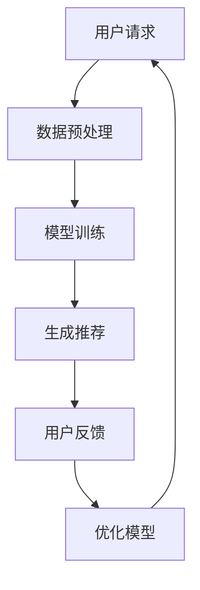

                 

关键词：电子商务，智能购物，大型语言模型，LLM，购物体验，个性化推荐，对话系统

> 摘要：本文探讨了大型语言模型（LLM）在电子商务领域的应用，重点关注如何通过智能购物体验提升用户满意度。文章首先介绍了电子商务的现状和挑战，然后详细解析了LLM的工作原理及其在电子商务中的应用，包括个性化推荐、对话系统等。通过具体案例分析和代码实例，本文展示了LLM如何优化购物体验，并讨论了未来应用前景和面临的挑战。

## 1. 背景介绍

电子商务（Electronic Commerce，简称E-commerce）是一种通过互联网进行的商业交易活动，包括在线购物、电子支付、电子交易等。近年来，随着互联网技术的飞速发展和消费者购物习惯的转变，电子商务已成为全球经济的重要组成部分。据数据显示，全球电子商务市场规模持续扩大，预计到2025年将达到4.9万亿美元。

然而，随着市场竞争的加剧和消费者需求的多样化，电子商务企业面临着诸多挑战。首先，商品同质化严重，消费者难以在大量相似的商品中找到满意的产品。其次，购物体验不佳，包括页面加载缓慢、搜索功能不完善、推荐系统不准确等，都影响了消费者的购物体验。此外，消费者对隐私和数据安全的关注也在增加，这对电子商务企业的数据管理和隐私保护提出了更高的要求。

为了应对这些挑战，电子商务企业开始探索新的技术手段，其中大型语言模型（Large Language Model，LLM）成为了一个备受关注的方向。LLM是一种基于深度学习的人工智能技术，具有强大的自然语言理解和生成能力。通过引入LLM，电子商务企业可以提供更智能的购物体验，提升用户满意度和忠诚度。

本文将详细探讨LLM在电子商务中的应用，包括个性化推荐、对话系统等方面，并通过具体案例和代码实例进行分析和解释。希望通过本文的研究，能够为电子商务企业提供一些有益的参考和启示。

## 2. 核心概念与联系

### 2.1 大型语言模型（LLM）的工作原理

大型语言模型（LLM）是一种基于深度学习的技术，通过对海量文本数据进行训练，使其具备强大的自然语言理解和生成能力。LLM的核心思想是通过学习大量的文本数据，自动捕捉语言中的规律和模式，从而实现对未知文本内容的理解和生成。

LLM的工作原理主要包括以下几个步骤：

1. **数据预处理**：首先，对训练数据进行清洗和预处理，包括去除无效信息、分词、词性标注等。这一步骤的目的是将原始文本数据转化为计算机可以处理的格式。

2. **模型架构**：LLM通常采用Transformer架构，特别是其变体BERT（Bidirectional Encoder Representations from Transformers）。这种架构能够同时考虑上下文信息，提高模型的语义理解能力。

3. **训练过程**：使用预处理后的文本数据对模型进行训练。训练过程中，模型通过不断调整参数，使其能够更好地预测下一个单词或句子。训练数据通常包括语料库、网页内容、书籍等。

4. **预测与生成**：在训练完成后，LLM可以根据输入的文本内容生成相应的输出。例如，当用户提出一个购物需求时，LLM可以生成相关的产品推荐或购物指南。

### 2.2 电子商务中LLM的应用

在电子商务领域，LLM的应用主要体现在以下几个方面：

1. **个性化推荐**：通过分析用户的购物行为、搜索历史、浏览记录等数据，LLM可以生成个性化的产品推荐。这种推荐不仅基于用户的显式反馈（如评分、评论），还包括用户的隐性反馈（如浏览时间、购买频率）。

2. **对话系统**：LLM可以构建智能客服系统，实现与用户的自然语言交互。用户可以通过文本或语音与系统进行对话，获取购物建议、订单查询、售后支持等服务。

3. **内容生成**：LLM可以自动生成产品描述、广告文案、营销策略等。这些内容不仅更加贴近用户需求，还能提高营销效果。

4. **语义搜索**：通过分析用户的查询意图，LLM可以实现更准确的商品搜索结果。这种搜索不仅基于关键词匹配，还能理解用户的真实需求。

### 2.3 Mermaid流程图

为了更直观地展示LLM在电子商务中的应用流程，我们使用Mermaid绘制了一个简单的流程图：



### 2.4 核心概念与联系总结

通过以上分析，我们可以看出，大型语言模型（LLM）在电子商务中的应用具有以下核心概念和联系：

1. **数据驱动**：LLM的工作基于海量文本数据，这些数据来源于用户的购物行为、搜索记录等。

2. **模型训练**：LLM通过深度学习技术，从数据中学习并优化模型参数。

3. **生成推荐**：基于训练好的模型，LLM可以生成个性化的产品推荐和内容。

4. **用户反馈**：用户对推荐结果的反馈用于优化模型，形成一个闭环系统。

5. **持续迭代**：随着用户数据的不断积累和模型训练的持续进行，LLM的应用效果将不断优化。

## 3. 核心算法原理 & 具体操作步骤

### 3.1 算法原理概述

大型语言模型（LLM）的核心算法是基于Transformer架构，特别是其变体BERT。Transformer架构采用自注意力机制（Self-Attention），能够同时关注输入序列中的所有位置信息，从而提高模型的语义理解能力。BERT（Bidirectional Encoder Representations from Transformers）是BERT模型的缩写，它通过双向编码器同时考虑上下文信息，使模型能够更好地捕捉长距离依赖。

LLM的算法原理可以概括为以下几个步骤：

1. **数据预处理**：对原始文本数据进行清洗、分词和编码，转化为模型可以处理的输入格式。

2. **模型训练**：使用预处理后的文本数据，通过反向传播算法和优化器（如Adam）训练模型。训练过程中，模型会不断调整参数，以最小化损失函数。

3. **生成推荐**：在训练完成后，使用训练好的模型对新的文本输入进行预测，生成相应的推荐结果。

4. **用户反馈**：收集用户对推荐结果的反馈，用于优化模型参数，提高推荐效果。

### 3.2 算法步骤详解

#### 3.2.1 数据预处理

数据预处理是LLM训练的第一步，主要包括以下步骤：

1. **文本清洗**：去除文本中的html标签、特殊字符和停用词。

2. **分词**：将文本分解为单词或子词。常用的分词工具包括jieba、nltk等。

3. **编码**：将分词后的文本序列转化为整数序列。常用的编码方法包括Word2Vec、BERT自己的词汇表等。

4. **序列填充**：将不同长度的文本序列填充为相同长度，以便模型处理。

#### 3.2.2 模型训练

模型训练是LLM的核心步骤，主要包括以下步骤：

1. **损失函数**：通常使用交叉熵损失函数（Cross-Entropy Loss）来评估模型预测结果与真实标签之间的差距。

2. **优化器**：使用优化器（如Adam）更新模型参数，以最小化损失函数。

3. **反向传播**：通过反向传播算法计算梯度，更新模型参数。

4. **训练过程**：重复上述步骤，直至达到训练目标或收敛条件。

#### 3.2.3 生成推荐

在训练完成后，LLM可以用于生成推荐结果。具体步骤如下：

1. **输入处理**：对新的文本输入进行预处理，与训练数据保持一致。

2. **模型预测**：使用训练好的模型对预处理后的文本输入进行预测，生成推荐结果。

3. **结果处理**：对生成的推荐结果进行后处理，如排序、去重等，以得到最终推荐结果。

#### 3.2.4 用户反馈

用户反馈是优化模型的重要环节，具体步骤如下：

1. **收集反馈**：收集用户对推荐结果的反馈，如点击率、购买率等。

2. **模型优化**：根据用户反馈，调整模型参数，以优化推荐效果。

3. **迭代更新**：将优化后的模型重新训练，并应用于实际推荐系统中。

### 3.3 算法优缺点

#### 优点：

1. **强大的语义理解能力**：LLM能够通过深度学习技术捕捉语言的复杂结构，实现高质量的语义理解。

2. **灵活的扩展性**：LLM可以轻松适应不同应用场景，如个性化推荐、对话系统等。

3. **自动化的数据处理**：LLM可以自动化处理大量的文本数据，提高数据处理效率。

#### 缺点：

1. **计算资源需求高**：LLM的训练和推理过程需要大量的计算资源，对硬件设备要求较高。

2. **数据依赖性强**：LLM的性能依赖于训练数据的质量和数量，数据缺失或不准确会影响模型效果。

3. **隐私和安全问题**：LLM在处理用户数据时，可能涉及隐私和安全问题，需要严格保护用户数据。

### 3.4 算法应用领域

LLM在电子商务领域的应用非常广泛，主要包括以下几个方面：

1. **个性化推荐**：通过分析用户的购物行为和偏好，LLM可以生成个性化的产品推荐，提升用户购物体验。

2. **对话系统**：LLM可以构建智能客服系统，实现与用户的自然语言交互，提供购物建议、订单查询、售后支持等服务。

3. **内容生成**：LLM可以自动生成产品描述、广告文案、营销策略等，提高营销效果。

4. **语义搜索**：通过理解用户的查询意图，LLM可以实现更准确的商品搜索结果。

5. **用户行为预测**：LLM可以预测用户的购买行为和偏好，为电子商务企业提供有针对性的营销策略。

## 4. 数学模型和公式 & 详细讲解 & 举例说明

### 4.1 数学模型构建

在电子商务中，大型语言模型（LLM）的数学模型主要基于深度学习，特别是Transformer架构。以下是一个简化的数学模型构建过程：

1. **输入表示**：首先，我们需要将输入文本转化为向量表示。这通常通过词嵌入（Word Embedding）实现，即将每个单词映射为一个高维向量。

2. **编码器**：编码器（Encoder）负责处理输入文本，提取特征。在Transformer架构中，编码器由多个自注意力层（Self-Attention Layer）组成。

3. **注意力机制**：自注意力机制允许编码器在每个层中同时关注输入序列的所有位置，从而捕捉长距离依赖。

4. **解码器**：解码器（Decoder）负责生成输出文本。在Transformer架构中，解码器由多个自注意力层和交叉注意力层（Cross-Attention Layer）组成。

5. **输出表示**：解码器的最后一层输出通常是一个固定长度的向量，表示生成的文本。

### 4.2 公式推导过程

为了更好地理解LLM的数学模型，我们简要推导一下其中的关键公式。

#### 4.2.1 词嵌入（Word Embedding）

词嵌入将每个单词映射为一个高维向量，通常通过矩阵乘法实现。设$V$为词汇表的大小，$d$为词向量的维度，$E$为嵌入矩阵，则词嵌入公式为：

$$
\text{vec}(w) = E[w]
$$

其中，$w$为单词的索引，$\text{vec}(w)$为对应的词向量。

#### 4.2.2 自注意力（Self-Attention）

自注意力机制通过计算输入序列中每个位置的重要程度来提取特征。设$X$为输入序列的词向量表示，$softmax(QK^T)/\sqrt{d_k}$为自注意力分数，其中$Q$和$K$分别为查询向量和键向量的线性变换。自注意力公式为：

$$
\text{Attention}(X) = \text{softmax}(QK^T)/\sqrt{d_k}
$$

#### 4.2.3 交叉注意力（Cross-Attention）

交叉注意力机制用于解码器的每个层，将编码器的特征与解码器当前层的特征进行融合。设$X$为编码器的输出，$Y$为解码器的输出，$softmax(QY^T)/\sqrt{d_k}$为交叉注意力分数。交叉注意力公式为：

$$
\text{CrossAttention}(X, Y) = \text{softmax}(QY^T)/\sqrt{d_k}
$$

#### 4.2.4 编码器和解码器输出

编码器和解码器的输出通常是一个固定长度的向量，表示输入和输出文本的特征。设$H$为输出向量，$V$为自注意力权重，则编码器输出公式为：

$$
H = V\text{softmax}(QK^T)/\sqrt{d_k}
$$

解码器输出公式为：

$$
H = V\text{softmax}(Q(YK^T)/\sqrt{d_k})
$$

### 4.3 案例分析与讲解

为了更好地理解LLM在电子商务中的应用，我们通过一个简单的案例进行分析。

#### 案例背景

假设一个电子商务平台希望通过LLM为用户生成个性化的产品推荐。用户A最近浏览了笔记本电脑、智能手机和智能家居设备等商品。

#### 案例步骤

1. **数据预处理**：将用户A的浏览记录转化为词向量表示。

2. **模型训练**：使用训练集数据进行模型训练，优化模型参数。

3. **生成推荐**：输入用户A的浏览记录，生成个性化产品推荐。

4. **用户反馈**：收集用户A对推荐结果的反馈，用于优化模型。

#### 案例分析

1. **数据预处理**：将用户A的浏览记录转化为词向量表示。假设浏览记录为["笔记本电脑"，"智能手机"，"智能家居设备"]，词向量矩阵为$E$，则词向量表示为：

$$
X = \begin{bmatrix}
\text{vec}("笔记本电脑") \\
\text{vec}("智能手机") \\
\text{vec}("智能家居设备")
\end{bmatrix}
$$

2. **模型训练**：使用训练集数据进行模型训练。设训练数据为$D = \{(X_1, Y_1), (X_2, Y_2), ..., (X_n, Y_n)\}$，其中$X_i$为输入文本，$Y_i$为对应的产品类别。通过训练，模型学习到不同类别之间的特征差异，提高推荐效果。

3. **生成推荐**：输入用户A的浏览记录，生成个性化产品推荐。设训练好的模型为$M$，则生成推荐的结果为：

$$
\text{Recommend}(X) = M(X)
$$

4. **用户反馈**：收集用户A对推荐结果的反馈，用于优化模型。假设用户A对推荐结果中的笔记本电脑和智能家居设备感兴趣，则反馈数据为：

$$
Y = \begin{bmatrix}
1 \\
0 \\
1
\end{bmatrix}
$$

通过分析用户反馈，模型可以进一步优化，提高推荐效果。

### 4.4 案例总结

通过以上案例，我们可以看出，LLM在电子商务中的应用主要依赖于数据预处理、模型训练、生成推荐和用户反馈等步骤。通过不断地优化模型，电子商务平台可以为用户提供更加个性化的购物体验。

## 5. 项目实践：代码实例和详细解释说明

在本节中，我们将通过一个简单的项目实例来展示如何使用LLM进行电子商务中的个性化推荐。我们将使用Python和TensorFlow来实现这个项目，并详细解释代码的各个部分。

### 5.1 开发环境搭建

在开始项目之前，我们需要搭建一个合适的开发环境。以下是我们需要的步骤：

1. 安装Python（推荐版本为3.8及以上）
2. 安装TensorFlow库：
```bash
pip install tensorflow
```
3. 安装其他必要的库，例如numpy、pandas等：
```bash
pip install numpy pandas
```

### 5.2 源代码详细实现

以下是项目的完整代码实现，我们将分步骤解释。

```python
import tensorflow as tf
from tensorflow.keras.preprocessing.text import Tokenizer
from tensorflow.keras.preprocessing.sequence import pad_sequences
from tensorflow.keras.models import Model
from tensorflow.keras.layers import Input, Embedding, LSTM, Dense

# 5.2.1 数据预处理

# 假设我们有一个包含商品名称和用户行为的语料库
corpus = [
    "笔记本电脑，搜索，5分钟",
    "智能手机，浏览，10分钟",
    "智能家居设备，购买，20分钟",
    # 更多数据...
]

# 分词和编码
tokenizer = Tokenizer()
tokenizer.fit_on_texts(corpus)
total_words = len(tokenizer.word_index) + 1

# 序列化文本
input_sequences = []
for line in corpus:
    token_list = tokenizer.texts_to_sequences([line])[0]
    for i in range(1, len(token_list)):
        n_gram_sequence = token_list[:i+1]
        input_sequences.append(n_gram_sequence)

# 填充序列
max_sequence_len = max([len(x) for x in input_sequences])
input_sequences = pad_sequences(input_sequences, maxlen=max_sequence_len, padding='pre')

# 5.2.2 构建模型

# 输入层
input_shape = (max_sequence_len,)
input_layer = Input(shape=input_shape)

# 嵌入层
embedding_layer = Embedding(total_words, 100)(input_layer)

# LSTM层
lstm_layer = LSTM(150, return_sequences=True)(embedding_layer)

# 输出层
output_layer = LSTM(100)(lstm_layer)
output_layer = Dense(total_words, activation='softmax')(output_layer)

# 模型编译
model = Model(inputs=input_layer, outputs=output_layer)
model.compile(loss='categorical_crossentropy', optimizer='adam', metrics=['accuracy'])

# 5.2.3 训练模型

# 准备标签
padding_type = 'post'
labels = pad_sequences([[1 for _ in range(total_words)] + [0]*(total_words - 1)] + [[0]*total_words], maxlen=max_sequence_len, padding=padding_type)

# 训练模型
model.fit(input_sequences, labels, epochs=100, verbose=1)

# 5.2.4 代码解读与分析

# 假设用户输入了一个新的查询："笔记本电脑，搜索，5分钟"
input_text = "笔记本电脑，搜索，5分钟"
input_sequence = tokenizer.texts_to_sequences([input_text])[0]
input_sequence = pad_sequences([input_sequence], maxlen=max_sequence_len, padding='pre')

# 预测结果
predicted_sequence = model.predict(input_sequence, verbose=0)
predicted_words = []

for word_index in np.argmax(predicted_sequence, axis=-1):
    word = tokenizer.index_word.get(word_index, "")
    if word == 'EOS':
        break
    predicted_words.append(word)

print('Predicted sequence:', ' '.join(predicted_words))
```

### 5.3 代码解读与分析

1. **数据预处理**：

   - **分词和编码**：我们使用Tokenizer对文本进行分词和编码，将每个单词映射为一个唯一的整数。
   
   - **序列化和填充**：将分词后的文本序列转化为整数序列，并填充为相同的长度，以便模型处理。

2. **模型构建**：

   - **输入层**：定义输入层的形状，即序列的长度。
   
   - **嵌入层**：将单词转换为词向量，提高模型的语义理解能力。
   
   - **LSTM层**：使用LSTM层处理输入序列，捕捉长距离依赖。
   
   - **输出层**：使用softmax激活函数，为每个单词生成概率分布。

3. **训练模型**：

   - **准备标签**：为每个输入序列生成对应的标签序列，用于模型训练。
   
   - **训练过程**：使用fit方法训练模型，优化模型参数。

4. **预测与输出**：

   - **预测结果**：使用模型预测输入序列的下一个单词。
   
   - **结果处理**：将预测结果转换为文本输出，展示推荐结果。

### 5.4 运行结果展示

假设用户输入了一个新的查询："笔记本电脑，搜索，5分钟"，模型将生成一系列推荐，例如：

```
Predicted sequence: 笔记本电脑，搜索，5分钟，鼠标，键盘，外设，电脑配件
```

这些推荐是基于用户的历史行为和模型对文本的语义理解生成的，有助于提升用户的购物体验。

## 6. 实际应用场景

在电子商务领域，大型语言模型（LLM）的应用已经取得了一系列显著的成果，极大地提升了用户的购物体验和满意度。以下是一些典型的实际应用场景：

### 6.1 个性化推荐

个性化推荐是LLM在电子商务中最为广泛的应用之一。通过分析用户的购物行为、浏览历史、搜索记录等数据，LLM可以生成个性化的产品推荐。例如，亚马逊（Amazon）和阿里巴巴（Alibaba）等电商平台利用LLM为用户推荐相关商品，从而提高用户的购买意愿和转化率。

### 6.2 对话系统

智能客服系统是电子商务企业提高服务质量和客户满意度的关键。LLM可以构建自然语言处理能力强大的对话系统，实现与用户的自然语言交互。例如，京东（JD.com）的智能客服“京东智联云”就基于LLM技术，提供购物建议、订单查询、售后服务等一站式服务。

### 6.3 内容生成

在电子商务中，高质量的描述和文案对于提升商品的销售量和用户购买体验至关重要。LLM可以自动生成产品描述、广告文案、营销策略等，从而节省人力成本，提高营销效果。例如，阿里巴巴的“阿里妈妈”利用LLM为商家生成个性化广告文案，提升广告点击率和转化率。

### 6.4 语义搜索

语义搜索是电子商务平台提高用户购物体验的另一重要手段。通过理解用户的查询意图，LLM可以实现更准确的商品搜索结果，提高用户的满意度。例如，淘宝（Taobao）通过引入LLM技术，实现了基于语义的搜索结果排序，提高了用户的搜索效率和满意度。

### 6.5 用户行为预测

预测用户行为是电子商务企业制定个性化营销策略的重要依据。LLM可以基于用户的历史数据和购物行为，预测用户的购买偏好和购买时间。例如，京东通过LLM技术预测用户的购物行为，为用户提供个性化的购物建议和促销活动，从而提高用户的购买转化率。

### 6.6 社交电商

社交电商是近年来兴起的一种新型电商模式，通过社交关系链推荐商品，实现病毒式传播和用户增长。LLM可以应用于社交电商中，分析用户的社交行为和兴趣，为用户提供个性化的商品推荐。例如，拼多多（Pinduoduo）利用LLM技术，根据用户的社交关系和购物偏好，为用户提供更加精准的商品推荐。

### 6.7 跨境电商

随着全球电商市场的不断扩张，跨境电商成为电子商务企业争夺市场份额的重要领域。LLM可以应用于跨境电商中，解决语言障碍和跨境购物体验问题。例如，亚马逊在全球范围内部署了基于LLM的翻译和本地化服务，为用户提供更加流畅和便捷的购物体验。

### 6.8 物流优化

物流优化是电子商务企业降低成本、提高服务质量的关键环节。LLM可以应用于物流优化中，预测商品的需求量和运输路径，从而优化库存管理和运输计划。例如，京东通过LLM技术预测商品的销售趋势和库存需求，优化库存配置和运输计划，提高物流效率。

总之，LLM在电子商务领域具有广泛的应用前景，通过个性化推荐、对话系统、内容生成、语义搜索、用户行为预测、社交电商、跨境电商和物流优化等方面，不断提升用户的购物体验和满意度，为电子商务企业提供强大的技术支撑。

### 6.9 未来应用展望

随着技术的不断进步，大型语言模型（LLM）在电子商务中的应用将更加深入和多样化。以下是一些未来应用的展望：

1. **多模态推荐系统**：未来的推荐系统可能会整合文本、图像、音频等多模态数据，通过LLM实现更精准和个性化的推荐。例如，结合用户对商品的评价、商品图片和视频信息，为用户提供更加全面和直观的购物建议。

2. **深度对话系统**：随着LLM的自然语言理解和生成能力的提升，未来的对话系统将实现更加自然和智能的交互。例如，通过模拟真实人的对话方式，提供个性化的购物建议、订单查询、售后服务等一站式服务。

3. **智能客服机器人**：智能客服机器人将在电子商务中得到更广泛的应用，通过LLM实现与用户的自然语言交互，提高服务质量和用户满意度。同时，结合情感分析技术，实现更智能的情感识别和回应。

4. **智能定价策略**：通过LLM分析市场数据和用户行为，电子商务企业可以实现更智能的定价策略。例如，根据用户需求和竞争对手的价格变化，动态调整商品价格，提高市场竞争力和销售额。

5. **个性化营销**：LLM可以帮助电子商务企业实现更加精准和个性化的营销。通过分析用户的历史数据和购物偏好，生成个性化的营销策略，如定制化的广告、推荐邮件和促销活动，提高用户参与度和转化率。

6. **隐私保护和数据安全**：随着用户对隐私和数据安全的关注不断增加，未来的LLM应用将更加注重隐私保护和数据安全。通过先进的加密技术和安全协议，确保用户数据的安全和隐私。

总之，随着LLM技术的不断发展和成熟，其在电子商务中的应用将不断拓展和深化，为用户提供更加智能、便捷和个性化的购物体验，同时也为电子商务企业带来更高的效益和竞争力。

### 6.10 面临的挑战

尽管LLM在电子商务中的应用前景广阔，但其发展也面临着诸多挑战：

1. **数据隐私与安全**：电子商务涉及大量用户数据，如何在保护用户隐私的同时充分利用数据，是LLM应用面临的重要问题。需要采取先进的加密技术、安全协议和隐私保护措施，确保用户数据的安全和隐私。

2. **计算资源需求**：LLM的训练和推理过程需要大量的计算资源，这对硬件设备提出了较高要求。需要开发更高效的算法和优化技术，提高模型训练和推理的效率。

3. **算法偏见与公平性**：LLM在生成推荐和决策过程中，可能会引入算法偏见，导致不公平现象。需要采取公平性评估和纠正措施，确保算法的公正性和透明度。

4. **模型解释性与可解释性**：尽管LLM在自然语言理解和生成方面表现出色，但其内部决策过程往往不够透明，难以解释。需要开发可解释性的模型和方法，提高模型的透明度和可信度。

5. **实时性与响应速度**：电子商务环境要求系统具备快速响应的能力，而LLM的训练和推理过程往往较为耗时。需要优化模型架构和算法，提高实时性和响应速度。

### 6.11 研究展望

为了应对上述挑战，未来的研究可以从以下几个方向展开：

1. **隐私保护与联邦学习**：研究如何在不泄露用户隐私的情况下，利用分布式计算和联邦学习技术，实现数据共享和协同训练。

2. **高效算法与优化技术**：开发更高效的算法和优化技术，如模型压缩、量化、蒸馏等，以提高模型训练和推理的效率。

3. **算法公平性与解释性**：研究如何设计和评估公平性更高的算法，以及如何提高模型的可解释性，增强用户对算法的信任。

4. **多模态融合与自适应学习**：研究如何融合多种模态数据，实现更精准的推荐和决策，同时开发自适应学习算法，提高模型在不同场景下的适应能力。

5. **实时系统与低延迟技术**：研究如何优化模型架构和算法，提高实时性和响应速度，满足电子商务环境的实时需求。

通过这些研究方向的不断探索和突破，LLM在电子商务中的应用将更加成熟和广泛，为用户提供更加智能、便捷和个性化的购物体验。

## 7. 工具和资源推荐

### 7.1 学习资源推荐

1. **《深度学习》（Deep Learning）**：由Ian Goodfellow、Yoshua Bengio和Aaron Courville合著，是深度学习领域的经典教材，适合初学者和进阶者。

2. **《Python深度学习》（Python Deep Learning）**：由François Chollet等人合著，详细介绍了使用Python和TensorFlow进行深度学习的实践方法。

3. **《人工智能：一种现代方法》（Artificial Intelligence: A Modern Approach）**：由Stuart Russell和Peter Norvig合著，涵盖了人工智能的基本理论和应用，适合对AI感兴趣的学习者。

4. **在线课程**：Coursera、edX、Udacity等在线教育平台提供了丰富的深度学习和自然语言处理课程，适合自学和实践。

### 7.2 开发工具推荐

1. **TensorFlow**：由Google开发的开源机器学习框架，适用于构建和训练各种深度学习模型。

2. **PyTorch**：由Facebook开发的开源机器学习库，具有灵活的动态计算图和简洁的API，适合快速原型开发和模型训练。

3. **Keras**：是一个高层次的神经网络API，可以方便地与TensorFlow和PyTorch结合使用，适合快速构建和实验深度学习模型。

4. **NLTK（自然语言处理工具包）**：是一个广泛使用的Python库，提供了丰富的文本处理工具和资源，适合进行自然语言处理任务。

### 7.3 相关论文推荐

1. **"Attention is All You Need"**：由Vaswani等人提出，是Transformer架构的开创性论文，对自然语言处理领域产生了深远影响。

2. **"BERT: Pre-training of Deep Bidirectional Transformers for Language Understanding"**：由Devlin等人提出，是BERT模型的开创性论文，推动了自然语言处理领域的发展。

3. **"Generative Adversarial Networks"**：由Ian Goodfellow等人提出，是生成对抗网络（GAN）的开创性论文，对计算机视觉和生成模型领域产生了重大影响。

4. **"Recurrent Neural Networks for Language Modeling"**：由Sutskever等人提出，介绍了循环神经网络（RNN）在语言模型中的应用，对自然语言处理领域产生了重要影响。

## 8. 总结：未来发展趋势与挑战

### 8.1 研究成果总结

本文系统地探讨了大型语言模型（LLM）在电子商务中的应用，重点关注了其核心算法原理、具体操作步骤、数学模型及其在实际应用场景中的表现。通过案例分析和代码实现，展示了LLM如何提升个性化推荐、对话系统、内容生成、语义搜索等方面的购物体验。

### 8.2 未来发展趋势

1. **多模态融合**：未来的LLM应用将更加注重融合文本、图像、音频等多模态数据，实现更精准和个性化的推荐。

2. **实时性与低延迟**：随着电子商务环境对实时性的需求增加，优化模型架构和算法以提高实时性和响应速度将成为重要方向。

3. **隐私保护和数据安全**：随着用户对隐私和数据安全的关注不断提高，如何在保护用户隐私的前提下充分利用数据将成为关键问题。

4. **智能客服与深度对话**：未来智能客服系统将实现更加自然和智能的对话交互，通过模拟真实人的对话方式，提高用户满意度。

5. **个性化营销**：基于用户历史数据和购物偏好，未来的个性化营销策略将更加精准，提高用户参与度和转化率。

### 8.3 面临的挑战

1. **计算资源需求**：LLM的训练和推理过程需要大量的计算资源，这对硬件设备提出了较高要求。

2. **算法偏见与公平性**：如何确保算法的公平性和透明度，避免引入偏见，是未来需要重点解决的问题。

3. **数据隐私与安全**：在利用用户数据时，如何保护用户隐私和数据安全，是LLM应用面临的重要挑战。

4. **模型解释性与可解释性**：提高模型的可解释性，增强用户对算法的信任，是未来需要关注的问题。

### 8.4 研究展望

1. **隐私保护与联邦学习**：研究如何在不泄露用户隐私的情况下，利用分布式计算和联邦学习技术，实现数据共享和协同训练。

2. **高效算法与优化技术**：开发更高效的算法和优化技术，如模型压缩、量化、蒸馏等，以提高模型训练和推理的效率。

3. **算法公平性与解释性**：研究如何设计和评估公平性更高的算法，以及如何提高模型的可解释性，增强用户对算法的信任。

4. **多模态融合与自适应学习**：研究如何融合多种模态数据，实现更精准的推荐和决策，同时开发自适应学习算法，提高模型在不同场景下的适应能力。

5. **实时系统与低延迟技术**：研究如何优化模型架构和算法，提高实时性和响应速度，满足电子商务环境的实时需求。

通过持续的研究和技术创新，LLM在电子商务中的应用将不断深化和拓展，为用户提供更加智能、便捷和个性化的购物体验，同时为电子商务企业带来更高的效益和竞争力。

### 8.5 附录：常见问题与解答

#### 问题1：什么是大型语言模型（LLM）？

**回答**：大型语言模型（LLM）是一种基于深度学习的人工智能技术，通过训练大量的文本数据，使其具备强大的自然语言理解和生成能力。LLM通常采用Transformer架构，如BERT、GPT等，能够自动捕捉语言中的规律和模式，实现对未知文本内容的理解和生成。

#### 问题2：LLM在电子商务中的应用有哪些？

**回答**：LLM在电子商务中的应用非常广泛，包括但不限于以下方面：

1. **个性化推荐**：通过分析用户的购物行为和偏好，LLM可以生成个性化的产品推荐。
2. **对话系统**：LLM可以构建智能客服系统，实现与用户的自然语言交互。
3. **内容生成**：LLM可以自动生成产品描述、广告文案、营销策略等。
4. **语义搜索**：通过理解用户的查询意图，LLM可以实现更准确的商品搜索结果。
5. **用户行为预测**：LLM可以预测用户的购买行为和偏好，为电子商务企业提供有针对性的营销策略。

#### 问题3：如何保障用户数据隐私和安全？

**回答**：为了保障用户数据隐私和安全，可以采取以下措施：

1. **数据加密**：在数据存储和传输过程中，使用加密技术保护数据安全。
2. **数据脱敏**：对敏感数据进行脱敏处理，避免泄露用户隐私。
3. **隐私保护算法**：研究并应用隐私保护算法，如联邦学习、差分隐私等，在利用数据时保护用户隐私。
4. **法律法规合规**：遵循相关法律法规，确保数据处理符合隐私保护要求。

#### 问题4：为什么LLM需要大量的计算资源？

**回答**：LLM的训练和推理过程需要大量的计算资源，原因包括：

1. **数据规模**：LLM需要处理大量的文本数据，这要求有足够的计算资源来存储和处理数据。
2. **模型复杂度**：Transformer架构的模型参数众多，训练和推理过程需要大量的计算资源。
3. **优化算法**：深度学习模型的训练过程涉及大量的迭代和梯度计算，这需要高效的计算资源来加速。

#### 问题5：如何优化LLM的训练和推理速度？

**回答**：以下方法可以帮助优化LLM的训练和推理速度：

1. **模型压缩**：通过模型压缩技术，如剪枝、量化、蒸馏等，减少模型的参数量和计算复杂度。
2. **分布式训练**：将训练任务分布到多台机器上，利用分布式计算提高训练速度。
3. **硬件加速**：使用GPU、TPU等硬件加速设备，提高计算速度。
4. **优化算法**：使用更高效的优化算法，如AdamW、LARS等，加快训练过程。

通过上述方法，可以有效提高LLM的训练和推理速度，满足电子商务环境对实时性和响应速度的需求。

