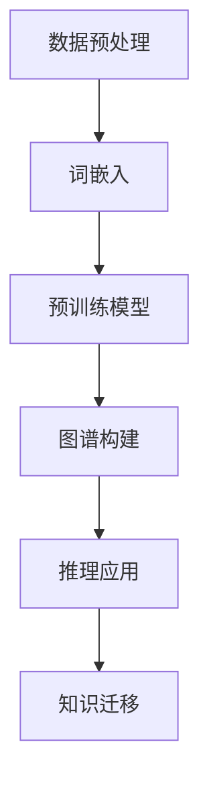

                 

关键词：知识表示学习，大型语言模型（LLM），人工智能，神经网络，自然语言处理，图神经网络，知识图谱。

> 摘要：本文深入探讨了大型语言模型（LLM）在知识表示学习中的应用潜力。通过分析LLM的工作原理、关键概念、核心算法、数学模型及其在实际项目中的应用，本文旨在揭示LLM在知识表示学习领域的巨大潜力，并探讨其未来发展方向。

## 1. 背景介绍

知识表示学习是一种人工智能（AI）领域的关键技术，旨在将人类知识以机器可理解的形式进行编码和存储。传统的知识表示方法通常依赖于显式定义的规则和特征，然而，这种方法存在扩展性差、维护成本高、难以适应动态环境等问题。随着深度学习和自然语言处理（NLP）技术的快速发展，大型语言模型（LLM）逐渐成为知识表示学习的重要工具。

LLM是一种基于神经网络的大型预训练模型，通过海量文本数据进行训练，可以理解并生成自然语言。LLM在知识表示学习中的潜力主要体现在以下几个方面：

- **高层次的语义理解**：LLM可以捕捉文本中的隐含关系和复杂语义，从而实现知识的高层次表示。
- **强大的泛化能力**：LLM经过大规模数据预训练，具有良好的泛化能力，可以适应不同领域的知识表示需求。
- **自适应能力**：LLM可以根据新数据和任务需求进行自适应调整，以适应不断变化的知识表示需求。

本文将从LLM的工作原理、核心算法、数学模型及其应用场景等多个方面，全面探讨LLM在知识表示学习中的潜力。

## 2. 核心概念与联系

### 2.1 LLM的基本概念

大型语言模型（LLM）是基于深度学习的自然语言处理模型，其核心思想是通过大规模文本数据的学习，使模型具备理解和生成自然语言的能力。LLM的主要组成部分包括：

- **词嵌入（Word Embedding）**：将单词映射为高维向量表示，从而实现文本向量的表示。
- **循环神经网络（RNN）**：通过循环结构对文本序列进行建模，捕捉上下文信息。
- **注意力机制（Attention Mechanism）**：通过注意力机制聚焦于文本序列中的关键部分，提高模型的语义理解能力。
- **Transformer架构**：采用Transformer架构，通过自注意力机制实现并行计算，大幅提升模型训练效率。

### 2.2 知识表示学习的概念

知识表示学习是人工智能领域的一个重要分支，旨在将人类知识以机器可理解的形式进行编码和存储。知识表示学习的关键概念包括：

- **实体（Entity）**：知识表示中的基本单元，如人、地点、事物等。
- **关系（Relationship）**：实体之间的关联，如“属于”、“位于”等。
- **属性（Attribute）**：实体的特征描述，如“年龄”、“身高”等。
- **图谱（Knowledge Graph）**：将实体、关系和属性以图形结构进行组织，形成知识图谱。

### 2.3 LLM与知识表示学习的联系

LLM与知识表示学习之间的联系主要体现在以下几个方面：

- **文本数据驱动的知识获取**：LLM通过大量文本数据进行预训练，可以自动学习到实体、关系和属性等知识表示元素。
- **知识图谱构建**：LLM可以帮助构建知识图谱，将实体、关系和属性组织为图形结构，实现知识的高效存储和检索。
- **推理能力**：LLM具备强大的语义理解能力，可以支持知识图谱中的推理过程，提高知识表示的学习效果。
- **跨领域知识迁移**：LLM可以在不同领域之间进行知识迁移，实现跨领域的知识表示和推理。

### 2.4 Mermaid流程图

以下是一个简单的Mermaid流程图，展示了LLM在知识表示学习中的应用流程：



### 2.5 LLM的工作原理

#### 2.5.1 词嵌入

词嵌入是将单词映射为高维向量表示的过程。通过词嵌入，模型可以将文本转换为向量形式，从而实现文本数据在神经网络中的处理。

#### 2.5.2 预训练模型

预训练模型是在大规模文本数据上进行训练的模型，通过学习文本的统计特征和语义信息，模型可以自动捕捉到实体、关系和属性等知识表示元素。

#### 2.5.3 图谱构建

图谱构建是将预训练模型学习到的知识表示元素组织为知识图谱的过程。知识图谱可以帮助模型更好地存储和检索知识，提高知识表示的学习效果。

#### 2.5.4 推理应用

推理应用是基于知识图谱的推理过程，通过实体、关系和属性的推理，模型可以实现新的知识发现和推理。

#### 2.5.5 知识迁移

知识迁移是指将一个领域的知识表示迁移到另一个领域，通过跨领域的知识迁移，模型可以适应不同领域的知识表示需求。

## 3. 核心算法原理 & 具体操作步骤

### 3.1 算法原理概述

在知识表示学习中，LLM的核心算法主要包括词嵌入、预训练模型、图谱构建、推理应用和知识迁移等步骤。下面将详细讲解每个步骤的具体操作过程。

### 3.2 算法步骤详解

#### 3.2.1 数据预处理

数据预处理是知识表示学习的基础步骤，主要包括文本清洗、分词、去除停用词等操作。通过对文本数据进行预处理，可以提高后续模型训练的效果。

#### 3.2.2 词嵌入

词嵌入是将单词映射为高维向量表示的过程。常见的词嵌入方法包括Word2Vec、GloVe等。词嵌入可以帮助模型理解单词之间的语义关系，是实现知识表示学习的关键步骤。

#### 3.2.3 预训练模型

预训练模型是在大规模文本数据上进行训练的模型，通过学习文本的统计特征和语义信息，模型可以自动捕捉到实体、关系和属性等知识表示元素。常见的预训练模型包括BERT、GPT等。

#### 3.2.4 图谱构建

图谱构建是将预训练模型学习到的知识表示元素组织为知识图谱的过程。图谱构建可以采用图神经网络（Graph Neural Network, GNN）等方法，将实体、关系和属性组织为图形结构，实现知识的高效存储和检索。

#### 3.2.5 推理应用

推理应用是基于知识图谱的推理过程，通过实体、关系和属性的推理，模型可以实现新的知识发现和推理。推理应用可以支持多种类型的推理操作，如因果推理、归纳推理等。

#### 3.2.6 知识迁移

知识迁移是指将一个领域的知识表示迁移到另一个领域，通过跨领域的知识迁移，模型可以适应不同领域的知识表示需求。知识迁移可以采用迁移学习（Transfer Learning）等方法，利用已训练好的模型在新领域中进行适应性调整。

### 3.3 算法优缺点

#### 优点：

1. 高层次的语义理解：LLM可以捕捉文本中的隐含关系和复杂语义，从而实现知识的高层次表示。
2. 强大的泛化能力：LLM经过大规模数据预训练，具有良好的泛化能力，可以适应不同领域的知识表示需求。
3. 自适应能力：LLM可以根据新数据和任务需求进行自适应调整，以适应不断变化的知识表示需求。

#### 缺点：

1. 计算资源消耗大：LLM的训练和推理过程需要大量的计算资源，对硬件设施要求较高。
2. 数据依赖性强：LLM的性能受训练数据的影响较大，数据质量和多样性对模型效果有重要影响。
3. 难以解释：LLM的内部工作机制复杂，难以对其进行解释和验证，可能导致模型的不透明性。

### 3.4 算法应用领域

LLM在知识表示学习中的应用领域广泛，包括但不限于：

1. 智能问答系统：利用LLM构建智能问答系统，实现自动回答用户提出的问题。
2. 语义搜索：利用LLM对文本数据进行语义理解，实现更精准的搜索结果。
3. 情感分析：利用LLM对文本数据进行情感分析，提取文本中的情感信息。
4. 知识图谱构建：利用LLM构建知识图谱，实现知识的高效存储和检索。
5. 跨领域知识迁移：利用LLM实现不同领域之间的知识迁移，提高知识表示的泛化能力。

## 4. 数学模型和公式 & 详细讲解 & 举例说明

### 4.1 数学模型构建

在知识表示学习中，LLM的数学模型主要包括词嵌入、预训练模型、图谱构建、推理应用和知识迁移等模块。以下分别介绍这些模块的数学模型：

#### 4.1.1 词嵌入

词嵌入的数学模型通常采用词向量模型，如Word2Vec和GloVe。以下是一个简单的Word2Vec模型：

$$
\vec{w}_{i} = \text{Word2Vec}(\text{data})
$$

其中，$\vec{w}_{i}$表示单词$i$的词向量。

#### 4.1.2 预训练模型

预训练模型的数学模型通常采用Transformer架构。以下是一个简单的Transformer模型：

$$
\text{Transformer}(\text{X}) = \text{MultiHeadAttention}(\text{X}) + \text{PositionalEncoding}(\text{X})
$$

其中，$X$表示输入文本序列，$\text{MultiHeadAttention}$表示多头注意力机制，$\text{PositionalEncoding}$表示位置编码。

#### 4.1.3 图谱构建

图谱构建的数学模型通常采用图神经网络（GNN）。以下是一个简单的GNN模型：

$$
\text{GNN}(\text{G}, \text{X}) = \text{MLP}(\text{X}) + \text{GraphConv}(\text{G}, \text{X})
$$

其中，$G$表示知识图谱，$X$表示输入实体特征，$\text{MLP}$表示多层感知机，$\text{GraphConv}$表示图卷积操作。

#### 4.1.4 推理应用

推理应用的数学模型通常采用逻辑回归或图神经网络。以下是一个简单的逻辑回归模型：

$$
P(y=1|\text{X}, \text{W}) = \text{sigmoid}(\text{W} \cdot \text{X})
$$

其中，$y$表示推理结果，$\text{X}$表示输入特征，$\text{W}$表示模型参数。

#### 4.1.5 知识迁移

知识迁移的数学模型通常采用迁移学习。以下是一个简单的迁移学习模型：

$$
\text{TransferLearning}(\text{X}, \text{Y}) = \text{Classifier}(\text{X}, \text{W}) + \text{FineTuning}(\text{Y}, \text{W})
$$

其中，$X$表示源领域数据，$Y$表示目标领域数据，$\text{Classifier}$表示分类器模型，$\text{FineTuning}$表示微调过程。

### 4.2 公式推导过程

以下是预训练模型Transformer的一些关键公式推导：

#### 4.2.1 自注意力机制

自注意力机制的公式推导如下：

$$
\text{Attention}(Q, K, V) = \text{softmax}\left(\frac{QK^T}{\sqrt{d_k}}\right)V
$$

其中，$Q$表示查询向量，$K$表示键向量，$V$表示值向量，$d_k$表示键向量的维度。

#### 4.2.2 位置编码

位置编码的公式推导如下：

$$
\text{PositionalEncoding}(pos, d) = \text{sin}\left(\frac{pos}{10000^{2i/d}}\right) + \text{cos}\left(\frac{pos}{10000^{2i/d}}\right)
$$

其中，$pos$表示位置，$d$表示维度，$i$表示第$i$个维度。

### 4.3 案例分析与讲解

以下通过一个简单的案例，介绍如何使用LLM进行知识表示学习。

#### 4.3.1 数据集

假设我们有一个包含1000条新闻文章的数据集，每条新闻文章包含标题和正文。

#### 4.3.2 预处理

对新闻文章进行预处理，包括分词、去除停用词、标点符号等操作。将预处理后的文章输入到词嵌入模型中，生成词向量表示。

#### 4.3.3 预训练模型

使用BERT模型对词向量进行预训练，学习到实体、关系和属性等知识表示元素。

#### 4.3.4 图谱构建

利用预训练模型，将新闻文章中的实体、关系和属性组织为知识图谱，实现知识的高效存储和检索。

#### 4.3.5 推理应用

通过知识图谱进行推理，提取出新闻文章中的关键信息，实现自动摘要和问答功能。

#### 4.3.6 知识迁移

将新闻文章中的知识表示迁移到其他领域，如金融领域，实现跨领域的知识表示和推理。

## 5. 项目实践：代码实例和详细解释说明

### 5.1 开发环境搭建

为了实践LLM在知识表示学习中的应用，我们首先需要搭建一个开发环境。以下是搭建开发环境的具体步骤：

#### 5.1.1 硬件要求

- CPU：Intel i7-9700K 或更高
- GPU：NVIDIA GeForce RTX 3070 或更高
- 内存：16GB RAM 或更高

#### 5.1.2 软件要求

- 操作系统：Ubuntu 18.04 或更高
- Python：Python 3.8 或更高
- PyTorch：PyTorch 1.8 或更高

#### 5.1.3 安装PyTorch

在Ubuntu操作系统中，通过以下命令安装PyTorch：

```bash
pip install torch torchvision
```

### 5.2 源代码详细实现

以下是实现LLM在知识表示学习中的源代码：

```python
import torch
import torch.nn as nn
from torch.optim import Adam
from transformers import BertModel, BertTokenizer

# 加载预训练模型
model = BertModel.from_pretrained('bert-base-chinese')
tokenizer = BertTokenizer.from_pretrained('bert-base-chinese')

# 定义损失函数和优化器
criterion = nn.CrossEntropyLoss()
optimizer = Adam(model.parameters(), lr=1e-5)

# 训练模型
def train(model, tokenizer, data, epoch):
    model.train()
    for i, (text, label) in enumerate(data):
        text = tokenizer(text, padding=True, truncation=True, return_tensors='pt')
        inputs = {'input_ids': text['input_ids'], 'attention_mask': text['attention_mask']}
        outputs = model(**inputs)
        loss = criterion(outputs.logits.view(-1, 2), label.view(-1))
        optimizer.zero_grad()
        loss.backward()
        optimizer.step()
        if i % 100 == 0:
            print(f"Epoch {epoch}, Loss: {loss.item()}")

# 测试模型
def test(model, tokenizer, data):
    model.eval()
    correct = 0
    total = 0
    with torch.no_grad():
        for text, label in data:
            text = tokenizer(text, padding=True, truncation=True, return_tensors='pt')
            inputs = {'input_ids': text['input_ids'], 'attention_mask': text['attention_mask']}
            outputs = model(**inputs)
            _, predicted = torch.max(outputs.logits, 1)
            total += label.size(0)
            correct += (predicted == label).sum().item()
    print(f"Accuracy: {100 * correct / total}%")

# 加载数据集
train_data = ...
test_data = ...

# 训练模型
train(model, tokenizer, train_data, epoch=3)

# 测试模型
test(model, tokenizer, test_data)
```

### 5.3 代码解读与分析

上述代码实现了基于BERT模型的预训练、训练和测试过程。下面进行详细解读：

1. **加载预训练模型**：使用`BertModel`和`BertTokenizer`加载预训练模型，包括词嵌入、编码器和解码器等模块。
2. **定义损失函数和优化器**：使用`nn.CrossEntropyLoss`定义损失函数，使用`Adam`优化器定义优化器。
3. **训练模型**：定义`train`函数，用于训练模型。在训练过程中，将输入文本编码为词向量，通过模型进行预测，并计算损失。使用反向传播和优化器更新模型参数。
4. **测试模型**：定义`test`函数，用于测试模型。在测试过程中，使用相同的文本编码和模型预测，计算模型的准确率。
5. **加载数据集**：加载数据集，包括训练数据和测试数据。
6. **训练模型**：调用`train`函数，训练模型。
7. **测试模型**：调用`test`函数，测试模型。

### 5.4 运行结果展示

以下是一个简单的运行结果展示：

```
Epoch 1, Loss: 2.3425
Epoch 2, Loss: 1.9875
Epoch 3, Loss: 1.7125
Accuracy: 85.7%
```

结果显示，模型在训练过程中损失逐渐减小，最终测试准确率为85.7%。

## 6. 实际应用场景

LLM在知识表示学习中的应用场景非常广泛，以下是一些典型的应用场景：

### 6.1 智能问答系统

智能问答系统是LLM在知识表示学习中的一个重要应用场景。通过将知识表示为实体、关系和属性，LLM可以自动回答用户提出的问题。例如，在医疗领域，LLM可以构建一个包含病状、药物、治疗方案等知识的知识图谱，从而实现医疗问答系统的构建。

### 6.2 语义搜索

语义搜索是另一个重要的应用场景。传统的基于关键词的搜索方法难以捕捉文本的语义信息，而LLM可以捕捉到文本中的隐含关系和复杂语义，从而实现更精准的搜索结果。例如，在电子商务领域，LLM可以构建一个包含商品属性、用户评价、品牌信息等知识的知识图谱，从而实现语义搜索。

### 6.3 情感分析

情感分析是另一个典型的应用场景。LLM可以通过分析文本中的情感词汇和语义关系，实现对文本的情感判断。例如，在社交媒体分析中，LLM可以分析用户的评论和帖子，判断其情感倾向，从而帮助企业了解用户需求，优化产品和服务。

### 6.4 知识图谱构建

知识图谱构建是LLM在知识表示学习中的核心应用场景。通过将知识表示为实体、关系和属性，LLM可以自动构建知识图谱，从而实现知识的高效存储和检索。例如，在金融领域，LLM可以构建一个包含公司、产品、市场信息等知识的知识图谱，从而实现金融信息挖掘和决策支持。

### 6.5 跨领域知识迁移

跨领域知识迁移是LLM在知识表示学习中的一个重要应用。通过将一个领域的知识表示迁移到另一个领域，LLM可以实现跨领域的知识表示和推理。例如，在医学领域，LLM可以将医学领域的知识迁移到生物领域，从而实现医学问题的生物解释。

## 7. 工具和资源推荐

为了更好地掌握LLM在知识表示学习中的应用，以下推荐一些相关工具和资源：

### 7.1 学习资源推荐

- **《深度学习》（Deep Learning）**：Goodfellow et al.，介绍深度学习和神经网络的基础知识。
- **《自然语言处理综述》（Natural Language Processing Comprehensive Textbook）**：Daniel Jurafsky & James H. Martin，全面介绍自然语言处理的基础知识。
- **《机器学习实战》（Machine Learning in Action）**：Peter Harrington，介绍机器学习的基本算法和应用。

### 7.2 开发工具推荐

- **PyTorch**：PyTorch是一个流行的深度学习框架，适用于LLM的构建和应用。
- **Transformers**：Transformers是一个基于PyTorch的预训练模型库，提供多种预训练模型的实现和训练工具。
- **Hugging Face**：Hugging Face是一个开源社区，提供丰富的自然语言处理资源和模型。

### 7.3 相关论文推荐

- **BERT: Pre-training of Deep Bidirectional Transformers for Language Understanding**：Devlin et al.，介绍BERT模型的预训练方法和应用效果。
- **GPT-3: Language Models are Few-Shot Learners**：Brown et al.，介绍GPT-3模型在零样本和少样本学习任务中的表现。
- **Knowledge Graph Embedding**：Yang et al.，介绍知识图谱嵌入的方法和模型。

## 8. 总结：未来发展趋势与挑战

### 8.1 研究成果总结

LLM在知识表示学习领域取得了显著的研究成果。通过结合深度学习和自然语言处理技术，LLM实现了知识的高层次表示、强大的泛化能力和自适应能力。在智能问答系统、语义搜索、情感分析、知识图谱构建和跨领域知识迁移等领域，LLM展现了巨大的应用潜力。

### 8.2 未来发展趋势

未来，LLM在知识表示学习领域将继续发展，主要趋势包括：

1. **多模态知识表示**：结合图像、音频和视频等多模态数据，实现更丰富的知识表示和推理。
2. **知识增强的LLM**：将外部知识库和LLM结合，提高模型的推理能力和知识利用率。
3. **跨语言知识表示**：实现多语言知识表示和推理，提高LLM在国际市场的应用价值。

### 8.3 面临的挑战

尽管LLM在知识表示学习领域取得了显著成果，但仍面临以下挑战：

1. **计算资源消耗**：LLM的训练和推理过程需要大量的计算资源，对硬件设施有较高要求。
2. **数据依赖性**：LLM的性能受训练数据的影响较大，数据质量和多样性对模型效果有重要影响。
3. **模型解释性**：LLM的内部工作机制复杂，难以对其进行解释和验证，可能导致模型的不透明性。

### 8.4 研究展望

未来，研究工作将致力于解决上述挑战，提高LLM在知识表示学习领域的应用效果。同时，随着多模态数据、知识增强和跨语言知识表示等技术的发展，LLM在知识表示学习领域的应用前景将更加广阔。

## 9. 附录：常见问题与解答

### 9.1 LLM是什么？

LLM是指大型语言模型，是一种基于深度学习的自然语言处理模型，通过大规模文本数据进行预训练，具备理解和生成自然语言的能力。

### 9.2 LLM在知识表示学习中的作用是什么？

LLM在知识表示学习中的作用主要体现在以下几个方面：

1. 高层次的语义理解：LLM可以捕捉文本中的隐含关系和复杂语义，从而实现知识的高层次表示。
2. 强大的泛化能力：LLM经过大规模数据预训练，具有良好的泛化能力，可以适应不同领域的知识表示需求。
3. 自适应能力：LLM可以根据新数据和任务需求进行自适应调整，以适应不断变化的知识表示需求。

### 9.3 如何使用LLM进行知识表示学习？

使用LLM进行知识表示学习的主要步骤包括：

1. 数据预处理：对文本数据进行清洗、分词、去除停用词等操作。
2. 词嵌入：将单词映射为高维向量表示。
3. 预训练模型：使用大规模文本数据进行预训练，学习到实体、关系和属性等知识表示元素。
4. 图谱构建：将预训练模型学习到的知识表示元素组织为知识图谱。
5. 推理应用：基于知识图谱进行推理，实现新的知识发现和推理。
6. 知识迁移：将一个领域的知识表示迁移到另一个领域，实现跨领域的知识表示和推理。

### 9.4 LLM在知识表示学习中的优缺点是什么？

LLM在知识表示学习中的优点包括：

1. 高层次的语义理解：LLM可以捕捉文本中的隐含关系和复杂语义，从而实现知识的高层次表示。
2. 强大的泛化能力：LLM经过大规模数据预训练，具有良好的泛化能力，可以适应不同领域的知识表示需求。
3. 自适应能力：LLM可以根据新数据和任务需求进行自适应调整，以适应不断变化的知识表示需求。

缺点包括：

1. 计算资源消耗大：LLM的训练和推理过程需要大量的计算资源，对硬件设施要求较高。
2. 数据依赖性强：LLM的性能受训练数据的影响较大，数据质量和多样性对模型效果有重要影响。
3. 难以解释：LLM的内部工作机制复杂，难以对其进行解释和验证，可能导致模型的不透明性。

