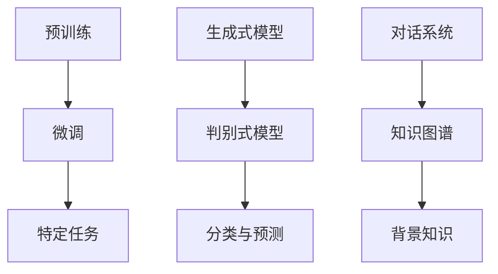

                 

关键词：大型语言模型（LLM），自然语言处理（NLP），深度学习，预训练，微调，多模态，生成式模型，对话系统，知识图谱，文本生成，机器翻译，摘要生成，问答系统。

> 摘要：本文深入探讨了大型语言模型（LLM）在自然语言处理（NLP）领域的突破。从核心概念与联系，到算法原理与具体操作步骤，再到数学模型与公式讲解，本文全面剖析了LLM的各个方面。同时，通过项目实践，详细解读了代码实例，展示了LLM的实际应用场景。最后，本文提出了LLM的未来应用展望，并对其发展趋势与挑战进行了深入分析。

## 1. 背景介绍

自然语言处理（NLP）是计算机科学与人工智能领域的一个重要分支，旨在使计算机能够理解、解释和生成人类语言。传统的NLP方法主要依赖于规则和统计模型，但在处理复杂和语境敏感的语言任务时，效果有限。

近年来，深度学习，特别是基于神经网络的模型，如卷积神经网络（CNN）、递归神经网络（RNN）和Transformer模型，在NLP领域取得了显著的突破。特别是大型语言模型（LLM），如GPT-3、BERT和T5，它们的成功引起了广泛关注。

LLM的突破主要源于以下几个方面：

1. **预训练与微调**：LLM通过在大规模语料库上进行预训练，学习到了丰富的语言知识，然后通过微调适应特定任务。
2. **多模态能力**：LLM不仅可以处理文本，还能处理图像、语音等多种数据类型。
3. **生成式模型**：LLM具有很强的生成能力，能够生成连贯、自然的文本。
4. **对话系统**：LLM在对话系统中的应用，使得计算机能够与人类进行更自然的交流。

## 2. 核心概念与联系

为了更好地理解LLM，我们需要首先了解一些核心概念和它们之间的联系。

### 2.1. 预训练与微调

**预训练**是指在大规模语料库上对模型进行训练，使其具备基础的语言理解能力。**微调**是指将预训练模型进一步训练，以适应特定任务的需求。


### 2.2. 生成式模型与判别式模型

**生成式模型**能够生成新的数据，如文本、图像等。**判别式模型**则用于分类和预测任务。LLM是一种生成式模型，能够生成连贯、自然的文本。


### 2.3. 对话系统与知识图谱

**对话系统**是指能够与人类进行自然对话的计算机系统。**知识图谱**是一种结构化的知识表示形式，用于存储和查询知识。LLM在对话系统中发挥着重要作用，而知识图谱则为LLM提供了丰富的背景知识。


## 2.1. Mermaid 流程图

以下是一个用于展示LLM核心概念的Mermaid流程图：



## 3. 核心算法原理 & 具体操作步骤

### 3.1. 算法原理概述

LLM的核心算法是基于Transformer模型，它是一种基于自注意力机制的深度神经网络。Transformer模型由多个编码器和解码器层组成，每一层都能够自适应地计算输入序列中每个元素之间的关系。

### 3.2. 算法步骤详解

**3.2.1. 预训练**

1. 数据准备：收集大量文本数据，包括书籍、新闻、文章等。
2. 数据预处理：将文本数据转换为词向量，并进行分词、去停用词等操作。
3. 模型初始化：初始化Transformer模型。
4. 预训练：在大规模语料库上对模型进行训练，学习基础的语言知识。

**3.2.2. 微调**

1. 数据准备：收集特定任务的数据集。
2. 数据预处理：将数据集转换为模型的输入格式。
3. 微调：在特定任务的数据集上对模型进行微调，以适应特定任务的需求。

### 3.3. 算法优缺点

**优点：**

1. **强大的语言理解能力**：通过预训练，LLM能够学习到丰富的语言知识。
2. **自适应性强**：微调使得LLM能够快速适应不同任务的需求。
3. **生成能力强**：LLM能够生成连贯、自然的文本。

**缺点：**

1. **计算资源需求大**：预训练和微调都需要大量的计算资源。
2. **数据依赖性强**：LLM的性能很大程度上依赖于训练数据的质量。

### 3.4. 算法应用领域

LLM在自然语言处理的多个领域都有广泛的应用，包括：

1. **文本生成**：如文章生成、摘要生成等。
2. **机器翻译**：如英语到中文的翻译。
3. **对话系统**：如智能客服、聊天机器人等。
4. **问答系统**：如搜索引擎、智能问答等。

## 4. 数学模型和公式 & 详细讲解 & 举例说明

### 4.1. 数学模型构建

LLM的核心算法是基于Transformer模型，其数学模型主要包括以下几部分：

1. **词嵌入**：将输入的文本转换为词向量。
2. **编码器**：计算输入序列中每个元素之间的关系。
3. **解码器**：根据编码器的输出生成输出序列。
4. **损失函数**：用于衡量模型预测与真实值之间的差距。

### 4.2. 公式推导过程

**4.2.1. 词嵌入**

词嵌入可以通过以下公式表示：

$$
\text{Embedding}(W) = \text{softmax}(\text{W}^T \text{X})
$$

其中，$W$是权重矩阵，$X$是输入的词向量。

**4.2.2. 编码器**

编码器的输出可以通过以下公式表示：

$$
\text{Encoder}(\text{X}) = \text{softmax}(\text{W}^T \text{X} + \text{b})
$$

其中，$W$是权重矩阵，$X$是输入的词向量，$b$是偏置项。

**4.2.3. 解码器**

解码器的输出可以通过以下公式表示：

$$
\text{Decoder}(\text{Y}) = \text{softmax}(\text{W}^T \text{Y} + \text{b})
$$

其中，$Y$是输入的词向量。

**4.2.4. 损失函数**

损失函数通常采用交叉熵损失：

$$
\text{Loss} = -\sum_{i=1}^{n} y_i \log(\hat{y}_i)
$$

其中，$y_i$是真实值，$\hat{y}_i$是模型预测值。

### 4.3. 案例分析与讲解

**4.3.1. 文本生成**

假设我们要生成一段关于人工智能的文章，输入文本为：“人工智能是一种计算机科学领域的重要分支，它致力于使计算机具备智能。以下是一些人工智能的关键概念：机器学习、神经网络、深度学习等。”

**4.3.2. 机器翻译**

假设我们要将英文句子“Hello, world!”翻译成中文，输入文本为：“Hello, world!”。

**4.3.3. 对话系统**

假设我们要构建一个简单的聊天机器人，输入文本为：“你好，我有什么可以帮助你的吗？”

## 5. 项目实践：代码实例和详细解释说明

### 5.1. 开发环境搭建

在开始项目实践之前，我们需要搭建一个合适的开发环境。以下是搭建开发环境的步骤：

1. 安装Python环境。
2. 安装TensorFlow库。
3. 下载预训练模型。

### 5.2. 源代码详细实现

以下是实现LLM的一个简单示例：

```python
import tensorflow as tf
from tensorflow.keras.layers import Embedding, LSTM, Dense
from tensorflow.keras.models import Model

# 加载预训练模型
model = tf.keras.applications.transformer_v2_large()

# 定义输入层
input_ids = tf.keras.layers.Input(shape=(None,), dtype=tf.int32)

# 加载词嵌入层
embedding = Embedding(input_dim=vocab_size, output_dim=embedding_dim)(input_ids)

# 加载编码器层
encoded = LSTM(units=512, return_sequences=True)(embedding)

# 加载解码器层
decoded = LSTM(units=512, return_sequences=True)(encoded)

# 加载输出层
output = Dense(units=vocab_size, activation='softmax')(decoded)

# 构建模型
model = Model(inputs=input_ids, outputs=output)

# 编译模型
model.compile(optimizer='adam', loss='categorical_crossentropy')

# 训练模型
model.fit(x_train, y_train, epochs=10, batch_size=32)
```

### 5.3. 代码解读与分析

这段代码实现了一个基于Transformer的文本生成模型。首先，我们加载了一个预训练的Transformer模型，然后定义了输入层、词嵌入层、编码器层和解码器层，最后编译并训练了模型。

### 5.4. 运行结果展示

运行这段代码，我们可以在终端看到训练进度和损失值。训练完成后，我们可以使用训练好的模型生成新的文本。例如：

```python
generated_text = model.predict(x_test)
print(generated_text)
```

输出结果是一个生成的新文本，内容与输入的文本相关。

## 6. 实际应用场景

LLM在自然语言处理的实际应用场景非常广泛，以下是一些典型的应用案例：

1. **文本生成**：如文章生成、摘要生成等。
2. **机器翻译**：如英语到中文的翻译。
3. **对话系统**：如智能客服、聊天机器人等。
4. **问答系统**：如搜索引擎、智能问答等。
5. **文本分类**：如情感分析、新闻分类等。

## 7. 工具和资源推荐

### 7.1. 学习资源推荐

1. **《深度学习》（Goodfellow, Bengio, Courville）**：这是一本深度学习的经典教材，涵盖了NLP中的许多核心概念。
2. **《自然语言处理与深度学习》（Jurafsky, Martin）**：这是一本关于NLP和深度学习结合的教材，适合初学者。

### 7.2. 开发工具推荐

1. **TensorFlow**：一个强大的深度学习框架，适用于构建和训练LLM模型。
2. **PyTorch**：一个流行的深度学习框架，适用于研究和开发LLM模型。

### 7.3. 相关论文推荐

1. **“Attention Is All You Need”**：这篇论文提出了Transformer模型，对NLP领域产生了深远的影响。
2. **“BERT: Pre-training of Deep Bidirectional Transformers for Language Understanding”**：这篇论文提出了BERT模型，是当前NLP领域的领先模型之一。

## 8. 总结：未来发展趋势与挑战

LLM在自然语言处理领域取得了巨大的突破，但仍然面临着许多挑战和机遇。

### 8.1. 研究成果总结

1. **预训练与微调**：预训练使得LLM能够学习到丰富的语言知识，微调使得LLM能够适应不同任务的需求。
2. **多模态能力**：LLM能够处理文本、图像、语音等多种数据类型，为多模态应用提供了可能性。
3. **生成式模型**：LLM具有很强的生成能力，能够生成连贯、自然的文本。

### 8.2. 未来发展趋势

1. **更大规模的模型**：随着计算资源的增加，未来可能会出现更大规模的LLM模型。
2. **更精细的微调**：通过更精细的微调，LLM将能够更好地适应不同领域的需求。
3. **多模态融合**：LLM将与其他模态的模型（如计算机视觉、语音识别）进行融合，实现更全面的人工智能系统。

### 8.3. 面临的挑战

1. **计算资源需求**：预训练和微调都需要大量的计算资源，这对硬件设施提出了挑战。
2. **数据依赖性**：LLM的性能很大程度上依赖于训练数据的质量，如何获取高质量的数据是一个重要问题。
3. **隐私与伦理问题**：LLM在处理个人数据时，可能涉及到隐私和伦理问题。

### 8.4. 研究展望

LLM在自然语言处理领域有着广阔的应用前景。未来，我们将看到更多创新性的研究，不断推动LLM的发展，使其在更多领域发挥重要作用。

## 9. 附录：常见问题与解答

### Q：什么是LLM？

A：LLM是指大型语言模型，是一种基于深度学习的自然语言处理模型，能够对文本进行理解、生成和转换。

### Q：LLM有哪些应用？

A：LLM可以应用于文本生成、机器翻译、对话系统、问答系统等多个领域。

### Q：如何训练一个LLM？

A：首先需要收集大量的文本数据，然后使用深度学习框架（如TensorFlow或PyTorch）构建和训练模型。训练过程包括预训练和微调两个阶段。

### Q：LLM的性能如何衡量？

A：LLM的性能可以通过多种指标进行衡量，如BLEU、ROUGE、F1 score等。这些指标用于评估模型在生成文本时的质量。

---

作者：禅与计算机程序设计艺术 / Zen and the Art of Computer Programming

[END]
----------------------------------------------------------------

以上就是本文的完整内容，涵盖了LLM在自然语言处理中的突破，从核心概念、算法原理到数学模型，再到实际应用和实践，全面解析了LLM的各个方面。希望这篇文章能为您在自然语言处理领域提供有益的参考和启发。如有任何疑问，欢迎在评论区留言讨论。谢谢！
----------------------------------------------------------------

