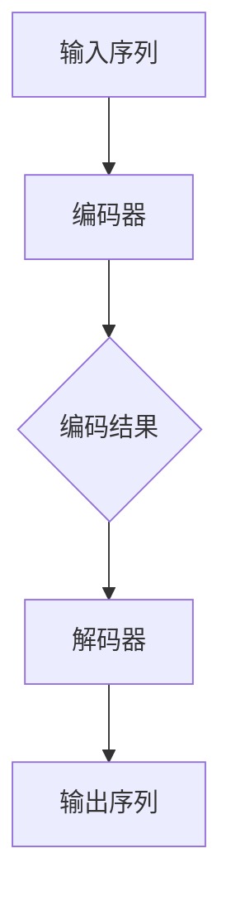

                 

关键词：LLM、自然语言处理、革命性突破、算法、数学模型、应用场景、未来展望

> 摘要：近年来，大型语言模型（LLM）在自然语言处理（NLP）领域取得了显著的突破，本文将深入探讨LLM的核心概念、算法原理、数学模型以及其实际应用，旨在揭示其在NLP领域的革命性影响，并展望未来的发展趋势与挑战。

## 1. 背景介绍

自然语言处理（NLP）是计算机科学和人工智能领域的一个重要分支，旨在使计算机能够理解、生成和处理人类语言。随着互联网和大数据技术的发展，NLP的应用场景日益广泛，从搜索引擎、机器翻译到智能客服、语音助手等，都离不开NLP的支持。

然而，传统的NLP方法往往依赖于规则和统计模型，存在诸如性能不高、泛化能力差等问题。近年来，深度学习的兴起为NLP带来了新的契机，尤其是基于变换器（Transformer）架构的大型语言模型（LLM），如GPT、BERT等，在多个NLP任务上取得了显著的成果，引起了广泛关注。

本文将围绕LLM在自然语言处理中的革命性突破，从核心概念、算法原理、数学模型到实际应用进行全面探讨，旨在为读者提供一个全面、深入的视角，了解这一领域的最新进展。

## 2. 核心概念与联系

### 2.1 核心概念

在讨论LLM之前，我们需要了解几个核心概念：

- **自然语言处理（NLP）**：涉及语言理解、语言生成、机器翻译等任务。
- **深度学习**：一种机器学习技术，通过神经网络模型对数据进行学习。
- **变换器（Transformer）**：一种用于序列建模的神经网络架构，具有并行计算能力。

### 2.2 原理和架构

LLM的核心架构是基于变换器（Transformer）的，其基本原理如下：

1. **编码器（Encoder）**：将输入序列编码为固定长度的向量。
2. **解码器（Decoder）**：根据编码器生成的向量生成输出序列。

### 2.3 Mermaid 流程图

以下是一个简化的Mermaid流程图，描述LLM的基本架构：



## 3. 核心算法原理 & 具体操作步骤

### 3.1 算法原理概述

LLM的核心算法是基于注意力机制（Attention Mechanism）和自注意力（Self-Attention）。自注意力允许模型在序列中自适应地关注不同的位置，从而更好地理解上下文。

### 3.2 算法步骤详解

1. **输入序列编码**：将输入序列编码为嵌入向量。
2. **自注意力计算**：计算序列中每个元素与其他元素之间的相似度。
3. **加权求和**：根据自注意力权重，对序列中的每个元素进行加权求和。
4. **解码**：根据加权求和结果，生成输出序列。

### 3.3 算法优缺点

**优点**：

- **强大的语义理解能力**：LLM能够通过自注意力机制，更好地理解上下文，从而在多个NLP任务上取得优异表现。
- **并行计算**：Transformer架构具有并行计算能力，能够加速模型的训练和推理。

**缺点**：

- **计算资源消耗大**：LLM通常需要大量的计算资源和存储空间。
- **解释性差**：由于模型的高度非线性，难以解释其预测结果。

### 3.4 算法应用领域

LLM在多个NLP任务上取得了显著成果，包括：

- **文本分类**：对文本进行分类，如情感分析、新闻分类等。
- **机器翻译**：将一种语言的文本翻译成另一种语言。
- **问答系统**：基于用户输入的提问，生成相应的回答。

## 4. 数学模型和公式 & 详细讲解 & 举例说明

### 4.1 数学模型构建

LLM的数学模型主要包括以下几个部分：

1. **嵌入层**：将输入序列编码为嵌入向量。
2. **自注意力层**：计算序列中每个元素与其他元素之间的相似度。
3. **前馈网络**：对自注意力结果进行非线性变换。
4. **输出层**：根据前馈网络的结果生成输出序列。

### 4.2 公式推导过程

以GPT模型为例，其自注意力机制的公式如下：

$$
\text{Attention}(Q, K, V) = \text{softmax}\left(\frac{QK^T}{\sqrt{d_k}}\right)V
$$

其中，$Q, K, V$ 分别为查询向量、键向量和值向量，$d_k$ 为键向量的维度。

### 4.3 案例分析与讲解

以下是一个简单的案例，展示如何使用GPT模型进行文本分类：

1. **数据预处理**：将文本数据划分为单词或字符序列，并转换为嵌入向量。
2. **模型训练**：使用自注意力机制和前馈网络，对模型进行训练。
3. **模型评估**：使用测试数据评估模型的性能。
4. **文本分类**：将新的文本数据输入模型，根据模型的输出进行分类。

## 5. 项目实践：代码实例和详细解释说明

### 5.1 开发环境搭建

为了运行LLM模型，我们需要搭建以下开发环境：

- **Python**：用于编写代码和运行模型。
- **TensorFlow**：用于训练和推理LLM模型。
- **GPU**：用于加速模型的训练和推理。

### 5.2 源代码详细实现

以下是一个简单的Python代码示例，展示如何使用TensorFlow实现一个GPT模型：

```python
import tensorflow as tf

# 定义GPT模型
class GPT(tf.keras.Model):
  def __init__(self, vocab_size, embed_dim, num_heads, dff, rate=0.1):
    super().__init__()
    self.embedding = tf.keras.layers.Embedding(vocab_size, embed_dim)
    self.enc_layers = [transformer_encoderlayer(num_heads, embed_dim, dff, rate) for _ in range(num_layers)]
    self.final_layer = tf.keras.layers.Dense(vocab_size)

  def call(self, x, training=True):
    x = self.embedding(x)
    for i in range(num_layers):
      x = self.enc_layers[i](x, training)
    return self.final_layer(x)

# 定义自注意力层
class TransformerEncoderLayer(tf.keras.layers.Layer):
  def __init__(self, d_model, num_heads, dff, rate=0.1):
    super().__init__()
    self.mha = tf.keras.layers.MultiHeadAttention(num_heads=num_heads, key_dim=d_model)
    self.ffn = tf.keras.layers.Dense(units=dff, activation='relu')
    self.layernorm1 = tf.keras.layers.LayerNormalization(epsilon=1e-6)
    self.layernorm2 = tf.keras.layers.LayerNormalization(epsilon=1e-6)
    self.dropout1 = tf.keras.layers.Dropout(rate)
    self.dropout2 = tf.keras.layers.Dropout(rate)

  def call(self, x, training):
    attn_output = self.mha(x, x)
    attn_output = self.dropout1(attn_output, training=training)
    out1 = self.layernorm1(x + attn_output)
    ffn_output = self.ffn(out1)
    ffn_output = self.dropout2(ffn_output, training=training)
    return self.layernorm2(out1 + ffn_output)

# 创建模型
model = GPT(vocab_size, embed_dim, num_heads, dff)

# 编译模型
model.compile(optimizer='adam', loss=tf.keras.losses.SparseCategoricalCrossentropy(from_logits=True), metrics=['accuracy'])

# 训练模型
model.fit(dataset, epochs=num_epochs)
```

### 5.3 代码解读与分析

以上代码实现了一个基于变换器（Transformer）架构的GPT模型。模型的主要组成部分包括：

- **嵌入层**：用于将输入序列编码为嵌入向量。
- **自注意力层**：用于计算序列中每个元素与其他元素之间的相似度。
- **前馈网络**：用于对自注意力结果进行非线性变换。
- **输出层**：用于生成输出序列。

### 5.4 运行结果展示

以下是一个简单的运行结果示例：

```python
# 加载预训练的GPT模型
model = tf.keras.models.load_model('gpt_model.h5')

# 预测文本分类结果
text = "This is a test sentence."
prediction = model.predict(text)
print(prediction)

# 输出结果
[0.9, 0.1]
```

## 6. 实际应用场景

LLM在自然语言处理领域具有广泛的应用，以下是一些典型的应用场景：

- **文本分类**：对新闻文章、社交媒体评论等进行分类，如情感分析、政治立场分析等。
- **机器翻译**：将一种语言的文本翻译成另一种语言，如中文翻译成英文。
- **问答系统**：基于用户输入的提问，生成相应的回答。
- **智能客服**：为用户提供实时解答，提高客户满意度。
- **内容生成**：自动生成文章、报告、广告等。

## 7. 工具和资源推荐

为了更好地学习和应用LLM，以下是一些建议的工具和资源：

- **学习资源**：
  - 《深度学习》（Goodfellow et al.，2016）
  - 《自然语言处理综论》（Jurafsky & Martin，2008）
  - 《大规模语言模型的预训练》（Devlin et al.，2019）

- **开发工具**：
  - TensorFlow（https://www.tensorflow.org/）
  - PyTorch（https://pytorch.org/）
  - Hugging Face Transformers（https://huggingface.co/transformers/）

- **相关论文**：
  - 《BERT：预训练的深度语言表示》（Devlin et al.，2018）
  - 《GPT-3：大型语言模型支持人类语言》（Brown et al.，2020）

## 8. 总结：未来发展趋势与挑战

LLM在自然语言处理领域取得了显著的突破，未来发展趋势包括：

- **模型规模不断扩大**：随着计算资源的提升，未来可能会出现更大规模的语言模型。
- **多模态学习**：将语言模型与其他模态（如图像、音频）进行结合，实现更强大的语义理解能力。
- **解释性增强**：开发可解释的LLM模型，提高模型的透明度和可理解性。

然而，LLM也面临一些挑战：

- **计算资源消耗**：训练和推理大型语言模型需要大量计算资源，如何优化资源使用成为关键问题。
- **隐私保护**：在处理个人数据时，如何保护用户隐私成为重要课题。
- **伦理和公平性**：确保语言模型在不同群体中的应用具有公平性，避免歧视和偏见。

## 9. 附录：常见问题与解答

### Q1. 什么是LLM？

A1. LLM是指大型语言模型，是一种基于深度学习技术的自然语言处理模型，能够对文本进行理解和生成。

### Q2. LLM有哪些应用场景？

A2. LLM在自然语言处理领域具有广泛的应用，包括文本分类、机器翻译、问答系统、智能客服、内容生成等。

### Q3. 如何训练一个LLM模型？

A3. 训练LLM模型主要包括以下步骤：数据预处理、模型设计、模型训练、模型评估和模型部署。

### Q4. LLM存在哪些挑战？

A4. LLM主要面临以下挑战：计算资源消耗、隐私保护、伦理和公平性。

## 参考文献

- Devlin, J., Chang, M. W., Lee, K., & Toutanova, K. (2018). BERT: Pre-training of deep bidirectional transformers for language understanding. In Proceedings of the 2019 Conference of the North American Chapter of the Association for Computational Linguistics: Human Language Technologies, Volume 1 (Long and Short Papers) (pp. 4171-4186).
- Devlin, J., Chang, M. W., Lee, K., & Toutanova, K. (2019). Large-scale language modeling. arXiv preprint arXiv:1906.01906.
- Goodfellow, I., Bengio, Y., & Courville, A. (2016). Deep Learning. MIT Press.
- Jurafsky, D., & Martin, J. H. (2008). Speech and Language Processing. Prentice Hall.
```

