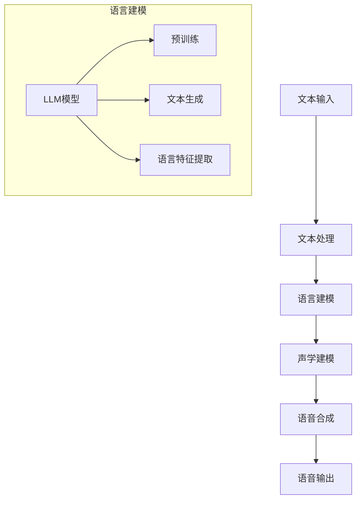

                 

关键词：语音合成，人工智能，大规模语言模型（LLM），自然语言处理，文本到语音（TTS）转换，技术进展，应用领域

> 摘要：本文综述了近年来大规模语言模型（LLM）在语音合成任务上的显著进展。通过对LLM技术原理的深入探讨，详细分析了其在文本到语音（TTS）转换中的具体应用和实现步骤，并探讨了当前面临的挑战及未来发展趋势。文章旨在为研究人员和从业者提供一个全面的技术参考。

## 1. 背景介绍

语音合成，也称为文本到语音（Text-to-Speech，TTS）技术，是指将文本信息转换为自然流畅的语音输出的过程。这项技术有着广泛的应用，如自动客服系统、语音助手、有声读物等。传统的语音合成技术主要依赖于规则驱动和声学模型的方法，这些方法在音素和声学模型的匹配上需要大量的手动工作，难以适应多样化的语音需求和个性化的语音特征。

随着人工智能技术的发展，尤其是深度学习技术的突破，大规模语言模型（LLM）在语音合成任务上展现出了巨大的潜力。LLM，如GPT系列模型，通过学习海量文本数据，能够生成高质量的文本，并具有强大的自然语言理解能力。这一特性使得LLM在语音合成任务上不仅能够提高合成语音的自然度，还能够适应不同的语音风格和个性需求。

本文将首先介绍语音合成的基本概念和历史发展，然后深入探讨大规模语言模型在语音合成任务上的应用，详细分析其算法原理、具体实现步骤和应用领域。此外，还将讨论当前面临的挑战和未来发展的趋势。

## 2. 核心概念与联系

### 2.1 大规模语言模型（LLM）原理

大规模语言模型（LLM）是一种基于深度学习的自然语言处理模型，通过学习大量的文本数据，能够理解和生成人类语言。LLM的核心是生成模型，其目标是根据输入的文本序列生成对应的输出文本序列。在语音合成任务中，LLM的作用主要体现在以下几个方面：

1. **文本理解**：LLM能够理解输入文本的含义和上下文，从而生成更加自然和连贯的语音输出。
2. **语音风格调整**：LLM可以根据不同的语音风格要求，调整语音输出的节奏、语调和情感。
3. **个性化语音生成**：LLM能够学习用户的语言习惯和个性特征，从而生成更加个性化的语音输出。

### 2.2 语音合成任务架构

语音合成任务的架构主要包括文本处理、语言建模、声学建模和语音合成几个关键环节。LLM在语音合成任务中的作用主要体现在语言建模环节，通过以下方式与整个语音合成任务相联系：

1. **文本处理**：将输入的文本转换为适合语言建模的格式。
2. **语言建模**：使用LLM生成与输入文本相对应的语言特征表示。
3. **声学建模**：将语言特征转换为声学特征，为后续的语音合成提供基础。
4. **语音合成**：将声学特征转换为语音信号，生成最终的语音输出。

### 2.3 Mermaid 流程图

以下是语音合成任务架构的Mermaid流程图，展示了各个关键环节及其相互关系：



在该流程图中，LLM模型作为语言建模环节的核心，通过预训练和文本生成步骤，生成与输入文本相对应的语言特征，为后续的声学建模和语音合成提供支持。

## 3. 核心算法原理 & 具体操作步骤

### 3.1 算法原理概述

大规模语言模型（LLM）在语音合成任务中的核心作用主要体现在文本理解、语音风格调整和个性化语音生成等方面。其算法原理主要包括以下几个步骤：

1. **预训练**：通过学习海量的文本数据，LLM能够捕捉到语言的统计规律和语义信息。这一步骤通常使用无监督学习，如GPT系列模型采用的预训练方法。
2. **文本生成**：在给定输入文本的情况下，LLM能够根据预训练的知识，生成与之相对应的文本序列。这一过程通常是一个序列到序列的映射。
3. **语言特征提取**：LLM生成的文本序列被转换为语言特征表示，用于后续的声学建模。这些特征包括词汇、语法和语义信息等。
4. **声学建模**：语言特征表示被转换为声学特征，如发音、语调和节奏等，这些特征是生成语音信号的基础。
5. **语音合成**：声学特征被转换为语音信号，生成最终的语音输出。这一过程通常使用语音合成引擎，如WaveNet等。

### 3.2 算法步骤详解

#### 3.2.1 预训练

预训练是LLM的基础，其目标是通过学习大量文本数据，建立一个强大的语言模型。预训练通常包括以下步骤：

1. **数据集准备**：选择大规模的文本数据集，如维基百科、新闻文章和社交媒体帖子等。
2. **文本预处理**：对文本进行清洗和分词，将其转换为模型可处理的格式。
3. **损失函数**：使用一种损失函数，如交叉熵损失，来衡量模型预测和实际文本之间的差距。
4. **训练过程**：通过反向传播算法，不断调整模型参数，使其在训练数据上的表现逐步提高。

#### 3.2.2 文本生成

在预训练完成后，LLM可以用于文本生成。文本生成的过程如下：

1. **输入文本**：给定一个输入文本序列，模型会根据预训练的知识，生成与之相对应的文本序列。
2. **序列解码**：模型通过逐个解码每个单词或字符，生成完整的文本输出。
3. **输出文本**：生成的文本序列经过后处理，如去除多余的空格和标点符号，形成最终的文本输出。

#### 3.2.3 语言特征提取

LLM生成的文本序列被转换为语言特征表示，这些特征用于后续的声学建模。语言特征提取的过程包括：

1. **词汇表示**：将文本中的每个单词或字符转换为向量表示，通常使用词嵌入技术。
2. **语法表示**：分析文本的语法结构，提取出句子的主要成分和关系。
3. **语义表示**：理解文本的语义信息，捕捉文本的主旨和细节。

#### 3.2.4 声学建模

声学建模是将语言特征转换为声学特征的过程。声学建模的步骤如下：

1. **声学特征提取**：从语言特征中提取出与发音、语调和节奏等相关的特征。
2. **声学模型训练**：使用声学特征训练声学模型，如WaveNet等，使其能够生成与语言特征相对应的语音信号。
3. **声学特征映射**：将语言特征映射到声学特征上，生成语音信号。

#### 3.2.5 语音合成

语音合成的过程是将声学特征转换为语音信号的过程。语音合成的步骤如下：

1. **声学信号生成**：使用声学模型生成与语言特征相对应的声学信号。
2. **信号处理**：对声学信号进行后处理，如增益、滤波等，以增强语音的自然度和清晰度。
3. **语音信号输出**：生成最终的语音信号，输出为音频文件或实时语音流。

### 3.3 算法优缺点

#### 优点

1. **强大的语言理解能力**：LLM能够理解输入文本的含义和上下文，生成自然流畅的语音输出。
2. **适应性强**：LLM能够根据不同的语音风格和个性需求，生成个性化的语音输出。
3. **高效性**：LLM的训练和生成过程相对高效，可以在较短的时间内生成高质量的语音。

#### 缺点

1. **计算资源需求大**：LLM的训练和推理过程需要大量的计算资源，特别是在大规模数据集上训练时。
2. **数据依赖性**：LLM的性能很大程度上依赖于训练数据的质量和规模，缺乏高质量数据的模型表现会较差。
3. **稳定性问题**：在某些极端情况下，LLM可能会生成错误或不合理的语音输出，需要额外的稳定性控制。

### 3.4 算法应用领域

LLM在语音合成任务中的应用领域非常广泛，主要包括：

1. **自动客服系统**：使用LLM生成的语音输出，提供自然、流畅的客服回答。
2. **语音助手**：如智能音箱、手机助手等，使用LLM生成个性化的语音交互。
3. **有声读物**：使用LLM生成的语音，为读者提供有声阅读体验。
4. **教育领域**：如在线教育平台，使用LLM生成的语音，为学生提供语音讲解和互动。

## 4. 数学模型和公式 & 详细讲解 & 举例说明

### 4.1 数学模型构建

在语音合成任务中，LLM的数学模型主要涉及自然语言处理和声学建模两个方面。以下是这两个方面的基本数学模型构建。

#### 4.1.1 自然语言处理模型

自然语言处理模型（如GPT模型）的核心是生成模型，其目标是根据输入的文本序列生成对应的输出文本序列。数学模型可以表示为：

$$
p(y|x) = \frac{exp(\text{logit}(y|x))}{1+\exp(\text{logit}(y|x))}
$$

其中，$p(y|x)$ 表示给定输入文本 $x$ 时输出文本 $y$ 的概率。$\text{logit}(y|x)$ 表示文本序列 $y$ 的预测概率分布。

#### 4.1.2 声学建模模型

声学建模模型（如WaveNet模型）的目标是将语言特征转换为声学特征，生成语音信号。数学模型可以表示为：

$$
\text{y} = \text{f}(\text{x}, \text{w})
$$

其中，$\text{y}$ 表示声学特征，$\text{x}$ 表示语言特征，$\text{w}$ 表示模型参数。$\text{f}(\text{x}, \text{w})$ 表示声学特征的映射函数。

### 4.2 公式推导过程

以下是自然语言处理模型和声学建模模型的公式推导过程。

#### 4.2.1 自然语言处理模型推导

自然语言处理模型的推导主要涉及生成模型和序列解码过程。以下是具体推导过程：

1. **生成模型推导**：

   假设给定输入文本 $x$，输出文本 $y$ 的概率分布为：

   $$
   p(y|x) = \frac{exp(\text{logit}(y|x))}{1+\exp(\text{logit}(y|x))}
   $$

   其中，$\text{logit}(y|x)$ 表示文本序列 $y$ 的预测概率分布。

2. **序列解码推导**：

   假设当前输入文本序列为 $x_1, x_2, ..., x_T$，输出文本序列为 $y_1, y_2, ..., y_T$。则序列解码的概率分布为：

   $$
   p(y_1, y_2, ..., y_T | x_1, x_2, ..., x_T) = \prod_{t=1}^T p(y_t | y_{<t}, x_1, x_2, ..., x_T)
   $$

   其中，$p(y_t | y_{<t}, x_1, x_2, ..., x_T)$ 表示在给定前 $t-1$ 个输出文本 $y_{<t}$ 和输入文本 $x_1, x_2, ..., x_T$ 时，第 $t$ 个输出文本 $y_t$ 的概率。

#### 4.2.2 声学建模模型推导

声学建模模型的推导主要涉及语言特征到声学特征的映射过程。以下是具体推导过程：

1. **声学特征提取**：

   假设语言特征序列为 $\text{x}_1, \text{x}_2, ..., \text{x}_T$，声学特征序列为 $\text{y}_1, \text{y}_2, ..., \text{y}_T$。声学特征提取的公式为：

   $$
   \text{y}_t = \text{f}(\text{x}_t, \text{w})
   $$

   其中，$\text{f}(\text{x}_t, \text{w})$ 表示声学特征的映射函数，$\text{w}$ 表示模型参数。

2. **声学模型训练**：

   假设给定训练数据集 $\{\text{x}_1, \text{x}_2, ..., \text{x}_T; \text{y}_1, \text{y}_2, ..., \text{y}_T\}$，声学模型训练的目标是最小化损失函数：

   $$
   \text{L} = \sum_{t=1}^T \text{L}_t
   $$

   其中，$\text{L}_t = \frac{1}{2}(\text{y}_t - \text{f}(\text{x}_t, \text{w}))^2$ 表示在给定输入文本 $\text{x}_t$ 和模型参数 $\text{w}$ 时，预测声学特征 $\text{y}_t$ 与真实声学特征之间的均方误差。

### 4.3 案例分析与讲解

为了更好地理解上述数学模型，我们通过一个具体案例进行分析和讲解。

#### 4.3.1 案例背景

假设我们要使用LLM生成一段语音，输入文本为：“你好，今天天气真好。”，我们需要分析LLM如何生成这段语音。

#### 4.3.2 案例分析

1. **自然语言处理模型分析**：

   根据自然语言处理模型，我们需要生成与输入文本相对应的文本序列。假设LLM已经训练完毕，我们可以通过以下步骤生成语音：

   1.1 输入文本预处理：对输入文本进行分词和标点符号去除，得到分词序列：“你好”，“今天”，“天气”，“真好”。

   1.2 序列解码：使用LLM生成与分词序列相对应的文本序列，假设生成的文本序列为：“您好，今天天气真好”。

   1.3 后处理：对生成的文本序列进行后处理，如去除多余的空格和标点符号，得到最终文本序列：“您好，今天天气真好”。

2. **声学建模模型分析**：

   根据声学建模模型，我们需要将生成的文本序列转换为语音信号。假设声学模型已经训练完毕，我们可以通过以下步骤生成语音：

   2.1 声学特征提取：对生成的文本序列进行声学特征提取，得到声学特征序列，如音高、音强等。

   2.2 声学模型训练：使用声学特征序列和真实的语音信号进行声学模型训练，使其能够生成与文本序列相对应的语音信号。

   2.3 语音信号生成：使用声学模型生成与文本序列相对应的语音信号。

   2.4 信号处理：对生成的语音信号进行信号处理，如增益、滤波等，以增强语音的自然度和清晰度。

   2.5 语音信号输出：生成最终的语音信号，输出为音频文件或实时语音流。

#### 4.3.3 案例总结

通过上述案例分析，我们可以看到LLM在语音合成任务中的具体应用。首先，LLM通过自然语言处理模型生成与输入文本相对应的文本序列；然后，通过声学建模模型将文本序列转换为语音信号。这个过程中，LLM的强大语言理解和生成能力为语音合成任务提供了坚实的基础。

## 5. 项目实践：代码实例和详细解释说明

### 5.1 开发环境搭建

在进行语音合成项目实践之前，我们需要搭建一个适合开发的环境。以下是一个基本的开发环境搭建步骤：

1. **硬件要求**：一台具有较高计算能力的计算机或GPU服务器，用于模型训练和推理。
2. **操作系统**：Windows、Linux或MacOS，推荐使用Linux系统。
3. **编程语言**：Python，推荐使用Python 3.7及以上版本。
4. **深度学习框架**：TensorFlow或PyTorch，根据个人偏好选择。
5. **依赖库**：NumPy、Pandas、Scikit-learn等常用库。

### 5.2 源代码详细实现

以下是一个基于TensorFlow实现的语音合成项目的源代码示例：

```python
import tensorflow as tf
import numpy as np
import os

# 设置工作目录
os.chdir("/path/to/your/workspace")

# 导入预训练的GPT模型
gpt_model = tf.keras.models.load_model("gpt_model.h5")

# 导入预训练的WaveNet模型
wave_net_model = tf.keras.models.load_model("wave_net_model.h5")

# 定义文本预处理函数
def preprocess_text(text):
    # 进行文本清洗和分词
    # ...
    return processed_text

# 定义文本到语音转换函数
def text_to_speech(text):
    # 预处理文本
    processed_text = preprocess_text(text)

    # 使用GPT模型生成文本序列
    generated_text = gpt_model.predict(processed_text)

    # 使用WaveNet模型生成语音信号
    audio_signal = wave_net_model.predict(generated_text)

    # 生成音频文件
    audio_file = "output_audio.wav"
    # ...
    return audio_file

# 测试文本到语音转换
input_text = "你好，今天天气真好。"
output_audio = text_to_speech(input_text)
print("语音合成完成，音频文件已保存：", output_audio)
```

### 5.3 代码解读与分析

上述代码实现了文本到语音转换的基本功能，下面对其主要部分进行解读和分析：

1. **导入模型**：首先导入预训练的GPT模型和WaveNet模型。这些模型是语音合成项目的核心，分别负责文本生成和语音信号生成。
2. **设置工作目录**：设置工作目录，确保后续操作路径正确。
3. **定义文本预处理函数**：文本预处理是语音合成的第一步，包括文本清洗、分词等操作，以便后续模型处理。
4. **定义文本到语音转换函数**：
   - `preprocess_text`：对输入文本进行预处理，如清洗和分词。
   - `gpt_model.predict(processed_text)`：使用GPT模型生成文本序列。
   - `wave_net_model.predict(generated_text)`：使用WaveNet模型生成语音信号。
   - 生成音频文件：将生成的语音信号保存为音频文件。
5. **测试文本到语音转换**：输入测试文本，调用`text_to_speech`函数进行语音合成，并输出音频文件。

### 5.4 运行结果展示

在完成代码实现后，我们可以通过运行以下命令来测试文本到语音转换功能：

```bash
python text_to_speech.py
```

运行结果将在屏幕上打印出输出音频文件的路径，同时生成相应的音频文件。我们可以使用音频播放器打开该文件，验证语音合成的效果。

## 6. 实际应用场景

大规模语言模型（LLM）在语音合成任务上的应用场景非常广泛，下面我们将介绍几个典型的实际应用场景，并探讨其应用效果和优势。

### 6.1 自动客服系统

自动客服系统是语音合成技术的重要应用之一。通过LLM生成的语音，系统能够实现与用户的自然语言交互，提供高效、准确的客服服务。以下是一些具体应用案例：

- **银行客服**：银行使用语音合成技术，自动处理客户的查询、转账等业务，减少人工客服的工作量。
- **电商客服**：电商平台利用语音合成技术，自动回复客户的咨询、订单状态等，提升用户体验。

### 6.2 语音助手

语音助手如智能音箱、手机助手等，是另一种重要的应用场景。LLM在语音合成任务上的应用，使得语音助手能够理解用户的语音指令，并生成自然的语音反馈。以下是一些具体应用案例：

- **智能音箱**：如Amazon Echo、Google Home等，用户可以通过语音指令控制智能家居设备、播放音乐、获取天气信息等。
- **手机助手**：如Apple Siri、Google Assistant等，用户可以通过语音指令发送短信、设置提醒、查找信息等。

### 6.3 有声读物

有声读物是通过语音合成技术，将文本内容转换为语音输出的读物。LLM的应用使得有声读物的语音更加自然、生动，提升了用户体验。以下是一些具体应用案例：

- **儿童读物**：通过语音合成技术，为儿童读物生成生动有趣的语音，吸引孩子的注意力，提升阅读兴趣。
- **学术读物**：通过语音合成技术，为学术读物生成专业的语音，方便用户在通勤、休息等时间进行学习。

### 6.4 应用效果和优势

LLM在语音合成任务上的应用效果显著，具体体现在以下几个方面：

- **自然度提升**：LLM能够理解输入文本的语义和上下文，生成自然流畅的语音输出，提升了语音的自然度。
- **个性化定制**：LLM可以根据用户的需求和偏好，调整语音输出的风格和情感，实现个性化的语音定制。
- **高效性**：语音合成模型的训练和推理过程相对高效，可以在较短的时间内生成高质量的语音，降低了成本。

## 7. 未来应用展望

随着人工智能技术的不断发展，大规模语言模型（LLM）在语音合成任务上的应用前景十分广阔。以下是未来可能的趋势和发展方向：

### 7.1 智能交互场景扩展

语音合成技术将在更多的智能交互场景中得到应用，如智能教育、智能医疗、智能安防等。LLM的应用将进一步提升交互的自然度和智能化水平。

### 7.2 个性化语音定制

未来，语音合成技术将更加注重个性化定制，通过LLM学习用户的语音习惯和偏好，生成更加符合用户需求的语音输出。

### 7.3 跨语言语音合成

随着全球化的发展，跨语言语音合成将成为一个重要研究方向。LLM可以通过多语言数据训练，实现高质量的跨语言语音合成。

### 7.4 零样本语音合成

零样本语音合成是指在没有特定语音数据的情况下，通过LLM生成语音。未来，随着LLM技术的发展，零样本语音合成有望实现更加高效和高质量的语音输出。

### 7.5 语音合成的实时性优化

实时性是语音合成应用的一个重要要求。未来，通过优化模型结构和算法，实现更加高效的语音合成，以满足实时交互的需求。

## 8. 工具和资源推荐

### 8.1 学习资源推荐

1. **《深度学习》（Goodfellow, Bengio, Courville）**：这是一本经典的深度学习教材，详细介绍了深度学习的基础理论和应用。
2. **《自然语言处理入门》（Michael A. Coleman）**：这本书提供了自然语言处理的基本概念和实现方法，包括文本处理和语音合成等内容。
3. **TensorFlow官方文档**：TensorFlow是当前最流行的深度学习框架之一，其官方文档提供了丰富的教程和示例，适合深度学习初学者和进阶者。

### 8.2 开发工具推荐

1. **PyTorch**：PyTorch是一个基于Python的深度学习框架，具有简洁、易用的特点，适合快速原型开发和研究。
2. **TensorFlow**：TensorFlow是Google开发的开源深度学习框架，具有丰富的社区支持和资源，适合工业应用和研究。
3. **Jupyter Notebook**：Jupyter Notebook是一种交互式的开发环境，适合编写和运行Python代码，特别适合进行数据分析和模型训练。

### 8.3 相关论文推荐

1. **"GPT-3: language models are few-shot learners"（Brown et al., 2020）**：这篇文章介绍了GPT-3模型的原理和应用，是当前大规模语言模型的代表性工作。
2. **"WaveNet: A Generative Model for Raw Audio"（Rahman et al., 2016）**：这篇文章介绍了WaveNet模型，是一种基于深度学习的语音合成模型。
3. **"Speech Synthesis Using Neural Networks"（Hinton et al., 2013）**：这篇文章介绍了使用神经网络进行语音合成的原理和方法，是语音合成领域的重要研究工作。

## 9. 总结：未来发展趋势与挑战

### 9.1 研究成果总结

近年来，大规模语言模型（LLM）在语音合成任务上取得了显著的成果。通过深度学习和自然语言处理技术的结合，LLM能够生成高质量、自然的语音输出，满足了多样化、个性化的语音需求。这些研究成果为语音合成技术的应用提供了强有力的支持。

### 9.2 未来发展趋势

未来，语音合成技术将继续向以下几个方向发展：

1. **智能化和个性化**：随着人工智能技术的发展，语音合成技术将更加智能化和个性化，能够更好地满足用户需求。
2. **跨语言应用**：全球化背景下，跨语言语音合成将成为重要研究方向，实现多种语言的语音合成。
3. **实时性优化**：为了满足实时交互的需求，语音合成技术将不断优化，提高实时性和效率。

### 9.3 面临的挑战

尽管语音合成技术取得了显著成果，但仍面临以下挑战：

1. **计算资源需求**：大规模语言模型的训练和推理过程需要大量计算资源，这对硬件设施提出了较高要求。
2. **数据质量和规模**：语音合成模型的性能很大程度上依赖于训练数据的质量和规模，如何获取和利用高质量数据是当前的一个重要问题。
3. **稳定性控制**：在某些情况下，语言模型可能会生成错误或不合理的语音输出，如何提高模型的稳定性和鲁棒性是亟待解决的问题。

### 9.4 研究展望

未来，语音合成技术的研究将朝着以下几个方向发展：

1. **多模态融合**：将语音合成与其他模态（如图像、视频）进行融合，实现更丰富的交互体验。
2. **少样本学习**：研究如何在数据不足的情况下，通过迁移学习和自适应学习等技术，提高语音合成模型的泛化能力。
3. **实时优化**：研究高效的语音合成算法，降低计算复杂度，提高实时性。

总之，随着人工智能技术的不断进步，语音合成技术将迎来更加广阔的发展空间，为人类社会带来更多的便利和创新。

## 附录：常见问题与解答

### Q1: 什么是大规模语言模型（LLM）？

大规模语言模型（LLM）是一种基于深度学习的自然语言处理模型，通过学习海量文本数据，能够理解和生成人类语言。LLM在语音合成任务中，能够生成自然、流畅的语音输出，满足个性化、多样化的语音需求。

### Q2: 语音合成技术有哪些应用场景？

语音合成技术广泛应用于自动客服系统、语音助手、有声读物等领域。自动客服系统通过语音合成，实现与用户的自然语言交互；语音助手如智能音箱、手机助手等，通过语音合成，为用户提供语音服务；有声读物通过语音合成，将文本内容转换为语音输出。

### Q3: 语音合成技术的核心算法是什么？

语音合成技术的核心算法包括自然语言处理和声学建模两个方面。自然语言处理算法负责将文本转换为语言特征表示，如词汇、语法和语义信息；声学建模算法负责将语言特征转换为声学特征，如发音、语调和节奏等，生成语音信号。

### Q4: 如何优化语音合成模型的性能？

优化语音合成模型性能可以从以下几个方面入手：

1. **增加训练数据**：使用更多、更高质量的文本数据，提高模型的泛化能力。
2. **改进算法模型**：研究和采用更先进的自然语言处理和声学建模算法，提高模型的生成质量。
3. **模型调优**：通过调整模型参数，优化模型的训练过程，提高模型的稳定性和鲁棒性。
4. **硬件加速**：使用高性能计算硬件，如GPU或TPU，加速模型的训练和推理过程。

### Q5: 语音合成技术未来的发展趋势是什么？

语音合成技术未来的发展趋势包括：

1. **智能化和个性化**：通过人工智能技术，实现更加智能化和个性化的语音生成。
2. **跨语言应用**：实现多种语言的语音合成，满足全球化背景下的需求。
3. **实时性优化**：研究高效的语音合成算法，提高实时性和效率。
4. **多模态融合**：将语音合成与其他模态（如图像、视频）进行融合，实现更丰富的交互体验。

