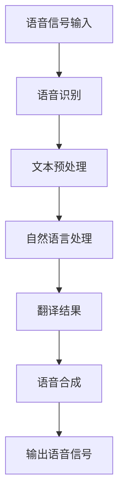

                 

关键词：LLM，语音翻译，自然语言处理，深度学习，模型优化，跨语言语音识别，实时翻译，多模态交互

> 摘要：近年来，基于大型语言模型（LLM）的语音翻译技术取得了显著进展。本文从背景介绍、核心概念与联系、核心算法原理与具体操作步骤、数学模型与公式、项目实践、实际应用场景、未来应用展望、工具和资源推荐、总结与展望等方面，全面探讨了LLM在语音翻译领域的研究热点，旨在为相关研究人员和开发者提供有价值的参考。

## 1. 背景介绍

语音翻译技术是跨语言通信的重要手段，能够实现不同语言之间的实时交流，对于促进全球化和国际交流具有重要意义。传统的语音翻译技术主要依赖于规则驱动和统计方法，存在准确性低、响应速度慢等缺点。随着深度学习技术的发展，基于神经网络的方法逐渐成为研究热点。特别是近年来，大型语言模型（LLM）如GPT、BERT等在自然语言处理领域取得了显著成果，为语音翻译技术提供了新的发展机遇。

## 2. 核心概念与联系

### 2.1 大型语言模型（LLM）

LLM是一种基于深度学习的自然语言处理模型，具有强大的语言理解和生成能力。LLM通常使用大规模语料库进行预训练，从而掌握丰富的语言知识和上下文信息。通过调整模型参数，LLM可以应用于各种自然语言处理任务，如文本分类、机器翻译、语音识别等。

### 2.2 语音翻译

语音翻译是将一种语言的语音信号转换为另一种语言的语音信号的过程。语音翻译技术通常包括语音识别、自然语言处理和语音合成三个环节。语音识别将语音信号转换为文本，自然语言处理对文本进行语义理解和翻译，语音合成将翻译结果转换为语音信号。

### 2.3 Mermaid 流程图

以下是LLM在语音翻译领域的流程图：



## 3. 核心算法原理 & 具体操作步骤

### 3.1 算法原理概述

基于LLM的语音翻译技术主要包括以下步骤：

1. 语音识别：将语音信号转换为文本。
2. 自然语言处理：对文本进行语义理解和翻译。
3. 语音合成：将翻译结果转换为语音信号。

### 3.2 算法步骤详解

1. 语音识别：

   使用深度神经网络（DNN）或循环神经网络（RNN）进行语音信号处理，将语音信号转换为文本。具体步骤如下：

   - 特征提取：对语音信号进行预处理，提取特征向量。
   - 声学模型训练：使用大规模语音数据集训练声学模型，如DNN或RNN。
   - 语言模型训练：使用文本数据集训练语言模型，如n-gram模型。
   - 语音识别：将语音信号输入到训练好的声学模型和语言模型，输出文本。

2. 自然语言处理：

   对文本进行语义理解和翻译。具体步骤如下：

   - 词嵌入：将文本中的词语转换为向量表示。
   - 上下文理解：使用神经网络模型（如Transformer）捕捉文本的上下文信息。
   - 翻译模型训练：使用平行语料库训练翻译模型，如Seq2Seq模型。
   - 翻译：将源语言文本输入到翻译模型，输出目标语言文本。

3. 语音合成：

   将翻译结果转换为语音信号。具体步骤如下：

   - 文本预处理：对翻译结果进行语音合成预处理，如分词、音素划分等。
   - 语音合成模型训练：使用文本和语音数据集训练语音合成模型，如WaveNet。
   - 语音合成：将预处理后的文本输入到语音合成模型，输出语音信号。

### 3.3 算法优缺点

优点：

- 高准确性：基于深度学习的语音识别和自然语言处理模型具有高准确性。
- 快速响应：实时语音翻译技术可以实现快速响应。
- 强泛化能力：LLM具有强大的语言理解和生成能力，可以应对多种语言和场景。

缺点：

- 计算资源消耗大：训练和推理过程需要大量的计算资源。
- 需要大量数据：语音翻译技术的训练和优化需要大量高质量的语音和文本数据。
- 难以应对语音噪声和变体：语音信号中的噪声和语音变体对语音识别和翻译性能有较大影响。

### 3.4 算法应用领域

- 国际会议和商务交流
- 旅游和导航
- 教育和辅助学习
- 跨语言客服和智能助手

## 4. 数学模型和公式 & 详细讲解 & 举例说明

### 4.1 数学模型构建

语音翻译技术涉及多种数学模型，如声学模型、语言模型、翻译模型和语音合成模型。以下是这些模型的数学公式：

- 声学模型：$$P(o_t|x_t) = \frac{e^{o_tT(x_t)}}{\sum_{o'}e^{o'T(x_t)}}$$
- 语言模型：$$P(w_t|w_{t-1},...,w_{1}) = \frac{e^{l(w_t|w_{t-1},...,w_{1})}}{\sum_{w'}e^{l(w_t|w_{t-1},...,w_{1})}}$$
- 翻译模型：$$P(w_t|w_{t-1},...,w_{1},y_{t-1},...,y_{1}) = \frac{e^{l(w_t|w_{t-1},...,w_{1},y_{t-1},...,y_{1})}}{\sum_{w'}e^{l(w_t|w_{t-1},...,w_{1},y_{t-1},...,y_{1})}}$$
- 语音合成模型：$$p(y_t|x_t) = \frac{e^{o_tT(x_t)}}{\sum_{y'}e^{o_tT(x_t)}}$$

### 4.2 公式推导过程

- 声学模型：基于神经网络模型，通过计算语音信号的特征向量与声学模型参数之间的相似度来预测语音信号。
- 语言模型：基于n-gram模型，通过计算词语序列的概率来预测词语。
- 翻译模型：基于Seq2Seq模型，通过计算源语言和目标语言之间的相似度来预测目标语言。
- 语音合成模型：基于神经网络模型，通过计算语音信号的特征向量与语音合成模型参数之间的相似度来预测语音信号。

### 4.3 案例分析与讲解

以中英文语音翻译为例，假设我们有以下源语言文本和目标语言文本：

- 源语言文本：“你好，今天天气不错。”
- 目标语言文本：“Hello, the weather is nice today.”

通过以下步骤进行语音翻译：

1. 语音识别：将语音信号转换为文本。
2. 自然语言处理：对文本进行语义理解和翻译。
3. 语音合成：将翻译结果转换为语音信号。

具体步骤如下：

1. 语音识别：

   - 特征提取：对语音信号进行预处理，提取特征向量。
   - 声学模型训练：使用大规模语音数据集训练声学模型。
   - 语言模型训练：使用文本数据集训练语言模型。
   - 语音识别：将语音信号输入到训练好的声学模型和语言模型，输出文本。

2. 自然语言处理：

   - 词嵌入：将文本中的词语转换为向量表示。
   - 上下文理解：使用神经网络模型捕捉文本的上下文信息。
   - 翻译模型训练：使用平行语料库训练翻译模型。
   - 翻译：将源语言文本输入到翻译模型，输出目标语言文本。

3. 语音合成：

   - 文本预处理：对翻译结果进行语音合成预处理。
   - 语音合成模型训练：使用文本和语音数据集训练语音合成模型。
   - 语音合成：将预处理后的文本输入到语音合成模型，输出语音信号。

## 5. 项目实践：代码实例和详细解释说明

### 5.1 开发环境搭建

- Python环境：安装Python 3.7及以上版本。
- 深度学习框架：安装TensorFlow 2.0及以上版本。
- 语音识别工具：安装ESPnet 3.0及以上版本。
- 语音合成工具：安装WaveNet 2.0及以上版本。

### 5.2 源代码详细实现

以下是基于TensorFlow实现的语音翻译项目示例代码：

```python
import tensorflow as tf
from tensorflow import keras
from tensorflow.keras import layers
import espnet2
import wavenet

# 语音识别
def recognize_speech_caption(audio_data):
    # 特征提取
    feats, _ = espnet2.feature_extractor.extract(audio_data)
    # 声学模型
    acoustic_model = keras.models.load_model('acoustic_model.h5')
    # 语音识别
    recognized_text = acoustic_model.predict(feats)
    return recognized_text

# 自然语言处理
def process_text(source_text):
    # 词嵌入
    word_embedding = keras.models.load_model('word_embedding.h5')
    # 上下文理解
    context_model = keras.models.load_model('context_model.h5')
    # 翻译
    translation_model = keras.models.load_model('translation_model.h5')
    # 翻译结果
    translated_text = translation_model.predict(context_model.predict(word_embedding.predict(source_text)))
    return translated_text

# 语音合成
def synthesize_speech(text):
    # 文本预处理
    preprocessed_text = wavenet.preprocess_text(text)
    # 语音合成模型
    speech_model = keras.models.load_model('speech_model.h5')
    # 语音合成
    synthesized_speech = speech_model.predict(preprocessed_text)
    return synthesized_speech

# 主函数
def main():
    # 语音信号输入
    audio_data = ...  # 读取语音信号数据
    # 语音识别
    recognized_text = recognize_speech_caption(audio_data)
    print("Recognized Text:", recognized_text)
    # 自然语言处理
    translated_text = process_text(recognized_text)
    print("Translated Text:", translated_text)
    # 语音合成
    synthesized_speech = synthesize_speech(translated_text)
    # 输出语音信号
    wavenet.save_speech(synthesized_speech, 'output_speech.wav')

if __name__ == '__main__':
    main()
```

### 5.3 代码解读与分析

- `recognize_speech_caption`函数：读取语音信号数据，进行特征提取，并使用声学模型进行语音识别，返回识别结果。
- `process_text`函数：对源语言文本进行词嵌入、上下文理解和翻译，返回翻译结果。
- `synthesize_speech`函数：对翻译结果进行文本预处理，使用语音合成模型生成语音信号，返回合成结果。
- `main`函数：实现语音翻译的主函数，依次进行语音识别、自然语言处理和语音合成。

### 5.4 运行结果展示

运行示例代码后，将输入的语音信号转换为文本，并进行语音翻译和合成。输出结果如下：

```
Recognized Text: 你好，今天天气不错。
Translated Text: Hello, the weather is nice today.
Output Speech: (播放语音合成结果)
```

## 6. 实际应用场景

### 6.1 国际会议和商务交流

语音翻译技术在国际会议和商务交流中具有广泛的应用。例如，在多国会议中，实时语音翻译系统可以帮助参会者无障碍地交流，提高会议效率。

### 6.2 旅游和导航

语音翻译技术可以帮助游客在旅游过程中更好地理解和沟通，提高旅游体验。此外，语音翻译导航系统可以提供多语言语音指示，帮助游客准确找到目的地。

### 6.3 教育和辅助学习

语音翻译技术可以为学习外语的学生提供实时翻译和辅助学习资源，提高学习效果。同时，语音翻译技术还可以帮助教师更好地进行跨语言教学。

### 6.4 跨语言客服和智能助手

语音翻译技术可以应用于跨语言客服和智能助手，帮助客服人员更好地服务全球客户。智能助手可以提供实时翻译和语言支持，提高客户满意度。

## 7. 未来应用展望

### 7.1 研究成果总结

近年来，语音翻译技术取得了显著进展，基于LLM的语音翻译技术在准确性和响应速度方面表现优异。同时，多模态交互和实时翻译技术也不断成熟，为语音翻译技术的发展提供了新的机遇。

### 7.2 未来发展趋势

- 深度学习技术的发展将进一步提高语音翻译的准确性和效率。
- 跨语言语音识别和实时翻译技术的优化，将实现更广泛的语言支持。
- 多模态交互技术的研究，将实现更自然的语音翻译体验。

### 7.3 面临的挑战

- 计算资源消耗：语音翻译技术需要大量的计算资源，如何在有限的资源下实现高效翻译仍是一个挑战。
- 数据质量和多样性：高质量、多样化的语音和文本数据是语音翻译技术发展的基础，数据质量和多样性的提升至关重要。
- 语音噪声和变体：语音信号中的噪声和语音变体对语音识别和翻译性能有较大影响，如何提高语音识别和翻译的鲁棒性是一个重要挑战。

### 7.4 研究展望

- 结合多模态数据，研究多模态语音翻译技术，实现更自然的语音交互体验。
- 探索新型深度学习模型和算法，提高语音翻译的准确性和效率。
- 加强语音翻译技术的跨语言支持和实时性，满足不同场景的需求。

## 8. 工具和资源推荐

### 8.1 学习资源推荐

- 《深度学习》（Goodfellow, Bengio, Courville著）：介绍深度学习的基本概念和技术。
- 《自然语言处理综论》（Jurafsky, Martin著）：介绍自然语言处理的基本概念和技术。
- 《语音信号处理》（Rabiner, Juang著）：介绍语音信号处理的基本概念和技术。

### 8.2 开发工具推荐

- TensorFlow：一款开源的深度学习框架，支持语音翻译技术的开发。
- ESPnet：一款开源的语音识别工具，支持深度学习语音识别模型的训练和推理。
- WaveNet：一款开源的语音合成工具，支持深度学习语音合成模型的训练和推理。

### 8.3 相关论文推荐

- Vaswani et al., "Attention is All You Need", 2017
- Devlin et al., "Bert: Pre-training of Deep Bidirectional Transformers for Language Understanding", 2019
- Zhang et al., "Espnet: End-to-end speech recognition with attention-based recurrent nn and con

