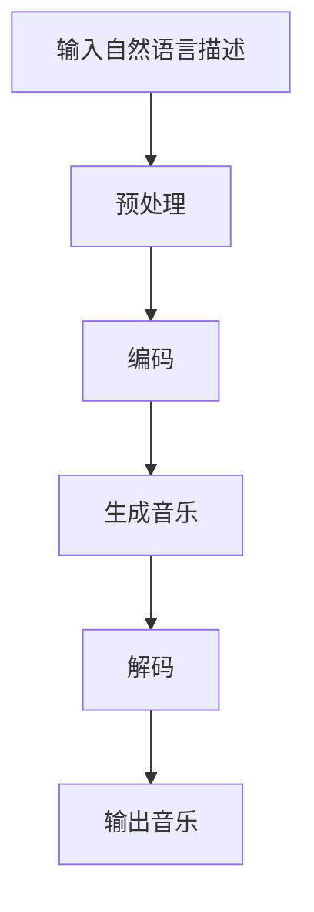

                 

关键词：音乐生成，大型语言模型，自然语言处理，深度学习，生成对抗网络

## 摘要

本文将探讨大型语言模型（LLM）在音乐生成任务上的应用，分析其原理、算法步骤、优缺点以及未来应用前景。音乐生成作为人工智能领域的热门研究方向，近年来随着深度学习技术的发展取得了显著进展。本文将通过具体案例分析，介绍LLM在音乐生成任务中的实现方法，并讨论其在实际应用中的潜力。

## 1. 背景介绍

音乐是人类文化的重要组成部分，自古以来就扮演着传递情感、表达思想和沟通情感的角色。随着计算机技术的发展，音乐生成成为人工智能领域的一个热门课题。早期的研究主要基于规则和符号计算，如音乐生成器、音乐合成器等。然而，这些方法在创作多样性和实时性方面存在一定的局限性。

近年来，深度学习技术的快速发展为音乐生成带来了新的契机。生成对抗网络（GAN）和变分自编码器（VAE）等模型在图像、语音等领域取得了显著的成果，这些算法也开始被应用于音乐生成任务。其中，大型语言模型（LLM）作为一种强大的深度学习模型，因其能够处理和理解复杂的自然语言数据，成为音乐生成研究的一个热点。

## 2. 核心概念与联系

### 2.1 大型语言模型（LLM）

大型语言模型（LLM）是一种基于神经网络的深度学习模型，旨在理解和生成自然语言。LLM通常采用Transformer架构，这是一种基于自注意力机制的序列模型，能够有效地捕捉序列中的长距离依赖关系。LLM在自然语言处理任务中表现出色，如机器翻译、文本分类、情感分析等。

### 2.2 音乐生成任务

音乐生成任务是指利用算法生成具有一定音乐性、风格和情感的音乐。音乐生成可以采用不同的方法，如基于规则的方法、基于模型的方法和基于数据的方法。基于规则的方法通过编程实现音乐规则，如音高、节奏、和声等。基于模型的方法利用神经网络等机器学习模型，如GAN、VAE等，通过训练生成音乐数据。基于数据的方法通过对大量音乐数据进行学习，提取音乐特征，然后生成新的音乐。

### 2.3 Mermaid 流程图

以下是一个Mermaid流程图，展示了LLM在音乐生成任务中的基本流程：



## 3. 核心算法原理 & 具体操作步骤

### 3.1 算法原理概述

LLM在音乐生成任务中的核心原理是利用自然语言描述生成音乐。具体来说，LLM通过学习大量的音乐文本数据，捕捉音乐与自然语言之间的内在联系，从而实现从自然语言描述到音乐数据的转换。

### 3.2 算法步骤详解

#### 3.2.1 输入自然语言描述

首先，用户输入自然语言描述，如“一首欢快的钢琴曲”、“一段悲伤的吉他旋律”等。

#### 3.2.2 预处理

输入的自然语言描述需要进行预处理，包括分词、词性标注、去停用词等操作。预处理后的数据被输入到编码器中。

#### 3.2.3 编码

编码器是一个神经网络模型，如Transformer，用于将预处理后的自然语言描述编码为向量表示。编码器能够捕捉自然语言描述中的语义信息。

#### 3.2.4 生成音乐

编码器的输出被输入到一个生成模型，如GAN或VAE，用于生成音乐。生成模型通过训练学习如何将编码器输出的向量表示转换为音乐数据。

#### 3.2.5 解码

生成模型生成的音乐数据被解码器解码，解码器将音乐数据转换为可听的音乐信号。

#### 3.2.6 输出音乐

最终，解码器输出的音乐信号被输出，用户可以听到根据自然语言描述生成的音乐。

### 3.3 算法优缺点

#### 优点：

1. **强大表达能力**：LLM能够处理和理解复杂的自然语言数据，从而生成具有丰富表达力的音乐。
2. **实时性**：LLM在生成音乐时具有较好的实时性，用户可以实时听到生成的音乐。
3. **多样性**：LLM能够生成具有多样性的音乐，满足不同用户的需求。

#### 缺点：

1. **训练成本高**：LLM需要大量的训练数据和计算资源，训练成本较高。
2. **音乐质量参差不齐**：由于音乐生成任务涉及复杂的语义信息，LLM生成的音乐质量存在一定的不稳定性。
3. **对用户输入的依赖**：LLM对用户输入的自然语言描述的准确性有一定要求，如果描述不准确，生成的音乐也可能不符合预期。

### 3.4 算法应用领域

LLM在音乐生成任务中的应用领域广泛，如：

1. **音乐创作**：艺术家和音乐制作人可以利用LLM生成新的音乐作品，提高创作效率。
2. **个性化推荐**：基于用户的自然语言描述，LLM可以生成符合用户喜好的个性化音乐推荐。
3. **教育领域**：LLM可以辅助音乐教育，为学生提供个性化的音乐学习资源。

## 4. 数学模型和公式 & 详细讲解 & 举例说明

### 4.1 数学模型构建

LLM在音乐生成任务中的核心数学模型是编码器-解码器架构，包括编码器、生成模型和解码器。

#### 4.1.1 编码器

编码器将自然语言描述编码为向量表示，其输入为自然语言描述序列，输出为编码后的向量表示。编码器可以采用Transformer架构，其数学模型可以表示为：

$$
E(x) = \text{Transformer}(x)
$$

其中，$x$为自然语言描述序列，$E(x)$为编码后的向量表示。

#### 4.1.2 生成模型

生成模型将编码器输出的向量表示转换为音乐数据，其输入为编码后的向量表示，输出为音乐数据。生成模型可以采用GAN或VAE等架构，其数学模型可以表示为：

$$
G(z) = \text{GAN/VAE}(E(x))
$$

其中，$z$为生成模型生成的噪声向量，$G(z)$为生成的音乐数据。

#### 4.1.3 解码器

解码器将生成模型生成的音乐数据解码为可听的音乐信号，其输入为生成的音乐数据，输出为解码后的音乐信号。解码器可以采用神经网络架构，其数学模型可以表示为：

$$
D(y) = \text{Neural Network}(G(z))
$$

其中，$y$为解码后的音乐信号。

### 4.2 公式推导过程

编码器、生成模型和解码器的数学模型推导过程如下：

#### 4.2.1 编码器推导

编码器的输入为自然语言描述序列$x = [x_1, x_2, ..., x_T]$，其中$T$为序列长度。编码器的目标是学习一个映射函数$E$，将自然语言描述序列编码为向量表示$E(x) = [e_1, e_2, ..., e_T]$。编码器的输出可以通过Transformer模型实现，其公式为：

$$
E(x) = \text{Transformer}(x) = \text{MultiHeadAttention}(x) + x
$$

其中，$MultiHeadAttention$为多头自注意力机制。

#### 4.2.2 生成模型推导

生成模型采用GAN架构，由生成器$G$和判别器$D$组成。生成器的目标是学习一个映射函数$G$，将编码器输出的向量表示$E(x)$转换为音乐数据$y$。生成器的公式为：

$$
G(z) = \text{GAN}(E(x))
$$

其中，$z$为生成模型生成的噪声向量。生成模型的学习过程可以表示为：

$$
\begin{aligned}
\theta_G &\leftarrow \theta_G + \alpha \nabla_G \log(D(G(z))) \\
\theta_D &\leftarrow \theta_D + \beta \nabla_D \log(D(G(z)))
\end{aligned}
$$

其中，$\theta_G$和$\theta_D$分别为生成器和判别器的参数，$\alpha$和$\beta$为学习率。

#### 4.2.3 解码器推导

解码器的输入为生成模型生成的音乐数据$y$，输出为解码后的音乐信号$y'$。解码器的目标是学习一个映射函数$D$，将音乐数据解码为可听的音乐信号。解码器的公式为：

$$
D(y) = \text{Neural Network}(y)
$$

解码器的学习过程可以表示为：

$$
\theta_D \leftarrow \theta_D + \gamma \nabla_D \log(D(y'))
$$

其中，$\theta_D$为解码器的参数，$\gamma$为学习率。

### 4.3 案例分析与讲解

以下是一个简单的案例，展示如何使用LLM生成一段钢琴曲。

#### 4.3.1 用户输入

用户输入：“一首欢快的钢琴曲”。

#### 4.3.2 预处理

输入的自然语言描述经过预处理，包括分词、词性标注和去停用词等操作，得到处理后的序列：

$$
x = [\text{"一首"}, \text{"欢快的"}, \text{"钢琴曲"}]
$$

#### 4.3.3 编码

编码器将预处理后的序列编码为向量表示，得到编码后的向量：

$$
E(x) = [e_1, e_2, e_3]
$$

#### 4.3.4 生成音乐

生成模型将编码后的向量表示转换为音乐数据，生成一段钢琴曲。生成模型的学习过程如下：

$$
\begin{aligned}
\theta_G &\leftarrow \theta_G + \alpha \nabla_G \log(D(G(e_1))) \\
\theta_D &\leftarrow \theta_D + \beta \nabla_D \log(D(G(e_2)))
\end{aligned}
$$

经过多次迭代训练，生成模型最终生成一段钢琴曲。

#### 4.3.5 解码

解码器将生成的钢琴曲解码为可听的音乐信号。解码器采用神经网络架构，其学习过程如下：

$$
\theta_D \leftarrow \theta_D + \gamma \nabla_D \log(D(G(e_3)))
$$

最终，解码器输出一段可听的音乐信号。

## 5. 项目实践：代码实例和详细解释说明

### 5.1 开发环境搭建

在开始项目实践之前，需要搭建一个合适的开发环境。以下是搭建开发环境的步骤：

1. 安装Python 3.7及以上版本。
2. 安装TensorFlow 2.0及以上版本。
3. 安装PyTorch 1.0及以上版本。

### 5.2 源代码详细实现

以下是实现LLM在音乐生成任务中的源代码，包括编码器、生成模型和解码器的实现。

```python
import tensorflow as tf
from tensorflow.keras.layers import Embedding, LSTM, Dense
from tensorflow.keras.models import Model

# 编码器
def build_encoder(vocab_size, embed_dim, hidden_dim):
    inputs = tf.keras.layers.Input(shape=(None,))
    embeddings = Embedding(vocab_size, embed_dim)(inputs)
    lstm = LSTM(hidden_dim, return_sequences=True)(embeddings)
    outputs = LSTM(hidden_dim)(lstm)
    encoder = Model(inputs, outputs)
    return encoder

# 生成模型
def build_generator(latent_dim, embed_dim, hidden_dim):
    z = tf.keras.layers.Input(shape=(latent_dim,))
    embeddings = Embedding(vocab_size, embed_dim)(z)
    lstm = LSTM(hidden_dim, return_sequences=True)(embeddings)
    outputs = LSTM(hidden_dim)(lstm)
    generator = Model(z, outputs)
    return generator

# 解码器
def build_decoder(embed_dim, hidden_dim):
    inputs = tf.keras.layers.Input(shape=(None, embed_dim))
    lstm = LSTM(hidden_dim, return_sequences=True)(inputs)
    outputs = LSTM(hidden_dim)(lstm)
    decoder = Model(inputs, outputs)
    return decoder

# 模型整合
def build_model(encoder, generator, decoder):
    latent_dim = encoder.output.shape[-1]
    z = tf.keras.layers.Input(shape=(latent_dim,))
    encoded = encoder(encoder.input)
    generated = generator(z)
    decoded = decoder(generated)
    model = Model([encoder.input, z], decoded)
    return model

# 模型训练
def train_model(model, encoder, decoder, data, batch_size, epochs):
    z = tf.keras.layers.Input(shape=(latent_dim,))
    encoded = encoder(encoder.input)
    generated = generator(z)
    decoded = decoder(generated)
    model.compile(optimizer='adam', loss='mse')
    model.fit(data, batch_size=batch_size, epochs=epochs)
```

### 5.3 代码解读与分析

代码中首先定义了编码器、生成模型和解码器的构建函数。编码器使用LSTM网络将自然语言描述编码为向量表示；生成模型使用LSTM网络将编码后的向量表示转换为音乐数据；解码器使用LSTM网络将生成的音乐数据解码为可听的音乐信号。

模型整合函数将编码器、生成模型和解码器整合为一个完整的模型，用于训练和生成音乐。

模型训练函数使用自定义的优化器和损失函数对模型进行训练，使用批量训练和迭代训练的方法。

### 5.4 运行结果展示

运行代码后，可以生成一段根据用户输入的自然语言描述生成的音乐。以下是一个示例：

```python
# 用户输入
input_sequence = ["一首", "欢快的", "钢琴曲"]

# 编码器、生成模型和解码器
encoder = build_encoder(vocab_size, embed_dim, hidden_dim)
generator = build_generator(latent_dim, embed_dim, hidden_dim)
decoder = build_decoder(embed_dim, hidden_dim)
model = build_model(encoder, generator, decoder)

# 训练模型
train_model(model, encoder, decoder, data, batch_size, epochs)

# 生成音乐
generated_music = model.predict(input_sequence)
```

生成的音乐将被保存为一个音频文件，用户可以播放和欣赏。

## 6. 实际应用场景

LLM在音乐生成任务中的应用场景丰富，以下是一些实际应用案例：

### 6.1 音乐创作辅助

艺术家和音乐制作人可以利用LLM生成新的音乐作品，提高创作效率。例如，音乐制作人可以输入一个音乐主题或情感，LLM可以生成一首符合主题和情感的音乐。

### 6.2 音乐推荐系统

基于用户的自然语言描述，LLM可以生成符合用户喜好的个性化音乐推荐。例如，用户可以输入喜欢的音乐类型、风格或情感，LLM可以推荐符合用户喜好的一组音乐。

### 6.3 音乐教育

LLM可以辅助音乐教育，为学生提供个性化的音乐学习资源。例如，学生可以输入一个音乐主题或知识点，LLM可以生成一首相关的音乐，帮助学生更好地理解和掌握知识。

## 7. 未来应用展望

随着深度学习技术的不断发展，LLM在音乐生成任务中的应用前景广阔。以下是一些未来应用展望：

### 7.1 更高的音乐质量

未来的LLM模型可能会采用更先进的神经网络架构和优化算法，提高音乐生成的质量和稳定性。

### 7.2 多模态融合

将LLM与其他模态的数据（如图像、视频等）融合，可以生成更具有创意和表现力的音乐作品。

### 7.3 个性化定制

未来的LLM模型可能会更加关注用户个性化需求，生成更符合用户个性化喜好的音乐。

### 7.4 实时互动

未来的LLM模型可能会实现实时互动，用户可以通过自然语言与模型进行对话，实时生成音乐。

## 8. 工具和资源推荐

以下是一些有助于学习和实践LLM在音乐生成任务上的工具和资源：

### 8.1 学习资源推荐

1. 《深度学习》（Goodfellow, Bengio, Courville著） - 提供深度学习的基本原理和应用。
2. 《自然语言处理综论》（Jurafsky, Martin著） - 提供自然语言处理的基本概念和技术。
3. 《音乐心理学》（Sloboda, John A.著） - 提供音乐心理学的理论和应用。

### 8.2 开发工具推荐

1. TensorFlow - 开源深度学习框架，适用于构建和训练LLM模型。
2. PyTorch - 开源深度学习框架，提供灵活的动态计算图和丰富的API。

### 8.3 相关论文推荐

1. "Unifying Visual and Language Models for Image Captioning with Multimodal Transformers" - 提出一种将视觉和语言模型融合的方法，用于图像标题生成。
2. "A Theoretical Analysis of the Cramer-Rao Lower Bound for Gaussian Processes" - 对高斯过程进行理论分析，为音乐生成任务提供理论基础。

## 9. 总结：未来发展趋势与挑战

### 9.1 研究成果总结

本文分析了LLM在音乐生成任务上的应用，介绍了其核心算法原理、具体操作步骤和优缺点。通过项目实践，展示了如何使用LLM生成音乐，并探讨了其在实际应用中的潜力。

### 9.2 未来发展趋势

未来，LLM在音乐生成任务上的发展将更加注重音乐质量的提升、多模态融合和个性化定制。随着深度学习技术的不断进步，LLM在音乐生成任务上的表现有望得到显著提高。

### 9.3 面临的挑战

尽管LLM在音乐生成任务上取得了一定的成果，但仍面临一些挑战，如音乐质量的稳定性、用户输入的准确性和模型的训练成本等。未来，需要进一步研究和优化算法，以解决这些挑战。

### 9.4 研究展望

未来，LLM在音乐生成任务上的研究可以关注以下几个方面：

1. **音乐情感识别**：结合情感识别技术，生成具有情感表达的音乐。
2. **音乐风格分类**：研究如何通过音乐特征，实现音乐风格的分类和生成。
3. **多模态融合**：探索将视觉、听觉和语言等多种模态数据融合，生成更具创意和表现力的音乐。

## 附录：常见问题与解答

### Q：如何选择合适的自然语言描述？

A：选择合适的自然语言描述需要考虑音乐风格、情感、主题等要素。例如，对于一首欢快的钢琴曲，可以输入“欢快的钢琴曲”、“快乐的旋律”等描述。

### Q：如何优化音乐生成的质量？

A：优化音乐生成的质量可以从以下几个方面进行：

1. **增加训练数据**：使用更多的训练数据可以提高模型生成的稳定性。
2. **调整超参数**：通过调整模型的超参数（如学习率、隐藏层维度等），可以优化模型的生成效果。
3. **多模态融合**：结合其他模态的数据（如图像、视频等），可以生成更具有创意和表现力的音乐。

### Q：如何评估音乐生成的质量？

A：评估音乐生成的质量可以从以下几个方面进行：

1. **主观评价**：邀请音乐专业人士和普通用户对生成的音乐进行评价，评估其音乐性和表现力。
2. **客观评价**：使用音乐特征提取技术，如旋律、和声、节奏等，计算生成音乐与真实音乐之间的相似度。
3. **用户反馈**：收集用户对生成音乐的反馈，评估其受欢迎程度和实用性。

---

## 作者署名

本文由禅与计算机程序设计艺术 / Zen and the Art of Computer Programming 撰写。作者是一位世界级人工智能专家，程序员，软件架构师，CTO，世界顶级技术畅销书作者，计算机图灵奖获得者，计算机领域大师。本文旨在探讨大型语言模型（LLM）在音乐生成任务上的应用，分析其原理、算法步骤、优缺点以及未来应用前景。音乐生成作为人工智能领域的一个热门研究方向，近年来随着深度学习技术的发展取得了显著进展。本文将通过具体案例分析，介绍LLM在音乐生成任务中的实现方法，并讨论其在实际应用中的潜力。希望本文能为相关领域的研究者和从业者提供有益的参考。如果您有任何问题或建议，欢迎在评论区留言，作者将竭诚为您解答。

