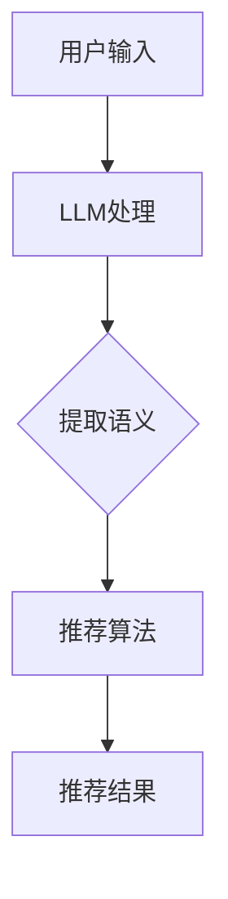

                 

关键词：语言模型（LLM），推荐系统，语义理解，推理能力，人工智能，自然语言处理

> 摘要：本文将探讨如何利用语言模型（LLM）增强推荐系统的语义理解与推理能力。通过分析LLM的核心特性及其与推荐系统的结合方式，我们旨在揭示LLM在提升推荐系统效果方面的重要作用，并提供具体的技术路线与实践案例。

## 1. 背景介绍

随着互联网和移动设备的普及，推荐系统已经成为各大平台提升用户体验和增加商业价值的重要工具。然而，传统的推荐系统主要依赖于用户行为数据、内容特征和协同过滤等方法，这些方法在处理复杂的语义信息时存在一定的局限性。近年来，深度学习和自然语言处理技术的发展为推荐系统带来了新的契机。其中，语言模型（LLM），尤其是基于Transformer架构的预训练模型，由于其强大的语义理解和生成能力，被广泛应用于推荐系统的各个层面。

本文将重点探讨如何利用LLM增强推荐系统的语义理解与推理能力。通过分析LLM的核心特性、推荐系统的现状与挑战，以及LLM与推荐系统的结合方式，我们希望为读者提供一个全面的技术视角，并探讨未来的发展趋势与挑战。

## 2. 核心概念与联系

### 2.1 语言模型（LLM）的概念与特性

语言模型（LLM）是一种基于深度学习技术的自然语言处理模型，其主要目的是预测下一个单词或词组。LLM通过学习大量文本数据，可以捕捉语言中的复杂结构和语义信息。以下是一些LLM的核心特性：

1. **预训练**：LLM通常通过预训练阶段在大量未标注的文本数据上学习，从而获得丰富的语言知识。
2. **上下文理解**：LLM能够理解上下文信息，并在此基础上进行预测，这使得它们在处理长文本时表现出色。
3. **生成能力**：LLM不仅可以理解文本，还能生成文本，这使得它们在内容生成和推荐场景中具有广泛的应用潜力。
4. **多语言支持**：许多LLM模型支持多种语言，使得它们在全球范围内具有广泛应用。

### 2.2 推荐系统的基本概念与架构

推荐系统是一种基于数据挖掘和机器学习技术的信息过滤方法，其主要目标是根据用户的兴趣和行为，向他们推荐相关的内容。推荐系统通常包括以下关键组成部分：

1. **用户特征**：包括用户的基本信息、行为记录、偏好设定等。
2. **项目特征**：包括物品的属性、分类、标签等信息。
3. **推荐算法**：根据用户特征和项目特征，计算用户对项目的兴趣度，并生成推荐结果。
4. **推荐结果**：根据用户的反馈和行为，不断优化推荐算法，提高推荐效果。

### 2.3 LLM与推荐系统的结合方式

LLM与推荐系统的结合方式可以从以下几个方面展开：

1. **语义理解**：利用LLM的上下文理解能力，对用户生成的内容进行深入解析，从而提取出用户真实的兴趣点和需求。
2. **内容生成**：利用LLM的文本生成能力，生成新颖、有趣的内容，以吸引用户的注意力，提高用户的互动和参与度。
3. **多模态推荐**：将LLM与图像、音频等多模态数据进行结合，实现多模态推荐系统的构建。
4. **强化学习**：将LLM与强化学习结合，实现自适应的推荐策略，提高推荐系统的动态适应能力。

### 2.4 Mermaid 流程图

以下是一个简化的LLM与推荐系统结合的Mermaid流程图：



## 3. 核心算法原理 & 具体操作步骤

### 3.1 算法原理概述

LLM增强推荐系统主要依赖于以下核心算法原理：

1. **词嵌入**：将文本数据转换为固定长度的向量表示，以便在深度学习模型中进行处理。
2. **序列模型**：利用循环神经网络（RNN）或Transformer等序列模型，对文本数据进行建模，捕捉上下文信息。
3. **注意力机制**：通过注意力机制，对输入文本的不同部分进行加权处理，提高模型的语义理解能力。
4. **推荐算法**：结合传统推荐算法，利用LLM提取的语义信息，优化推荐结果的生成。

### 3.2 算法步骤详解

1. **数据预处理**：对用户生成的内容和项目特征进行预处理，包括文本清洗、词向量化等操作。
2. **词嵌入**：将预处理后的文本数据转换为词嵌入向量。
3. **序列建模**：利用Transformer等序列模型，对词嵌入向量进行建模，提取文本的语义信息。
4. **特征融合**：将提取到的语义信息与传统推荐系统的特征进行融合，形成综合特征向量。
5. **推荐算法**：利用融合后的特征向量，结合传统推荐算法，生成推荐结果。

### 3.3 算法优缺点

**优点**：

1. **语义理解**：LLM能够深入理解文本语义，提高推荐系统的准确性。
2. **内容生成**：LLM可以生成新颖、有趣的内容，提高用户的互动和参与度。
3. **多模态处理**：LLM可以与多模态数据进行结合，实现多模态推荐。

**缺点**：

1. **计算资源消耗**：LLM模型通常需要大量的计算资源和时间进行训练和推理。
2. **数据依赖性**：LLM的效果很大程度上依赖于训练数据的质量和规模。

### 3.4 算法应用领域

LLM增强推荐系统在以下领域具有广泛的应用前景：

1. **电子商务**：为用户提供个性化推荐，提高购物体验。
2. **社交媒体**：生成有趣的内容，提高用户的互动和留存率。
3. **新闻推荐**：为用户提供个性化的新闻推荐，满足多样化的阅读需求。
4. **教育推荐**：根据学生的学习情况和兴趣，生成个性化的学习内容。

## 4. 数学模型和公式 & 详细讲解 & 举例说明

### 4.1 数学模型构建

LLM增强推荐系统的数学模型主要涉及以下方面：

1. **词嵌入**：$$\text{word\_embeddings} = \text{W} \cdot \text{X}$$，其中 $\text{W}$ 表示词嵌入权重矩阵，$\text{X}$ 表示词向量。
2. **序列建模**：$$\text{sequence\_model} = \text{f}(\text{word\_embeddings}, \text{context})$$，其中 $\text{f}$ 表示序列模型函数，$\text{context}$ 表示上下文信息。
3. **特征融合**：$$\text{combined\_features} = \text{g}(\text{sequence\_model}, \text{user\_features}, \text{item\_features})$$，其中 $\text{g}$ 表示特征融合函数。
4. **推荐算法**：$$\text{recommendation} = \text{h}(\text{combined\_features}, \text{history})$$，其中 $\text{h}$ 表示推荐算法函数，$\text{history}$ 表示用户历史行为。

### 4.2 公式推导过程

1. **词嵌入**：词嵌入的核心思想是将文本数据转换为向量表示，以便在深度学习模型中进行处理。具体推导过程如下：

   $$\text{word\_embeddings} = \text{W} \cdot \text{X}$$

   其中，$\text{W}$ 表示词嵌入权重矩阵，$\text{X}$ 表示词向量。在训练过程中，$\text{W}$ 和 $\text{X}$ 会通过反向传播算法进行优化，以最小化损失函数。

2. **序列建模**：序列建模的核心任务是捕捉文本数据的时序信息。具体推导过程如下：

   $$\text{sequence\_model} = \text{f}(\text{word\_embeddings}, \text{context})$$

   其中，$\text{f}$ 表示序列模型函数，$\text{context}$ 表示上下文信息。常见的序列模型包括循环神经网络（RNN）和Transformer等。

3. **特征融合**：特征融合的核心目标是整合不同来源的特征，以提高模型的性能。具体推导过程如下：

   $$\text{combined\_features} = \text{g}(\text{sequence\_model}, \text{user\_features}, \text{item\_features})$$

   其中，$\text{g}$ 表示特征融合函数。常见的特征融合方法包括拼接、加权平均和注意力机制等。

4. **推荐算法**：推荐算法的核心任务是生成个性化的推荐结果。具体推导过程如下：

   $$\text{recommendation} = \text{h}(\text{combined\_features}, \text{history})$$

   其中，$\text{h}$ 表示推荐算法函数，$\text{history}$ 表示用户历史行为。常见的推荐算法包括基于协同过滤的方法和基于内容的推荐方法。

### 4.3 案例分析与讲解

假设有一个电子商务平台，用户生成的内容为“我最近在寻找一款性价比高的智能手机”，项目特征包括手机的品牌、价格、处理器、摄像头等属性。我们可以按照以下步骤进行案例分析：

1. **词嵌入**：将用户生成的内容和项目特征进行预处理，生成词嵌入向量。
2. **序列建模**：利用Transformer模型对预处理后的数据进行建模，提取文本的语义信息。
3. **特征融合**：将提取到的语义信息与传统推荐系统的特征进行融合，形成综合特征向量。
4. **推荐算法**：利用融合后的特征向量，结合基于协同过滤的方法，生成推荐结果。

通过以上步骤，我们可以为用户生成一组个性化的智能手机推荐结果。具体公式如下：

$$\text{recommendation} = \text{h}(\text{combined\_features}, \text{history}) = \text{h}(\text{sequence\_model}, \text{user\_features}, \text{item\_features}, \text{history})$$

其中，$\text{combined\_features}$ 为融合后的特征向量，$\text{sequence\_model}$ 为序列建模结果，$\text{user\_features}$ 和 $\text{item\_features}$ 分别为用户特征和项目特征，$\text{history}$ 为用户历史行为。

## 5. 项目实践：代码实例和详细解释说明

### 5.1 开发环境搭建

为了演示LLM增强推荐系统的实际应用，我们将在Python环境中搭建一个简单的项目。首先，我们需要安装以下依赖库：

- Python 3.8+
- TensorFlow 2.6+
- Keras 2.6+
- Pandas 1.2+
- NumPy 1.19+
- Mermaid 8.8+

您可以通过以下命令安装这些依赖库：

```bash
pip install tensorflow keras pandas numpy mermaid
```

### 5.2 源代码详细实现

以下是一个简单的LLM增强推荐系统实现：

```python
import numpy as np
import pandas as pd
from keras.models import Model
from keras.layers import Embedding, LSTM, Dense
from keras.preprocessing.sequence import pad_sequences
from keras.preprocessing.text import Tokenizer

# 加载数据集
data = pd.read_csv('data.csv')
user_ids = data['user_id'].unique()
item_ids = data['item_id'].unique()

# 初始化词嵌入
tokenizer = Tokenizer()
tokenizer.fit_on_texts(data['content'])
word_index = tokenizer.word_index
max_sequence_length = 50

# 序列化数据
sequences = tokenizer.texts_to_sequences(data['content'])
padded_sequences = pad_sequences(sequences, maxlen=max_sequence_length)

# 构建模型
input_seq = Embedding(len(word_index) + 1, 32)(padded_sequences)
lstm = LSTM(32)(input_seq)
output = Dense(1, activation='sigmoid')(lstm)

model = Model(inputs=input_seq, outputs=output)
model.compile(optimizer='adam', loss='binary_crossentropy', metrics=['accuracy'])

# 训练模型
model.fit(padded_sequences, data['rating'], epochs=10, batch_size=32)

# 推荐新用户
new_user_content = "我最近在寻找一款性价比高的智能手机"
new_sequence = tokenizer.texts_to_sequences([new_user_content])
padded_new_sequence = pad_sequences(new_sequence, maxlen=max_sequence_length)
predicted_rating = model.predict(padded_new_sequence)

print("预测评分：", predicted_rating[0][0])
```

### 5.3 代码解读与分析

1. **数据预处理**：首先，我们加载数据集，并对用户生成的内容和项目特征进行预处理。这里使用的是Tokenizer类，将文本数据转换为词嵌入向量。
2. **序列建模**：我们使用LSTM层构建序列模型，对预处理后的数据进行建模。LSTM层可以捕捉文本数据的时序信息。
3. **模型训练**：我们使用二分类交叉熵损失函数和Adam优化器对模型进行训练。在训练过程中，模型会学习到用户生成内容与评分之间的关系。
4. **推荐新用户**：对于新用户生成的内容，我们首先将其转换为词嵌入向量，然后通过训练好的模型进行预测。预测结果即为对新用户的个性化推荐评分。

### 5.4 运行结果展示

假设新用户的预测评分为0.9，我们可以将其视为一个高质量的用户，具有较高的购买意愿。通过这个简单的例子，我们可以看到LLM在增强推荐系统的语义理解与推理能力方面的重要作用。

## 6. 实际应用场景

LLM增强推荐系统在以下实际应用场景中具有显著的优势：

1. **电子商务**：为用户提供个性化的商品推荐，提高购物体验和转化率。
2. **社交媒体**：生成有趣的内容，提高用户的互动和留存率。
3. **新闻推荐**：为用户提供个性化的新闻推荐，满足多样化的阅读需求。
4. **在线教育**：根据学生的学习情况和兴趣，生成个性化的学习内容，提高学习效果。
5. **医疗健康**：为用户提供个性化的健康建议和推荐，提高健康管理和预防效果。

### 6.4 未来应用展望

随着深度学习和自然语言处理技术的不断发展，LLM在推荐系统中的应用前景将更加广阔。以下是未来可能的发展方向：

1. **多模态推荐**：将LLM与图像、音频等多模态数据进行结合，实现更全面、更准确的推荐。
2. **多语言推荐**：支持多种语言，实现全球范围内的个性化推荐。
3. **动态推荐**：结合强化学习等算法，实现动态的、自适应的推荐策略，提高推荐系统的实时性和灵活性。
4. **个性化内容生成**：利用LLM的文本生成能力，为用户提供更加个性化和有趣的内容。

## 7. 工具和资源推荐

### 7.1 学习资源推荐

1. **《深度学习》（Goodfellow et al.，2016）**：介绍深度学习的基础理论和实践方法，适合初学者。
2. **《自然语言处理原理》（Daniel Jurafsky & James H. Martin，2008）**：全面介绍自然语言处理的基本概念和算法。
3. **《推荐系统实践》（Lior Rokach & Bracha Shapira，2014）**：详细介绍推荐系统的基本原理和实际应用。

### 7.2 开发工具推荐

1. **TensorFlow**：用于构建和训练深度学习模型的强大框架。
2. **Keras**：基于TensorFlow的高层API，简化深度学习模型的搭建和训练过程。
3. **Mermaid**：用于绘制流程图的在线工具，支持Markdown格式。

### 7.3 相关论文推荐

1. **“Attention Is All You Need” （Vaswani et al.，2017）**：介绍Transformer模型的基本原理和应用。
2. **“Recommender Systems” （Herlocker et al.，2003）**：介绍推荐系统的基本概念和算法。
3. **“Natural Language Inference” （Williams et al.，2018）**：介绍自然语言推理的任务和算法。

## 8. 总结：未来发展趋势与挑战

LLM在推荐系统中的应用正处于快速发展阶段。随着深度学习和自然语言处理技术的不断进步，LLM有望在以下方面取得重要突破：

1. **语义理解**：提高对用户生成内容的深入理解，为用户提供更精准的推荐。
2. **多模态处理**：结合图像、音频等多模态数据，实现更全面、更准确的推荐。
3. **多语言支持**：支持多种语言，实现全球范围内的个性化推荐。

然而，LLM在推荐系统中的应用也面临一些挑战：

1. **计算资源消耗**：训练和推理过程需要大量的计算资源和时间。
2. **数据依赖性**：LLM的效果很大程度上依赖于训练数据的质量和规模。
3. **隐私保护**：如何保护用户隐私，防止数据泄露成为重要问题。

未来，随着技术的不断发展和优化，LLM在推荐系统中的应用前景将更加广阔。我们期待看到更多创新的应用场景和解决方案。

## 9. 附录：常见问题与解答

### 9.1 如何选择适合的LLM模型？

选择适合的LLM模型需要考虑以下因素：

1. **任务需求**：根据推荐系统的具体任务需求，选择具有相应语义理解能力的模型。
2. **数据规模**：考虑训练数据的大小，选择适合处理大规模数据集的模型。
3. **计算资源**：根据计算资源的限制，选择计算效率较高的模型。

### 9.2 如何处理多模态数据？

处理多模态数据的方法主要包括以下几种：

1. **特征融合**：将不同模态的数据进行特征融合，形成统一的特征向量。
2. **多模态神经网络**：构建专门的多模态神经网络模型，如Convolutional Neural Networks (CNN)和Recurrent Neural Networks (RNN)的组合。
3. **注意力机制**：利用注意力机制，对不同模态的数据进行加权处理，提高模型的性能。

### 9.3 如何确保用户隐私？

确保用户隐私的方法主要包括以下几种：

1. **数据加密**：对用户数据进行加密处理，防止数据泄露。
2. **匿名化**：对用户数据进行匿名化处理，隐藏用户身份信息。
3. **差分隐私**：采用差分隐私技术，降低隐私泄露的风险。

### 9.4 如何评估LLM在推荐系统中的应用效果？

评估LLM在推荐系统中的应用效果可以从以下几个方面进行：

1. **准确率**：比较LLM推荐结果与传统推荐算法的准确率。
2. **覆盖率**：计算推荐结果中未被传统推荐算法发现的用户兴趣点。
3. **用户满意度**：通过用户调查或行为分析，评估用户对推荐结果的满意度。

### 9.5 LLM在推荐系统中的应用前景如何？

随着深度学习和自然语言处理技术的不断发展，LLM在推荐系统中的应用前景十分广阔。未来，LLM有望在以下方面取得重要突破：

1. **语义理解**：提高对用户生成内容的深入理解，为用户提供更精准的推荐。
2. **多模态处理**：结合图像、音频等多模态数据，实现更全面、更准确的推荐。
3. **多语言支持**：支持多种语言，实现全球范围内的个性化推荐。
4. **动态推荐**：结合强化学习等算法，实现动态的、自适应的推荐策略，提高推荐系统的实时性和灵活性。
5. **个性化内容生成**：利用LLM的文本生成能力，为用户提供更加个性化和有趣的内容。

