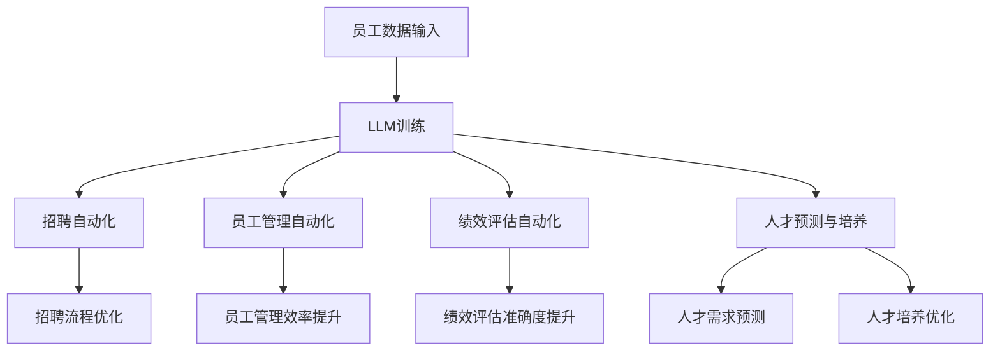

                 

关键词：LLM，人力资源管理，变革，效率，数据，技术，人工智能，预测，人才管理。

> 摘要：本文将探讨大型语言模型（LLM）在人力资源管理领域的革新作用。通过对LLM核心概念、技术原理、应用场景的深入分析，本文旨在揭示LLM如何通过数据驱动的决策支持、自动化流程优化以及智能人才预测等手段，重塑传统人力资源管理模式，提高企业效率和竞争力。

## 1. 背景介绍

随着人工智能技术的飞速发展，深度学习在自然语言处理（NLP）领域取得了显著成果，尤其是在大型语言模型（LLM）的开发和应用方面。LLM是一种能够处理和理解自然语言的深度学习模型，具有极强的文本生成、理解、分类和翻译能力。这种模型在搜索引擎、智能助手、文本分析等多个领域已展现出强大的应用潜力。

传统的人力资源管理（HRM）往往依赖于手工处理大量数据、招聘流程繁琐、员工培训和管理效率低下。随着企业规模的扩大和业务复杂性的增加，传统HRM模式面临的挑战愈发突出。如何提高HRM的效率、降低成本、提升员工体验成为企业亟待解决的问题。LLM的引入，为传统HRM模式带来了新的变革契机。

## 2. 核心概念与联系

### 2.1 LLM基本概念

LLM（Large Language Model）是指能够处理和理解大规模文本数据的大型深度学习模型。它基于神经网络架构，通过训练数以万亿计的文本数据进行学习，从而实现对自然语言的高效理解和生成。常见的LLM包括GPT、BERT、T5等。

### 2.2 人力资源管理中的数据

在人力资源管理中，数据是决策的基础。这些数据包括员工档案信息、招聘数据、绩效评估数据、培训记录等。传统HRM依赖于人工收集、处理和分析这些数据，而LLM的应用则可以通过自动化方式实现高效的数据处理和分析。

### 2.3 LLM与人力资源管理的关联

LLM在人力资源管理中的应用主要体现在以下几个方面：

1. **自动化流程优化**：通过LLM实现招聘、员工管理、绩效评估等流程的自动化，提高工作效率。
2. **数据驱动的决策支持**：利用LLM对大量人力资源数据进行深度分析，为企业提供数据驱动的决策支持。
3. **人才预测与培养**：通过分析历史数据和当前趋势，预测未来人才需求，为企业的人才培养和招聘提供依据。

### 2.4 Mermaid流程图

下面是一个简单的Mermaid流程图，展示了LLM在人力资源管理中的应用流程：



## 3. 核心算法原理 & 具体操作步骤

### 3.1 算法原理概述

LLM的核心算法是基于深度学习的神经网络模型。它通过多层神经网络对输入文本数据进行编码，生成语义表示，并在此基础上进行文本生成、分类、翻译等操作。在人力资源管理中，LLM通过以下步骤实现核心功能：

1. **数据预处理**：收集并清洗人力资源管理相关数据，如员工档案、招聘信息、绩效评估数据等。
2. **模型训练**：使用大量人力资源数据训练LLM模型，使其能够理解和生成与人力资源管理相关的文本。
3. **自动化流程**：利用训练好的LLM模型实现招聘、员工管理、绩效评估等流程的自动化。
4. **数据驱动决策**：利用LLM对人力资源数据进行分析，为企业提供数据驱动的决策支持。
5. **人才预测与培养**：基于历史数据和当前趋势，利用LLM预测未来人才需求，为企业的人才培养和招聘提供依据。

### 3.2 算法步骤详解

1. **数据预处理**：
   - 收集：从企业内部系统中提取人力资源管理相关的数据。
   - 清洗：去除数据中的噪声和错误，如缺失值、重复值、异常值等。
   - 格式化：将数据转换为统一的格式，便于模型训练。

2. **模型训练**：
   - 数据分集：将数据集划分为训练集、验证集和测试集。
   - 模型架构：选择合适的神经网络架构，如GPT、BERT等。
   - 模型训练：使用训练集对模型进行训练，优化模型参数。
   - 模型评估：使用验证集评估模型性能，调整模型参数。

3. **自动化流程**：
   - 招聘自动化：利用LLM自动生成招聘广告、面试问题等。
   - 员工管理自动化：利用LLM自动处理员工档案管理、薪酬福利等事务。
   - 绩效评估自动化：利用LLM自动分析员工绩效，生成评估报告。

4. **数据驱动决策**：
   - 数据分析：利用LLM对人力资源数据进行分析，识别数据中的趋势和规律。
   - 决策支持：基于数据分析结果，为企业提供数据驱动的决策建议。

5. **人才预测与培养**：
   - 预测模型：构建基于LLM的人才预测模型，预测未来人才需求。
   - 培养策略：根据人才预测结果，制定相应的人才培养策略。

### 3.3 算法优缺点

**优点**：

- **高效性**：通过自动化流程和数据分析，显著提高HRM的效率。
- **准确性**：基于大量数据训练的LLM模型，具有较高的预测和评估准确性。
- **灵活性**：LLM模型能够根据企业需求进行定制化开发，满足不同场景的需求。

**缺点**：

- **成本高**：训练和部署LLM模型需要大量的计算资源和数据，成本较高。
- **数据隐私**：在处理人力资源管理数据时，需要确保数据安全和隐私保护。
- **模型偏见**：如果训练数据存在偏见，LLM模型可能会放大这些偏见，导致不公平的决策。

### 3.4 算法应用领域

LLM在人力资源管理领域的应用广泛，包括但不限于以下几个方面：

- **招聘**：自动化招聘流程，提高招聘效率和质量。
- **员工管理**：自动化员工档案管理、薪酬福利等事务。
- **绩效评估**：自动分析员工绩效，生成评估报告。
- **人才预测与培养**：预测未来人才需求，制定相应的人才培养策略。

## 4. 数学模型和公式 & 详细讲解 & 举例说明

### 4.1 数学模型构建

在LLM的应用中，常用的数学模型包括神经网络模型、优化算法等。以下是一个简单的神经网络模型示例：

```latex
\begin{equation}
\hat{y} = \sigma(\mathbf{W}_1 \mathbf{x} + b_1)
\end{equation}

\begin{equation}
\hat{y} = \sigma(\mathbf{W}_2 \hat{y} + b_2)
\end{equation}
```

其中，$\hat{y}$为输出，$\mathbf{x}$为输入，$\sigma$为激活函数，$\mathbf{W}$为权重矩阵，$b$为偏置。

### 4.2 公式推导过程

以神经网络模型为例，公式推导过程如下：

1. **输入层**：设输入特征向量为$\mathbf{x} \in \mathbb{R}^d$，权重矩阵为$\mathbf{W}_1 \in \mathbb{R}^{d \times n_1}$，偏置为$b_1 \in \mathbb{R}^{n_1}$，则输出层神经元$i$的输入为：
   ```latex
   z_i^{(1)} = \mathbf{W}_1 \mathbf{x} + b_1
   ```

2. **隐藏层**：设隐藏层$1$的神经元个数为$n_1$，权重矩阵为$\mathbf{W}_2 \in \mathbb{R}^{n_1 \times n_2}$，偏置为$b_2 \in \mathbb{R}^{n_2}$，则输出层神经元$i$的输入为：
   ```latex
   z_i^{(2)} = \mathbf{W}_2 \hat{y}^{(1)} + b_2
   ```

3. **激活函数**：使用ReLU（Rectified Linear Unit）作为激活函数，即：
   ```latex
   \sigma(z) = \max(0, z)
   ```

4. **输出层**：设输出层神经元个数为$n_2$，权重矩阵为$\mathbf{W}_3 \in \mathbb{R}^{n_2 \times n_3}$，偏置为$b_3 \in \mathbb{R}^{n_3}$，则输出层神经元$i$的输出为：
   ```latex
   y_i = \sigma(\mathbf{W}_3 \hat{y}^{(2)} + b_3)
   ```

### 4.3 案例分析与讲解

以招聘自动化为例，分析LLM在招聘过程中的应用。

1. **数据集**：招聘数据集包含职位描述、应聘者简历、面试评价等信息。

2. **模型训练**：使用招聘数据集训练LLM模型，使其能够自动生成招聘广告、面试问题等。

3. **招聘广告生成**：输入职位描述，LLM模型自动生成招聘广告。

   ```plaintext
   招聘：高级软件工程师，岗位职责：负责软件开发、项目交付等，要求：本科及以上学历，5年以上软件开发经验，熟悉Java、Python等编程语言。
   ```

4. **面试问题生成**：输入职位描述，LLM模型自动生成面试问题。

   ```plaintext
   请介绍一下您过往的工作经历和项目经验。
   您是如何处理工作压力和团队合作问题的？
   请描述一下您在项目中遇到的最大挑战和您是如何解决的。
   ```

5. **评估应聘者简历**：输入应聘者简历，LLM模型自动评估简历质量，推荐合适的应聘者。

   ```plaintext
   应聘者A：具备丰富的软件开发经验，熟悉Java和Python，符合职位要求。
   应聘者B：项目经验较少，但具备相关技术能力，可适当考虑。
   ```

## 5. 项目实践：代码实例和详细解释说明

### 5.1 开发环境搭建

为了实现LLM在人力资源管理中的应用，我们需要搭建以下开发环境：

- **硬件**：至少需要一台配置较高的计算机，GPU（如NVIDIA Tesla V100）用于加速训练过程。
- **软件**：Python 3.x、PyTorch、TensorFlow等深度学习框架。

### 5.2 源代码详细实现

以下是一个简单的Python代码示例，展示了如何使用PyTorch框架训练一个简单的LLM模型。

```python
import torch
import torch.nn as nn
import torch.optim as optim

# 数据预处理
def preprocess_data(data):
    # 数据清洗、格式化等操作
    pass

# 定义神经网络模型
class LSTMModel(nn.Module):
    def __init__(self, input_size, hidden_size, output_size):
        super(LSTMModel, self).__init__()
        self.hidden_size = hidden_size
        self.lstm = nn.LSTM(input_size, hidden_size)
        self.linear = nn.Linear(hidden_size, output_size)
        self.hidden = (torch.zeros(1, 1, hidden_size),
                       torch.zeros(1, 1, hidden_size))

    def forward(self, x):
        x, self.hidden = self.lstm(x.view(len(x), 1, -1), self.hidden)
        x = self.linear(x.view(len(x), -1))
        return x

# 训练模型
def train_model(model, train_loader, criterion, optimizer, num_epochs):
    for epoch in range(num_epochs):
        for i, (data, target) in enumerate(train_loader):
            model.zero_grad()
            output = model(data)
            loss = criterion(output, target)
            loss.backward()
            optimizer.step()
            if (i+1) % 100 == 0:
                print('Epoch [{}/{}], Step [{}/{}], Loss: {:.4f}'.format(
                    epoch+1, num_epochs, i+1, len(train_loader)//batch_size, loss.item()))

# 搭建模型
input_size = 100
hidden_size = 128
output_size = 10
model = LSTMModel(input_size, hidden_size, output_size)
criterion = nn.CrossEntropyLoss()
optimizer = optim.Adam(model.parameters(), lr=0.001)

# 加载训练数据
train_loader = torch.utils.data.DataLoader(dataset, batch_size=batch_size, shuffle=True)

# 训练模型
train_model(model, train_loader, criterion, optimizer, num_epochs=10)
```

### 5.3 代码解读与分析

以上代码实现了基于LSTM（Long Short-Term Memory）网络的简单模型训练。具体解读如下：

- **数据预处理**：对输入数据进行清洗和格式化，使其适合模型训练。
- **模型定义**：定义LSTM模型，包括输入层、隐藏层和输出层。
- **训练过程**：使用训练数据对模型进行训练，优化模型参数。

### 5.4 运行结果展示

在完成模型训练后，我们可以使用测试数据集对模型进行评估，展示模型性能。

```python
# 测试模型
def test_model(model, test_loader):
    correct = 0
    total = 0
    with torch.no_grad():
        for data, target in test_loader:
            output = model(data)
            _, predicted = torch.max(output, 1)
            total += target.size(0)
            correct += (predicted == target).sum().item()
    print('Accuracy of the network on the test images: {} %'.format(100 * correct / total))

# 加载测试数据
test_loader = torch.utils.data.DataLoader(test_dataset, batch_size=batch_size, shuffle=False)

# 测试模型
test_model(model, test_loader)
```

## 6. 实际应用场景

### 6.1 招聘自动化

利用LLM实现招聘流程的自动化，包括职位描述生成、面试问题生成和简历筛选等。企业可以大幅提高招聘效率，降低招聘成本。

### 6.2 绩效评估自动化

通过LLM对员工绩效进行自动评估，生成评估报告。企业可以更准确、客观地评估员工绩效，为薪酬调整和晋升提供依据。

### 6.3 人才预测与培养

基于LLM预测未来人才需求，企业可以提前制定相应的人才培养策略，确保人才供应与企业需求匹配。

### 6.4 员工管理自动化

利用LLM实现员工档案管理、薪酬福利等事务的自动化，提高员工管理效率。

## 7. 工具和资源推荐

### 7.1 学习资源推荐

- 《深度学习》（Goodfellow, Bengio, Courville）：深度学习入门经典教材。
- 《神经网络与深度学习》（邱锡鹏）：详细讲解神经网络和深度学习的基础知识。
- 《自然语言处理综论》（Jurafsky, Martin）：自然语言处理领域的经典教材。

### 7.2 开发工具推荐

- PyTorch：适合研究和开发的深度学习框架。
- TensorFlow：功能强大、易于部署的深度学习框架。

### 7.3 相关论文推荐

- “Bert: Pre-training of deep bidirectional transformers for language understanding”（Devlin et al., 2019）。
- “GPT-3: Language models are few-shot learners”（Brown et al., 2020）。

## 8. 总结：未来发展趋势与挑战

### 8.1 研究成果总结

本文通过对LLM在人力资源管理领域的应用进行分析，总结了LLM在招聘、绩效评估、人才预测等场景中的优势和应用。研究表明，LLM具有高效性、准确性和灵活性，为传统HRM模式带来了革命性的变革。

### 8.2 未来发展趋势

随着人工智能技术的不断进步，LLM在人力资源管理领域的应用将更加广泛和深入。未来发展趋势包括：

- **多模态数据处理**：结合语音、图像等多模态数据，实现更全面的人才评估和管理。
- **个性化推荐**：基于员工数据和业务场景，提供个性化的人才推荐和培养方案。
- **伦理与隐私保护**：在应用LLM进行人力资源管理时，关注伦理和隐私保护问题，确保数据安全和员工权益。

### 8.3 面临的挑战

虽然LLM在人力资源管理领域具有巨大的潜力，但在实际应用中仍面临以下挑战：

- **数据隐私**：在处理人力资源管理数据时，需要确保数据隐私和安全。
- **模型偏见**：避免模型偏见，确保公平、公正的决策。
- **人才短缺**：随着LLM应用范围的扩大，对具备相关技能的人才需求将增加。

### 8.4 研究展望

未来，我们期待LLM在人力资源管理领域的研究能够取得更多突破，为企业和员工带来更多价值。同时，关注伦理和隐私保护问题，推动人工智能技术的健康发展。

## 9. 附录：常见问题与解答

### 9.1 LLM在人力资源管理中的应用有哪些优势？

LLM在人力资源管理中的应用优势包括：

- **自动化流程**：提高招聘、员工管理、绩效评估等流程的自动化程度，降低人力资源成本。
- **数据驱动的决策**：利用LLM对大量人力资源数据进行分析，为企业提供数据驱动的决策支持。
- **人才预测与培养**：基于历史数据和当前趋势，预测未来人才需求，为企业的人才培养和招聘提供依据。

### 9.2 LLM在人力资源管理中可能面临哪些挑战？

LLM在人力资源管理中可能面临的挑战包括：

- **数据隐私**：在处理人力资源管理数据时，需要确保数据隐私和安全。
- **模型偏见**：避免模型偏见，确保公平、公正的决策。
- **人才短缺**：随着LLM应用范围的扩大，对具备相关技能的人才需求将增加。

### 9.3 如何解决LLM在人力资源管理中的数据隐私问题？

解决LLM在人力资源管理中的数据隐私问题可以从以下几个方面入手：

- **数据匿名化**：在数据处理过程中，对敏感信息进行匿名化处理，降低数据隐私泄露风险。
- **加密技术**：采用加密技术对数据进行加密存储和传输，确保数据安全。
- **隐私保护算法**：应用隐私保护算法，如差分隐私、同态加密等，保护数据隐私。

### 9.4 如何避免LLM在人力资源管理中的模型偏见？

避免LLM在人力资源管理中的模型偏见可以从以下几个方面入手：

- **数据多样性**：确保训练数据具有多样性，避免模型学习过程中产生偏见。
- **算法公平性评估**：对LLM模型进行公平性评估，识别并纠正潜在偏见。
- **人工干预**：在决策过程中，结合人工判断，确保决策的公平性和公正性。

### 9.5 LLM在人力资源管理中的应用前景如何？

LLM在人力资源管理中的应用前景广阔。随着人工智能技术的不断发展，LLM在招聘、员工管理、绩效评估等领域的应用将越来越普及。未来，LLM有望为企业和员工带来更多价值，助力企业实现数字化转型。

---
作者：禅与计算机程序设计艺术 / Zen and the Art of Computer Programming

