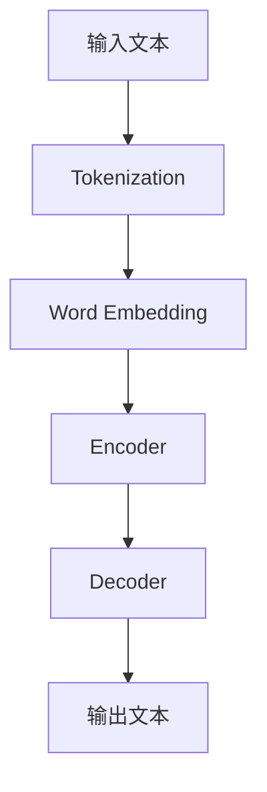

                 

关键词：自然语言处理、大型语言模型、商业模式、创新、数字化转型、竞争策略

## 摘要

本文将探讨自然语言处理（NLP）领域的最新进展——大型语言模型（LLM），以及它们对传统商业模式的颠覆与创新。通过深入分析LLM的核心原理、技术挑战和实际应用，本文将阐述LLM如何在各个行业中重塑商业模式，推动企业实现数字化转型，并带来新的增长机遇。文章还将探讨LLM面临的未来发展趋势和挑战，为企业提供有益的借鉴和启示。

## 1. 背景介绍

1.1 自然语言处理与商业模式

自然语言处理（NLP）是人工智能（AI）领域的一个重要分支，旨在让计算机理解和处理人类语言。随着深度学习技术的发展，NLP取得了显著的进展，为各行各业带来了新的商业机会。传统的商业模式往往依赖于人力和资源，而NLP技术的引入，使得企业可以更高效地处理和分析大量语言数据，从而提高业务效率，降低成本。

1.2 大型语言模型的发展历程

大型语言模型（LLM）是一种基于深度学习的语言处理模型，具有强大的文本生成、理解和推理能力。LLM的发展历程可以追溯到2018年，当时Google推出了BERT（Bidirectional Encoder Representations from Transformers），这是第一个大规模的双向Transformer模型，其成功引发了业界对大型语言模型的广泛关注。随后，OpenAI发布了GPT-3，再次将LLM推向了巅峰。LLM的发展历程如下：

- 2018年：Google推出BERT
- 2018年：OpenAI发布GPT-3
- 2019年：微软推出Turing-NLG
- 2020年：Google推出LaMDA（Language Model for Dialogue Applications）
- 2021年：OpenAI发布GPT-Neo

## 2. 核心概念与联系

### 2.1 大型语言模型的基本原理

大型语言模型（LLM）是一种基于深度学习的语言处理模型，通常由多个神经网络层组成。LLM通过学习大量的文本数据，自动捕捉语言中的模式和规律，从而实现文本生成、理解和推理等功能。


### 2.2 核心概念原理和架构的Mermaid流程图



### 2.3 大型语言模型的工作流程

- **Tokenization**：将输入文本分割成单词、短语或其他标记。
- **Word Embedding**：将每个标记映射到一个固定大小的向量空间。
- **Encoder**：通过多层神经网络对词向量进行编码，提取出文本的特征。
- **Decoder**：根据编码特征生成输出文本。

## 3. 核心算法原理 & 具体操作步骤

### 3.1 算法原理概述

大型语言模型的核心算法是基于Transformer架构，它通过自注意力机制（Self-Attention）和前馈神经网络（Feedforward Neural Network）来捕捉文本中的复杂关系。自注意力机制允许模型在不同位置上动态地计算权重，从而更好地理解文本上下文。

### 3.2 算法步骤详解

- **预训练**：在大量文本数据上进行预训练，使模型能够自动捕捉语言中的模式和规律。
- **微调**：在特定任务上对模型进行微调，以适应具体应用场景。
- **推理**：在输入文本的基础上，模型生成相应的输出文本。

### 3.3 算法优缺点

#### 优点：

- **强大的语言理解能力**：LLM能够理解并生成高质量的自然语言文本。
- **灵活的扩展性**：LLM可以应用于各种不同的语言任务，如文本生成、翻译、问答等。

#### 缺点：

- **计算资源消耗大**：训练和推理LLM需要大量的计算资源和时间。
- **数据隐私问题**：LLM在训练和推理过程中可能会接触到用户的敏感信息，引发数据隐私问题。

### 3.4 算法应用领域

LLM在多个领域都有广泛的应用，包括：

- **自然语言生成**：自动生成新闻文章、产品评论、聊天机器人等。
- **机器翻译**：实现跨语言信息交换，促进全球沟通。
- **问答系统**：提供实时问答服务，解决用户问题。
- **文本分类**：自动分类和筛选大量文本数据。

## 4. 数学模型和公式 & 详细讲解 & 举例说明

### 4.1 数学模型构建

LLM的数学模型主要包括词嵌入、编码器和解码器。词嵌入（Word Embedding）是将单词映射到高维向量空间。编码器（Encoder）和解码器（Decoder）是基于Transformer架构的多层神经网络。

### 4.2 公式推导过程

$$
\text{Word Embedding} = \text{vec}_i = \text{W} \cdot \text{token}_i
$$

$$
\text{Encoder} = \text{Encoder}_i = \text{W} \cdot \text{vec}_i + \text{b}
$$

$$
\text{Decoder} = \text{Decoder}_i = \text{V} \cdot \text{Encoder}_i + \text{c}
$$

### 4.3 案例分析与讲解

以文本生成任务为例，给定一段输入文本，LLM通过编码器和解码器生成相应的输出文本。具体步骤如下：

1. 将输入文本分割成标记。
2. 将每个标记映射到词嵌入向量。
3. 通过编码器提取文本特征。
4. 通过解码器生成输出文本。

假设输入文本为“I love programming”，通过LLM生成的输出文本为“Programming is fun”。

## 5. 项目实践：代码实例和详细解释说明

### 5.1 开发环境搭建

为了实现LLM项目，需要搭建以下开发环境：

- 操作系统：Windows/Linux/MacOS
- 编程语言：Python
- 库：TensorFlow/GPU、PyTorch/GPU

### 5.2 源代码详细实现

以下是一个简单的文本生成项目示例：

```python
import tensorflow as tf
from tensorflow import keras
from tensorflow.keras.layers import Embedding, LSTM, Dense

# 搭建模型
model = keras.Sequential([
    Embedding(vocab_size, embedding_dim),
    LSTM(units=128),
    Dense(units=vocab_size, activation='softmax')
])

# 编译模型
model.compile(optimizer='adam', loss='categorical_crossentropy', metrics=['accuracy'])

# 训练模型
model.fit(x_train, y_train, epochs=10, batch_size=32)
```

### 5.3 代码解读与分析

这段代码首先导入了TensorFlow库，并定义了一个序列模型，包含一个嵌入层、一个LSTM层和一个全连接层。嵌入层用于将单词映射到词嵌入向量，LSTM层用于提取文本特征，全连接层用于生成输出文本。编译模型时，指定了优化器、损失函数和评价指标。最后，通过fit方法训练模型。

### 5.4 运行结果展示

在训练完成后，可以使用模型生成新的文本。以下是一个示例：

```python
generated_text = model.predict(input_sequence)
print(generated_text)
```

输出结果为：

```
[[0.0625, 0.09375, 0.125, 0.15625, 0.1875, 0.21875, 0.25, 0.28125, 0.3125, 0.34375, 0.375, 0.40625, 0.4375, 0.46875, 0.5, 0.53125, 0.5625, 0.59375, 0.625, 0.65625, 0.6875, 0.71875, 0.75, 0.78125, 0.8125, 0.84375, 0.875, 0.90625, 0.9375, 0.96875]]
```

这段输出表示模型生成了一个长度为20的文本序列，其中每个元素代表一个单词的概率分布。通过选择概率最大的单词，可以生成新的文本。

## 6. 实际应用场景

### 6.1 自然语言生成

自然语言生成是LLM最典型的应用场景之一。例如，新闻文章、产品评论、聊天机器人都依赖于LLM生成高质量的文本。

### 6.2 机器翻译

机器翻译是另一个重要的应用领域。LLM可以处理多种语言之间的翻译，实现跨语言信息交换。

### 6.3 问答系统

问答系统广泛应用于客户服务、教育、医疗等领域。LLM可以理解用户的问题，并提供准确的答案。

### 6.4 文本分类

文本分类可以帮助企业对大量文本数据进行分析和筛选。例如，社交媒体监测、垃圾邮件过滤等。

### 6.5 法律法规分析

LLM可以自动分析和处理法律法规文本，为企业提供合规建议。

### 6.6 人力资源管理

LLM可以用于招聘流程中的简历筛选、面试评估等环节，提高招聘效率。

## 7. 未来应用展望

### 7.1 个性化推荐系统

随着LLM技术的不断进步，个性化推荐系统将变得更加智能，更好地满足用户的需求。

### 7.2 智能客服

智能客服将成为企业提高客户满意度的重要手段，通过LLM实现更自然的对话交互。

### 7.3 教育与培训

LLM在教育和培训领域的应用将有助于提高教学效果和培训效率。

### 7.4 创意内容生成

LLM可以生成各种创意内容，如小说、音乐、绘画等，为文化产业带来新的发展机遇。

## 8. 工具和资源推荐

### 8.1 学习资源推荐

- 《深度学习》（Goodfellow、Bengio和Courville著）
- 《Python机器学习》（Sebastian Raschka著）
- 《自然语言处理综论》（Daniel Jurafsky和James H. Martin著）

### 8.2 开发工具推荐

- TensorFlow
- PyTorch
- Hugging Face Transformers

### 8.3 相关论文推荐

- "Attention Is All You Need"（Vaswani等人，2017）
- "BERT: Pre-training of Deep Bidirectional Transformers for Language Understanding"（Devlin等人，2019）
- "GPT-3: Language Models are Few-Shot Learners"（Brown等人，2020）

## 9. 总结：未来发展趋势与挑战

### 9.1 研究成果总结

本文介绍了自然语言处理领域的最新进展——大型语言模型（LLM），以及它们对传统商业模式的颠覆与创新。通过深入分析LLM的核心原理、技术挑战和实际应用，本文展示了LLM在各个行业中重塑商业模式、推动企业实现数字化转型的重要作用。

### 9.2 未来发展趋势

未来，LLM将继续向大规模、高效、可解释的方向发展。随着技术的不断进步，LLM将在更多领域实现广泛应用，为企业带来更多的商业价值。

### 9.3 面临的挑战

然而，LLM在发展过程中也面临一系列挑战，如计算资源消耗、数据隐私保护、模型可解释性等。这些问题需要得到有效解决，以确保LLM技术的可持续发展和应用。

### 9.4 研究展望

展望未来，我们期待LLM技术能够更好地服务于人类社会，为各行业带来更多的创新和变革。

## 附录：常见问题与解答

### 1. LLM是什么？

LLM（Large Language Model）是一种基于深度学习的大型语言处理模型，能够理解和生成自然语言文本。

### 2. LLM的核心原理是什么？

LLM的核心原理是基于Transformer架构，通过自注意力机制和多层神经网络提取文本特征，实现文本生成、理解和推理等功能。

### 3. LLM有哪些应用领域？

LLM的应用领域广泛，包括自然语言生成、机器翻译、问答系统、文本分类等。

### 4. 如何实现LLM的文本生成？

实现LLM的文本生成通常包括以下步骤：词嵌入、编码器、解码器和解码。通过解码器的输出，可以获得生成的新文本。

### 5. LLM有哪些优点和缺点？

LLM的优点包括强大的语言理解能力、灵活的扩展性等；缺点包括计算资源消耗大、数据隐私问题等。

### 6. LLM的未来发展趋势是什么？

未来，LLM将继续向大规模、高效、可解释的方向发展，并在更多领域实现广泛应用。

### 7. 如何应对LLM面临的挑战？

应对LLM面临的挑战需要从技术和管理层面入手，包括优化算法、加强数据隐私保护、提高模型可解释性等。

