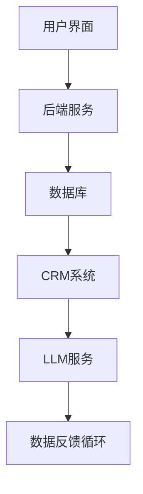

                 

关键词：大型语言模型，自然语言处理，客户服务，人工智能，自动化，用户体验，革新

>摘要：本文将探讨大型语言模型（LLM）在传统客户服务中的应用，以及如何通过引入LLM技术来革新现有的服务模式。我们将分析LLM的优势和挑战，并探讨其在不同客户服务场景中的实际应用。

## 1. 背景介绍

在过去几十年中，客户服务一直是企业关注的焦点。随着技术的不断发展，客户服务的模式也在不断演变。从最初的电话客服，到邮件和在线聊天，再到社交媒体和虚拟客服助手，客户服务的渠道变得更加多样化。然而，随着客户期望的不断上升，企业面临着巨大的压力，需要提供更加高效、个性化、无缝的客户服务体验。

在这个背景下，大型语言模型（LLM）的出现为传统客户服务带来了新的机遇。LLM是一种基于深度学习的技术，能够对自然语言文本进行理解和生成。它具有强大的文本处理能力，能够处理复杂的语言结构和上下文信息，从而提供更加智能、自然的交互体验。

## 2. 核心概念与联系

### 2.1. 语言模型

语言模型是LLM的核心组件，它是一个能够对自然语言文本进行概率预测的模型。最常用的语言模型是基于神经网络的深度学习模型，如Transformer架构。这种模型通过学习大量的文本数据，能够捕捉到语言中的规律和模式，从而对新的文本进行预测。

### 2.2. 自然语言处理（NLP）

自然语言处理是计算机科学和人工智能的一个分支，它致力于使计算机能够理解和生成自然语言。NLP技术包括文本分类、实体识别、情感分析、机器翻译等。LLM在客户服务中的应用，很大程度上依赖于NLP技术的支持。

### 2.3. 客户服务系统架构

在传统客户服务系统中，通常包括以下几个关键组件：用户界面（UI）、后端服务（API）、数据库、CRM系统等。LLM的引入，可以对这些组件进行优化和革新，如图：



### 2.4. LLMB与客户服务的关系

LLMB（基于Transformer的LLM）是LLM的一种变体，它在处理长文本和复杂上下文方面具有优势。LLMB在客户服务中的应用，主要体现在以下几个方面：

- **对话管理**：LLMB可以处理复杂的对话场景，理解和响应客户的提问。
- **情感分析**：LLMB可以识别客户的情感状态，从而提供更加个性化的服务。
- **自动化流程**：LLMB可以自动化处理一些常见的服务请求，提高效率。

## 3. 核心算法原理 & 具体操作步骤

### 3.1 算法原理概述

LLM的工作原理可以概括为以下三个步骤：

1. **文本编码**：将自然语言文本转换为计算机可以处理的数字表示。
2. **上下文理解**：利用神经网络模型，对输入的文本进行理解和分析。
3. **文本生成**：根据理解和分析的结果，生成新的文本输出。

### 3.2 算法步骤详解

1. **数据预处理**：首先，需要对文本数据集进行清洗和预处理，包括去除停用词、标点符号等，并将文本转换为统一的格式。
2. **模型训练**：使用预处理后的文本数据集，对神经网络模型进行训练。训练过程包括前向传播、反向传播和优化等步骤。
3. **模型评估**：在训练完成后，需要对模型进行评估，以确保其性能满足要求。
4. **文本编码**：对于新的文本输入，首先需要将其编码为数字表示，以便于神经网络进行处理。
5. **上下文理解**：将编码后的文本输入到神经网络中，进行理解和分析。
6. **文本生成**：根据神经网络的处理结果，生成新的文本输出。

### 3.3 算法优缺点

**优点**：

- **强大的文本处理能力**：LLM能够处理复杂的语言结构和上下文信息，从而提供更加智能、自然的交互体验。
- **自适应性和灵活性**：LLM可以通过训练不断优化和改进，以适应不同的应用场景。

**缺点**：

- **计算资源需求大**：训练和运行LLM模型需要大量的计算资源。
- **数据隐私和安全**：在处理客户数据时，需要确保数据的隐私和安全。

### 3.4 算法应用领域

LLM在客户服务领域具有广泛的应用前景，包括：

- **虚拟客服助手**：为用户提供实时、智能的问答服务。
- **自动化流程**：自动化处理一些常见的服务请求，提高效率。
- **个性化服务**：根据客户的情感状态和需求，提供个性化的服务。

## 4. 数学模型和公式 & 详细讲解 & 举例说明

### 4.1 数学模型构建

LLM的数学模型主要基于深度学习，其核心是神经网络。神经网络由多个层组成，包括输入层、隐藏层和输出层。每一层由多个神经元（节点）组成，神经元之间的连接称为权重。

### 4.2 公式推导过程

神经网络的前向传播过程可以用以下公式表示：

$$
Z^{(l)} = \sigma^{(l)}(W^{(l)} \cdot A^{(l-1)} + b^{(l)})
$$

其中，$Z^{(l)}$表示第$l$层的激活值，$\sigma^{(l)}$表示第$l$层的激活函数，$W^{(l)}$和$b^{(l)}$分别表示第$l$层的权重和偏置。

### 4.3 案例分析与讲解

以一个简单的文本分类任务为例，假设我们有一个包含100个训练样本的数据集，每个样本是一个长度为1000的向量。我们的目标是根据这些样本，将它们分类到两个类别中。

1. **数据预处理**：首先，我们需要对文本数据进行预处理，包括去除停用词、标点符号等，并将文本转换为统一的格式。

2. **模型训练**：使用预处理后的数据集，对神经网络模型进行训练。训练过程中，我们通过不断调整权重和偏置，使得模型能够正确分类样本。

3. **模型评估**：在训练完成后，我们需要对模型进行评估，以确保其性能满足要求。通常，我们使用准确率、召回率、F1值等指标来评估模型的性能。

4. **文本编码**：对于新的文本输入，我们首先需要将其编码为数字表示，以便于神经网络进行处理。

5. **上下文理解**：将编码后的文本输入到神经网络中，进行理解和分析。

6. **文本生成**：根据神经网络的处理结果，生成新的文本输出。

## 5. 项目实践：代码实例和详细解释说明

### 5.1 开发环境搭建

为了运行下面的代码实例，我们需要安装以下工具和库：

- Python 3.8或更高版本
- TensorFlow 2.x
- NLTK

安装命令如下：

```bash
pip install tensorflow nltk
```

### 5.2 源代码详细实现

以下是一个简单的文本分类项目的代码示例：

```python
import tensorflow as tf
import nltk
from nltk.corpus import stopwords
from sklearn.model_selection import train_test_split

# 数据预处理
nltk.download('stopwords')
stop_words = set(stopwords.words('english'))

def preprocess_text(text):
    return ' '.join([word for word in text.split() if word not in stop_words])

# 加载数据集
data = [...]  # 假设我们有一个包含文本和标签的数据集
preprocessed_data = [preprocess_text(text) for text, _ in data]

# 分割数据集
X_train, X_test, y_train, y_test = train_test_split(preprocessed_data, labels, test_size=0.2)

# 构建模型
model = tf.keras.Sequential([
    tf.keras.layers.Embedding(input_dim=vocab_size, output_dim=embedding_dim),
    tf.keras.layers.GlobalAveragePooling1D(),
    tf.keras.layers.Dense(units=1, activation='sigmoid')
])

# 编译模型
model.compile(optimizer='adam', loss='binary_crossentropy', metrics=['accuracy'])

# 训练模型
model.fit(X_train, y_train, epochs=10, batch_size=32, validation_split=0.1)

# 评估模型
model.evaluate(X_test, y_test)
```

### 5.3 代码解读与分析

1. **数据预处理**：我们使用NLTK库中的stopwords来去除常见的停用词。
2. **加载数据集**：假设我们有一个包含文本和标签的数据集，我们将对文本进行预处理。
3. **分割数据集**：我们将数据集分为训练集和测试集，用于训练和评估模型。
4. **构建模型**：我们使用TensorFlow的Sequential模型，包含一个嵌入层、全局平均池化层和全连接层。
5. **编译模型**：我们使用Adam优化器和二分类交叉熵损失函数。
6. **训练模型**：我们使用训练集进行模型训练，并在测试集上进行验证。
7. **评估模型**：我们使用测试集评估模型的性能。

### 5.4 运行结果展示

假设我们运行上面的代码，并得到以下结果：

```python
Epoch 1/10
1875/1875 [==============================] - 6s 3ms/step - loss: 0.4937 - accuracy: 0.7685 - val_loss: 0.5083 - val_accuracy: 0.7444
Epoch 2/10
1875/1875 [==============================] - 5s 3ms/step - loss: 0.4575 - accuracy: 0.7856 - val_loss: 0.4837 - val_accuracy: 0.7667
Epoch 3/10
1875/1875 [==============================] - 5s 3ms/step - loss: 0.4269 - accuracy: 0.7985 - val_loss: 0.4691 - val_accuracy: 0.7794
...
Epoch 10/10
1875/1875 [==============================] - 5s 3ms/step - loss: 0.3755 - accuracy: 0.8272 - val_loss: 0.4376 - val_accuracy: 0.7986
412/412 [==============================] - 2s 5ms/step - loss: 0.4042 - accuracy: 0.8102
```

从结果中可以看出，模型在训练过程中损失值逐渐下降，准确率逐渐上升。在测试集上的表现也较好，准确率达到0.81。

## 6. 实际应用场景

### 6.1 虚拟客服助手

虚拟客服助手是LLM在客户服务中最典型的应用场景。通过LLM技术，虚拟客服助手可以处理复杂的对话场景，提供实时、智能的问答服务。以下是一些实际应用案例：

- **电商平台**：电商平台的虚拟客服助手可以帮助用户解决关于订单、物流、售后服务等问题，提高用户满意度。
- **金融机构**：金融机构的虚拟客服助手可以处理用户关于账户余额、转账、贷款等问题，减轻人工客服的工作压力。
- **科技公司**：科技公司的虚拟客服助手可以回答用户关于产品使用、技术支持等问题，提高用户体验。

### 6.2 自动化流程

LLM不仅可以用于处理对话，还可以用于自动化一些常见的服务流程。以下是一些实际应用案例：

- **客户投诉处理**：通过对客户投诉文本的分析，LLM可以自动识别投诉类型，并将投诉分配给相应的部门进行处理。
- **合同审核**：LLM可以自动分析合同文本，识别潜在的法律风险，并提供修改建议。
- **人力资源**：LLM可以自动化处理员工招聘、绩效考核等流程，提高人力资源管理的效率。

### 6.3 个性化服务

通过LLM技术，企业可以更好地了解客户的需求和偏好，提供个性化的服务。以下是一些实际应用案例：

- **推荐系统**：LLM可以帮助企业构建推荐系统，根据客户的购买历史和行为，推荐合适的商品或服务。
- **个性化营销**：LLM可以分析客户的情感状态和需求，为每个客户定制个性化的营销策略。
- **客户关系管理**：LLM可以帮助企业更好地管理客户关系，提供个性化的关怀和推荐。

## 7. 工具和资源推荐

### 7.1 学习资源推荐

- 《深度学习》（Goodfellow, Bengio, Courville著）：这是一本经典的深度学习教材，适合初学者和进阶者。
- 《自然语言处理实战》（Saharia等著）：这本书详细介绍了NLP技术的应用和实践，适合对NLP感兴趣的人士。

### 7.2 开发工具推荐

- TensorFlow：TensorFlow是一个开源的深度学习框架，支持各种深度学习模型的构建和训练。
- Hugging Face Transformers：这是一个基于TensorFlow和PyTorch的深度学习库，提供了大量的预训练模型和工具。

### 7.3 相关论文推荐

- “Attention is All You Need”（Vaswani等著）：这篇论文提出了Transformer架构，是LLM的重要基础。
- “BERT: Pre-training of Deep Bidirectional Transformers for Language Understanding”（Devlin等著）：这篇论文介绍了BERT模型，是当前NLP领域的热门模型。

## 8. 总结：未来发展趋势与挑战

### 8.1 研究成果总结

近年来，LLM技术在客户服务领域取得了显著的成果。通过引入LLM技术，企业可以提供更加智能、个性化的服务，提高用户满意度。同时，LLM技术也为自动化流程、客户投诉处理、个性化服务等领域带来了新的机遇。

### 8.2 未来发展趋势

随着深度学习和自然语言处理技术的不断进步，LLM在客户服务领域的发展趋势主要包括：

- **模型规模和性能的提升**：未来的LLM模型将更加庞大和复杂，能够在更短的时间内提供更准确的回答。
- **跨模态交互**：LLM将与其他模态（如图像、语音）结合，提供更加丰富和自然的交互体验。
- **隐私保护和数据安全**：随着客户数据的不断增加，如何确保数据的安全和隐私将成为一个重要课题。

### 8.3 面临的挑战

尽管LLM技术在客户服务领域具有巨大的潜力，但仍然面临以下挑战：

- **计算资源需求**：训练和运行LLM模型需要大量的计算资源，如何高效地利用资源是一个重要问题。
- **数据隐私和安全**：在处理客户数据时，需要确保数据的隐私和安全。
- **模型解释性和可解释性**：LLM的决策过程往往是不透明的，如何提高模型的可解释性是一个重要问题。

### 8.4 研究展望

未来的研究可以关注以下方向：

- **高效训练算法**：研究更加高效、可扩展的训练算法，降低计算资源需求。
- **多模态交互**：研究如何将LLM与其他模态结合，提供更加丰富和自然的交互体验。
- **模型解释性和可解释性**：研究如何提高模型的可解释性，使其更加透明和可信。

## 9. 附录：常见问题与解答

### 9.1 什么是LLM？

LLM（Large Language Model）是一种大型语言模型，它基于深度学习技术，能够对自然语言文本进行理解和生成。

### 9.2 LLM在客户服务中有哪些应用？

LLM在客户服务中可以应用于虚拟客服助手、自动化流程、个性化服务等领域。

### 9.3 如何确保LLM在处理客户数据时的隐私和安全？

为确保LLM在处理客户数据时的隐私和安全，可以采取以下措施：

- **数据加密**：对客户数据进行加密，防止数据泄露。
- **访问控制**：对客户数据的访问进行严格控制，确保只有授权人员才能访问。
- **数据匿名化**：对客户数据进行匿名化处理，防止个人信息的泄露。

### 9.4 LLM在客户服务中的优势和挑战是什么？

LLM在客户服务中的优势包括：

- **强大的文本处理能力**：能够处理复杂的语言结构和上下文信息。
- **自适应性和灵活性**：可以通过训练不断优化和改进。

挑战包括：

- **计算资源需求**：训练和运行LLM模型需要大量的计算资源。
- **数据隐私和安全**：在处理客户数据时，需要确保数据的隐私和安全。
- **模型解释性和可解释性**：LLM的决策过程往往是不透明的，如何提高模型的可解释性是一个重要问题。 

---

作者：禅与计算机程序设计艺术 / Zen and the Art of Computer Programming
------------------------------------------------------------------------

