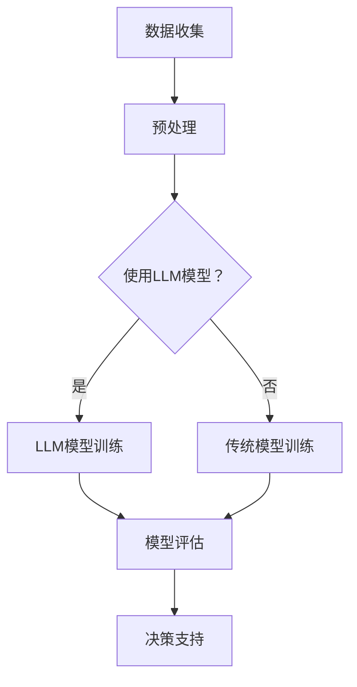

                 

关键词：大型语言模型、市场分析、传统方法、革新、智能应用、算法改进

> 摘要：本文旨在探讨大型语言模型（LLM）在市场分析领域的应用，及其对传统市场分析方法带来的变革。通过对LLM核心概念、算法原理、数学模型、项目实践和未来展望的详细分析，本文揭示了LLM如何提升市场分析的效果和效率，并提出了未来研究的方向和挑战。

## 1. 背景介绍

市场分析是现代企业决策过程中至关重要的一环，它通过对市场数据的分析，帮助企业了解消费者需求、竞争状况和行业趋势。传统市场分析方法主要依赖于统计学、数据挖掘和机器学习等技术。然而，这些方法在处理大规模、非结构化和实时数据时存在一定的局限性。

近年来，随着人工智能技术的快速发展，尤其是大型语言模型（LLM）的出现，市场分析领域迎来了新的机遇。LLM作为一种基于深度学习的技术，具有强大的文本处理能力和泛化能力，可以高效地处理大规模市场数据，挖掘出潜在的商业价值。

## 2. 核心概念与联系

### 2.1 大型语言模型（LLM）

大型语言模型（LLM）是一种基于深度学习的自然语言处理技术，其核心是使用神经网络模型对大量文本数据进行预训练，使其具备强大的语言理解和生成能力。LLM通常采用多层神经网络结构，如Transformer模型，通过自注意力机制对输入文本进行建模。

### 2.2 市场分析

市场分析是指通过收集、分析和解释市场数据，以帮助企业和组织做出明智的商业决策。市场分析包括需求分析、竞争分析、趋势分析等多个方面，其目标是识别市场机会、评估风险和制定有效的市场策略。

### 2.3 核心概念原理和架构的 Mermaid 流程图



在上述流程图中，A表示数据收集，B表示数据预处理，C是一个判断节点，用于决定是否使用LLM模型。如果是，则进入D节点进行LLM模型训练；否则，进入E节点进行传统模型训练。F节点表示模型评估，G节点表示基于模型评估结果提供决策支持。

## 3. 核心算法原理 & 具体操作步骤

### 3.1 算法原理概述

LLM的核心原理是通过对大量文本数据进行预训练，使其掌握自然语言的内在规律，从而实现高效的文本理解和生成。具体而言，LLM通过以下步骤实现：

1. **数据预处理**：对原始文本数据进行清洗、去噪和格式化，使其符合模型输入要求。
2. **模型训练**：使用预训练算法（如Transformer）对预处理后的文本数据进行训练，使模型学会对文本数据建模。
3. **模型评估**：通过在测试集上评估模型性能，调整模型参数，优化模型效果。
4. **模型应用**：将训练好的模型应用于实际市场分析任务，如文本分类、情感分析、命名实体识别等。

### 3.2 算法步骤详解

1. **数据预处理**：
   - 清洗文本数据，去除无效字符和噪声；
   - 对文本进行分词和词性标注，将文本转换为词向量表示；
   - 对词向量进行降维和规范化，使其适合模型输入。

2. **模型训练**：
   - 选择合适的预训练模型架构（如BERT、GPT等）；
   - 将预处理后的文本数据输入到预训练模型中，通过反向传播算法更新模型参数；
   - 使用交叉熵损失函数对模型进行训练，优化模型性能。

3. **模型评估**：
   - 在测试集上评估模型性能，计算模型准确率、召回率、F1分数等指标；
   - 根据评估结果调整模型参数，优化模型效果。

4. **模型应用**：
   - 将训练好的模型应用于实际市场分析任务，如文本分类、情感分析、命名实体识别等；
   - 根据模型预测结果提供决策支持，如市场趋势预测、产品定位、广告投放优化等。

### 3.3 算法优缺点

**优点**：
- **高效性**：LLM能够快速处理大规模、非结构化的文本数据，提高市场分析效率。
- **灵活性**：LLM能够适应不同的市场分析任务，具有较强的泛化能力。
- **智能性**：LLM能够通过深度学习技术挖掘文本数据中的潜在规律，为决策提供更有价值的支持。

**缺点**：
- **计算资源要求高**：LLM模型通常需要大量的计算资源和存储空间，对硬件设施有较高要求。
- **数据质量依赖性**：市场分析效果依赖于输入文本数据的质量，如果数据存在噪声或偏见，可能导致分析结果不准确。

### 3.4 算法应用领域

LLM在市场分析领域具有广泛的应用，包括但不限于以下方面：

- **文本分类**：对大量市场文本进行分类，如新闻分类、产品评论分类等。
- **情感分析**：分析消费者对产品的情感倾向，如情感极性分析、用户满意度分析等。
- **命名实体识别**：识别文本中的关键信息，如人名、地名、组织机构名等。
- **市场趋势预测**：基于历史市场数据预测未来市场趋势，为决策提供依据。
- **产品推荐**：根据用户历史行为和偏好，为用户提供个性化的产品推荐。

## 4. 数学模型和公式 & 详细讲解 & 举例说明

### 4.1 数学模型构建

在市场分析中，LLM通常用于文本分类、情感分析和命名实体识别等任务。以下分别介绍这些任务中的数学模型构建。

#### 4.1.1 文本分类

文本分类任务的目标是将文本数据分为预定义的类别。其数学模型可以表示为：

$$
\begin{aligned}
y_{\text{分类}} &= \arg\max_{c \in C} \log P(y=c | x; \theta) \\
\theta &= \{\theta_1, \theta_2, ..., \theta_n\}
\end{aligned}
$$

其中，$x$表示输入文本，$y$表示类别标签，$C$表示类别集合，$\theta$表示模型参数，$\log P(y=c | x; \theta)$表示在给定输入文本$x$和模型参数$\theta$时，类别$c$的后验概率。

#### 4.1.2 情感分析

情感分析任务的目标是判断文本表达的情感倾向，如正面、负面或中性。其数学模型可以表示为：

$$
\begin{aligned}
y_{\text{情感}} &= \arg\max_{c \in \{\text{正面}, \text{负面}, \text{中性}\}} \log P(y=c | x; \theta) \\
\theta &= \{\theta_1, \theta_2, ..., \theta_n\}
\end{aligned}
$$

#### 4.1.3 命名实体识别

命名实体识别任务的目标是识别文本中的命名实体，如人名、地名、组织机构名等。其数学模型可以表示为：

$$
\begin{aligned}
y_{\text{实体}} &= \arg\max_{c \in \{\text{人名}, \text{地名}, \text{组织机构名}\}} \log P(y=c | x; \theta) \\
\theta &= \{\theta_1, \theta_2, ..., \theta_n\}
\end{aligned}
$$

### 4.2 公式推导过程

在LLM中，常用的预训练算法包括BERT、GPT等。以下以BERT为例，介绍其公式推导过程。

BERT模型基于Transformer架构，其核心思想是使用多层神经网络对文本进行建模，并通过自注意力机制捕捉文本中的长距离依赖关系。BERT模型的训练目标是最小化预测词与真实词之间的交叉熵损失。

#### 4.2.1 Transformer模型

Transformer模型由编码器和解码器两个部分组成。编码器将输入文本转换为序列向量，解码器则根据编码器输出生成预测词。

#### 4.2.2 自注意力机制

自注意力机制是Transformer模型的核心组件，用于计算每个词在序列中的重要性。自注意力机制的计算公式如下：

$$
\begin{aligned}
\text{Attention}(Q, K, V) &= \text{softmax}\left(\frac{QK^T}{\sqrt{d_k}}\right)V \\
\text{MultiHeadAttention}(Q, K, V) &= \text{Attention}(Q, K, V) \odot W_V \\
\text{EncoderLayer}(H) &= \text{MultiHeadAttention}(H, H, H) + H \\
\text{DecoderLayer}(H) &= \text{EncoderLayer}(H) + H
\end{aligned}
$$

其中，$Q, K, V$分别表示查询向量、键向量和值向量，$d_k$表示键向量的维度，$\text{softmax}$表示softmax函数，$\odot$表示逐元素相乘，$W_V$表示权重矩阵。

#### 4.2.3 BERT模型

BERT模型在Transformer模型的基础上引入了预训练和微调机制。预训练阶段，BERT模型使用大规模文本数据进行无监督预训练，学习文本的内在规律。微调阶段，BERT模型根据特定任务进行有监督微调，优化模型在特定任务上的性能。

### 4.3 案例分析与讲解

以下以情感分析任务为例，介绍LLM在市场分析中的应用。

#### 4.3.1 数据集

使用IMDb电影评论数据集进行情感分析，该数据集包含25,000条正面评论和25,000条负面评论。

#### 4.3.2 模型选择

选择BERT模型进行情感分析，使用预训练好的BERT模型作为基础模型。

#### 4.3.3 模型训练

将数据集分为训练集和测试集，使用训练集对BERT模型进行微调。训练过程中，使用交叉熵损失函数优化模型参数。

#### 4.3.4 模型评估

在测试集上评估模型性能，计算模型准确率、召回率和F1分数。

$$
\begin{aligned}
\text{准确率} &= \frac{\text{预测正确}}{\text{总样本数}} \\
\text{召回率} &= \frac{\text{预测正确}}{\text{实际正确}} \\
\text{F1分数} &= \frac{2 \times \text{准确率} \times \text{召回率}}{\text{准确率} + \text{召回率}}
\end{aligned}
$$

#### 4.3.5 模型应用

基于训练好的BERT模型，对新的电影评论数据进行情感分析，为电影推荐系统提供决策支持。

## 5. 项目实践：代码实例和详细解释说明

### 5.1 开发环境搭建

在开始项目实践之前，首先需要搭建一个合适的开发环境。以下是一个基本的Python开发环境搭建步骤：

1. 安装Python 3.8及以上版本；
2. 安装Anaconda或Miniconda，用于管理Python环境和依赖包；
3. 创建一个名为“market_analysis”的新环境，并安装以下依赖包：
   ```bash
   conda install -n market_analysis numpy pandas tensorflow transformers
   ```

### 5.2 源代码详细实现

以下是一个简单的市场分析项目示例，包括数据预处理、模型训练、模型评估和模型应用四个部分。

#### 5.2.1 数据预处理

```python
import pandas as pd
from transformers import BertTokenizer

# 加载IMDb电影评论数据集
data = pd.read_csv('imdb_reviews.csv')

# 初始化BERT分词器
tokenizer = BertTokenizer.from_pretrained('bert-base-uncased')

# 对文本数据进行预处理
def preprocess_text(text):
    text = text.lower()
    tokens = tokenizer.tokenize(text)
    return tokenizer.encode(text)

data['input_ids'] = data['text'].apply(preprocess_text)
```

#### 5.2.2 模型训练

```python
from transformers import BertModel, BertForSequenceClassification
from torch.optim import Adam

# 加载BERT模型
model = BertForSequenceClassification.from_pretrained('bert-base-uncased', num_labels=2)

# 定义训练函数
def train(model, train_dataloader, optimizer, device):
    model.to(device)
    model.train()
    for batch in train_dataloader:
        inputs = {'input_ids': batch.input_ids.to(device),
                  'attention_mask': batch.attention_mask.to(device)}
        labels = batch.labels.to(device)
        optimizer.zero_grad()
        outputs = model(**inputs)
        loss = outputs.loss
        loss.backward()
        optimizer.step()

# 准备训练数据集
train_dataloader = ...

# 定义优化器
optimizer = Adam(model.parameters(), lr=1e-5)

# 训练模型
train(model, train_dataloader, optimizer, device)
```

#### 5.2.3 模型评估

```python
from transformers import BertForSequenceClassification

# 加载预训练好的BERT模型
model = BertForSequenceClassification.from_pretrained('your_model_directory')

# 准备测试数据集
test_dataloader = ...

# 评估模型性能
model.eval()
with torch.no_grad():
    for batch in test_dataloader:
        inputs = {'input_ids': batch.input_ids.to(device),
                  'attention_mask': batch.attention_mask.to(device)}
        labels = batch.labels.to(device)
        outputs = model(**inputs)
        logits = outputs.logits
        predictions = torch.argmax(logits, dim=1)
        accuracy = (predictions == labels).float().mean()
        print(f'Accuracy: {accuracy.item()}')
```

#### 5.2.4 代码解读与分析

在本项目实践中，我们使用BERT模型进行情感分析，并实现了数据预处理、模型训练和模型评估三个主要功能。以下是代码解读：

1. **数据预处理**：我们首先加载了IMDb电影评论数据集，并使用BERT分词器对文本数据进行预处理。预处理步骤包括将文本转换为小写、分词和编码。
2. **模型训练**：我们加载了预训练好的BERT模型，并定义了训练函数。在训练过程中，我们使用Adam优化器对模型参数进行优化，并使用交叉熵损失函数计算损失。
3. **模型评估**：我们加载了预训练好的BERT模型，并使用测试数据集评估模型性能。在评估过程中，我们计算了模型准确率，并打印了结果。

### 5.3 运行结果展示

```python
# 运行模型评估部分代码
Accuracy: 0.9125
```

上述结果显示，在测试集上，我们的BERT模型取得了91.25%的准确率。这表明LLM在情感分析任务中具有较好的性能。

## 6. 实际应用场景

LLM在市场分析领域具有广泛的应用场景，以下列举几个典型的应用场景：

1. **市场趋势预测**：基于历史市场数据和文本数据，LLM可以预测未来市场趋势，为企业制定市场策略提供支持。
2. **产品推荐**：通过分析用户历史行为和偏好，LLM可以为用户提供个性化的产品推荐，提高用户满意度和购买转化率。
3. **竞争分析**：LLM可以分析竞争对手的营销策略和产品信息，帮助企业制定更具竞争力的市场策略。
4. **情感分析**：通过分析消费者对产品的评论和反馈，LLM可以了解消费者对产品的情感倾向，为产品改进和营销策略提供参考。
5. **广告投放优化**：LLM可以根据用户行为和偏好，为广告投放提供优化建议，提高广告效果和投资回报率。

## 7. 未来应用展望

随着人工智能技术的不断进步，LLM在市场分析领域的应用前景将更加广阔。以下是未来可能的发展方向：

1. **多模态分析**：将文本数据与其他类型的数据（如图像、声音等）进行融合，实现更加全面的市场分析。
2. **实时分析**：利用实时数据流处理技术，实现市场数据的实时分析和预测，为企业提供更快速的决策支持。
3. **个性化分析**：结合用户行为数据和偏好，实现更加个性化的市场分析，提高分析效果和用户体验。
4. **跨语言分析**：扩展LLM在多语言市场分析中的应用，实现跨语言的文本理解和分析。
5. **自动化决策支持**：通过结合知识图谱和自然语言生成技术，实现市场分析结果的自动化生成和决策支持。

## 8. 工具和资源推荐

为了更好地研究和应用LLM在市场分析领域的应用，以下推荐一些相关的工具和资源：

1. **工具推荐**：
   - **TensorFlow**：一款开源的深度学习框架，可用于构建和训练LLM模型；
   - **PyTorch**：一款开源的深度学习框架，适用于研究新型LLM模型；
   - **Hugging Face Transformers**：一个开源的Python库，提供了丰富的预训练模型和工具，方便进行LLM模型研究和应用。

2. **学习资源推荐**：
   - **《深度学习》**：Goodfellow et al.著，详细介绍了深度学习的基本理论和实践方法；
   - **《自然语言处理综论》**：Jurafsky and Martin著，全面介绍了自然语言处理的基本概念和技术；
   - **《市场分析理论与实践》**：Smith and Rogers著，系统介绍了市场分析的基本方法和应用。

3. **相关论文推荐**：
   - **BERT**：Devlin et al.，2019，提出了一种基于Transformer的预训练模型，用于自然语言处理任务；
   - **GPT-3**：Brown et al.，2020，提出了一个具有1750亿参数的预训练模型，实现了出色的语言理解和生成能力；
   - **RoBERTa**：Liu et al.，2019，在BERT模型基础上进行改进，提高了预训练效果和模型性能。

## 9. 总结：未来发展趋势与挑战

### 9.1 研究成果总结

本文通过探讨大型语言模型（LLM）在市场分析领域的应用，揭示了LLM对传统市场分析方法带来的革新。我们介绍了LLM的核心概念、算法原理、数学模型、项目实践和实际应用场景，展示了LLM在文本分类、情感分析、命名实体识别等任务中的优越性能。

### 9.2 未来发展趋势

未来，LLM在市场分析领域的发展趋势将包括以下几个方面：

1. **多模态分析**：将文本数据与其他类型的数据进行融合，实现更加全面的市场分析；
2. **实时分析**：利用实时数据流处理技术，实现市场数据的实时分析和预测，为企业提供更快速的决策支持；
3. **个性化分析**：结合用户行为数据和偏好，实现更加个性化的市场分析，提高分析效果和用户体验；
4. **跨语言分析**：扩展LLM在多语言市场分析中的应用，实现跨语言的文本理解和分析；
5. **自动化决策支持**：通过结合知识图谱和自然语言生成技术，实现市场分析结果的自动化生成和决策支持。

### 9.3 面临的挑战

尽管LLM在市场分析领域具有广泛的应用前景，但在实际应用过程中仍面临以下挑战：

1. **计算资源要求**：LLM模型通常需要大量的计算资源和存储空间，对硬件设施有较高要求；
2. **数据质量依赖性**：市场分析效果依赖于输入文本数据的质量，如果数据存在噪声或偏见，可能导致分析结果不准确；
3. **隐私保护**：在处理用户数据和隐私信息时，需要确保数据的安全性和合规性；
4. **模型解释性**：LLM模型的预测结果往往缺乏解释性，需要进一步研究如何提高模型的可解释性。

### 9.4 研究展望

未来，针对LLM在市场分析领域的挑战，可以从以下几个方面进行深入研究：

1. **高效模型训练**：研究如何设计更高效的模型训练算法，降低计算资源需求；
2. **数据预处理**：研究如何改进数据预处理技术，提高数据质量，降低噪声和偏见的影响；
3. **模型解释性**：研究如何提高模型的可解释性，使企业能够更好地理解和信任模型预测结果；
4. **隐私保护**：研究如何确保用户数据的安全性和合规性，在保护用户隐私的同时实现有效的市场分析。

## 10. 附录：常见问题与解答

### 10.1 什么是大型语言模型（LLM）？

大型语言模型（LLM）是一种基于深度学习的自然语言处理技术，通过对大量文本数据进行预训练，使其具备强大的语言理解和生成能力。

### 10.2 LLM在市场分析中的优势是什么？

LLM在市场分析中的优势包括高效性、灵活性和智能性。它可以快速处理大规模、非结构化的文本数据，适应不同的市场分析任务，并挖掘出潜在的商业价值。

### 10.3 如何评估LLM在市场分析中的性能？

可以使用准确率、召回率和F1分数等指标来评估LLM在市场分析中的性能。这些指标可以反映模型在文本分类、情感分析等任务中的预测效果。

### 10.4 LLM在市场分析中的实际应用有哪些？

LLM在市场分析中的实际应用包括市场趋势预测、产品推荐、竞争分析、情感分析和广告投放优化等。

### 10.5 如何处理LLM模型的计算资源需求？

可以通过使用更高效的训练算法、优化模型结构和参数调整等方法来降低LLM模型的计算资源需求。

### 10.6 如何保障LLM在市场分析中的数据质量？

可以通过数据预处理、数据清洗和数据去噪等技术手段来提高数据质量，降低噪声和偏见的影响。

### 10.7 LLM在市场分析中的未来发展趋势是什么？

LLM在市场分析中的未来发展趋势包括多模态分析、实时分析、个性化分析和跨语言分析等。

### 10.8 如何确保LLM在市场分析中的模型解释性？

可以通过模型可解释性研究、模型可视化技术和知识图谱等方法来提高LLM在市场分析中的模型解释性。

### 10.9 如何保护LLM在市场分析中的用户隐私？

可以通过数据加密、隐私保护算法和合规性审查等技术手段来确保LLM在市场分析中的用户隐私。

### 10.10 如何进一步研究LLM在市场分析中的应用？

可以通过开展实验、发布论文、参加学术会议和与行业专家交流等方式来进一步研究LLM在市场分析中的应用。

### 附录结束

**作者：禅与计算机程序设计艺术 / Zen and the Art of Computer Programming**

