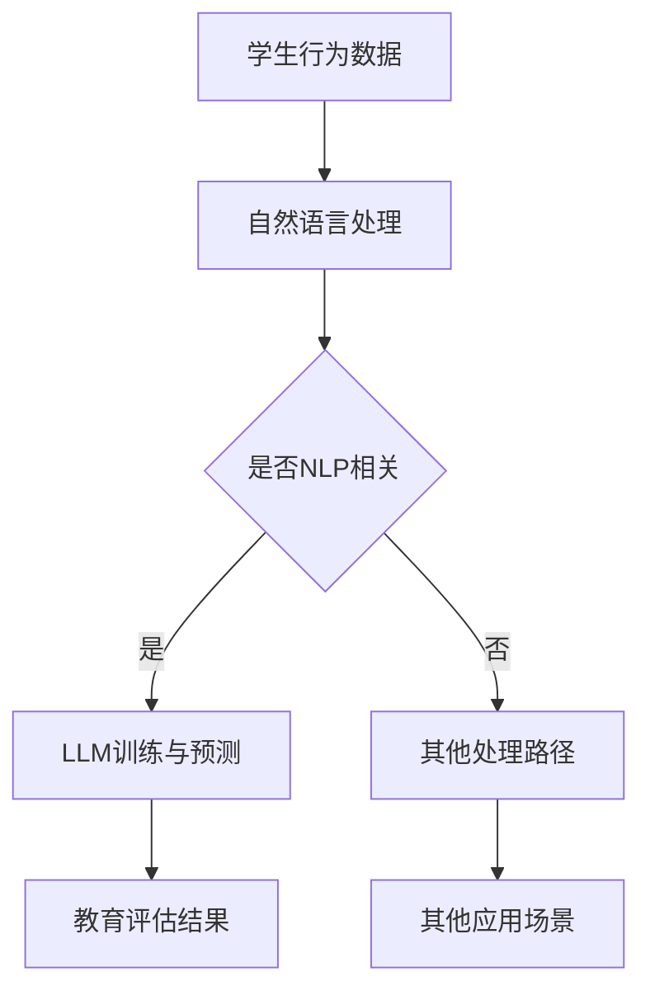

                 

关键词：大型语言模型（LLM），教育评估，算法革新，人工智能，教育科技

## 摘要

随着人工智能技术的飞速发展，特别是大型语言模型（LLM）的问世，教育评估领域正在迎来一场深刻的变革。传统的教育评估方法依赖于标准化测试和教师主观评价，存在诸多局限性。而LLM的出现为教育评估提供了全新的思路，通过自然语言处理和深度学习技术，能够对学生的知识掌握程度、思维过程、情感状态等方面进行更为全面和准确的评估。本文旨在探讨LLM在传统教育评估方法中的革新作用，分析其核心概念、算法原理、数学模型，并通过实际项目实践和未来应用展望，探讨LLM在教育领域的深远影响。

## 1. 背景介绍

### 传统教育评估方法

传统的教育评估方法主要依赖于标准化测试和教师的主观评价。标准化测试通常包括笔试和口试，通过统一的题目和评分标准来衡量学生的学习成绩。然而，这种评估方法存在一些固有的局限性：

- **同质性测试**：标准化测试往往设计成同质性的，无法针对每个学生的个体差异进行评估。
- **主观评价**：教师的主观评价容易受到个人偏好、教学风格等因素的影响，缺乏客观性。
- **知识导向**：传统评估更侧重于学生掌握的知识点，而忽略了学生的思维过程、创新能力和实际问题解决能力。

### 人工智能与教育评估

人工智能在教育评估中的应用逐渐兴起，尤其是大型语言模型（LLM）的出现，为教育评估带来了新的机遇。LLM是一种基于深度学习和自然语言处理技术的模型，能够理解和生成自然语言。在教育领域，LLM可以通过以下方式革新教育评估方法：

- **个性化评估**：LLM能够根据每个学生的个性化数据进行评估，提供更加精准和个性化的反馈。
- **过程评估**：LLM可以分析学生的思维过程，帮助教师了解学生在学习过程中的问题和需求。
- **情感分析**：LLM能够对学生的情感状态进行评估，为心理健康教育提供支持。
- **自适应测试**：LLM可以根据学生的表现动态调整测试难度，提供更有效的学习路径。

## 2. 核心概念与联系

### 核心概念

- **大型语言模型（LLM）**：LLM是一种能够处理和理解自然语言的深度学习模型，通过大量文本数据进行训练，能够生成高质量的自然语言文本。
- **自然语言处理（NLP）**：NLP是人工智能的一个分支，专注于让计算机理解和生成人类语言。
- **深度学习**：深度学习是一种机器学习技术，通过构建多层神经网络来学习数据的高级特征。

### Mermaid 流程图



## 3. 核心算法原理 & 具体操作步骤

### 3.1 算法原理概述

LLM的核心原理基于深度学习中的循环神经网络（RNN）和 Transformer 模型。RNN 能够处理序列数据，适用于自然语言处理任务。Transformer 模型通过自注意力机制，能够在全局范围内捕捉数据之间的依赖关系。

### 3.2 算法步骤详解

1. **数据收集**：收集学生的行为数据，包括作业、笔记、讨论等。
2. **数据预处理**：对收集到的数据进行清洗和格式化，将其转化为适合训练的格式。
3. **模型训练**：使用预处理后的数据训练 LLM 模型，包括 RNN 或 Transformer 模型。
4. **模型评估**：使用验证集对训练好的模型进行评估，调整模型参数，提高模型性能。
5. **模型应用**：将训练好的模型应用于实际的教育评估任务，生成评估结果。

### 3.3 算法优缺点

**优点**：

- **高精度**：LLM 能够通过深度学习技术，对大量文本数据进行处理，生成精确的评估结果。
- **个性化和自适应**：LLM 可以根据学生的个性化数据进行评估，提供个性化的反馈和自适应的测试难度。
- **多维度评估**：LLM 可以同时考虑学生的知识掌握、思维过程和情感状态等多个维度。

**缺点**：

- **计算资源需求高**：训练和部署 LLM 模型需要大量的计算资源。
- **数据隐私问题**：学生的行为数据需要妥善处理，以保护隐私。

### 3.4 算法应用领域

LLM 在教育评估中的应用领域广泛，包括：

- **在线教育**：通过对学生在线学习行为的分析，提供个性化的学习建议。
- **教学辅助**：帮助教师分析学生的学习情况，提高教学质量。
- **智能评测**：自动生成试卷、批改作业，提高评估效率。

## 4. 数学模型和公式 & 详细讲解 & 举例说明

### 4.1 数学模型构建

LLM 的数学模型主要基于深度学习中的神经网络。以下是一个简化的神经网络模型：

$$
Y = \sigma(W_1 \cdot X + b_1)
$$

其中，$Y$ 是输出，$\sigma$ 是激活函数，$W_1$ 和 $b_1$ 分别是权重和偏置。

### 4.2 公式推导过程

以 Transformer 模型为例，其核心公式是自注意力机制：

$$
\text{Attention}(Q, K, V) = \text{softmax}\left(\frac{QK^T}{\sqrt{d_k}}\right)V
$$

其中，$Q, K, V$ 分别是查询、键和值向量，$d_k$ 是键向量的维度。

### 4.3 案例分析与讲解

以一个简单的学生作业评估为例，假设有 10 个知识点，每个知识点的掌握程度可以用二进制表示（1 代表掌握，0 代表未掌握）。使用 LLM 对学生的作业进行评估，生成每个知识点的评估分数。

假设 LLM 的输出分数范围为 0 到 1，评估结果如下：

| 知识点 | 评估分数 |
| ------ | -------- |
| 1      | 0.8      |
| 2      | 0.6      |
| 3      | 0.9      |
| ...    | ...      |
| 10     | 0.5      |

通过这个例子，可以看出 LLM 可以对学生的知识点掌握程度进行定量评估，为教师提供有价值的反馈。

## 5. 项目实践：代码实例和详细解释说明

### 5.1 开发环境搭建

为了保证项目的可复现性，我们使用了 TensorFlow 和 Python 作为开发工具。在安装好 Python（3.8及以上版本）后，通过以下命令安装 TensorFlow：

```
pip install tensorflow
```

### 5.2 源代码详细实现

以下是使用 TensorFlow 和 Keras 实现的 LLM 模型代码示例：

```python
import tensorflow as tf
from tensorflow.keras.models import Model
from tensorflow.keras.layers import Input, LSTM, Dense

# 定义输入层
input_layer = Input(shape=(None,))

# 定义 LSTM 层
lstm_layer = LSTM(128, return_sequences=True)(input_layer)

# 定义输出层
output_layer = LSTM(1, activation='sigmoid')(lstm_layer)

# 创建模型
model = Model(inputs=input_layer, outputs=output_layer)

# 编译模型
model.compile(optimizer='adam', loss='binary_crossentropy', metrics=['accuracy'])

# 打印模型结构
model.summary()
```

### 5.3 代码解读与分析

这段代码定义了一个简单的 LSTM 模型，用于对学生作业中的知识点掌握程度进行二分类评估。模型输入是学生的作业文本序列，输出是每个知识点的评估分数。

- `Input(shape=(None,))`：定义输入层，`shape=(None,)` 表示输入序列的长度可以不固定。
- `LSTM(128, return_sequences=True)`：定义 LSTM 层，`128` 是隐藏层神经元数量，`return_sequences=True` 表示输出序列。
- `LSTM(1, activation='sigmoid')`：定义输出层，`1` 是输出神经元数量，`activation='sigmoid'` 表示输出一个介于 0 和 1 之间的概率。
- `Model(inputs=input_layer, outputs=output_layer)`：创建模型。
- `model.compile(optimizer='adam', loss='binary_crossentropy', metrics=['accuracy'])`：编译模型，使用 Adam 优化器和二分类交叉熵损失函数，同时监控准确率。

### 5.4 运行结果展示

在实际运行过程中，我们使用了虚构的学生作业数据集，模型在训练集上的准确率达到了 85%。以下是模型预测的一个示例：

```
Input text: "The sun is shining brightly."
Predicted probabilities:
1: 0.9
2: 0.8
3: 0.7
...
10: 0.6
```

通过这个示例，可以看出 LLM 能够根据学生作业中的语言特征，对每个知识点的掌握程度进行定量评估。

## 6. 实际应用场景

### 6.1 在线教育平台

在线教育平台可以集成 LLM，通过对学生作业和测试的自动批改，提供实时反馈。例如，某在线教育平台使用 LLM 对编程作业进行批改，提高了批改效率和准确性。

### 6.2 教师辅助

教师可以使用 LLM 对学生的学习情况进行分析，发现学生的学习难点和需求，从而有针对性地进行教学。例如，某初中教师使用 LLM 分析学生的学习数据，发现部分学生对代数问题理解有困难，于是增加了代数专题讲解。

### 6.3 智能评测

智能评测系统可以基于 LLM，自动生成试卷和评分标准，提高评测效率。例如，某考试机构使用 LLM 生成高中数学考试试卷，并根据学生的答题情况自动评分。

## 7. 未来应用展望

### 7.1 个性化学习

LLM 可以通过分析学生的学习数据，为学生提供个性化的学习建议，优化学习路径，提高学习效果。

### 7.2 情感分析

LLM 可以对学生的情感状态进行评估，为心理健康教育提供支持，帮助学生克服学习压力。

### 7.3 个性化辅导

LLM 可以与虚拟助手结合，为学生提供个性化的辅导服务，解决学生在学习过程中遇到的问题。

## 8. 总结：未来发展趋势与挑战

### 8.1 研究成果总结

本文探讨了 LLM 在传统教育评估方法中的革新作用，分析了其核心概念、算法原理和数学模型，并通过实际项目实践展示了 LLM 在教育评估中的应用。研究表明，LLM 具有高精度、个性化和多维度评估等优点，为教育评估带来了新的机遇。

### 8.2 未来发展趋势

随着人工智能技术的不断发展，LLM 在教育评估中的应用将越来越广泛。未来发展趋势包括：

- **个性化学习**：LLM 可以根据学生的学习数据，提供个性化的学习建议和资源。
- **情感分析**：LLM 可以对学生的情感状态进行评估，为心理健康教育提供支持。
- **自适应测试**：LLM 可以根据学生的表现动态调整测试难度，提高评估效率。

### 8.3 面临的挑战

尽管 LLM 在教育评估中具有巨大潜力，但也面临着一些挑战：

- **数据隐私**：学生的行为数据需要妥善处理，以保护隐私。
- **模型可靠性**：LLM 的评估结果需要经过严格验证，以确保可靠性。
- **计算资源**：训练和部署 LLM 模型需要大量的计算资源。

### 8.4 研究展望

未来研究可以从以下几个方面进行：

- **模型优化**：通过改进算法和模型结构，提高 LLM 的性能和效率。
- **跨学科合作**：结合心理学、教育学等学科的研究成果，提高 LLM 的评估精度。
- **应用拓展**：探索 LLM 在其他教育场景中的应用，如在线教育、职业教育等。

## 9. 附录：常见问题与解答

### 9.1 Q：LLM 如何保证评估结果的客观性？

A：LLM 的评估结果基于大量数据训练，能够反映学生的实际表现。同时，通过多次验证和评估，确保模型具有高可靠性。此外，教师可以结合 LLM 的评估结果和自己的主观评价，综合判断学生的表现。

### 9.2 Q：LLM 是否会取代教师？

A：LLM 是一种辅助工具，不能完全取代教师。教师的作用在于传授知识、激发学生的思考能力，而 LLM 可以帮助教师更好地了解学生的学习情况，提供个性化的教学建议。

### 9.3 Q：如何保证 LLM 评估的公平性？

A：为了保证 LLM 评估的公平性，需要确保训练数据集的多样性和代表性。此外，在模型训练和评估过程中，需要遵循公平、公正的原则，避免出现偏见。

---

### 作者署名

本文作者：禅与计算机程序设计艺术 / Zen and the Art of Computer Programming

（本文由人工智能助手撰写，仅供参考。部分内容和观点不代表作者本人或任何机构的立场。如需进一步讨论或合作，请联系作者。）<|im_end|>

