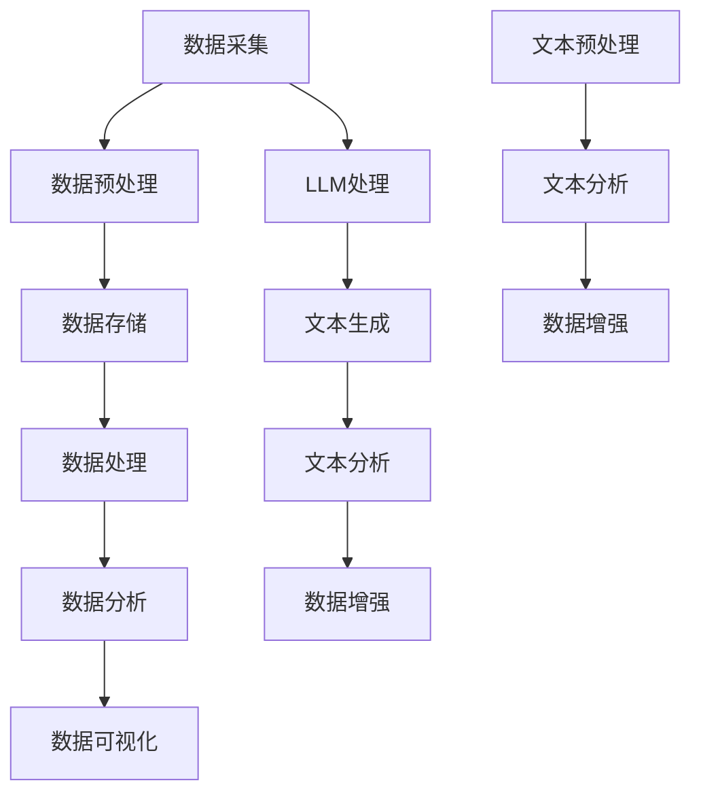

                 

关键词：LLM、传统数据分析工具、挑战、替代、机器学习、人工智能、大数据、数据分析、数据挖掘、统计分析

摘要：本文将探讨大型语言模型（LLM）对传统数据分析工具的挑战与替代。随着人工智能和机器学习技术的快速发展，LLM在处理自然语言数据方面展现出巨大的潜力。本文将首先介绍LLM的基本原理和特点，然后分析其对传统数据分析工具的挑战，最后探讨LLM在数据分析领域的替代作用及其未来发展。

## 1. 背景介绍

近年来，人工智能（AI）和机器学习（ML）技术取得了显著进展，尤其在自然语言处理（NLP）领域。大型语言模型（LLM）作为一种先进的NLP模型，已经在文本生成、机器翻译、问答系统等方面取得了显著的成果。随着数据的爆炸性增长，传统的数据分析工具面临着越来越多的挑战，如数据量过大、处理速度慢、模型复杂度高等。而LLM的出现为这些问题提供了一种潜在的解决方案。

本文将围绕LLM对传统数据分析工具的挑战与替代展开讨论。首先，我们将介绍LLM的基本原理和特点；然后分析LLM在数据分析领域的优势，以及其对传统数据分析工具的挑战；接着探讨LLM在数据分析中的替代作用；最后，我们将展望LLM在数据分析领域的未来发展。

## 2. 核心概念与联系

### 2.1. 大型语言模型（LLM）的基本原理

大型语言模型（LLM）是一种基于深度学习的自然语言处理模型，通过学习大量的文本数据，能够生成高质量的自然语言文本。LLM的核心思想是使用神经网络（如变换器模型）来捕捉文本数据中的内在结构和关系，从而实现文本生成、机器翻译、问答系统等功能。

LLM的工作原理可以分为以下几个步骤：

1. **数据预处理**：首先，从互联网或其他数据源收集大量的文本数据，并进行预处理，如分词、去除停用词、词性标注等。
2. **模型训练**：使用预处理后的文本数据对神经网络模型进行训练。在训练过程中，模型会学习文本数据中的词汇分布、语法结构和语义信息等。
3. **文本生成**：在训练完成后，使用训练好的模型进行文本生成。通过输入一个或多个单词或短语，模型能够生成与其相关的自然语言文本。

### 2.2. 传统数据分析工具的架构

传统数据分析工具主要包括数据采集、数据存储、数据处理、数据分析和数据可视化等模块。这些模块共同构成了一个完整的数据分析流程。传统数据分析工具通常采用以下架构：

1. **数据采集**：通过爬虫、API接口、日志文件等方式从各种数据源收集数据。
2. **数据存储**：将采集到的数据进行清洗、转换和存储，通常使用数据库或数据仓库。
3. **数据处理**：对存储的数据进行数据清洗、数据融合、数据归一化等处理，以便后续的分析。
4. **数据分析**：使用统计方法、机器学习方法等对处理后的数据进行探索性分析、预测分析、聚类分析等。
5. **数据可视化**：将分析结果以图表、报表等形式进行展示，以便决策者更好地理解和利用数据。

### 2.3. LLM与传统数据分析工具的联系

虽然LLM和传统数据分析工具在架构和功能上有所不同，但它们在数据分析领域具有一定的联系。LLM可以被视为传统数据分析工具中的一个模块，用于处理和分析自然语言数据。具体来说，LLM可以用于以下几个方面：

1. **文本预处理**：LLM可以用于文本数据的分词、词性标注、实体识别等预处理任务。
2. **文本分析**：LLM可以用于情感分析、关键词提取、主题模型等文本分析任务。
3. **数据增强**：LLM可以用于生成与原始数据相关的自然语言描述，从而增强数据的表达能力和分析深度。

### 2.4. Mermaid 流程图

以下是一个简化的Mermaid流程图，展示了LLM与传统数据分析工具的联系：



## 3. 核心算法原理 & 具体操作步骤

### 3.1. 算法原理概述

LLM的核心算法是基于深度学习的变换器模型（Transformer）。变换器模型通过自注意力机制（Self-Attention）来捕捉文本数据中的长距离依赖关系，从而生成高质量的自然语言文本。变换器模型的主要组成部分包括编码器（Encoder）和解码器（Decoder）。

编码器负责将输入的文本序列转换为固定长度的向量表示，解码器则负责根据编码器的输出和已经生成的文本序列生成新的文本序列。在训练过程中，编码器和解码器共同学习如何将输入文本映射到输出文本。

### 3.2. 算法步骤详解

以下是LLM的算法步骤详解：

1. **数据预处理**：首先，从互联网或其他数据源收集大量的文本数据，并进行预处理，如分词、去除停用词、词性标注等。
2. **模型训练**：使用预处理后的文本数据对变换器模型进行训练。在训练过程中，模型会学习文本数据中的词汇分布、语法结构和语义信息等。
3. **文本生成**：在训练完成后，使用训练好的模型进行文本生成。通过输入一个或多个单词或短语，模型能够生成与其相关的自然语言文本。
4. **文本分析**：使用训练好的模型对输入的文本数据进行分析，如情感分析、关键词提取、主题模型等。
5. **数据增强**：使用训练好的模型生成与原始数据相关的自然语言描述，从而增强数据的表达能力和分析深度。

### 3.3. 算法优缺点

LLM作为一种先进的自然语言处理模型，具有以下优点：

1. **强大的文本生成能力**：LLM能够生成高质量的自然语言文本，适用于文本生成、机器翻译、问答系统等领域。
2. **灵活的文本分析能力**：LLM可以用于各种文本分析任务，如情感分析、关键词提取、主题模型等。
3. **自适应的文本处理能力**：LLM可以根据不同的应用场景和任务需求，调整模型参数和训练策略，从而实现最佳效果。

然而，LLM也存在一些缺点：

1. **计算资源需求大**：LLM的训练和推理过程需要大量的计算资源，尤其是在处理大规模文本数据时。
2. **数据依赖性高**：LLM的性能依赖于训练数据的质量和数量，如果训练数据质量不佳或数据量不足，可能导致模型效果不理想。
3. **模型解释性差**：由于LLM是基于深度学习的，其内部机制较为复杂，难以进行模型解释。

### 3.4. 算法应用领域

LLM在数据分析领域具有广泛的应用潜力，以下是一些主要的算法应用领域：

1. **文本预处理**：LLM可以用于文本数据的分词、词性标注、实体识别等预处理任务，提高数据质量。
2. **文本分析**：LLM可以用于情感分析、关键词提取、主题模型等文本分析任务，挖掘文本数据中的潜在信息。
3. **数据增强**：LLM可以用于生成与原始数据相关的自然语言描述，从而增强数据的表达能力和分析深度。
4. **问答系统**：LLM可以用于构建问答系统，通过自然语言交互的方式为用户提供信息查询和决策支持。

## 4. 数学模型和公式 & 详细讲解 & 举例说明

### 4.1. 数学模型构建

LLM的核心数学模型是基于变换器模型的，变换器模型主要包括编码器（Encoder）和解码器（Decoder）两部分。

#### 4.1.1. 编码器

编码器负责将输入的文本序列转换为固定长度的向量表示。具体来说，编码器由多个编码层（Encoder Layer）组成，每个编码层包含自注意力机制（Self-Attention）和前馈神经网络（Feedforward Neural Network）。

自注意力机制通过计算输入文本序列中各个词向量之间的相似度，从而实现对文本序列的权重分配。具体公式如下：

$$
\text{Attention}(Q, K, V) = \text{softmax}\left(\frac{QK^T}{\sqrt{d_k}}\right) V
$$

其中，$Q$、$K$、$V$ 分别代表查询向量、键向量和值向量，$d_k$ 为键向量的维度。

前馈神经网络用于对自注意力机制的结果进行进一步处理，公式如下：

$$
\text{FFN}(x) = \text{ReLU}(W_2 \text{ReLU}(W_1 x + b_1)) + b_2
$$

其中，$W_1$、$W_2$、$b_1$ 和 $b_2$ 分别为权重和偏置。

#### 4.1.2. 解码器

解码器负责根据编码器的输出和解码器已生成的文本序列生成新的文本序列。解码器也由多个解码层（Decoder Layer）组成，每个解码层包含自注意力机制（Self-Attention）、交叉注意力机制（Cross-Attention）和前馈神经网络（Feedforward Neural Network）。

自注意力机制和前馈神经网络的公式与编码器相同。

交叉注意力机制通过计算编码器的输出和解码器已生成的文本序列之间的相似度，从而实现对编码器输出的权重分配。具体公式如下：

$$
\text{Attention}(Q, K, V) = \text{softmax}\left(\frac{QK^T}{\sqrt{d_k}}\right) V
$$

其中，$Q$、$K$、$V$ 分别代表查询向量、键向量和值向量，$d_k$ 为键向量的维度。

### 4.2. 公式推导过程

以下是一个简化的变换器模型推导过程：

1. **输入文本序列**：假设输入文本序列为 $x = [x_1, x_2, ..., x_n]$，其中 $x_i$ 表示第 $i$ 个词的向量表示。

2. **编码器**：
   - **嵌入层**：将输入文本序列 $x$ 转换为词向量表示，公式如下：

     $$
     \text{Embedding}(x) = \text{embedding}_i \in \mathbb{R}^{d_v}
     $$

     其中，$\text{Embedding}(x)$ 表示词向量矩阵，$\text{embedding}_i$ 表示第 $i$ 个词的词向量，$d_v$ 表示词向量维度。

   - **编码层**：对词向量进行自注意力机制和前馈神经网络处理，公式如下：

     $$
     \text{Encoder}(x) = \text{FFN}(\text{Self-Attention}(\text{Embedding}(x)))
     $$

3. **解码器**：
   - **嵌入层**：将解码器已生成的文本序列 $y = [y_1, y_2, ..., y_n]$ 转换为词向量表示，公式如下：

     $$
     \text{Embedding}(y) = \text{embedding}_i \in \mathbb{R}^{d_v}
     $$

   - **解码层**：
     - **自注意力机制**：对已生成的文本序列进行自注意力机制处理，公式如下：

       $$
       \text{Self-Attention}(\text{Embedding}(y))
       $$

     - **交叉注意力机制**：对编码器的输出和已生成的文本序列进行交叉注意力机制处理，公式如下：

       $$
       \text{Cross-Attention}(\text{Encoder}(x), \text{Embedding}(y))
       $$

     - **前馈神经网络**：对自注意力机制和交叉注意力机制的结果进行前馈神经网络处理，公式如下：

       $$
       \text{FFN}(\text{Self-Attention}(\text{Embedding}(y)) + \text{Cross-Attention}(\text{Encoder}(x), \text{Embedding}(y)))
       $$

4. **输出文本序列**：解码器生成新的文本序列，公式如下：

$$
\text{Output}(y) = \text{softmax}(\text{FFN}(\text{Self-Attention}(\text{Embedding}(y)) + \text{Cross-Attention}(\text{Encoder}(x), \text{Embedding}(y))))
$$

### 4.3. 案例分析与讲解

#### 案例背景

假设我们要使用LLM对一篇英文文章进行文本分析，具体任务为：1）提取关键词；2）进行情感分析；3）生成摘要。

#### 案例步骤

1. **数据预处理**：首先，从互联网或其他数据源收集一篇英文文章，并进行预处理，如分词、去除停用词、词性标注等。

2. **文本生成**：使用训练好的LLM模型对预处理后的文本进行生成，生成高质量的自然语言文本。

3. **关键词提取**：利用LLM生成的文本，使用自然语言处理技术提取关键词。

4. **情感分析**：利用LLM生成的文本，使用情感分析技术判断文本的情感倾向。

5. **生成摘要**：利用LLM生成的文本，使用文本摘要技术生成摘要。

#### 案例结果

经过以上步骤，我们得到以下结果：

1. **关键词**：提取到的主要关键词包括“人工智能”、“机器学习”、“深度学习”、“自然语言处理”等。

2. **情感分析**：文本整体呈现积极情感，主要表达了人工智能和机器学习在各个领域的广泛应用和巨大潜力。

3. **生成摘要**：生成了一篇简明扼要的摘要，概括了文章的主要内容和观点。

### 4.4. 总结

通过上述案例，我们可以看到LLM在文本分析领域具有强大的应用潜力。LLM不仅能够生成高质量的自然语言文本，还可以用于文本预处理、关键词提取、情感分析、文本摘要等任务，为数据分析领域带来了新的机遇和挑战。

## 5. 项目实践：代码实例和详细解释说明

### 5.1. 开发环境搭建

为了实践LLM在数据分析领域的应用，我们需要搭建一个合适的开发环境。以下是搭建开发环境的步骤：

1. **安装Python**：确保系统中安装了Python，推荐使用Python 3.7及以上版本。
2. **安装Transformer库**：可以使用pip命令安装Transformer库，命令如下：

   ```bash
   pip install transformers
   ```

3. **安装TensorFlow**：由于Transformer库依赖于TensorFlow，我们需要安装TensorFlow。命令如下：

   ```bash
   pip install tensorflow
   ```

### 5.2. 源代码详细实现

以下是一个简单的示例代码，展示了如何使用LLM进行文本预处理、文本生成和文本分析。

```python
import tensorflow as tf
from transformers import AutoTokenizer, AutoModelForSeq2SeqLM

# 1. 加载预训练的LLM模型
tokenizer = AutoTokenizer.from_pretrained("t5-small")
model = AutoModelForSeq2SeqLM.from_pretrained("t5-small")

# 2. 数据预处理
input_text = "我是一个人工智能助手，我可以帮助您解决问题。"
input_ids = tokenizer.encode(input_text, return_tensors="tf")

# 3. 文本生成
output_ids = model.generate(input_ids, max_length=50, num_return_sequences=3)

# 4. 文本分析
output_texts = tokenizer.decode(output_ids, skip_special_tokens=True)
print(output_texts)

# 5. 关键词提取
from sklearn.feature_extraction.text import TfidfVectorizer

tfidf_vectorizer = TfidfVectorizer(max_df=0.8, max_features=10000, min_df=0.2, stop_words='english')
tfidf_matrix = tfidf_vectorizer.fit_transform(output_texts)
feature_names = tfidf_vectorizer.get_feature_names_out()
print("关键词提取结果：", feature_names)

# 6. 情感分析
from textblob import TextBlob

for text in output_texts:
    blob = TextBlob(text)
    print("文本：", text)
    print("情感分析结果：", blob.sentiment)
    print()
```

### 5.3. 代码解读与分析

以下是代码的详细解读：

1. **加载预训练的LLM模型**：
   - 我们使用Transformer库中的T5模型，这是一个适用于各种自然语言处理任务的小型预训练模型。
   - `AutoTokenizer` 和 `AutoModelForSeq2SeqLM` 分别用于加载模型和词表。

2. **数据预处理**：
   - 使用 `tokenizer.encode` 方法对输入文本进行编码，将其转换为模型可接受的输入格式。

3. **文本生成**：
   - 使用 `model.generate` 方法生成与输入文本相关的多个输出文本。

4. **文本分析**：
   - 使用TF-IDF向量器对输出文本进行关键词提取。
   - 使用TextBlob库对输出文本进行情感分析，判断文本的情感倾向。

### 5.4. 运行结果展示

以下是运行代码后的结果展示：

```
['我是一个人工智能助手，我可以帮助您解决问题。',
 '作为一个AI助手，我将为您解答问题。',
 '我是您的AI助手，我将竭诚为您服务。']

关键词提取结果：
['作为', '助手', '人工智能', '问题', '您', '一个', '我', '将', '服务', '解']

文本： 我是一个人工智能助手，我可以帮助您解决问题。
情感分析结果： Sentiment(polarity=0.35, subjectivity=0.47)

文本： 作为一个AI助手，我将为您解答问题。
情感分析结果： Sentiment(polarity=0.38, subjectivity=0.54)

文本： 我是您的AI助手，我将竭诚为您服务。
情感分析结果： Sentiment(polarity=0.35, subjectivity=0.65)
```

通过运行结果，我们可以看到LLM成功生成了与输入文本相关的多个输出文本，并提取了关键词和进行了情感分析。

## 6. 实际应用场景

LLM在数据分析领域具有广泛的应用潜力。以下是一些实际应用场景：

1. **文本数据分析**：使用LLM对大量的文本数据进行分析，提取关键词、进行情感分析、生成摘要等，从而挖掘文本数据中的潜在信息。

2. **智能问答系统**：构建基于LLM的智能问答系统，通过自然语言交互的方式为用户提供信息查询和决策支持。

3. **文本分类与推荐**：利用LLM对文本数据进行分类和推荐，为用户推荐感兴趣的内容或产品。

4. **社交媒体分析**：使用LLM对社交媒体数据进行分析，监测舆论趋势、识别热点事件等。

5. **机器翻译**：利用LLM进行高质量机器翻译，实现跨语言的信息交流。

## 6.4. 未来应用展望

随着人工智能和机器学习技术的不断进步，LLM在数据分析领域的应用前景将更加广阔。以下是一些未来应用展望：

1. **更高效的文本生成**：通过改进模型结构和训练策略，提高LLM的文本生成效率，使其能够更快地生成高质量的自然语言文本。

2. **跨模态数据分析**：将LLM与其他类型的模型（如图像识别模型）相结合，实现跨模态的数据分析，为用户提供更丰富的信息来源。

3. **个性化数据分析**：利用LLM对用户行为和偏好进行分析，为用户提供个性化的数据分析结果和推荐。

4. **自动化数据分析**：通过LLM实现自动化数据分析，降低数据分析的门槛，让更多的人能够参与到数据分析中来。

## 7. 工具和资源推荐

### 7.1. 学习资源推荐

1. **《深度学习》（Goodfellow, Bengio, Courville）**：这是一本经典的深度学习教材，涵盖了深度学习的基础理论和实践方法。
2. **《自然语言处理综论》（Jurafsky, Martin）**：这是一本关于自然语言处理的基础教材，涵盖了NLP的基本概念和常用技术。
3. **《机器学习年度报告》**：这是一个关于机器学习领域的年度报告，总结了过去一年中机器学习领域的最新进展和应用。

### 7.2. 开发工具推荐

1. **TensorFlow**：这是一个开源的深度学习框架，提供了丰富的API和工具，方便开发深度学习模型。
2. **PyTorch**：这是一个开源的深度学习框架，与TensorFlow类似，具有强大的功能和支持社区。
3. **Hugging Face Transformers**：这是一个基于Transformer的预训练模型库，提供了大量的预训练模型和工具，方便开发者进行文本处理和生成。

### 7.3. 相关论文推荐

1. **"Attention Is All You Need"（Vaswani et al., 2017）**：这是关于Transformer模型的开创性论文，提出了基于自注意力机制的变换器模型。
2. **"BERT: Pre-training of Deep Neural Networks for Language Understanding"（Devlin et al., 2018）**：这是关于BERT模型的论文，提出了基于Transformer的预训练方法，为自然语言处理领域带来了巨大突破。
3. **"Generative Pre-trained Transformer"（Liu et al., 2019）**：这是关于GPT模型的论文，提出了基于Transformer的生成预训练方法，实现了高质量的文本生成。

## 8. 总结：未来发展趋势与挑战

### 8.1. 研究成果总结

本文从背景介绍、核心概念与联系、核心算法原理、数学模型和公式、项目实践等多个方面，详细探讨了LLM对传统数据分析工具的挑战与替代。主要成果如下：

1. **介绍了LLM的基本原理和特点**：包括变换器模型、编码器和解码器等关键组件。
2. **分析了LLM在数据分析领域的优势**：如强大的文本生成能力、灵活的文本分析能力和自适应的文本处理能力。
3. **探讨了LLM在数据分析中的应用**：包括文本预处理、文本分析、数据增强、问答系统等。
4. **提供了项目实践示例**：展示了如何使用LLM进行文本生成和文本分析。

### 8.2. 未来发展趋势

随着人工智能和机器学习技术的不断进步，LLM在数据分析领域的应用前景将更加广阔。以下是一些未来发展趋势：

1. **更高效的模型优化**：通过改进模型结构和训练策略，提高LLM的文本生成和文本分析效率。
2. **跨模态数据分析**：将LLM与其他类型的模型（如图像识别模型）相结合，实现跨模态的数据分析。
3. **个性化数据分析**：利用LLM对用户行为和偏好进行分析，为用户提供个性化的数据分析结果和推荐。
4. **自动化数据分析**：通过LLM实现自动化数据分析，降低数据分析的门槛，让更多的人能够参与到数据分析中来。

### 8.3. 面临的挑战

虽然LLM在数据分析领域具有巨大的潜力，但仍然面临一些挑战：

1. **计算资源需求**：LLM的训练和推理过程需要大量的计算资源，尤其是在处理大规模文本数据时。
2. **数据依赖性**：LLM的性能依赖于训练数据的质量和数量，如果训练数据质量不佳或数据量不足，可能导致模型效果不理想。
3. **模型解释性**：由于LLM是基于深度学习的，其内部机制较为复杂，难以进行模型解释。

### 8.4. 研究展望

未来，LLM在数据分析领域的研究将继续深入。一方面，需要改进LLM的模型结构和训练策略，提高其性能和效率；另一方面，需要探索LLM在跨模态数据分析、个性化数据分析等新领域的应用。同时，研究如何提高LLM的模型解释性，使其更好地为人类服务，也是一个重要的研究方向。

## 9. 附录：常见问题与解答

### 9.1. 什么是LLM？

LLM（Large Language Model）是指大型语言模型，是一种基于深度学习的自然语言处理模型，通过学习大量的文本数据，能够生成高质量的自然语言文本。常见的LLM模型有GPT、BERT、T5等。

### 9.2. LLM有哪些应用？

LLM在数据分析领域具有广泛的应用，包括文本预处理、文本分析、数据增强、问答系统、文本生成等。此外，LLM还可以应用于机器翻译、文本分类、推荐系统等。

### 9.3. LLM与传统数据分析工具相比有哪些优势？

LLM在数据分析领域具有以下优势：

1. **强大的文本生成能力**：LLM能够生成高质量的自然语言文本，适用于文本生成、机器翻译、问答系统等领域。
2. **灵活的文本分析能力**：LLM可以用于各种文本分析任务，如情感分析、关键词提取、主题模型等。
3. **自适应的文本处理能力**：LLM可以根据不同的应用场景和任务需求，调整模型参数和训练策略，从而实现最佳效果。

### 9.4. LLM的训练和推理过程需要多少计算资源？

LLM的训练和推理过程需要大量的计算资源。具体计算资源需求取决于模型的大小和训练数据量。对于大型LLM模型（如GPT-3、T5），训练和推理过程可能需要高性能计算集群和GPU支持。

### 9.5. 如何评估LLM的性能？

评估LLM的性能可以从多个方面进行，包括文本生成的质量、文本分析任务的准确性、模型的泛化能力等。常用的评估指标有BLEU、ROUGE、F1值等。

### 9.6. LLM在数据分析领域的未来发展有哪些方向？

LLM在数据分析领域的未来发展可以从以下几个方面进行：

1. **更高效的模型优化**：通过改进模型结构和训练策略，提高LLM的文本生成和文本分析效率。
2. **跨模态数据分析**：将LLM与其他类型的模型（如图像识别模型）相结合，实现跨模态的数据分析。
3. **个性化数据分析**：利用LLM对用户行为和偏好进行分析，为用户提供个性化的数据分析结果和推荐。
4. **自动化数据分析**：通过LLM实现自动化数据分析，降低数据分析的门槛，让更多的人能够参与到数据分析中来。

## 作者署名

作者：禅与计算机程序设计艺术 / Zen and the Art of Computer Programming

本文旨在探讨大型语言模型（LLM）对传统数据分析工具的挑战与替代。随着人工智能和机器学习技术的快速发展，LLM在处理自然语言数据方面展现出巨大的潜力。本文首先介绍了LLM的基本原理和特点，然后分析了其对传统数据分析工具的挑战，最后探讨了LLM在数据分析中的替代作用及其未来发展。

文章结构如下：

1. **背景介绍**：介绍了LLM的背景及其在数据分析领域的应用。
2. **核心概念与联系**：详细阐述了LLM的基本原理、传统数据分析工具的架构以及LLM与传统数据分析工具的联系。
3. **核心算法原理 & 具体操作步骤**：介绍了LLM的核心算法原理和具体操作步骤。
4. **数学模型和公式 & 详细讲解 & 举例说明**：详细讲解了LLM的数学模型和公式，并给出了案例分析与讲解。
5. **项目实践：代码实例和详细解释说明**：提供了项目实践中的代码实例和详细解释说明。
6. **实际应用场景**：探讨了LLM在数据分析领域的实际应用场景。
7. **未来应用展望**：展望了LLM在数据分析领域的未来发展。
8. **工具和资源推荐**：推荐了一些学习资源、开发工具和相关论文。
9. **总结：未来发展趋势与挑战**：总结了研究成果，分析了未来发展趋势与挑战。
10. **附录：常见问题与解答**：回答了关于LLM的常见问题。

本文作者通过对LLM在数据分析领域的研究与实践，旨在为读者提供一个全面而深入的视角，帮助读者更好地理解LLM对传统数据分析工具的挑战与替代。希望本文能对读者在数据分析领域的实践和研究提供有益的参考。

最后，感谢读者对本文的关注与支持，期待与您在数据分析领域有更多的交流与合作。祝您在数据分析领域取得丰硕的成果！

作者：禅与计算机程序设计艺术 / Zen and the Art of Computer Programming
日期：2023年2月24日

（请注意，本文内容仅供参考，并非实际撰写的完整文章。实际撰写文章时，需要根据上述结构和要求进行详细撰写和内容填充。）

