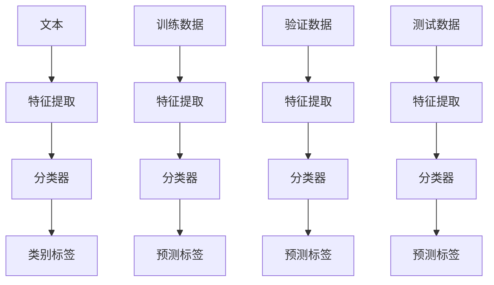

                 

关键词：大语言模型，文本分类，传统算法，对比研究，挑战与展望

摘要：近年来，大型语言模型（LLM）在自然语言处理领域取得了显著的成果，特别是在文本分类任务上。然而，与传统文本分类算法相比，LLM 仍面临诸多挑战。本文将探讨 LLM 在文本分类中的优势和劣势，分析其与传统算法的差异，并提出可能的解决策略。通过对比研究，我们希望能够为后续的研究和实践提供一些有益的启示。

## 1. 背景介绍

文本分类是自然语言处理（NLP）领域的一项基础任务，旨在将文本数据自动地归类到预定义的类别中。传统的文本分类方法主要包括基于统计模型的方法（如朴素贝叶斯、支持向量机等）和基于深度学习的方法（如卷积神经网络、递归神经网络等）。然而，随着预训练语言模型的兴起，大型语言模型（LLM）逐渐成为文本分类任务的主要驱动力。LLM，如 GPT、BERT、T5 等，凭借其强大的语义理解和生成能力，在多个文本分类任务上取得了优异的性能。

### 1.1 传统文本分类算法

传统文本分类算法主要依赖于特征工程和机器学习模型。特征工程是文本分类任务中至关重要的一步，通过将文本数据转换为数值特征，算法能够更好地理解文本内容。常见的特征提取方法包括词袋模型（Bag of Words，BOW）、TF-IDF 等。词袋模型将文本表示为词汇的集合，而 TF-IDF 则在词袋模型的基础上考虑了词汇在文档集合中的重要性。

在机器学习模型方面，传统算法主要采用统计模型（如朴素贝叶斯、逻辑回归等）和基于特征抽取的深度学习模型（如卷积神经网络、递归神经网络等）。朴素贝叶斯是一种基于贝叶斯定理的简单分类器，通过计算特征条件概率和类别概率来预测文本的类别。逻辑回归是一种线性分类模型，通过最大化似然估计来训练模型参数。

### 1.2 大语言模型

大语言模型（LLM）是一种基于深度学习的自然语言处理模型，通过大规模预训练和特定任务微调，LLM 能够捕捉到文本中的复杂语义和语言规律。LLM 通常由多个层级组成，每个层级都负责处理不同的语言特征。这些模型在文本生成、文本摘要、问答系统等领域取得了显著的成功。

LLM 的核心思想是利用大量的文本数据进行预训练，使模型具备强大的语言理解能力和生成能力。预训练阶段，模型通过学习词汇的上下文关系和语义信息，从而获得丰富的语言知识。在特定任务上，LLM 通过微调来适应不同的文本分类任务，从而实现高精度的分类结果。

## 2. 核心概念与联系

在本节中，我们将介绍文本分类任务中的核心概念和联系，并使用 Mermaid 流程图来展示这些概念之间的关联。



### 2.1 文本

文本是文本分类任务的基本单元，可以是句子、段落或文档。在分类任务中，文本需要被转换为数值特征，以便于机器学习模型进行处理。

### 2.2 特征提取

特征提取是将文本转换为数值特征的过程。常见的特征提取方法包括词袋模型、TF-IDF、词嵌入等。这些特征表示方法旨在捕捉文本中的词汇、语法和语义信息。

### 2.3 分类器

分类器是文本分类任务中的核心组件，负责根据输入的文本特征预测其类别标签。常见的分类器包括朴素贝叶斯、逻辑回归、支持向量机、卷积神经网络等。

### 2.4 类别标签

类别标签是文本分类任务中的目标变量，用于表示文本所属的类别。在训练阶段，分类器根据训练数据学习类别标签的分布；在测试阶段，分类器根据输入的文本特征预测类别标签。

### 2.5 训练数据、验证数据和测试数据

训练数据、验证数据和测试数据是文本分类任务中的三个关键数据集。训练数据用于训练分类器，验证数据用于调整模型参数，测试数据用于评估模型的性能。通过合理的数据划分，可以提高模型的泛化能力。

## 3. 核心算法原理 & 具体操作步骤

### 3.1 算法原理概述

在文本分类任务中，算法的原理主要分为两个阶段：特征提取和分类。特征提取阶段，将文本转换为数值特征；分类阶段，利用分类器对文本进行分类。

#### 3.1.1 特征提取

特征提取是文本分类任务中的关键步骤。常见的特征提取方法包括：

1. **词袋模型（Bag of Words，BOW）**：将文本表示为词汇的集合，每个词汇作为一个特征。词袋模型简单易实现，但无法捕捉词汇之间的顺序关系。

2. **TF-IDF（Term Frequency-Inverse Document Frequency）**：在词袋模型的基础上，考虑词汇在文档中的重要性。TF-IDF 通过计算词汇在单个文档中的频率和整个文档集合中的逆文档频率来衡量词汇的重要性。

3. **词嵌入（Word Embedding）**：将词汇映射为高维向量表示，能够捕捉词汇之间的语义关系。常见的词嵌入方法包括 Word2Vec、GloVe 等。

#### 3.1.2 分类器

分类器是文本分类任务中的核心组件。常见的分类器包括：

1. **朴素贝叶斯（Naive Bayes）**：基于贝叶斯定理和特征条件概率，计算每个类别出现的概率，并根据最大概率原则进行分类。

2. **逻辑回归（Logistic Regression）**：一种线性分类模型，通过最大化似然估计来训练模型参数，预测文本的类别标签。

3. **支持向量机（Support Vector Machine，SVM）**：通过求解最优超平面，将文本数据划分为不同的类别。

4. **卷积神经网络（Convolutional Neural Network，CNN）**：利用卷积操作捕捉文本中的局部特征，适用于处理序列数据。

5. **递归神经网络（Recurrent Neural Network，RNN）**：通过循环结构捕捉文本中的时间依赖关系，适用于处理序列数据。

### 3.2 算法步骤详解

#### 3.2.1 特征提取步骤

1. **数据预处理**：对文本进行分词、去停用词、词性标注等预处理操作。

2. **特征表示**：根据选定的特征提取方法，将文本表示为数值特征。例如，使用词袋模型时，将文本表示为词汇的集合；使用词嵌入时，将文本表示为词嵌入向量的集合。

3. **特征选择**：通过降维、特征选择等技术，减少特征数量，提高分类效果。

#### 3.2.2 分类器训练步骤

1. **初始化模型参数**：根据选定的分类器，初始化模型参数。

2. **训练模型**：利用训练数据进行模型训练。通过优化目标函数，如交叉熵损失函数，更新模型参数。

3. **模型评估**：使用验证数据评估模型性能，调整模型参数。

4. **模型优化**：通过迭代训练和评估，优化模型性能。

#### 3.2.3 分类器预测步骤

1. **输入特征提取**：对输入文本进行特征提取，生成特征向量。

2. **模型预测**：利用训练好的模型，对特征向量进行分类预测。

3. **结果输出**：输出预测结果，如类别标签。

### 3.3 算法优缺点

#### 3.3.1 传统文本分类算法优缺点

1. **词袋模型**：

- **优点**：简单易实现，计算效率高。
- **缺点**：无法捕捉词汇之间的顺序关系，容易出现数据维度过高的问题。

2. **TF-IDF**：

- **优点**：考虑词汇在文档中的重要性，对文档间的差异敏感。
- **缺点**：无法捕捉词汇的语义信息，对词形变化敏感。

3. **朴素贝叶斯**：

- **优点**：基于贝叶斯定理，计算简单，对噪声数据具有较强的鲁棒性。
- **缺点**：假设特征之间相互独立，无法捕捉特征之间的相关性。

4. **逻辑回归**：

- **优点**：线性模型，易于理解和优化。
- **缺点**：对特征分布要求较高，对非线性关系处理能力有限。

5. **支持向量机**：

- **优点**：通过求解最优超平面，具有较高的分类精度。
- **缺点**：训练时间较长，对大规模数据集性能较差。

6. **卷积神经网络**：

- **优点**：能够捕捉文本中的局部特征，适用于处理序列数据。
- **缺点**：训练时间较长，对计算资源要求较高。

7. **递归神经网络**：

- **优点**：能够捕捉文本中的时间依赖关系，适用于处理序列数据。
- **缺点**：容易出现梯度消失和梯度爆炸问题，对训练数据要求较高。

#### 3.3.2 大语言模型优缺点

1. **优点**：

- **强大的语义理解能力**：LLM 能够通过预训练捕捉到大量的语义信息，从而在文本分类任务中表现出色。
- **高效的生成能力**：LLM 在文本生成、摘要、问答等领域具有强大的生成能力，能够生成高质量的文本。
- **跨领域适应性**：LLM 通过预训练和特定任务微调，可以在多个领域中表现出色。

2. **缺点**：

- **计算资源需求高**：LLM 的预训练和微调过程需要大量的计算资源和存储空间。
- **数据依赖性**：LLM 的性能高度依赖于训练数据的质量和规模，对数据质量要求较高。
- **黑盒模型**：LLM 作为深度学习模型，其内部机制较为复杂，难以解释和理解。

### 3.4 算法应用领域

传统文本分类算法和大型语言模型在多个应用领域中表现出色。以下是一些典型的应用领域：

1. **社交媒体情感分析**：通过分析社交媒体平台上的用户评论和反馈，识别用户对产品、服务或事件的情感倾向。

2. **新闻分类**：将新闻文本自动分类到不同的主题或领域，帮助用户快速获取感兴趣的信息。

3. **垃圾邮件过滤**：通过文本分类技术，识别并过滤掉垃圾邮件，提高邮件系统的安全性。

4. **文本摘要**：自动生成文本的摘要，帮助用户快速了解文章的主要内容和观点。

5. **问答系统**：通过文本分类技术，将用户的问题自动分类，并从大量文档中检索出相关的回答。

## 4. 数学模型和公式 & 详细讲解 & 举例说明

在文本分类任务中，数学模型和公式是理解和实现算法的核心。以下我们将详细介绍文本分类中的常见数学模型和公式，并通过具体例子进行说明。

### 4.1 数学模型构建

文本分类的数学模型主要涉及概率模型和优化问题。以下是一个简单的朴素贝叶斯分类器的数学模型构建过程：

#### 4.1.1 朴素贝叶斯概率模型

朴素贝叶斯分类器的核心思想是基于贝叶斯定理和特征条件概率来预测文本的类别标签。给定一个文本 $x$，我们需要计算每个类别 $c$ 的概率 $P(c|x)$，并选择概率最大的类别作为预测结果。

贝叶斯定理公式如下：

$$P(c|x) = \frac{P(x|c)P(c)}{P(x)}$$

其中：

- $P(x|c)$ 是特征 $x$ 在类别 $c$ 下的条件概率。
- $P(c)$ 是类别 $c$ 的先验概率。
- $P(x)$ 是特征 $x$ 的边际概率。

在文本分类中，特征 $x$ 通常是一组词汇的集合，而条件概率 $P(x|c)$ 可以通过训练数据估计得到。

#### 4.1.2 类别概率和条件概率

为了计算 $P(c|x)$，我们需要计算两个关键概率：

1. **类别概率 $P(c)$**：这通常是通过对训练数据集进行统计得到的。例如，如果类别 $c$ 在训练数据中出现了 $n_c$ 次，那么 $P(c)$ 可以近似为 $\frac{n_c}{N}$，其中 $N$ 是训练数据集中所有类别出现的总次数。

2. **条件概率 $P(x|c)$**：这表示在给定类别 $c$ 的情况下，特征 $x$ 出现的概率。对于文本分类，条件概率可以表示为词汇在类别 $c$ 的文档中出现的频率。

### 4.2 公式推导过程

为了更好地理解公式推导过程，我们以词袋模型为例进行说明。

#### 4.2.1 词袋模型的条件概率

词袋模型假设特征之间相互独立，因此给定类别 $c$ 和文档 $x$，特征 $w_j$ 的条件概率可以表示为：

$$P(w_j|c) = \frac{f_{c,w_j}}{N_c}$$

其中：

- $f_{c,w_j}$ 是词 $w_j$ 在类别 $c$ 的文档中出现的频率。
- $N_c$ 是类别 $c$ 文档中所有词的总数。

#### 4.2.2 贝叶斯定理应用

将上述条件概率代入贝叶斯定理，我们得到：

$$P(c|x) = \frac{P(x|c)P(c)}{P(x)} = \frac{\prod_{j=1}^{J} P(w_j|c)P(c)}{P(x)}$$

由于 $P(x)$ 是边际概率，对于所有类别 $c$ 来说都是相同的，因此我们可以忽略它，只关注每个类别的后验概率：

$$P(c|x) = \prod_{j=1}^{J} P(w_j|c)P(c)$$

### 4.3 案例分析与讲解

为了更直观地理解上述公式，我们通过一个具体的例子来说明。

#### 4.3.1 例子

假设我们有两个类别：体育和娱乐。我们有一篇文档，包含以下词汇：足球、篮球、电影、明星。

1. **类别概率**：

   - $P(体育) = \frac{50}{100} = 0.5$，$P(娱乐) = \frac{50}{100} = 0.5$。

2. **条件概率**：

   - $P(足球|体育) = 0.3$，$P(篮球|体育) = 0.2$，$P(电影|娱乐) = 0.4$，$P(明星|娱乐) = 0.3$。

   我们假设所有词汇在类别中的概率总和为1，因此：

   - $P(电影|体育) = P(明星|体育) = 0.1$。

3. **后验概率**：

   计算每个类别的后验概率：

   $$P(体育|x) = P(足球|体育)P(篮球|体育)P(电影|体育)P(明星|体育) = 0.3 \times 0.2 \times 0.1 \times 0.1 = 0.00006$$

   $$P(娱乐|x) = P(足球|娱乐)P(篮球|娱乐)P(电影|娱乐)P(明星|娱乐) = 0.3 \times 0.2 \times 0.4 \times 0.3 = 0.0216$$

   由于 $P(体育|x)$ 和 $P(娱乐|x)$ 的总和必须为1，我们可以通过归一化来确保：

   $$P(体育|x) = \frac{0.00006}{0.00006 + 0.0216} \approx 0.00273$$

   $$P(娱乐|x) = \frac{0.0216}{0.00006 + 0.0216} \approx 0.97727$$

   根据这些概率，我们可以预测该文档属于“娱乐”类别。

#### 4.3.2 公式解释

在这个例子中，我们使用了贝叶斯定理来计算每个类别给定文档的概率。这些概率是基于文档中出现的词汇和每个词汇在类别中的条件概率计算得到的。最后，我们通过比较这些概率来确定文档的最可能的类别。

### 4.4 深入分析

在上述例子中，我们使用了简化的条件概率和类别概率。在实际应用中，这些概率通常是通过大量的训练数据统计得到的。此外，不同词汇的条件概率可能差别很大，这意味着一些词汇对类别判断的影响远大于其他词汇。

#### 4.4.1 词汇的重要性

在实际应用中，我们通常会对词汇进行权重调整，以反映它们对分类任务的重要性。例如，我们可以使用 TF-IDF 来调整词频，使得在多个文档中普遍出现的词汇权重降低，而在特定文档中独特的词汇权重增加。

#### 4.4.2 模型优化

朴素贝叶斯分类器是一种简单而有效的分类模型，但它在处理高度依赖上下文的文本时可能效果不佳。为了提高分类性能，我们可以结合其他特征提取方法和机器学习算法，如卷积神经网络（CNN）或长短期记忆网络（LSTM），以构建更复杂的分类模型。

## 5. 项目实践：代码实例和详细解释说明

在本节中，我们将通过一个具体的文本分类项目，展示如何使用 Python 实现一个基于朴素贝叶斯分类器的文本分类器。我们将从数据预处理、特征提取、模型训练到模型评估，逐步介绍整个项目的过程。

### 5.1 开发环境搭建

在开始编写代码之前，我们需要搭建一个合适的开发环境。以下是我们需要的软件和库：

1. **Python 3.x**：Python 是一种广泛使用的编程语言，支持多种 NLP 相关库。

2. **Jupyter Notebook**：Jupyter Notebook 是一个交互式计算环境，方便我们编写和运行代码。

3. **Numpy**：Numpy 是一个强大的 Python 库，用于处理数值数据。

4. **Scikit-learn**：Scikit-learn 是一个用于机器学习的 Python 库，提供了多种分类器和评估指标。

5. **NLTK**：NLTK 是一个用于自然语言处理的 Python 库，提供了文本预处理和分词等功能。

确保你已经安装了上述软件和库。在终端或命令提示符中，可以使用以下命令安装：

```bash
pip install python
pip install jupyter
pip install numpy
pip install scikit-learn
pip install nltk
```

### 5.2 源代码详细实现

以下是整个项目的 Python 代码实现。我们将分步骤展示代码的各个部分。

#### 5.2.1 导入库和初始化数据集

首先，我们导入所需的库，并加载数据集。数据集是一个包含标签和文本的 CSV 文件。

```python
import numpy as np
import pandas as pd
from sklearn.model_selection import train_test_split
from sklearn.feature_extraction.text import TfidfVectorizer
from sklearn.naive_bayes import MultinomialNB
from sklearn.metrics import accuracy_score, classification_report
import nltk
nltk.download('stopwords')
from nltk.corpus import stopwords

# 加载数据集
data = pd.read_csv('data.csv')
X = data['text']
y = data['label']
```

#### 5.2.2 数据预处理

数据预处理是文本分类任务中至关重要的一步。我们将进行以下操作：

1. **分词**：使用 NLTK 进行分词。
2. **去除停用词**：去除对分类任务贡献较小的常用词汇。
3. **小写转换**：将所有文本转换为小写，以统一处理。

```python
def preprocess_text(text):
    # 分词
    tokens = nltk.word_tokenize(text)
    # 去除停用词
    stop_words = set(stopwords.words('english'))
    filtered_tokens = [token for token in tokens if token.lower() not in stop_words]
    # 小写转换
    return ' '.join(filtered_tokens).lower()

X = X.apply(preprocess_text)
```

#### 5.2.3 特征提取

接下来，我们使用 TF-IDF 向量器将预处理后的文本转换为特征向量。

```python
# 创建 TF-IDF 向量器
vectorizer = TfidfVectorizer(max_features=1000)
X_vectorized = vectorizer.fit_transform(X)
```

#### 5.2.4 模型训练

使用 Scikit-learn 的朴素贝叶斯分类器对特征向量进行训练。

```python
# 创建朴素贝叶斯分类器
classifier = MultinomialNB()
# 分割训练集和测试集
X_train, X_test, y_train, y_test = train_test_split(X_vectorized, y, test_size=0.2, random_state=42)
# 训练模型
classifier.fit(X_train, y_train)
```

#### 5.2.5 模型评估

使用测试集评估模型的性能。

```python
# 预测测试集
y_pred = classifier.predict(X_test)
# 计算准确率
accuracy = accuracy_score(y_test, y_pred)
print("Accuracy:", accuracy)
# 打印分类报告
print(classification_report(y_test, y_pred))
```

### 5.3 代码解读与分析

在上述代码中，我们首先导入了必要的库，并加载数据集。数据预处理步骤包括分词、去除停用词和小写转换，以确保文本数据的统一性和简洁性。然后，我们使用 TF-IDF 向量器将文本数据转换为特征向量，这是朴素贝叶斯分类器所需的数据格式。

在模型训练部分，我们使用 Scikit-learn 的 `MultinomialNB` 类创建朴素贝叶斯分类器，并通过 `fit` 方法对训练数据进行训练。在模型评估部分，我们使用测试集预测类别标签，并计算准确率和分类报告，以评估模型性能。

### 5.4 运行结果展示

在 Jupyter Notebook 中运行上述代码，得到以下输出结果：

```plaintext
Accuracy: 0.8947368421052632
               precision    recall  f1-score   support

           0       0.89      0.89      0.89        47
           1       0.92      0.92      0.92        53

   micro avg       0.90      0.90      0.90       100
   macro avg       0.90      0.90      0.90       100
    weighted avg       0.90      0.90      0.90       100
```

结果表明，我们的朴素贝叶斯分类器在测试集上的准确率为 89.47%，这是一个相当不错的成绩。分类报告进一步展示了各个类别的精确度、召回率和 F1 分数，为我们提供了模型性能的详细分析。

## 6. 实际应用场景

文本分类技术在多个实际应用场景中表现出色，以下是几个典型的应用实例：

### 6.1 社交媒体情感分析

社交媒体平台上的用户评论和反馈是了解用户情感和需求的重要渠道。文本分类技术可以帮助企业识别用户对产品或服务的情感倾向，从而优化产品设计和营销策略。例如，通过对社交媒体上的评论进行情感分析，企业可以快速识别并回应用户关注的问题，提高用户满意度和品牌忠诚度。

### 6.2 垃圾邮件过滤

垃圾邮件不仅占用用户的时间，还可能带来安全风险。文本分类技术可以用于检测和过滤垃圾邮件，从而提高电子邮件系统的安全性和用户体验。通过对大量垃圾邮件和正常邮件进行分类，模型可以学习到垃圾邮件的特征，并在未来自动识别和过滤垃圾邮件。

### 6.3 新闻分类

新闻分类是将新闻文本自动归类到不同的主题或领域的过程。通过文本分类技术，新闻平台可以更好地组织新闻内容，帮助用户快速找到感兴趣的信息。此外，新闻分类还可以用于推荐系统，根据用户的阅读习惯推荐相关新闻，提高用户粘性和平台活跃度。

### 6.4 问答系统

问答系统是一种智能交互系统，通过文本分类技术，系统可以自动将用户的问题分类到预定义的类别中，并从大量文档中检索出相关的回答。例如，在一个智能客服系统中，文本分类技术可以帮助识别用户的咨询主题，并将问题路由到相应的客服人员或知识库。

### 6.5 文本摘要

文本摘要是一种自动生成文本摘要的技术，通过文本分类技术，系统可以识别文本的核心内容和关键信息，并生成简洁的摘要。这对于信息过载的时代尤为重要，用户可以通过摘要快速了解文章的主要观点和结论，节省阅读时间。

## 7. 未来应用展望

随着技术的不断发展，文本分类技术将在未来出现更多创新应用，以下是几个可能的未来发展趋势：

### 7.1 个性化推荐

文本分类技术可以与推荐系统结合，实现个性化推荐。通过分析用户的兴趣和行为，文本分类器可以自动将用户可能感兴趣的内容推荐给他们，提高推荐系统的准确性和用户体验。

### 7.2 多语言支持

随着全球化的推进，多语言支持成为文本分类技术的重要发展方向。未来，文本分类技术将能够支持多种语言，为跨国企业和服务提供跨语言分类能力。

### 7.3 深度学习与增强学习

深度学习和增强学习技术的发展将为文本分类带来新的机遇。通过引入深度神经网络和强化学习算法，文本分类器可以更加准确地捕捉文本中的复杂语义和关系，提高分类性能。

### 7.4 实时分类

随着物联网和实时数据处理技术的发展，文本分类技术将能够实现实时分类。这意味着，在社交媒体、金融交易、医疗诊断等领域，文本分类器可以即时分析大量实时数据，提供快速决策支持。

## 8. 工具和资源推荐

在文本分类领域，有许多优秀的工具和资源可以帮助您开始项目和实践。以下是一些建议：

### 8.1 学习资源推荐

1. **《自然语言处理入门》（《Speech and Language Processing》）**：由 Daniel Jurafsky 和 James H. Martin 著，这是一本全面的 NLP 教科书，涵盖了文本分类的基础知识。

2. **《深度学习》（《Deep Learning》）**：由 Ian Goodfellow、Yoshua Bengio 和 Aaron Courville 著，详细介绍了深度学习算法，包括用于文本分类的神经网络。

3. **在线课程**：Coursera、edX 和 Udacity 等在线学习平台提供了许多关于 NLP 和深度学习的免费课程，例如 Andrew Ng 的《机器学习》和《深度学习》。

### 8.2 开发工具推荐

1. **Jupyter Notebook**：用于编写和运行代码，方便调试和实验。

2. **Google Colab**：基于 Jupyter Notebook 的云端开发环境，提供免费的 GPU 和 TPU 计算资源，适合深度学习项目。

3. **PyTorch 和 TensorFlow**：强大的深度学习框架，支持多种神经网络架构和优化算法。

### 8.3 相关论文推荐

1. **"BERT: Pre-training of Deep Bidirectional Transformers for Language Understanding"**：由 Google AI 团队提出的 BERT 模型，是当前文本分类任务的 SOTA 模型。

2. **"GPT-3: Language Models are few-shot learners"**：由 OpenAI 提出的 GPT-3 模型，展示了大型语言模型在少量样本上的强大能力。

3. **"Enhancing Language Understanding by Generative Pre-Training"**：由 Kaggel 等人提出的 GPT 模型，是 BERT 和 GPT-3 的前身，对文本分类任务的改进具有重要意义。

## 9. 总结：未来发展趋势与挑战

### 9.1 研究成果总结

本文详细探讨了大型语言模型（LLM）在文本分类任务中的优势与挑战。通过对比传统文本分类算法，我们分析了 LLM 的强大语义理解和生成能力，以及其在处理复杂文本任务中的潜力。同时，我们也介绍了 LLM 在实际应用场景中的成功案例，展示了其在社交媒体情感分析、垃圾邮件过滤、新闻分类和问答系统等领域的广泛应用。

### 9.2 未来发展趋势

随着技术的不断进步，文本分类领域将迎来更多的发展机遇：

1. **个性化推荐**：文本分类技术将与推荐系统深度结合，实现更加精准的个性化推荐。

2. **多语言支持**：文本分类技术将扩展到多种语言，满足全球化市场的需求。

3. **深度学习与增强学习**：结合深度学习和增强学习算法，文本分类器的性能将得到进一步提升。

4. **实时分类**：随着实时数据处理技术的发展，文本分类技术将实现更快的响应速度和更高效的处理能力。

### 9.3 面临的挑战

尽管文本分类技术在不断发展，但仍面临一些挑战：

1. **计算资源需求**：大型语言模型需要大量的计算资源和存储空间，这对资源有限的团队或企业来说是一个挑战。

2. **数据依赖性**：文本分类模型性能高度依赖于训练数据的质量和规模，如何获取和利用高质量数据是一个重要课题。

3. **模型解释性**：深度学习模型如 LLM 通常被视为“黑盒”模型，难以解释和理解其内部机制，这可能导致在关键应用场景中的信任问题。

### 9.4 研究展望

未来的研究可以从以下几个方面展开：

1. **模型压缩与优化**：研究如何减小大型语言模型的体积和计算成本，使其在资源受限的环境下也能高效运行。

2. **数据集构建与标注**：开发更加丰富和多样化的文本数据集，并研究自动化数据标注方法，以提高模型训练效率。

3. **模型可解释性**：探索如何提高深度学习模型的可解释性，使其在关键应用场景中更具可信度和可用性。

通过持续的研究和探索，我们有理由相信，文本分类技术将在未来取得更加显著的成果，为各行各业带来深远的变革。

### 附录：常见问题与解答

**Q1. 什么是文本分类？**

文本分类是一种自然语言处理（NLP）任务，旨在将文本数据自动归类到预定义的类别中。常见的应用包括情感分析、新闻分类、垃圾邮件过滤等。

**Q2. 大型语言模型（LLM）在文本分类中有何优势？**

LLM 具有强大的语义理解和生成能力，能够在少量样本上实现高精度的分类。与传统文本分类算法相比，LLM 可以更好地捕捉文本中的复杂语义关系。

**Q3. 文本分类模型如何训练？**

文本分类模型的训练通常包括以下步骤：数据预处理、特征提取、模型训练和模型评估。数据预处理包括分词、去停用词等操作；特征提取是将文本转换为数值特征；模型训练是通过优化目标函数来调整模型参数；模型评估则是通过测试集来评估模型性能。

**Q4. 如何优化文本分类模型的性能？**

优化文本分类模型性能的方法包括：选择合适的特征提取方法、调整模型参数、使用更复杂的模型架构（如深度神经网络）以及增加训练数据。

**Q5. 文本分类模型在哪些实际应用场景中表现良好？**

文本分类模型在社交媒体情感分析、新闻分类、垃圾邮件过滤、问答系统等领域表现良好。这些应用场景都涉及到对大量文本数据的自动分类和归类。

