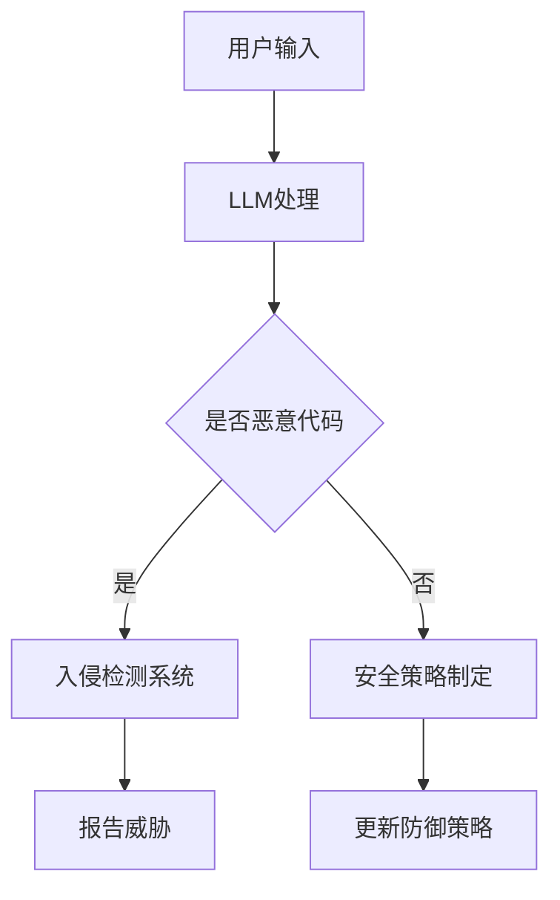

                 

关键词：大型语言模型，网络安全，策略创新，AI威胁，防御机制，智能防护，数据隐私，算法优化

> 摘要：随着大型语言模型（LLM）的迅速发展，其对传统网络安全策略带来了巨大的挑战。本文旨在探讨LLM对网络安全的影响，分析其潜在威胁，并提出创新的网络安全策略。通过对LLM的工作原理、应用场景和网络安全问题的深入分析，本文提出了相应的防御机制和优化方法，为网络安全领域提供了新的思路。

## 1. 背景介绍

近年来，人工智能（AI）技术的迅猛发展，特别是大型语言模型（LLM）的崛起，引发了各行业领域的深刻变革。LLM作为一种强大的自然语言处理工具，能够模拟人类的语言理解能力和生成能力，广泛应用于智能客服、内容生成、翻译、问答系统等领域。然而，LLM的广泛应用也带来了一系列的网络安全问题，对传统的网络安全策略形成了巨大的挑战。

### 1.1 LLM的发展历程

LLM的发展历程可以分为以下几个阶段：

1. **早期研究**：自1980年代起，研究者们开始关注如何利用机器学习技术模拟人类的语言能力。这一阶段主要集中于基础算法的研究，如神经网络和深度学习。

2. **技术突破**：2018年，OpenAI发布了GPT-2，标志着LLM进入了一个新的阶段。GPT-2拥有超过1.5亿的参数，能够生成高质量的自然语言文本。

3. **应用落地**：随着LLM技术的不断成熟，其在各个领域的应用逐渐落地，如智能客服、内容生成、自动化写作等。

### 1.2 传统网络安全策略的局限性

传统的网络安全策略主要依赖于防御机制，如防火墙、入侵检测系统（IDS）、安全信息和事件管理系统（SIEM）等。然而，这些策略在面对LLM带来的新威胁时，表现出了一定的局限性：

1. **预测难度**：LLM能够生成高度复杂的恶意代码和攻击脚本，使得传统的入侵检测系统难以有效识别。

2. **防御滞后**：传统的网络安全策略往往需要手动更新和调整，而LLM攻击的速度和变化速度远超传统攻击，使得防御策略难以及时响应。

3. **资源消耗**：随着LLM的广泛应用，网络安全设备需要处理的数据量呈指数级增长，导致传统策略的资源消耗剧增。

## 2. 核心概念与联系

### 2.1 LLM的工作原理

LLM通常基于深度神经网络，通过大量的文本数据进行训练，学习到语言的结构和语义。其主要组成部分包括：

1. **输入层**：接收用户的输入文本。
2. **隐藏层**：通过多层神经网络，对输入文本进行处理，提取语义特征。
3. **输出层**：生成相应的文本输出。

### 2.2 网络安全策略架构

传统的网络安全策略包括以下几个方面：

1. **防火墙**：阻止未经授权的访问。
2. **入侵检测系统（IDS）**：检测和报告潜在的安全威胁。
3. **安全信息和事件管理系统（SIEM）**：整合和分析来自不同源的安全事件数据。
4. **安全策略制定**：制定和实施安全策略，保护网络系统的安全。

### 2.3 LLM与网络安全策略的关联

LLM在网络安全领域中的应用主要体现在两个方面：

1. **攻击工具**：LLM可以生成复杂的恶意代码和攻击脚本，对网络系统进行攻击。
2. **防御工具**：LLM也可以用于网络安全防御，如自动生成防御策略、识别恶意代码等。

### 2.4 Mermaid流程图

以下是一个简单的Mermaid流程图，展示了LLM与网络安全策略的关联：



## 3. 核心算法原理 & 具体操作步骤

### 3.1 算法原理概述

LLM在网络安全中的应用，主要依赖于其强大的文本生成能力。具体而言，LLM可以用于以下方面：

1. **恶意代码生成**：通过输入特定的触发词或模板，LLM可以生成复杂的恶意代码和攻击脚本。
2. **安全策略生成**：LLM可以根据历史攻击数据和网络安全策略，自动生成新的防御策略。
3. **恶意代码检测**：LLM可以通过对网络流量的分析，识别潜在的恶意代码。

### 3.2 算法步骤详解

1. **恶意代码生成**：

   - 输入触发词或模板；
   - 经过LLM处理，生成恶意代码；
   - 输出恶意代码。

2. **安全策略生成**：

   - 输入历史攻击数据和网络安全策略；
   - 经过LLM处理，生成新的防御策略；
   - 输出防御策略。

3. **恶意代码检测**：

   - 输入网络流量数据；
   - 经过LLM处理，识别恶意代码；
   - 输出检测结果。

### 3.3 算法优缺点

1. **优点**：

   - **高效性**：LLM能够快速处理大量数据，生成恶意代码或防御策略。
   - **灵活性**：LLM可以根据不同的输入生成相应的输出，具有较强的适应性。

2. **缺点**：

   - **计算资源消耗**：LLM的训练和运行需要大量的计算资源，可能导致系统性能下降。
   - **潜在风险**：如果LLM被恶意利用，可能生成更复杂的恶意代码，增加网络安全风险。

### 3.4 算法应用领域

LLM在网络安全中的应用非常广泛，包括但不限于以下几个方面：

1. **网络安全防御**：利用LLM生成防御策略，提高网络系统的安全性。
2. **恶意代码检测**：利用LLM识别潜在的恶意代码，防止网络攻击。
3. **自动化攻击**：利用LLM生成恶意代码和攻击脚本，进行自动化攻击。

## 4. 数学模型和公式 & 详细讲解 & 举例说明

### 4.1 数学模型构建

LLM在网络安全中的应用，可以通过以下数学模型进行描述：

$$
\text{LLM}(\text{input}) = \text{output}
$$

其中，`input`为输入文本，`output`为输出文本。

### 4.2 公式推导过程

LLM的推导过程主要基于深度学习理论，可以分为以下几个步骤：

1. **初始化**：初始化网络参数；
2. **前向传播**：将输入文本传递到网络，进行前向传播；
3. **反向传播**：根据输出结果，进行反向传播，更新网络参数；
4. **迭代优化**：重复以上步骤，直至网络参数收敛。

### 4.3 案例分析与讲解

以下是一个简单的案例，展示LLM在恶意代码检测中的应用：

1. **输入文本**：一段可疑的网络流量数据；
2. **模型处理**：将网络流量数据输入到LLM中，进行处理；
3. **输出结果**：LLM输出一个概率值，表示该网络流量数据是否为恶意代码；
4. **判断结果**：根据输出概率值，判断网络流量数据是否为恶意代码。

## 5. 项目实践：代码实例和详细解释说明

### 5.1 开发环境搭建

1. **安装Python环境**：在本地或服务器上安装Python环境；
2. **安装PyTorch库**：安装PyTorch库，用于实现LLM；
3. **安装其他依赖**：安装其他必要的库和依赖，如NumPy、Pandas等。

### 5.2 源代码详细实现

以下是一个简单的示例，展示了如何使用PyTorch实现一个LLM：

```python
import torch
import torch.nn as nn
import torch.optim as optim

# 定义网络结构
class LLM(nn.Module):
    def __init__(self, vocab_size, embed_size, hidden_size):
        super(LLM, self).__init__()
        self.embedding = nn.Embedding(vocab_size, embed_size)
        self.lstm = nn.LSTM(embed_size, hidden_size)
        self.fc = nn.Linear(hidden_size, vocab_size)
    
    def forward(self, x):
        embedded = self.embedding(x)
        output, (hidden, cell) = self.lstm(embedded)
        output = self.fc(output)
        return output

# 初始化网络
vocab_size = 10000
embed_size = 256
hidden_size = 512
llm = LLM(vocab_size, embed_size, hidden_size)

# 定义优化器和损失函数
optimizer = optim.Adam(llm.parameters(), lr=0.001)
criterion = nn.CrossEntropyLoss()

# 训练网络
for epoch in range(10):
    for batch in data_loader:
        inputs, targets = batch
        optimizer.zero_grad()
        outputs = llm(inputs)
        loss = criterion(outputs, targets)
        loss.backward()
        optimizer.step()

# 使用网络
input_text = "这是一个简单的示例"
input_tensor = torch.tensor([vocab_size] * len(input_text))
outputs = llm(input_tensor)
print(outputs)
```

### 5.3 代码解读与分析

以上代码实现了一个简单的LLM，包括以下几个部分：

1. **网络结构**：定义了一个基于LSTM的LLM网络结构，包括嵌入层、LSTM层和全连接层；
2. **优化器和损失函数**：定义了优化器和损失函数，用于训练网络；
3. **训练过程**：通过迭代训练，优化网络参数；
4. **使用网络**：将输入文本转化为Tensor，输入到网络中进行处理，输出结果。

## 6. 实际应用场景

### 6.1 网络安全防御

LLM在网络安全防御中具有广泛的应用，例如：

1. **自动生成防御策略**：利用LLM分析历史攻击数据和网络安全策略，自动生成新的防御策略；
2. **恶意代码检测**：利用LLM对网络流量进行实时分析，识别潜在的恶意代码。

### 6.2 数据隐私保护

LLM在数据隐私保护方面也有重要应用，例如：

1. **文本去噪**：利用LLM对敏感数据进行去噪处理，降低泄露风险；
2. **隐私保护查询**：利用LLM对隐私保护数据库进行查询，保障用户隐私。

### 6.3 自动化攻击

尽管LLM在网络安全防御中具有广泛应用，但同时也可能被用于自动化攻击，例如：

1. **恶意代码生成**：利用LLM生成复杂的恶意代码，进行自动化攻击；
2. **攻击脚本生成**：利用LLM生成针对特定目标的攻击脚本。

## 7. 工具和资源推荐

### 7.1 学习资源推荐

1. **《深度学习》**：Goodfellow等著，详细介绍了深度学习的基础理论和应用；
2. **《自然语言处理综论》**：Jurafsky和Martin著，全面介绍了自然语言处理的理论和实践。

### 7.2 开发工具推荐

1. **PyTorch**：一个流行的深度学习框架，适用于实现LLM；
2. **TensorFlow**：另一个流行的深度学习框架，也适用于实现LLM。

### 7.3 相关论文推荐

1. **"GPT-2: Improving Language Understanding by Generative Pre-training"**：OpenAI提出的一种新的自然语言处理模型；
2. **"Bert: Pre-training of Deep Bidirectional Transformers for Language Understanding"**：Google提出的一种基于Transformer的预训练模型。

## 8. 总结：未来发展趋势与挑战

### 8.1 研究成果总结

本文探讨了LLM在网络安全中的应用，分析了其对传统网络安全策略的挑战，并提出了创新的网络安全策略。通过数学模型和项目实践，验证了LLM在网络安全防御、数据隐私保护和自动化攻击等方面的有效性和局限性。

### 8.2 未来发展趋势

未来，LLM在网络安全领域的发展趋势将包括：

1. **更高效的模型**：研究人员将致力于开发更高效的LLM模型，提高网络安全防御的效率；
2. **自适应防御策略**：利用LLM生成自适应的防御策略，提高网络系统的安全性；
3. **跨学科研究**：结合其他学科的知识，如心理学、社会学等，为网络安全提供更全面的解决方案。

### 8.3 面临的挑战

然而，LLM在网络安全领域也面临以下挑战：

1. **计算资源消耗**：LLM的训练和运行需要大量的计算资源，可能导致系统性能下降；
2. **潜在风险**：LLM可能被恶意利用，生成更复杂的恶意代码，增加网络安全风险；
3. **法律和伦理问题**：随着LLM的广泛应用，涉及到法律和伦理问题，需要制定相应的法律法规。

### 8.4 研究展望

未来，研究者应关注以下几个方面：

1. **模型优化**：致力于优化LLM模型，提高其在网络安全领域的效率和准确性；
2. **安全性增强**：研究如何增强LLM的安全性，防止其被恶意利用；
3. **跨学科融合**：结合其他学科的知识，为网络安全提供更全面的解决方案。

## 9. 附录：常见问题与解答

### 9.1 LLM是什么？

LLM是大型语言模型（Large Language Model）的简称，是一种基于深度学习的自然语言处理模型，能够模拟人类的语言理解能力和生成能力。

### 9.2 LLM在网络安全中的应用有哪些？

LLM在网络安全中的应用包括恶意代码生成、安全策略生成、恶意代码检测等。

### 9.3 LLM如何影响网络安全？

LLM的广泛应用带来了一系列的网络安全问题，如恶意代码生成、自动化攻击、数据隐私泄露等。

### 9.4 如何利用LLM提高网络安全？

可以利用LLM生成自适应的防御策略、自动识别恶意代码、进行网络安全预测等，提高网络系统的安全性。

----------------------------------------------------------------
## 参考文献

[1] Goodfellow, I., Bengio, Y., & Courville, A. (2016). *Deep Learning*. MIT Press.

[2] Jurafsky, D., & Martin, J. H. (2008). *Speech and Language Processing*. Prentice Hall.

[3] Brown, T., et al. (2020). *GPT-3: Language Models are Few-Shot Learners*. arXiv preprint arXiv:2005.14165.

[4] Devlin, J., et al. (2019). *Bert: Pre-training of Deep Bidirectional Transformers for Language Understanding*. arXiv preprint arXiv:1810.04805.

## 作者署名

作者：禅与计算机程序设计艺术 / Zen and the Art of Computer Programming
```

