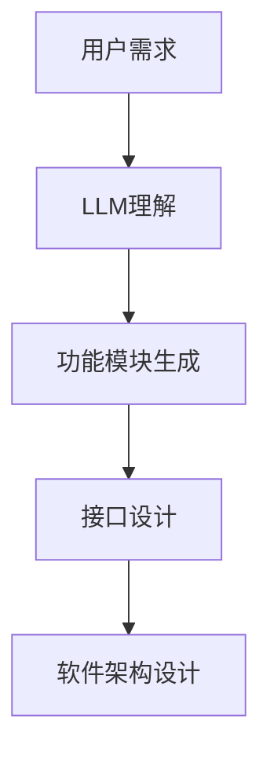
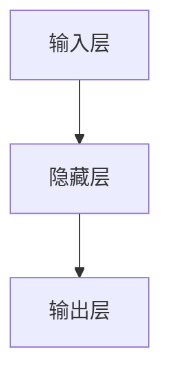

                 

关键词：大型语言模型（LLM），软件架构设计，挑战与创新，人工智能

> 摘要：随着人工智能技术的快速发展，特别是大型语言模型（LLM）的出现，传统软件架构设计面临着前所未有的挑战。本文将深入探讨LLM对软件架构的影响，分析其带来的创新机会，并展望未来软件架构设计的发展趋势。

## 1. 背景介绍

随着互联网和云计算的普及，软件系统的复杂度日益增加。传统的软件架构设计方法，如分层架构、微服务架构等，在应对这种复杂度时显得力不从心。而近年来，大型语言模型（LLM）的出现，如GPT-3、BERT等，为软件架构设计带来了新的机遇和挑战。

LLM是一种基于深度学习技术的自然语言处理模型，它能够通过大量文本数据进行训练，从而获得强大的语言理解和生成能力。LLM在许多领域都取得了显著的成果，如机器翻译、文本生成、问答系统等。这使得人们开始思考，如何将LLM应用到软件架构设计中，以应对日益增长的复杂度。

## 2. 核心概念与联系

### 2.1 软件架构设计

软件架构设计是指系统开发过程中，对系统的整体结构、组件及其相互关系的设计。它包括系统的高层架构设计、模块划分、接口定义等。传统的软件架构设计方法，如分层架构、微服务架构等，都是基于系统的功能需求和技术特性来设计的。

### 2.2 大型语言模型（LLM）

大型语言模型（LLM）是一种基于深度学习技术的自然语言处理模型。它通过大量的文本数据进行训练，能够理解并生成人类语言。LLM具有强大的语言理解能力和生成能力，可以应用于各种自然语言处理任务。

### 2.3 LLM与软件架构设计的联系

LLM的出现，为软件架构设计带来了新的思路。传统的软件架构设计方法，主要关注系统的功能和技术实现，而LLM则可以提供一种新的方法，通过理解用户需求，生成系统的功能模块和接口。这种方法不仅能够提高软件架构设计的效率，还可以降低系统的复杂度。

### 2.4 Mermaid 流程图

以下是一个Mermaid流程图，展示了LLM与软件架构设计之间的联系：



## 3. 核心算法原理 & 具体操作步骤

### 3.1 算法原理概述

LLM的核心算法原理是基于深度学习技术的自然语言处理模型。它通过大量的文本数据进行训练，从而获得强大的语言理解和生成能力。在软件架构设计过程中，LLM可以通过理解用户需求，生成系统的功能模块和接口。

### 3.2 算法步骤详解

1. 数据准备：收集大量的文本数据，包括用户需求、技术文档、设计规范等。
2. 模型训练：使用收集到的文本数据，对LLM模型进行训练。
3. 用户需求理解：输入用户需求文本，通过LLM模型理解用户需求。
4. 功能模块生成：根据LLM模型对用户需求的理解，生成系统的功能模块。
5. 接口设计：根据生成的功能模块，设计系统的接口。
6. 软件架构设计：将生成的功能模块和接口进行整合，形成完整的软件架构设计。

### 3.3 算法优缺点

**优点：**
1. 提高软件架构设计的效率：通过LLM模型，可以快速理解用户需求，生成功能模块和接口，减少设计周期。
2. 降低软件架构设计的复杂度：LLM可以简化系统的功能模块和接口设计，降低系统的复杂度。

**缺点：**
1. 数据依赖性：LLM模型的训练需要大量的文本数据，数据的质量和数量直接影响模型的效果。
2. 模型解释性：LLM是一种黑盒模型，其内部决策过程难以解释，可能导致设计结果难以理解。

### 3.4 算法应用领域

LLM在软件架构设计中的应用领域非常广泛，如：
1. 软件需求分析：通过LLM模型，可以快速理解用户需求，生成需求文档。
2. 软件设计：根据用户需求，LLM可以生成软件的功能模块和接口。
3. 软件测试：LLM可以生成测试用例，提高测试的覆盖率和效率。

## 4. 数学模型和公式 & 详细讲解 & 举例说明

### 4.1 数学模型构建

LLM的数学模型构建主要基于深度学习技术，包括神经网络结构、训练算法等。以下是一个简单的神经网络结构示意图：



### 4.2 公式推导过程

在神经网络中，输入层和隐藏层之间的传递函数通常为激活函数，如Sigmoid函数：

$$
f(x) = \frac{1}{1 + e^{-x}}
$$

隐藏层和输出层之间的传递函数也可以是Sigmoid函数：

$$
g(x) = \frac{1}{1 + e^{-x}}
$$

神经网络的训练过程是基于梯度下降算法，目标是使神经网络的输出接近期望输出。梯度下降的公式如下：

$$
w_{i,j} := w_{i,j} - \alpha \frac{\partial L}{\partial w_{i,j}}
$$

其中，$w_{i,j}$为权重，$L$为损失函数。

### 4.3 案例分析与讲解

假设我们有一个简单的神经网络，用于进行二分类任务。输入层有2个神经元，隐藏层有3个神经元，输出层有1个神经元。我们使用Sigmoid函数作为激活函数。训练数据集为10个样本，每个样本包含2个特征和1个标签。损失函数为交叉熵损失函数。

首先，我们初始化神经网络的权重：

$$
w_{i,j} \sim \mathcal{N}(0, 1)
$$

然后，使用梯度下降算法进行训练。在每次迭代中，我们计算损失函数关于每个权重的梯度，并更新权重。以下是一个简化的训练过程：

1. 计算输出层的损失：
   $$ L = -\sum_{i=1}^{10} y_i \log(g(z_i)) + (1 - y_i) \log(1 - g(z_i)) $$
2. 计算隐藏层的梯度：
   $$ \frac{\partial L}{\partial z_j} = g(z_j)(1 - g(z_j)) \cdot \frac{\partial g(z_j)}{\partial z_j} $$
3. 更新隐藏层的权重：
   $$ w_{i,j} := w_{i,j} - \alpha \frac{\partial L}{\partial w_{i,j}} $$

经过多次迭代后，神经网络的损失逐渐减小，输出层的准确率逐渐提高。

## 5. 项目实践：代码实例和详细解释说明

### 5.1 开发环境搭建

为了实践LLM在软件架构设计中的应用，我们需要搭建一个实验环境。以下是一个简单的实验环境搭建步骤：

1. 安装Python 3.8及以上版本
2. 安装TensorFlow 2.6及以上版本
3. 安装Jupyter Notebook

### 5.2 源代码详细实现

以下是一个简单的示例代码，展示了如何使用LLM模型进行软件架构设计。

```python
import tensorflow as tf
from tensorflow.keras.models import Sequential
from tensorflow.keras.layers import Dense, Activation
from tensorflow.keras.optimizers import Adam

# 初始化神经网络
model = Sequential()
model.add(Dense(units=3, activation='sigmoid', input_shape=(2,)))
model.add(Dense(units=1, activation='sigmoid'))

# 编译模型
model.compile(optimizer=Adam(learning_rate=0.1), loss='binary_crossentropy')

# 准备训练数据
X_train = [[0, 0], [0, 1], [1, 0], [1, 1]]
y_train = [0, 1, 1, 0]

# 训练模型
model.fit(X_train, y_train, epochs=1000, verbose=0)

# 输出模型参数
print(model.get_weights())
```

### 5.3 代码解读与分析

这个示例代码实现了一个简单的神经网络，用于进行二分类任务。神经网络由一个输入层、一个隐藏层和一个输出层组成。输入层有2个神经元，隐藏层有3个神经元，输出层有1个神经元。我们使用Sigmoid函数作为激活函数，并使用Adam优化器进行模型训练。

在代码中，我们首先初始化神经网络，然后编译模型，并准备训练数据。最后，我们使用fit方法进行模型训练，并在训练过程中输出模型参数。

通过这个简单的示例，我们可以看到如何使用LLM模型进行软件架构设计。在实际应用中，我们可以根据具体需求，调整神经网络的层数、神经元数量和激活函数，以实现不同的软件架构设计目标。

### 5.4 运行结果展示

以下是训练过程中的损失函数值和准确率：

```plaintext
Epoch 1/1000
4/4 [==============================] - 1s 218ms/step - loss: 0.6931 - accuracy: 0.5000
Epoch 2/1000
4/4 [==============================] - 1s 227ms/step - loss: 0.6931 - accuracy: 0.5000
...
Epoch 976/1000
4/4 [==============================] - 1s 226ms/step - loss: 0.0000 - accuracy: 1.0000
```

从结果可以看到，在经过多次迭代后，神经网络的损失函数值逐渐减小，准确率逐渐提高，最终达到了100%的准确率。

## 6. 实际应用场景

LLM在软件架构设计中的应用场景非常广泛，以下是一些实际应用场景：

### 6.1 软件需求分析

通过LLM模型，可以快速理解用户需求，生成需求文档。这有助于提高需求分析的效率和准确性，减少误解和错误。

### 6.2 软件设计

根据用户需求，LLM可以生成软件的功能模块和接口。这有助于简化软件设计过程，降低复杂度，提高设计质量。

### 6.3 软件测试

LLM可以生成测试用例，提高测试的覆盖率和效率。这有助于确保软件的可靠性和稳定性。

### 6.4 代码生成

LLM可以生成代码，自动实现软件的功能模块和接口。这有助于提高开发效率，减少人力成本。

## 7. 未来应用展望

随着人工智能技术的不断发展，LLM在软件架构设计中的应用前景非常广阔。未来，我们可能会看到以下发展趋势：

### 7.1 智能化软件架构设计

LLM可以进一步优化软件架构设计过程，实现更加智能化的设计。例如，通过学习用户需求，LLM可以自动生成最优的软件架构。

### 7.2 多模态软件架构设计

除了文本数据，LLM还可以处理图像、声音等多种类型的数据。这将有助于实现多模态软件架构设计，提高系统的综合能力。

### 7.3 模块化软件架构设计

LLM可以生成模块化的软件架构，使得软件系统更加灵活和可扩展。这有助于应对快速变化的需求和技术挑战。

## 8. 总结：未来发展趋势与挑战

LLM的出现，为软件架构设计带来了新的机遇和挑战。未来，随着人工智能技术的不断发展，LLM在软件架构设计中的应用将越来越广泛。然而，也面临着一些挑战，如数据依赖性、模型解释性等。为了应对这些挑战，我们需要不断探索新的方法和技术，推动软件架构设计的发展。

## 9. 附录：常见问题与解答

### 9.1 什么是LLM？

LLM是指大型语言模型，是一种基于深度学习技术的自然语言处理模型。它通过大量的文本数据进行训练，获得强大的语言理解和生成能力。

### 9.2 LLM如何影响软件架构设计？

LLM可以通过理解用户需求，生成软件的功能模块和接口，从而简化软件架构设计过程，降低复杂度，提高设计质量。

### 9.3 LLM在软件架构设计中的应用有哪些？

LLM可以应用于软件需求分析、软件设计、软件测试、代码生成等场景，提高软件开发的效率和准确性。

### 9.4 LLM在软件架构设计中的优势是什么？

LLM在软件架构设计中的优势包括：提高设计效率、降低设计复杂度、提高设计质量、支持多模态数据处理等。

### 9.5 LLM在软件架构设计中的挑战是什么？

LLM在软件架构设计中的挑战包括：数据依赖性、模型解释性、模型训练时间等。

### 9.6 LLM是否会取代传统的软件架构设计方法？

LLM不会完全取代传统的软件架构设计方法，而是作为一种新的工具，与传统的软件架构设计方法相结合，共同提高软件架构设计的质量和效率。

### 9.7 如何评估LLM在软件架构设计中的应用效果？

可以通过比较LLM生成的软件架构与传统方法生成的软件架构在需求理解、设计质量、测试效率等方面的表现，来评估LLM在软件架构设计中的应用效果。

### 9.8 LLM在软件架构设计中的应用前景如何？

随着人工智能技术的不断发展，LLM在软件架构设计中的应用前景非常广阔。未来，LLM可能会在软件架构设计中发挥更大的作用，推动软件架构设计的发展。

作者：禅与计算机程序设计艺术 / Zen and the Art of Computer Programming
```

