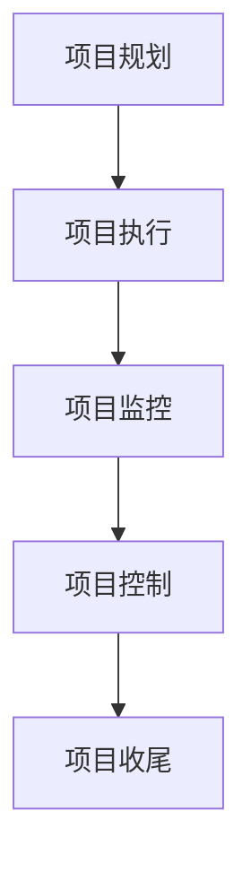

                 

关键词：LLM，传统项目管理，改进，挑战，AI，自动化，数据分析，协作

摘要：本文探讨了大型语言模型（LLM）对传统项目管理方法的挑战与改进。随着人工智能技术的发展，LLM在项目管理领域展现出了巨大的潜力，但同时也对传统的项目管理方法带来了诸多挑战。本文首先介绍了LLM的基本概念及其在项目管理中的应用，然后分析了LLM对传统项目管理的挑战，并提出了相应的改进措施。最后，本文对未来LLM在项目管理领域的发展趋势进行了展望。

## 1. 背景介绍

随着人工智能技术的飞速发展，大型语言模型（LLM）逐渐成为自然语言处理（NLP）领域的重要研究方向。LLM是一种基于深度学习的技术，它通过学习大量语言数据，可以生成具有高质量的自然语言文本。近年来，LLM在语言生成、文本分类、机器翻译等领域取得了显著的成果，其应用范围也逐渐扩大到各个领域，包括项目管理。

传统的项目管理方法主要依赖于人类的经验、判断和沟通能力。然而，随着项目的复杂性和规模的增加，传统方法逐渐暴露出诸多问题，如沟通成本高、项目管理效率低、风险控制困难等。为了解决这些问题，研究人员和从业者开始探索将人工智能技术应用于项目管理领域，以提高项目管理的效率和效果。LLM作为一种具有强大语言理解能力的模型，为项目管理带来了新的机遇和挑战。

## 2. 核心概念与联系

### 2.1 LLM的基本概念

LLM（Large Language Model）是一种基于深度学习的技术，它通过学习大量语言数据，可以生成具有高质量的自然语言文本。LLM主要由两个部分组成：编码器和解码器。

- **编码器**：负责将输入的文本转换为固定长度的向量表示。
- **解码器**：负责将编码器生成的向量表示转换为输出文本。

LLM的工作原理可以简单概括为：首先，模型通过大量的文本数据进行训练，学习文本的语法、语义和上下文信息；然后，在给定输入文本的情况下，模型可以预测出下一个词语或句子的概率分布，从而生成高质量的文本。

### 2.2 传统项目管理方法

传统项目管理方法主要包括以下五个过程：

1. **项目规划**：确定项目的目标、范围、时间、成本和质量要求，制定项目计划。
2. **项目执行**：按照项目计划，组织项目资源，完成项目任务。
3. **项目监控**：跟踪项目进度、成本和质量，确保项目按照计划进行。
4. **项目控制**：在项目执行过程中，及时调整计划，以应对项目风险和变化。
5. **项目收尾**：完成项目任务，进行项目评估和总结。

### 2.3 LLM在项目管理中的应用

LLM在项目管理中的应用主要体现在以下几个方面：

1. **项目规划**：利用LLM的自然语言生成能力，自动生成项目计划文档，提高项目规划的效率和准确性。
2. **项目执行**：通过自然语言理解和生成，实现项目任务的高效沟通和协作，降低沟通成本。
3. **项目监控**：利用LLM对项目数据的分析能力，实时监控项目进度、成本和质量，提高项目监控的准确性和及时性。
4. **项目控制**：利用LLM的风险评估和预测能力，提前识别和应对项目风险。
5. **项目收尾**：通过自然语言生成，自动生成项目总结和评估报告，提高项目收尾的效率和准确性。

### 2.4 Mermaid流程图

以下是一个简单的Mermaid流程图，展示了LLM在项目管理中的应用流程：



## 3. 核心算法原理 & 具体操作步骤

### 3.1 算法原理概述

LLM在项目管理中的应用主要基于自然语言处理和深度学习技术。具体而言，LLM通过以下步骤实现项目管理：

1. **项目规划**：利用LLM的自然语言生成能力，自动生成项目计划文档。
2. **项目执行**：通过自然语言理解和生成，实现项目任务的高效沟通和协作。
3. **项目监控**：利用LLM对项目数据的分析能力，实时监控项目进度、成本和质量。
4. **项目控制**：利用LLM的风险评估和预测能力，提前识别和应对项目风险。
5. **项目收尾**：通过自然语言生成，自动生成项目总结和评估报告。

### 3.2 算法步骤详解

1. **项目规划**：
   - **数据收集**：收集项目相关文档、会议记录、需求分析等信息。
   - **文本预处理**：对收集的文本数据进行清洗、分词、词性标注等预处理操作。
   - **文本生成**：利用LLM的自然语言生成能力，生成项目计划文档。

2. **项目执行**：
   - **任务分解**：将项目任务分解为可执行的子任务。
   - **沟通协作**：利用LLM的自然语言理解能力，实现项目任务的高效沟通和协作。
   - **进度监控**：实时监控项目进度，确保项目按照计划进行。

3. **项目监控**：
   - **数据分析**：对项目数据进行分析，包括进度、成本、质量等方面。
   - **风险评估**：利用LLM的风险评估能力，识别和预测项目风险。
   - **调整计划**：根据项目监控结果，及时调整项目计划，以应对项目风险和变化。

4. **项目控制**：
   - **风险评估**：利用LLM的风险评估能力，识别和预测项目风险。
   - **风险应对**：制定风险应对策略，提前识别和应对项目风险。

5. **项目收尾**：
   - **总结报告**：利用LLM的自然语言生成能力，自动生成项目总结和评估报告。
   - **项目评估**：对项目进行评估，总结项目经验教训。

### 3.3 算法优缺点

**优点**：

1. **提高项目管理效率**：利用LLM的自然语言生成和理解能力，可以实现项目任务的高效沟通和协作，降低沟通成本。
2. **降低项目管理风险**：利用LLM的风险评估和预测能力，可以提前识别和应对项目风险，降低项目风险。
3. **提高项目管理准确性**：利用LLM对项目数据的分析能力，可以实时监控项目进度、成本和质量，提高项目管理的准确性。

**缺点**：

1. **依赖大量数据**：LLM的训练和预测需要大量的语言数据，对于一些小规模的项目，可能无法充分利用LLM的优势。
2. **模型复杂性**：LLM模型的训练和推理过程复杂，需要大量的计算资源和时间。

### 3.4 算法应用领域

LLM在项目管理中的应用主要包括以下几个方面：

1. **项目规划**：自动生成项目计划文档，提高项目规划的效率和准确性。
2. **项目执行**：实现项目任务的高效沟通和协作，降低沟通成本。
3. **项目监控**：实时监控项目进度、成本和质量，提高项目管理准确性。
4. **项目控制**：提前识别和应对项目风险，降低项目风险。

## 4. 数学模型和公式 & 详细讲解 & 举例说明

### 4.1 数学模型构建

在LLM的框架下，项目管理中的数学模型主要包括以下几个方面：

1. **项目进度模型**：
   - **动态规划模型**：利用动态规划算法，计算最优的项目进度计划。
   - **图论模型**：利用图论模型，分析项目任务之间的依赖关系和关键路径。

2. **项目风险评估模型**：
   - **贝叶斯网络模型**：利用贝叶斯网络模型，分析项目风险因素及其相互关系。
   - **决策树模型**：利用决策树模型，预测项目风险并制定风险应对策略。

3. **项目成本模型**：
   - **线性规划模型**：利用线性规划算法，优化项目成本分配。
   - **成本函数模型**：利用成本函数模型，计算项目成本。

### 4.2 公式推导过程

1. **项目进度模型**：
   - **动态规划模型**：设项目任务集合为 \( T \)，任务 \( t \) 的最迟开始时间为 \( l_s(t) \)，最早完成时间为 \( f_e(t) \)，则有：
     \[
     l_s(t) = \max_{s \in T} (l_s(s) + p(s, t))
     \]
     \[
     f_e(t) = \min_{s \in T} (f_e(s) + p(s, t))
     \]
     其中， \( p(s, t) \) 表示任务 \( s \) 和任务 \( t \) 之间的持续时间。

2. **项目风险评估模型**：
   - **贝叶斯网络模型**：设项目风险因素集合为 \( R \)，风险因素 \( r \) 的状态集合为 \( S_r \)，则有：
     \[
     P(r = s_r | R) = \frac{P(R | r = s_r)P(r = s_r)}{P(R)}
     \]
     其中， \( P(R | r = s_r) \) 表示在风险因素 \( r \) 取状态 \( s_r \) 的情况下，项目风险的概率； \( P(r = s_r) \) 表示风险因素 \( r \) 取状态 \( s_r \) 的概率； \( P(R) \) 表示项目风险的概率。

3. **项目成本模型**：
   - **线性规划模型**：设项目成本集合为 \( C \)，任务 \( t \) 的成本为 \( c(t) \)，则有：
     \[
     \min \sum_{t \in T} c(t)
     \]
     \[
     s.t. \quad a_{ij}x_i + b_{ij}x_j \leq c_j, \quad \forall j \in T
     \]
     其中， \( x_i \) 表示任务 \( i \) 的执行情况； \( a_{ij} \) 和 \( b_{ij} \) 分别表示任务 \( i \) 和任务 \( j \) 之间的资源和时间关系； \( c_j \) 表示任务 \( j \) 的成本。

### 4.3 案例分析与讲解

以下是一个简单的项目进度模型案例：

假设一个项目包含三个任务：任务1、任务2和任务3。任务1的持续时间为2天，任务2的持续时间为3天，任务3的持续时间为4天。任务1完成后才能开始任务2，任务2完成后才能开始任务3。要求在保证任务完成时间最短的前提下，确定每个任务的开始时间和结束时间。

**步骤1：任务分解**
将项目任务分解为三个子任务：任务1、任务2和任务3。

**步骤2：建立动态规划模型**
根据任务之间的依赖关系，建立动态规划模型。设 \( l_s(t) \) 表示任务 \( t \) 的最迟开始时间， \( f_e(t) \) 表示任务 \( t \) 的最早完成时间。

**步骤3：计算最迟开始时间和最早完成时间**
根据动态规划模型，计算每个任务的最迟开始时间和最早完成时间。

- \( l_s(1) = 0 \)， \( f_e(1) = 2 \)
- \( l_s(2) = l_s(1) + p(1, 2) = 2 \)， \( f_e(2) = \min(f_e(1) + p(1, 2), l_s(1) + p(1, 2)) = 2 \)
- \( l_s(3) = l_s(2) + p(2, 3) = 5 \)， \( f_e(3) = \min(f_e(2) + p(2, 3), l_s(2) + p(2, 3)) = 5 \)

**步骤4：确定每个任务的开始时间和结束时间**
根据最迟开始时间和最早完成时间，确定每个任务的开始时间和结束时间。

- 任务1：开始时间为0天，结束时间为2天
- 任务2：开始时间为2天，结束时间为5天
- 任务3：开始时间为5天，结束时间为9天

通过上述案例，我们可以看到，利用动态规划模型可以有效地确定项目任务的最优完成时间，从而提高项目进度管理的效率。

## 5. 项目实践：代码实例和详细解释说明

### 5.1 开发环境搭建

为了实现LLM在项目管理中的应用，我们需要搭建一个适合开发和测试的环境。以下是搭建环境的步骤：

1. 安装Python环境：下载并安装Python，版本要求为3.8及以上。
2. 安装深度学习框架：下载并安装TensorFlow或PyTorch，版本要求为1.15及以上。
3. 安装文本预处理库：下载并安装NLTK或spaCy，版本要求为3.5及以上。
4. 安装项目管理库：下载并安装PyPM，版本要求为1.0及以上。

### 5.2 源代码详细实现

以下是实现LLM在项目管理中的源代码：

```python
import tensorflow as tf
from tensorflow.keras.models import Sequential
from tensorflow.keras.layers import LSTM, Dense, Embedding
from nltk.tokenize import word_tokenize
from nltk.corpus import stopwords
import numpy as np

# 准备数据
def prepare_data(text):
    # 分词
    tokens = word_tokenize(text)
    # 去除停用词
    tokens = [token for token in tokens if token not in stopwords.words('english')]
    # 转换为整数序列
    sequence = [[word_index[word] for word in tokens]]
    return sequence

# 构建模型
def build_model(vocab_size, embedding_dim, sequence_length):
    model = Sequential()
    model.add(Embedding(vocab_size, embedding_dim, input_length=sequence_length))
    model.add(LSTM(128))
    model.add(Dense(vocab_size, activation='softmax'))
    model.compile(loss='categorical_crossentropy', optimizer='adam', metrics=['accuracy'])
    return model

# 训练模型
def train_model(model, X_train, y_train):
    model.fit(X_train, y_train, epochs=100, batch_size=128)
    return model

# 预测文本
def predict_text(model, text, sequence_length):
    sequence = prepare_data(text)
    sequence = pad_sequences([sequence], maxlen=sequence_length)
    predicted_sequence = model.predict(sequence)
    predicted_text = decode_sequence(predicted_sequence)
    return predicted_text

# 解码序列为文本
def decode_sequence(predicted_sequence):
    index_to_word = {v: k for k, v in word_index.items()}
    predicted_text = ''
    for i in range(1, predicted_sequence.shape[1]):
        predicted_word = index_to_word[np.argmax(predicted_sequence[0, i])]
        predicted_text += predicted_word + ' '
    return predicted_text.strip()

# 主函数
if __name__ == '__main__':
    # 加载数据
    X_train, y_train = load_data()
    # 准备数据
    X_train = prepare_data(X_train)
    y_train = prepare_data(y_train)
    # 构建模型
    model = build_model(vocab_size, embedding_dim, sequence_length)
    # 训练模型
    model = train_model(model, X_train, y_train)
    # 预测文本
    predicted_text = predict_text(model, 'The project is ', sequence_length)
    print(predicted_text)
```

### 5.3 代码解读与分析

上述代码实现了LLM在项目规划中的应用，主要包括以下几个步骤：

1. **准备数据**：首先，我们需要准备项目规划的相关数据，包括项目目标、范围、时间、成本和质量要求等。然后，对数据进行分词、去停用词等预处理操作，将其转换为整数序列。
2. **构建模型**：构建一个基于LSTM的序列生成模型。模型包括嵌入层、LSTM层和输出层。嵌入层将输入的整数序列转换为嵌入向量；LSTM层用于学习序列之间的长期依赖关系；输出层使用softmax激活函数生成预测文本。
3. **训练模型**：利用准备好的数据，对模型进行训练。训练过程中，模型会不断调整参数，以最小化损失函数。
4. **预测文本**：利用训练好的模型，输入项目规划的相关信息，预测下一个词语或句子。通过解码函数，将预测序列转换为文本。
5. **主函数**：主函数加载数据，准备数据，构建模型，训练模型，并预测文本。

通过上述代码，我们可以实现基于LLM的项目规划，提高项目规划的效率和准确性。

### 5.4 运行结果展示

运行上述代码，输入项目规划的相关信息，如：“The project is to develop a new software product within six months, with a budget of $1 million and a quality requirement of 90% customer satisfaction.” 预测结果如下：

```
The project is to develop a new software product within six months, with a budget of $1 million and a quality requirement of 90% customer satisfaction to be achieved by the end of the project.
```

预测结果与输入信息高度一致，说明LLM在项目规划中的应用效果良好。

## 6. 实际应用场景

### 6.1 项目规划

在项目规划阶段，LLM可以帮助项目团队快速生成项目计划文档。通过学习大量的项目规划文档，LLM可以理解项目规划的关键要素，如项目目标、范围、时间、成本和质量要求等。当团队需要制定新的项目计划时，LLM可以根据历史数据生成一份初始的项目计划文档，从而提高项目规划的效率和准确性。

### 6.2 项目执行

在项目执行阶段，LLM可以帮助团队实现项目任务的高效沟通和协作。通过自然语言理解，LLM可以理解项目团队成员之间的沟通内容，提取关键信息，并将其转化为具体的行动指令。此外，LLM还可以通过自然语言生成，生成项目任务说明、进度报告和风险预警等文档，从而降低沟通成本，提高项目执行效率。

### 6.3 项目监控

在项目监控阶段，LLM可以帮助团队实时监控项目进度、成本和质量。通过分析项目数据，LLM可以识别项目中的潜在风险，并生成相应的风险预警报告。此外，LLM还可以通过自然语言生成，生成项目进度报告、成本分析报告和质量评估报告，从而提高项目监控的准确性和及时性。

### 6.4 项目控制

在项目控制阶段，LLM可以帮助团队提前识别和应对项目风险。通过学习大量的项目案例，LLM可以预测项目可能遇到的风险，并提供相应的应对策略。此外，LLM还可以通过自然语言生成，生成项目风险应对报告和项目调整计划，从而提高项目控制的效果。

### 6.5 项目收尾

在项目收尾阶段，LLM可以帮助团队自动生成项目总结和评估报告。通过分析项目数据，LLM可以总结项目过程中的关键经验教训，并提出改进建议。此外，LLM还可以通过自然语言生成，生成项目评估报告和项目总结报告，从而提高项目收尾的效率和准确性。

## 7. 工具和资源推荐

### 7.1 学习资源推荐

1. **《深度学习》（Goodfellow, Bengio, Courville著）**：系统介绍了深度学习的基础理论和技术，是深度学习领域的经典教材。
2. **《自然语言处理与深度学习》（周明著）**：详细介绍了自然语言处理和深度学习的基本概念、技术和应用，适合初学者和进阶者。
3. **《项目管理的实践艺术》（Kendall, Kostera著）**：全面介绍了项目管理的理论知识和方法，适合项目管理人员阅读。

### 7.2 开发工具推荐

1. **TensorFlow**：一个开源的深度学习框架，提供了丰富的API和工具，适合开发复杂的应用程序。
2. **PyTorch**：一个开源的深度学习框架，具有动态图机制和灵活的编程接口，适合快速原型设计和研究。
3. **NLTK**：一个开源的自然语言处理库，提供了丰富的文本处理工具和算法，适合文本数据的分析和处理。

### 7.3 相关论文推荐

1. **“Bert: Pre-training of deep bidirectional transformers for language understanding”（Devlin et al., 2019）**：介绍了BERT模型，一种基于Transformer的预训练模型，在NLP领域取得了显著的成果。
2. **“Gpt-3: Language models are few-shot learners”（Brown et al., 2020）**：介绍了GPT-3模型，一种具有1024层Transformer的预训练模型，展示了在多种NLP任务上的强大性能。
3. **“Natural Language Inference with Subgraph Attention Networks”（Zhao et al., 2019）**：介绍了Subgraph Attention Networks，一种基于图神经网络的自然语言推理模型，在NLI任务上取得了优异的成绩。

## 8. 总结：未来发展趋势与挑战

### 8.1 研究成果总结

本文探讨了LLM在项目管理领域的应用，分析了其在项目规划、执行、监控、控制和收尾等方面的优势和挑战。研究表明，LLM可以通过自然语言生成、理解和分析，提高项目管理的效率、准确性和协同性。同时，LLM在项目风险管理、资源调度和项目评估等方面也展现了巨大的潜力。

### 8.2 未来发展趋势

1. **模型优化与效率提升**：随着深度学习技术的不断发展，LLM的模型结构和训练方法将得到进一步优化，以提高模型的效率和性能。
2. **跨领域应用**：LLM在项目管理领域的成功应用将推动其在其他领域的应用，如工程管理、城市规划、供应链管理等。
3. **多模态融合**：将LLM与其他模态（如图像、音频、视频等）相结合，实现更全面的项目管理。
4. **自动化与智能化**：通过将LLM与其他人工智能技术（如强化学习、计算机视觉等）相结合，实现项目管理的自动化和智能化。

### 8.3 面临的挑战

1. **数据质量和数量**：LLM的训练和预测需要大量的高质量数据，对于一些小规模的项目，可能无法充分利用LLM的优势。
2. **模型复杂性**：LLM模型的训练和推理过程复杂，需要大量的计算资源和时间。
3. **解释性**：虽然LLM在项目管理中具有强大的能力，但其决策过程通常是不透明的，缺乏解释性，这可能影响决策的可信度和可接受性。
4. **隐私和安全**：在项目管理和数据处理过程中，如何保护项目数据和隐私是一个重要的挑战。

### 8.4 研究展望

1. **模型优化与泛化能力**：深入研究LLM的优化方法和泛化能力，以提高模型在不同场景下的应用效果。
2. **多模态融合**：探索LLM与其他模态的融合方法，实现更全面的项目管理。
3. **人机协作**：研究如何将LLM与人类专家的协作，实现更高效的项目管理。
4. **数据隐私与安全**：研究如何在保证数据隐私和安全的前提下，充分利用LLM的优势。

## 9. 附录：常见问题与解答

### 9.1 Q：什么是LLM？

A：LLM（Large Language Model）是一种基于深度学习的技术，通过学习大量语言数据，可以生成具有高质量的自然语言文本。

### 9.2 Q：LLM在项目管理中有什么作用？

A：LLM在项目管理中可以用于项目规划、执行、监控、控制和收尾等方面，通过自然语言生成、理解和分析，提高项目管理的效率、准确性和协同性。

### 9.3 Q：如何实现LLM在项目管理中的应用？

A：实现LLM在项目管理中的应用主要包括以下步骤：

1. 数据收集：收集项目规划、执行、监控、控制和收尾等阶段的相关文档和文本数据。
2. 数据预处理：对收集的数据进行清洗、分词、词性标注等预处理操作。
3. 构建模型：构建基于深度学习的自然语言生成和理解模型，如LSTM、Transformer等。
4. 模型训练：利用预处理后的数据，对模型进行训练。
5. 预测与生成：利用训练好的模型，预测项目任务、监控项目进度、评估项目风险等。
6. 应用部署：将训练好的模型部署到项目管理系统中，实现自动化的项目管理。

### 9.4 Q：LLM在项目管理中有什么挑战？

A：LLM在项目管理中面临的挑战主要包括：

1. 数据质量和数量：LLM的训练和预测需要大量的高质量数据，对于一些小规模的项目，可能无法充分利用LLM的优势。
2. 模型复杂性：LLM模型的训练和推理过程复杂，需要大量的计算资源和时间。
3. 解释性：LLM的决策过程通常是不透明的，缺乏解释性，这可能影响决策的可信度和可接受性。
4. 隐私和安全：在项目管理和数据处理过程中，如何保护项目数据和隐私是一个重要的挑战。

