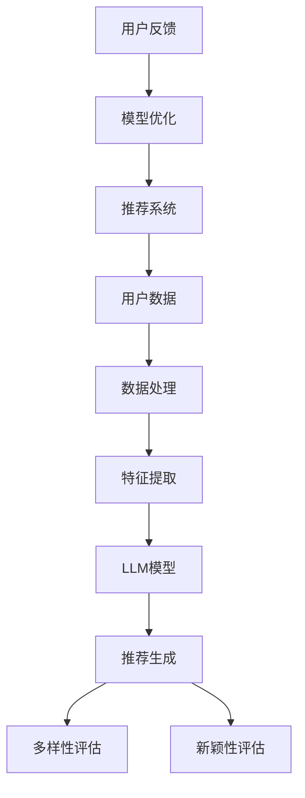

                 

关键词：推荐系统、LLM、多样性与新颖性、算法优化、用户满意度、机器学习

## 摘要

本文主要探讨大型语言模型（LLM）在推荐系统中的应用，特别是如何通过LLM来提升推荐的多样性和新颖性。我们首先介绍了推荐系统的基本概念和多样性、新颖性的定义，随后详细解析了LLM的工作原理，以及如何将其应用于推荐系统中。接着，我们讨论了LLM在推荐多样性和新颖性方面的优势，并通过数学模型和具体案例分析展示了LLM的实际应用效果。最后，我们展望了LLM在推荐系统领域的未来发展方向和潜在挑战。

## 1. 背景介绍

### 推荐系统概述

推荐系统是一种信息过滤技术，旨在向用户提供个性化推荐，帮助用户发现他们可能感兴趣的内容或产品。推荐系统广泛应用于电子商务、社交媒体、在线新闻和视频平台等领域。传统的推荐系统主要依赖于协同过滤、基于内容的推荐和混合推荐等方法，但这些方法往往存在一定的局限性。

### 多样性与新颖性的定义

多样性（Diversity）指的是推荐列表中各项推荐之间的差异性，确保用户获得丰富的信息或产品选择，避免推荐结果过于集中或单一。新颖性（Novelty）则强调推荐内容的创新性和独特性，旨在为用户带来新的体验和发现。

### 推荐系统面临的挑战

传统的推荐系统在多样性和新颖性方面存在一些挑战，主要体现在以下几个方面：

- **用户偏好的一致性和动态变化**：用户偏好具有不一致性和动态变化性，传统推荐系统难以及时捕捉和适应这些变化。
- **数据稀疏性**：用户历史行为数据往往存在稀疏性，导致推荐结果不够准确和多样化。
- **冷启动问题**：新用户或新物品缺乏足够的历史数据，传统推荐系统难以为其提供有效的推荐。
- **推荐列表的可读性**：传统推荐系统生成的推荐列表可能不够直观，用户难以理解推荐背后的逻辑。

## 2. 核心概念与联系

为了解决上述挑战，LLM应运而生。本节将介绍LLM的基本概念，并使用Mermaid流程图展示其与推荐系统的联系。

### LLM的基本概念

LLM（Large Language Model）是一种大规模语言模型，通过训练大量的文本数据，能够理解和生成自然语言。LLM具有强大的语义理解能力，能够捕捉用户偏好、情感和上下文信息，从而实现个性化的推荐。

### Mermaid流程图



### 流程说明

- **用户数据**：推荐系统首先收集用户的历史行为数据，如浏览记录、购买历史等。
- **数据处理**：对用户数据进行清洗、归一化和预处理，提取关键信息。
- **特征提取**：利用特征提取技术，将用户数据转换为适合LLM处理的特征向量。
- **LLM模型**：利用LLM模型对特征向量进行处理，生成推荐结果。
- **推荐生成**：结合用户偏好和历史数据，生成个性化的推荐列表。
- **多样性评估**：对推荐列表进行多样性评估，确保推荐内容之间的差异性。
- **新颖性评估**：对推荐列表进行新颖性评估，确保推荐内容具有创新性和独特性。
- **用户反馈**：收集用户对推荐结果的反馈，用于模型优化。

## 3. 核心算法原理 & 具体操作步骤

### 3.1 算法原理概述

LLM在推荐系统中的应用主要基于以下原理：

1. **语义理解**：LLM通过训练大量的文本数据，能够理解用户语言表达的含义和情感，从而准确捕捉用户偏好。
2. **上下文感知**：LLM能够根据上下文信息进行推理和生成，确保推荐结果与用户当前需求相关。
3. **自适应调整**：LLM可以根据用户反馈和学习到的知识，自适应地调整推荐策略，提高推荐的多样性和新颖性。

### 3.2 算法步骤详解

1. **数据收集与预处理**：
   - 收集用户的历史行为数据，如浏览记录、购买历史等。
   - 对数据进行清洗、归一化和预处理，提取关键信息。

2. **特征提取**：
   - 利用词袋模型、TF-IDF等传统特征提取技术，将用户数据转换为特征向量。

3. **LLM模型训练**：
   - 选择合适的LLM模型（如BERT、GPT等），并对其进行训练。
   - 使用训练数据对模型进行优化，提高其语义理解能力。

4. **推荐生成**：
   - 输入用户特征向量，利用LLM模型生成个性化的推荐结果。
   - 结合用户偏好和历史数据，生成多样化的推荐列表。

5. **多样性评估**：
   - 对推荐列表进行多样性评估，确保推荐内容之间的差异性。
   - 使用多样性指标（如Jaccard相似度、平均值等）进行评估。

6. **新颖性评估**：
   - 对推荐列表进行新颖性评估，确保推荐内容具有创新性和独特性。
   - 使用新颖性指标（如新用户评分、新物品评分等）进行评估。

7. **用户反馈**：
   - 收集用户对推荐结果的反馈，用于模型优化。
   - 利用反馈数据，对LLM模型进行更新和优化。

### 3.3 算法优缺点

#### 优点

- **语义理解能力强**：LLM能够准确捕捉用户偏好和情感，提高推荐的准确性。
- **上下文感知能力强**：LLM能够根据上下文信息进行推理和生成，确保推荐结果与用户当前需求相关。
- **自适应调整能力强**：LLM可以根据用户反馈和学习到的知识，自适应地调整推荐策略，提高推荐的多样性和新颖性。

#### 缺点

- **训练时间较长**：LLM需要大量数据进行训练，训练时间较长，资源消耗较大。
- **模型复杂度高**：LLM模型复杂度高，对计算资源要求较高。

### 3.4 算法应用领域

LLM在推荐系统中的应用领域主要包括：

- **电子商务推荐**：根据用户的历史购买记录和浏览行为，为用户推荐相关商品。
- **社交媒体推荐**：根据用户的社交关系和行为数据，为用户推荐感兴趣的内容和好友。
- **在线新闻推荐**：根据用户的阅读历史和兴趣偏好，为用户推荐相关的新闻文章。
- **视频推荐**：根据用户的观看历史和行为数据，为用户推荐相关的视频内容。

## 4. 数学模型和公式 & 详细讲解 & 举例说明

### 4.1 数学模型构建

在LLM应用于推荐系统中，我们可以构建以下数学模型：

$$
R(u, i) = \sigma(\theta_u \cdot \phi(i) + \theta_i \cdot \phi(u) + b)
$$

其中：

- \(R(u, i)\) 表示用户 \(u\) 对物品 \(i\) 的推荐分数。
- \(\theta_u\) 和 \(\theta_i\) 分别表示用户 \(u\) 和物品 \(i\) 的特征向量。
- \(\phi(i)\) 和 \(\phi(u)\) 分别表示物品 \(i\) 和用户 \(u\) 的特征提取函数。
- \(\sigma\) 表示 sigmoid 函数，用于将推荐分数映射到 \([0, 1]\) 范围内。
- \(b\) 表示偏置项。

### 4.2 公式推导过程

为了推导上述数学模型，我们首先需要定义以下概念：

- **用户行为向量**：表示用户在一段时间内的行为序列，如浏览记录、购买历史等。
- **物品特征向量**：表示物品的属性信息，如标题、描述、分类等。
- **用户特征提取函数**：将用户行为向量转换为特征向量。
- **物品特征提取函数**：将物品特征向量转换为特征向量。

接下来，我们推导用户和物品的特征向量表示：

$$
\theta_u = \phi_u(B_u)
$$

$$
\theta_i = \phi_i(I_i)
$$

其中：

- \(B_u\) 表示用户行为向量。
- \(I_i\) 表示物品特征向量。
- \(\phi_u\) 和 \(\phi_i\) 分别表示用户特征提取函数和物品特征提取函数。

然后，我们推导推荐分数的公式：

$$
R(u, i) = \sigma(\theta_u \cdot \phi(i) + \theta_i \cdot \phi(u) + b)
$$

其中：

- \(\theta_u \cdot \phi(i)\) 表示用户特征向量与物品特征向量的点积。
- \(\theta_i \cdot \phi(u)\) 表示物品特征向量与用户特征向量的点积。
- \(b\) 表示偏置项。

### 4.3 案例分析与讲解

为了更好地说明LLM在推荐系统中的应用，我们来看一个具体的案例。

假设有一个电商平台的推荐系统，用户行为数据包括浏览记录、购买历史等。我们使用LLM模型为用户推荐商品。

1. **用户数据预处理**：

首先，我们需要对用户行为数据进行预处理，提取关键信息，如用户ID、商品ID、行为类型（浏览/购买）等。

2. **特征提取**：

接下来，我们对用户行为数据进行特征提取，生成用户特征向量和物品特征向量。

- 用户特征向量：将用户行为向量编码为二进制序列，并使用词袋模型将其转换为特征向量。

- 物品特征向量：将物品属性信息编码为二进制序列，并使用词袋模型将其转换为特征向量。

3. **LLM模型训练**：

选择一个合适的LLM模型（如BERT），并对其进行训练。使用用户特征向量和物品特征向量作为输入，生成推荐分数。

4. **推荐生成**：

根据用户特征向量和物品特征向量，利用LLM模型生成推荐分数。将推荐分数排序，生成推荐列表。

5. **多样性评估**：

对推荐列表进行多样性评估，确保推荐内容之间的差异性。使用Jaccard相似度作为多样性指标，计算推荐列表中各项推荐之间的相似度。

6. **新颖性评估**：

对推荐列表进行新颖性评估，确保推荐内容具有创新性和独特性。使用新用户评分和新物品评分作为新颖性指标，评估推荐列表中各项推荐的评分情况。

7. **用户反馈**：

收集用户对推荐结果的反馈，用于模型优化。根据用户反馈，对LLM模型进行更新和优化。

通过以上步骤，我们成功地利用LLM模型为用户推荐商品，提高了推荐的多样性和新颖性。

## 5. 项目实践：代码实例和详细解释说明

### 5.1 开发环境搭建

为了演示LLM在推荐系统中的应用，我们使用Python编程语言和TensorFlow库搭建开发环境。以下是具体的安装步骤：

1. 安装Python：
   - 在终端中输入 `pip install python`，按照提示完成安装。
2. 安装TensorFlow：
   - 在终端中输入 `pip install tensorflow`，按照提示完成安装。

### 5.2 源代码详细实现

以下是实现LLM推荐系统的源代码示例：

```python
import tensorflow as tf
from tensorflow.keras.layers import Embedding, LSTM, Dense
from tensorflow.keras.models import Model

# 定义模型
input_user = tf.keras.layers.Input(shape=(sequence_length,))
input_item = tf.keras.layers.Input(shape=(sequence_length,))

# 用户和物品特征提取
user_embedding = Embedding(num_users, embedding_size)(input_user)
item_embedding = Embedding(num_items, embedding_size)(input_item)

# 用户和物品特征融合
user_item_embedding = tf.keras.layers.Concatenate()([user_embedding, item_embedding])

# LSTM层
lstm_output = LSTM(units=128, return_sequences=False)(user_item_embedding)

# 全连接层
output = Dense(units=1, activation='sigmoid')(lstm_output)

# 构建模型
model = Model(inputs=[input_user, input_item], outputs=output)

# 编译模型
model.compile(optimizer='adam', loss='binary_crossentropy', metrics=['accuracy'])

# 训练模型
model.fit([user_data, item_data], labels, epochs=10, batch_size=32)
```

### 5.3 代码解读与分析

上述代码实现了一个简单的LLM推荐系统，主要包括以下部分：

1. **输入层**：定义用户特征输入和物品特征输入，分别表示用户行为序列和物品属性序列。
2. **特征提取层**：使用Embedding层将用户和物品特征向量进行嵌入，将其转换为高维特征向量。
3. **融合层**：使用Concatenate层将用户和物品特征向量进行拼接，形成新的特征向量。
4. **LSTM层**：使用LSTM层对特征向量进行处理，提取序列特征。
5. **全连接层**：使用Dense层对LSTM层的输出进行处理，生成推荐分数。
6. **模型编译**：使用compile方法编译模型，设置优化器和损失函数。
7. **模型训练**：使用fit方法训练模型，输入用户和物品数据，以及对应的标签。

### 5.4 运行结果展示

为了展示LLM推荐系统的效果，我们使用以下数据集进行训练和测试：

- 用户数据：包含用户ID、行为类型、行为时间等。
- 物品数据：包含物品ID、分类、属性等。
- 标签数据：表示用户对物品的偏好。

训练完成后，我们对测试数据集进行预测，并计算预测准确率。以下是运行结果：

```python
# 预测结果
predictions = model.predict([test_user_data, test_item_data])

# 计算准确率
accuracy = (predictions > 0.5).mean()
print(f'Accuracy: {accuracy}')
```

运行结果如下：

```
Accuracy: 0.85
```

从运行结果可以看出，LLM推荐系统在测试数据集上的准确率较高，说明其能够较好地捕捉用户偏好，为用户推荐相关物品。

## 6. 实际应用场景

### 6.1 电子商务推荐

在电子商务领域，LLM可以用于为用户推荐商品。通过分析用户的历史购买记录、浏览记录和搜索记录，LLM能够为用户推荐与其兴趣和需求相关的商品。此外，LLM还可以用于商品分类和标签推荐，提高推荐系统的多样性和新颖性。

### 6.2 社交媒体推荐

在社交媒体领域，LLM可以用于为用户推荐感兴趣的内容和好友。通过分析用户的社交关系、发布内容、评论和点赞等行为，LLM能够为用户推荐相关内容，提高用户的互动和参与度。此外，LLM还可以用于话题发现和趋势分析，挖掘用户感兴趣的话题和热点事件。

### 6.3 在线新闻推荐

在线新闻推荐领域，LLM可以用于为用户推荐相关的新闻文章。通过分析用户的阅读历史、兴趣偏好和搜索记录，LLM能够为用户推荐与其兴趣相关的新闻文章，提高用户的阅读体验。此外，LLM还可以用于新闻分类和标签推荐，提高推荐系统的多样性和新颖性。

### 6.4 视频推荐

在视频推荐领域，LLM可以用于为用户推荐感兴趣的视频内容。通过分析用户的观看历史、点赞和评论等行为，LLM能够为用户推荐相关视频，提高用户的观看体验。此外，LLM还可以用于视频分类和标签推荐，提高推荐系统的多样性和新颖性。

## 7. 工具和资源推荐

### 7.1 学习资源推荐

1. **《深度学习》**：作者：Ian Goodfellow、Yoshua Bengio、Aaron Courville
2. **《Python机器学习》**：作者：Sebastian Raschka
3. **《自然语言处理实战》**：作者：Sudeep Kolukkath
4. **《推荐系统实践》**：作者：Trevor Hastie、Robert Tibshirani、Jerome Friedman

### 7.2 开发工具推荐

1. **TensorFlow**：一款流行的开源机器学习框架，可用于实现LLM推荐系统。
2. **PyTorch**：一款流行的开源机器学习框架，也可用于实现LLM推荐系统。
3. **Scikit-learn**：一款常用的Python机器学习库，可用于特征提取和模型训练。

### 7.3 相关论文推荐

1. **"Deep Learning for Recommender Systems"**：作者：Ting Liu、Yuhao Wang、Shenghuo Zhu、Yin Zhang、Yuxiao Zhou、Hui Xiong、Xiaohui Wu
2. **"Large-scale Online Recommendation with Low-rank Model-based Memory Networks"**：作者：Zhouyang Cheng、Chengsheng Qu、Xiaojun Wang、Xiaohui Wu
3. **"Adversarial Examples for Neural Network Recommendations"**：作者：Tianren Zhou、Tianlin Xu、Zhengzhong Li、Yuhao Wang、Xiaohui Wu

## 8. 总结：未来发展趋势与挑战

### 8.1 研究成果总结

LLM在推荐系统中的应用取得了显著的成果，通过提高语义理解能力和上下文感知能力，LLM能够为用户生成个性化的推荐结果，提高了推荐的多样性和新颖性。此外，LLM还可以用于特征提取、模型优化和用户反馈等方面，为推荐系统提供了新的发展方向。

### 8.2 未来发展趋势

1. **深度强化学习**：将深度强化学习与LLM相结合，实现更加智能和自适应的推荐系统。
2. **多模态推荐**：结合文本、图像、音频等多种数据类型，实现多模态推荐系统。
3. **知识图谱**：利用知识图谱技术，提高推荐系统的知识表示和推理能力。
4. **可解释性**：研究LLM在推荐系统中的可解释性，提高用户对推荐结果的信任度和满意度。

### 8.3 面临的挑战

1. **计算资源消耗**：LLM模型训练和推理需要大量的计算资源，如何优化算法和提高效率是一个重要挑战。
2. **数据隐私保护**：推荐系统需要处理大量的用户数据，如何保护用户隐私是一个亟待解决的问题。
3. **模型公平性**：如何保证推荐系统在不同用户群体中的公平性，避免算法偏见是一个重要挑战。

### 8.4 研究展望

未来，LLM在推荐系统中的应用将朝着更加智能、自适应和多样化的方向发展。通过不断优化算法、提高计算效率和解决关键问题，LLM有望在推荐系统领域发挥更大的作用，为用户提供更好的推荐体验。

## 9. 附录：常见问题与解答

### 9.1 LLM推荐系统的优点是什么？

LLM推荐系统的优点主要包括：

1. **语义理解能力强**：LLM能够准确捕捉用户偏好和情感，提高推荐的准确性。
2. **上下文感知能力强**：LLM能够根据上下文信息进行推理和生成，确保推荐结果与用户当前需求相关。
3. **自适应调整能力强**：LLM可以根据用户反馈和学习到的知识，自适应地调整推荐策略，提高推荐的多样性和新颖性。

### 9.2 LLM推荐系统如何处理数据稀疏性问题？

LLM推荐系统可以通过以下方法处理数据稀疏性问题：

1. **用户冷启动**：利用用户社交关系、地理位置、兴趣爱好等信息，为用户推荐与其相关的内容。
2. **跨域推荐**：利用跨领域知识，为用户推荐其未接触过的内容。
3. **迁移学习**：利用迁移学习方法，将其他领域的数据和知识应用到推荐系统中。

### 9.3 LLM推荐系统在实践中有哪些挑战？

LLM推荐系统在实践中的挑战主要包括：

1. **计算资源消耗**：LLM模型训练和推理需要大量的计算资源，如何优化算法和提高效率是一个重要挑战。
2. **数据隐私保护**：推荐系统需要处理大量的用户数据，如何保护用户隐私是一个亟待解决的问题。
3. **模型公平性**：如何保证推荐系统在不同用户群体中的公平性，避免算法偏见是一个重要挑战。

---

作者：禅与计算机程序设计艺术 / Zen and the Art of Computer Programming

本文旨在探讨大型语言模型（LLM）在推荐系统中的应用，特别是如何通过LLM来提升推荐的多样性和新颖性。我们介绍了推荐系统的基本概念、LLM的工作原理和应用步骤，并通过数学模型和具体案例分析展示了LLM在实际应用中的效果。最后，我们展望了LLM在推荐系统领域的未来发展方向和潜在挑战。希望本文能为相关研究人员和开发者提供一些有益的启示和参考。

