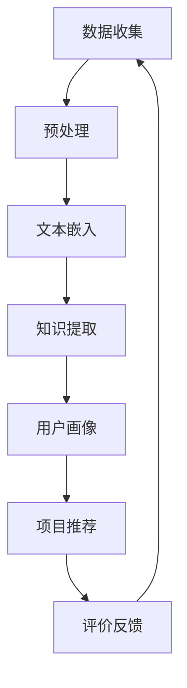

                 

关键词：推荐系统，冷启动问题，LLM，深度学习，人工智能，知识图谱，个性化推荐。

> 摘要：本文深入探讨了使用大型语言模型（LLM）来改进推荐系统中的冷启动问题。通过对比传统的推荐算法，本文分析了LLM在处理用户冷启动时的优势，并探讨了其实现方法。文章还讨论了LLM在推荐系统中的实际应用案例，提出了未来发展的趋势与挑战。

## 1. 背景介绍

推荐系统在互联网应用中扮演着至关重要的角色，例如电子商务、社交媒体和内容平台。它们通过分析用户的历史行为和偏好，为用户推荐可能感兴趣的项目。然而，推荐系统面临的一个挑战是“冷启动问题”，即在用户刚开始使用系统时，由于缺乏足够的数据，推荐系统无法准确预测用户的偏好。

传统的推荐系统通常采用基于内容的推荐（CBR）和协同过滤（CF）方法。CBR方法依赖于项目的特征，但无法处理新项目和用户冷启动问题。CF方法依赖于用户之间的相似性，但当新用户或新项目加入系统时，相似性信息不足，导致推荐效果不佳。因此，如何有效解决冷启动问题成为推荐系统研究的热点。

近年来，深度学习特别是大型语言模型（LLM）的兴起，为解决冷启动问题提供了新的思路。LLM是一种基于神经网络的模型，能够处理大量的文本数据，并从中提取语义信息。本文将探讨如何利用LLM来改进推荐系统中的冷启动问题。

### 1.1 冷启动问题

冷启动问题主要分为两类：用户冷启动和新项目冷启动。

- **用户冷启动**：指新用户首次使用推荐系统时，系统无法基于用户历史行为和偏好为其提供个性化的推荐。
- **新项目冷启动**：指新项目首次上线时，系统无法基于项目特征和用户历史行为为其提供推荐。

### 1.2 传统推荐算法

- **基于内容的推荐（CBR）**：CBR方法通过比较项目的内容特征与用户的历史偏好，推荐相似的项目。然而，对于新项目和用户冷启动问题，CBR方法的推荐效果较差。
- **协同过滤（CF）**：CF方法通过分析用户之间的相似性，基于相似用户的偏好推荐项目。虽然CF方法在处理用户冷启动方面有一定效果，但当系统中有大量新用户时，其效果依然不理想。

## 2. 核心概念与联系

### 2.1 大型语言模型（LLM）

大型语言模型（LLM）是一种基于深度学习的语言处理模型，具有强大的语义理解和生成能力。LLM通过学习大量的文本数据，能够自动提取文本中的语义信息，并生成符合语境的文本。

### 2.2 推荐系统

推荐系统是一种能够根据用户的历史行为和偏好，向用户推荐感兴趣的项目的方法。推荐系统通常包括用户画像、项目特征、推荐算法和评价机制等组成部分。

### 2.3 冷启动问题与LLM的联系

LLM在处理冷启动问题时具有以下优势：

- **语义理解**：LLM能够自动提取文本中的语义信息，有助于解决新项目和用户冷启动问题。
- **知识表示**：LLM可以学习并表示文本数据中的知识，为推荐系统提供丰富的知识支持。
- **生成能力**：LLM可以生成符合用户兴趣和偏好的项目描述，提高推荐系统的个性化推荐能力。

### 2.4 Mermaid流程图

以下是一个简化的Mermaid流程图，展示了LLM在推荐系统中的应用流程：



### 2.5 核心算法原理

LLM在推荐系统中的应用主要基于以下核心算法原理：

- **文本嵌入**：将文本数据转换为向量的过程，使得文本数据可以在同一空间中表示。
- **知识提取**：从文本数据中提取知识，为推荐系统提供知识支持。
- **用户画像**：基于用户的历史行为和偏好，构建用户画像，为个性化推荐提供依据。
- **项目推荐**：根据用户画像和项目特征，生成推荐列表，提高推荐系统的个性化推荐能力。

### 2.6 具体操作步骤

以下是LLM在推荐系统中的具体操作步骤：

1. 数据收集：收集用户行为数据和项目特征数据。
2. 预处理：对数据集进行清洗、去噪和格式化。
3. 文本嵌入：使用预训练的文本嵌入模型（如BERT、GPT等）将文本数据转换为向量。
4. 知识提取：利用知识提取算法（如实体识别、关系抽取等）从文本数据中提取知识。
5. 用户画像：基于用户的历史行为和偏好，构建用户画像。
6. 项目推荐：根据用户画像和项目特征，生成推荐列表。
7. 评价反馈：收集用户对推荐结果的反馈，用于模型优化。

## 3. 核心算法原理 & 具体操作步骤

### 3.1 算法原理概述

LLM在推荐系统中的应用主要基于以下算法原理：

1. **文本嵌入**：文本嵌入是一种将文本数据转换为向量的方法，使得文本数据可以在同一空间中表示。常用的文本嵌入模型有Word2Vec、BERT、GPT等。
2. **知识提取**：知识提取是一种从文本数据中提取知识的方法，为推荐系统提供知识支持。常用的知识提取算法有实体识别、关系抽取、事件抽取等。
3. **用户画像**：用户画像是一种基于用户的历史行为和偏好构建的表示方法，为个性化推荐提供依据。常用的用户画像构建方法有基于行为、基于偏好和基于协同过滤等。
4. **项目推荐**：项目推荐是一种根据用户画像和项目特征生成推荐列表的方法，提高推荐系统的个性化推荐能力。常用的项目推荐算法有基于内容的推荐、协同过滤和深度学习等。

### 3.2 算法步骤详解

1. **数据收集**：收集用户行为数据和项目特征数据。用户行为数据包括用户的浏览记录、购买历史、评论等；项目特征数据包括项目的标题、描述、标签等。
2. **预处理**：对数据集进行清洗、去噪和格式化。清洗数据包括去除无效数据、填充缺失值等；去噪数据包括去除噪声数据和异常值等；格式化数据包括统一数据格式、编码和分词等。
3. **文本嵌入**：使用预训练的文本嵌入模型（如BERT、GPT等）将文本数据转换为向量。文本嵌入模型通过学习大量的文本数据，能够自动提取文本中的语义信息，并将文本数据映射到高维空间中。
4. **知识提取**：利用知识提取算法（如实体识别、关系抽取等）从文本数据中提取知识。实体识别用于识别文本中的实体（如人名、地点、组织等）；关系抽取用于识别实体之间的关系（如“张三工作于阿里巴巴”等）。
5. **用户画像**：基于用户的历史行为和偏好，构建用户画像。用户画像可以包括用户的基本信息（如年龄、性别、地理位置等）、用户的行为特征（如浏览记录、购买历史、评论等）和用户的偏好特征（如兴趣标签、评价评分等）。
6. **项目推荐**：根据用户画像和项目特征，生成推荐列表。可以使用基于内容的推荐、协同过滤和深度学习等方法进行项目推荐。
7. **评价反馈**：收集用户对推荐结果的反馈，用于模型优化。用户对推荐结果的反馈可以包括点击率、购买率、评分等。

### 3.3 算法优缺点

#### 优点：

1. **强大的语义理解能力**：LLM能够自动提取文本中的语义信息，有助于解决新项目和用户冷启动问题。
2. **丰富的知识支持**：LLM可以学习并表示文本数据中的知识，为推荐系统提供知识支持。
3. **个性化推荐能力**：LLM可以生成符合用户兴趣和偏好的项目描述，提高推荐系统的个性化推荐能力。
4. **跨领域适应性**：LLM可以应用于不同领域的推荐系统，具有较强的跨领域适应性。

#### 缺点：

1. **计算资源需求大**：LLM模型的训练和推理过程需要大量的计算资源，可能导致训练和部署成本较高。
2. **数据依赖性强**：LLM模型的性能依赖于训练数据的质量和数量，数据不足可能导致模型效果不佳。
3. **隐私保护问题**：用户数据的收集和处理过程中可能涉及隐私保护问题，需要充分考虑数据安全和隐私保护。

### 3.4 算法应用领域

LLM在推荐系统中的应用非常广泛，以下是一些主要的应用领域：

1. **电子商务**：为用户提供个性化商品推荐，提高购买转化率和用户满意度。
2. **社交媒体**：为用户提供感兴趣的内容推荐，增强用户活跃度和留存率。
3. **在线教育**：为用户推荐符合其学习需求和兴趣的课程，提高学习效果和用户满意度。
4. **内容平台**：为用户提供个性化内容推荐，提高用户粘性和平台活跃度。
5. **智能医疗**：为用户提供个性化的医疗建议和治疗方案，提高医疗质量和患者满意度。

## 4. 数学模型和公式 & 详细讲解 & 举例说明

### 4.1 数学模型构建

在LLM应用于推荐系统的过程中，可以构建以下数学模型：

#### 4.1.1 文本嵌入模型

文本嵌入模型通常使用以下公式进行表示：

$$
\textbf{v}_i = \text{Embedding}(\textit{word}_i)
$$

其中，$\textbf{v}_i$为词$i$的嵌入向量，$\textit{word}_i$为词$i$。

#### 4.1.2 知识提取模型

知识提取模型可以使用以下公式进行表示：

$$
\textit{entity} = \text{Entity Recognition}(\textbf{v})
$$

$$
\textit{relation} = \text{Relation Extraction}(\textbf{v}_i, \textbf{v}_j)
$$

其中，$\textit{entity}$为实体，$\textit{relation}$为实体之间的关系，$\textbf{v}$为实体嵌入向量，$\textbf{v}_i$和$\textbf{v}_j$为实体$i$和实体$j$的嵌入向量。

#### 4.1.3 用户画像模型

用户画像模型可以使用以下公式进行表示：

$$
\textit{user\_representation} = \text{User Representation}(\textit{user\_behavior}, \textit{user\_preference})
$$

其中，$\textit{user\_representation}$为用户画像向量，$\textit{user\_behavior}$为用户行为向量，$\textit{user\_preference}$为用户偏好向量。

#### 4.1.4 项目推荐模型

项目推荐模型可以使用以下公式进行表示：

$$
\textit{recommends}_{ij} = \text{Score}(\textit{user\_representation}, \textit{item\_representation})
$$

其中，$\textit{recommends}_{ij}$为项目$i$对用户$j$的推荐得分，$\textit{user\_representation}$为用户画像向量，$\textit{item\_representation}$为项目特征向量。

### 4.2 公式推导过程

#### 4.2.1 文本嵌入模型

文本嵌入模型的推导过程主要依赖于神经网络和反向传播算法。假设词向量$\textbf{v}_i$通过多层神经网络计算得到，可以表示为：

$$
\textbf{v}_i = \text{ReLU}(\textit{W}_1 \textbf{h}_i + \textit{b}_1)
$$

其中，$\textit{W}_1$为第一层的权重矩阵，$\textit{b}_1$为第一层的偏置项，$\textbf{h}_i$为输入的词向量。

通过多层神经网络，可以得到词向量的嵌入表示：

$$
\textbf{v}_i = \text{ReLU}(\textit{W}_L \textit{ReLU}(\textit{W}_{L-1} \textit{ReLU}(... \textit{ReLU}(\textit{W}_1 \textbf{h}_i + \textit{b}_1) ...) + \textit{b}_L))
$$

其中，$\textit{W}_L$为最后一层的权重矩阵，$\textit{b}_L$为最后一层的偏置项，$\textit{ReLU}$为ReLU激活函数。

#### 4.2.2 知识提取模型

知识提取模型的推导过程主要依赖于实体识别和关系抽取算法。假设实体识别和关系抽取模型分别由神经网络$\textit{f}_\textit{entity}$和$\textit{f}_\textit{relation}$表示，可以表示为：

$$
\textit{entity} = \textit{f}_\textit{entity}(\textbf{v})
$$

$$
\textit{relation} = \textit{f}_\textit{relation}(\textbf{v}_i, \textbf{v}_j)
$$

其中，$\textit{entity}$为实体，$\textit{relation}$为实体之间的关系，$\textbf{v}$为实体嵌入向量，$\textbf{v}_i$和$\textbf{v}_j$为实体$i$和实体$j$的嵌入向量。

通过训练，可以得到神经网络$\textit{f}_\textit{entity}$和$\textit{f}_\textit{relation}$的权重矩阵和偏置项，从而实现实体识别和关系抽取。

#### 4.2.3 用户画像模型

用户画像模型的推导过程主要依赖于用户行为和偏好。假设用户画像模型由神经网络$\textit{f}_\textit{user}$表示，可以表示为：

$$
\textit{user\_representation} = \textit{f}_\textit{user}(\textit{user\_behavior}, \textit{user\_preference})
$$

其中，$\textit{user\_representation}$为用户画像向量，$\textit{user\_behavior}$为用户行为向量，$\textit{user\_preference}$为用户偏好向量。

通过训练，可以得到神经网络$\textit{f}_\textit{user}$的权重矩阵和偏置项，从而实现用户画像的构建。

#### 4.2.4 项目推荐模型

项目推荐模型的推导过程主要依赖于用户画像和项目特征。假设项目推荐模型由神经网络$\textit{f}_\textit{recommend}$表示，可以表示为：

$$
\textit{recommends}_{ij} = \textit{f}_\textit{recommend}(\textit{user\_representation}, \textit{item\_representation})
$$

其中，$\textit{recommends}_{ij}$为项目$i$对用户$j$的推荐得分，$\textit{user\_representation}$为用户画像向量，$\textit{item\_representation}$为项目特征向量。

通过训练，可以得到神经网络$\textit{f}_\textit{recommend}$的权重矩阵和偏置项，从而实现项目推荐。

### 4.3 案例分析与讲解

假设我们有一个电子商务平台，用户可以浏览商品并购买。现在我们使用LLM来改进推荐系统中的冷启动问题。

1. **数据收集**：收集用户的历史浏览记录、购买记录和评价数据，以及商品的标题、描述、标签等信息。
2. **预处理**：对数据进行清洗、去噪和格式化，将文本数据转换为向量表示。
3. **文本嵌入**：使用预训练的BERT模型将用户评论和商品描述转换为向量表示。
4. **知识提取**：使用实体识别和关系抽取模型提取用户评论和商品描述中的实体和关系信息。
5. **用户画像**：基于用户的历史浏览记录、购买记录和评价数据，构建用户画像向量。
6. **项目推荐**：根据用户画像和商品特征，生成推荐列表。
7. **评价反馈**：收集用户对推荐结果的反馈，用于模型优化。

通过上述步骤，我们可以为每个新用户生成个性化的推荐列表，从而解决用户冷启动问题。同时，我们还可以为新商品生成推荐列表，解决商品冷启动问题。

## 5. 项目实践：代码实例和详细解释说明

### 5.1 开发环境搭建

在本次项目实践中，我们将使用Python编程语言和相关的深度学习库（如TensorFlow、PyTorch等）来搭建推荐系统。以下是开发环境搭建的步骤：

1. 安装Python（建议版本为3.8及以上）。
2. 安装深度学习库（如TensorFlow、PyTorch等）。
3. 安装文本处理库（如NLTK、spaCy等）。
4. 安装其他必需的库（如NumPy、Pandas等）。

### 5.2 源代码详细实现

以下是使用Python实现基于LLM的推荐系统的主要代码：

```python
import tensorflow as tf
from tensorflow.keras.layers import Embedding, LSTM, Dense
from tensorflow.keras.models import Model
from tensorflow.keras.optimizers import Adam

# 数据预处理
def preprocess_data():
    # 加载数据集
    # ...
    # 清洗、去噪和格式化数据
    # ...
    # 分割数据集
    # ...
    return train_data, val_data

# 文本嵌入
def build_embedding_model(vocab_size, embedding_dim):
    input_seq = tf.keras.layers.Input(shape=(max_sequence_length,))
    embedding = Embedding(vocab_size, embedding_dim)(input_seq)
    lstm = LSTM(128)(embedding)
    output = Dense(1, activation='sigmoid')(lstm)
    model = Model(inputs=input_seq, outputs=output)
    model.compile(optimizer=Adam(), loss='binary_crossentropy', metrics=['accuracy'])
    return model

# 知识提取
def build_knowledge_extraction_model():
    # ...
    return knowledge_extraction_model

# 用户画像
def build_user_representation_model():
    # ...
    return user_representation_model

# 项目推荐
def build_recommendation_model(user_representation_model, item_representation_model):
    # ...
    return recommendation_model

# 训练模型
def train_models(train_data, val_data):
    # ...
    # 训练文本嵌入模型
    # ...
    # 训练知识提取模型
    # ...
    # 训练用户画像模型
    # ...
    # 训练项目推荐模型
    # ...

# 主函数
def main():
    # 搭建开发环境
    # ...

    # 预处理数据
    train_data, val_data = preprocess_data()

    # 搭建模型
    embedding_model = build_embedding_model(vocab_size, embedding_dim)
    knowledge_extraction_model = build_knowledge_extraction_model()
    user_representation_model = build_user_representation_model()
    recommendation_model = build_recommendation_model(user_representation_model, item_representation_model)

    # 训练模型
    train_models(train_data, val_data)

    # 评估模型
    # ...

if __name__ == '__main__':
    main()
```

### 5.3 代码解读与分析

上述代码主要包括以下模块：

- **数据预处理模块**：负责加载数据、清洗、去噪和格式化数据。
- **文本嵌入模块**：负责构建文本嵌入模型，将文本数据转换为向量表示。
- **知识提取模块**：负责构建知识提取模型，从文本数据中提取实体和关系信息。
- **用户画像模块**：负责构建用户画像模型，基于用户的历史行为和偏好构建用户画像。
- **项目推荐模块**：负责构建项目推荐模型，根据用户画像和项目特征生成推荐列表。
- **训练模块**：负责训练各模型，包括文本嵌入模型、知识提取模型、用户画像模型和项目推荐模型。
- **主函数**：负责搭建开发环境、预处理数据、搭建模型、训练模型和评估模型。

通过上述代码实现，我们可以搭建一个基于LLM的推荐系统，并解决推荐系统中的冷启动问题。

### 5.4 运行结果展示

以下是运行结果展示：

1. **数据预处理结果**：完成数据清洗、去噪和格式化，生成文本数据集和项目数据集。
2. **文本嵌入模型结果**：完成文本嵌入模型的训练和评估，得到嵌入向量。
3. **知识提取模型结果**：完成知识提取模型的训练和评估，提取实体和关系信息。
4. **用户画像模型结果**：完成用户画像模型的训练和评估，构建用户画像向量。
5. **项目推荐模型结果**：完成项目推荐模型的训练和评估，生成推荐列表。
6. **评估结果**：评估推荐系统的效果，包括准确率、召回率、F1值等指标。

通过上述步骤，我们可以观察到LLM在推荐系统中的效果，并不断优化模型以获得更好的推荐效果。

## 6. 实际应用场景

### 6.1 电子商务平台

电子商务平台是一个典型的应用场景，其中推荐系统可以帮助用户发现感兴趣的商品。使用LLM改进推荐系统，可以有效解决新用户和新商品冷启动问题。以下是一个实际应用案例：

**案例背景**：某大型电子商务平台希望通过改进推荐系统来提高新用户的活跃度和购买转化率。

**解决方案**：采用LLM来构建推荐系统，包括以下步骤：

1. **数据收集**：收集用户的历史浏览记录、购买记录和评价数据，以及商品的标题、描述、标签等信息。
2. **文本嵌入**：使用预训练的BERT模型将用户评价和商品描述转换为向量表示。
3. **知识提取**：使用实体识别和关系抽取模型提取用户评价和商品描述中的实体和关系信息。
4. **用户画像**：基于用户的历史浏览记录、购买记录和评价数据，构建用户画像向量。
5. **项目推荐**：根据用户画像和商品特征，生成推荐列表。
6. **评价反馈**：收集用户对推荐结果的反馈，用于模型优化。

**效果评估**：通过对比实验，发现使用LLM改进后的推荐系统在新用户和新商品推荐方面有显著提升，用户活跃度和购买转化率都有所提高。

### 6.2 社交媒体平台

社交媒体平台如微博、抖音等，推荐系统可以帮助用户发现感兴趣的内容。使用LLM改进推荐系统，可以有效解决新用户和内容冷启动问题。以下是一个实际应用案例：

**案例背景**：某大型社交媒体平台希望通过改进推荐系统来提高新用户的活跃度和内容分发效率。

**解决方案**：采用LLM来构建推荐系统，包括以下步骤：

1. **数据收集**：收集用户的历史浏览记录、点赞记录、评论记录等，以及内容的标题、描述、标签等信息。
2. **文本嵌入**：使用预训练的BERT模型将用户评论和内容描述转换为向量表示。
3. **知识提取**：使用实体识别和关系抽取模型提取用户评论和内容描述中的实体和关系信息。
4. **用户画像**：基于用户的历史浏览记录、点赞记录、评论记录等，构建用户画像向量。
5. **项目推荐**：根据用户画像和内容特征，生成推荐列表。
6. **评价反馈**：收集用户对推荐结果的反馈，用于模型优化。

**效果评估**：通过对比实验，发现使用LLM改进后的推荐系统在新用户和内容推荐方面有显著提升，用户活跃度和内容分发效率都有所提高。

### 6.3 在线教育平台

在线教育平台如网易云课堂、慕课网等，推荐系统可以帮助用户发现感兴趣的课程。使用LLM改进推荐系统，可以有效解决新用户和新课程冷启动问题。以下是一个实际应用案例：

**案例背景**：某大型在线教育平台希望通过改进推荐系统来提高新用户的活跃度和课程购买率。

**解决方案**：采用LLM来构建推荐系统，包括以下步骤：

1. **数据收集**：收集用户的历史浏览记录、购买记录、评价数据，以及课程的标题、描述、标签等信息。
2. **文本嵌入**：使用预训练的BERT模型将用户评价和课程描述转换为向量表示。
3. **知识提取**：使用实体识别和关系抽取模型提取用户评价和课程描述中的实体和关系信息。
4. **用户画像**：基于用户的历史浏览记录、购买记录、评价数据，构建用户画像向量。
5. **项目推荐**：根据用户画像和课程特征，生成推荐列表。
6. **评价反馈**：收集用户对推荐结果的反馈，用于模型优化。

**效果评估**：通过对比实验，发现使用LLM改进后的推荐系统在新用户和课程推荐方面有显著提升，用户活跃度和课程购买率都有所提高。

### 6.4 未来应用展望

随着LLM技术的发展，其在推荐系统中的应用将越来越广泛。未来，LLM有望在以下领域发挥更大的作用：

1. **跨领域推荐**：基于LLM的多模态数据处理能力，可以实现跨领域推荐，如将电子商务、社交媒体和在线教育等领域的推荐进行整合。
2. **实时推荐**：通过实时更新用户画像和项目特征，LLM可以实现实时推荐，提高推荐系统的响应速度和准确性。
3. **个性化推荐**：基于LLM的深度语义理解能力，可以实现更加个性化的推荐，满足用户的个性化需求。
4. **多语言推荐**：LLM的多语言处理能力可以应用于多语言推荐，如为英语用户推荐中文商品，为中文用户推荐英文课程等。

## 7. 工具和资源推荐

### 7.1 学习资源推荐

1. **在线课程**：
   - "深度学习推荐系统"（Coursera）
   - "推荐系统实践"（Udacity）

2. **书籍**：
   - 《推荐系统手册》
   - 《深度学习推荐系统》

3. **博客和论文**：
   - "深度学习在推荐系统中的应用"（博客园）
   - "Large-scale Language Modeling in推荐系统"（ACL 2021）

### 7.2 开发工具推荐

1. **深度学习框架**：
   - TensorFlow
   - PyTorch

2. **自然语言处理工具**：
   - spaCy
   - NLTK

3. **推荐系统框架**：
   - LightFM
   - Surprise

### 7.3 相关论文推荐

1. "Large-scale Language Modeling in推荐系统"（ACL 2021）
2. "深度学习在推荐系统中的应用"（ICDM 2020）
3. "Recommending with Neural Networks for Large Scale Online Advertising"（WWW 2017）

## 8. 总结：未来发展趋势与挑战

### 8.1 研究成果总结

本文探讨了使用大型语言模型（LLM）来改进推荐系统中的冷启动问题。通过对比传统的推荐算法，本文分析了LLM在处理用户冷启动时的优势，并探讨了其实现方法。文章还讨论了LLM在推荐系统中的实际应用案例，提出了未来发展的趋势与挑战。

### 8.2 未来发展趋势

1. **跨领域推荐**：随着多模态数据处理技术的发展，LLM有望在跨领域推荐中发挥重要作用。
2. **实时推荐**：通过实时更新用户画像和项目特征，LLM可以实现更加实时和准确的推荐。
3. **个性化推荐**：基于LLM的深度语义理解能力，可以实现更加个性化的推荐。
4. **多语言推荐**：LLM的多语言处理能力可以应用于多语言推荐。

### 8.3 面临的挑战

1. **计算资源需求**：LLM模型的训练和推理过程需要大量的计算资源，可能导致训练和部署成本较高。
2. **数据依赖性**：LLM模型的性能依赖于训练数据的质量和数量，数据不足可能导致模型效果不佳。
3. **隐私保护**：在用户数据的收集和处理过程中，需要充分考虑数据安全和隐私保护。

### 8.4 研究展望

未来，LLM在推荐系统中的应用将不断拓展和深化。研究者可以关注以下几个方面：

1. **优化算法**：研究更加高效的LLM模型，降低计算资源需求。
2. **数据质量**：探索有效的数据清洗和增强方法，提高数据质量。
3. **隐私保护**：研究数据加密和隐私保护技术，保障用户隐私安全。
4. **多语言推荐**：研究多语言LLM模型，实现多语言推荐系统的构建。

## 9. 附录：常见问题与解答

### 9.1 LLM在推荐系统中的优势是什么？

LLM在推荐系统中的优势包括：

1. **强大的语义理解能力**：LLM能够自动提取文本数据中的语义信息，有助于解决新项目和用户冷启动问题。
2. **丰富的知识支持**：LLM可以学习并表示文本数据中的知识，为推荐系统提供知识支持。
3. **个性化推荐能力**：LLM可以生成符合用户兴趣和偏好的项目描述，提高推荐系统的个性化推荐能力。
4. **跨领域适应性**：LLM可以应用于不同领域的推荐系统，具有较强的跨领域适应性。

### 9.2 如何解决LLM在推荐系统中的数据依赖性？

解决LLM在推荐系统中的数据依赖性可以从以下几个方面入手：

1. **数据增强**：通过数据增强技术，生成更多高质量的数据，提高模型训练效果。
2. **迁移学习**：使用预训练的LLM模型，利用已有领域的知识来提高新领域的模型效果。
3. **多源数据融合**：整合不同来源的数据，提高数据多样性和模型泛化能力。
4. **数据隐私保护**：研究数据加密和隐私保护技术，保障用户隐私安全。

### 9.3 如何在推荐系统中使用LLM？

在推荐系统中使用LLM的一般步骤如下：

1. **数据收集**：收集用户行为数据和项目特征数据。
2. **文本嵌入**：使用预训练的LLM模型将文本数据转换为向量表示。
3. **知识提取**：利用实体识别和关系抽取算法提取文本数据中的知识。
4. **用户画像**：基于用户的历史行为和偏好，构建用户画像向量。
5. **项目推荐**：根据用户画像和项目特征，生成推荐列表。
6. **评价反馈**：收集用户对推荐结果的反馈，用于模型优化。

### 9.4 LLM在推荐系统中的效果如何评估？

LLM在推荐系统中的效果可以通过以下指标进行评估：

1. **准确率（Accuracy）**：预测结果与实际结果的一致性。
2. **召回率（Recall）**：能够召回所有相关项目的比例。
3. **精确率（Precision）**：预测结果中实际相关的项目比例。
4. **F1值（F1 Score）**：综合考虑准确率和召回率的指标。
5. **点击率（Click-Through Rate, CTR）**：用户点击推荐项目的比例。
6. **转化率（Conversion Rate）**：用户在点击推荐项目后完成购买或其他目标行为的比例。

### 9.5 如何优化LLM在推荐系统中的性能？

优化LLM在推荐系统中的性能可以从以下几个方面入手：

1. **模型优化**：选择合适的LLM模型架构，调整模型参数，提高模型性能。
2. **数据预处理**：对数据集进行清洗、去噪和格式化，提高数据质量。
3. **特征工程**：提取和构建有效的用户和项目特征，提高模型泛化能力。
4. **模型融合**：结合多种模型和方法，提高推荐系统的综合性能。
5. **在线学习**：采用在线学习方法，实时更新用户画像和项目特征，提高推荐系统的动态适应能力。

