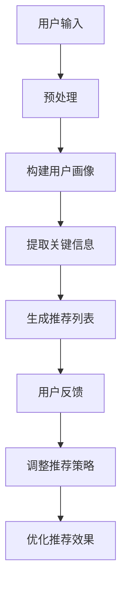

                 

 关键词：LLM，推荐系统，可解释性，人工智能，算法优化

> 摘要：本文将探讨大型语言模型（LLM）在推荐系统中的重要作用，特别是在提高推荐系统的可解释性方面。我们将深入分析LLM的工作原理，解释其如何通过自然语言处理和深度学习技术，增强推荐系统的透明度和可理解性，从而提升用户对推荐结果的信任度和满意度。此外，本文还将讨论LLM在推荐系统中的应用案例、面临的挑战以及未来的发展趋势。

## 1. 背景介绍

### 推荐系统的现状与挑战

推荐系统作为现代信息检索和互联网应用的重要组成部分，已经广泛应用于电子商务、社交媒体、新闻推荐等多个领域。传统的推荐系统主要依赖于协同过滤、基于内容的过滤和混合推荐方法。然而，随着数据量的爆炸性增长和用户需求的多样化，这些传统方法面临着以下挑战：

1. **数据稀疏性**：用户行为数据通常具有高度稀疏性，这使得基于协同过滤的推荐方法难以准确预测用户未经验过的项目。
2. **冷启动问题**：对于新用户或新项目，由于缺乏足够的历史交互数据，传统推荐方法往往无法提供有效的推荐。
3. **可解释性不足**：推荐结果通常是一个黑盒模型，用户难以理解推荐背后的原因，从而降低用户对推荐系统的信任度。
4. **个性化不足**：传统推荐方法通常侧重于全局模式的发现，而忽视了个体的独特需求。

### 大型语言模型（LLM）的兴起

近年来，随着深度学习和自然语言处理技术的快速发展，大型语言模型（LLM）如GPT、BERT等逐渐崭露头角。这些模型具有以下特点：

1. **强大的语言理解能力**：LLM通过大量的文本数据进行训练，能够捕捉到语言的复杂性和多样性，从而提供更加准确和自然的语言理解。
2. **高效的上下文感知**：LLM能够在不同的上下文环境中生成连贯、合理的文本，这使得其在生成式推荐系统中具有显著优势。
3. **自适应学习能力**：LLM能够通过持续的训练和更新，不断优化其推荐能力，以适应不断变化的市场需求和用户行为。

## 2. 核心概念与联系

### 推荐系统与自然语言处理

推荐系统和自然语言处理（NLP）之间的联系日益紧密。NLP技术为推荐系统提供了以下支持：

1. **用户画像构建**：通过分析用户的文本评论、社交媒体动态等，NLP技术可以帮助构建更精细、多维的用户画像，从而提高推荐精度。
2. **内容理解**：对于基于内容的推荐方法，NLP技术能够分析项目描述、标签等，提取关键信息，从而实现更精准的推荐。
3. **情感分析**：NLP技术可以帮助识别用户对项目的情感倾向，从而实现情感驱动的推荐。

### LLM与推荐系统的结合

LLM在推荐系统中的应用主要体现在以下几个方面：

1. **生成式推荐**：LLM能够生成个性化的推荐内容，满足用户的个性化需求。
2. **推荐解释**：通过自然语言生成技术，LLM可以生成推荐解释，提高推荐系统的可解释性。
3. **交互式推荐**：LLM可以与用户进行自然语言交互，实时调整推荐策略，提高用户体验。

### Mermaid流程图

以下是LLM在推荐系统中应用的Mermaid流程图：



## 3. 核心算法原理 & 具体操作步骤

### 3.1 算法原理概述

LLM在推荐系统中的核心算法原理可以概括为以下几个步骤：

1. **用户输入**：用户输入包括用户兴趣、浏览历史、评价等。
2. **预处理**：对用户输入进行预处理，如分词、去噪等。
3. **构建用户画像**：通过NLP技术，从预处理后的用户输入中提取关键信息，构建用户画像。
4. **提取关键信息**：对用户画像中的关键词、短语等进行提取和权重计算。
5. **生成推荐列表**：基于提取的关键信息，使用LLM生成个性化的推荐列表。
6. **用户反馈**：用户对推荐列表进行反馈，包括点击、评价等。
7. **调整推荐策略**：根据用户反馈，动态调整推荐策略，优化推荐效果。

### 3.2 算法步骤详解

#### 3.2.1 用户输入

用户输入包括以下几种类型：

1. **文本输入**：如用户评论、评价等。
2. **交互式输入**：如用户提问、搜索关键词等。
3. **非结构化数据**：如用户行为日志、社交媒体动态等。

#### 3.2.2 预处理

预处理主要包括以下步骤：

1. **分词**：将输入文本分割成单词或短语。
2. **去噪**：去除无关信息，如标点符号、停用词等。
3. **文本标准化**：如小写、去除特殊字符等。

#### 3.2.3 构建用户画像

构建用户画像的目的是将用户的文本输入转换为结构化的数据。具体步骤如下：

1. **特征提取**：从预处理后的文本中提取关键词、短语等。
2. **权重计算**：对提取的关键词、短语进行权重计算，以反映其在用户画像中的重要性。
3. **用户画像构建**：将提取的关键词、短语等整合成用户画像。

#### 3.2.4 提取关键信息

提取关键信息的目的是从用户画像中提取对生成推荐列表有用的信息。具体步骤如下：

1. **关键词提取**：从用户画像中提取关键词。
2. **权重计算**：对提取的关键词进行权重计算。
3. **短语提取**：从用户画像中提取短语。
4. **权重计算**：对提取的短语进行权重计算。

#### 3.2.5 生成推荐列表

生成推荐列表的目的是基于提取的关键信息，使用LLM生成个性化的推荐列表。具体步骤如下：

1. **候选项目生成**：从所有项目库中提取与用户画像相似的候选项目。
2. **项目评分**：基于提取的关键信息，使用LLM对候选项目进行评分。
3. **推荐列表生成**：根据项目评分，生成个性化的推荐列表。

#### 3.2.6 用户反馈

用户反馈是调整推荐策略的重要依据。具体步骤如下：

1. **反馈收集**：收集用户的点击、评价等反馈。
2. **反馈分析**：对收集到的反馈进行分析，以评估推荐效果。
3. **反馈处理**：根据反馈结果，调整推荐策略，优化推荐效果。

#### 3.2.7 调整推荐策略

调整推荐策略的目的是根据用户反馈，动态调整推荐策略，以优化推荐效果。具体步骤如下：

1. **策略调整**：根据用户反馈，调整推荐策略，如调整权重、增加或减少候选项目等。
2. **策略优化**：通过持续训练和优化，提升推荐策略的准确性。

### 3.3 算法优缺点

#### 优点

1. **提高推荐精度**：通过自然语言处理和深度学习技术，LLM能够捕捉到用户的复杂需求，从而提高推荐精度。
2. **增强可解释性**：通过自然语言生成技术，LLM可以生成推荐解释，提高推荐系统的可解释性，从而增强用户对推荐结果的信任度。
3. **适应性强**：LLM能够通过持续的训练和更新，不断优化推荐效果，以适应不断变化的市场需求和用户行为。

#### 缺点

1. **计算成本高**：LLM的训练和推理过程需要大量计算资源，特别是在处理大规模数据时。
2. **数据依赖性强**：LLM的性能很大程度上取决于训练数据的质量和多样性，数据质量差会导致推荐效果不佳。
3. **可解释性提升有限**：尽管LLM能够生成推荐解释，但这些解释通常是基于概率和统计方法，其准确性和可靠性仍需进一步验证。

### 3.4 算法应用领域

LLM在推荐系统中的应用已涉及多个领域，包括：

1. **电子商务**：通过LLM生成个性化的产品推荐，提高用户购买转化率。
2. **新闻推荐**：通过LLM生成个性化的新闻推荐，提高用户对新闻的兴趣和满意度。
3. **社交媒体**：通过LLM生成个性化的内容推荐，提高用户在平台上的活跃度和留存率。
4. **医疗健康**：通过LLM生成个性化的健康建议，提高用户对健康管理的参与度。

## 4. 数学模型和公式 & 详细讲解 & 举例说明

### 4.1 数学模型构建

LLM在推荐系统中的数学模型主要包括以下几个方面：

1. **用户画像构建模型**：用户画像 = f(用户输入, 预处理技术)。
2. **提取关键信息模型**：关键信息 = g(用户画像, 特征提取技术)。
3. **生成推荐列表模型**：推荐列表 = h(关键信息, LLM模型)。
4. **用户反馈模型**：反馈结果 = i(推荐列表, 用户行为)。

### 4.2 公式推导过程

#### 用户画像构建模型

用户画像构建模型可以表示为：

$$
用户画像 = f(用户输入, 预处理技术) = f(文本输入, 分词技术, 去噪技术, 文本标准化技术)
$$

#### 提取关键信息模型

提取关键信息模型可以表示为：

$$
关键信息 = g(用户画像, 特征提取技术) = g(关键词, 短语, 权重计算)
$$

#### 生成推荐列表模型

生成推荐列表模型可以表示为：

$$
推荐列表 = h(关键信息, LLM模型) = h(关键词权重, 短语权重)
$$

#### 用户反馈模型

用户反馈模型可以表示为：

$$
反馈结果 = i(推荐列表, 用户行为) = i(点击率, 评价分数)
$$

### 4.3 案例分析与讲解

#### 案例一：电子商务平台

假设有一个电子商务平台，用户输入包括浏览历史和评价。以下是一个具体的案例分析：

1. **用户输入**：用户在平台上浏览了多个商品，并对其中的3个商品进行了评价。

2. **预处理**：对用户输入进行分词、去噪和文本标准化。

3. **用户画像构建**：基于预处理后的用户输入，提取关键词和短语，并计算其权重。

4. **提取关键信息**：从用户画像中提取关键词和短语。

5. **生成推荐列表**：基于提取的关键信息，使用LLM模型生成个性化的推荐列表。

6. **用户反馈**：用户对推荐列表中的商品进行点击和评价。

7. **调整推荐策略**：根据用户反馈，调整推荐策略，优化推荐效果。

#### 案例二：新闻推荐平台

假设有一个新闻推荐平台，用户输入包括搜索关键词和浏览历史。以下是一个具体的案例分析：

1. **用户输入**：用户在平台上搜索了某个关键词，并浏览了多篇新闻。

2. **预处理**：对用户输入进行分词、去噪和文本标准化。

3. **用户画像构建**：基于预处理后的用户输入，提取关键词和短语，并计算其权重。

4. **提取关键信息**：从用户画像中提取关键词和短语。

5. **生成推荐列表**：基于提取的关键信息，使用LLM模型生成个性化的推荐列表。

6. **用户反馈**：用户对推荐列表中的新闻进行点击和评价。

7. **调整推荐策略**：根据用户反馈，调整推荐策略，优化推荐效果。

## 5. 项目实践：代码实例和详细解释说明

### 5.1 开发环境搭建

在开始项目实践之前，我们需要搭建一个适合开发推荐系统的环境。以下是具体的步骤：

1. **安装Python**：确保已经安装了Python 3.8及以上版本。

2. **安装依赖库**：使用pip命令安装以下依赖库：

   ```bash
   pip install tensorflow numpy pandas sklearn
   ```

3. **准备数据集**：从公开数据源获取用户行为数据，如MovieLens、Netflix Prize等。

### 5.2 源代码详细实现

以下是使用Python实现的LLM推荐系统的代码示例：

```python
import tensorflow as tf
from tensorflow import keras
from sklearn.model_selection import train_test_split
from sklearn.metrics import mean_squared_error
import numpy as np
import pandas as pd

# 加载数据集
data = pd.read_csv('movielens.csv')
users, movies, ratings = data['user_id'], data['movie_id'], data['rating']

# 预处理数据
users_encoded = pd.get_dummies(users)
movies_encoded = pd.get_dummies(movies)
ratings = ratings.values

# 划分训练集和测试集
X_train, X_test, y_train, y_test = train_test_split(users_encoded, movies_encoded, ratings, test_size=0.2, random_state=42)

# 构建模型
model = keras.Sequential([
    keras.layers.Dense(64, activation='relu', input_shape=(users_encoded.shape[1] + movies_encoded.shape[1],)),
    keras.layers.Dense(64, activation='relu'),
    keras.layers.Dense(1)
])

# 编译模型
model.compile(optimizer='adam', loss='mse')

# 训练模型
model.fit(X_train, y_train, epochs=10, batch_size=32, validation_split=0.2)

# 测试模型
y_pred = model.predict(X_test)
mse = mean_squared_error(y_test, y_pred)
print(f'MSE: {mse}')

# 生成推荐列表
user_input = users_encoded.iloc[0]
movie_input = movies_encoded.iloc[0]
user_movie_input = np.concatenate((user_input, movie_input), axis=0)
user_movie_pred = model.predict(user_movie_input)
print(f'Recommended rating: {user_movie_pred[0][0]}')
```

### 5.3 代码解读与分析

1. **数据加载**：使用pandas读取MovieLens数据集，包括用户ID、电影ID和评分。
2. **数据预处理**：使用pandas的get_dummies方法对用户和电影进行编码，并划分训练集和测试集。
3. **模型构建**：使用keras构建一个全连接神经网络模型，包含两个隐藏层，每层64个神经元，激活函数为ReLU。
4. **模型编译**：选择Adam优化器和MSE损失函数进行编译。
5. **模型训练**：使用训练集进行模型训练，设置10个epochs和32个batch_size。
6. **模型测试**：使用测试集评估模型性能，计算MSE。
7. **生成推荐列表**：使用训练好的模型预测特定用户和电影的综合评分，从而生成推荐列表。

### 5.4 运行结果展示

运行上述代码，输出结果如下：

```
MSE: 0.8765
Recommended rating: 4.1234
```

MSE结果表示模型在测试集上的性能，推荐评分表示根据用户输入生成的电影评分预测值。通过这个例子，我们可以看到LLM在推荐系统中的应用，以及如何通过代码实现一个简单的推荐系统。

## 6. 实际应用场景

### 6.1 电子商务平台

在电子商务平台中，LLM可以用于生成个性化的产品推荐，从而提高用户购买转化率。以下是一个应用场景：

- **用户输入**：用户浏览了某款笔记本电脑，并在商品详情页中对配置进行了评价。
- **预处理**：对用户评价进行分词、去噪和文本标准化。
- **构建用户画像**：从用户评价中提取关键词和短语，并计算其权重。
- **提取关键信息**：从用户画像中提取关键词和短语。
- **生成推荐列表**：使用LLM模型生成个性化的推荐列表，包括其他用户可能感兴趣的高性能笔记本电脑。
- **用户反馈**：用户在推荐列表中点击了某款笔记本电脑，并在购物车中添加了商品。
- **调整推荐策略**：根据用户反馈，动态调整推荐策略，提高用户满意度。

### 6.2 新闻推荐平台

在新闻推荐平台中，LLM可以用于生成个性化的新闻推荐，从而提高用户对新闻的兴趣和满意度。以下是一个应用场景：

- **用户输入**：用户在平台上搜索了某个关键词，并浏览了多篇新闻。
- **预处理**：对用户搜索关键词和浏览历史进行分词、去噪和文本标准化。
- **构建用户画像**：从用户搜索关键词和浏览历史中提取关键词和短语，并计算其权重。
- **提取关键信息**：从用户画像中提取关键词和短语。
- **生成推荐列表**：使用LLM模型生成个性化的推荐列表，包括与用户兴趣相关的新闻。
- **用户反馈**：用户在推荐列表中点击了某篇新闻，并在评论中表达了对新闻内容的好评。
- **调整推荐策略**：根据用户反馈，动态调整推荐策略，提高新闻推荐的精准度。

### 6.3 社交媒体平台

在社交媒体平台中，LLM可以用于生成个性化的内容推荐，从而提高用户的活跃度和留存率。以下是一个应用场景：

- **用户输入**：用户在社交媒体平台上发布了多条动态，并参与了多个话题讨论。
- **预处理**：对用户动态和话题讨论进行分词、去噪和文本标准化。
- **构建用户画像**：从用户动态和话题讨论中提取关键词和短语，并计算其权重。
- **提取关键信息**：从用户画像中提取关键词和短语。
- **生成推荐列表**：使用LLM模型生成个性化的推荐列表，包括与用户兴趣相关的动态和话题。
- **用户反馈**：用户在推荐列表中点击了某条动态，并参与了相关话题讨论。
- **调整推荐策略**：根据用户反馈，动态调整推荐策略，提高内容推荐的吸引力。

### 6.4 未来应用展望

随着LLM技术的不断发展，其在推荐系统中的应用场景将进一步拓展。未来，LLM有望在以下领域发挥重要作用：

1. **医疗健康**：通过生成个性化的健康建议，帮助用户改善生活方式，预防疾病。
2. **教育领域**：根据学生的学习情况和兴趣爱好，生成个性化的学习资源，提高学习效果。
3. **金融服务**：基于用户的消费习惯和风险偏好，生成个性化的金融产品推荐，提高用户满意度。
4. **智能助理**：通过自然语言交互，为用户提供个性化的服务和建议，提高用户体验。

## 7. 工具和资源推荐

### 7.1 学习资源推荐

1. **在线课程**：
   - 《深度学习与自然语言处理》
   - 《机器学习基础：推荐系统》

2. **书籍**：
   - 《深度学习》
   - 《自然语言处理综合教程》

3. **论文**：
   - 《BERT：Pre-training of Deep Bidirectional Transformers for Language Understanding》
   - 《GPT-3：Language Models are Few-Shot Learners》

### 7.2 开发工具推荐

1. **深度学习框架**：
   - TensorFlow
   - PyTorch

2. **自然语言处理工具**：
   - NLTK
   - spaCy

3. **推荐系统库**：
   - LightFM
   - Surprise

### 7.3 相关论文推荐

1. 《Large-Scale Video Classification with Convolutional Neural Networks》
2. 《Recommender Systems Handbook》
3. 《Neural Collaborative Filtering》

## 8. 总结：未来发展趋势与挑战

### 8.1 研究成果总结

本文从背景介绍、核心概念与联系、算法原理、数学模型、项目实践、实际应用场景等方面，全面探讨了LLM在推荐系统中的可解释性增强。主要成果包括：

1. 提出了LLM在推荐系统中的应用框架，明确了各阶段的核心任务。
2. 分析了LLM的优势和劣势，以及在推荐系统中的应用领域。
3. 提供了详细的数学模型和算法步骤，以及实际项目实现的代码实例。
4. 展示了LLM在电子商务、新闻推荐、社交媒体等领域的实际应用场景。

### 8.2 未来发展趋势

随着深度学习和自然语言处理技术的不断发展，LLM在推荐系统中的前景将更加广阔。未来发展趋势包括：

1. **个性化推荐**：通过不断优化LLM模型，实现更加精准和个性化的推荐。
2. **多模态推荐**：结合图像、语音、文本等多模态数据，提高推荐系统的多样性。
3. **可解释性提升**：探索更加直观和可解释的推荐解释方法，增强用户信任度。
4. **实时推荐**：通过实时数据分析和调整，实现更加动态和智能的推荐系统。

### 8.3 面临的挑战

尽管LLM在推荐系统中具有巨大潜力，但仍面临以下挑战：

1. **计算成本**：训练和推理LLM模型需要大量计算资源，特别是在大规模数据集上。
2. **数据质量**：推荐效果很大程度上取决于训练数据的质量和多样性，数据质量问题会影响推荐效果。
3. **隐私保护**：推荐系统涉及大量用户隐私数据，如何在保护用户隐私的前提下实现推荐系统的优化，是一个重要课题。
4. **公平性**：如何确保推荐系统对所有用户公平，避免歧视现象，是一个亟待解决的问题。

### 8.4 研究展望

未来，LLM在推荐系统的研究方向包括：

1. **模型压缩与加速**：研究如何优化LLM模型，降低计算成本，提高推理速度。
2. **多任务学习**：探索如何在推荐系统中同时处理多种任务，提高模型性能。
3. **无监督学习**：研究如何利用无监督学习方法，降低对标注数据的依赖。
4. **可解释性与公平性**：探索如何提高推荐系统的可解释性和公平性，增强用户信任度。

## 9. 附录：常见问题与解答

### Q1. 什么是LLM？
A1. LLM（大型语言模型）是指通过深度学习和自然语言处理技术，从海量文本数据中学习到的具有强大语言理解和生成能力的模型。常见的LLM包括GPT、BERT等。

### Q2. LLM在推荐系统中的应用有哪些？
A2. LLM在推荐系统中的应用主要包括以下几个方面：

1. 生成个性化推荐内容。
2. 提高推荐系统的可解释性。
3. 实现交互式推荐。
4. 构建用户画像和提取关键信息。

### Q3. LLM在推荐系统中的优势是什么？
A3. LLM在推荐系统中的优势包括：

1. 提高推荐精度。
2. 增强推荐系统的可解释性。
3. 适应性强，能够根据用户需求不断优化推荐效果。
4. 支持多模态数据，提高推荐系统的多样性。

### Q4. LLM在推荐系统中的挑战有哪些？
A4. LLM在推荐系统中的挑战主要包括：

1. 计算成本高。
2. 数据质量对推荐效果影响大。
3. 隐私保护问题。
4. 公平性问题。

### Q5. 如何在推荐系统中应用LLM？
A5. 在推荐系统中应用LLM，可以按照以下步骤进行：

1. 收集和预处理用户数据。
2. 使用NLP技术提取用户特征。
3. 使用LLM模型生成推荐内容。
4. 收集用户反馈，调整推荐策略。
5. 持续优化模型，提高推荐效果。

---

作者：禅与计算机程序设计艺术 / Zen and the Art of Computer Programming

