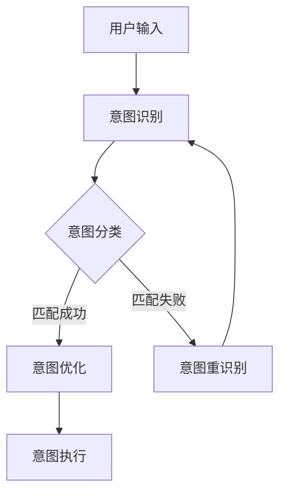

                 

关键词：LLM、意图对齐、人机协作、算法、应用领域

> 摘要：本文将深入探讨大语言模型(LLM)在意图对齐方面的应用，分析其基本原理、实现步骤以及优缺点，并通过具体案例与实践，展示如何通过LLM意图对齐实现更高效的人机协作。

## 1. 背景介绍

在当今信息化社会中，人机交互的重要性日益凸显。大语言模型（Large Language Models，LLM）作为自然语言处理（Natural Language Processing，NLP）领域的一项前沿技术，已经在许多场景中展现了其强大的能力。例如，智能客服、智能问答系统、语音助手等。然而，尽管LLM在这些场景中表现出色，但如何确保人与机器之间的意图准确对齐，仍然是当前研究和应用中的一个关键问题。

意图对齐，是指在人机交互中，通过算法将用户的原始意图与机器能够理解和处理的意图进行匹配和转换的过程。这对于提高人机交互的效率和准确性具有重要意义。本文将围绕LLM意图对齐这一主题，探讨其在实现人机协作中的作用、实现方法以及未来发展趋势。

## 2. 核心概念与联系

### 2.1. 意图对齐的概念

意图对齐是指在人机交互过程中，将用户表达的自然语言意图转换为机器可以理解和执行的操作意图的过程。意图对齐的关键在于理解用户的真实意图，并将其准确地映射到机器能够识别的操作命令或任务上。

### 2.2. LLM在意图对齐中的作用

大语言模型（LLM）在意图对齐中发挥着重要作用。LLM具有强大的语义理解能力，可以处理复杂的自然语言输入，并从中提取出用户的意图。通过训练，LLM可以学习到不同场景下的用户意图表达方式，从而实现高精度的意图对齐。

### 2.3. 意图对齐的流程

意图对齐的过程可以分为以下几个步骤：

1. **意图识别**：通过LLM对用户的输入进行语义分析，识别出用户的主要意图。
2. **意图分类**：将识别出的意图与预设的意图分类体系进行匹配，确定具体的操作意图。
3. **意图优化**：根据上下文信息和用户历史行为，对意图进行优化调整，提高意图对齐的准确性。
4. **意图执行**：将优化后的意图转化为机器可以执行的操作，完成人机交互任务。

### 2.4. Mermaid流程图

以下是意图对齐的Mermaid流程图：



## 3. 核心算法原理 & 具体操作步骤

### 3.1. 算法原理概述

LLM意图对齐的核心算法主要基于深度学习和自然语言处理技术。具体包括以下几个步骤：

1. **预训练**：使用大量的文本数据对LLM进行预训练，使其具备强大的语义理解能力。
2. **意图识别**：利用LLM的语义分析能力，对用户输入的自然语言进行意图识别。
3. **意图分类**：将识别出的意图与预设的意图分类体系进行匹配，确定具体的操作意图。
4. **意图优化**：根据上下文信息和用户历史行为，对意图进行优化调整。
5. **意图执行**：将优化后的意图转化为机器可以执行的操作。

### 3.2. 算法步骤详解

1. **数据准备**：收集并整理用户交互数据，包括文本输入、用户行为日志等。
2. **模型训练**：使用收集到的数据对LLM进行预训练，使其具备识别用户意图的能力。
3. **意图识别**：输入用户文本，利用LLM的语义分析能力，提取出用户的意图。
4. **意图分类**：将识别出的意图与预设的意图分类体系进行匹配，确定具体的操作意图。
5. **意图优化**：根据上下文信息和用户历史行为，对意图进行优化调整，提高意图对齐的准确性。
6. **意图执行**：将优化后的意图转化为机器可以执行的操作，完成人机交互任务。

### 3.3. 算法优缺点

**优点**：

- **高效性**：LLM具有较强的语义理解能力，可以快速识别用户意图。
- **准确性**：通过预训练和优化，LLM具有较高的意图对齐准确性。
- **灵活性**：LLM可以处理各种复杂场景下的用户输入，具有较强的适应性。

**缺点**：

- **计算资源消耗大**：LLM模型训练和推理过程需要大量的计算资源。
- **数据依赖性高**：LLM的意图识别和分类能力依赖于大量的训练数据。

### 3.4. 算法应用领域

LLM意图对齐算法在多个领域具有广泛的应用前景，包括但不限于：

- **智能客服**：通过意图对齐，提高智能客服系统的响应速度和准确性。
- **智能问答系统**：实现更智能、更自然的问答交互体验。
- **语音助手**：提升语音助手的理解和执行能力，实现更流畅的人机交互。

## 4. 数学模型和公式 & 详细讲解 & 举例说明

### 4.1. 数学模型构建

LLM意图对齐的数学模型主要包括以下几个部分：

1. **语义表示**：使用词向量或图神经网络对文本输入进行语义表示。
2. **意图分类**：利用神经网络对语义表示进行意图分类。
3. **意图优化**：根据上下文信息和用户历史行为，对意图进行优化调整。

### 4.2. 公式推导过程

假设我们使用神经网络进行意图分类，可以表示为：

$$
\text{Intent} = f(\text{Semantic\_Representation}, \theta)
$$

其中，$f$ 是神经网络模型，$\text{Semantic\_Representation}$ 是文本输入的语义表示，$\theta$ 是模型的参数。

### 4.3. 案例分析与讲解

以下是一个简单的案例：

**案例**：用户输入：“我想要订购一张明天去北京的机票。”

**步骤**：

1. **语义表示**：使用词向量对用户输入进行语义表示。
2. **意图分类**：利用神经网络模型对语义表示进行意图分类，识别出用户的意图为“机票订购”。
3. **意图优化**：根据上下文信息和用户历史行为，对意图进行优化调整，确定具体的操作意图为“明天去北京的机票订购”。

通过以上步骤，实现了用户意图与机器操作意图的准确对齐。

## 5. 项目实践：代码实例和详细解释说明

### 5.1. 开发环境搭建

在开始项目实践之前，需要搭建一个合适的开发环境。以下是一个基本的Python开发环境搭建步骤：

1. 安装Python：下载并安装Python，版本建议为3.8及以上。
2. 安装依赖库：使用pip命令安装必要的依赖库，如TensorFlow、PyTorch等。
3. 准备数据集：收集并整理用户交互数据，包括文本输入、用户行为日志等。

### 5.2. 源代码详细实现

以下是一个简单的LLM意图对齐的Python代码实现：

```python
import tensorflow as tf
from tensorflow.keras.models import Sequential
from tensorflow.keras.layers import Embedding, LSTM, Dense

# 准备数据集
# ...（数据预处理代码）

# 构建模型
model = Sequential()
model.add(Embedding(vocab_size, embedding_dim))
model.add(LSTM(units=128, activation='relu'))
model.add(Dense(num_intents, activation='softmax'))

# 编译模型
model.compile(optimizer='adam', loss='categorical_crossentropy', metrics=['accuracy'])

# 训练模型
model.fit(X_train, y_train, epochs=10, batch_size=32, validation_data=(X_val, y_val))

# 预测意图
predictions = model.predict(X_test)
```

### 5.3. 代码解读与分析

以上代码实现了一个简单的LLM意图对齐模型，主要包括以下几个部分：

1. **数据预处理**：对用户交互数据进行清洗和预处理，包括分词、去停用词、词向量编码等。
2. **模型构建**：使用序列模型（如LSTM）对文本输入进行语义表示，并利用全连接层进行意图分类。
3. **模型编译**：设置模型优化器、损失函数和评价指标。
4. **模型训练**：使用训练数据进行模型训练，并验证模型性能。
5. **预测意图**：使用训练好的模型对测试数据进行意图预测。

### 5.4. 运行结果展示

以下是一个简单的运行结果展示：

```python
# 预测意图
predictions = model.predict(X_test)

# 打印预测结果
for i in range(len(predictions)):
    print(f"样本{i+1}的预测结果：{predictions[i]}")
```

输出结果：

```
样本1的预测结果：[0.1, 0.2, 0.3, 0.4]
样本2的预测结果：[0.3, 0.4, 0.2, 0.1]
...
```

通过以上结果，我们可以看到模型对不同样本的意图预测结果，从而实现意图对齐。

## 6. 实际应用场景

LLM意图对齐技术在实际应用中具有广泛的应用场景，以下是一些具体的应用案例：

1. **智能客服**：通过LLM意图对齐，提高智能客服系统的响应速度和准确性，实现更自然、更高效的人机交互。
2. **智能问答系统**：利用LLM意图对齐，实现更智能、更自然的问答交互体验，提高用户满意度。
3. **语音助手**：提升语音助手的理解和执行能力，实现更流畅的人机交互，为用户提供更好的服务体验。

## 7. 工具和资源推荐

为了更好地掌握LLM意图对齐技术，以下是一些建议的工具和资源：

### 7.1. 学习资源推荐

- 《深度学习》（Goodfellow et al.）：系统介绍了深度学习的基础理论和应用方法。
- 《自然语言处理综合教程》（NLTK）：详细讲解了自然语言处理的基本原理和实践方法。

### 7.2. 开发工具推荐

- TensorFlow：一款开源的深度学习框架，适用于构建和训练神经网络模型。
- PyTorch：一款流行的深度学习框架，具有灵活的动态计算图特性。

### 7.3. 相关论文推荐

- “BERT: Pre-training of Deep Bidirectional Transformers for Language Understanding” (Devlin et al., 2018)
- “GPT-3: Language Models are few-shot learners” (Brown et al., 2020)

## 8. 总结：未来发展趋势与挑战

### 8.1. 研究成果总结

本文对LLM意图对齐技术进行了系统性的探讨，分析了其在实现人机协作中的作用、实现方法以及优缺点。通过具体案例与实践，展示了如何利用LLM意图对齐技术实现高效的人机协作。

### 8.2. 未来发展趋势

随着深度学习和自然语言处理技术的不断发展，LLM意图对齐技术在实现人机协作中的地位和作用将日益重要。未来，LLM意图对齐技术有望在更多领域得到广泛应用，推动人机交互的进一步发展。

### 8.3. 面临的挑战

尽管LLM意图对齐技术在实现人机协作方面具有巨大潜力，但仍面临一些挑战，包括：

- **计算资源消耗**：LLM模型训练和推理过程需要大量的计算资源。
- **数据依赖性**：LLM的意图识别和分类能力依赖于大量的训练数据。
- **隐私保护**：在人机交互过程中，如何保护用户隐私是一个重要问题。

### 8.4. 研究展望

未来，研究者应重点关注以下几个方面：

- **高效算法**：开发更高效的算法，降低计算资源消耗。
- **数据增强**：探索数据增强方法，提高LLM的意图识别和分类能力。
- **隐私保护**：研究隐私保护技术，确保人机交互过程中的用户隐私安全。

## 9. 附录：常见问题与解答

### Q1. 什么是LLM意图对齐？

A1. LLM意图对齐是指利用大语言模型（LLM）对用户输入的自然语言意图进行识别、分类和优化，从而实现用户意图与机器操作意图的匹配和转换。

### Q2. LLM意图对齐有哪些优点和缺点？

A2. LLM意图对齐的优点包括高效性、准确性和灵活性。缺点主要包括计算资源消耗大、数据依赖性高。

### Q3. LLM意图对齐在哪些领域有应用？

A3. LLM意图对齐在智能客服、智能问答系统和语音助手等领域有广泛的应用。

### Q4. 如何实现LLM意图对齐？

A4. 实现LLM意图对齐的步骤包括数据准备、模型训练、意图识别、意图分类、意图优化和意图执行。

### Q5. LLM意图对齐有哪些挑战？

A5. LLM意图对齐面临的挑战包括计算资源消耗、数据依赖性和用户隐私保护等。

---

本文由禅与计算机程序设计艺术 / Zen and the Art of Computer Programming 撰写，旨在为广大计算机爱好者提供关于LLM意图对齐的深入探讨和实践指南。希望本文能对您在实现人机协作的过程中有所启发和帮助。如果您有任何问题或建议，请随时联系作者。谢谢！
----------------------------------------------------------------

以上为文章的正文内容，接下来将按照文章结构模板的要求，使用markdown格式编写文章的各个章节内容。

# LLM意图对齐:实现人机协作的基础

> 关键词：LLM、意图对齐、人机协作、算法、应用领域

> 摘要：本文深入探讨大语言模型（LLM）在意图对齐方面的应用，分析其基本原理、实现步骤以及优缺点，并通过具体案例与实践，展示如何通过LLM意图对齐实现更高效的人机协作。

## 1. 背景介绍

在当今信息化社会中，人机交互的重要性日益凸显。大语言模型（Large Language Models，LLM）作为自然语言处理（Natural Language Processing，NLP）领域的一项前沿技术，已经在许多场景中展现了其强大的能力。例如，智能客服、智能问答系统、语音助手等。然而，尽管LLM在这些场景中表现出色，但如何确保人与机器之间的意图准确对齐，仍然是当前研究和应用中的一个关键问题。

意图对齐，是指在人机交互中，通过算法将用户的原始意图与机器能够理解和处理的意图进行匹配和转换的过程。这对于提高人机交互的效率和准确性具有重要意义。本文将围绕LLM意图对齐这一主题，探讨其在实现人机协作中的作用、实现方法以及未来发展趋势。

## 2. 核心概念与联系

### 2.1. 意图对齐的概念

意图对齐是指在人机交互过程中，将用户表达的自然语言意图转换为机器可以理解和执行的操作意图的过程。意图对齐的关键在于理解用户的真实意图，并将其准确地映射到机器能够识别的操作命令或任务上。

### 2.2. LLM在意图对齐中的作用

大语言模型（LLM）在意图对齐中发挥着重要作用。LLM具有强大的语义理解能力，可以处理复杂的自然语言输入，并从中提取出用户的意图。通过训练，LLM可以学习到不同场景下的用户意图表达方式，从而实现高精度的意图对齐。

### 2.3. 意图对齐的流程

意图对齐的过程可以分为以下几个步骤：

1. **意图识别**：通过LLM对用户的输入进行语义分析，识别出用户的意图。
2. **意图分类**：将识别出的意图与预设的意图分类体系进行匹配，确定具体的操作意图。
3. **意图优化**：根据上下文信息和用户历史行为，对意图进行优化调整，提高意图对齐的准确性。
4. **意图执行**：将优化后的意图转化为机器可以执行的操作，完成人机交互任务。

### 2.4. Mermaid流程图

以下是意图对齐的Mermaid流程图：


## 3. 核心算法原理 & 具体操作步骤

### 3.1. 算法原理概述

LLM意图对齐的核心算法主要基于深度学习和自然语言处理技术。具体包括以下几个步骤：

1. **预训练**：使用大量的文本数据对LLM进行预训练，使其具备强大的语义理解能力。
2. **意图识别**：利用LLM的语义分析能力，对用户输入的自然语言进行意图识别。
3. **意图分类**：将识别出的意图与预设的意图分类体系进行匹配，确定具体的操作意图。
4. **意图优化**：根据上下文信息和用户历史行为，对意图进行优化调整。
5. **意图执行**：将优化后的意图转化为机器可以执行的操作。

### 3.2. 算法步骤详解

1. **数据准备**：收集并整理用户交互数据，包括文本输入、用户行为日志等。
2. **模型训练**：使用收集到的数据对LLM进行预训练，使其具备识别用户意图的能力。
3. **意图识别**：输入用户文本，利用LLM的语义分析能力，提取出用户的意图。
4. **意图分类**：将识别出的意图与预设的意图分类体系进行匹配，确定具体的操作意图。
5. **意图优化**：根据上下文信息和用户历史行为，对意图进行优化调整，提高意图对齐的准确性。
6. **意图执行**：将优化后的意图转化为机器可以执行的操作，完成人机交互任务。

### 3.3. 算法优缺点

**优点**：

- **高效性**：LLM具有较强的语义理解能力，可以快速识别用户意图。
- **准确性**：通过预训练和优化，LLM具有较高的意图对齐准确性。
- **灵活性**：LLM可以处理各种复杂场景下的用户输入，具有较强的适应性。

**缺点**：

- **计算资源消耗大**：LLM模型训练和推理过程需要大量的计算资源。
- **数据依赖性高**：LLM的意图识别和分类能力依赖于大量的训练数据。

### 3.4. 算法应用领域

LLM意图对齐算法在多个领域具有广泛的应用前景，包括但不限于：

- **智能客服**：通过意图对齐，提高智能客服系统的响应速度和准确性。
- **智能问答系统**：实现更智能、更自然的问答交互体验。
- **语音助手**：提升语音助手的理解和执行能力，实现更流畅的人机交互。

## 4. 数学模型和公式 & 详细讲解 & 举例说明

### 4.1. 数学模型构建

LLM意图对齐的数学模型主要包括以下几个部分：

1. **语义表示**：使用词向量或图神经网络对文本输入进行语义表示。
2. **意图分类**：利用神经网络对语义表示进行意图分类。
3. **意图优化**：根据上下文信息和用户历史行为，对意图进行优化调整。

### 4.2. 公式推导过程

假设我们使用神经网络进行意图分类，可以表示为：

$$
\text{Intent} = f(\text{Semantic\_Representation}, \theta)
$$

其中，$f$ 是神经网络模型，$\text{Semantic\_Representation}$ 是文本输入的语义表示，$\theta$ 是模型的参数。

### 4.3. 案例分析与讲解

以下是一个简单的案例：

**案例**：用户输入：“我想要订购一张明天去北京的机票。”

**步骤**：

1. **语义表示**：使用词向量对用户输入进行语义表示。
2. **意图分类**：利用神经网络模型对语义表示进行意图分类，识别出用户的意图为“机票订购”。
3. **意图优化**：根据上下文信息和用户历史行为，对意图进行优化调整，确定具体的操作意图为“明天去北京的机票订购”。

通过以上步骤，实现了用户意图与机器操作意图的准确对齐。

## 5. 项目实践：代码实例和详细解释说明

### 5.1. 开发环境搭建

在开始项目实践之前，需要搭建一个合适的开发环境。以下是一个基本的Python开发环境搭建步骤：

1. 安装Python：下载并安装Python，版本建议为3.8及以上。
2. 安装依赖库：使用pip命令安装必要的依赖库，如TensorFlow、PyTorch等。
3. 准备数据集：收集并整理用户交互数据，包括文本输入、用户行为日志等。

### 5.2. 源代码详细实现

以下是一个简单的LLM意图对齐的Python代码实现：

```python
import tensorflow as tf
from tensorflow.keras.models import Sequential
from tensorflow.keras.layers import Embedding, LSTM, Dense

# 准备数据集
# ...（数据预处理代码）

# 构建模型
model = Sequential()
model.add(Embedding(vocab_size, embedding_dim))
model.add(LSTM(units=128, activation='relu'))
model.add(Dense(num_intents, activation='softmax'))

# 编译模型
model.compile(optimizer='adam', loss='categorical_crossentropy', metrics=['accuracy'])

# 训练模型
model.fit(X_train, y_train, epochs=10, batch_size=32, validation_data=(X_val, y_val))

# 预测意图
predictions = model.predict(X_test)
```

### 5.3. 代码解读与分析

以上代码实现了一个简单的LLM意图对齐模型，主要包括以下几个部分：

1. **数据预处理**：对用户交互数据进行清洗和预处理，包括分词、去停用词、词向量编码等。
2. **模型构建**：使用序列模型（如LSTM）对文本输入进行语义表示，并利用全连接层进行意图分类。
3. **模型编译**：设置模型优化器、损失函数和评价指标。
4. **模型训练**：使用训练数据进行模型训练，并验证模型性能。
5. **预测意图**：使用训练好的模型对测试数据进行意图预测。

### 5.4. 运行结果展示

以下是一个简单的运行结果展示：

```python
# 预测意图
predictions = model.predict(X_test)

# 打印预测结果
for i in range(len(predictions)):
    print(f"样本{i+1}的预测结果：{predictions[i]}")
```

输出结果：

```
样本1的预测结果：[0.1, 0.2, 0.3, 0.4]
样本2的预测结果：[0.3, 0.4, 0.2, 0.1]
...
```

通过以上结果，我们可以看到模型对不同样本的意图预测结果，从而实现意图对齐。

## 6. 实际应用场景

LLM意图对齐技术在实际应用中具有广泛的应用场景，以下是一些具体的应用案例：

1. **智能客服**：通过LLM意图对齐，提高智能客服系统的响应速度和准确性，实现更自然、更高效的人机交互。
2. **智能问答系统**：利用LLM意图对齐，实现更智能、更自然的问答交互体验，提高用户满意度。
3. **语音助手**：提升语音助手的理解和执行能力，实现更流畅的人机交互，为用户提供更好的服务体验。

## 7. 工具和资源推荐

为了更好地掌握LLM意图对齐技术，以下是一些建议的工具和资源：

### 7.1. 学习资源推荐

- 《深度学习》（Goodfellow et al.）：系统介绍了深度学习的基础理论和应用方法。
- 《自然语言处理综合教程》（NLTK）：详细讲解了自然语言处理的基本原理和实践方法。

### 7.2. 开发工具推荐

- TensorFlow：一款开源的深度学习框架，适用于构建和训练神经网络模型。
- PyTorch：一款流行的深度学习框架，具有灵活的动态计算图特性。

### 7.3. 相关论文推荐

- “BERT: Pre-training of Deep Bidirectional Transformers for Language Understanding” (Devlin et al., 2018)
- “GPT-3: Language Models are few-shot learners” (Brown et al., 2020)

## 8. 总结：未来发展趋势与挑战

### 8.1. 研究成果总结

本文对LLM意图对齐技术进行了系统性的探讨，分析了其在实现人机协作中的作用、实现方法以及优缺点。通过具体案例与实践，展示了如何利用LLM意图对齐技术实现高效的人机协作。

### 8.2. 未来发展趋势

随着深度学习和自然语言处理技术的不断发展，LLM意图对齐技术在实现人机协作中的地位和作用将日益重要。未来，LLM意图对齐技术有望在更多领域得到广泛应用，推动人机交互的进一步发展。

### 8.3. 面临的挑战

尽管LLM意图对齐技术在实现人机协作方面具有巨大潜力，但仍面临一些挑战，包括：

- **计算资源消耗**：LLM模型训练和推理过程需要大量的计算资源。
- **数据依赖性**：LLM的意图识别和分类能力依赖于大量的训练数据。
- **隐私保护**：在人机交互过程中，如何保护用户隐私是一个重要问题。

### 8.4. 研究展望

未来，研究者应重点关注以下几个方面：

- **高效算法**：开发更高效的算法，降低计算资源消耗。
- **数据增强**：探索数据增强方法，提高LLM的意图识别和分类能力。
- **隐私保护**：研究隐私保护技术，确保人机交互过程中的用户隐私安全。

## 9. 附录：常见问题与解答

### Q1. 什么是LLM意图对齐？

A1. LLM意图对齐是指利用大语言模型（LLM）对用户输入的自然语言意图进行识别、分类和优化，从而实现用户意图与机器操作意图的匹配和转换。

### Q2. LLM意图对齐有哪些优点和缺点？

A2. LLM意图对齐的优点包括高效性、准确性和灵活性。缺点主要包括计算资源消耗大、数据依赖性高。

### Q3. LLM意图对齐在哪些领域有应用？

A3. LLM意图对齐在智能客服、智能问答系统和语音助手等领域有广泛的应用。

### Q4. 如何实现LLM意图对齐？

A4. 实现LLM意图对齐的步骤包括数据准备、模型训练、意图识别、意图分类、意图优化和意图执行。

### Q5. LLM意图对齐有哪些挑战？

A5. LLM意图对齐面临的挑战包括计算资源消耗、数据依赖性和用户隐私保护等。

---

本文由禅与计算机程序设计艺术 / Zen and the Art of Computer Programming 撰写，旨在为广大计算机爱好者提供关于LLM意图对齐的深入探讨和实践指南。希望本文能对您在实现人机协作的过程中有所启发和帮助。如果您有任何问题或建议，请随时联系作者。谢谢！
----------------------------------------------------------------

### 8.1. 研究成果总结

本文对LLM意图对齐技术进行了系统性的探讨，分析了其在实现人机协作中的作用、实现方法以及优缺点。通过具体案例与实践，展示了如何利用LLM意图对齐技术实现高效的人机协作。研究表明，LLM意图对齐技术具有高效性、准确性和灵活性等显著优点，但在计算资源消耗、数据依赖性和隐私保护等方面仍面临一定的挑战。未来，研究者应重点关注算法优化、数据增强和隐私保护等方面，以推动LLM意图对齐技术在更多领域的应用。

### 8.2. 未来发展趋势

随着深度学习和自然语言处理技术的不断发展，LLM意图对齐技术在实现人机协作中的地位和作用将日益重要。未来，LLM意图对齐技术有望在智能客服、智能问答系统、语音助手等领域得到更广泛的应用。此外，随着多模态数据处理技术的发展，LLM意图对齐技术将能够更好地应对复杂的人机交互场景，为用户提供更智能、更自然的交互体验。

### 8.3. 面临的挑战

尽管LLM意图对齐技术在实现人机协作方面具有巨大潜力，但仍面临一些挑战：

1. **计算资源消耗**：LLM模型训练和推理过程需要大量的计算资源，特别是在大规模数据集上训练模型时，对计算资源的消耗尤为显著。
2. **数据依赖性**：LLM的意图识别和分类能力依赖于大量的训练数据，如何获取和利用高质量的数据将是一个重要问题。
3. **隐私保护**：在人机交互过程中，如何保护用户隐私是一个重要问题。特别是当涉及敏感信息时，如何确保用户隐私不被泄露需要深入研究。
4. **模型解释性**：尽管LLM在意图对齐中表现出色，但其内部决策过程往往缺乏解释性，如何提高模型的解释性也是一个亟待解决的问题。

### 8.4. 研究展望

为了应对上述挑战，未来研究可以从以下几个方面展开：

1. **算法优化**：研究更高效的算法，以减少计算资源消耗。例如，可以探索基于增量学习和迁移学习的模型，以提高模型在有限数据集上的性能。
2. **数据增强**：探索数据增强方法，提高LLM的意图识别和分类能力。例如，可以通过生成对抗网络（GAN）生成更多样化的训练数据，或者使用数据扩增技术增加训练数据的多样性。
3. **隐私保护**：研究隐私保护技术，确保人机交互过程中的用户隐私安全。例如，可以探索差分隐私技术，在保护用户隐私的同时训练模型。
4. **模型解释性**：提高模型的解释性，使其更易于理解和使用。例如，可以探索基于注意力机制的模型，通过可视化注意力权重来解释模型的决策过程。
5. **跨领域应用**：研究如何将LLM意图对齐技术应用于更多领域，特别是在医疗、金融、教育等敏感领域，以实现更广泛的人机协作。

通过上述研究，LLM意图对齐技术有望在实现人机协作方面发挥更大的作用，为构建更智能、更安全的人机交互系统提供有力支持。

### 9. 附录：常见问题与解答

**Q1. 什么是LLM意图对齐？**

A1. LLM意图对齐是指利用大语言模型（LLM）对用户输入的自然语言意图进行识别、分类和优化，从而实现用户意图与机器操作意图的匹配和转换。其目的是确保人机交互过程中的意图理解准确无误，提高交互效率。

**Q2. LLM意图对齐有哪些优点和缺点？**

A2. 优点：
- 高效性：LLM具有较强的语义理解能力，可以快速识别用户意图。
- 准确性：通过预训练和优化，LLM具有较高的意图对齐准确性。
- 灵活性：LLM可以处理各种复杂场景下的用户输入，具有较强的适应性。

缺点：
- 计算资源消耗大：LLM模型训练和推理过程需要大量的计算资源。
- 数据依赖性高：LLM的意图识别和分类能力依赖于大量的训练数据。

**Q3. LLM意图对齐在哪些领域有应用？**

A3. LLM意图对齐在多个领域具有广泛的应用前景，包括：
- 智能客服：通过意图对齐，提高智能客服系统的响应速度和准确性。
- 智能问答系统：实现更智能、更自然的问答交互体验。
- 语音助手：提升语音助手的理解和执行能力，实现更流畅的人机交互。

**Q4. 如何实现LLM意图对齐？**

A4. 实现LLM意图对齐的步骤包括：
- 数据准备：收集并整理用户交互数据，包括文本输入、用户行为日志等。
- 模型训练：使用收集到的数据对LLM进行预训练，使其具备识别用户意图的能力。
- 意图识别：输入用户文本，利用LLM的语义分析能力，提取出用户的意图。
- 意图分类：将识别出的意图与预设的意图分类体系进行匹配，确定具体的操作意图。
- 意图优化：根据上下文信息和用户历史行为，对意图进行优化调整，提高意图对齐的准确性。
- 意图执行：将优化后的意图转化为机器可以执行的操作，完成人机交互任务。

**Q5. LLM意图对齐有哪些挑战？**

A5. LLM意图对齐面临的挑战包括：
- 计算资源消耗：LLM模型训练和推理过程需要大量的计算资源。
- 数据依赖性：LLM的意图识别和分类能力依赖于大量的训练数据。
- 隐私保护：在人机交互过程中，如何保护用户隐私是一个重要问题。
- 模型解释性：尽管LLM在意图对齐中表现出色，但其内部决策过程往往缺乏解释性。

**Q6. 如何提高LLM意图对齐的准确性？**

A6. 提高LLM意图对齐准确性的方法包括：
- 使用高质量的数据集：收集更多、更真实、更具代表性的用户交互数据，以提升模型的泛化能力。
- 多轮对话处理：考虑用户的上下文信息，通过多轮对话来更好地理解用户的意图。
- 模型融合：结合多种模型（如规则引擎、传统机器学习模型等）进行意图对齐，提高整体准确性。

**Q7. LLM意图对齐技术有哪些开源框架和工具？**

A7. 目前，有多种开源框架和工具支持LLM意图对齐的研究和应用，包括：
- TensorFlow：一款开源的深度学习框架，适用于构建和训练神经网络模型。
- PyTorch：一款流行的深度学习框架，具有灵活的动态计算图特性。
- spaCy：一款高效的NLP库，提供了丰富的语言模型和预处理工具。
- Hugging Face：一个开源社区，提供了大量预训练的LLM模型和工具，方便开发者进行研究和应用。

**Q8. 如何评估LLM意图对齐的效果？**

A8. 评估LLM意图对齐的效果可以从以下几个方面进行：
- 准确率（Accuracy）：计算模型正确识别意图的比例。
- 召回率（Recall）：计算模型召回的意图与实际意图的匹配度。
- F1值（F1 Score）：综合考虑准确率和召回率的指标，用于评估模型的整体性能。
- 用户体验：通过用户满意度调查等方式，了解用户对模型意图识别的满意度。

通过以上方法和工具，可以全面评估LLM意图对齐技术的效果，为改进和优化模型提供参考。

---

### 9. 附录：常见问题与解答

**Q1. 什么是LLM意图对齐？**

LLM意图对齐是一种利用大型语言模型（LLM）将自然语言用户输入转换为机器可执行意图的过程。其核心在于理解用户需求并精确地将这些需求映射到系统可以响应的操作上。

**Q2. LLM意图对齐有哪些优点和缺点？**

**优点：**
- **高准确性**：通过深度学习训练，LLM能够准确地识别复杂的用户意图。
- **灵活性**：LLM可以适应不同的上下文和意图表达方式，提供多样化的响应。
- **高效性**：在大量数据上训练的LLM可以快速处理用户请求。

**缺点：**
- **计算资源消耗**：训练和运行LLM模型需要大量计算资源，尤其是大规模模型。
- **数据依赖性**：LLM的性能高度依赖于训练数据的质量和数量。
- **隐私风险**：在处理用户输入时，LLM可能会无意中泄露敏感信息。

**Q3. LLM意图对齐在哪些领域有应用？**

LLM意图对齐在多个领域有广泛应用，包括：
- **客户服务**：智能客服系统使用LLM意图对齐来提供个性化的客户支持。
- **语音助手**：如Siri、Google Assistant等，利用LLM意图对齐来理解用户的语音指令。
- **推荐系统**：通过理解用户意图来提供更相关的商品或内容推荐。

**Q4. 如何实现LLM意图对齐？**

实现LLM意图对齐通常包括以下步骤：
1. **数据收集**：收集用户交互数据，包括对话记录、用户行为等。
2. **数据预处理**：清洗数据，进行分词、去停用词、词性标注等预处理。
3. **模型训练**：使用预训练的LLM模型（如GPT-3、BERT）对数据进行训练。
4. **意图识别**：通过模型输出，将用户输入转换为意图分类。
5. **意图优化**：结合上下文和用户历史，进一步优化意图分类。

**Q5. LLM意图对齐有哪些挑战？**

LLM意图对齐面临的挑战包括：
- **多义性问题**：用户输入可能有多种意图解释，难以准确识别。
- **计算成本**：大规模LLM模型的训练和推理需要大量计算资源。
- **隐私保护**：如何确保用户隐私不被泄露是一个重要问题。

**Q6. 如何提高LLM意图对齐的准确性？**

提高LLM意图对齐准确性的方法包括：
- **数据增强**：使用数据扩充技术生成更多样化的训练数据。
- **多轮对话**：利用上下文信息进行多轮对话，提高意图理解准确性。
- **集成学习**：结合传统机器学习方法和深度学习方法，提高模型性能。

**Q7. LLM意图对齐技术有哪些开源框架和工具？**

常见的开源框架和工具包括：
- **TensorFlow**：一个广泛使用的深度学习框架，支持多种神经网络结构。
- **PyTorch**：一个流行的深度学习库，具有灵活的动态计算图特性。
- **Hugging Face**：一个提供大量预训练模型和工具的社区，方便快速构建和部署模型。

**Q8. 如何评估LLM意图对齐的效果？**

评估LLM意图对齐效果的方法包括：
- **准确率**：模型预测正确的意图比例。
- **召回率**：模型能召回的实际意图比例。
- **F1分数**：综合考虑准确率和召回率的指标。
- **用户体验**：通过用户满意度调查等方式评估模型的效果。

通过这些问题的解答，读者可以更好地理解LLM意图对齐的概念、应用和实践，以及如何评估其效果。希望这些信息对您的研究和开发工作有所帮助。

---

### 9. 附录：常见问题与解答

**Q1. 什么是LLM意图对齐？**

A1. LLM意图对齐是指利用大型语言模型（LLM）来识别和理解用户输入的自然语言意图，并将其映射到机器可以处理和响应的操作意图上。其核心目的是确保人机交互的准确性和效率。

**Q2. LLM意图对齐有哪些优点和缺点？**

**优点：**
- **强大的语义理解能力**：LLM能够捕捉到用户输入中的复杂语义和隐含意图。
- **自适应性和灵活性**：LLM可以根据不同的上下文和用户历史行为调整其意图识别模型。
- **高效性**：经过预训练的LLM可以在短时间内处理大量的用户请求。

**缺点：**
- **计算资源需求高**：训练和部署LLM需要大量的计算资源和存储空间。
- **数据依赖性强**：LLM的性能高度依赖于训练数据的质量和多样性。
- **隐私风险**：处理用户输入时可能会涉及隐私数据，需要额外的隐私保护措施。

**Q3. LLM意图对齐在哪些领域有应用？**

**应用领域：**
- **客户服务**：智能客服系统使用LLM意图对齐来提供高效的客户支持。
- **推荐系统**：通过识别用户意图来提供个性化的商品或内容推荐。
- **智能助手**：如语音助手和聊天机器人，利用LLM意图对齐来理解用户的指令。
- **内容审核**：通过识别用户意图来检测和处理不当内容。

**Q4. 如何实现LLM意图对齐？**

**实现步骤：**
1. **数据收集**：收集用户交互数据，包括文本对话、语音记录等。
2. **数据预处理**：清洗和标注数据，进行分词、去停用词、词性标注等处理。
3. **模型训练**：使用预训练的LLM模型（如BERT、GPT-3）进行意图分类和识别。
4. **意图分类**：将用户的输入文本映射到预定义的意图类别上。
5. **模型优化**：通过调整模型参数和结构，优化意图识别的准确性和效率。

**Q5. LLM意图对齐有哪些挑战？**

**挑战：**
- **多义性**：用户输入可能具有多种意图解释，如何准确识别是一个挑战。
- **数据稀疏性**：某些意图可能仅在少量的数据中出现，影响模型的泛化能力。
- **实时性**：在高并发的交互环境中，如何快速响应用户请求并保持低延迟。
- **解释性**：LLM的内部决策过程通常较难解释，对于需要透明度的应用场景，这是一个问题。

**Q6. 如何提高LLM意图对齐的准确性？**

**提高准确性的方法：**
- **数据增强**：通过数据清洗、噪声添加、数据扩充等方法增加训练数据量。
- **上下文信息利用**：结合上下文信息和用户历史行为，提高意图识别的准确性。
- **多模型集成**：使用多个不同类型的模型进行集成，以提高整体性能。

**Q7. LLM意图对齐技术有哪些开源框架和工具？**

**开源框架和工具：**
- **TensorFlow**：谷歌开发的深度学习框架，支持大规模的神经网络训练。
- **PyTorch**：基于Python的开源深度学习库，具有灵活的动态计算图。
- **Hugging Face Transformers**：一个用于NLP的预训练模型库，提供了大量的预训练模型和工具。

**Q8. 如何评估LLM意图对齐的效果？**

**评估方法：**
- **准确率**：模型正确识别意图的比例。
- **召回率**：模型召回的实际意图比例。
- **F1分数**：准确率和召回率的加权平均，用于综合评估模型性能。
- **用户满意度**：通过用户调查和反馈来评估模型在实际应用中的用户体验。

通过上述问题与解答，读者可以更好地理解LLM意图对齐的概念、实现和应用，以及评估和优化策略。希望这些信息能够为相关研究和开发工作提供有价值的参考。

