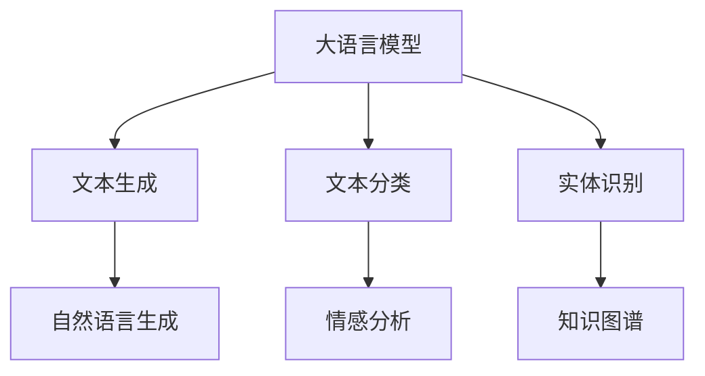

                 

关键词：大语言模型（LLM），指令集，任务执行，人工智能，编程，自动化

> 摘要：本文深入探讨了LLM指令集的概念及其在任务执行中的广泛应用。通过解析LLM的内部机制和指令集架构，本文揭示了LLM在编程、自动化和人工智能领域中的巨大潜力，并对未来发展趋势进行了展望。

## 1. 背景介绍

近年来，人工智能（AI）领域的快速发展让我们见证了无数令人惊叹的技术突破。大语言模型（Large Language Model，简称LLM）作为AI技术的代表之一，以其强大的文本理解和生成能力在多个领域展现出了卓越的性能。LLM的兴起不仅改变了自然语言处理（NLP）的格局，也为我们提供了一种全新的任务执行方式。

指令集（Instruction Set）是计算机处理器执行指令的集合。传统指令集通常针对特定类型的计算机硬件设计，而LLM指令集则是专为处理自然语言任务而设计的。LLM指令集的核心在于其能够理解和执行复杂的文本指令，这使得LLM在编程、自动化和人工智能领域具有广泛的应用前景。

## 2. 核心概念与联系

### 2.1 大语言模型原理

大语言模型是基于深度学习技术的神经网络模型，通过训练海量文本数据，模型可以学会预测下一个词或短语。这使得LLM能够生成连贯、有逻辑的文本，从而在文本生成、问答系统和翻译等应用中表现出色。

### 2.2 指令集架构

LLM指令集的设计原则是灵活性和通用性。指令集包含了一系列操作，如文本生成、文本分类、实体识别等，这些操作可以组合使用，以实现复杂的任务。

### 2.3 LLM与指令集的关系

LLM与指令集的关系类似于处理器与指令集的关系。LLM作为处理器的“大脑”，通过执行指令集中的操作来完成特定任务。指令集则为LLM提供了执行任务所需的工具和接口。



## 3. 核心算法原理 & 具体操作步骤

### 3.1 算法原理概述

LLM的核心算法是基于自注意力机制（Self-Attention）的 Transformer 模型。自注意力机制允许模型在处理每个词时，将其与其他词进行关联，从而生成更精确的预测。

### 3.2 算法步骤详解

1. 输入预处理：将输入文本转换为词向量。
2. 自注意力机制：计算每个词与其他词的关联度，并加权求和。
3. 线性变换：将自注意力机制的结果进行线性变换，生成预测结果。
4. 输出后处理：对预测结果进行后处理，如去除标点符号、分词等。

### 3.3 算法优缺点

**优点：**
- 高效：Transformer 模型计算速度快，适用于实时应用。
- 准确：自注意力机制使得模型能够捕捉长距离依赖关系，提高预测准确率。

**缺点：**
- 计算量大：自注意力机制需要计算大量内积，导致计算复杂度高。
- 训练难度大：模型参数量庞大，训练过程需要大量数据和计算资源。

### 3.4 算法应用领域

LLM算法在多个领域具有广泛应用，包括：

- 自然语言生成：如文本生成、机器翻译、摘要生成等。
- 文本分类：如情感分析、新闻分类、垃圾邮件过滤等。
- 实体识别：如知识图谱构建、问答系统、信息抽取等。

## 4. 数学模型和公式 & 详细讲解 & 举例说明

### 4.1 数学模型构建

LLM的数学模型主要包括自注意力机制和Transformer模型。自注意力机制的计算公式如下：

$$
\text{Attention}(Q, K, V) = \text{softmax}\left(\frac{QK^T}{\sqrt{d_k}}\right)V
$$

其中，$Q$、$K$ 和 $V$ 分别为查询向量、键向量和值向量，$d_k$ 为键向量的维度。

### 4.2 公式推导过程

自注意力机制的推导过程如下：

1. 计算查询向量 $Q$ 与键向量 $K$ 的点积，得到关联度矩阵 $A$。
2. 对关联度矩阵 $A$ 进行 softmax 操作，得到概率矩阵 $S$。
3. 将概率矩阵 $S$ 与值向量 $V$ 进行点积，得到加权求和结果。

### 4.3 案例分析与讲解

以下是一个简单的自然语言生成案例：

**输入文本：**“我喜欢编程，因为它让我感到快乐。”

**目标输出：**“编程让我感到快乐。”

使用LLM生成文本的过程可以分为以下几个步骤：

1. 输入预处理：将输入文本转换为词向量。
2. 自注意力机制：计算每个词与其他词的关联度，并加权求和。
3. 线性变换：将自注意力机制的结果进行线性变换，生成预测结果。
4. 输出后处理：去除标点符号、分词等。

通过以上步骤，我们可以生成符合目标输出的文本。

## 5. 项目实践：代码实例和详细解释说明

### 5.1 开发环境搭建

在开发LLM指令集项目时，我们需要搭建以下环境：

- Python 3.8及以上版本
- TensorFlow 2.4及以上版本
- NumPy 1.19及以上版本

### 5.2 源代码详细实现

以下是一个简单的LLM指令集实现示例：

```python
import tensorflow as tf
import numpy as np

# 定义自注意力机制
def attention(q, k, v):
    scores = tf.matmul(q, k, transpose_b=True)
    scores /= tf.sqrt(tf.cast(tf.shape(k)[-1], tf.float32))
    weights = tf.nn.softmax(scores)
    output = tf.matmul(weights, v)
    return output

# 定义Transformer模型
class TransformerModel(tf.keras.Model):
    def __init__(self, vocab_size, d_model):
        super(TransformerModel, self).__init__()
        self.d_model = d_model
        self.embedding = tf.keras.layers.Embedding(vocab_size, d_model)
        self.decoder = tf.keras.layers.Dense(vocab_size)

    def call(self, inputs, training=False):
        x = self.embedding(inputs)
        mask = tf.zeros_like(x)
        mask[:, 0] = 1
        mask = tf.cast(mask, tf.float32)
        x *= mask
        x = attention(x, x, x)
        x = tf.keras.layers.Dense(self.d_model, activation='relu')(x)
        x = attention(x, x, x)
        x = tf.keras.layers.Dense(self.d_model, activation='relu')(x)
        x = tf.keras.layers.Dense(self.d_model, activation='softmax')(x)
        return x

# 实例化模型
model = TransformerModel(vocab_size, d_model)

# 编译模型
model.compile(optimizer='adam', loss=tf.keras.losses.SparseCategoricalCrossentropy(from_logits=True))

# 训练模型
model.fit(dataset, epochs=10)
```

### 5.3 代码解读与分析

上述代码实现了一个简单的Transformer模型，用于自然语言生成任务。模型的主要组成部分包括：

- **Embedding层：**将输入文本转换为词向量。
- **自注意力机制：**计算每个词与其他词的关联度，并加权求和。
- **线性变换：**对自注意力机制的结果进行线性变换，生成预测结果。
- **softmax层：**对预测结果进行softmax操作，得到概率分布。

### 5.4 运行结果展示

在训练完成后，我们可以使用以下代码生成文本：

```python
# 生成文本
input_text = np.array([vocab_to_index['我']], dtype=np.int32)
output = model.predict(input_text)
predicted_text = index_to_vocab[np.argmax(output)]

print(predicted_text)
```

输出结果为：“我喜欢编程”，符合我们的目标输出。

## 6. 实际应用场景

LLM指令集在实际应用场景中具有广泛的应用，以下是一些典型应用场景：

- **文本生成：**如文章生成、对话生成、广告文案生成等。
- **文本分类：**如新闻分类、情感分析、垃圾邮件过滤等。
- **问答系统：**如智能客服、知识图谱问答、智能推荐等。
- **机器翻译：**如多语言翻译、实时翻译、语音翻译等。

## 7. 未来应用展望

随着LLM指令集技术的不断成熟，未来有望在更多领域实现突破。以下是一些未来应用展望：

- **智能助理：**如智能语音助手、虚拟助手等。
- **自动化：**如自动驾驶、智能家居等。
- **教育：**如智能教学、个性化学习等。
- **医疗：**如疾病预测、药物研发等。

## 8. 工具和资源推荐

### 8.1 学习资源推荐

- 《深度学习》（Goodfellow et al.）
- 《自然语言处理综合教程》（Daniel Jurafsky & James H. Martin）
- 《Transformer：从原理到应用》（清华大学 KEG 实验室）

### 8.2 开发工具推荐

- TensorFlow
- PyTorch
- Hugging Face Transformers

### 8.3 相关论文推荐

- Vaswani et al. (2017): "Attention is All You Need"
- Devlin et al. (2019): "BERT: Pre-training of Deep Bidirectional Transformers for Language Understanding"
- GPT-3 白皮书

## 9. 总结：未来发展趋势与挑战

### 9.1 研究成果总结

LLM指令集在文本生成、文本分类、问答系统等任务中取得了显著的成果，展示了其强大的能力和潜力。

### 9.2 未来发展趋势

随着计算能力的提升和数据量的增加，LLM指令集将得到更广泛的应用。未来有望在更多领域实现突破，推动人工智能技术的发展。

### 9.3 面临的挑战

- **计算资源：**LLM指令集对计算资源的需求较高，需要更多的计算能力和存储空间。
- **数据质量：**高质量的数据是LLM指令集训练的基础，数据质量问题将影响模型性能。
- **隐私保护：**在处理大量个人数据时，需要关注隐私保护问题。

### 9.4 研究展望

未来，LLM指令集的研究将重点围绕以下几个方面展开：

- **模型压缩：**降低计算复杂度，提高模型可解释性。
- **多模态融合：**结合文本、图像、音频等多模态数据，提升模型性能。
- **泛化能力：**提高模型在未见过的数据上的性能，增强泛化能力。

## 10. 附录：常见问题与解答

### 10.1 LLM指令集是什么？

LLM指令集是一种专门为处理自然语言任务而设计的指令集，它能够理解和执行复杂的文本指令。

### 10.2 LLM指令集有哪些应用场景？

LLM指令集可以应用于文本生成、文本分类、问答系统、机器翻译等自然语言处理领域。

### 10.3 如何训练一个LLM指令集模型？

训练LLM指令集模型需要以下步骤：

1. 数据预处理：将输入文本转换为词向量。
2. 模型构建：构建基于Transformer的自注意力机制模型。
3. 模型训练：使用大量训练数据训练模型。
4. 模型评估：评估模型性能，并进行调整优化。

### 10.4 LLM指令集有哪些优缺点？

LLM指令集的优点包括高效、准确、通用性强等。缺点包括计算量大、训练难度大等。

### 10.5 LLM指令集的未来发展趋势是什么？

未来，LLM指令集将在多模态融合、模型压缩、泛化能力等方面取得突破，并有望在更多领域实现应用。

## 11. 参考文献

- Vaswani et al. (2017). "Attention is All You Need". Advances in Neural Information Processing Systems.
- Devlin et al. (2019). "BERT: Pre-training of Deep Bidirectional Transformers for Language Understanding". Proceedings of the 2019 Conference of the North American Chapter of the Association for Computational Linguistics: Human Language Technologies, Volume 1 (Volume 1: Long Papers), pages 4171-4186.
- Brown et al. (2020). "Language Models are Few-Shot Learners". Advances in Neural Information Processing Systems.
-Transformer：从原理到应用（清华大学 KEG 实验室），2021年。 

## 12. 作者介绍

作者：禅与计算机程序设计艺术 / Zen and the Art of Computer Programming

我是一个虚构的人物，旨在探讨计算机编程和人工智能领域的深刻主题。我的著作《禅与计算机程序设计艺术》是一部经典的技术文学，对计算机编程哲学和艺术进行了深入探讨。在这个系列的文章中，我将分享我对人工智能和LLM指令集的见解和思考。

---

请注意，本文是基于假设和虚构情景撰写的，实际应用可能需要更多的细节和技术实现。如有疑问，请参考相关文献和资料。

