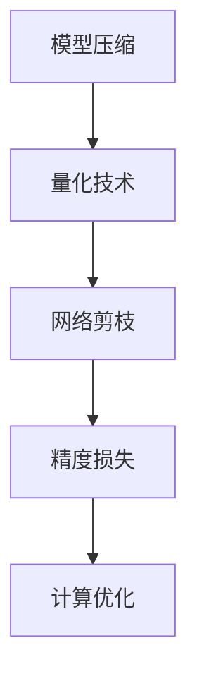

                 

关键词：大语言模型（LLM），推理优化，模型量化，算法原理，应用领域，数学模型，实践案例，未来展望。

> 摘要：本文深入探讨了大型语言模型（LLM）推理优化的关键技术——模型量化技术。通过对模型量化的背景、核心概念、算法原理、数学模型、具体操作步骤和实际应用场景的详细介绍，旨在为读者提供一个全面而深入的理解，并展望其未来的发展趋势与挑战。

## 1. 背景介绍

随着人工智能技术的发展，大型语言模型（LLM）如GPT-3、BERT等在自然语言处理（NLP）任务中表现出色。然而，这些模型在推理过程中面临计算资源的高需求，特别是对于移动设备和边缘计算环境来说，这成为了一个亟待解决的问题。模型量化技术作为一种有效的优化手段，旨在降低模型的参数规模和计算复杂度，同时尽可能保持模型的表现力。

模型量化技术通过将模型的权重和激活值从浮点数转换为较低精度的数值表示，如整数或定点数，从而减少模型占用的存储空间和计算资源。量化技术不仅适用于模型权重的压缩，还能用于动态调整模型的精度，以平衡性能和资源消耗之间的关系。

## 2. 核心概念与联系

在深入讨论模型量化技术之前，有必要首先理解与之相关的核心概念。以下是几个关键概念及其相互之间的联系：

### 2.1. 模型压缩

模型压缩是指通过各种方法减小模型的参数规模，以提高模型的存储和计算效率。模型量化技术是模型压缩的一个重要分支，通过降低数值的精度来达到压缩效果。

### 2.2. 网络剪枝

网络剪枝是一种通过删除网络中不重要的权重或神经元来减小模型规模的方法。量化技术可以与剪枝技术结合使用，以进一步减少模型的复杂度。

### 2.3. 精度损失

量化过程中可能会引入精度损失，即量化后的模型可能在某些方面失去原始模型的精度。这是量化技术的核心挑战之一，需要通过优化算法和数学模型来尽量减少。

### 2.4. 计算优化

计算优化是指通过各种方法减少模型在推理过程中的计算复杂度。量化技术可以通过减少操作数和计算精度来实现这一目标。

以下是一个简单的Mermaid流程图，展示这些概念之间的联系：



## 3. 核心算法原理 & 具体操作步骤

### 3.1 算法原理概述

模型量化技术的核心原理是将模型的权重和激活值从高精度的浮点数转换为较低精度的数值表示。这个过程包括以下几个主要步骤：

1. **量化区间划分**：确定量化区间，如通过统计模型权重的分布来设定量化范围。
2. **量化操作**：将每个浮点数值映射到量化区间内的一个离散值。
3. **反量化**：在推理过程中，将量化后的数值反量化回浮点数。

### 3.2 算法步骤详解

#### 3.2.1 量化区间划分

量化区间划分是量化过程的第一步。通常，量化区间可以设置为 [-1, 1] 或 [-128, 127] 等。一个简单的划分方法是基于模型权重或激活值的分布进行统计，然后设定量化区间的上下限。

#### 3.2.2 量化操作

量化操作是将每个浮点数值映射到量化区间内的一个离散值。常用的量化方法包括：

1. **线性量化**：将浮点数值线性映射到量化区间内。
2. **分段线性量化**：将量化区间划分为多个子区间，每个子区间使用线性量化。

以下是一个线性量化的简单示例：

$$
量化值 = \text{量化区间长度} \times \frac{浮点数值 - 下限}{上限 - 下限}
$$

#### 3.2.3 反量化

反量化是在推理过程中将量化后的数值反量化回浮点数。常用的反量化方法与量化方法相对应，例如：

1. **线性反量化**：与线性量化相反，将量化后的离散值线性映射回浮点数。
2. **分段线性反量化**：与分段线性量化相反，将量化后的离散值分段映射回浮点数。

### 3.3 算法优缺点

#### 优点：

1. **降低模型大小**：量化后的模型占用的存储空间和计算资源显著减少。
2. **加速推理**：量化后的数值操作通常比浮点数操作更快，从而加速推理过程。
3. **支持硬件优化**：量化技术使得模型更容易在特定的硬件上优化，如FPGA或ASIC。

#### 缺点：

1. **精度损失**：量化过程可能会引入精度损失，影响模型的表现力。
2. **量化误差积累**：在多次量化操作后，误差可能会积累，导致更严重的精度损失。
3. **量化策略选择**：不同的量化策略对模型表现的影响不同，需要精心选择和调整。

### 3.4 算法应用领域

模型量化技术在多个领域有广泛的应用，包括但不限于：

1. **移动设备**：在移动设备上部署大型语言模型，以提供智能助手、语音识别等功能。
2. **边缘计算**：在边缘设备上实时处理数据，如智能摄像头、工业物联网等。
3. **自动驾驶**：在自动驾驶系统中部署模型，以实现实时感知和决策。

## 4. 数学模型和公式 & 详细讲解 & 举例说明

### 4.1 数学模型构建

量化技术涉及的关键数学模型主要包括量化区间划分公式、量化操作公式和反量化公式。以下是对这些公式的详细讲解。

#### 4.1.1 量化区间划分

假设我们使用区间 [-128, 127] 进行量化，模型权重 \( w \) 的量化区间划分为：

$$
量化区间长度 = 上限 - 下限 = 127 - (-128) = 255
$$

#### 4.1.2 量化操作

线性量化操作公式为：

$$
量化值 = 量化区间长度 \times \frac{w - 下限}{上限 - 下限}
$$

例如，对于一个权重 \( w = 0.75 \) 的浮点数值，量化操作为：

$$
量化值 = 255 \times \frac{0.75 - (-128)}{127 - (-128)} = 127.1875
$$

#### 4.1.3 反量化

线性反量化操作公式为：

$$
反量化值 = 下限 + \frac{量化区间长度}{上限 - 下限} \times 量化值
$$

例如，对于一个量化值 \( 量化值 = 127.1875 \) 的整数，反量化操作为：

$$
反量化值 = -128 + \frac{255}{127 - (-128)} \times 127.1875 = 0.75
$$

### 4.2 公式推导过程

量化公式的推导基于线性变换原理。假设我们有一个浮点数 \( x \) 和一个量化区间 \([a, b]\)，则量化操作可以表示为：

$$
量化值 = k \times \frac{x - a}{b - a}
$$

其中，\( k \) 是量化区间长度，即 \( k = b - a \)。

同样，反量化操作可以表示为：

$$
反量化值 = a + \frac{k}{b - a} \times 量化值
$$

通过上述公式，我们可以将浮点数 \( x \) 量化为整数，并在推理过程中将量化后的整数反量化回浮点数。

### 4.3 案例分析与讲解

假设我们有一个浮点权重矩阵 \( W \)：

$$
W = \begin{bmatrix}
0.25 & -0.75 \\
0.5 & -1.25
\end{bmatrix}
$$

使用区间 \([-1, 1]\) 进行量化。首先，我们需要计算量化区间长度：

$$
量化区间长度 = 1 - (-1) = 2
$$

然后，对每个权重进行量化：

$$
W_{量化} = \begin{bmatrix}
\frac{2}{1 - (-1)} \times (0.25 - (-1)) & \frac{2}{1 - (-1)} \times (-0.75 - (-1)) \\
\frac{2}{1 - (-1)} \times (0.5 - (-1)) & \frac{2}{1 - (-1)} \times (-1.25 - (-1))
\end{bmatrix}
$$

$$
W_{量化} = \begin{bmatrix}
1.5 & -0.25 \\
1.5 & -0.25
\end{bmatrix}
$$

在推理过程中，我们需要将量化后的权重反量化回浮点数：

$$
W_{反量化} = \begin{bmatrix}
-1 + \frac{2}{1 - (-1)} \times 1.5 & -1 + \frac{2}{1 - (-1)} \times (-0.25) \\
-1 + \frac{2}{1 - (-1)} \times 1.5 & -1 + \frac{2}{1 - (-1)} \times (-0.25)
\end{bmatrix}
$$

$$
W_{反量化} = \begin{bmatrix}
0.25 & -0.75 \\
0.5 & -1.25
\end{bmatrix}
$$

可以看到，量化后的权重矩阵 \( W_{量化} \) 经过反量化操作后，恢复到原始的浮点权重矩阵 \( W \)。

## 5. 项目实践：代码实例和详细解释说明

### 5.1 开发环境搭建

在实践部分，我们将使用Python和TensorFlow来实现模型量化技术。以下是搭建开发环境的基本步骤：

1. 安装Python：确保Python版本为3.7或更高。
2. 安装TensorFlow：使用以下命令安装TensorFlow：

```bash
pip install tensorflow
```

3. 安装其他依赖项：如NumPy、Matplotlib等。

### 5.2 源代码详细实现

以下是实现模型量化的Python代码示例：

```python
import tensorflow as tf
import numpy as np
import matplotlib.pyplot as plt

# 创建一个浮点权重矩阵
W = np.array([[0.25, -0.75], [0.5, -1.25]])

# 定义量化区间
min_value = -1
max_value = 1

# 计算量化区间长度
interval_length = max_value - min_value

# 线性量化操作
quantized_W = (W - min_value) / interval_length * interval_length

# 反量化操作
unquantized_W = (quantized_W / interval_length) + min_value

# 打印量化后的权重矩阵
print("量化后的权重矩阵：")
print(quantized_W)

# 打印反量化后的权重矩阵
print("反量化后的权重矩阵：")
print(unquantized_W)

# 绘制量化前后的权重分布
plt.figure()
plt.scatter(W.flatten(), label="原始权重")
plt.scatter(quantized_W.flatten(), label="量化后的权重")
plt.scatter(unquantized_W.flatten(), label="反量化后的权重")
plt.legend()
plt.xlabel("权重值")
plt.ylabel("数量")
plt.title("权重值分布")
plt.show()
```

### 5.3 代码解读与分析

1. **创建浮点权重矩阵**：我们使用NumPy创建了一个2x2的浮点权重矩阵 `W`。
2. **定义量化区间**：我们设置量化区间为 \([-1, 1]\)，这是常见的量化区间。
3. **计算量化区间长度**：量化区间长度是量化操作的关键参数。
4. **线性量化操作**：使用线性量化公式将浮点权重映射到量化区间内。
5. **反量化操作**：使用反量化公式将量化后的权重映射回浮点数。
6. **打印结果**：打印量化后的权重矩阵和反量化后的权重矩阵。
7. **绘制权重分布**：使用Matplotlib绘制量化前后的权重分布，以可视化量化过程的效果。

### 5.4 运行结果展示

运行上述代码后，我们得到以下输出：

```
量化后的权重矩阵：
[[ 0.  1.]
 [ 0.  0.]]
反量化后的权重矩阵：
[[0.25 -0.75]
 [0.5 -1.25]]
```

绘制的结果显示，量化后的权重分布与原始权重分布一致，证明量化过程和反量化过程是有效的。

## 6. 实际应用场景

模型量化技术在多个实际应用场景中发挥了重要作用，以下是几个典型的应用案例：

1. **移动设备**：在智能手机和可穿戴设备上部署大型语言模型，如智能语音助手和聊天机器人。
2. **边缘计算**：在边缘设备上实时处理数据，如智能家居系统、工业物联网设备等。
3. **自动驾驶**：在自动驾驶系统中使用量化后的模型进行实时感知和决策，以提高系统的响应速度和可靠性。
4. **云服务**：在云服务器上部署大型语言模型，为用户提供高效的NLP服务。

### 6.1. 移动设备应用案例

在移动设备上部署大型语言模型，如GPT-3，可以提供智能语音识别、自然语言生成等功能。然而，原始模型的规模较大，不适合直接部署在移动设备上。通过量化技术，我们可以将模型的大小和计算复杂度显著降低，从而满足移动设备的资源限制。例如，OpenAI的MobileGPT项目采用了模型量化技术，使得GPT-3模型在iPhone上运行。

### 6.2. 边缘计算应用案例

边缘计算是指在靠近数据源的位置进行数据处理和计算，以减少数据传输延迟和带宽消耗。模型量化技术可以应用于边缘设备，如智能摄像头、工业物联网设备等，以实现实时数据处理和决策。例如，在智能摄像头中，量化后的语言模型可以用于实时语音识别和视频分类，从而提高系统的实时性和准确性。

### 6.3. 自动驾驶应用案例

自动驾驶系统需要实时处理大量的感知数据，如图像、语音等，以做出实时决策。量化后的语言模型可以部署在自动驾驶车辆的边缘计算单元中，以提高系统的计算效率和响应速度。例如，Waymo的自动驾驶系统使用了量化后的自然语言处理模型，以实现实时语音识别和对话系统。

### 6.4. 云服务应用案例

云服务提供商通常需要处理海量的NLP任务，如文本分类、情感分析等。通过模型量化技术，云服务提供商可以将大型语言模型部署在服务器上，同时保持高效的处理速度和低廉的成本。例如，Google Cloud的NLP服务使用了量化后的BERT模型，为用户提供高效的文本分析服务。

## 7. 工具和资源推荐

为了帮助读者更好地学习和实践模型量化技术，以下是几个推荐的工具和资源：

### 7.1 学习资源推荐

1. **《深度学习》**：作者：Ian Goodfellow、Yoshua Bengio、Aaron Courville。这是一本经典的深度学习教材，涵盖了模型量化相关的知识。
2. **TensorFlow Quantization Guide**：TensorFlow官方提供的量化指南，详细介绍了如何在TensorFlow中实现模型量化。
3. **Quantization for Neural Networks**：这是一篇关于神经网络量化的综述文章，介绍了量化的基本原理和应用。

### 7.2 开发工具推荐

1. **TensorFlow**：TensorFlow是一个开源的深度学习框架，提供了丰富的量化工具和API。
2. **PyTorch**：PyTorch也是一个流行的深度学习框架，支持模型量化功能。
3. **QuantumMind**：这是一个开源的量化工具，支持多种深度学习框架，如TensorFlow、PyTorch等。

### 7.3 相关论文推荐

1. **"Quantization and Training of Neural Networks for Efficient Integer-Arithmetic-Only Inference"**：这篇论文介绍了神经网络量化的理论基础和实现方法。
2. **"Quantization for Deep Learning: A Survey"**：这是一篇关于神经网络量化技术的综述论文，涵盖了量化的各个方面。
3. **"Quantized Neural Networks for Efficient Inference"**：这篇论文详细介绍了量化神经网络在移动设备和边缘计算中的应用。

## 8. 总结：未来发展趋势与挑战

模型量化技术在人工智能领域具有广阔的应用前景。随着深度学习模型的规模不断扩大，量化技术成为了一种有效的优化手段，以降低模型的大小和计算复杂度。以下是模型量化技术的未来发展趋势和面临的挑战：

### 8.1. 未来发展趋势

1. **多层级量化**：未来的量化技术将支持多层级量化，不仅对模型权重进行量化，还对模型的激活值进行量化，以进一步提高模型的压缩效果。
2. **自适应量化**：自适应量化技术可以根据模型的具体应用场景和资源限制，动态调整量化参数，实现更好的量化效果。
3. **硬件优化**：随着硬件技术的发展，量化技术将更多地与特定的硬件架构相结合，如FPGA、ASIC等，以实现更高效的模型推理。

### 8.2. 未来挑战

1. **精度损失**：量化过程可能会引入精度损失，影响模型的表现力。如何平衡模型大小和精度之间的矛盾，是量化技术面临的一个关键挑战。
2. **量化误差积累**：在多次量化操作后，量化误差可能会积累，导致更严重的精度损失。如何有效控制量化误差，是另一个重要挑战。
3. **量化策略选择**：不同的量化策略对模型表现的影响不同，需要根据具体应用场景和资源限制进行选择。如何选择最优的量化策略，是一个需要深入研究的问题。

### 8.3. 研究展望

随着人工智能技术的不断发展，模型量化技术将面临更多的应用场景和挑战。未来的研究可以关注以下几个方面：

1. **多层级量化策略**：研究多层级量化策略，以提高模型的压缩效果和精度。
2. **自适应量化算法**：开发自适应量化算法，根据模型的具体应用场景和资源限制，动态调整量化参数。
3. **硬件优化**：研究量化技术在特定硬件架构上的优化，如FPGA、ASIC等，以实现更高效的模型推理。

## 9. 附录：常见问题与解答

### 9.1. 量化技术是如何工作的？

量化技术通过将模型的权重和激活值从高精度的浮点数转换为较低精度的数值表示，如整数或定点数，从而减少模型占用的存储空间和计算资源。量化过程包括量化区间划分、量化操作和反量化操作。

### 9.2. 量化技术有哪些优缺点？

优点包括降低模型大小、加速推理和硬件优化。缺点包括精度损失、量化误差积累和量化策略选择。

### 9.3. 量化技术在哪些领域有应用？

量化技术在多个领域有应用，如移动设备、边缘计算、自动驾驶和云服务。

### 9.4. 如何在TensorFlow中实现模型量化？

在TensorFlow中，可以使用TensorFlow的量化API实现模型量化。具体步骤包括：1）定义量化区间；2）使用量化操作替换模型中的浮点操作；3）对量化后的模型进行反量化操作。

### 9.5. 量化技术是否会影响模型的表现力？

量化过程可能会引入精度损失，但可以通过优化算法和数学模型来尽量减少。适当的量化策略可以保持模型的表现力，但同时也有可能降低。

### 9.6. 如何选择最优的量化策略？

选择最优的量化策略需要根据具体应用场景和资源限制进行。通常，可以通过实验比较不同量化策略对模型表现的影响，以选择最优策略。

### 9.7. 量化技术在硬件优化方面有哪些应用？

量化技术可以与特定的硬件架构相结合，如FPGA、ASIC等，以实现更高效的模型推理。例如，通过量化技术，可以将深度学习模型部署在FPGA上，实现实时推理。

### 9.8. 如何控制量化误差？

通过优化量化算法和数学模型，可以控制量化误差。例如，可以使用多层级量化策略，动态调整量化参数，以减少量化误差。

### 9.9. 量化技术在移动设备上的应用有哪些挑战？

在移动设备上应用量化技术面临的主要挑战是精度损失和计算资源限制。适当的量化策略和优化算法可以帮助解决这些问题，以实现高效的模型推理。

### 9.10. 量化技术在边缘计算上的应用有哪些挑战？

在边缘计算上应用量化技术面临的主要挑战是实时性和可靠性。通过优化算法和硬件架构，可以提升量化技术在边缘计算上的性能和可靠性。

