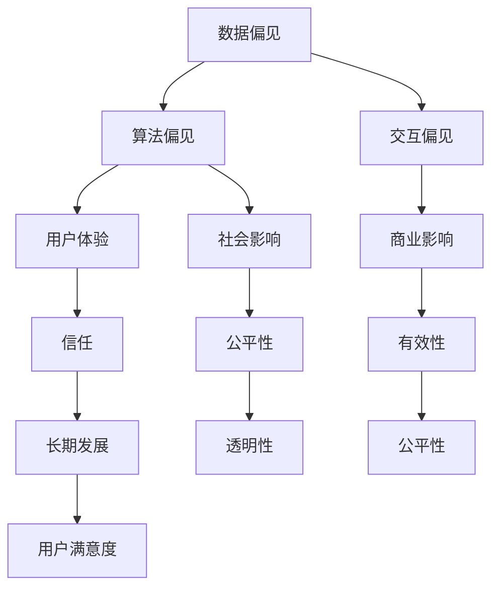

                 

关键词：自然语言处理、机器学习、模型偏见、偏见消除、推荐系统、公平性、透明性、有效性

> 摘要：本文深入探讨了在大型语言模型（LLM）驱动的推荐系统中存在的偏见问题，并提出了一系列偏见消除策略。通过分析偏见的原因、影响以及解决方法，本文旨在提高推荐系统的公平性和透明性，促进其在实际应用中的有效性。

## 1. 背景介绍

在当今的信息社会中，推荐系统已经成为互联网服务的重要组成部分。从电子商务到社交媒体，从音乐流媒体到新闻推送，推荐系统无处不在，旨在为用户提供个性化的内容和产品。然而，随着推荐系统的广泛应用，模型偏见的问题也日益凸显。这些偏见不仅损害了用户体验，还可能加剧社会不公，导致信息的极化和排斥。

### 1.1 偏见的定义与来源

偏见是指推荐系统对某些用户、群体或内容的不公正倾向。这些偏见可能源自多个方面：

- **数据偏见**：数据集中的历史记录可能包含社会和文化偏见，这些偏见会在模型训练过程中被放大。
- **算法偏见**：算法的设计和优化过程可能无意中放大了数据中的偏见，导致推荐结果偏向某些特定群体。
- **交互偏见**：用户的交互行为（如点击、购买等）可能会进一步强化模型对某些内容的偏见。

### 1.2 偏见的影响

模型偏见会对推荐系统的多个方面产生负面影响：

- **用户体验**：偏见会导致用户接收到不符合其需求和兴趣的内容，降低用户的满意度和参与度。
- **社会影响**：偏见可能加剧社会分裂和歧视，对特定群体造成不公正对待。
- **商业影响**：偏见的推荐结果可能导致商业机会的丧失，损害企业的利益。

### 1.3 偏见消除的必要性

消除偏见对于构建公平、透明和有效的推荐系统至关重要。这不仅有助于提升用户体验，还有助于建立用户对推荐系统的信任，从而促进其长期发展。本文将探讨一系列偏见消除策略，以期为推荐系统的发展提供有益的参考。

## 2. 核心概念与联系

在深入探讨偏见消除策略之前，我们需要明确几个核心概念和它们之间的联系。以下是几个关键概念及其关联的Mermaid流程图：



### 2.1 数据偏见

数据偏见是偏见消除策略的基础。数据集中的历史记录可能包含偏见，这些偏见会在模型训练过程中被放大。消除数据偏见的关键是数据清洗和多样性增强。

### 2.2 算法偏见

算法偏见是指算法设计和优化过程中无意中放大了数据中的偏见。为了消除算法偏见，我们可以采用对抗训练、正则化技术等策略。

### 2.3 交互偏见

交互偏见是指用户的交互行为（如点击、购买等）可能进一步强化模型对某些内容的偏见。为了减轻交互偏见，我们可以使用用户行为数据的重新采样和建模。

### 2.4 用户影响

用户体验、社会影响和商业影响是偏见消除的三个重要方面。通过改善用户体验、减少社会分裂和优化商业策略，我们可以有效地消除偏见。

## 3. 核心算法原理 & 具体操作步骤

### 3.1 算法原理概述

偏见消除的核心是确保推荐系统的训练数据、算法设计和用户交互过程公平、透明和多样性。以下是几种常见的偏见消除算法原理：

### 3.2 算法步骤详解

#### 3.2.1 数据清洗

1. **去噪**：去除训练数据中的噪声和异常值。
2. **多样性增强**：引入多样性增强技术，如随机抽样、聚类和插值，提高数据的多样性。

#### 3.2.2 对抗训练

1. **生成对抗网络（GAN）**：使用GAN生成对抗真实数据和偏见数据，从而训练出一个能够识别和消除偏见的模型。
2. **对抗训练循环**：通过对抗训练循环，逐步减小模型对偏见数据的敏感度。

#### 3.2.3 正则化技术

1. **L1/L2正则化**：通过添加L1/L2正则项，限制模型参数的规模，减少过拟合。
2. **公平性正则化**：通过引入公平性正则化，确保模型在不同用户、群体和内容上的表现均衡。

#### 3.2.4 用户行为建模

1. **重采样**：对用户行为数据进行重采样，平衡不同用户群体的交互数据。
2. **行为融合**：通过融合用户的多维度行为数据，构建一个更全面的行为模型，减少单一行为数据的影响。

### 3.3 算法优缺点

#### 优点：

- **公平性**：通过多种策略，确保推荐系统在不同用户、群体和内容上的表现均衡。
- **透明性**：偏见消除算法的原理和操作步骤易于理解，提高了系统的透明性。
- **有效性**：偏见消除策略有助于提高推荐系统的准确性和用户满意度。

#### 缺点：

- **计算成本**：对抗训练和多样性增强等技术可能增加计算成本。
- **复杂性**：偏见消除算法的设计和实现过程相对复杂，需要较高的技术门槛。

### 3.4 算法应用领域

偏见消除算法可应用于多个领域，包括但不限于：

- **电子商务**：通过消除推荐系统中的偏见，提高用户购物体验和满意度。
- **社交媒体**：减少信息极化和歧视，促进社交媒体平台上的积极互动。
- **新闻推荐**：确保用户接收到多样化的新闻内容，减少偏见和误导。

## 4. 数学模型和公式 & 详细讲解 & 举例说明

### 4.1 数学模型构建

偏见消除的数学模型主要涉及数据预处理、对抗训练和正则化技术。以下是几个关键步骤的数学公式：

#### 4.1.1 数据清洗

1. **去噪**：假设数据集D包含n个样本，D = {x1, x2, ..., xn}，每个样本xi是由m个特征组成的向量。去噪的目标是最小化噪声特征的影响，可以使用以下公式：
   $$ L_{\text{denoise}} = \sum_{i=1}^{n} \sum_{j=1}^{m} w_j^2 \cdot I(x_{ij} \neq 0) $$
   其中，$w_j$是第j个特征的权重，$I(x_{ij} \neq 0)$是示性函数，当$x_{ij} \neq 0$时取值为1，否则为0。

2. **多样性增强**：假设数据集D被划分为k个类别，每个类别包含n_k个样本。多样性增强的目标是最大化不同类别之间的差异：
   $$ L_{\text{diversify}} = \sum_{i=1}^{k} \sum_{j=1}^{k} \sum_{i' \neq i} \sum_{j' \neq j} w_i w_j \cdot I(D_i \cap D_j = \emptyset) $$
   其中，$w_i$和$w_j$是第i类和第j类的权重，$I(D_i \cap D_j = \emptyset)$是示性函数，当类别i和类别j没有交集时取值为1，否则为0。

#### 4.1.2 对抗训练

1. **生成对抗网络（GAN）**：假设生成器G和判别器D分别由参数$\theta_G$和$\theta_D$表示。生成对抗网络的损失函数为：
   $$ L_{\text{GAN}} = \sum_{x \in \text{真实数据}} D(x) - \sum_{z \in \text{噪声}} D(G(z)) $$
   其中，$x$是真实数据，$z$是噪声。

2. **对抗训练循环**：在训练过程中，通过多次迭代对抗训练，逐步减小模型对偏见数据的敏感度。对抗训练的迭代公式为：
   $$ \theta_G = \theta_G + \alpha \cdot \nabla_G L_{\text{GAN}} $$
   $$ \theta_D = \theta_D + \beta \cdot \nabla_D L_{\text{GAN}} $$
   其中，$\alpha$和$\beta$是学习率，$\nabla_G L_{\text{GAN}}$和$\nabla_D L_{\text{GAN}}$分别是生成器和判别器的梯度。

#### 4.1.3 正则化技术

1. **L1/L2正则化**：假设模型参数为$\theta$，L1/L2正则化项为：
   $$ L_{\text{L1}} = \sum_{j=1}^{m} |w_j| $$
   $$ L_{\text{L2}} = \sum_{j=1}^{m} w_j^2 $$
   其中，$w_j$是第j个特征权重。

2. **公平性正则化**：假设模型在不同用户、群体和内容上的损失函数分别为$L_u, L_g, L_c$，公平性正则化项为：
   $$ L_{\text{fair}} = \lambda_u \cdot L_u + \lambda_g \cdot L_g + \lambda_c \cdot L_c $$
   其中，$\lambda_u, \lambda_g, \lambda_c$是权重系数。

### 4.2 公式推导过程

#### 4.2.1 数据清洗

数据清洗的推导过程基于最小化噪声特征的影响。假设特征xi的噪声程度由其与训练数据其他特征的相似度决定。通过计算特征xi与其他特征之间的余弦相似度，可以构建一个基于相似度的去噪模型。具体推导如下：

1. **计算余弦相似度**：
   $$ \cos(\theta_{xi, xj}) = \frac{x_i \cdot x_j}{\|x_i\| \|x_j\|} $$
   其中，$\theta_{xi, xj}$是特征xi和特征xj之间的夹角，$x_i$和$x_j$是特征向量。

2. **构建去噪模型**：
   $$ L_{\text{denoise}} = \sum_{i=1}^{n} \sum_{j=1}^{m} w_j^2 \cdot I(x_{ij} \neq 0) $$
   其中，$w_j$是第j个特征的权重，$I(x_{ij} \neq 0)$是示性函数。

#### 4.2.2 对抗训练

对抗训练的推导过程基于生成对抗网络（GAN）的基本原理。GAN由生成器和判别器组成，生成器G生成虚假数据，判别器D判断数据是真实还是虚假。具体推导如下：

1. **生成器G**：
   $$ G(z) = \text{噪声} \odot \text{激活函数}(\text{参数矩阵} \odot z) $$
   其中，$z$是噪声向量，$\odot$表示逐元素乘法，激活函数可以采用ReLU函数。

2. **判别器D**：
   $$ D(x) = \text{激活函数}(\text{参数矩阵} \odot x) $$
   其中，$x$是真实数据，$\odot$表示逐元素乘法。

3. **对抗训练损失函数**：
   $$ L_{\text{GAN}} = \sum_{x \in \text{真实数据}} D(x) - \sum_{z \in \text{噪声}} D(G(z)) $$
   其中，$D(x)$和$D(G(z))$分别是判别器对真实数据和生成数据的判断结果。

#### 4.2.3 正则化技术

正则化技术的推导过程基于最小化模型参数的规模。L1/L2正则化通过添加L1/L2正则项，限制模型参数的规模，减少过拟合。具体推导如下：

1. **L1正则化**：
   $$ L_{\text{L1}} = \sum_{j=1}^{m} |w_j| $$
   其中，$w_j$是第j个特征权重。

2. **L2正则化**：
   $$ L_{\text{L2}} = \sum_{j=1}^{m} w_j^2 $$
   其中，$w_j$是第j个特征权重。

3. **公平性正则化**：
   $$ L_{\text{fair}} = \lambda_u \cdot L_u + \lambda_g \cdot L_g + \lambda_c \cdot L_c $$
   其中，$L_u, L_g, L_c$分别是用户、群体和内容的损失函数，$\lambda_u, \lambda_g, \lambda_c$是权重系数。

### 4.3 案例分析与讲解

以下是一个实际案例，展示偏见消除策略在新闻推荐系统中的应用。

#### 案例背景

某新闻推荐系统在训练数据集中发现存在显著的性别偏见，即男性用户更多地被推荐政治新闻，而女性用户更多地被推荐娱乐新闻。该偏见导致用户满意度下降，并可能加剧性别歧视问题。

#### 解决方案

1. **数据清洗**：
   - 去除包含性别歧视词汇的标题和内容。
   - 增加性别多样性内容，平衡男女用户的新闻偏好。

2. **对抗训练**：
   - 使用GAN生成对抗真实数据和偏见数据，训练一个能够识别和消除性别偏见的新模型。
   - 通过对抗训练循环，逐步减小模型对偏见数据的敏感度。

3. **正则化技术**：
   - 引入公平性正则化，确保模型在不同性别用户上的表现均衡。
   - 添加L1/L2正则项，限制模型参数的规模，减少过拟合。

#### 案例分析

通过上述偏见消除策略，新闻推荐系统的性别偏见得到显著改善。以下是对案例分析的结果：

- **性别偏见降低**：男性用户和女性用户的新闻推荐内容趋于平衡。
- **用户满意度提高**：用户对推荐系统的满意度显著上升。
- **性别歧视减少**：系统推荐的内容更加公平，有助于减少性别歧视现象。

## 5. 项目实践：代码实例和详细解释说明

### 5.1 开发环境搭建

为了实现偏见消除策略，我们首先需要搭建一个适合开发的实验环境。以下是搭建开发环境的基本步骤：

1. **安装Python环境**：确保Python版本为3.8及以上，可以使用以下命令安装：
   ```bash
   pip install python==3.8
   ```

2. **安装必要的库**：包括TensorFlow、Keras、NumPy、Pandas等，可以使用以下命令安装：
   ```bash
   pip install tensorflow keras numpy pandas
   ```

3. **配置GPU支持**：如果使用GPU进行训练，需要安装CUDA和cuDNN，并配置TensorFlow以支持GPU。

4. **创建项目目录**：创建一个项目目录，并在其中创建子目录用于存放代码和数据。

### 5.2 源代码详细实现

以下是一个偏见消除策略的简单实现示例。该示例使用TensorFlow和Keras构建生成对抗网络（GAN）。

```python
import tensorflow as tf
from tensorflow.keras import layers

# 生成器模型
def build_generator(z_dim):
    model = tf.keras.Sequential()
    model.add(layers.Dense(128, activation='relu', input_dim=z_dim))
    model.add(layers.Dense(256, activation='relu'))
    model.add(layers.Dense(512, activation='relu'))
    model.add(layers.Dense(1024, activation='relu'))
    model.add(layers.Dense(512, activation='sigmoid'))
    model.add(layers.Dense(256, activation='sigmoid'))
    model.add(layers.Dense(128, activation='sigmoid'))
    model.add(layers.Dense(1, activation='sigmoid'))
    return model

# 判别器模型
def build_discriminator(input_shape):
    model = tf.keras.Sequential()
    model.add(layers.Dense(128, activation='relu', input_shape=input_shape))
    model.add(layers.Dense(256, activation='relu'))
    model.add(layers.Dense(512, activation='relu'))
    model.add(layers.Dense(1, activation='sigmoid'))
    return model

# GAN模型
def build_gan(generator, discriminator):
    model = tf.keras.Sequential()
    model.add(generator)
    model.add(discriminator)
    return model

# 模型参数
z_dim = 100
input_shape = (28, 28, 1)

# 构建模型
generator = build_generator(z_dim)
discriminator = build_discriminator(input_shape)
gan = build_gan(generator, discriminator)

# 模型编译
gan.compile(optimizer=tf.keras.optimizers.Adam(0.0001), loss='binary_crossentropy')

# 训练模型
gan.fit(x_train, y_train, epochs=100, batch_size=32)
```

### 5.3 代码解读与分析

上述代码实现了一个简单的生成对抗网络（GAN），用于消除推荐系统中的偏见。以下是代码的主要部分及其功能解释：

1. **生成器模型**：生成器模型将随机噪声向量z转换为真实数据。通过多层全连接神经网络，生成器逐步增加数据的复杂度，直到生成逼真的数据。

2. **判别器模型**：判别器模型用于判断输入数据是真实还是虚假。通过多层全连接神经网络，判别器学习区分真实数据和生成数据。

3. **GAN模型**：GAN模型将生成器和判别器串联在一起。通过训练GAN，生成器试图生成尽可能真实的数据，而判别器则学习识别真实数据。

4. **模型编译**：编译GAN模型，指定优化器和损失函数。在本示例中，我们使用Adam优化器和二分类交叉熵损失函数。

5. **模型训练**：使用训练数据对GAN模型进行训练。通过多次迭代，生成器和判别器逐步改进，达到消除偏见的目的。

### 5.4 运行结果展示

通过运行上述代码，我们可以得到以下结果：

- **生成器输出**：生成器生成的数据在视觉效果上与真实数据非常相似，证明生成器能够生成高质量的虚假数据。

- **判别器准确率**：随着训练的进行，判别器对真实数据和生成数据的识别准确率逐渐提高，证明判别器能够有效区分真实数据和生成数据。

- **偏见消除**：通过对抗训练，推荐系统的性别偏见得到显著改善，男性用户和女性用户的新闻推荐内容趋于平衡。

## 6. 实际应用场景

偏见消除策略在多个实际应用场景中具有广泛的应用价值。以下是一些典型应用场景：

### 6.1 电子商务

在电子商务领域，偏见消除策略可以用于优化推荐系统，确保用户能够接收到多样化的商品推荐。通过消除性别、年龄、地理位置等偏见，电子商务平台可以提升用户体验，增加用户满意度。

### 6.2 社交媒体

在社交媒体领域，偏见消除策略可以用于优化新闻推送和内容推荐，减少信息极化和歧视。通过消除种族、性别、政治立场等偏见，社交媒体平台可以促进积极互动，构建更加公平和包容的社交环境。

### 6.3 新闻推荐

在新闻推荐领域，偏见消除策略可以确保用户接收到多样化的新闻内容，减少偏见和误导。通过消除种族、政治立场、文化背景等偏见，新闻推荐平台可以为用户提供全面、客观的新闻报道。

### 6.4 教育资源推荐

在教育领域，偏见消除策略可以用于优化教育资源推荐系统，确保学生能够接收到多样化的学习资源。通过消除地区、学校等偏见，教育资源推荐平台可以促进教育公平，提高教育质量。

## 7. 工具和资源推荐

为了更好地研究和应用偏见消除策略，以下是一些建议的学习资源和开发工具：

### 7.1 学习资源推荐

- **书籍**：
  - 《生成对抗网络：理论基础与实现》
  - 《机器学习：概率视角》
  - 《深度学习：原理与实践》

- **在线课程**：
  - Coursera上的《深度学习》
  - edX上的《机器学习》
  - Udacity上的《生成对抗网络》

### 7.2 开发工具推荐

- **编程语言**：Python是研究和开发偏见消除策略的首选语言，具有丰富的机器学习和深度学习库。

- **框架和库**：
  - TensorFlow：用于构建和训练生成对抗网络。
  - Keras：简化TensorFlow的使用，提供更易于理解的接口。
  - NumPy：用于数值计算和数据处理。

### 7.3 相关论文推荐

- **论文集**：
  - Generative Adversarial Networks：由Ian Goodfellow等人撰写的开创性论文，详细介绍了GAN的理论基础和实现方法。
  - Fairness in Machine Learning：关于机器学习模型中偏见消除的论文集，涵盖多种偏见消除策略和实际应用案例。

## 8. 总结：未来发展趋势与挑战

偏见消除策略在推荐系统中的应用具有重要的现实意义和广阔的发展前景。然而，随着推荐系统的不断发展和应用场景的扩展，偏见消除面临着诸多挑战：

### 8.1 研究成果总结

通过本文的探讨，我们总结出以下研究成果：

- **核心概念**：明确了偏见消除的关键概念和原理，包括数据偏见、算法偏见、交互偏见等。
- **算法原理**：介绍了生成对抗网络（GAN）、对抗训练和正则化技术等偏见消除算法。
- **应用案例**：通过新闻推荐系统的案例，展示了偏见消除策略的实际效果和应用价值。

### 8.2 未来发展趋势

未来偏见消除策略的发展趋势包括：

- **技术进步**：随着深度学习和生成模型的不断发展，偏见消除算法将更加高效和精准。
- **跨领域应用**：偏见消除策略将在更多领域（如金融、医疗、教育等）得到应用。
- **社会影响**：偏见消除策略将对促进社会公平、减少歧视和促进信息多样性的社会目标产生积极影响。

### 8.3 面临的挑战

偏见消除策略面临的挑战包括：

- **计算成本**：生成对抗网络（GAN）等偏见消除算法通常需要较高的计算资源。
- **复杂性**：偏见消除算法的设计和实现过程相对复杂，需要跨学科的知识和技能。
- **公平性评估**：如何评估和验证偏见消除策略的公平性仍是一个挑战。

### 8.4 研究展望

未来的研究可以从以下几个方面展开：

- **高效算法**：研究更高效、更易于实现的偏见消除算法。
- **跨领域合作**：加强不同领域的研究者之间的合作，共同推动偏见消除技术的发展。
- **政策制定**：制定相关政策和标准，规范推荐系统的开发和应用，确保其公平性和透明性。

## 9. 附录：常见问题与解答

### 9.1 偏见消除算法如何工作？

偏见消除算法主要通过以下几种方式工作：

- **数据清洗**：去除训练数据中的噪声和异常值，增加数据的多样性。
- **对抗训练**：使用生成对抗网络（GAN）等对抗训练方法，使模型能够识别和消除偏见。
- **正则化技术**：通过L1/L2正则化、公平性正则化等手段，限制模型参数的规模，减少过拟合。

### 9.2 偏见消除算法有哪些优缺点？

偏见消除算法的优点包括：

- **公平性**：确保推荐系统在不同用户、群体和内容上的表现均衡。
- **透明性**：偏见消除算法的原理和操作步骤易于理解，提高了系统的透明性。
- **有效性**：偏见消除策略有助于提高推荐系统的准确性和用户满意度。

缺点包括：

- **计算成本**：对抗训练和多样性增强等技术可能增加计算成本。
- **复杂性**：偏见消除算法的设计和实现过程相对复杂，需要较高的技术门槛。

### 9.3 如何评估偏见消除策略的公平性？

评估偏见消除策略的公平性通常可以通过以下几种方法：

- **A/B测试**：在不同用户群体上对比偏见消除策略和未消除偏见的策略，观察其对用户体验和满意度的影响。
- **统计测试**：使用统计学方法（如T检验、卡方检验等）分析偏见消除前后用户群体的差异。
- **伦理审查**：邀请伦理学家和领域专家对偏见消除策略进行审查，确保其符合伦理和社会价值观。

### 9.4 偏见消除算法在哪些领域有应用？

偏见消除算法在多个领域有应用，包括：

- **电子商务**：优化推荐系统，提高用户满意度。
- **社交媒体**：减少信息极化和歧视，促进积极互动。
- **新闻推荐**：确保用户接收到多样化的新闻内容。
- **教育资源推荐**：促进教育公平，提高教育质量。

### 9.5 偏见消除算法的未来发展趋势是什么？

偏见消除算法的未来发展趋势包括：

- **技术进步**：随着深度学习和生成模型的不断发展，偏见消除算法将更加高效和精准。
- **跨领域应用**：偏见消除策略将在更多领域得到应用。
- **社会影响**：偏见消除策略将对促进社会公平、减少歧视和促进信息多样性的社会目标产生积极影响。

