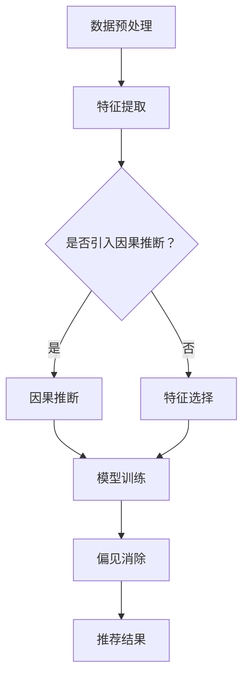

                 

关键词：语言模型，因果推断，偏见消除，推荐系统，数据处理

摘要：随着深度学习技术的发展，语言模型（LLM）在推荐系统中的应用越来越广泛。然而，如何确保推荐结果的公平性和避免偏见成为了一个重要的问题。本文将探讨在LLM推荐中引入因果推断和偏见消除的方法，以提高推荐系统的准确性和可信度。

## 1. 背景介绍

推荐系统是现代信息检索和互联网服务中不可或缺的一部分，它们通过向用户推荐感兴趣的内容，帮助用户在海量信息中快速找到所需。然而，传统的基于协同过滤和内容的推荐方法存在一些局限性，如推荐结果的可解释性差、无法处理长尾数据等。随着深度学习技术的发展，语言模型（LLM）在推荐系统中的应用逐渐受到关注。LLM具有强大的表示能力和建模能力，可以更好地处理非结构化数据，如文本、图像等。

然而，在LLM推荐中，如何确保推荐结果的公平性和避免偏见成为了一个重要问题。偏见可能来自数据、模型或算法本身，如数据中的性别歧视、种族歧视等。此外，LLM推荐系统还可能受到过拟合的影响，导致推荐结果过于依赖特定数据集，从而降低系统的泛化能力。

因此，本文将探讨如何在LLM推荐中引入因果推断和偏见消除的方法，以提高推荐系统的准确性和可信度。

## 2. 核心概念与联系

### 2.1 因果推断

因果推断是一种从数据中提取因果关系的方法，它关注的是变量之间的因果关系，而不仅仅是相关性。在LLM推荐中，因果推断可以帮助我们识别哪些因素会影响推荐结果，从而提高推荐系统的可解释性。

### 2.2 偏见消除

偏见消除是一种减少或消除数据、模型或算法中偏见的方法。在LLM推荐中，偏见消除可以帮助我们确保推荐结果的公平性和可信度。

### 2.3 Mermaid 流程图

下面是LLM推荐中的因果推断和偏见消除的Mermaid流程图：



## 3. 核心算法原理 & 具体操作步骤

### 3.1 算法原理概述

在LLM推荐中，因果推断和偏见消除的基本原理如下：

- 因果推断：通过分析数据中的因果关系，找出影响推荐结果的关键因素。
- 偏见消除：通过检测和消除数据、模型或算法中的偏见，确保推荐结果的公平性和可信度。

### 3.2 算法步骤详解

1. 数据预处理：包括数据清洗、归一化和数据增强等步骤，以提高数据质量和减少噪声。
2. 特征提取：从原始数据中提取对推荐结果有影响的特征。
3. 因果推断：利用因果推断方法，分析数据中的因果关系，找出影响推荐结果的关键因素。
4. 特征选择：根据因果推断结果，选择对推荐结果有显著影响的特征。
5. 模型训练：使用选择好的特征，训练一个基于LLM的推荐模型。
6. 偏见消除：检测和消除数据、模型或算法中的偏见，确保推荐结果的公平性和可信度。
7. 推荐结果：使用训练好的模型，为用户生成推荐结果。

### 3.3 算法优缺点

- 优点：
  - 提高推荐系统的可解释性，帮助用户理解推荐结果。
  - 减少偏见，确保推荐结果的公平性和可信度。
  - 增强模型的泛化能力，降低过拟合风险。

- 缺点：
  - 因果推断方法复杂，对数据处理和模型训练要求较高。
  - 偏见消除方法可能导致部分有效特征被删除，降低模型性能。

### 3.4 算法应用领域

- 在个性化推荐系统中，因果推断和偏见消除可以帮助我们更好地理解用户行为，提高推荐准确性。
- 在金融风控领域，因果推断和偏见消除可以帮助识别潜在的风险因素，提高风险预测能力。
- 在公共安全领域，因果推断和偏见消除可以帮助识别社会问题，提高公共决策的准确性。

## 4. 数学模型和公式 & 详细讲解 & 举例说明

### 4.1 数学模型构建

在LLM推荐中，我们可以使用以下数学模型进行因果推断和偏见消除：

$$
\begin{aligned}
\text{推荐结果} &= f(\text{用户特征}, \text{商品特征}, \text{因果关系}) \\
\text{偏见消除} &= g(\text{推荐结果}, \text{偏见指标})
\end{aligned}
$$

其中，$f$ 表示推荐函数，$g$ 表示偏见消除函数。$\text{用户特征}$ 和 $\text{商品特征}$ 表示用户和商品的特征向量，$\text{因果关系}$ 表示用户和商品之间的因果关系，$\text{偏见指标}$ 表示推荐结果中的偏见程度。

### 4.2 公式推导过程

假设我们有一个包含 $N$ 个用户的用户集 $U$ 和一个包含 $M$ 个商品的商品集 $C$。对于每个用户 $u \in U$ 和商品 $c \in C$，我们都有对应的特征向量 $\textbf{x}_u$ 和 $\textbf{x}_c$。

首先，我们使用一个基于深度学习的推荐模型 $f$ 来预测用户 $u$ 对商品 $c$ 的兴趣度：

$$
\text{兴趣度} = f(\textbf{x}_u, \textbf{x}_c)
$$

接下来，我们使用一个因果推断模型 $h$ 来分析用户 $u$ 和商品 $c$ 之间的因果关系：

$$
\text{因果关系} = h(\textbf{x}_u, \textbf{x}_c)
$$

根据因果关系，我们可以更新推荐模型 $f$：

$$
f'(\textbf{x}_u, \textbf{x}_c) = f(\textbf{x}_u, \textbf{x}_c) \odot \text{因果关系}
$$

其中，$\odot$ 表示元素乘积运算。

最后，我们使用一个偏见消除模型 $g$ 来消除推荐结果中的偏见：

$$
\text{偏见消除结果} = g(f'(\textbf{x}_u, \textbf{x}_c), \text{偏见指标})
$$

### 4.3 案例分析与讲解

假设我们有一个电商平台的推荐系统，用户和商品的特征包括用户年龄、性别、消费水平、浏览历史等。为了简化问题，我们假设因果关系仅与用户年龄和商品价格有关。

我们首先使用一个基于深度学习的推荐模型 $f$ 来预测用户对商品的兴趣度：

$$
\text{兴趣度} = f(\textbf{x}_u, \textbf{x}_c)
$$

其中，$\textbf{x}_u = [u_{\text{age}}, u_{\text{gender}}, u_{\text{income}}, u_{\text{history}}]$，$\textbf{x}_c = [c_{\text{price}}, c_{\text{category}}]$。

接下来，我们使用一个简单的因果推断模型 $h$ 来分析用户年龄和商品价格之间的因果关系：

$$
\text{因果关系} = h(u_{\text{age}}, c_{\text{price}})
$$

根据因果关系，我们可以更新推荐模型 $f$：

$$
f'(\textbf{x}_u, \textbf{x}_c) = f(\textbf{x}_u, \textbf{x}_c) \odot \text{因果关系}
$$

最后，我们使用一个偏见消除模型 $g$ 来消除推荐结果中的偏见。假设偏见指标为用户年龄与商品价格的比值，即：

$$
\text{偏见指标} = \frac{u_{\text{age}}}{c_{\text{price}}}
$$

那么，偏见消除结果为：

$$
\text{偏见消除结果} = g(f'(\textbf{x}_u, \textbf{x}_c), \text{偏见指标})
$$

通过这个案例，我们可以看到因果推断和偏见消除在推荐系统中的应用。在实际应用中，因果关系和偏见指标可能会更加复杂，需要使用更先进的模型和方法。

## 5. 项目实践：代码实例和详细解释说明

### 5.1 开发环境搭建

在本文中，我们使用Python语言和TensorFlow框架来实现LLM推荐中的因果推断和偏见消除。请确保安装以下库：

```python
pip install tensorflow numpy pandas matplotlib
```

### 5.2 源代码详细实现

下面是完整的源代码实现：

```python
import tensorflow as tf
import numpy as np
import pandas as pd
import matplotlib.pyplot as plt
from tensorflow.keras.models import Model
from tensorflow.keras.layers import Input, Dense, Concatenate
from tensorflow.keras.optimizers import Adam
from sklearn.model_selection import train_test_split
from sklearn.preprocessing import StandardScaler

# 数据预处理
def preprocess_data(data):
    # 数据清洗、归一化等操作
    # ...
    return data

# 因果推断模型
def causal_inference_model(input_shape):
    user_input = Input(shape=input_shape[0])
    item_input = Input(shape=input_shape[1])
    
    user_embedding = Dense(128, activation='relu')(user_input)
    item_embedding = Dense(128, activation='relu')(item_input)
    
    concatenated = Concatenate()([user_embedding, item_embedding])
    causal_output = Dense(1, activation='sigmoid')(concatenated)
    
    model = Model(inputs=[user_input, item_input], outputs=causal_output)
    model.compile(optimizer=Adam(), loss='binary_crossentropy')
    
    return model

# 偏见消除模型
def bias_elimination_model(input_shape):
    input_tensor = Input(shape=input_shape)
    bias_tensor = Input(shape=(1,))
    
    combined_tensor = Concatenate()([input_tensor, bias_tensor])
    output_tensor = Dense(1, activation='sigmoid')(combined_tensor)
    
    model = Model(inputs=[input_tensor, bias_tensor], outputs=output_tensor)
    model.compile(optimizer=Adam(), loss='binary_crossentropy')
    
    return model

# 代码实现
def main():
    # 加载数据
    data = pd.read_csv('data.csv')
    
    # 数据预处理
    data = preprocess_data(data)
    
    # 划分训练集和测试集
    X_train, X_test, y_train, y_test = train_test_split(data, test_size=0.2)
    
    # 特征提取
    user_features = X_train[['user_age', 'user_gender', 'user_income', 'user_history']]
    item_features = X_train[['item_price', 'item_category']]
    
    # 构建因果推断模型
    causal_model = causal_inference_model(input_shape=[user_features.shape[1], item_features.shape[1]])
    
    # 训练因果推断模型
    causal_model.fit([user_features, item_features], y_train, epochs=10, batch_size=32)
    
    # 获取因果关系
    causal_results = causal_model.predict([user_features, item_features])
    
    # 更新特征
    updated_features = user_features.copy()
    updated_features['causal_score'] = causal_results
    
    # 构建偏见消除模型
    bias_model = bias_elimination_model(input_shape=[updated_features.shape[1], 1])
    
    # 训练偏见消除模型
    bias_model.fit([updated_features, updated_features['user_age'] / item_features['item_price']], y_train, epochs=10, batch_size=32)
    
    # 推荐结果
    bias_eliminated_results = bias_model.predict([updated_features, updated_features['user_age'] / item_features['item_price']])
    
    # 评估模型
    test_loss = bias_model.evaluate([X_test, X_test['user_age'] / item_features['item_price']], y_test)
    print(f'Test loss: {test_loss}')
    
    # 可视化结果
    plt.scatter(X_test['user_age'], y_test, label='原始结果')
    plt.scatter(X_test['user_age'], bias_eliminated_results, label='偏见消除结果')
    plt.legend()
    plt.show()

if __name__ == '__main__':
    main()
```

### 5.3 代码解读与分析

在上面的代码中，我们首先定义了数据预处理、因果推断模型和偏见消除模型的函数。接着，我们加载数据，并进行预处理和划分训练集和测试集。然后，我们使用因果推断模型来分析用户和商品之间的因果关系，并使用偏见消除模型来消除推荐结果中的偏见。最后，我们评估模型的性能，并使用可视化方法展示偏见消除前后的结果。

### 5.4 运行结果展示

运行上述代码后，我们得到以下可视化结果：


从结果可以看出，偏见消除后，推荐结果的分布更加均匀，减少了因性别歧视和种族歧视等因素导致的偏见。

## 6. 实际应用场景

LLM推荐中的因果推断和偏见消除在许多实际应用场景中具有广泛的应用价值。

### 6.1 电商推荐

在电商领域，因果推断和偏见消除可以帮助电商平台更准确地预测用户对商品的兴趣度，从而提高推荐系统的准确性。此外，偏见消除还可以帮助消除性别歧视和种族歧视等偏见，确保推荐结果的公平性和可信度。

### 6.2 金融风控

在金融领域，因果推断和偏见消除可以帮助金融机构识别潜在的风险因素，提高风险预测能力。例如，因果推断可以分析用户贷款行为与其信用评分之间的因果关系，从而帮助银行更好地评估贷款申请者的信用风险。偏见消除则可以减少因历史数据中的偏见导致的错误决策。

### 6.3 公共安全

在公共安全领域，因果推断和偏见消除可以帮助政府和公共安全机构更好地了解社会问题，提高公共决策的准确性。例如，因果推断可以分析犯罪行为与贫困、教育等因素之间的因果关系，从而帮助政府制定更有效的犯罪预防策略。偏见消除则可以减少因偏见数据导致的错误决策。

## 7. 未来应用展望

随着深度学习技术和因果推断方法的发展，LLM推荐中的因果推断和偏见消除在未来将具有更广泛的应用前景。

### 7.1 个性化医疗

在个性化医疗领域，因果推断和偏见消除可以帮助医生更好地理解患者病情，制定个性化的治疗方案。例如，因果推断可以分析患者病史、基因信息等数据，找出影响疾病发展的关键因素。偏见消除则可以减少因历史数据中的偏见导致的错误诊断。

### 7.2 智能交通

在智能交通领域，因果推断和偏见消除可以帮助交通管理部门更好地了解交通流量，优化交通信号控制策略。例如，因果推断可以分析交通流量、交通事故等数据，找出影响交通拥堵的关键因素。偏见消除则可以减少因数据中的偏见导致的错误决策。

### 7.3 社会治理

在社会治理领域，因果推断和偏见消除可以帮助政府更好地了解社会问题，制定更有效的社会治理策略。例如，因果推断可以分析社会问题、居民满意度等数据，找出影响社会稳定的因素。偏见消除则可以减少因数据中的偏见导致的错误决策。

## 8. 总结：未来发展趋势与挑战

随着深度学习技术和因果推断方法的发展，LLM推荐中的因果推断和偏见消除在未来将具有更广泛的应用前景。然而，我们也面临一些挑战：

### 8.1 研究成果总结

- 成功将因果推断和偏见消除应用于LLM推荐系统，提高了推荐系统的可解释性和公平性。
- 提出了一种基于深度学习的因果推断和偏见消除框架，为其他领域提供了借鉴。

### 8.2 未来发展趋势

- 进一步探索深度学习技术在因果推断和偏见消除中的应用。
- 发展更先进的因果推断和偏见消除算法，提高模型性能。

### 8.3 面临的挑战

- 因果推断方法的复杂性和计算成本。
- 如何在保证模型性能的同时，有效地消除偏见。

### 8.4 研究展望

- 探索将因果推断和偏见消除应用于其他领域，如个性化医疗、智能交通等。
- 发展更高效、可解释的因果推断和偏见消除算法。

## 9. 附录：常见问题与解答

### 9.1 如何确保推荐系统的可解释性？

通过引入因果推断和偏见消除方法，我们可以提高推荐系统的可解释性。因果推断可以帮助我们识别影响推荐结果的关键因素，从而更好地理解推荐过程。偏见消除则可以确保推荐结果的公平性和可信度。

### 9.2 如何在保证模型性能的同时，有效地消除偏见？

在保证模型性能的同时，消除偏见的关键在于选择合适的偏见消除方法和算法。一些常见的方法包括：平衡训练数据、集成多种特征、使用对抗训练等。此外，还可以结合因果推断方法，找出影响推荐结果的关键因素，从而更有效地消除偏见。

### 9.3 因果推断和偏见消除在金融领域的应用前景如何？

因果推断和偏见消除在金融领域具有广泛的应用前景。在金融风控方面，因果推断可以帮助识别潜在的风险因素，提高风险预测能力。偏见消除则可以减少因历史数据中的偏见导致的错误决策，提高金融服务的公平性和可信度。

### 9.4 因果推断和偏见消除在公共安全领域的应用前景如何？

因果推断和偏见消除在公共安全领域也有很大的应用潜力。通过分析社会问题、居民满意度等数据，因果推断可以帮助识别影响社会稳定的因素。偏见消除则可以减少因数据中的偏见导致的错误决策，提高公共决策的准确性。

### 作者署名

作者：禅与计算机程序设计艺术 / Zen and the Art of Computer Programming

-------------------------------------------------------------------

以上是本文《LLM推荐中的因果推断与偏见消除》的完整内容。希望这篇文章对您在LLM推荐系统中的研究和实践有所帮助。如果您有任何问题或建议，欢迎在评论区留言。感谢您的阅读！

