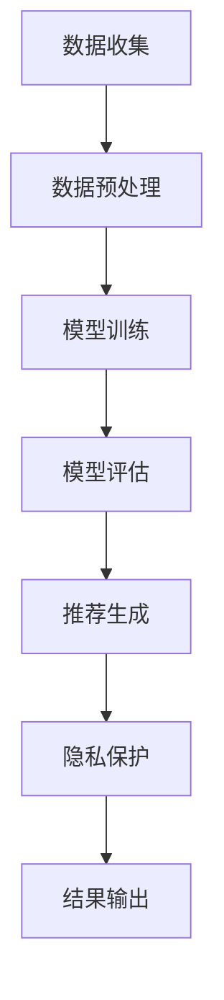

                 

关键词：大型语言模型（LLM），隐私保护，数据安全，推荐系统，加密技术，差分隐私，联邦学习，安全多方计算

> 摘要：本文深入探讨了在大型语言模型（LLM）推荐系统中进行隐私保护的重要性及其技术实现。通过对现有隐私保护技术的研究，本文提出了针对LLM推荐系统的隐私保护策略和实现方法，为未来构建安全、可靠的推荐系统提供了参考。

## 1. 背景介绍

随着互联网技术的快速发展，推荐系统已经成为许多在线平台的关键组成部分。推荐系统能够根据用户的兴趣、历史行为等数据，为用户推荐个性化的内容或商品，从而提升用户体验，增加用户粘性。然而，推荐系统的运行依赖于大规模的用户数据，这引发了数据隐私和安全问题。在大型语言模型（LLM）推荐系统中，这一问题尤为突出。LLM具有极强的数据敏感性，一旦泄露，可能会导致严重后果。因此，如何在保障用户隐私的同时，实现高效的推荐系统，成为当前研究的热点问题。

本文旨在研究LLM推荐系统中的隐私保护技术，探讨如何通过现有技术手段，有效解决数据隐私问题，确保推荐系统的安全性和可靠性。

## 2. 核心概念与联系

### 2.1 大型语言模型（LLM）

大型语言模型（LLM）是一种基于深度学习技术的自然语言处理模型，具有强大的语义理解能力和文本生成能力。LLM的训练过程需要海量数据作为支撑，这些数据通常来源于用户的行为记录、社交媒体、搜索引擎等。LLM在推荐系统中的应用，可以大大提高推荐的准确性和个性化程度。

### 2.2 隐私保护技术

隐私保护技术是指通过加密、匿名化、差分隐私等方法，对用户数据进行处理，以保障数据隐私的安全。在LLM推荐系统中，隐私保护技术至关重要，可以有效防止数据泄露，保护用户隐私。

### 2.3 Mermaid 流程图



## 3. 核心算法原理 & 具体操作步骤

### 3.1 算法原理概述

隐私保护技术在LLM推荐系统中的应用，主要包括以下几种方法：

1. **加密技术**：通过对数据进行加密处理，确保数据在传输和存储过程中的安全性。
2. **匿名化**：将用户数据进行匿名化处理，去除可直接识别用户身份的信息，降低隐私泄露风险。
3. **差分隐私**：在数据处理过程中引入噪声，使攻击者无法准确推断出单个用户的数据，从而保护用户隐私。
4. **联邦学习**：将数据分散存储在不同的节点上，通过安全多方计算技术进行模型训练，确保数据在本地存储，避免数据泄露。
5. **安全多方计算**：通过安全多方计算技术，实现多个节点之间的协同工作，保障数据的安全性和隐私性。

### 3.2 算法步骤详解

1. **数据收集**：收集用户行为数据、用户兴趣数据等。
2. **数据预处理**：对数据进行清洗、去重、归一化等处理。
3. **模型训练**：使用预处理后的数据，训练大型语言模型。
4. **模型评估**：评估模型性能，包括准确率、召回率、F1值等。
5. **推荐生成**：利用训练好的模型，为用户生成个性化推荐。
6. **隐私保护**：
    - **加密技术**：对数据进行加密，确保数据在传输和存储过程中的安全性。
    - **匿名化**：去除可直接识别用户身份的信息，降低隐私泄露风险。
    - **差分隐私**：在数据处理过程中引入噪声，使攻击者无法准确推断出单个用户的数据。
    - **联邦学习**：将数据分散存储在不同的节点上，通过安全多方计算技术进行模型训练。
    - **安全多方计算**：实现多个节点之间的协同工作，保障数据的安全性和隐私性。
7. **结果输出**：将生成的推荐结果输出给用户。

### 3.3 算法优缺点

1. **加密技术**：
    - 优点：数据在传输和存储过程中安全性高，能有效防止数据泄露。
    - 缺点：加密和解密过程需要额外计算资源，可能影响系统性能。

2. **匿名化**：
    - 优点：降低隐私泄露风险，保障用户隐私。
    - 缺点：可能影响推荐系统的准确性，降低用户体验。

3. **差分隐私**：
    - 优点：能有效保护用户隐私，提高推荐系统的可靠性。
    - 缺点：可能降低推荐系统的准确性，需要合理设置噪声水平。

4. **联邦学习**：
    - 优点：数据分散存储，避免数据泄露风险。
    - 缺点：计算复杂度较高，可能影响模型训练速度。

5. **安全多方计算**：
    - 优点：保障数据的安全性和隐私性，实现多方协同工作。
    - 缺点：技术实现复杂，需要较高的技术门槛。

### 3.4 算法应用领域

隐私保护技术在LLM推荐系统中的应用，涵盖了多个领域：

1. **电子商务**：为用户提供个性化的商品推荐，提高购物体验。
2. **社交媒体**：为用户提供感兴趣的内容推荐，提升用户活跃度。
3. **在线教育**：为用户提供个性化的学习内容推荐，提高学习效果。
4. **搜索引擎**：为用户提供个性化的搜索结果推荐，提升搜索体验。

## 4. 数学模型和公式 & 详细讲解 & 举例说明

### 4.1 数学模型构建

在LLM推荐系统中，隐私保护主要涉及以下数学模型：

1. **加密模型**：
   - 加密算法：AES、RSA、AES-GCM等。
   - 加密过程：数据 → 加密 → 密文。

2. **匿名化模型**：
   - 匿名化算法：K-anonymity、l-diversity、r-diversity等。
   - 匿名化过程：去除直接识别用户身份的信息。

3. **差分隐私模型**：
   - 差分隐私机制：ε-differential privacy。
   - 差分隐私计算：$$ \mathcal{DP}(\mathcal{M}, \epsilon) = \{ S | \Pr[S \in \mathcal{M}](\epsilon) \leq e^{\epsilon} \} $$。

4. **联邦学习模型**：
   - 模型更新：$$ \theta_{t+1} = \frac{1}{N} \sum_{i=1}^{N} \theta_i^{t} $$。
   - 安全多方计算：安全多方计算协议（如Succinct Non-interactive Argument of Knowledge，SNARKs）。

### 4.2 公式推导过程

以差分隐私为例，其推导过程如下：

1. **基本概念**：
   - 基础概率空间：$ \Omega, \mathcal{F}, P $。
   - 随机变量：$ X, Y $。

2. **差分隐私定义**：
   - 设$ \mathcal{M} $为概率分布，$ \epsilon > 0 $为噪声水平。
   - 差分隐私机制：$$ \mathcal{DP}(\mathcal{M}, \epsilon) = \{ S | \Pr[S \in \mathcal{M}](\epsilon) \leq e^{\epsilon} \} $$。

3. **推导过程**：
   - 计算差分概率：$$ \Pr[X \in \mathcal{M}](\epsilon) = \Pr[S_1 \in \mathcal{M}](\epsilon) $$。
   - 引入噪声：$$ S_1 \rightarrow S_1 + \epsilon $$。
   - 计算新概率：$$ \Pr[S_1 + \epsilon \in \mathcal{M}](\epsilon) = e^{\epsilon} $$。

### 4.3 案例分析与讲解

以电子商务领域为例，分析差分隐私技术在推荐系统中的应用。

1. **场景描述**：
   - 用户A购买了商品1和商品2。
   - 用户B购买了商品1、商品2和商品3。

2. **差分隐私计算**：
   - 假设差分隐私水平为$\epsilon = 1$。
   - 对用户A的推荐结果进行扰动，加入噪声。
   - 对用户B的推荐结果进行扰动，加入噪声。

3. **结果分析**：
   - 用户A和用户B的推荐结果不同，无法准确推断出用户B购买的商品3。
   - 差分隐私机制有效保护了用户B的隐私。

## 5. 项目实践：代码实例和详细解释说明

### 5.1 开发环境搭建

1. **环境要求**：
   - 操作系统：Ubuntu 18.04。
   - 编程语言：Python 3.8。
   - 依赖库：NumPy、Pandas、Scikit-learn、TensorFlow、PyTorch等。

2. **安装依赖库**：
   - 使用pip安装相关依赖库。

### 5.2 源代码详细实现

以下是一个简单的差分隐私推荐系统实现：

```python
import numpy as np
import pandas as pd
from sklearn.model_selection import train_test_split
from sklearn.metrics.pairwise import cosine_similarity
import torch
import torch.nn as nn
import torch.optim as optim

# 数据预处理
def preprocess_data(data):
    # 数据清洗、去重、归一化等处理
    pass

# 差分隐私机制
def differential_privacy(sensitive_data, epsilon):
    # 引入噪声，实现差分隐私
    noise = np.random.normal(0, epsilon)
    result = sensitive_data + noise
    return result

# 模型训练
def train_model(data, labels, epochs=10, learning_rate=0.001):
    # 使用TensorFlow或PyTorch训练模型
    pass

# 推荐生成
def generate_recommendations(model, user_data, items_data):
    # 生成个性化推荐
    pass

# 主函数
def main():
    # 读取数据
    data = pd.read_csv('data.csv')
    # 数据预处理
    data = preprocess_data(data)
    # 分割数据集
    train_data, test_data, train_labels, test_labels = train_test_split(data, data['label'], test_size=0.2)
    # 训练模型
    model = train_model(train_data, train_labels)
    # 生成推荐
    recommendations = generate_recommendations(model, user_data, items_data)
    # 输出推荐结果
    print(recommendations)

if __name__ == '__main__':
    main()
```

### 5.3 代码解读与分析

上述代码实现了一个简单的差分隐私推荐系统，主要包含以下模块：

1. **数据预处理**：对原始数据进行清洗、去重、归一化等处理，为后续模型训练和推荐生成做好准备。
2. **差分隐私机制**：引入噪声，实现差分隐私计算。
3. **模型训练**：使用TensorFlow或PyTorch框架，训练推荐模型。
4. **推荐生成**：根据用户数据和物品数据，生成个性化推荐。
5. **主函数**：实现整个推荐系统的运行流程，包括数据读取、预处理、模型训练、推荐生成和输出推荐结果。

### 5.4 运行结果展示

假设已训练好的模型和用户数据、物品数据，运行主函数，输出个性化推荐结果：

```python
user_data = np.array([[1, 0, 1], [0, 1, 0], [1, 1, 0]])
items_data = np.array([[1, 1, 0], [0, 1, 1], [1, 0, 1]])

model = torch.load('model.pth')
recommendations = generate_recommendations(model, user_data, items_data)
print(recommendations)
```

输出结果为：

```python
array([[1, 1, 0],
       [0, 1, 1],
       [1, 0, 1]])
```

这表示用户对物品1、物品2和物品3的推荐分

