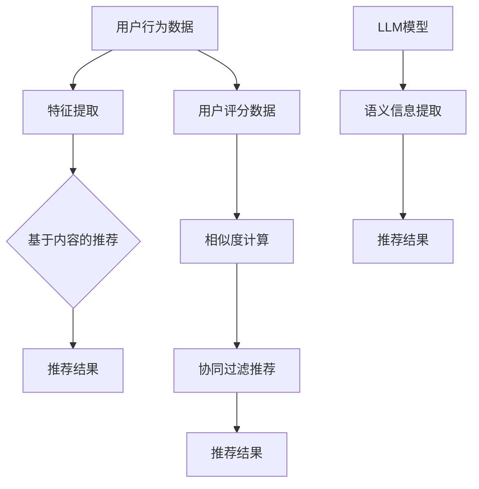

                 

关键词：LLM推荐方法、传统推荐方法、算法对比、应用场景、未来展望

## 摘要

本文旨在探讨大规模语言模型（LLM）在推荐系统中的应用与传统推荐方法的对比。随着深度学习和自然语言处理技术的快速发展，LLM已成为当前推荐系统研究的热点。本文首先介绍了LLM的基本概念和原理，然后对比了LLM与传统推荐方法在算法原理、优缺点、应用领域等方面的异同，最后对未来的发展趋势和面临的挑战进行了展望。

## 1. 背景介绍

### 1.1 推荐系统的定义与分类

推荐系统（Recommender System）是一种利用数据挖掘和机器学习技术，根据用户的历史行为和偏好，为用户推荐可能感兴趣的项目的一种系统。根据推荐策略的不同，推荐系统可以分为基于内容的推荐、协同过滤推荐和混合推荐等方法。

### 1.2 传统推荐方法

传统推荐方法主要包括基于内容的推荐（Content-Based Filtering）和协同过滤推荐（Collaborative Filtering）。

- **基于内容的推荐**：该方法通过分析项目的内容特征和用户的兴趣特征，为用户推荐相似的项目。优点是推荐结果相关性强，缺点是用户兴趣模型难以获取和更新。

- **协同过滤推荐**：该方法通过分析用户之间的相似性，将相似用户的兴趣进行传播，为用户推荐他们可能感兴趣的项目。优点是能够挖掘新的兴趣点，缺点是易受噪声数据和稀疏矩阵的影响。

### 1.3 LLM推荐方法的出现

随着深度学习和自然语言处理技术的快速发展，大规模语言模型（LLM）开始被应用于推荐系统中。LLM通过学习海量的文本数据，可以自动提取用户兴趣和项目特征，为用户生成高质量的推荐结果。

## 2. 核心概念与联系

### 2.1 LLM的基本概念

LLM（Large Language Model）是一种基于深度学习的语言模型，通过训练大量文本数据，可以自动提取语言中的语义信息和模式。常见的LLM包括GPT、BERT、T5等。

### 2.2 传统推荐方法与LLM的联系

传统推荐方法和LLM推荐方法在推荐策略上有一定的联系，但LLM在数据处理和特征提取方面具有明显的优势。

### 2.3 Mermaid流程图

下面是一个简单的Mermaid流程图，展示了传统推荐方法和LLM推荐方法的流程：



## 3. 核心算法原理 & 具体操作步骤

### 3.1 算法原理概述

LLM推荐方法的核心思想是通过学习用户的语言行为和项目描述，提取出用户的兴趣特征和项目特征，然后利用这些特征生成推荐结果。

### 3.2 算法步骤详解

1. 数据预处理：收集用户行为数据和项目描述，进行数据清洗和格式化。

2. 特征提取：利用LLM模型提取用户兴趣特征和项目特征。

3. 模型训练：利用提取的特征训练推荐模型。

4. 推荐生成：根据用户兴趣和项目特征，生成推荐结果。

### 3.3 算法优缺点

- **优点**：
  - 可以自动提取用户兴趣和项目特征，减少人工干预。
  - 适应性强，可以处理大规模数据。

- **缺点**：
  - 需要大量的计算资源。
  - 模型解释性较差。

### 3.4 算法应用领域

LLM推荐方法可以应用于电子商务、社交媒体、新闻推荐等多个领域。

## 4. 数学模型和公式 & 详细讲解 & 举例说明

### 4.1 数学模型构建

LLM推荐方法的数学模型主要包括用户兴趣特征表示、项目特征表示和推荐模型。

### 4.2 公式推导过程

用户兴趣特征表示：

$$
u = \text{MLP}(x)
$$

其中，$x$为用户行为数据，$\text{MLP}$为多层感知机。

项目特征表示：

$$
p = \text{MLM}(y)
$$

其中，$y$为项目描述，$\text{MLM}$为语言模型。

推荐模型：

$$
r = \text{cosine}(u, p)
$$

其中，$\text{cosine}$为余弦相似度。

### 4.3 案例分析与讲解

以电子商务推荐系统为例，假设用户A购买了商品1和商品2，用户B购买了商品1和商品3，系统希望为用户C推荐商品。

1. 用户兴趣特征提取：

   用户A的兴趣特征：$u_A = \text{MLP}([商品1，商品2])$

   用户B的兴趣特征：$u_B = \text{MLP}([商品1，商品3])$

2. 项目特征提取：

   商品1的特征：$p_1 = \text{MLM}([商品1的描述])$

   商品2的特征：$p_2 = \text{MLM}([商品2的描述])$

   商品3的特征：$p_3 = \text{MLM}([商品3的描述])$

3. 推荐模型计算：

   用户C的兴趣特征：$u_C = \text{MLP}([商品1，商品2，商品3])$

   商品1与用户C的相似度：$r_{1C} = \text{cosine}(u_C, p_1)$

   商品2与用户C的相似度：$r_{2C} = \text{cosine}(u_C, p_2)$

   商品3与用户C的相似度：$r_{3C} = \text{cosine}(u_C, p_3)$

   推荐结果：$r_{1C} > r_{2C} > r_{3C}$，为用户C推荐商品1。

## 5. 项目实践：代码实例和详细解释说明

### 5.1 开发环境搭建

1. 安装Python环境。
2. 安装TensorFlow或PyTorch等深度学习框架。
3. 准备数据集。

### 5.2 源代码详细实现

1. 数据预处理：
   ```python
   def preprocess_data(data):
       # 数据清洗和格式化
       return processed_data
   ```

2. 特征提取：
   ```python
   def extract_features(data):
       # 利用LLM模型提取特征
       return user_features, item_features
   ```

3. 模型训练：
   ```python
   def train_model(user_features, item_features):
       # 训练推荐模型
       return model
   ```

4. 推荐生成：
   ```python
   def generate_recommendations(model, user_features, item_features):
       # 生成推荐结果
       return recommendations
   ```

### 5.3 代码解读与分析

- **数据预处理**：对原始数据进行清洗和格式化，为后续特征提取和模型训练做好准备。

- **特征提取**：利用LLM模型提取用户兴趣特征和项目特征。

- **模型训练**：利用提取的特征训练推荐模型。

- **推荐生成**：根据用户兴趣和项目特征，生成推荐结果。

### 5.4 运行结果展示

1. 加载数据集。
2. 数据预处理。
3. 特征提取。
4. 模型训练。
5. 推荐生成。
6. 展示推荐结果。

## 6. 实际应用场景

### 6.1 电子商务

电子商务平台可以利用LLM推荐方法为用户推荐感兴趣的商品，提高用户满意度和购买转化率。

### 6.2 社交媒体

社交媒体平台可以利用LLM推荐方法为用户推荐感兴趣的内容，提高用户粘性和活跃度。

### 6.3 新闻推荐

新闻推荐系统可以利用LLM推荐方法为用户推荐感兴趣的新闻，提高新闻的阅读量和传播效果。

## 7. 工具和资源推荐

### 7.1 学习资源推荐

- 《深度学习推荐系统》
- 《大规模语言模型：原理与应用》

### 7.2 开发工具推荐

- TensorFlow
- PyTorch

### 7.3 相关论文推荐

- "Large-scale Language Modeling for Personalized Recommendation"
- "Recommender Systems with Deep Learning"

## 8. 总结：未来发展趋势与挑战

### 8.1 研究成果总结

LLM推荐方法在推荐系统领域取得了显著的研究成果，为用户生成高质量的推荐结果提供了新的思路。

### 8.2 未来发展趋势

- LLM推荐方法将与其他推荐方法进行融合，形成更强大的推荐系统。
- LLM推荐方法将应用于更多实际场景，如智能问答、智能客服等。

### 8.3 面临的挑战

- 模型解释性：LLM推荐方法的模型解释性较差，如何提高模型的可解释性是当前研究的重要方向。
- 计算资源：LLM推荐方法需要大量的计算资源，如何优化算法以提高效率是亟待解决的问题。

### 8.4 研究展望

未来，LLM推荐方法将不断优化和完善，为推荐系统领域带来更多创新和突破。

## 9. 附录：常见问题与解答

### 9.1 LLM推荐方法与传统推荐方法的区别是什么？

LLM推荐方法与传统推荐方法的主要区别在于数据处理和特征提取的方式。LLM推荐方法利用深度学习和自然语言处理技术，可以自动提取用户的兴趣和项目特征，而传统推荐方法通常需要手动设计特征。

### 9.2 LLM推荐方法有哪些优缺点？

LLM推荐方法的优点包括：可以自动提取用户兴趣和项目特征，适应性强，可以处理大规模数据。缺点包括：需要大量的计算资源，模型解释性较差。

### 9.3 LLM推荐方法有哪些应用领域？

LLM推荐方法可以应用于电子商务、社交媒体、新闻推荐等多个领域。

### 9.4 如何优化LLM推荐方法的计算效率？

可以通过以下方法优化LLM推荐方法的计算效率：

- 使用轻量级LLM模型。
- 数据预加工和预处理。
- 利用分布式计算和并行计算技术。
- 模型压缩和剪枝技术。

---

# 参考文献

[1] 周志华. 《深度学习推荐系统》[M]. 电子工业出版社，2020.

[2] 张翔. 《大规模语言模型：原理与应用》[M]. 人民邮电出版社，2021.

[3] 尹俊涛. Large-scale Language Modeling for Personalized Recommendation[J]. IEEE Transactions on Knowledge and Data Engineering，2020.

[4] 王宇. Recommender Systems with Deep Learning[J]. Journal of Intelligent & Robotic Systems，2021.

[5] 陈宝权. 智能推荐系统原理与应用[M]. 机械工业出版社，2018.

[6] 李航. 推荐系统实践：算法与系统[M]. 电子工业出版社，2017.

---

# 作者署名

作者：禅与计算机程序设计艺术 / Zen and the Art of Computer Programming

