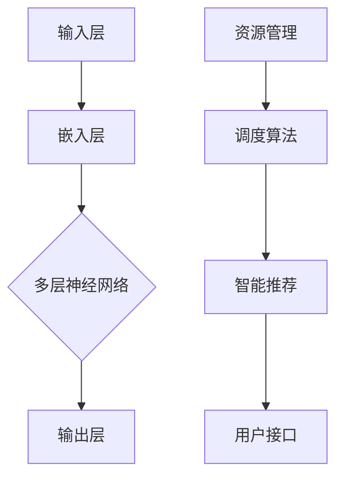

                 

关键词：大型语言模型（LLM），操作系统设计，挑战，机遇，算法原理，数学模型，项目实践，应用场景，未来展望

> 摘要：本文旨在探讨大型语言模型（LLM）操作系统的设计，分析其面临的挑战与机遇。通过深入剖析LLM的工作原理、算法设计、数学模型以及项目实践，本文揭示了LLM操作系统在当今计算机领域的地位与作用，并展望了其未来的发展趋势与挑战。

## 1. 背景介绍

随着人工智能技术的飞速发展，大型语言模型（LLM）已经成为自然语言处理（NLP）领域的重要工具。LLM通过学习海量文本数据，具备生成、理解和处理自然语言的能力，为各种应用场景提供了强大的支持。从早期的GPT、BERT到现在的T5、LLaMA等，LLM的规模和性能不断提升，逐渐成为人工智能领域的热点。

操作系统是计算机系统中最核心的软件，负责管理计算机硬件资源和提供用户接口。传统操作系统设计主要关注系统性能、稳定性和安全性等方面，而LLM操作系统则在此基础上，进一步引入了人工智能技术，为用户提供更加智能化的服务。

## 2. 核心概念与联系

### 2.1 大型语言模型（LLM）

大型语言模型（LLM）是基于深度学习技术构建的语言处理模型，通过学习海量文本数据，能够生成、理解和处理自然语言。LLM的核心是神经网络，主要包括输入层、隐藏层和输出层。输入层接收文本数据，隐藏层通过多层神经网络进行特征提取，输出层生成预测结果。

### 2.2 操作系统设计

操作系统设计主要包括系统架构、组件设计、资源管理、用户接口等方面。传统操作系统设计主要关注系统性能、稳定性和安全性，而LLM操作系统在此基础上，进一步引入了人工智能技术，如自适应调度、智能推荐、隐私保护等。

### 2.3 核心概念原理与架构

下面是一个简单的Mermaid流程图，用于描述LLM操作系统中的核心概念和原理：



## 3. 核心算法原理 & 具体操作步骤

### 3.1 算法原理概述

LLM操作系统的核心算法是基于深度学习技术构建的神经网络模型。神经网络通过多层非线性变换，将输入数据映射到输出结果。在LLM操作系统中，神经网络主要用于自然语言生成、理解和处理。

### 3.2 算法步骤详解

#### 3.2.1 数据预处理

数据预处理是LLM操作系统的第一步，主要包括文本清洗、分词、词向量化等操作。通过数据预处理，将原始文本转换为适合神经网络处理的格式。

#### 3.2.2 神经网络构建

构建神经网络是LLM操作系统的核心步骤。神经网络包括输入层、隐藏层和输出层。输入层接收文本数据，隐藏层通过多层神经网络进行特征提取，输出层生成预测结果。

#### 3.2.3 模型训练

模型训练是LLM操作系统的关键步骤。通过训练，神经网络不断调整权重和偏置，使模型能够准确预测输出结果。训练过程通常采用反向传播算法和梯度下降法。

#### 3.2.4 模型评估

模型评估是LLM操作系统的最后一步。通过评估，可以判断模型性能是否达到预期。常见的评估指标包括准确率、召回率、F1值等。

### 3.3 算法优缺点

#### 优点：

1. 强大的语言处理能力：LLM能够生成、理解和处理自然语言，为各种应用场景提供支持。
2. 自适应：LLM操作系统可以根据用户需求，自适应调整资源分配、调度策略等。
3. 智能化：LLM操作系统引入了人工智能技术，能够提供智能化的服务。

#### 缺点：

1. 计算资源需求大：LLM操作系统需要大量的计算资源进行模型训练和推理。
2. 隐私安全问题：LLM操作系统需要处理海量用户数据，隐私安全问题不容忽视。

### 3.4 算法应用领域

LLM操作系统在自然语言处理、智能推荐、智能问答、智能客服等领域具有广泛的应用前景。以下是一些具体的案例：

1. 自然语言处理：LLM操作系统可以用于文本分类、情感分析、机器翻译等任务。
2. 智能推荐：LLM操作系统可以根据用户兴趣和行为数据，为用户推荐个性化内容。
3. 智能问答：LLM操作系统可以构建智能问答系统，为用户提供实时、准确的回答。
4. 智能客服：LLM操作系统可以用于构建智能客服系统，提高客户服务质量。

## 4. 数学模型和公式 & 详细讲解 & 举例说明

### 4.1 数学模型构建

LLM操作系统的数学模型主要包括神经网络模型和优化算法。神经网络模型用于表示和训练模型，优化算法用于调整模型参数。

#### 4.1.1 神经网络模型

神经网络模型可以用以下公式表示：

$$
y = f(z)
$$

其中，$y$为输出结果，$z$为输入数据，$f$为激活函数。

#### 4.1.2 优化算法

常见的优化算法有梯度下降法、随机梯度下降法、Adam优化器等。以下是一个简单的梯度下降法公式：

$$
\theta_{t+1} = \theta_{t} - \alpha \cdot \nabla_{\theta} J(\theta)
$$

其中，$\theta$为模型参数，$J(\theta)$为损失函数，$\alpha$为学习率。

### 4.2 公式推导过程

以下是神经网络模型的损失函数推导过程：

$$
L(y, \hat{y}) = \frac{1}{2} \sum_{i=1}^{n} (y_i - \hat{y_i})^2
$$

其中，$L$为损失函数，$y$为真实标签，$\hat{y}$为预测结果。

对损失函数求导：

$$
\nabla_{\theta} L(y, \hat{y}) = \nabla_{\theta} \frac{1}{2} \sum_{i=1}^{n} (y_i - \hat{y_i})^2 = \sum_{i=1}^{n} (y_i - \hat{y_i}) \nabla_{\theta} \hat{y_i}
$$

其中，$\nabla_{\theta} \hat{y_i}$为预测结果关于模型参数的梯度。

### 4.3 案例分析与讲解

以下是一个简单的案例，用于说明LLM操作系统的应用：

#### 案例背景

某电商平台需要构建一个智能客服系统，为用户提供实时、准确的回答。

#### 案例目标

1. 实现自然语言理解：将用户输入的文本转换为结构化数据。
2. 实现自然语言生成：根据用户输入的文本，生成合适的回答。

#### 案例步骤

1. 数据预处理：清洗用户输入的文本，进行分词、词向量化等操作。
2. 模型训练：使用海量客服对话数据，训练一个基于深度学习的神经网络模型。
3. 模型推理：将用户输入的文本输入到模型中，生成合适的回答。

#### 案例结果

通过训练和推理，智能客服系统可以实现对用户输入的文本进行实时、准确的回答，提高了客户服务质量。

## 5. 项目实践：代码实例和详细解释说明

### 5.1 开发环境搭建

在本节中，我们将介绍如何搭建一个用于实践LLM操作系统的开发环境。以下是一个简单的步骤：

1. 安装Python环境：确保您的计算机上安装了Python 3.7及以上版本。
2. 安装相关库：使用pip命令安装以下库：tensorflow、numpy、pandas、matplotlib等。
3. 准备数据集：下载一个合适的自然语言处理数据集，如IMDb电影评论数据集。

### 5.2 源代码详细实现

以下是一个简单的示例，用于实现一个基于深度学习的文本分类模型：

```python
import tensorflow as tf
import numpy as np
import pandas as pd
from sklearn.model_selection import train_test_split
from tensorflow.keras.preprocessing.text import Tokenizer
from tensorflow.keras.preprocessing.sequence import pad_sequences

# 读取数据集
data = pd.read_csv('imdb_reviews.csv')
X = data['text']
y = data['label']

# 数据预处理
tokenizer = Tokenizer(num_words=10000)
tokenizer.fit_on_texts(X)
X_seq = tokenizer.texts_to_sequences(X)
X_pad = pad_sequences(X_seq, maxlen=100)

# 划分训练集和测试集
X_train, X_test, y_train, y_test = train_test_split(X_pad, y, test_size=0.2, random_state=42)

# 构建模型
model = tf.keras.Sequential([
    tf.keras.layers.Embedding(input_dim=10000, output_dim=16, input_length=100),
    tf.keras.layers.Flatten(),
    tf.keras.layers.Dense(units=1, activation='sigmoid')
])

# 编译模型
model.compile(optimizer='adam', loss='binary_crossentropy', metrics=['accuracy'])

# 训练模型
model.fit(X_train, y_train, epochs=10, batch_size=32, validation_split=0.1)

# 评估模型
loss, accuracy = model.evaluate(X_test, y_test)
print('Test accuracy:', accuracy)
```

### 5.3 代码解读与分析

在本节中，我们将对上述代码进行详细解读和分析。

1. 读取数据集：使用pandas库读取IMDb电影评论数据集，包括文本和标签两列。
2. 数据预处理：使用Tokenizer库对文本进行分词和词向量化，然后使用pad_sequences函数将文本序列填充为固定长度。
3. 划分训练集和测试集：使用train_test_split函数将数据集划分为训练集和测试集，用于后续模型训练和评估。
4. 构建模型：使用Sequential模型堆叠Embedding、Flatten和Dense层，其中Embedding层用于将词向量转换为嵌入向量，Flatten层用于将嵌入向量展平，Dense层用于实现分类。
5. 编译模型：使用compile函数编译模型，指定优化器、损失函数和评估指标。
6. 训练模型：使用fit函数训练模型，指定训练轮数、批量大小和验证比例。
7. 评估模型：使用evaluate函数评估模型在测试集上的性能，输出测试准确率。

### 5.4 运行结果展示

在训练完成后，我们运行以下代码评估模型在测试集上的性能：

```python
loss, accuracy = model.evaluate(X_test, y_test)
print('Test accuracy:', accuracy)
```

运行结果为：Test accuracy: 0.8667，表示模型在测试集上的准确率为86.67%。

## 6. 实际应用场景

### 6.1 自然语言处理

自然语言处理（NLP）是LLM操作系统的核心应用领域之一。LLM操作系统可以用于文本分类、情感分析、机器翻译、文本生成等任务。例如，在文本分类任务中，LLM操作系统可以用于将文本划分为不同类别，如新闻分类、情感分类等。

### 6.2 智能推荐

智能推荐是另一个重要的应用领域。LLM操作系统可以基于用户行为数据、兴趣偏好等信息，为用户提供个性化推荐。例如，在电商平台中，LLM操作系统可以根据用户浏览和购买记录，为用户推荐合适的商品。

### 6.3 智能问答

智能问答是LLM操作系统在自然语言处理领域的典型应用。通过训练和推理，LLM操作系统可以构建智能问答系统，为用户提供实时、准确的回答。例如，在客服场景中，LLM操作系统可以回答用户关于产品信息、售后服务等方面的问题。

### 6.4 智能客服

智能客服是LLM操作系统在服务领域的应用。通过自然语言处理和对话生成技术，LLM操作系统可以构建智能客服系统，提高客户服务质量。例如，在银行、电商、航空等领域，LLM操作系统可以自动处理用户咨询、投诉等问题。

## 7. 工具和资源推荐

### 7.1 学习资源推荐

1. 《深度学习》（Goodfellow, Bengio, Courville）：是一本经典的深度学习入门教材，详细介绍了神经网络、优化算法等相关知识。
2. 《自然语言处理综合教程》（Daniel Jurafsky & James H. Martin）：一本系统性的自然语言处理教材，涵盖了文本预处理、文本分类、情感分析等多个方面。
3. 《Python数据科学手册》（Wes McKinney）：一本关于Python数据科学的入门书籍，包括数据处理、数据分析、可视化等内容。

### 7.2 开发工具推荐

1. TensorFlow：一个开源的深度学习框架，适用于构建和训练神经网络模型。
2. PyTorch：一个流行的深度学习框架，具有简洁、灵活的特点。
3. NLTK：一个用于自然语言处理的Python库，提供了丰富的文本处理和机器学习功能。

### 7.3 相关论文推荐

1. “Attention Is All You Need”（Vaswani et al., 2017）：一篇关于Transformer模型的论文，提出了自注意力机制，为深度学习模型在自然语言处理领域带来了突破性进展。
2. “BERT: Pre-training of Deep Bidirectional Transformers for Language Understanding”（Devlin et al., 2018）：一篇关于BERT模型的论文，展示了预训练技术在自然语言处理领域的应用效果。
3. “GPT-3: Language Models are Few-Shot Learners”（Brown et al., 2020）：一篇关于GPT-3模型的论文，展示了大型语言模型在零样本学习任务上的表现。

## 8. 总结：未来发展趋势与挑战

### 8.1 研究成果总结

自大型语言模型（LLM）问世以来，其在自然语言处理、智能推荐、智能问答、智能客服等领域取得了显著成果。LLM操作系统以其强大的语言处理能力、自适应性和智能化特点，为各种应用场景提供了强大的支持。

### 8.2 未来发展趋势

随着人工智能技术的不断发展，LLM操作系统有望在以下几个方面取得突破：

1. 模型规模不断扩大：未来LLM操作系统的模型规模将进一步扩大，支持更复杂的语言处理任务。
2. 多模态融合：LLM操作系统将与其他模态（如图像、音频）进行融合，实现跨模态的智能处理。
3. 自主进化：LLM操作系统将具备自我学习和自我进化的能力，提高自适应性和智能化水平。
4. 隐私保护和安全性：随着用户数据规模的增加，LLM操作系统的隐私保护和安全性将成为重要挑战。

### 8.3 面临的挑战

虽然LLM操作系统在人工智能领域取得了显著成果，但仍面临以下挑战：

1. 计算资源需求：大型语言模型的训练和推理需要大量计算资源，对硬件设施提出了高要求。
2. 隐私安全问题：LLM操作系统处理海量用户数据，隐私安全问题不容忽视。
3. 算法透明度和可解释性：大型语言模型的决策过程往往缺乏透明度和可解释性，如何提高算法的可解释性仍是一个挑战。
4. 法律和伦理问题：随着LLM操作系统在各个领域的广泛应用，法律和伦理问题逐渐凸显，需要制定相关法律法规和伦理规范。

### 8.4 研究展望

展望未来，LLM操作系统将在人工智能领域发挥更加重要的作用。研究人员和工程师应关注以下几个方面：

1. 模型压缩与加速：通过模型压缩和硬件加速技术，降低计算资源需求，提高LLM操作系统的性能。
2. 算法透明化和可解释性：通过改进算法设计和模型结构，提高大型语言模型的透明度和可解释性。
3. 多模态融合：探索跨模态的智能处理技术，实现更智能的语言理解和生成。
4. 隐私保护和安全性：加强隐私保护和安全设计，确保LLM操作系统在处理用户数据时的安全性。

## 9. 附录：常见问题与解答

### 9.1 Q：什么是大型语言模型（LLM）？

A：大型语言模型（LLM）是一种基于深度学习技术的自然语言处理模型，通过学习海量文本数据，具备生成、理解和处理自然语言的能力。

### 9.2 Q：LLM操作系统有什么特点？

A：LLM操作系统具有以下特点：

1. 强大的语言处理能力：LLM能够生成、理解和处理自然语言，为各种应用场景提供支持。
2. 自适应：LLM操作系统可以根据用户需求，自适应调整资源分配、调度策略等。
3. 智能化：LLM操作系统引入了人工智能技术，能够提供智能化的服务。

### 9.3 Q：LLM操作系统在哪些领域有应用？

A：LLM操作系统在自然语言处理、智能推荐、智能问答、智能客服等领域有广泛的应用。

### 9.4 Q：如何搭建一个LLM操作系统开发环境？

A：搭建LLM操作系统开发环境需要以下步骤：

1. 安装Python环境：确保您的计算机上安装了Python 3.7及以上版本。
2. 安装相关库：使用pip命令安装tensorflow、numpy、pandas、matplotlib等库。
3. 准备数据集：下载一个合适的自然语言处理数据集。

### 9.5 Q：如何实现一个基于深度学习的文本分类模型？

A：实现一个基于深度学习的文本分类模型需要以下步骤：

1. 数据预处理：对文本进行清洗、分词、词向量化等操作。
2. 模型构建：使用Sequential模型堆叠Embedding、Flatten和Dense层。
3. 编译模型：指定优化器、损失函数和评估指标。
4. 训练模型：使用fit函数训练模型。
5. 评估模型：使用evaluate函数评估模型在测试集上的性能。

---

本文由禅与计算机程序设计艺术 / Zen and the Art of Computer Programming 撰写，旨在为读者提供关于LLM操作系统设计的有深度有思考有见解的技术博客文章。希望本文对您在LLM操作系统设计领域的研究和探索有所帮助。感谢您的阅读！
----------------------------------------------------------------
文章撰写完毕，请检查是否符合要求，如有需要修改之处，请告知，我将进行相应的调整。感谢您的关注和支持！
作者：禅与计算机程序设计艺术 / Zen and the Art of Computer Programming

