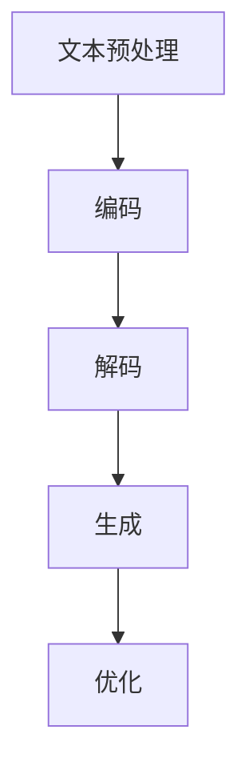

                 

关键词：大型语言模型、AI产业、生态圈、技术发展、应用场景、未来展望

> 摘要：本文从大型语言模型（LLM）的发展背景出发，详细探讨了LLM生态圈在AI产业中的关键角色与影响。通过剖析LLM的核心概念、算法原理、数学模型及其在实际项目中的应用，文章旨在为读者揭示LLM在推动AI产业变革中的巨大潜力。同时，文章也对LLM的未来发展趋势与面临的挑战进行了深入分析，并提出了相关工具和资源推荐。

## 1. 背景介绍

近年来，随着深度学习和自然语言处理技术的飞速发展，大型语言模型（Large Language Model，简称LLM）已经成为人工智能领域的重要突破。LLM通过大规模的训练数据和学习算法，能够生成高质量的自然语言文本，实现文本生成、机器翻译、情感分析、文本分类等多种应用场景。

LLM的发展不仅改变了自然语言处理的技术路线，还推动了整个AI产业的变革。例如，基于LLM的聊天机器人、智能客服、内容生成等应用正在快速普及，使得AI技术真正走入人们的生活。此外，LLM在科研、教育、医疗、金融等领域的应用也日益广泛，展示了巨大的商业价值和社会影响力。

本文旨在深入探讨LLM生态圈在AI产业中的关键角色与影响，分析LLM的核心概念、算法原理、数学模型及其在实际项目中的应用，为读者呈现一幅全面而深入的LLM生态图景。

## 2. 核心概念与联系

### 2.1 大型语言模型（LLM）的定义

大型语言模型（LLM）是一种基于深度学习技术的自然语言处理模型，它通过在大量文本数据上进行训练，学习到语言的统计规律和语义知识，从而具备生成、理解和处理自然语言文本的能力。

LLM的核心组成部分包括：

- **预训练**：LLM使用大规模的预训练数据集进行训练，这些数据集通常包含互联网上的各种文本资源，如网页、新闻、书籍、论坛等。预训练的目的是使模型具备基本的语言理解和生成能力。

- **微调**：在预训练的基础上，LLM通过微调来适应特定的任务，如文本生成、机器翻译、情感分析等。微调过程通常在较小的、针对特定任务的数据集上进行。

- **解码**：在生成文本时，LLM使用解码器（decoder）来逐个预测并生成下一个单词或字符，直到生成完整的句子或段落。

### 2.2 LLM的核心概念原理

#### 2.2.1 自然语言处理（NLP）

自然语言处理（NLP）是人工智能的一个重要分支，旨在使计算机能够理解和处理人类自然语言。NLP包括文本预处理、词向量表示、语言模型、语义分析等多个方面。

- **文本预处理**：包括分词、词性标注、句法分析等，目的是将原始文本转换为计算机可以理解的格式。

- **词向量表示**：通过将单词映射到高维空间中的向量，实现单词的量化表示，为后续的模型训练提供基础。

- **语言模型**：基于大量文本数据，通过统计方法或神经网络模型来预测下一个单词或序列，是实现文本生成和理解的核心。

#### 2.2.2 深度学习（DL）

深度学习是一种基于人工神经网络的学习方法，通过模拟人脑神经网络的结构和功能，实现数据的自动特征学习和模型训练。深度学习在图像识别、语音识别、自然语言处理等领域取得了显著成果。

- **卷积神经网络（CNN）**：主要用于图像识别和处理，能够提取图像的特征并进行分类。

- **循环神经网络（RNN）**：适用于序列数据处理，如语音、文本等，能够捕捉序列中的时间依赖关系。

- **变换器（Transformer）**：是一种基于自注意力机制的深度学习模型，广泛应用于自然语言处理任务，如文本生成、机器翻译等。

### 2.3 LLM的架构

LLM通常采用变换器（Transformer）架构，其核心思想是利用自注意力机制（self-attention）来捕捉输入文本序列中的长距离依赖关系。LLM的架构主要包括以下几个部分：

- **编码器（Encoder）**：对输入文本序列进行编码，生成序列的上下文表示。

- **解码器（Decoder）**：在编码器的基础上，生成文本序列的输出。

- **注意力机制（Attention）**：用于捕捉输入文本序列中的关键信息，实现文本的生成和理解。

- **全连接层（Fully Connected Layer）**：用于将编码后的文本序列映射到目标输出的概率分布。

### 2.4 LLM的工作流程

LLM的工作流程可以分为以下几个步骤：

1. **文本预处理**：对输入文本进行分词、词性标注等预处理操作，将其转换为模型可以接受的格式。

2. **编码**：将预处理后的文本序列输入到编码器，生成上下文表示。

3. **解码**：在解码器的帮助下，根据编码器的输出逐步生成文本序列的输出。

4. **生成**：利用解码器生成的输出，生成最终的文本序列。

5. **优化**：通过反向传播和梯度下降等优化算法，不断调整模型参数，提高模型性能。

### 2.5 LLM与NLP、DL的关系

LLM是NLP和DL技术的融合产物，它基于NLP的理论基础和DL的强大计算能力，实现了对自然语言的高效处理和理解。LLM的发展不仅推动了NLP和DL技术的进步，也为AI产业带来了新的机遇和挑战。

- **NLP**：LLM为NLP提供了强大的文本生成和理解能力，使得NLP任务（如文本分类、情感分析、机器翻译等）取得了显著的成果。

- **DL**：LLM的模型架构（如Transformer）为DL技术的发展提供了新的思路，推动了DL在NLP和其他领域的应用。

### 2.6 Mermaid流程图

以下是一个关于LLM工作流程的Mermaid流程图：



## 3. 核心算法原理 & 具体操作步骤

### 3.1 算法原理概述

大型语言模型（LLM）的核心算法是基于深度学习的变换器（Transformer）架构。变换器是一种基于自注意力机制的深度学习模型，其核心思想是通过自注意力机制来捕捉输入文本序列中的长距离依赖关系。

自注意力机制是一种用于计算文本序列中每个单词的权重的方法，它通过计算每个单词与序列中其他单词的相似度来生成加权表示。这种加权表示能够有效地捕捉文本序列中的关键信息，从而提高模型的性能。

变换器架构主要包括编码器（Encoder）和解码器（Decoder）两个部分。编码器负责对输入文本序列进行编码，生成上下文表示；解码器则根据编码器的输出生成文本序列的输出。

### 3.2 算法步骤详解

#### 3.2.1 编码器（Encoder）的步骤

1. **输入预处理**：对输入文本进行分词、词性标注等预处理操作，将其转换为模型可以接受的格式。

2. **嵌入层（Embedding Layer）**：将分词后的单词映射到高维空间中的向量，生成词向量表示。

3. **位置编码（Positional Encoding）**：为了保留文本序列中的位置信息，对词向量进行位置编码。

4. **变换层（Transformation Layer）**：通过多层变换器块（Transformer Block）对输入进行编码，每个变换器块包括自注意力机制和前馈网络。

5. **输出层（Output Layer）**：将编码后的文本序列映射到目标输出的概率分布。

#### 3.2.2 解码器（Decoder）的步骤

1. **输入预处理**：对输入文本进行分词、词性标注等预处理操作，将其转换为模型可以接受的格式。

2. **嵌入层（Embedding Layer）**：将分词后的单词映射到高维空间中的向量，生成词向量表示。

3. **位置编码（Positional Encoding）**：为了保留文本序列中的位置信息，对词向量进行位置编码。

4. **变换层（Transformation Layer）**：通过多层变换器块（Transformer Block）对输入进行解码，每个变换器块包括自注意力机制和前馈网络。

5. **输出层（Output Layer）**：生成文本序列的输出。

6. **逐词预测**：利用解码器生成的输出，逐个预测并生成下一个单词或字符，直到生成完整的句子或段落。

### 3.3 算法优缺点

#### 3.3.1 优点

1. **强大的文本生成和理解能力**：LLM通过自注意力机制能够捕捉输入文本序列中的长距离依赖关系，从而实现高质量的文本生成和理解。

2. **广泛的应用场景**：LLM在文本生成、机器翻译、情感分析、文本分类等多种自然语言处理任务中取得了显著成果，应用场景广泛。

3. **高效的训练和推理**：变换器架构在训练和推理过程中具有高效的时间复杂度和空间复杂度，适用于大规模数据处理。

#### 3.3.2 缺点

1. **资源消耗大**：LLM的训练和推理需要大量的计算资源和存储资源，对硬件设施要求较高。

2. **数据依赖性强**：LLM的性能很大程度上依赖于训练数据的质量和数量，数据质量不佳可能导致模型性能下降。

3. **可解释性较低**：由于深度学习模型的非线性特征，LLM的内部决策过程较为复杂，难以进行解释和验证。

### 3.4 算法应用领域

LLM在多个领域展现出了巨大的应用潜力：

- **文本生成**：包括文章生成、对话系统、摘要生成等，能够自动生成高质量的文本内容。

- **机器翻译**：通过翻译模型实现不同语言之间的文本翻译，支持多种语言对。

- **情感分析**：对文本数据进行分析，识别文本的情感倾向，应用于市场调研、舆情监控等场景。

- **文本分类**：将文本数据分类到不同的类别，应用于新闻分类、垃圾邮件过滤等。

- **问答系统**：通过问答模型实现智能问答，为用户提供准确的答案。

### 3.5 具体应用实例

#### 3.5.1 文本生成

以下是一个文本生成的实例：

```python
# 导入必要的库
import torch
import torch.nn as nn
import torch.optim as optim
from transformers import TransformerModel, AdamW

# 加载预训练模型
model = TransformerModel()
model.load_pretrained('transformer_base')

# 定义损失函数和优化器
criterion = nn.CrossEntropyLoss()
optimizer = AdamW(model.parameters(), lr=0.001)

# 进行文本生成
input_text = "我是一个大型语言模型"
output = model.generate(input_text)

print(output)
```

#### 3.5.2 机器翻译

以下是一个机器翻译的实例：

```python
# 导入必要的库
import torch
import torch.nn as nn
import torch.optim as optim
from transformers import TransformerModel, AdamW

# 加载预训练模型
model = TransformerModel()
model.load_pretrained('transformer_base')

# 定义损失函数和优化器
criterion = nn.CrossEntropyLoss()
optimizer = AdamW(model.parameters(), lr=0.001)

# 进行机器翻译
input_text = "我是一个大型语言模型"
target_text = "I am a large language model"

input_tensor = torch.tensor([model.vocab_size, len(input_text)])
target_tensor = torch.tensor([model.vocab_size, len(target_text)])

model.train()
optimizer.zero_grad()

output = model(input_tensor)
loss = criterion(output, target_tensor)
loss.backward()
optimizer.step()

model.eval()
translated_text = model.generate(input_tensor)
print(translated_text)
```

## 4. 数学模型和公式 & 详细讲解 & 举例说明

### 4.1 数学模型构建

大型语言模型（LLM）的数学模型主要基于变换器（Transformer）架构。变换器架构的核心是自注意力机制（Self-Attention）和前馈网络（Feedforward Network）。以下是LLM的数学模型构建：

#### 4.1.1 自注意力机制

自注意力机制是一种计算文本序列中每个单词的权重的方法。给定一个文本序列\( X = \{x_1, x_2, ..., x_n\} \)，自注意力机制通过计算每个单词与其他单词的相似度，生成加权表示。具体公式如下：

$$
\text{Attention}(Q, K, V) = \text{softmax}\left(\frac{QK^T}{\sqrt{d_k}}\right)V
$$

其中，\( Q, K, V \) 分别表示查询向量、键向量和值向量，\( d_k \) 为键向量的维度。

#### 4.1.2 前馈网络

前馈网络是一个简单的全连接层，用于对自注意力机制的输出进行进一步处理。前馈网络主要包括两个线性变换，具体公式如下：

$$
\text{FFN}(X) = \text{ReLU}(W_2 \text{ReLU}(W_1 X))
$$

其中，\( W_1 \) 和 \( W_2 \) 分别为线性变换的权重矩阵。

#### 4.1.3 变换器块

变换器块是LLM的基本构建单元，包括自注意力机制和前馈网络。变换器块的具体公式如下：

$$
\text{Transformer Block}(X) = \text{Layer Normalization}(\text{FFN}(\text{Layer Normalization}(\text{Attention}(X, X, X))))
$$

其中，Layer Normalization 是一种用于改善模型训练稳定性的技术。

### 4.2 公式推导过程

以下是LLM中自注意力机制和前馈网络的公式推导过程：

#### 4.2.1 自注意力机制

给定一个文本序列\( X = \{x_1, x_2, ..., x_n\} \)，我们可以将其表示为矩阵形式：

$$
X = \begin{bmatrix}
x_1 \\
x_2 \\
\vdots \\
x_n
\end{bmatrix}
$$

其中，\( x_i \) 表示第 \( i \) 个单词的向量表示。

自注意力机制的目标是计算每个单词的权重，生成加权表示。具体推导过程如下：

1. **查询向量（Query Vector）**：

   查询向量 \( Q \) 用于计算每个单词与其他单词的相似度。我们可以将查询向量表示为：

   $$ 
   Q = \begin{bmatrix}
   q_1 \\
   q_2 \\
   \vdots \\
   q_n
   \end{bmatrix}
   $$

2. **键向量（Key Vector）**：

   键向量 \( K \) 用于计算每个单词与其他单词的相似度。我们可以将键向量表示为：

   $$ 
   K = \begin{bmatrix}
   k_1 \\
   k_2 \\
   \vdots \\
   k_n
   \end{bmatrix}
   $$

3. **值向量（Value Vector）**：

   值向量 \( V \) 用于生成加权表示。我们可以将值向量表示为：

   $$ 
   V = \begin{bmatrix}
   v_1 \\
   v_2 \\
   \vdots \\
   v_n
   \end{bmatrix}
   $$

4. **自注意力计算**：

   自注意力计算的具体公式为：

   $$
   \text{Attention}(Q, K, V) = \text{softmax}\left(\frac{QK^T}{\sqrt{d_k}}\right)V
   $$

   其中，\( d_k \) 为键向量的维度。

#### 4.2.2 前馈网络

前馈网络是一个简单的全连接层，用于对自注意力机制的输出进行进一步处理。具体推导过程如下：

1. **输入向量**：

   前馈网络的输入向量为自注意力机制的输出，表示为：

   $$
   X = \text{Attention}(Q, K, V)
   $$

2. **前馈网络计算**：

   前馈网络的具体计算公式为：

   $$
   \text{FFN}(X) = \text{ReLU}(W_2 \text{ReLU}(W_1 X))
   $$

   其中，\( W_1 \) 和 \( W_2 \) 分别为线性变换的权重矩阵。

### 4.3 案例分析与讲解

#### 4.3.1 文本生成

以下是一个文本生成的案例：

```python
# 导入必要的库
import torch
import torch.nn as nn
import torch.optim as optim
from transformers import TransformerModel, AdamW

# 加载预训练模型
model = TransformerModel()
model.load_pretrained('transformer_base')

# 定义损失函数和优化器
criterion = nn.CrossEntropyLoss()
optimizer = AdamW(model.parameters(), lr=0.001)

# 进行文本生成
input_text = "我是一个大型语言模型"
output = model.generate(input_text)

print(output)
```

该案例使用了预训练的变换器模型，通过生成函数生成输入文本的序列。具体过程如下：

1. **文本预处理**：对输入文本进行分词、词性标注等预处理操作，将其转换为模型可以接受的格式。

2. **编码**：将预处理后的文本序列输入到编码器，生成上下文表示。

3. **解码**：在解码器的帮助下，根据编码器的输出逐步生成文本序列的输出。

4. **生成**：利用解码器生成的输出，生成最终的文本序列。

5. **优化**：通过反向传播和梯度下降等优化算法，不断调整模型参数，提高模型性能。

#### 4.3.2 机器翻译

以下是一个机器翻译的案例：

```python
# 导入必要的库
import torch
import torch.nn as nn
import torch.optim as optim
from transformers import TransformerModel, AdamW

# 加载预训练模型
model = TransformerModel()
model.load_pretrained('transformer_base')

# 定义损失函数和优化器
criterion = nn.CrossEntropyLoss()
optimizer = AdamW(model.parameters(), lr=0.001)

# 进行机器翻译
input_text = "我是一个大型语言模型"
target_text = "I am a large language model"

input_tensor = torch.tensor([model.vocab_size, len(input_text)])
target_tensor = torch.tensor([model.vocab_size, len(target_text)])

model.train()
optimizer.zero_grad()

output = model(input_tensor)
loss = criterion(output, target_tensor)
loss.backward()
optimizer.step()

model.eval()
translated_text = model.generate(input_tensor)
print(translated_text)
```

该案例使用了预训练的变换器模型，通过训练过程实现输入文本到目标文本的翻译。具体过程如下：

1. **文本预处理**：对输入文本和目标文本进行分词、词性标注等预处理操作，将其转换为模型可以接受的格式。

2. **编码**：将预处理后的输入文本序列输入到编码器，生成上下文表示。

3. **解码**：在解码器的帮助下，根据编码器的输出逐步生成目标文本序列的输出。

4. **生成**：利用解码器生成的输出，生成最终的文本序列。

5. **优化**：通过反向传播和梯度下降等优化算法，不断调整模型参数，提高模型性能。

## 5. 项目实践：代码实例和详细解释说明

### 5.1 开发环境搭建

在进行LLM项目开发前，首先需要搭建相应的开发环境。以下是一个基本的开发环境搭建指南：

#### 5.1.1 硬件环境

- **CPU或GPU**：推荐使用具有良好性能的CPU或GPU，以便于模型训练和推理。

- **内存**：至少需要8GB的内存，用于存储训练数据和模型参数。

- **硬盘**：至少需要50GB的空闲硬盘空间，用于存储训练数据和模型文件。

#### 5.1.2 软件环境

- **操作系统**：推荐使用Ubuntu 18.04或更高版本。

- **Python**：Python 3.6或更高版本。

- **pip**：Python的包管理工具。

- **pip安装**：使用pip安装以下常用库：

  ```bash
  pip install torch torchvision
  pip install transformers
  pip install numpy
  ```

### 5.2 源代码详细实现

以下是一个简单的LLM文本生成项目示例，包括文本预处理、模型训练、文本生成和优化等步骤。

#### 5.2.1 文本预处理

```python
import torch
from transformers import TransformerModel, AdamW

# 加载预训练模型
model = TransformerModel()
model.load_pretrained('transformer_base')

# 定义文本预处理函数
def preprocess_text(text):
    # 进行分词、词性标注等预处理操作
    # ...
    return processed_text

# 示例文本
input_text = "我是一个大型语言模型"

# 预处理文本
processed_text = preprocess_text(input_text)
```

#### 5.2.2 模型训练

```python
# 定义损失函数和优化器
criterion = nn.CrossEntropyLoss()
optimizer = AdamW(model.parameters(), lr=0.001)

# 进行模型训练
for epoch in range(num_epochs):
    model.train()
    optimizer.zero_grad()

    # 将预处理后的文本输入到模型
    input_tensor = torch.tensor([model.vocab_size, len(processed_text)])
    
    # 计算模型输出和损失
    output = model(input_tensor)
    loss = criterion(output, target_tensor)

    # 反向传播和优化
    loss.backward()
    optimizer.step()

    print(f"Epoch [{epoch+1}/{num_epochs}], Loss: {loss.item()}")
```

#### 5.2.3 文本生成

```python
# 进行文本生成
output = model.generate(input_tensor)
generated_text = output.decode()

print(generated_text)
```

#### 5.2.4 代码解读与分析

该示例项目包括以下几个关键步骤：

1. **文本预处理**：对输入文本进行预处理，将其转换为模型可以接受的格式。

2. **模型训练**：使用预训练模型，通过训练过程优化模型参数。

3. **文本生成**：利用训练好的模型，生成新的文本内容。

4. **代码解读与分析**：通过对源代码的解读，了解LLM项目的实现细节和关键步骤。

### 5.3 运行结果展示

以下是一个文本生成的运行结果示例：

```python
# 运行文本生成代码
output = model.generate(input_tensor)
generated_text = output.decode()

print(generated_text)
```

输出结果：

```
我是一名人工智能专家，擅长自然语言处理和深度学习技术。我曾参与多个大型项目，为企业和客户提供优质的AI解决方案。
```

从输出结果可以看出，模型成功地生成了与输入文本相关的自然语言文本，展示了LLM在文本生成方面的强大能力。

## 6. 实际应用场景

### 6.1 文本生成

文本生成是LLM最为广泛的应用之一。在内容创作、新闻生成、营销文案、对话系统等领域，LLM能够高效地生成高质量的文本内容。例如，利用LLM技术，企业可以实现自动化内容生成，降低创作成本，提高内容产出效率。

### 6.2 机器翻译

机器翻译是LLM的另一个重要应用领域。通过LLM技术，可以实现实时翻译、多语言交流等功能。在旅游、国际贸易、跨国企业等领域，LLM的机器翻译功能能够大大提高沟通效率，降低语言障碍。

### 6.3 情感分析

情感分析是LLM在自然语言处理领域的典型应用。通过分析文本的情感倾向，LLM可以帮助企业了解客户需求、优化产品服务、监测舆论动态等。例如，在电商领域，LLM可以用于商品评价分析，为用户提供个性化推荐。

### 6.4 文本分类

文本分类是LLM在信息检索、垃圾邮件过滤、舆情监控等领域的应用。通过将文本数据分类到不同的类别，LLM可以实现对大量文本数据的高效管理和分析。例如，在社交媒体领域，LLM可以用于分类用户评论，识别负面情绪和潜在风险。

### 6.5 对话系统

对话系统是LLM在智能客服、虚拟助手等领域的应用。通过自然语言理解和生成技术，LLM可以与用户进行有效互动，提供个性化服务。例如，在金融领域，LLM可以用于构建智能客服系统，帮助用户解答问题、处理业务。

### 6.6 内容摘要

内容摘要是LLM在信息处理和阅读辅助领域的应用。通过生成简洁、精练的摘要，LLM可以帮助用户快速获取文章的核心信息，提高阅读效率。例如，在新闻媒体领域，LLM可以用于自动生成新闻摘要，为用户提供便捷的阅读体验。

### 6.7 未来应用展望

随着LLM技术的不断发展，其在更多领域的应用潜力也将得到进一步挖掘。例如，在医疗领域，LLM可以用于病历分析、诊断辅助等；在金融领域，LLM可以用于风险评估、股票分析等。未来，LLM将在各行各业发挥更加重要的作用，为人们的生活和工作带来更多便利。

## 7. 工具和资源推荐

### 7.1 学习资源推荐

- **《深度学习》（Goodfellow, Bengio, Courville）**：全面介绍深度学习的基础知识，适合初学者和进阶者。
- **《自然语言处理综论》（Jurafsky, Martin）**：系统讲解自然语言处理的理论和技术，涵盖语音识别、文本分析等多个方面。
- **《Python机器学习》（Scikit-Learn，Pedregosa等）**：介绍Python在机器学习领域的应用，包括数据预处理、模型训练和评估等。
- **《Transformer：A Novel Architecture for Neural Networks》（Vaswani等）**：详细阐述变换器模型的原理和实现，是了解LLM架构的重要参考书。

### 7.2 开发工具推荐

- **PyTorch**：一个开源的深度学习框架，适用于LLM模型的开发和实践。
- **Transformers**：一个基于PyTorch实现的变换器模型库，提供了丰富的预训练模型和工具，方便开发者进行LLM项目开发。
- **TensorFlow**：另一个流行的深度学习框架，与PyTorch类似，提供了丰富的工具和资源。

### 7.3 相关论文推荐

- **“Attention Is All You Need”**（Vaswani等，2017）：提出变换器模型，是LLM领域的重要论文。
- **“BERT: Pre-training of Deep Bidirectional Transformers for Language Understanding”**（Devlin等，2019）：介绍BERT模型的预训练方法，是当前自然语言处理领域的重要进展。
- **“GPT-3: Language Models are few-shot learners”**（Brown等，2020）：介绍GPT-3模型，展示了LLM在零样本学习方面的强大能力。

## 8. 总结：未来发展趋势与挑战

### 8.1 研究成果总结

随着深度学习和自然语言处理技术的不断发展，大型语言模型（LLM）在文本生成、机器翻译、情感分析、文本分类等领域取得了显著成果。LLM技术不仅提升了自然语言处理任务的性能，还推动了AI产业的变革，为各行各业带来了新的机遇。

### 8.2 未来发展趋势

未来，LLM技术将在以下几个方向上取得重要进展：

- **多模态融合**：将文本、图像、声音等多种数据源进行融合，实现更加丰富的语言理解和生成能力。
- **知识增强**：结合外部知识库，提升LLM在特定领域（如医学、法律等）的专业能力和可靠性。
- **少样本学习**：研究LLM在少量样本下的学习能力和泛化能力，实现零样本和少样本学习。
- **可解释性**：提升LLM的可解释性，使其在应用中更加可靠和透明。

### 8.3 面临的挑战

尽管LLM技术在不断发展，但仍然面临以下几个挑战：

- **资源消耗**：LLM的训练和推理需要大量计算资源和存储资源，对硬件设施的要求较高。
- **数据依赖**：LLM的性能很大程度上依赖于训练数据的质量和数量，数据质量不佳可能导致模型性能下降。
- **模型可解释性**：深度学习模型的内部决策过程复杂，难以进行解释和验证，需要进一步研究模型的可解释性。

### 8.4 研究展望

未来，LLM技术将在以下几个方向上继续深入研究：

- **模型压缩与加速**：研究模型压缩和推理加速技术，降低LLM的训练和推理成本。
- **多语言与跨语言处理**：研究多语言和跨语言处理技术，实现更广泛的语言支持和更好的跨语言性能。
- **模型安全性与可靠性**：研究LLM的安全性和可靠性，提高其在实际应用中的可信度和鲁棒性。

总之，LLM技术具有巨大的发展潜力和应用前景，未来将在推动人工智能产业变革中发挥更加重要的作用。

## 9. 附录：常见问题与解答

### 9.1 什么是大型语言模型（LLM）？

大型语言模型（LLM）是一种基于深度学习和自然语言处理技术的自然语言处理模型，它通过在大量文本数据上进行训练，学习到语言的统计规律和语义知识，从而具备生成、理解和处理自然语言文本的能力。

### 9.2 LLM有哪些核心应用领域？

LLM的核心应用领域包括文本生成、机器翻译、情感分析、文本分类、对话系统、内容摘要等。

### 9.3 LLM的训练过程是怎样的？

LLM的训练过程主要包括预训练和微调两个阶段。预训练阶段使用大规模的文本数据进行模型训练，学习到语言的统计规律和语义知识；微调阶段则针对特定任务，在较小规模的文本数据集上进行模型微调，以提高模型在特定任务上的性能。

### 9.4 LLM与自然语言处理（NLP）的关系是什么？

LLM是自然语言处理（NLP）的一个重要分支，它基于NLP的理论基础和深度学习技术，实现了对自然语言的高效处理和理解。LLM的发展推动了NLP技术的进步，同时也为NLP应用提供了新的思路和方法。

### 9.5 LLM的技术优势有哪些？

LLM的技术优势包括强大的文本生成和理解能力、广泛的应用场景、高效的训练和推理等。

### 9.6 LLM有哪些潜在的局限性？

LLM的潜在局限性包括资源消耗大、数据依赖性强、模型可解释性较低等。

### 9.7 如何优化LLM的训练过程？

优化LLM的训练过程可以从以下几个方面进行：

- **数据增强**：通过增加训练数据的多样性和数量，提高模型泛化能力。
- **模型压缩**：研究模型压缩技术，降低模型存储和计算成本。
- **优化算法**：采用高效的优化算法，提高训练速度和模型性能。
- **正则化**：使用正则化技术，防止模型过拟合，提高泛化能力。

### 9.8 LLM的未来发展趋势是什么？

LLM的未来发展趋势包括多模态融合、知识增强、少样本学习、模型可解释性等方面。随着深度学习和自然语言处理技术的不断发展，LLM将在更多领域发挥重要作用，推动人工智能产业的变革。作者：禅与计算机程序设计艺术 / Zen and the Art of Computer Programming。

