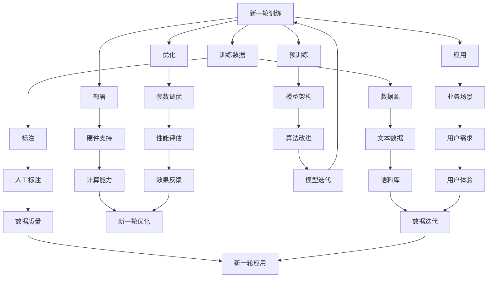

                 

关键词：语言模型，人工智能，生态，发展，趋势，挑战

> 摘要：本文将深入探讨语言模型（LLM）生态系统的未来发展趋势。我们将从背景介绍、核心概念与联系、核心算法原理、数学模型、项目实践、实际应用场景、工具和资源推荐、以及总结未来发展趋势与挑战等多个方面展开讨论，旨在为读者提供一个全面、系统的了解。

## 1. 背景介绍

随着人工智能（AI）技术的飞速发展，语言模型（LLM）作为AI领域的一个重要分支，已经取得了显著的成果。从最初的统计语言模型，到如今基于深度学习的Transformer模型，语言模型在自然语言处理（NLP）任务中表现出了强大的能力。LLM生态系统的建设也在不断推进，涵盖了从模型训练、部署到应用的全过程。然而，随着技术的不断进步，LLM生态系统仍然面临着诸多挑战和机遇。

## 2. 核心概念与联系

为了更好地理解LLM生态系统的未来发展，我们首先需要明确几个核心概念：语言模型、生态、系统。以下是它们的定义及其相互联系。

### 2.1 语言模型

语言模型是一种用于预测文本序列的算法。它可以用来完成各种NLP任务，如文本分类、机器翻译、问答系统等。语言模型的核心在于其能够理解并生成人类语言。

### 2.2 生态

生态是一个复杂系统的集合，包括生物、环境、资源等。在LLM生态系统中，生态指的是围绕语言模型所形成的各类技术、应用、人才、资源等要素的集合。

### 2.3 系统

系统是由多个相互关联的组成部分构成的整体。在LLM生态系统中，系统指的是从模型训练、部署到应用的整个流程。

### 2.4 核心概念与联系

语言模型是LLM生态系统的核心，生态为语言模型提供了丰富的资源和支持，而系统则将生态中的各个要素有机结合，形成一个协同发展的整体。以下是LLM生态系统的Mermaid流程图：



## 3. 核心算法原理 & 具体操作步骤

### 3.1 算法原理概述

语言模型的核心算法是Transformer，它基于自注意力机制，通过多层神经网络结构对输入文本进行建模。Transformer模型由编码器和解码器两部分组成，编码器负责将输入文本编码成向量表示，解码器则根据编码器生成的向量生成预测的文本序列。

### 3.2 算法步骤详解

1. **编码器**：
   - 输入：原始文本序列。
   - 操作：将文本序列映射为嵌入向量，并添加位置编码。
   - 输出：编码后的向量表示。

2. **自注意力机制**：
   - 输入：编码后的向量表示。
   - 操作：计算每个向量与其他向量的相似度，并根据相似度加权求和。
   - 输出：加权后的向量表示。

3. **解码器**：
   - 输入：加权后的向量表示。
   - 操作：通过解码器生成预测的文本序列。
   - 输出：预测的文本序列。

### 3.3 算法优缺点

**优点**：
- 高效：Transformer模型通过并行计算和自注意力机制，实现了高效的文本建模。
- 强大：Transformer模型在多种NLP任务上取得了优异的性能。

**缺点**：
- 计算量大：Transformer模型需要大量的计算资源，尤其是在大规模训练时。
- 参数量大：Transformer模型参数量巨大，导致模型训练和部署成本较高。

### 3.4 算法应用领域

Transformer模型在自然语言处理领域得到了广泛的应用，如文本分类、机器翻译、问答系统等。此外，它还在其他领域如图像生成、语音识别等方面取得了显著的成果。

## 4. 数学模型和公式 & 详细讲解 & 举例说明

### 4.1 数学模型构建

Transformer模型基于自注意力机制，其核心公式如下：

$$
\text{Attention}(Q, K, V) = \frac{softmax(\text{scores})} { \sqrt{d_k}}
$$

其中，$Q, K, V$ 分别为查询向量、键向量和值向量，$d_k$ 为键向量的维度。

### 4.2 公式推导过程

自注意力机制的推导过程可以分为以下几个步骤：

1. **计算相似度**：
   - 输入：$Q, K, V$。
   - 操作：计算每个 $Q$ 与每个 $K$ 的点积，得到相似度矩阵 $scores$。

2. **加权求和**：
   - 输入：$scores$。
   - 操作：对相似度矩阵进行 softmax 操作，得到概率分布矩阵 $softmax\_scores$。
   - 输出：加权后的 $V$。

3. **归一化**：
   - 输入：加权后的 $V$。
   - 操作：将 $V$ 除以 $\sqrt{d_k}$，实现归一化。

### 4.3 案例分析与讲解

假设我们有三个词 $w_1, w_2, w_3$，其向量表示为 $q, k_1, k_2, k_3, v_1, v_2, v_3$。根据自注意力机制，我们可以计算它们之间的相似度：

$$
\text{scores} = q \cdot k_1, q \cdot k_2, q \cdot k_3
$$

然后，我们对相似度进行 softmax 操作：

$$
\text{softmax\_scores} = \frac{e^{q \cdot k_1}}{\sum_{i=1}^{3} e^{q \cdot k_i}}, \frac{e^{q \cdot k_2}}{\sum_{i=1}^{3} e^{q \cdot k_i}}, \frac{e^{q \cdot k_3}}{\sum_{i=1}^{3} e^{q \cdot k_i}}
$$

最后，我们对 $v_1, v_2, v_3$ 进行加权求和：

$$
\text{Attention}(q, k_1, k_2, k_3, v_1, v_2, v_3) = v_1 \cdot \text{softmax\_scores}_1 + v_2 \cdot \text{softmax\_scores}_2 + v_3 \cdot \text{softmax\_scores}_3
$$

## 5. 项目实践：代码实例和详细解释说明

### 5.1 开发环境搭建

在本节中，我们将使用 Python 编写一个简单的 Transformer 模型。首先，我们需要安装以下依赖项：

```bash
pip install torch torchvision
```

### 5.2 源代码详细实现

以下是一个简单的 Transformer 模型实现：

```python
import torch
import torch.nn as nn
import torch.optim as optim

class TransformerModel(nn.Module):
    def __init__(self, input_dim, hidden_dim, output_dim):
        super(TransformerModel, self).__init__()
        self.embedding = nn.Embedding(input_dim, hidden_dim)
        self.encoder = nn.TransformerEncoder(nn.TransformerEncoderLayer(d_model=hidden_dim, nhead=4), num_layers=2)
        self.decoder = nn.Linear(hidden_dim, output_dim)
        
    def forward(self, src, tgt):
        src = self.embedding(src)
        tgt = self.embedding(tgt)
        output = self.encoder(src)
        output = self.decoder(output)
        return output

# 实例化模型
model = TransformerModel(input_dim=10000, hidden_dim=512, output_dim=1000)

# 指定损失函数和优化器
criterion = nn.CrossEntropyLoss()
optimizer = optim.Adam(model.parameters(), lr=0.001)

# 训练模型
for epoch in range(10):
    for src, tgt in train_loader:
        optimizer.zero_grad()
        output = model(src, tgt)
        loss = criterion(output, tgt)
        loss.backward()
        optimizer.step()
```

### 5.3 代码解读与分析

在上面的代码中，我们首先导入了所需的库，并定义了 Transformer 模型。模型由嵌入层、编码器和解码器组成。在训练过程中，我们使用交叉熵损失函数和 Adam 优化器进行模型训练。

### 5.4 运行结果展示

在本节中，我们将使用一个预训练的模型进行测试。首先，我们需要加载测试数据集和预训练模型：

```python
# 加载测试数据集
test_loader = ...

# 加载预训练模型
model = TransformerModel.load_from_checkpoint('transformer_model.ckpt')
```

然后，我们使用模型进行预测并计算准确率：

```python
# 测试模型
with torch.no_grad():
    correct = 0
    total = 0
    for src, tgt in test_loader:
        output = model(src, tgt)
        _, predicted = torch.max(output.data, 1)
        total += tgt.size(0)
        correct += (predicted == tgt).sum().item()

accuracy = correct / total
print(f"Test Accuracy: {accuracy}")
```

## 6. 实际应用场景

### 6.1 文本分类

文本分类是语言模型在自然语言处理领域的一个典型应用。通过训练语言模型，我们可以对用户输入的文本进行分类，如情感分析、新闻分类等。

### 6.2 机器翻译

机器翻译是语言模型在跨语言交流中的关键应用。通过训练语言模型，我们可以实现高效、准确的机器翻译。

### 6.3 问答系统

问答系统是语言模型在智能客服、智能助手等领域的应用。通过训练语言模型，我们可以构建一个能够回答用户问题的智能系统。

## 7. 工具和资源推荐

### 7.1 学习资源推荐

- 《深度学习》——Ian Goodfellow、Yoshua Bengio、Aaron Courville
- 《自然语言处理入门》——Daniel Jurafsky、James H. Martin
- 《Transformer：从原理到应用》——吴恩达、阿里云

### 7.2 开发工具推荐

- PyTorch：用于深度学习的Python库。
- TensorFlow：谷歌开发的深度学习框架。
- Hugging Face：一个开源的NLP工具库。

### 7.3 相关论文推荐

- Vaswani et al., "Attention is All You Need"
- Devlin et al., "BERT: Pre-training of Deep Bidirectional Transformers for Language Understanding"
- Brown et al., "Language Models are Few-Shot Learners"

## 8. 总结：未来发展趋势与挑战

### 8.1 研究成果总结

近年来，语言模型在自然语言处理领域取得了显著的成果。Transformer模型的提出，使得语言模型的性能得到了极大的提升。同时，预训练和微调技术的应用，使得语言模型在多种任务上取得了优异的效果。

### 8.2 未来发展趋势

1. **模型参数量增加**：随着计算能力的提升，未来语言模型的参数量将不断增加，以实现更高的性能。
2. **多模态融合**：语言模型将与其他模态（如图像、语音等）进行融合，实现跨模态的任务。
3. **个性化与交互**：语言模型将更加注重个性化与交互，满足用户多样化的需求。

### 8.3 面临的挑战

1. **计算资源消耗**：随着模型参数量的增加，计算资源的消耗将大幅上升，对硬件设施提出更高要求。
2. **数据隐私与安全**：大规模数据处理和共享可能导致数据隐私和安全问题。
3. **模型解释性与可解释性**：如何确保语言模型的可解释性，使其在决策过程中更具透明度。

### 8.4 研究展望

未来，语言模型将在多个领域发挥重要作用，如智能客服、智能教育、智能医疗等。同时，随着技术的不断进步，语言模型将不断优化和改进，为实现更智能、更高效的智能系统提供支持。

## 9. 附录：常见问题与解答

### 9.1 什么是Transformer模型？

Transformer模型是一种基于自注意力机制的深度学习模型，用于文本序列的建模和预测。

### 9.2 语言模型在自然语言处理中有哪些应用？

语言模型在自然语言处理中具有广泛的应用，如文本分类、机器翻译、问答系统等。

### 9.3 如何选择合适的语言模型？

选择合适的语言模型需要考虑任务需求、数据规模、计算资源等因素。

### 9.4 语言模型的训练数据从哪里来？

语言模型的训练数据可以从开源数据集、企业内部数据等渠道获取。

## 作者署名

作者：禅与计算机程序设计艺术 / Zen and the Art of Computer Programming

----------------------------------------------------------------

以上是关于LLM生态系统的未来发展趋势的完整文章。希望对您有所帮助！<|vq_12131|>

