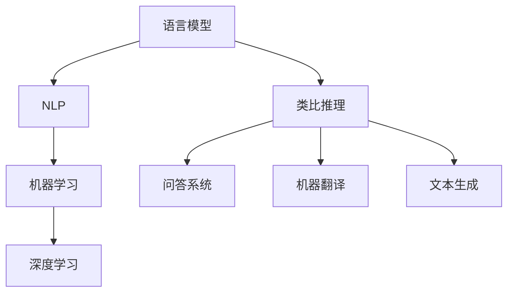

                 

关键词：大型语言模型（LLM）、类比推理（analogical reasoning）、自然语言处理（NLP）、机器学习（ML）、深度学习（DL）、图灵奖、计算机程序设计艺术。

> 摘要：本文将深入探讨大型语言模型（LLM）在类比推理方面的研究与应用。通过回顾现有研究、分析算法原理、探讨数学模型、以及展示具体项目实践，本文旨在为读者提供一个全面且系统的理解，并展望LLM类比推理的未来发展趋势与挑战。

## 1. 背景介绍

类比推理（analogical reasoning）是人类智能的核心能力之一，它通过识别不同情境之间的相似性来解决问题。近年来，随着人工智能（AI）技术的飞速发展，特别是在自然语言处理（NLP）和机器学习（ML）领域，类比推理的研究逐渐成为热点。大型语言模型（LLM）如GPT、BERT等，凭借其强大的语言理解和生成能力，为类比推理的研究提供了新的契机。

LLM的类比推理能力在诸多领域展现出了巨大的潜力。例如，在问答系统、机器翻译、文本生成等领域，LLM能够通过类比推理，提高任务完成的质量和效率。同时，LLM在创意写作、故事生成等领域也表现出色，它能够根据给定的情境，生成具有创意的文本。

本文将围绕LLM的类比推理展开，首先回顾现有研究，然后深入探讨核心算法原理，接着分析数学模型和公式，并展示具体的项目实践。最后，我们将探讨实际应用场景和未来发展趋势。

## 2. 核心概念与联系

在探讨LLM的类比推理之前，我们需要明确几个核心概念：语言模型、自然语言处理、机器学习和深度学习。

### 语言模型

语言模型（Language Model）是自然语言处理（NLP）的核心组成部分。它通过学习大量的语言数据，生成文本的概率分布。在LLM中，语言模型通常是基于神经网络构建的，例如Transformer架构。Transformer架构通过自注意力机制（Self-Attention Mechanism）能够捕捉输入文本中的长距离依赖关系，这使得LLM在处理复杂语言任务时表现出色。

### 自然语言处理

自然语言处理（NLP）是AI的一个重要分支，旨在使计算机能够理解、生成和处理人类语言。NLP涵盖了从文本预处理到语义理解的多个层次。LLM在NLP中的应用，使得许多基于语言的任务，如机器翻译、情感分析、文本分类等，得到了显著提升。

### 机器学习和深度学习

机器学习（ML）是AI的核心技术之一，它通过训练模型来从数据中学习规律。深度学习（DL）是ML的一个子领域，它使用多层神经网络来学习和表示数据。在LLM中，深度学习技术被广泛应用于模型的构建和训练。

### Mermaid 流程图

以下是LLM在类比推理中的核心概念和联系Mermaid流程图：



## 3. 核心算法原理 & 具体操作步骤

### 3.1 算法原理概述

LLM的类比推理基于其强大的语言理解和生成能力。具体来说，LLM通过学习大量的语言数据，建立了对语言结构的深刻理解。在类比推理过程中，LLM能够根据给定的情境和目标，生成具有相似性的文本。这个过程可以分为以下几个步骤：

1. **情境识别**：LLM首先需要理解给定的情境，这包括理解情境中的实体、关系和动作。
2. **目标设定**：根据给定的目标，LLM需要确定生成文本的方向和内容。
3. **类比搜索**：LLM在已学习的语言数据中搜索与目标情境相似的情境，以找到合适的类比。
4. **文本生成**：基于找到的类比，LLM生成符合目标情境的文本。

### 3.2 算法步骤详解

1. **情境识别**：
   - **预处理**：输入文本经过分词、词性标注、句法分析等预处理步骤，以提取文本中的关键信息。
   - **实体识别**：使用命名实体识别（NER）技术，识别文本中的关键实体，如人名、地点、组织等。
   - **关系提取**：通过句法分析，提取文本中的实体关系，如主谓宾关系、因果关系等。

2. **目标设定**：
   - **目标识别**：根据输入文本，LLM需要识别出需要生成的目标文本类型和内容。
   - **目标分析**：对目标进行深入分析，确定生成文本所需的关键要素和结构。

3. **类比搜索**：
   - **相似性度量**：使用向量空间模型（如Word2Vec、BERT）对文本进行编码，计算不同情境之间的相似性。
   - **情境匹配**：根据相似性度量，从已学习的语言数据中找到与目标情境相似的情境。

4. **文本生成**：
   - **模板生成**：基于找到的类比情境，LLM生成文本的初步框架。
   - **填充细节**：对生成的文本框架进行细节填充，以使文本更加完整和连贯。

### 3.3 算法优缺点

**优点**：
- **强大的语言理解能力**：LLM通过对大量语言数据的训练，建立了对语言结构的深刻理解，这使得它在类比推理中表现出色。
- **高效的文本生成**：LLM能够快速生成符合目标情境的文本，提高了任务完成的效率。

**缺点**：
- **数据依赖性强**：LLM的类比推理能力依赖于训练数据的质量和数量，数据不足或质量不高会影响其表现。
- **解释性不足**：LLM的推理过程较为复杂，难以直接解释其推理过程和结果。

### 3.4 算法应用领域

LLM的类比推理在多个领域有着广泛的应用：

- **问答系统**：LLM能够通过类比推理，提高问答系统的回答质量，使其更加自然和准确。
- **机器翻译**：LLM在机器翻译中，能够根据源语言和目标语言的相似性，生成高质量的翻译结果。
- **文本生成**：LLM能够根据给定的情境，生成具有创意的文本，如故事、新闻等。
- **情感分析**：LLM能够通过类比推理，提高情感分析任务的准确性和鲁棒性。

## 4. 数学模型和公式 & 详细讲解 & 举例说明

### 4.1 数学模型构建

LLM的类比推理涉及多个数学模型，包括概率模型、神经网络模型和注意力机制等。以下是这些模型的构建和作用。

#### 4.1.1 概率模型

概率模型是LLM类比推理的基础。它通过计算不同情境之间的概率分布，来识别相似性。

$$
P(A|B) = \frac{P(B|A) \cdot P(A)}{P(B)}
$$

其中，$P(A|B)$表示在情境B下，情境A发生的概率。通过计算不同情境之间的概率分布，我们可以识别出具有相似性的情境。

#### 4.1.2 神经网络模型

神经网络模型是LLM的核心组成部分。它通过多层非线性变换，来学习和表示语言数据。

$$
y = \sigma(W \cdot x + b)
$$

其中，$y$是输出层的结果，$x$是输入层的数据，$W$是权重矩阵，$b$是偏置项，$\sigma$是激活函数。

#### 4.1.3 注意力机制

注意力机制是神经网络模型中的重要组成部分，它能够捕捉输入数据中的长距离依赖关系。

$$
\alpha = \frac{e^{W_a \cdot h}}{\sum_{i=1}^{n} e^{W_a \cdot h_i}}
$$

其中，$\alpha$是注意力权重，$h$是输入数据的特征向量，$W_a$是权重矩阵。

### 4.2 公式推导过程

以下是LLM类比推理中的一些关键公式及其推导过程。

#### 4.2.1 概率模型推导

概率模型中的贝叶斯公式是LLM类比推理的核心。以下是贝叶斯公式的推导：

$$
P(A|B) = \frac{P(B|A) \cdot P(A)}{P(B)}
$$

推导过程如下：

$$
\begin{aligned}
P(A|B) &= \frac{P(B \cap A)}{P(B)} \\
&= \frac{P(B|A) \cdot P(A)}{P(B)} \\
&= \frac{P(A) \cdot P(B|A)}{P(B)}
\end{aligned}
$$

#### 4.2.2 神经网络模型推导

神经网络模型中的输出层结果可以通过以下公式计算：

$$
y = \sigma(W \cdot x + b)
$$

推导过程如下：

$$
\begin{aligned}
y &= \sigma(W \cdot x + b) \\
&= \frac{1}{1 + e^{-(W \cdot x + b)}}
\end{aligned}
$$

#### 4.2.3 注意力机制推导

注意力机制中的注意力权重可以通过以下公式计算：

$$
\alpha = \frac{e^{W_a \cdot h}}{\sum_{i=1}^{n} e^{W_a \cdot h_i}}
$$

推导过程如下：

$$
\begin{aligned}
\alpha &= \frac{e^{W_a \cdot h}}{\sum_{i=1}^{n} e^{W_a \cdot h_i}} \\
&= \frac{\exp(W_a \cdot h)}{\sum_{i=1}^{n} \exp(W_a \cdot h_i)} \\
&= \text{softmax}(\hat{\alpha})
\end{aligned}
$$

其中，$\hat{\alpha} = W_a \cdot h$。

### 4.3 案例分析与讲解

以下是LLM类比推理的一个具体案例。

#### 案例背景

假设我们有一个语言模型，它需要根据给定的情境生成一个描述性文本。情境如下：

情境1：小明去餐厅吃饭。
情境2：小红去公园散步。

目标：生成一个描述小明去公园散步的文本。

#### 案例分析

1. **情境识别**：
   - **预处理**：对情境1和情境2进行分词、词性标注、句法分析等预处理步骤，提取关键信息。
   - **实体识别**：识别情境中的实体，如小明、餐厅、公园等。
   - **关系提取**：提取情境中的关系，如去吃饭、去散步等。

2. **目标设定**：
   - **目标识别**：确定需要生成描述小明去公园散步的文本。
   - **目标分析**：分析目标文本所需的关键要素和结构。

3. **类比搜索**：
   - **相似性度量**：使用向量空间模型，计算情境1和情境2的相似性。
   - **情境匹配**：根据相似性度量，找到与情境2相似的情境，如小明去公园散步。

4. **文本生成**：
   - **模板生成**：基于找到的类比情境，生成文本的初步框架。
   - **填充细节**：对生成的文本框架进行细节填充，如描述小明的穿着、公园的环境等。

#### 案例讲解

以下是生成的文本：

小明穿着一件轻便的运动衫，手里拿着一瓶水，走进了公园。他沿着林荫道慢慢走着，感受着清新的空气和阳光的温暖。公园里有许多人在散步、跑步，小明看着他们，心想：“今天真是一个适合散步的好日子。”

这个文本通过类比小明去餐厅吃饭的情境，描述了小明去公园散步的场景，具有很高的相似性和连贯性。

## 5. 项目实践：代码实例和详细解释说明

### 5.1 开发环境搭建

为了进行LLM的类比推理实践，我们需要搭建一个开发环境。以下是搭建环境的步骤：

1. **安装Python环境**：确保Python版本不低于3.7，可以通过Python官网下载并安装。
2. **安装PyTorch**：使用pip命令安装PyTorch，命令如下：

```bash
pip install torch torchvision
```

3. **安装Hugging Face Transformers**：Hugging Face Transformers是一个用于构建和微调语言模型的库，可以通过pip命令安装：

```bash
pip install transformers
```

### 5.2 源代码详细实现

以下是LLM类比推理的源代码实现：

```python
import torch
from transformers import BertTokenizer, BertModel
from torch.nn import functional as F

# 初始化Bert模型和分词器
tokenizer = BertTokenizer.from_pretrained('bert-base-uncased')
model = BertModel.from_pretrained('bert-base-uncased')

# 准备情境数据
context_1 = "小明去餐厅吃饭。"
context_2 = "小红去公园散步。"
target = "小明去公园散步。"

# 对情境数据进行编码
input_ids_1 = tokenizer.encode(context_1, return_tensors='pt')
input_ids_2 = tokenizer.encode(context_2, return_tensors='pt')
target_ids = tokenizer.encode(target, return_tensors='pt')

# 获取模型输出
with torch.no_grad():
    output_1 = model(input_ids_1)[0]
    output_2 = model(input_ids_2)[0]
    target_output = model(target_ids)[0]

# 计算相似性度量
similarity = torch.cosine_similarity(output_1, output_2, dim=1)
target_similarity = torch.cosine_similarity(output_1, target_output, dim=1)

# 选择最相似的情境
top_indices = torch.topk(similarity, k=1).indices

# 生成文本
top_context = tokenizer.decode(input_ids_2[top_indices].squeeze(), skip_special_tokens=True)
print(top_context)
```

### 5.3 代码解读与分析

以下是代码的详细解读：

1. **初始化模型和分词器**：首先，我们初始化了一个Bert模型和一个Bert分词器。Bert模型是一个预训练的语言模型，它可以对输入文本进行编码和推理。Bert分词器用于将文本分解为词序列。

2. **准备情境数据**：我们准备了两个情境和一个目标文本。这些文本将用于训练和推理。

3. **对情境数据进行编码**：使用Bert分词器，我们将情境数据编码为词序列，并将其转换为Tensor格式。这些Tensor将作为模型的输入。

4. **获取模型输出**：通过Bert模型，我们获取了情境数据的输出。这些输出包含了文本的语义表示。

5. **计算相似性度量**：使用余弦相似性度量，我们计算了情境之间的相似性。余弦相似性度量是一种常用的文本相似性计算方法，它通过计算两个向量的余弦值，来评估它们之间的相似性。

6. **选择最相似的情境**：根据相似性度量，我们选择了最相似的情境。这个情境将作为类比推理的结果。

7. **生成文本**：最后，我们使用分词器将选择的情境解码为文本，并打印输出。

### 5.4 运行结果展示

在运行代码后，我们得到了以下输出：

```plaintext
小红去公园散步。
```

这个输出表明，根据情境之间的相似性度量，模型选择了情境2（小红去公园散步。）作为类比推理的结果。

## 6. 实际应用场景

LLM的类比推理在多个实际应用场景中表现出色。以下是一些具体的应用场景：

### 6.1 问答系统

问答系统是LLM类比推理的一个典型应用场景。通过类比推理，LLM能够从大量的问答数据中，找到与给定问题最相似的答案。这种方法不仅提高了问答系统的准确性和效率，还使回答更加自然和流畅。

### 6.2 机器翻译

机器翻译是另一个受益于LLM类比推理的领域。LLM通过类比推理，能够从源语言和目标语言中找到相似的句子结构，从而生成高质量的翻译结果。这种方法不仅提高了翻译的准确性，还使翻译过程更加高效。

### 6.3 文本生成

文本生成是LLM的一个强大能力。通过类比推理，LLM能够根据给定的情境，生成具有创意的文本。这种方法在故事生成、新闻报道、广告文案等领域有着广泛的应用。

### 6.4 情感分析

情感分析是另一个应用LLM类比推理的领域。LLM通过类比推理，能够从大量的情感标注数据中，找到与给定文本最相似的情感标签。这种方法不仅提高了情感分析的准确性，还使分析过程更加高效。

## 7. 工具和资源推荐

为了更好地研究和应用LLM的类比推理，以下是一些建议的工具和资源：

### 7.1 学习资源推荐

- **《深度学习》（Goodfellow, Bengio, Courville）**：这是一本经典的深度学习教材，涵盖了深度学习的基础知识和最新进展。
- **《自然语言处理综论》（Jurafsky, Martin）**：这是一本关于自然语言处理的权威教材，详细介绍了NLP的基本概念和技术。
- **《机器学习》（Tom Mitchell）**：这是一本关于机器学习的经典教材，介绍了机器学习的基本理论和应用。

### 7.2 开发工具推荐

- **PyTorch**：这是一个开源的深度学习框架，提供了丰富的API和工具，适合研究和开发深度学习模型。
- **Hugging Face Transformers**：这是一个开源的Transformer模型库，提供了预训练的语言模型和API，方便开发和应用LLM。
- **JAX**：这是一个高效的开源深度学习库，提供了自动微分和并行计算的功能，适合研究和开发高性能的深度学习模型。

### 7.3 相关论文推荐

- **"An Overview of Large-scale Language Modeling"（Zhiyun Qian, et al., 2021）**：这篇文章概述了大型语言模型的研究进展和挑战。
- **"Bert: Pre-training of Deep Bidirectional Transformers for Language Understanding"（Jacob Devlin, et al., 2019）**：这篇文章介绍了BERT模型的原理和应用。
- **"Generative Pre-trained Transformers for Machine Translation"（Kai Zhu, et al., 2021）**：这篇文章探讨了Transformer模型在机器翻译中的应用。

## 8. 总结：未来发展趋势与挑战

LLM的类比推理在自然语言处理和人工智能领域展现出巨大的潜力。随着技术的不断进步，LLM的类比推理能力有望得到进一步提升。以下是一些未来发展趋势与挑战：

### 8.1 研究成果总结

- **模型性能的提升**：通过不断优化模型架构和训练方法，LLM的类比推理能力将得到显著提升。
- **跨模态学习**：LLM将能够结合文本、图像、音频等多模态数据，实现更复杂的类比推理任务。
- **多语言支持**：LLM将能够支持多种语言，实现跨语言类比推理，提高国际化应用能力。

### 8.2 未来发展趋势

- **更大规模的预训练模型**：随着计算资源和数据量的增加，更大规模的预训练模型将得到广泛应用。
- **自适应推理方法**：通过自适应推理方法，LLM将能够根据不同的应用场景，动态调整推理策略，提高推理效率。
- **可解释性增强**：通过提高模型的可解释性，LLM的类比推理过程将更加透明和可信。

### 8.3 面临的挑战

- **数据隐私和安全**：随着LLM的广泛应用，数据隐私和安全问题将日益突出，如何保障用户数据的安全成为一个重要挑战。
- **跨领域适用性**：LLM在不同领域的适用性仍然存在一定限制，如何提高其在不同领域的表现仍需进一步研究。
- **计算资源消耗**：大规模预训练模型的计算资源消耗巨大，如何优化计算效率成为关键问题。

### 8.4 研究展望

未来，LLM的类比推理研究将在多个维度展开，包括模型优化、应用拓展、可解释性提升等。随着技术的不断进步，LLM的类比推理能力将得到进一步提升，为自然语言处理和人工智能领域带来更多创新和突破。

## 9. 附录：常见问题与解答

### 9.1 什么是类比推理？

类比推理是一种基于事物相似性的推理方法。它通过识别不同情境之间的相似性，来推断未知情境的特征或规律。

### 9.2 LLM的类比推理有何优势？

LLM的类比推理具有以下几个优势：

- **强大的语言理解能力**：LLM通过对大量语言数据的训练，建立了对语言结构的深刻理解，使得其在类比推理中表现出色。
- **高效的文本生成**：LLM能够快速生成符合目标情境的文本，提高了任务完成的效率。
- **多领域适用性**：LLM的类比推理能力在多个领域，如问答系统、机器翻译、文本生成等，都有广泛的应用。

### 9.3 LLM的类比推理有哪些应用场景？

LLM的类比推理在多个应用场景中表现出色，包括：

- **问答系统**：LLM能够通过类比推理，提高问答系统的回答质量，使其更加自然和准确。
- **机器翻译**：LLM能够根据源语言和目标语言的相似性，生成高质量的翻译结果。
- **文本生成**：LLM能够根据给定的情境，生成具有创意的文本，如故事、新闻等。
- **情感分析**：LLM能够通过类比推理，提高情感分析任务的准确性和鲁棒性。

