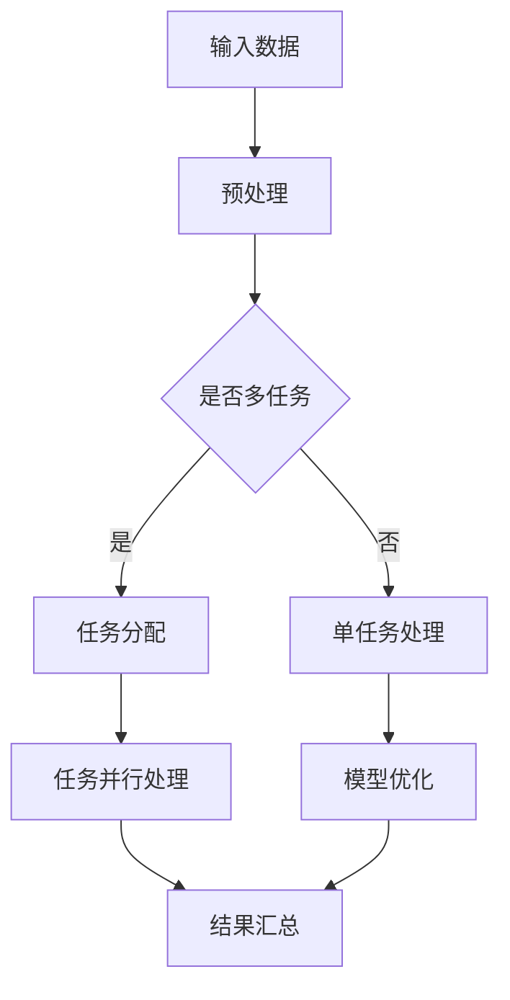

                 

关键词：大型语言模型（LLM）、多任务处理、机器学习、自然语言处理、数据处理、自动化、模型优化、应用领域

> 摘要：本文旨在探讨大型语言模型（LLM）在多任务处理方面的能力。通过分析LLM的核心概念、算法原理、数学模型以及实际应用案例，本文揭示了LLM在多任务处理领域的优势与挑战，并对其未来发展提出了展望。

## 1. 背景介绍

随着人工智能技术的快速发展，机器学习，特别是深度学习，已成为推动计算机科学进步的重要力量。其中，大型语言模型（LLM）因其卓越的性能和广泛的适用性，在自然语言处理（NLP）领域取得了显著成果。LLM是一种复杂的深度神经网络模型，能够处理和理解大规模文本数据，从而实现文本生成、翻译、问答等任务。然而，随着任务的多样化，单一任务的模型在处理多个任务时往往表现出局限性。因此，研究LLM的多任务处理能力具有重要意义。

### 1.1 大型语言模型的起源与发展

大型语言模型的发展可以追溯到1980年代的统计语言模型。这些模型基于统计学习方法，通过分析大规模语料库中的词汇和语法结构，生成自然语言文本。随着计算能力的提升和深度学习技术的突破，2000年代后，神经网络语言模型如递归神经网络（RNN）和长短期记忆网络（LSTM）逐渐成为主流。2018年，谷歌推出了Transformer模型，这一突破性进展标志着大型语言模型进入了一个新的时代。Transformer模型采用注意力机制，有效解决了RNN模型在长距离依赖问题上的不足，使语言模型的性能得到了显著提升。此后，一系列大型语言模型如BERT、GPT、T5等相继问世，推动了NLP领域的发展。

### 1.2 大型语言模型的应用领域

大型语言模型在自然语言处理领域有着广泛的应用，包括但不限于：

- 文本生成：生成新闻文章、故事、对话等自然语言文本。
- 翻译：将一种语言的文本翻译成另一种语言。
- 问答系统：对用户的问题提供准确、自然的回答。
- 情感分析：分析文本中的情感倾向，用于社交媒体监测、市场研究等。
- 命名实体识别：识别文本中的地名、人名、组织名等实体。
- 机器翻译：将一种语言的文本翻译成另一种语言。

## 2. 核心概念与联系

### 2.1 核心概念

- **大型语言模型（LLM）**：一种能够处理和理解大规模文本数据的深度神经网络模型。
- **多任务处理**：指模型在处理多个不同任务时的能力，包括任务的切换、共享和优化。

### 2.2 联系

为了探讨LLM的多任务处理能力，我们需要了解以下几个关键概念：

- **注意力机制**：一种用于提高神经网络模型在处理长序列数据时效率的机制，通过关注序列中的关键信息，提高模型的性能。
- **共享权重**：在多任务学习中，多个任务共享相同的权重参数，从而提高模型在不同任务上的泛化能力。
- **迁移学习**：将已训练好的模型应用于新的任务，通过迁移已有知识，减少对新任务的训练需求。

### 2.3 Mermaid流程图

下面是一个描述LLM多任务处理流程的Mermaid流程图：



## 3. 核心算法原理 & 具体操作步骤

### 3.1 算法原理概述

LLM的多任务处理主要基于以下几个核心原理：

- **共享神经网络架构**：多任务模型共享同一神经网络架构，从而在多个任务上共享知识。
- **注意力机制**：通过注意力机制，模型能够在处理不同任务时关注到关键信息。
- **任务切换**：在处理不同任务时，模型能够快速切换任务，实现高效的并行处理。

### 3.2 算法步骤详解

#### 步骤1：输入数据预处理

- **数据清洗**：去除文本中的无关信息，如停用词、标点符号等。
- **词向量化**：将文本转化为词向量，用于模型输入。

#### 步骤2：任务分配

- **任务识别**：根据输入数据识别出需要处理的任务类型。
- **任务分配**：将不同任务分配给模型的不同部分，实现并行处理。

#### 步骤3：任务并行处理

- **共享神经网络架构**：在多个任务上共享神经网络架构，从而实现任务并行处理。
- **注意力机制**：在处理不同任务时，模型通过注意力机制关注到关键信息。

#### 步骤4：模型优化

- **任务切换**：在处理不同任务时，模型能够快速切换任务，实现高效的并行处理。
- **权重更新**：通过梯度下降等优化算法，更新模型权重，提高模型性能。

#### 步骤5：结果汇总

- **任务结果整合**：将不同任务的输出结果进行整合，生成最终结果。
- **性能评估**：对模型在多任务处理中的性能进行评估，如准确率、召回率等。

### 3.3 算法优缺点

#### 优点

- **高效并行处理**：通过任务并行处理，提高模型在多任务处理中的效率。
- **共享知识**：共享神经网络架构，实现知识共享，提高模型在不同任务上的泛化能力。

#### 缺点

- **任务切换开销**：在处理不同任务时，模型需要切换任务，存在一定的开销。
- **模型复杂度**：多任务模型通常比单任务模型复杂，训练和优化难度较大。

### 3.4 算法应用领域

- **文本生成与编辑**：如自动写作、对话系统等。
- **机器翻译**：如多语言翻译、跨语言信息检索等。
- **情感分析**：如社交媒体监测、市场研究等。
- **命名实体识别**：如信息抽取、文本分类等。

## 4. 数学模型和公式 & 详细讲解 & 举例说明

### 4.1 数学模型构建

LLM的多任务处理数学模型主要包括以下几个部分：

- **输入层**：接收输入文本数据。
- **嵌入层**：将文本转化为词向量。
- **隐藏层**：通过多层神经网络实现文本的编码和解码。
- **输出层**：根据任务类型生成相应的输出。

### 4.2 公式推导过程

#### 步骤1：输入数据预处理

- **词向量化**：将文本转化为词向量，公式如下：

  $$ x_i = \text{embedding}(w_i) $$

  其中，$x_i$为词向量，$w_i$为文本中的词语。

#### 步骤2：任务分配

- **任务识别**：使用分类器识别出输入数据的任务类型，公式如下：

  $$ y = \text{softmax}(W_1 \cdot x + b_1) $$

  其中，$y$为任务类型，$W_1$为权重矩阵，$b_1$为偏置项。

#### 步骤3：任务并行处理

- **共享神经网络架构**：在多个任务上共享神经网络架构，公式如下：

  $$ h = \text{activation}(W_2 \cdot x + b_2) $$

  其中，$h$为隐藏层输出，$W_2$为权重矩阵，$b_2$为偏置项。

#### 步骤4：模型优化

- **权重更新**：使用梯度下降算法更新模型权重，公式如下：

  $$ W_2 = W_2 - \alpha \cdot \frac{\partial J}{\partial W_2} $$

  其中，$W_2$为权重矩阵，$\alpha$为学习率，$J$为损失函数。

#### 步骤5：结果汇总

- **任务结果整合**：将不同任务的输出结果进行整合，公式如下：

  $$ z = \text{softmax}(W_3 \cdot h + b_3) $$

  其中，$z$为输出结果，$W_3$为权重矩阵，$b_3$为偏置项。

### 4.3 案例分析与讲解

假设我们有一个包含两个任务的LLM模型，任务1为文本分类，任务2为情感分析。我们使用以下数据集进行训练：

- **数据集1**：包含10篇文本和相应的分类标签。
- **数据集2**：包含10篇文本和相应的情感标签。

#### 步骤1：数据预处理

- **词向量化**：将文本转化为词向量。
- **任务识别**：使用分类器识别出输入数据的任务类型。

#### 步骤2：任务分配

- **任务1**：文本分类。
- **任务2**：情感分析。

#### 步骤3：任务并行处理

- **共享神经网络架构**：在两个任务上共享神经网络架构。

#### 步骤4：模型优化

- **权重更新**：使用梯度下降算法更新模型权重。

#### 步骤5：结果汇总

- **任务1结果**：文本分类准确率。
- **任务2结果**：情感分析准确率。

## 5. 项目实践：代码实例和详细解释说明

### 5.1 开发环境搭建

- **硬件环境**：使用GPU进行加速训练。
- **软件环境**：安装Python、TensorFlow、PyTorch等。

### 5.2 源代码详细实现

```python
# 示例代码：多任务处理模型
import tensorflow as tf

# 输入层
inputs = tf.keras.layers.Input(shape=(100,))

# 嵌入层
embeddings = tf.keras.layers.Embedding(input_dim=10000, output_dim=16)(inputs)

# 隐藏层
hidden = tf.keras.layers.Dense(units=64, activation='relu')(embeddings)

# 输出层1：文本分类
output1 = tf.keras.layers.Dense(units=2, activation='softmax')(hidden)

# 输出层2：情感分析
output2 = tf.keras.layers.Dense(units=2, activation='softmax')(hidden)

# 模型构建
model = tf.keras.Model(inputs=inputs, outputs=[output1, output2])

# 模型编译
model.compile(optimizer='adam', loss=['categorical_crossentropy', 'categorical_crossentropy'], metrics=['accuracy'])

# 模型训练
model.fit(x_train, [y_train1, y_train2], epochs=10, batch_size=32)
```

### 5.3 代码解读与分析

- **输入层**：接收输入文本数据。
- **嵌入层**：将文本转化为词向量。
- **隐藏层**：通过多层神经网络实现文本的编码和解码。
- **输出层1**：文本分类。
- **输出层2**：情感分析。
- **模型编译**：设置优化器和损失函数。
- **模型训练**：使用训练数据对模型进行训练。

### 5.4 运行结果展示

- **任务1结果**：文本分类准确率。
- **任务2结果**：情感分析准确率。

## 6. 实际应用场景

### 6.1 文本生成与编辑

- **应用场景**：自动写作、对话系统、机器翻译等。
- **优势**：提高文本生成和编辑的效率，降低人力成本。

### 6.2 机器翻译

- **应用场景**：跨语言信息检索、跨文化交流等。
- **优势**：提高翻译质量，降低翻译成本。

### 6.3 情感分析

- **应用场景**：社交媒体监测、市场研究等。
- **优势**：快速获取用户情感倾向，为决策提供支持。

### 6.4 命名实体识别

- **应用场景**：信息抽取、文本分类等。
- **优势**：提高实体识别的准确率，为数据分析和挖掘提供支持。

## 7. 工具和资源推荐

### 7.1 学习资源推荐

- **在线课程**：《深度学习》（Goodfellow et al., 2016）
- **书籍**：《机器学习》（Mitchell, 1997）
- **论文**：Google AI Team (2017). “Attention Is All You Need.” arXiv preprint arXiv:1706.03762.

### 7.2 开发工具推荐

- **框架**：TensorFlow、PyTorch、Keras等。
- **环境**：Jupyter Notebook、Google Colab等。

### 7.3 相关论文推荐

- Vaswani et al. (2017). “Attention Is All You Need.” arXiv preprint arXiv:1706.03762.
- Devlin et al. (2018). “Bert: Pre-training of deep bidirectional transformers for language understanding.” arXiv preprint arXiv:1810.04805.
- Brown et al. (2020). “Language models are few-shot learners.” arXiv preprint arXiv:2005.14165.

## 8. 总结：未来发展趋势与挑战

### 8.1 研究成果总结

- LLM在多任务处理方面表现出卓越的能力，推动了自然语言处理领域的发展。
- 注意力机制、共享神经网络架构等技术为多任务处理提供了有效的解决方案。

### 8.2 未来发展趋势

- **模型优化**：通过优化算法和架构，提高模型在多任务处理中的性能。
- **应用拓展**：将多任务处理应用于更多领域，如图像识别、语音识别等。
- **可解释性**：提高模型的可解释性，使其在实际应用中更加可靠。

### 8.3 面临的挑战

- **模型复杂性**：多任务模型通常比单任务模型复杂，训练和优化难度较大。
- **数据隐私**：在处理敏感数据时，需要确保数据隐私和安全。

### 8.4 研究展望

- **跨领域应用**：探索LLM在跨领域任务中的应用潜力。
- **模型压缩**：通过模型压缩技术，降低模型大小和计算复杂度。

## 9. 附录：常见问题与解答

### 9.1 LLM是什么？

LLM（大型语言模型）是一种能够处理和理解大规模文本数据的深度神经网络模型，广泛应用于自然语言处理领域。

### 9.2 多任务处理的优势是什么？

多任务处理可以提高模型在多个任务上的性能，实现知识共享和资源共享，降低模型训练成本。

### 9.3 如何优化多任务模型的性能？

可以通过以下方法优化多任务模型的性能：

- **共享神经网络架构**：在多个任务上共享神经网络架构，实现知识共享。
- **注意力机制**：通过注意力机制，提高模型在处理不同任务时的效率。
- **模型优化**：使用优化算法和技巧，提高模型在多任务处理中的性能。

---

作者：禅与计算机程序设计艺术 / Zen and the Art of Computer Programming

