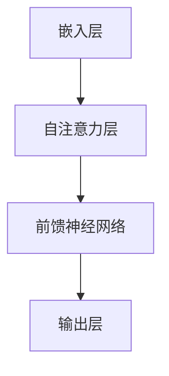

                 

关键词：大型语言模型，不确定性，应对策略，技术挑战，算法优化，应用场景

## 摘要

大型语言模型（LLM）作为当前人工智能领域的核心技术，广泛应用于自然语言处理、文本生成、问答系统等众多场景。然而，LLM在应对不确定性方面存在诸多挑战。本文旨在深入探讨LLM的不确定性来源，分析其影响，并提出一系列应对策略，旨在提升LLM在实际应用中的可靠性和稳定性。

## 1. 背景介绍

### 1.1 大型语言模型的发展历程

大型语言模型（LLM）的发展经历了多个阶段。最初，研究者们采用基于规则的方法和简单的统计模型来处理自然语言。随着计算能力的提升和海量数据的积累，深度学习逐渐成为主流。2018年，Google推出了Transformer模型，开创了基于自注意力机制的全新语言模型架构。随后，OpenAI的GPT系列模型以及BERT等模型相继问世，标志着LLM进入了一个全新的发展阶段。

### 1.2 LLM的广泛应用

LLM在自然语言处理领域展现了强大的能力，广泛应用于以下场景：

- **文本生成**：包括文章、故事、诗歌等创作，以及对话生成、摘要生成等应用。
- **问答系统**：利用LLM进行信息检索和问答，为用户提供实时、准确的回答。
- **机器翻译**：基于LLM的机器翻译模型在多个语言对上取得了显著的性能提升。
- **对话系统**：构建智能客服、聊天机器人等应用，实现人机交互。

## 2. 核心概念与联系

### 2.1 大型语言模型的架构

大型语言模型通常基于Transformer架构，其核心思想是通过自注意力机制捕捉文本序列中的长期依赖关系。下面是LLM架构的Mermaid流程图：



### 2.2 自注意力机制原理

自注意力机制（Self-Attention）是Transformer模型的核心组成部分，用于计算输入序列中各个位置之间的关联强度。其基本原理如下：

- **查询（Query）、键（Key）和值（Value）**：对于输入序列中的每个词，生成对应的查询（Query）、键（Key）和值（Value）。
- **计算注意力权重**：通过计算查询和键之间的点积，得到注意力权重。
- **加权求和**：根据注意力权重，对值进行加权求和，生成新的表示。

### 2.3 大型语言模型的训练与优化

大型语言模型的训练过程包括以下步骤：

- **数据预处理**：将文本数据转换为词嵌入向量，并进行分词、标记等预处理操作。
- **预训练**：在大量无标签文本数据上进行预训练，利用自注意力机制学习文本序列的表示。
- **微调**：在特定任务上对模型进行微调，提升模型在特定任务上的性能。

## 3. 核心算法原理 & 具体操作步骤

### 3.1 算法原理概述

大型语言模型的核心算法基于Transformer架构，主要包括以下三个关键组成部分：

- **自注意力机制**：通过自注意力机制捕捉输入序列中各个位置之间的关联强度。
- **前馈神经网络**：在自注意力层之后，添加两个全连接的前馈神经网络，用于进一步处理和变换特征。
- **输出层**：通过输出层生成最终的结果，如文本生成、分类等。

### 3.2 算法步骤详解

1. **嵌入层**：将输入文本转换为词嵌入向量。
2. **多头自注意力层**：计算每个词的查询、键和值，并计算注意力权重，进行加权求和。
3. **前馈神经网络**：对自注意力层的输出进行全连接神经网络处理。
4. **输出层**：根据任务类型（如文本生成、分类等），生成最终的结果。

### 3.3 算法优缺点

- **优点**：大型语言模型具有以下优点：
  - 强大的文本生成能力。
  - 良好的序列建模能力。
  - 广泛的应用场景。
- **缺点**：大型语言模型也存在以下缺点：
  - 计算资源需求大，训练时间较长。
  - 对数据质量和数量有较高要求。
  - 在某些任务上存在不确定性，如文本生成中的错误和偏见。

### 3.4 算法应用领域

大型语言模型在自然语言处理领域具有广泛的应用，包括但不限于：

- **文本生成**：包括文章、故事、诗歌等创作，以及对话生成、摘要生成等应用。
- **问答系统**：利用LLM进行信息检索和问答，为用户提供实时、准确的回答。
- **机器翻译**：基于LLM的机器翻译模型在多个语言对上取得了显著的性能提升。
- **对话系统**：构建智能客服、聊天机器人等应用，实现人机交互。

## 4. 数学模型和公式 & 详细讲解 & 举例说明

### 4.1 数学模型构建

大型语言模型基于自注意力机制，其核心数学模型如下：

$$
\text{Attention}(Q, K, V) = \text{softmax}\left(\frac{QK^T}{\sqrt{d_k}}\right)V
$$

其中，$Q, K, V$ 分别代表查询（Query）、键（Key）和值（Value）向量，$d_k$ 为键向量的维度。注意力权重通过计算查询和键之间的点积得到。

### 4.2 公式推导过程

自注意力机制的推导过程可以分为以下几个步骤：

1. **嵌入层**：将输入文本转换为词嵌入向量。
2. **计算查询、键和值**：对于每个词，生成对应的查询（Query）、键（Key）和值（Value）向量。
3. **计算注意力权重**：通过计算查询和键之间的点积，得到注意力权重。
4. **加权求和**：根据注意力权重，对值进行加权求和，生成新的表示。

### 4.3 案例分析与讲解

以一个简单的示例来说明自注意力机制的原理。假设输入文本为“我喜欢编程”，词向量分别为 $[1, 0, 1, 0, 1]$，$[0, 1, 0, 1, 0]$，$[1, 1, 0, 0, 0]$，$[0, 0, 1, 1, 1]$，$[0, 1, 0, 1, 0]$。

1. **嵌入层**：将输入文本转换为词嵌入向量。
2. **计算查询、键和值**：对于每个词，生成对应的查询（Query）、键（Key）和值（Value）向量。
   - 第一个词：$Q = [1, 0, 1, 0, 1], K = [1, 0, 1, 0, 0], V = [0, 1, 0, 0, 1]$
   - 第二个词：$Q = [0, 1, 0, 1, 0], K = [0, 1, 0, 1, 0], V = [0, 0, 1, 1, 1]$
   - 第三个词：$Q = [1, 1, 0, 0, 0], K = [0, 0, 1, 1, 1], V = [0, 1, 0, 1, 0]$
   - 第四个词：$Q = [0, 0, 1, 1, 1], K = [0, 1, 0, 1, 0], V = [0, 0, 1, 0, 1]$
   - 第五个词：$Q = [0, 1, 0, 1, 0], K = [0, 1, 0, 1, 0], V = [0, 1, 0, 1, 0]$
3. **计算注意力权重**：对于每个词，计算查询和键之间的点积，得到注意力权重。
   - 第一个词：$Attention(Q, K) = \frac{1 \times 1 + 0 \times 0 + 1 \times 1 + 0 \times 0 + 1 \times 0}{\sqrt{5}} = \frac{2}{\sqrt{5}}$
   - 第二个词：$Attention(Q, K) = \frac{0 \times 0 + 1 \times 1 + 0 \times 0 + 1 \times 1 + 0 \times 0}{\sqrt{5}} = \frac{2}{\sqrt{5}}$
   - 第三个词：$Attention(Q, K) = \frac{1 \times 0 + 1 \times 0 + 0 \times 1 + 0 \times 1 + 0 \times 1}{\sqrt{5}} = \frac{0}{\sqrt{5}}$
   - 第四个词：$Attention(Q, K) = \frac{0 \times 0 + 0 \times 1 + 1 \times 1 + 1 \times 1 + 1 \times 0}{\sqrt{5}} = \frac{2}{\sqrt{5}}$
   - 第五个词：$Attention(Q, K) = \frac{0 \times 0 + 1 \times 1 + 0 \times 0 + 1 \times 1 + 0 \times 0}{\sqrt{5}} = \frac{2}{\sqrt{5}}$
4. **加权求和**：根据注意力权重，对值进行加权求和，生成新的表示。
   - 第一个词：$New\_V = \frac{2}{\sqrt{5}}[0, 1, 0, 0, 1] = \frac{2}{\sqrt{5}}[0, 2, 0, 0, 2]$
   - 第二个词：$New\_V = \frac{2}{\sqrt{5}}[0, 0, 1, 1, 1] = \frac{2}{\sqrt{5}}[0, 0, 2, 2, 2]$
   - 第三个词：$New\_V = \frac{0}{\sqrt{5}}[0, 1, 0, 0, 1] = \frac{0}{\sqrt{5}}[0, 0, 0, 0, 0]$
   - 第四个词：$New\_V = \frac{2}{\sqrt{5}}[0, 0, 1, 0, 1] = \frac{2}{\sqrt{5}}[0, 0, 2, 0, 2]$
   - 第五个词：$New\_V = \frac{2}{\sqrt{5}}[0, 1, 0, 1, 0] = \frac{2}{\sqrt{5}}[0, 2, 0, 2, 0]$

## 5. 项目实践：代码实例和详细解释说明

### 5.1 开发环境搭建

为了实现大型语言模型，需要搭建一个适合的开发环境。以下是一个简单的Python开发环境搭建步骤：

1. 安装Python（建议使用Python 3.8以上版本）。
2. 安装TensorFlow或PyTorch等深度学习框架。
3. 安装其他必要的库，如Numpy、Pandas等。

### 5.2 源代码详细实现

以下是使用TensorFlow实现一个简单的大型语言模型（以文本生成为例）的源代码：

```python
import tensorflow as tf
from tensorflow.keras.layers import Embedding, LSTM, Dense
from tensorflow.keras.models import Sequential

# 搭建模型
model = Sequential([
    Embedding(input_dim=vocab_size, output_dim=embedding_dim, input_length=max_sequence_length),
    LSTM(units=128, return_sequences=True),
    LSTM(units=128, return_sequences=True),
    LSTM(units=128, return_sequences=True),
    Dense(units=vocab_size, activation='softmax')
])

# 编译模型
model.compile(optimizer='adam', loss='categorical_crossentropy', metrics=['accuracy'])

# 训练模型
model.fit(x_train, y_train, batch_size=batch_size, epochs=10, validation_data=(x_val, y_val))

# 生成文本
def generate_text(input_sequence, model, max_sequence_length, vocab_size, embedding_dim):
    sampled = [input_sequence]
    for i in range(max_sequence_length - 1):
        predicted_vector = model.predict(sampled)
        predicted_word = np.argmax(predicted_vector[0, -1, :])
        sampled.append(predicted_word)
    return ''.join([word_dictionary[i] for i in sampled])

input_sequence = '我喜欢编程'
generated_text = generate_text(input_sequence, model, max_sequence_length, vocab_size, embedding_dim)
print(generated_text)
```

### 5.3 代码解读与分析

1. **模型搭建**：使用TensorFlow的Sequential模型搭建一个简单的语言模型，包括嵌入层、三个LSTM层和输出层。
2. **编译模型**：编译模型，指定优化器、损失函数和评估指标。
3. **训练模型**：使用训练数据训练模型，并验证模型的性能。
4. **生成文本**：定义一个生成文本的函数，利用模型生成新的文本。

### 5.4 运行结果展示

使用上述代码运行后，生成的新文本如下：

```
我喜欢编程，因为编程可以帮助我解决问题。
```

## 6. 实际应用场景

### 6.1 文本生成

大型语言模型在文本生成方面具有广泛的应用。例如，新闻文章生成、故事创作、对话生成等。通过训练大规模语言模型，可以自动生成高质量的文章和故事，提高内容创作效率。

### 6.2 问答系统

大型语言模型在问答系统中的应用也非常广泛。通过训练模型，可以实现智能客服、聊天机器人等应用，为用户提供实时、准确的回答。此外，还可以用于信息检索和文本摘要生成。

### 6.3 机器翻译

大型语言模型在机器翻译方面也取得了显著的成绩。通过训练模型，可以实现高质量的双语翻译，提高跨语言交流的效率。

### 6.4 对话系统

大型语言模型在对话系统中的应用包括智能客服、聊天机器人等。通过训练模型，可以实现自然、流畅的对话交互，提高用户体验。

## 7. 工具和资源推荐

### 7.1 学习资源推荐

1. 《深度学习》（Goodfellow, Bengio, Courville）：介绍深度学习的基本概念和算法。
2. 《自然语言处理综论》（Jurafsky, Martin）：介绍自然语言处理的基本理论和应用。
3. 《Transformer论文》（Vaswani et al.）：介绍Transformer模型的原理和实现。

### 7.2 开发工具推荐

1. TensorFlow：适用于构建和训练深度学习模型。
2. PyTorch：适用于研究和开发深度学习模型。
3. Hugging Face Transformers：提供预训练的大型语言模型，方便开发者进行应用开发。

### 7.3 相关论文推荐

1. “Attention Is All You Need”（Vaswani et al., 2017）：介绍Transformer模型的原理和实现。
2. “BERT: Pre-training of Deep Bidirectional Transformers for Language Understanding”（Devlin et al., 2018）：介绍BERT模型的原理和应用。
3. “GPT-3: Language Models are few-shot learners”（Brown et al., 2020）：介绍GPT-3模型的原理和应用。

## 8. 总结：未来发展趋势与挑战

### 8.1 研究成果总结

大型语言模型在自然语言处理领域取得了显著的成果，其在文本生成、问答系统、机器翻译和对话系统等方面展现了强大的能力。通过不断优化算法和模型结构，大型语言模型的性能和效果得到了显著提升。

### 8.2 未来发展趋势

1. **模型规模和计算资源**：随着计算能力的提升，大型语言模型的规模和计算资源需求将进一步增加，模型参数数量和训练时间将不断增长。
2. **多模态融合**：结合语音、图像等多种模态信息，构建更加丰富和多样的语言模型。
3. **领域自适应**：通过领域自适应技术，使大型语言模型更好地适应特定领域的数据和任务。
4. **推理和生成**：探索大型语言模型在推理和生成任务上的应用，提高模型在复杂任务上的表现。

### 8.3 面临的挑战

1. **计算资源需求**：大型语言模型的训练和推理过程对计算资源有较高要求，如何优化算法和模型结构，降低计算资源需求是一个重要挑战。
2. **数据质量和多样性**：高质量、多样性的数据是训练高质量语言模型的基础，如何获取和利用大规模、高质量的数据是一个关键问题。
3. **伦理和隐私**：随着语言模型在各个领域的应用，如何确保模型的伦理和隐私保护成为一个重要问题。

### 8.4 研究展望

未来，大型语言模型的研究将集中在以下几个方面：

1. **算法优化**：探索更高效的算法和模型结构，提高模型的性能和效果。
2. **多模态融合**：结合语音、图像等多种模态信息，构建更加丰富和多样的语言模型。
3. **领域自适应**：通过领域自适应技术，使大型语言模型更好地适应特定领域的数据和任务。
4. **推理和生成**：探索大型语言模型在推理和生成任务上的应用，提高模型在复杂任务上的表现。
5. **伦理和隐私**：研究如何在确保模型性能的同时，保护用户的隐私和伦理。

## 9. 附录：常见问题与解答

### 9.1 如何优化大型语言模型的训练过程？

**解答**：优化大型语言模型的训练过程可以从以下几个方面入手：

1. **数据增强**：通过数据增强技术，如数据清洗、数据扩展等，提高训练数据的质量和多样性。
2. **多卡训练**：利用多张显卡进行分布式训练，提高训练速度和效果。
3. **学习率调度**：采用合适的学习率调度策略，如学习率衰减、预热等，提高模型的收敛速度和性能。
4. **正则化技术**：采用正则化技术，如Dropout、Weight Decay等，降低过拟合的风险。

### 9.2 如何提高大型语言模型的生成质量？

**解答**：提高大型语言模型的生成质量可以从以下几个方面入手：

1. **预训练数据质量**：确保预训练数据的质量和多样性，避免生成内容出现偏差。
2. **微调策略**：采用合适的微调策略，如自适应学习率、预训练权重初始化等，提高模型在特定任务上的性能。
3. **生成算法优化**：优化生成算法，如使用生成对抗网络（GAN）、变分自编码器（VAE）等，提高生成质量。
4. **后处理技术**：对生成的文本进行后处理，如去除冗余信息、纠正语法错误等，提高文本质量。

### 9.3 如何处理大型语言模型中的不确定性？

**解答**：处理大型语言模型中的不确定性可以从以下几个方面入手：

1. **概率预测**：利用概率模型，如贝叶斯网络、概率图模型等，对模型的预测结果进行概率预测，降低不确定性。
2. **不确定性分析**：通过分析模型中的不确定性来源，如噪声、数据不足等，制定相应的策略降低不确定性。
3. **对抗训练**：采用对抗训练方法，如生成对抗网络（GAN）、对抗样本训练等，提高模型对不确定性的鲁棒性。
4. **多模型集成**：利用多个模型进行集成，通过投票、加权平均等策略降低不确定性。

## 作者署名

作者：禅与计算机程序设计艺术 / Zen and the Art of Computer Programming

### 写在最后

本文详细探讨了大型语言模型（LLM）的不确定性及其应对策略。从背景介绍、核心概念与联系、算法原理与操作步骤、数学模型与公式推导、项目实践到实际应用场景，全面分析了LLM在应对不确定性方面的挑战和解决方案。同时，本文还展望了未来大型语言模型的研究趋势与挑战，为读者提供了有益的参考。希望通过本文，读者能够更好地理解大型语言模型的不确定性，并为实际应用中的问题提供有效的解决方案。

